# 第三十章：级数

## 引言

无限级数是有用的数学工具。我们讨论它们的收敛性，幂级数的性质，以及确定它们和的方法。

## 主题

30.1  引言

30.2  交替序列收敛的条件

30.3  绝对收敛的条件

30.4  幂级数和收敛半径

30.5  操作绝对收敛级数

30.6  计算级数的部分和

30.7  幂级数系数的表达式

30.8  傅立叶级数

## 30.1 引言

无限级数是一系列项的无限和。以下是一些例子：

谐波级数

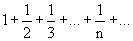

几何级数

交替谐波级数

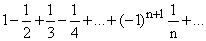

指数级数

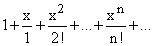

我们可以将任何级数与一个序列相关联，称为该级数的**部分和序列**。级数的第 j 个部分和被定义为其前 j 个项的和。

因此，给定级数

a[1] + a[2] +...+ a[n] +...

我们通过以下方式定义 s[j]

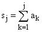

**如果一个*序列*收敛到值 A，那么对于任何正标准 c，存在一个 n，使得序列中第 n 个之后的所有项都在以 A 为中心、半径为 c 的区域内。**

**如果一个*级数*的部分和序列收敛到 A，那么该级数被认为收敛到 A，A 被称为其极限。**

我们区分级数的两种收敛方式。如果级数的绝对值序列，|a[j]|收敛，则称级数为**绝对收敛**。一个同时具有正负项的级数可以收敛，尽管它不是绝对收敛的。

例如，谐波级数根本不收敛，因此交替谐波序列不是绝对收敛的。然而，交替级数确实收敛。当|x| < 1 时，几何级数绝对收敛。当 x = 1 时，它发散，当 x = -1 时，它不收敛，但实际上在某种意义上是“可求和的”，我们将看到。

一个绝对收敛的级数可以以许多方式进行操作而不改变其值。因此，你可以重新排列它的项，可以逐项积分或微分，基本上可以将其视为有限级数。

一个收敛但不绝对收敛的序列可以被赋予一个值，但你必须非常小心。你不能重新排列它的项；那可能会将其值改变为几乎任何东西。事实上，对它的任何操作都是可疑的。

发散的级数通常是非常有趣甚至有用的，尽管具有这种性质。这可以通过以下（至少）四种方式发生：

首先，即使级数不收敛，你可能也能通过可求和性的概念给这样的级数赋予一个值。如果其部分和序列收敛，则级数是收敛的。如果其前 k 个部分和的平均序列收敛，则称为 C1 可求和。因此，级数

1 - 1 +1 - 1 ...

有部分和

1, 0, 1, 0, 1, 0, ...

它们不收敛。然而，前 k 项的平均值形成序列

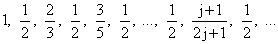

它收敛到 1/2，因此这个级数是 C[1]可求和的。

你可以进一步定义 C[2]和更一般的 C[k]可求和性：级数的部分和的平均序列定义了一个以它们为部分和的级数；如果这个级数是 C[1]可求和的，那么原始级数被称为 C[2]可求和。

**练习：**

**30.1 找到一个 C[2]可求和但不是 C[1]可求和的级数。（提示：看看前 k 项的平均值为 1, 0, 1, 0, ...的级数）**

**30.2 给出 C[j]可求和性的一个合理定义。**

其次，你可能会注意到级数的部分和 s[n]与某个函数 n 的差异（随着 n 的增加而趋向无穷大）收敛。因此，调和级数的第 n 个部分和与函数 ln(n)的差异逐渐趋近于一个常数 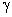，我们将在下面讨论。称为欧拉常数。

第三，当你处理幂级数时，你可能能够通过称为“解析延拓”的一些过程之一赋予发散级数意义，我们也将讨论这个问题。

最后，我们有时会遇到幂级数，其项是隐式定义的，我们对系数值感兴趣，而这些系数值与任何实际序列的值无关。这样的实体称为形式幂级数，即使对于每个可能的非零参数它都发散，也可能会有用。

## 30.2 交替序列收敛的条件

一个项交替为正负的序列称为**交替序列**，如果满足两个简单条件，这样的序列将收敛：

**1\. 其项的绝对值递减：因此我们有 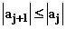。**

**2\. 这些项收敛于 0。**

这两个条件中第二个是收敛的必要条件；第一个不是。

为什么这些条件足以收敛？

我们可以将连续的一对项从一开始或第一个项之后组合在一起。这些导致我们得到以下两个表达式

(a[1] + a[2]) + (a[3] + a[4]) + (a[5] + a[6]) + (a[7] + a[8]) + ...

和

a[1] + (a[2] + a[3]) + (a[4] + a[5]) + (a[6] + a[7]) + (a[8] + a[9]) + ...

请注意，由于级数项交替为正负，括号中的项是相邻项绝对值的差值，根据我们的第一个条件，它们都具有它们第一个项的符号。

例如，假设 a[1] 为正数。那么第一个表达式中的所有项都是正数，它的部分和将增加。另一方面，第二个表达式中第一项后的所有项都将是负数，它的部分和将减少。因此，我们级数的偶数部分和都在最终和之下，并且会增加，而奇数部分和会在最终和之上，并且会减少。

所以所有后续部分和必须在每个阶段都夹在任意两个相继和之间。

根据我们的第二个条件，连续部分和之间的差异（它们是级数本身的项）趋近于 0，这意味着部分和的值受限于逐渐接近 0 的区间，这意味着部分和在柯西意义上收敛（它们的差异趋近于 0）。

每个交替级数都遵循上述两个条件，第一项为正数，则奇数部分和递减，偶数部分和递增。这意味着对部分和的连续两两求平均比部分和本身更接近总和。

交替调和级数具有奇妙的性质，经过这样的平均后，结果的偶数和奇数平均仍在增加和减少，如果你平均这些的一对，然后平均你得到的一对，依此类推，这个性质被保留下来。这些事实可以用来极其精确地找到这个序列的值，只需查看它们的前几项。

你可以通过复制一条指令在电子表格上对连续项求平均，并根据前文所述的方式重复这样做。你会惊讶地发现，你可以从前 25 个项中确定其总和的精确程度，其中最小的项为 0.04。

**练习 30.3 使用电子表格找到交替调和序列的前 40 个部分和。然后取连续对的和并重复 20 次。（这可以通过一条形如 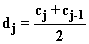 的指令完成，复制到列 d、e、f、g 中，...）**

你发现了什么？从这些数据中你能多精确地确定这个序列的总和？仅从前 20 个部分和可以吗？**

## 30.3 绝对收敛条件

表征级数其行为最能传达一般级数行为的是**等比级数。** 这是关于变量 x 的幂级数，其项是 x 的未修饰幂。

G = 1 + x + x² + ... + x^n + ...

它具有一个很好的特性，即如果你从中减去 1，然后除以 x，你会得到它本身。

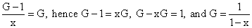

这个级数具有绝对收敛性，当 |x| < 1 时，并且当 x 为 1 时具有奇点。它的公式在 x = 1 处无限，级数本身变为 1 + 1 + 1 + ...，显然发散。

确定给定级数是否绝对收敛的最一般方法称为**比较测试：**您将您的系列与另一个系列进行比较。**如果另一个系列绝对收敛并且您的系列中的每个项的绝对值小于其中相应的项，则您的系列也将绝对收敛。**

同样，**如果另一个系列不是绝对收敛的，并且您的每个项的绝对值大于另一个系列中相应的项，则您的系列也将发散。**

几何级数为这个测试提供了一个基本的比较序列。由于它在 x < 1 时收敛，我们可以得出结论，**对于连续项的比率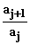始终至多为某个 x 值，其中 x < 1，将绝对收敛。**

此声明定义了绝对收敛的**比值测试**。

当连续项的比率始终大于 1 时，很明显该级数**不**会绝对收敛。从现在开始，让我们假设我们序列中的所有项都是正的。（这既不帮助也不妨碍绝对收敛。）有了这个假设，我们可以讨论普通收敛，实际上我们在谈论绝对收敛。

当连续项的比率随着 n 的增加接近 1 时，或者当它在 1 周围波动时，会出现有趣的问题。

调和级数提供了这样一个序列的良好例子。

由于其第 n 项是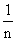，连续项的比率是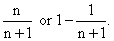这对于收敛来说不够小，因为这个级数发散。

这里有一个看出它发散的简单方法。注意，在第一个项之后，还有一个更大的项（即第二个项），再加上两个更大的项，四个更大的项，八个更大的项，依此类推。通常，将部分序列的长度从 n 加倍到 2n 会提供 n 个至少为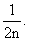的新项。因此，每次将项数加倍都会使部分和至少增加。因此，永远持续下去的总和是无界的。

我们可以通过比较部分和与积分来确定此级数的部分和在第 n 项增加时会发生什么。下面是方法。

我们可以通过**直方图的面积**表示任何正元素序列的前 n 项的和，元素 a[j]对应于位于 x 轴上的 j-1 和 j 之间的宽度为 1、高度为 a[j]的矩形。

每个矩形的右上角的坐标为 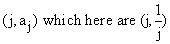。 每个矩形的左上角的坐标类似地为 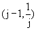。

请注意，由 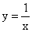 定义的曲线通过前面的每个点，并且完全位于直方图上方，而曲线 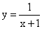 通过第二个序列的点，并且完全位于直方图内部。

现在让我们考虑从 1 到 n 的积分 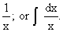

这个积分可以进行，并且答案是 ln(n)。 由于  的曲线明显位于该级数的 n-1 项直方图之上的直方图上方。 我们可以得出结论

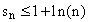

由于矩形的左端点都与曲线 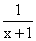 相交，并且从 0 到 n - 1 延伸到直方图下方的区域完全位于直方图的 n-1 之前，我们可以类似地得出结论

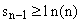

因此

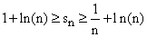

随着 n 的增加，ln(n)趋向于无穷大。 因此，我们已经证明了调和级数发散，但其部分和与 ln(n)之间的差异略小于 1。

**练习 30.4 s[n]与 ln(n)之间的差称为欧拉常数，用希腊字母γ表示，利用电子表格找出这个级数的前 128 个部分和，比较部分和 s[1]、s[2]、s[4]、s[8]、...、s[128]。 使用外推法消除这些部分和之间以 2、4、16、64 等因子下降的差异。 使用这些来估算γ。**

这种确定收敛性的方法同样适用于任何项递减且系数代表可积函数的级数。 它被称为**积分测试**。

在直方图的左上角与矩形相交的函数将位于其下方，而在直方图的右上角相交的函数将位于其上方，其第一个项之后，因此级数的收敛等价于相应函数的积分的收敛。

从这个例子可以清楚地看出，项与项之间按比例下降是不足以导致正数序列收敛的。 另一方面，这个积分测试表明，任何正数 z 的按比例下降为 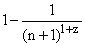 对于收敛是足够的，因为相应的积分将收敛。

**练习 30.5 通过展示适当的积分来验证此断言。**

## 30.4 幂级数与收敛半径

假设我们有一个关于变量 x 的幂级数。

如果它对某个 x 的值收敛，那么它将（通过比较测试）对任何更小的 x 值收敛。

因此，级数将收敛到某个最大值的 x，对于该值，连续项的比率变为 1。

级数收敛的最大 |x| 值称为其**收敛半径**。

很明显，同一个级数代表的函数对于其收敛半径严格小于其绝对值的所有 x 值都是收敛的，并且是无限可微的。

另一方面，在复平面中通常存在一个距离原点给定收敛半径的值 x，此处级数是奇异的。

因此，**级数的收敛半径表示从展开点到函数奇点的最近距离。**

例如，x 的几何级数（(1-x)^(-1) 的级数）在 x = 1 处发散，1 是其收敛半径，这种行为是所有幂级数的典型特征。

同样的函数 (1-x)^(-1) 可以在参数 -1 处展开为幂级数。由于-1 和奇异点 x = 1 之间的距离为 2，因此该级数的收敛半径为 2。

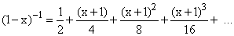

**练习：**

**30.6 通过从右侧减去  并将结果除以 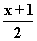，并重新排列得到的结果来证明这个陈述。**

**30.7 找出在 x + 3 的幂级数中展开相同函数的可比较级数。**

**30.8 关于原点展开的指数级数的收敛半径是多少？**

幂级数的另一个好处是，如果你从函数 f 开始，你可以根据泰勒定理推导出关于点 z 的级数展开。f 将有以下展开式

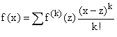

其中 f^((k))(z) 是函数 f 在参数 z 处的第 k 阶导数，求和从 k = 0 开始。

**练习 30.9 通过使用泰勒定理，在 x = -3 处计算其导数，找到以 (1-x)^(-1) 为展开点的级数展开。**

## 30.5 操纵绝对收敛级数

绝对收敛级数的一个好处是，你可以随心所欲地操纵和重新排列它们。

因此，给定这样一个幂级数，你可以在其绝对收敛的收敛半径内逐项积分或逐项微分，其中它绝对收敛。

假设我们从几何级数开始

(1-x)^(-1) = 1 + x + x² + ... + x^n + ...

并且对两边进行积分，对右边的每一项进行积分。

我们得到

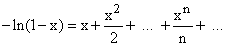

**练习 30.10 对两边再次积分，并使用恒等式 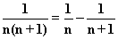 重新排列并解释右边。**

我们也可以逐项对几何级数进行微分。

注意，积分后，项比原来更收敛一些。在微分时，它们变得稍微不那么收敛，但不足以影响收敛半径。

(1-x)^(-2) = 1 + 2x + 3x² + ... + (n+1)x^n + ...

**练习 30.11 再次在这里两边求导，找到关于变量 x 的级数展开式！。检查 x = 0 和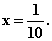时的结果**

## 30.6 计算级数部分和

通过电子表格或程序，计算级数的部分和的值非常容易。

当一个级数的连续项比率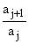小于某个小于 1 的 r 时，随着 j 的增加，项以 r 的指数速度减少，计算级数的值到任意精度时很少出现问题。

当连续项的比率接近 1 时，收敛速度变慢，人们可以通过调整它们来提高计算的准确性。

当第 j 个部分和的收敛速度表现为 j^(-k)时，你可以通过外推来提高收敛速度。

一种方法，正如在许多情况下已经注意到的那样，是用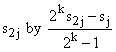替换部分和，它也可以写成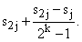

当级数的系数是 j 的标准函数时，这通常发生在整数值的 k 处。

你可以轻松地**检查那些索引相差 2 倍的项的差异比率，以查看部分和是如何收敛的**，并选择一个合适的 k 进行外推。连续这样做可以大大提高计算的准确性。

你甚至可以通过类似外推来确定发散级数的部分和的增长速度。

例如，**考虑 j²的和，显然是发散的。**

通过观察形式为 2^k 的 j 的部分和 s[j]，你可以得出以下推论：

1\. 随着 j 加倍，项大约增加 8 倍。这表明主导项与 n³成正比。（这你可能应该知道。）

2\. 通过观察部分和与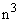的比率并进行外推，你可以看到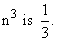的系数

3\. 通过计算部分和的差值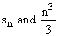，你可以得到另一个序列，其比率随着 n 加倍大约增加 4 倍。

4\. 观察这些比率与 n²的比值，你可以找到 n²的系数，即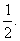

5\. 通过观察部分和的差异与 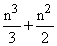 你可以发现它是 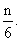

因此，你可以找到公式

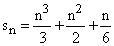

对于这个级数，仅通过数值电子表格操作就可以找到它的前 n 项。

毫无疑问，有更简单的方法来得到这个结果，但如果你习惯于电子表格操作，这种方法确实非常轻松。

当级数收敛时，你可以通过外推得到准确答案，而且几乎不费力气。

通过观察 2 的幂，你可以首先消除部分和与误差之间随着 2 的主导幂减小的差异，然后是下一个，再下一个等等，直到答案精确到你的标准为止。

**练习：**

**30.12 对从 1 开始的系列执行上述步骤，其中 (n+1) 阶项明确为 n²。然后对 (n+1) 阶项 n³ 做同样的操作。**

**30.13 通过适当的外推法，找到 n^(-3) 的和（从 n = 1 开始），精确到十位小数。**

## 30.7 幂级数的系数表达式

到目前为止，我们大部分讨论了当遇到级数时该怎么做。你可以测试其收敛性，估计其极限，并尝试找到它所代表的函数，如果它是幂级数的话。

另一个重要问题是：**如何找到给定函数在某个展开点附近的幂级数展开中的系数？**

我们从我们在第 10.2 节中对泰勒级数的研究中知道，第 j 项的系数将是函数在展开点处的 j 阶导数除以 j 的阶乘。

这是一个有用的事实，但并不总是足够有用，部分因为计算或计算复杂函数的高阶导数可能很麻烦。

幸运的是，我们的标准函数可以在复平面中定义，在其中我们可以利用留数定理给出幂级数的系数的积分表示。

假设我们有一个函数 f(z) 并希望将其在点 z' 处展开成级数。我们知道，任何函数在复平面中围绕一个孤立奇点 z'（且没有其他奇点）的简单闭合路径的积分是 2i 倍其在 z' 处的留数，而 z' 处的留数是 f 在点 z' 处幂级数展开中 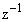 的系数。

因此，我们可以推断出 f(z) 在 z' 处的幂级数展开中的系数 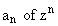，即  在 z = z' 处的留数，是  乘以  在不包括 f 的任何奇点的 z' 周围的任何简单闭合路径上的积分

这种积分可以在没有太大困难的情况下为任何 n 数值地求解。

## 30.8 傅里叶级数

假设我们有一个在原点周围单位圆中非奇异的函数 f(z)。那么它将具有以下形式的幂级数展开式

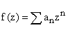

其收敛半径至少为 1。

如果我们在单位圆上观察这个函数，其中 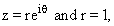，这个级数的形式为 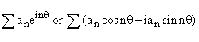，这样如果我们定义 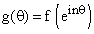，我们有

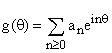

这种类型的级数，或者，或者形式的级数

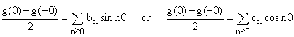

被称为**傅里叶级数。**

每种情况中右侧的级数周期为 2。

通过在正弦或余弦的指数中添加一个常数因子，您还可以创建具有其他周期的傅里叶级数（例如替换 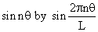 您可以使周期为 L）。

这里的系数 a[n] 可以通过上一节的积分公式确定。

在单位圆中积分，我们可以积分 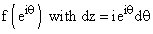 以获得

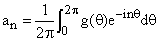

b[n] 和 c[n] 的类似公式为

和

**练习 30.14 通过找到  的 b 和 c 来验证这些公式的正确性**

**函数的傅里叶级数表示在几个方面非常有用。**

首先，余弦和指数函数易于微分。将一个函数表示为指数函数的和实际上是将其表示为导数算子的本征函数的和。这类似于在普通向量空间中使用一组基，其成员都是该空间上某个重要线性变换的特征向量。

第二，如果您分析振荡器（或类似系统）对固定频率的外部强迫响应，您可以通过找到实际强迫函数的傅里叶级数（有时为傅里叶变换，对于非周期函数是类似的东西），找到您系统对实际强迫函数的响应。

当您学习微分方程时，您会更多地了解这一点。

显然，并非所有函数都存在傅里叶级数 ，并且对于在积分范围内奇异的函数也不需要存在。

此外，由于对于所有 n 值都是的偶函数，而是其奇函数，因此正弦和余弦级数分别适用于奇函数和偶函数 g。

您可以将系数的公式应用于任何函数，包括不连续的函数，例如，对于使得 x > 0 的角度，为，否则为的阶跃函数。

所有正弦和余弦函数都是连续的，因此阶跃函数的傅里叶级数的部分和必须是连续的。 这意味着它们在不连续点周围的某个区间内都可能非常错误。 这些区间通常会随着部分和指数的增加而缩小。

如果我们围绕单位圆积分 f 乘以其复共轭，并且其傅里叶级数几乎收敛于它，那么积分应该等于通过将级数代入 g 及其复共轭的积分得到的项之和。

在后者的级数中，所有交叉项都不产生贡献，我们得到了在将级数代入 g 后的结果

由于右侧级数中的项都是正数，所以其部分和必定都小于左侧两个积分中的任意一个。

数学家们已经付出了大量的努力来理解傅里叶级数何时收敛。

**练习：**

**30.15 推导正弦和余弦级数的类似结果。**

**30.16 计算阶跃函数的傅里叶系数，即**

**30.17 将刚才声称的方程应用于这些系数的序列。 你找到了什么？**
