# 第三十一章：进行面积、表面积和体积积分

## 介绍

你遇到的大多数积分都不需要你评估它们。然而，培养一些评估经验是个好主意，以增强你的信心。其中一个通常是通过进行多重积分来完成的，这意味着一系列的普通积分。要做到这一点，你必须做三件事：确定作为你的积分变量的函数的被积函数；确定积分的面积或体积元素；以及找到获得普通积分的适当积分上限。一旦完成了这些步骤，你就可以执行普通积分。我们在这里讨论这些步骤。

## 主题

31.1 介绍

31.2  将曲面参数化或以适当的形式进行积分

31.3  确定被积函数

31.4  确定面积或体积元素

31.5  设置正确的积分上限

31.6  进行积分

## 31.1 介绍

在许多学科中会遇到表面和体积积分以及高维空间中类似的积分。

它们可用于确定表面和体积的面积，例如在力学中感兴趣的惯性矩、概率分布的矩、区域内的质量和电荷、给定电荷分布的电势、通过曲面的流量，以及许多其他事情。

我们将在这里考虑两种类型的积分：通量积分和体积积分。在二维中进行面积积分可以被视为通量积分的简单特殊情况。

以下是你可能会遇到的一些积分示例：

计算高为 h、半径为 r 和密度为  的右圆柱的惯性矩。

计算轴长为 A、B 和 C 的椭球的体积。

计算球面上均匀电荷分布的电势 a。

计算在 0 和 h 之间以半径 r = z² 的圆锥形状的表面积。

曲面可以用几种不同的方式描述。

你可能对曲面有定性描述（它是一个平面或某个位置的球面或圆柱面或锥面等），或者它可以由一个方程来定义：f(x, y, z) = 0。

或者你可以有关于每个 x、y 和 z 的参数表达式。

最简单的情况发生在你的曲面由一个方程描述，并且你可以解方程得到 z 作为 x 和 y 的显式函数，（z = z(x, y)），这样你就可以将 x 和 y 作为两个参数使用。

## 31.2 以参数方式表达曲面或以适当形式进行积分

要处理定性描述，您需要能够写出所讨论表面的方程或参数表示。您应该准备以这种方式处理的重要表面有：平面、球面和椭球面、圆柱面和圆锥面。

我们简要回顾每一个。

平面由线性方程描述

ax + by + cz = d

你总是可以用另外两个变量的形式解出一个变量。系数由平面上给定的条件确定。

以(x', y', z')为中心的半径为 A 的球面由满足方程的空间点组成

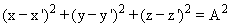

一般椭球的表面特征为

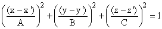

以轴平行于 z 轴、起始于 z = B、终止于 z = C 的半径为 A 的圆柱体的表面由方程表示

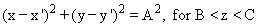

中心线平行于 z 轴的圆锥的表面由描述

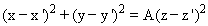

## 31.3 确定被积函数

通常形式的通量积分

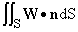

现在假设我们有 S 的参数表示，这意味着我们有方程 x = x(u, v)，y = y(u, v) 和 z = z(u, v)，这定义了我们的曲面。

我们可以将(**W****n**)dS 表示为关于 u 和 v 的显式函数乘以 dudv，并确定结果积分的顺序和限制，将这个积分简化为一系列关于 u 和 v 的普通积分。

这个过程的第一步很直接：

形成向量

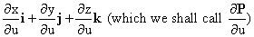

以及类似地

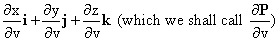

然后，对 u 和 v 进行积分，可以将被积函数写成由**W**的分量，乘以适当符号的行列式的绝对值。

原因请参见第 24.1 节。（这里的向量**n**通常表示相对于某个区域的外向法线，积分的符号是这样的，如果**W**与这个外向方向的点积为正，则结果为正。）

适当的符号必须单独确定，但只需从原始积分的上下文中确定一次。

因此，至少在符号上，积分变为

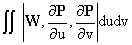

尽管这种简化很直接，但实际执行所需的步骤涉及足够多的代数操作，以至于我几乎总是在执行过程中至少犯一次错误，因此很少能得到相同的答案两次。

幸运的是，在最常见的情况下有一个计算上更简单的答案，即 u 和 v 实际上是你的原始变量之一，比如 x 和 y。

在这种情况下，向量变为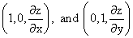，它们的叉乘变为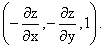

然后被积函数和面积元素可以写成

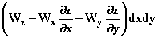

这个结果更容易应用。我们在这里假设符号应该是正的，指向 z 方向向上，如果这个假设是错误的，符号必须被反转。

如果你的曲面由方程 f(x, y, z) = 0 描述，那么相应的具有相同符号假设的公式变为

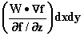

（当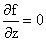时，你必须对另外两个变量进行积分，比如 y 和 z 而不是 x 和 y。）

这里给出的答案既给出了被积函数又给出了面积元素。

唯一需要担心面积元素的时候是当你想要改变变量并且必须确定面积元素 dxdy 在其他变量 u 和 v 中的含义时。

这里有一个例子：我们想要计算通过由方程定义的曲面向外的矢量(x, y, z)的通量

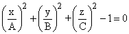

（这个曲面被称为一个椭球。）

我们将仅对 z > 0 的曲面部分进行积分，并将结果加倍，因为曲面的下部提供相同的通量。

将这个写成 f = 0，我们计算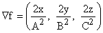并且被积函数变为，根据最后的公式，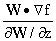，在这种情况下是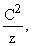，即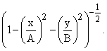

因此，我们的积分变为

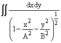

在适当的积分限制下。这些限制是由我们在 xy 平面上积分的区域确定的边界（我们将在下面讨论），也就是，积分中分母为正的区域。

## 31.4 确定面积或体积元素

到目前为止，我们已经解决了进行通量积分时出现的问题。

在体积积分的情况下，到目前为止讨论的问题不存在。

被积函数是被积函数本身，即一个标量场，体积元素是 dxdydz。

然而，当你改变变量时，如何表达这个体积元素的问题确实存在，我们在这里考虑这个问题。这个问题及其答案在任何维度中都是相似的。

此时我们注意到，面积积分是通量积分的简单特例。如果我们想要在 xy 平面上的区域 A 上积分 f(x, y)dA，我们可以在 k 方向上想象出一个第三个维度，并想象我们正在通过该平面上的曲面 A 积分向量 f(x, y)**k**的通量。

这将是（f(x, y)**k**）！图片**n**dS 的积分，如果**n** = **k**在 xy 平面上，这个通量积分就成为 f dxdy 的积分。在这种情况下，与体积情况一样，将表面积分减少到 dxdy 的积分问题是不存在的。

现在假设我们有一个体积或通量积分，并希望从 x、y（如果是体积积分还有 z）变量改变到 u、v（如果是相同的话还有 w）。

当我们认为这样做使被积函数更容易处理时，或者有时如果简化了积分的限制条件时，我们就这样做。

我们希望确定如何用 dudv 或 dudvdw 来表示 dxdy 或 dxdydz。

我们已经注意到了如何做到这一点，但由于其重要性，我们在这里重复一次。

在 u 中做一个小的改变会导致 x、y 和 z 的变化，可以用方程描述为

类似的表达式描述了由于 v 和 w 的变化引起的位置变化 d**P[v]**和 d**P[w]**。

由小的变化 du、dv 和 dw 引起的 xyz 空间中的体积是平行六面体的体积，其边为 d**P[u]**、d**P[v]**和 d**P[w]**，这是行或列是这些向量的行列式的大小。

我们可以将 dudvdw 从向量中提取出来，并获得**dxdydz = Jdudvdw**，其中 J 是由 x、y 和 z 对 u、v 和 w 的导数形成的行列式的大小。

**在面积的情况下，可比较的表达式是相同的：一个变量集合的面积元素 dxdy 与另一个变量集合 dudv 的比值是由 x 和 y 对 u 和 v 的导数形成的行列式的大小。在每种情况下，这个行列式的大小，也称为绝对值，被称为这种变量转换的雅可比行列式。**

## **设置正确的积分限**

要做到这一点，您必须首先决定您希望执行积分的顺序。

有时这并不重要，有时积分的难易程度差异很大。但是，如果您对您的选择不满意，您总是可以决定改变积分的顺序。

所以假设我们有一个面积积分，我们希望先对变量 x 积分，然后对 y 积分。

决定积分限制的第一步，也是最重要的一步，是画出您希望进行积分的区域的图形。该区域通常由一组曲线界定。

对于某些变量 y 的选择，积分限制 x 通常是位于这些边界曲线的两个值，用于此 y 值。你要对 y 进行积分，对于 y 的值，你会得到相同的 x 边界曲线区间。然后你确定每个区间内的一个 y 值。

在大多数情况下，你希望进行积分的 x 值将形成位于这些曲线之间的区间。你必须确定这些曲线是哪些（有时它们是相同的曲线），然后解出每个曲线方程以得到它的 x 值，假设 y 值已知。这些将是你的 x 积分的限制，对于此 y 值。

在某些情况下，x 上的限制涉及到不同的曲线对于不同的 y 值。你必须相应地选择你的 x 积分。

所有这些无疑听起来都很模糊和令人恐惧的困难。

实际上，如果你画一个图，通常是非常容易的。没有图片，确实很难准确理解。而且很容易搞错。

我们考虑一些例子：

假设首先你希望对三角形进行积分，其底边为 y = 0，边由方程 x = 0 和 x + y =1 确定。

对于所有 y 值介于 0 和 1 之间，都有一个 x 区间需要进行积分。

如果你固定 y 在 0 到 1 之间，你将对 x 在 x = 0 和 x + y = 1 之间进行积分，这意味着 x = 1 - y。

因此积分变为

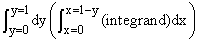

假设你想要对三角形区域进行积分，其界定为 y = x，y = 0 和 x = 1。

再次，你要计算 x 区域的 y 值介于 y = 0 和 y = 1 之间，对于该区间内的任何 y 值，你要对 x 进行积分，x 的取值范围为 x = y 到 x = 1。

然后积分的限制为

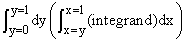

**练习：**

**31.1 假设你想要在这个相同的三角形区域先对 y 进行积分，然后对 x 进行积分。在这种情况下，适当的限制是什么？**

**31.2 假设我们想要从 y 到 2 进行 x 的积分，然后从 y = 0 到 1 进行 y 的积分。这定义了一个梯形。如果我们想要先对 y 进行积分，积分的限制是什么？**

棘手的事情可能会发生，这里有一些要看的例子：

1\. 由 x = 1，x = 2，y = x 和 y = 0 确定的区域。如果你先对 y 进行积分，这很简单。但如果你先对 x 进行积分，你会发现积分必须分成两部分。

在 y = 0 和 y = 1 之间，你必须对 x 在 x = 0 和 x = 1 之间进行积分；在 y = 1 和 y = 2 之间，你必须对 x 在 x = y 和 x = 2 之间进行积分。

2\. 由 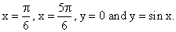 确定的区域。

如果你先对 x 进行积分，那么对于 y 在 0 到  之间，你将从 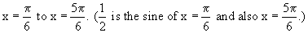 积分

对于 y 大于，你必须在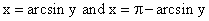之间进行积分，这代表着 y = sin x 的边界曲线上的两个点。

从这些例子中可以清楚地看出，**如果没有足够的图像，几乎不可能正确地完成这些事情**。

**下面是一个用于尝试不同矩形和极坐标下限的 applet。在上述示例和以下区域上试用它：**

**练习：**

**31.3 考虑半径为 A、以原点为中心的圆的内部。x 和 y 或 r 和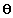的限制是什么？**

**31.4 先对 x 积分然后对 y 积分，反之亦然，找到 y = x³、x = 1、x = 2 和 y = -x³ 之间区域的积分上限。**

**31.5 找到椭圆边界为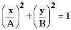的积分上限，还有其他潜在的变量是什么？**

<applet code="IntegrationBounds" codebase="../applets/" archive="integrationBounds.jar,mk_lib.jar,parser_math.jar,jcbwt363.jar" width="760" height="450"></applet>

对于**体积**的积分可以以完全相同的方式进行。

首先，根据您对哪种顺序最方便的猜测，选择一个积分顺序。

然后你创建一个积分区域的图像，并从最后一个积分变量开始确定积分区间，然后逐步向前推进。

对于最后一个，确定它的哪些值对应于您希望在每个固定的边界表面集之间进行积分的区域。

然后你想象，比如说变量 y，在每个这样的区间内是固定的，然后继续下一个变量（最后一个要积分的变量）并在通过固定 y 获得的曲面上做同样的事情。

当你处理直角坐标时，这将是由曲线界定的区域，其余步骤与之前完全相同：

找到 z 的适当区间边界，然后想象在每个相关区间内固定了一个 z 值，然后确定 x 的限制。

**考虑对半径为 A 的球进行积分，其边界表达式为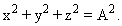**

如果我们选择先积分 x 再积分 z 再积分 y，我们首先注意到 y 的取值范围是从 -A 到 A。

给定一个 y 的值，z 可以从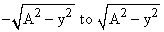变化，固定 z 后，x 可以从变化。

当然，球在极坐标下有更整洁的积分上限

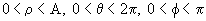

矩形限制尽管勉强可以接受。

**练习：**

**31.6 如果您希望对一个边界为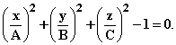的椭球进行积分，确定适当的积分上限。**

-   **31.7 确定矩形和柱坐标系中圆锥内部区域的适当限制，其边界为 z = 1 和 z = r²。（原点是该区域的底部顶点。）**

## -   **31.6 做积分**

-   一旦你在变量上建立了积分限制，并且有了被积函数和正确的微分集合，你就可以开始积分了。然后你就得靠自己了。

-   **练习 31.8** **确定圆锥体和上述椭球体形状的物体关于 z 轴的惯性矩。假设质量密度在物体内部是恒定的。（物体的惯性矩是其密度乘以体积元到 z 轴的距离的平方的积分。但是，它总是表示为体的质量的函数，而不是密度。因此，你必须取积分确定惯性矩，以及确定质量之间的比率，以得到两者之间的关系。）**
