# 第三十二章：一些线性代数

## 介绍

本章包含线性代数基础知识的复习：线性方程的解、矩阵求逆、行列式、变换、不变量、特征值和对角化。

## 主题

32.1   线性方程

32.2   矩阵

32.3   矩阵的逆

32.4   更多关于行列式的内容

32.5   矩阵和变换

32.6   变换的不变量

32.7   对角化的其他概念

32.8   计算特征值和特征向量

32.9   应用于二次形式和弹簧系统

32.10  在电子表格上计算特征值和特征向量

32.11  猜测特征向量

## 32.1 线性方程

假设我们有一组线性方程，**例如**

我们希望 **找到一个解决方案**，这意味着找到 **使这些方程全部成立的显式值的 x、y 和 z。**

允许我们找到解决方案的基本事实是这些：

**1\. 给定任何方程，你都可以将其乘以任意非零数（即，在其左右两边的每个项都乘以）而不改变其含义。**

**2\. 给定任意两个方程，我们定义它们的和为其左手边的和为两个左手边的和，其右手边的和为两个右手边的和的方程。**

**然后你可以用其中一个方程的和替换另一个方程，而加上另一个方程的任意倍数，而不改变它们的含义。**

例如：你可以通过从中减去第三个方程来将上面的顶部方程替换为 3x + 4y = 6；（减去方程等同于加上它的 -1 倍）

**练习 32.1 证明这里的断言 2。** 解答

你可以通过使用刚才提到的这种类型的操作的一系列操作来解方程，将方程转化为 x = a，y = b，z = c 的形式，这是它们的解。

**你应该使用什么样的操作顺序来解方程？**

注意在上面的示例中选择的减法是为了使 z 不出现在被减的方程中，即 3x + 4y = 6。

如果我们对第二个方程做适当倍数的第三个方程的加法，那么结果的和方程中的 z 项也可以类似地被消除；结果是 x - 3y = 6。

我们从三个变量的三个方程开始。

经过这些操作，我们已经从两个方程中消除了 z，并且得到了两个变量的两个方程。

通过类似的操作，我们可以消除 x，例如，通过从第一个方程中减去第二个方程的三倍。然后得到的方程是 13y = -12。

将此方程除以 13，然后我们得到了关于 y 的表达式。

我们可以将其替换为 y，然后代入前两个方程中的任一个，并解出所得方程的 x。

我们得到 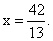 将 x 和 y 替换为任何原始方程中的值，然后给出 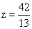 我们有了方程的完整解。

**通常你可以逐个变量地系统地消去所有方程，将 n 个未知数的方程减少为(n-1)个未知数的方程，并重复该过程，直到你可以解出一个未知数的一个方程，然后替换回去以找到其他未知数，一个接一个。**

这个过程称为**“高斯消元法”。**

**练习 32.2 对以下方程组执行高斯消元以找到解**

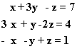

解答

请注意，在进行这些操作时很容易出错，明智的做法是一旦得到答案，就在**所有**原始方程中检查你的答案，看它们是否满足。

**这个过程可能失败吗？**

如果你开始的方程一致，它们将产生唯一的解 **除非** 当你试图通过从另一个方程减去一个方程的倍数来消去一个变量时，你消去了整个方程。

也就是说，在某个阶段，你的一个方程是另一个方程的倍数，减去这个倍数就消去了整个方程。

如果在开始时你的一个方程可以表示为一个或多个其他方程的倍数之和，则会发生这种情况。（最简单的发生方式是当两个方程相同时）

在这种情况下，你的方程的左侧被称为**线性相关**。

否则，当方程有唯一解时，左侧被称为**线性独立**。

当你的方程线性相关时（并且你开始的方程数与你的未知数数相同），你会发现你没有足够的方程来确定唯一的解。

**这并不是一场灾难**，但这意味着有很多解，至少有一整条线。

继续高斯消元过程，直到你只剩下一个非零方程，其中有两个或更多个变量。那么，**任何**解这个方程的解都是原方程组的解，这被称为**欠定方程组**。

例如，假设你的最后一个方程是 x = 2y + 3。

然后你可以选择任意值给 y，计算 x，然后继续使用你的其他方程来计算你的其他未知数，这将是一个解，尽管当然不是唯一可能的解。**像这样的方程的解形成了 xy 平面上的一条线。**

## 32.2 矩阵

矩阵提供了描述线性方程的便捷方式。因此，如果你将未知数的系数按某种标准顺序排列为矩阵的行元素，你就为任何一组方程定义了**系数矩阵。**

对于上面的示例方程，系数矩阵，称为 M，是按照 x、y 和 z 的标准顺序排列的

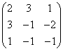

我们可以将原方程写成单一矩阵方程

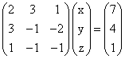

使用矩阵乘法的定义，即：**将第一个矩阵的行与第二个矩阵的列（这里是单列）进行点积，以产生乘积的相应元素**，你应该验证这个矩阵方程与我们最初的三个方程完全相同。

**高斯消元法**可以应用于这种矩阵形式。规则是：

**1\. 你可以将整行（方程两侧）乘以任意非零数，而不改变方程的内容。**

**2\. 你可以将任意行的倍数加到另一行上，而不改变方程的内容。但是，你必须完全跨越整行，包括矩阵的另一侧。**

在这种形式下，这些操作被称为**"初等行操作"**，高斯消元被称为**行简化。**

在这里你要做的是执行足够多的第 2 种操作，**在主对角线的一侧形成矩阵中的 0。**当这样做时，你可以确定一个未知数，然后逐步代入找到其他未知数。

你也可以尝试执行这些操作**直到矩阵主对角线之外的所有元素都是 0**，对角线元素为 1。在这种情况下，右侧向量是相应变量的解，你无需回代找到所有未知数。

**对角元素为 1，非对角元素为 0 的 n 维矩阵**称为**n 维单位矩阵**，通常写为**I**，除非可能引起混淆，此时会写为**I[n]。**

它具有这样的性质，即其与相同维度的任何矩阵 M 的矩阵乘积是 M 本身，并且其对任何 n 维向量**v**的操作是**v**本身。

因此，如果你从矩阵方程**Mv = r**开始，并通过行简化找到另一组相同方程的表示，其中 M 已被简化为单位矩阵 I，你会得到**Iv = r'**，其中**r'是右侧方程上的相同行操作的结果，这些操作将 M 简化为 I。**

你因此得到**解，v = r'。**

## 32.3 矩阵的逆

如果两个方阵 M 和 A 满足**MA = I**（在无限维度中，你还需要条件 AM = I），那么**A 和 M 被称为彼此的逆，我们写为 A = M^(-1)和 M= A^(-1)。**

正如我们所描述的，行简化的一个很棒的特性是，当你有一个矩阵方程 AB = C 时，**你可以将 A 的简化操作同时应用于 A 和 C 的行，而忽略 B，你得到的结果与**你开始的一样正确。

这正是当 B 是列向量，其分量等于我们的未知数 x，y 和 z 时所做的事情，但对于任何矩阵 B 来说同样成立。

因此，假设你从矩阵方程**AA^(-1) = I**开始。

如果我们对 A 进行行简化，使其成为单位矩阵 I，那么这里的左侧变为 IA^(-1)，即 A^(-1)，A 的逆矩阵。然而右侧是**如果你应用必要的行操作将 A 简化为单位矩阵，从单位矩阵 I 开始，你会得到的结果。**

我们可以得出结论，逆矩阵**A^(-1)可以通过将使 A 成为 I 的行简化操作应用于 I 开始的矩阵 A 来获得。**

**例子：** 我们给出一个二维的例子，但这种方法和思想在任何维度都适用，当 n 为数百甚至数千时，计算机可以对 n 乘 n 矩阵进行这样的操作。

假设我们想要以下矩阵的逆矩阵。

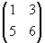

我们可以在其旁边放置一个单位矩阵，并同时对两者进行行操作。这里我们首先从第二行减去第一行的 5 倍，然后将第二行除以-9，然后从第一行减去第二行的三倍。

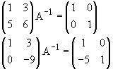

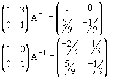

最后一个矩阵是我们原始矩阵 A 的逆矩阵。

注意**A 的行和 A^(-1)的列彼此之间的点积要么为 1，要么为 0，A^(-1)的行和 A 的列也是如此。** 这当然是逆矩阵的定义特性。

**练习 32.3 找到矩阵 B 的逆矩阵，其行为(2 4)；第二行为(1 3)。** 解答

矩阵的逆矩阵在解方程时非常有用，当你需要用不同的右侧解相同的方程时。如果你只想解方程一次，那么这就有点大材小用了。

如果你的原始方程形式为 M**v** = **r**，通过将两边乘以 M^(-1)，你会得到**v** = I**v** = M^(-1)M**v** = M^(-1)**r**，因此你只需将逆矩阵 M^(-1)乘以右侧的**r**，就可以得到方程的解。

如果你考虑在这里计算逆矩阵时所做的事情，并意识到在这个过程中 M^(-1)的不同列根本不相互作用，你**本质上是在解非齐次方程 Mv = r，其中 r 由单位矩阵的三列给出**，**并将结果排列在一起。**

所以我们在这里说的是，为了解一般的方程**r**，只需**对 I 的每一列求解，然后一般线性组合 r 的解是相同的线性组合的相应解。**

**什么矩阵有逆？**

并非每个矩阵都有逆。

正如我们所看到的，当 M 的行**线性相关**时，M 定义的方程组没有唯一解，这意味着对于某些右手边，有很多解，而对于某些右手边则没有解。如果是这样，**矩阵 M 没有逆。**

在三维中刻画行（如果行是线性相关的，则列，如果矩阵是方的，那么列也是线性相关的）的**线性相关性**的一种方法是，由 M 的行（或列）形成的平行六面体的体积为零。

M 的行形成的平行六面体的体积在第二种行操作下不会改变，即向另一行添加倍数的行，尽管如果你将一行的每个元素乘以 c，则会变化为|c|的因子。

体积始终是正数的事实，所以绝对值|c|出现在这里有些尴尬，因此惯例上定义了一个量，**当它为正时是这个体积，但具有线性性质：如果你将一列乘以 c，它的变化因子为 c 而不是|c|。**这个量（在任何维度上都有类似的量）被称为**矩阵 M 的行列式。**

因此，M 的行列式的绝对值是：

在**一维中 M 的单个矩阵元素的绝对值。**

在**二维中，由 M 的行（或者如果您愿意，列）给出的平行四边形的面积。**

在**三维中，以 M 的行（或者列的交替排列）作为边的平行六面体的体积。**

在**更高的维度中，以 M 的行（或列）作为边界的区域的“超体积”或高维模拟体积。**

在**0 维中我们给出它的值为 1。**

行列式 M 的行或列中的任何一个都是**线性的，并且在用任何其他行的任意倍数的和替换其中一行，比如 q 时保持不变。**

这些陈述规定了行列式的符号。**根据约定，行列式对于恒等矩阵 I 的符号被确定为正，其行列式总是 1。**

M 具有逆的条件是：**M 的行列式不为零。**

我们很快将看到如何计算行列式，以及如何用行列式来表示矩阵的逆。

## 32.4 关于行列式的更多信息

我们已经定义了**矩阵的行或列的行列式为线性函数，其大小是由其列或行给出的边界的区域的超体积。**

行列式有一些重要的性质如下：

我们将列出它们然后提供它们的证明。

1\. **列的线性性：** 如果我们有列向量 c(k)和 d(k)，对于 k = 1 到 n，并选择这个范围内的任意 j，则 n 维行列式满足条件

det (c(1), …c(j - 1), **a*c(j) + b*d(j)**, c(j + 1),…,c(n)) = **a***det (c(1), …c(j - 1), **c(j)**, c(j + 1),...,c(n)) + **b***det (c(1), …c(j-1), **d(j)**, c(j + 1),...,c(n)).

2\. **行的线性性：** 请自己写出这个。

3\. **如果两列相同，则行列式为 0。**（行也是如此。）换句话说，如果交换两行（或列），行列式会改变符号。

**4.** 行列式可以通过类似行变换的过程来计算。可以将一行的倍数加到另一行，直到主对角线一侧的所有元素都为 0。

**然后对角线元素的乘积就是行列式。**

5\. **两个矩阵的乘积的行列式等于它们的行列式的乘积。**

6\. 对于矩阵 M 中的任意一列元素，比如 M[1j]，M[2j]，...

行列式可以表示为

**det M = M[1j]*C(1, j) + M[2j]*C(2, j) + ...**

这里出现的量**C(i, j)**被称为**矩阵 M 的余子式**。

**C(i, j)**必须**对 M 的除第 i 行和第 j 列外的所有行和所有列都是线性的，并且如果这两行或列相同，则必须为 0；**因此它**与从 M 中删除第 i 行和第 j 列得到的矩阵的行列式成比例。比例常数结果为(-1)^(i+j)。**

**7\. 矩阵 M 的逆矩阵是其（i, j）-th 元素为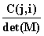的矩阵。**

8\. 如果有一组形如 M**v** = **c**的方程组，则**v**的第 i 个分量由**取 M 并用 c 替换 M 的第 i 列得到的矩阵的行列式除以 M 的行列式**给出。（这个陈述被称为克莱姆法则。）

9\. 矩阵的行列式为 0 的条件意味着由列确定的区域的**超体积为 0**，这意味着**它们线性相关**，并且意味着**存在一个非零线性组合的列是零向量**。这意味着对于这个向量**v**，我们有 M**v** = **0**。

10\. 行列式不受坐标旋转的影响。

11\. 在 x 中的 n 次多项式由**det(M - xI)**定义，称为**矩阵 M 的特征多项式**。其根（满足 it = 0 的解）称为 M 的**特征值**。

现在我们对这些说法进行评论。

前三个立即由行列式的定义作为超体积的线性版本得出。

由此可知，可以在不改变行列式的情况下，将一行的倍数加到另一行上：因为根据线性性，变化必须是具有两个相同行的矩阵的行列式的倍数。

但是你可以一直这样做，直到矩阵是对角线矩阵，此时行列式，再次通过线性性，是对角线元素的乘积乘以单位矩阵的行列式（为 1）。

两个矩阵乘积的行列式是行列式乘积的陈述**是重要且有用的。这可以通过以下两点观察得出：

1\. 如果**矩阵 A 是对角线矩阵**，那么 det A 是 A 的对角线元素的乘积。

另一方面，AB 的行**只是 B 的行，每个都乘以 A 的对角线元素。**

然后通过线性性，**AB 的行列式是 A 的对角线元素的乘积乘以 B 的行列式，也就是 A 的行列式和 B 的行列式的乘积，**正如我们所声称的。

2\. 如果我们**对 A 应用一个行操作（不允许将行乘以常数）如上述属性 4 中讨论的，得到一个新矩阵 A'，并对 (AB) 应用相同的行操作得到 (AB)'，我们将有**

(A'B) = (AB)'

我们将有 det A = det A'，以及 det AB = det A'B。

我们可以一直这样做，直到 A 是对角线矩阵，此时我们可以使用这里的第一个陈述告诉我们：(det A') * (det B) = det A'B，从而得出我们的结论。

关于余子式的陈述只是明确了在每行和每列中线性的含义。

符号因子可以从这样一个事实中推导出来，即如果你考虑第一行和第一列，（想想单位矩阵）你可以交换行和列与它们的邻居 i - 1 和 j - 1 次，重新排列事物，使得第 i 行和第 j 列成为第一行，其他所有行列保持原始顺序。

这将导致 i + j - 2 个符号变化，这给出了所述的符号因子。

如前所述，**逆的余子式公式**是关于逆的行与原始矩阵的列的点积的陈述。对角线乘积必须为 1，这可以从行列式的余子式公式中得出，而非对角线乘积必须为零，因为根据相同的公式，它们代表具有两个相同列或行的矩阵的行列式。

**克莱姆法则**是观察到，根据**逆的定义，**所需系数是**矩阵 M 的逆的第 i 行与向量 c 的点积。**但根据余子式公式，这是**余子式矩阵的第 i 列与向量 c 的点积，除以 M 的行列式，**这就是克莱姆法则的两个行列式的比率。

## 32.5 矩阵和变换

**矩阵最重要的用途在于表示向量空间上的线性变换。**

**如何？**

一个矩阵表示了将**第一个基向量转换为矩阵的第一列，第二个基向量转换为矩阵的第二列，第 j 个基向量转换为矩阵的第 j 列。**

**它对其他向量做了什么？**

记住，任何其他向量，比如**v**，都可以表示为**基向量的线性组合：v**通过变换转换为**矩阵的列向量的同一线性组合**。

例如，前两个基向量的和被映射为矩阵的前两列的和；两个基向量的平均值被映射为列的平均值，依此类推。

**请注意，如果使用不同的基，作用于向量的相同变换通常会由不同的矩阵描述。**

示例

## 32.6 变换的不变量

由于相同的变换通常可以用许多不同的矩阵来表示，取决于所选择的基，因此可以提出以下问题：

**矩阵的哪些属性是独立于基的相同，是矩阵所代表的变换的固有属性？**

**什么时候两个矩阵代表相同的变换但使用不同的基？**

实际上，对于每个问题，都可以提出几个问题，因为我们可以描述元素全部为**实数的矩阵，或者允许复数元素**，并且我们可以坚持使用**正交规范基（任何基向量与自身的点积为 1，与任何其他基向量的点积为 0）或允许更一般的基，包括具有复数分量的基。**

答案在考虑的上下文不同时略有不同，但基本上是相似的。

我们这里只考虑**实矩阵和实正交规范基**。

将我们的原始基向量转换为另一组正交规范基向量的矩阵称为**正交矩阵；**其列必须**相互正交并且与自身的点积为 1，因为这些列必须形成正交规范基。**

这些条件意味着正交矩阵的转置就是它的逆！**(两个矩阵互为逆矩阵的条件是一个矩阵的行与另一个矩阵的列正交，除了具有相同索引的行和列之外，它们的点积为 1)**

我们接下来要讨论的问题是：**当正交变换 A 应用于原始基向量时，矩阵 M 会发生什么变化？**

A 将初始基转换为 A 的列。我们想知道矩阵 M 对这些列向量做了什么。那就是**矩阵 MA**对原始列基向量所做的事情。**A 将它们带入新的基向量，然后 M 将这些向量转换为它们所做的任何事情。**

然而，乘积 MA 表达了 M 对新基向量的作用**以旧基向量为基础的线性组合；其列给出了 M 对新基向量的作用，作为旧基向量的线性组合。**

我们希望将这些列重新表达为新基向量的线性组合。

**我们该如何做到这一点？**

最容易看到的方法是**观察当 M 是单位矩阵 I 时会发生什么。这是一个将任何向量映射为自身的矩阵。在基变换后，它仍然必须将任何向量映射为自身，因此它仍然是单位矩阵。**

但如果 M = I，那么 MA 就是 IA 或 A 本身，这就是 I 在旧基中的表达方式。这就是说 A 的列告诉了新基向量在旧基中的样子。

要用新基来重新表示 I，您必须做一些将 AI 返回到 I 的事情。 **这样做的方法是左乘 A^(-1)，即 A^T。**

我们推断左乘 A^(-1) 执行了所需的重新表达**对于 I 和因此对于任何矩阵 M。** 我们得出结论，在新基中，矩阵 M 变为**A^TMA。**

**矩阵的转置是通过交换其行和列而获得的矩阵。**

**矩阵在这样的变换之后仍然相同，它就是对称的。**

我们刚刚看到**正交变换**将矩阵 M 变为形式 A^TMA，其中 A^TA = I，并且**矩阵 A 的列由新基在旧基中表示而成的正交归一化基给出。**

这种变换的一个好处是**如果 M 是对称的，那么在任何这样的变换后它仍然保持对称。**

**练习 32.4 证明这个声明：如果 A^TMA 是对称的，则 M 是对称的。**

这告诉我们可能可以通过这种变换使对角化的唯一矩阵是**对称的；** 因为**当它们是对角的时，它们显然是对称的。**

**如果一个矩阵是对角的，它的特征向量就是基向量。因此，我们已经证明只有对称矩阵具有实正交基。**

另一方面，**任何对称矩阵都可以通过正交变换对角化。** 另一种说法是每个对称矩阵都有一个实特征向量的正交归一化基。 此声明的证明

我们已经回答了我们的第一个问题：**哪些矩阵可以通过选择一个新的正交归一化基来对角化？答案是任何对称矩阵。** 将矩阵放入这种形式的方法是找到其特征向量并选择其中的正交集。

我们的第二个问题是：**两个这样的矩阵何时会成为不同基中相同变换的表示**。答案是，当它们的特征方程相同时，它们的特征值相同且具有相同的重数时。

## 32.7 对角化的其他概念

我们已经注意到，我们的第一个问题有许多变体，当使用这些变体时，我们将注意到答案的变化。

当我们允许复数矩阵元素和复向量时，我们可以对更广泛的矩阵进行对角化。

当一个向量具有复值元素时，我们仍然希望将其长度解释为其与自身的点积的平方根。**我们希望这个值是正的。**

**因此，我们重新定义点积：复向量与自身的点积是其条目的绝对值的平方之和。**

我们将这个推广到一行向量和一列向量的点积，通过将它定义为**行向量的复共轭与列向量的相应分量的乘积之和**。

因此，具有条目（a + ib, c + id）的列向量与相同行向量的点积是

（a - ib）*（a + ib）+（c - id）*（c + id）

或

a² + b² + c² + d²

与（e + if, g + ih）相同的列向量的点积反而是

（e - if）*（a + ib）+（g - ih）*（c + id）

请注意，按照这个定义，点积不再对称。但是如果你交换行和列并且取复共轭，它不会改变，因为不对称性在于取行的复共轭而不是列。

用复向量，我们定义一个**正交归一基**，使得**每列与其他列中的条目的复共轭的点积都为零**。

这意味着按照这个定义，一个矩阵，将给定的基转换为另一个**正交归一基在这个背景下具有其复共轭转置为其逆的属性。**

这样的矩阵称为**酉矩阵**，而**将一个正交归一复基转换到另一个的线性变换称为酉变换。**

由于与之前相同的论证，酉矩阵 U 描述的酉变换对矩阵 M 的影响现在是 U^t * MU，（当然，实数酉矩阵是正交的）。

**再次我们可以问，哪些矩阵可以被一个酉变换对角化？** 一个初步的问题是：**哪些矩阵可以被对角化，以便它的特征值，也就是在对角化时出现在对角线上的值，都是实数？**

现在的答案是，任何矩阵**它自己的转置的复共轭**将具有此属性：这意味着如果 M 是 n 乘以 n，**M 具有 n 个实特征值和一组特征向量的正交基。**

这样的矩阵称为厄米矩阵。

再次，这个条件的必要性来自于**“厄米性”被酉变换保留，而实对角矩阵是厄米的。**

**厄米矩阵具有特殊重要性**，因为它们有可能在物理系统中表示可测的实观测量。在量子力学中确实如此。

对于一般问题的回答，**不涉及实特征值是该矩阵必须与其复共轭转置交换。**

这个条件再次在酉变换下保持不变，并且它是对角线矩阵的一个属性，因为所有对角线矩阵彼此交换，所以它绝对是必要的。

另一个问题是，**何时可以通过任何基础变换使矩阵对角化，而不需要关于正交性的任何要求；也就是说，何时存在矩阵 M 的任何类型的特征向量的基？**

有一个简单的答案，而且可以很容易地看到是必要的。假设 a[1]、a[2]、...、a[k] 是 M 的 **不同特征值**。

任何向量都可以写成基向量的和。

如果每个基向量都是 M 的特征向量，对应于特征值 a[j]，那么 M - a[j]I 作用于它将得到零向量。

另一方面，对于 a[h] 不同于 a[j] 的情况，M - a[h]I 对其的作用仅仅是将其乘以 a[j] - a[h]。

因此，如果存在由 M 的特征向量组成的基，则 **从 1 到 k 的所有 j 的乘积 (M - a[j]I)** 必须是零矩阵，**因为它在作用于每个基向量时必须得到 0。**

这个乘积称为 **M 的最小多项式**，它为零矩阵的方程称为 M 的最小方程。因此，**如果 M 遵循其自己的最小方程，则它具有特征向量的基。**

顺便说一下，一个有趣而奇特的事实是 **每个矩阵都遵循其自己的特征方程**（也就是说，如果您用 M 替换变量 x，您将得到 0 矩阵）。

## 32.8 计算特征值和特征向量

我们在这里解决以下问题：

1\. 我们如何实际计算给定矩阵的特征值和特征向量？

2\. 我们如何将我们对矩阵的了解应用到二次函数（也称为二次形式）？以及临界点和鞍点。

3\. 我们描述了一种特征向量游戏：学会如何只看一个矩阵就猜出一个特征向量！

如何计算大型矩阵的特征值和特征向量是数值分析中的一个重要问题。我们将仅仅浅尝辄止小矩阵。

查找实矩阵的实特征值有一个明显的方法：您只需写出其特征多项式，绘制它并找到其解。

这在两个维度上很容易做到，在三维或四维上不难，在更多维度上对计算机来说也不是很困难。

这很简单，也很枯燥。

在两个维度中，特征方程为

x² - tr(M)x + det(M) = 0

这个方程可以使用二次方程式求解，特征值可以通过显式公式获得。

在三维中，特征方程为

x³ - tr(M)x² + Ax - det(M) = 0

其中 A 是对角元素对的和减去每个对角线元素对的相反对角线元素的乘积

A = M[11] * M[22] + M[11] * M[33] + M[22] * M[33] - M[12] * M[21] - M[13] * M[31] - M[23] * M[32]

有一个用于解这个方程的立方体公式，但可能更容易找到一个解，比如 z，数值上找到另外两个遵循二次方程

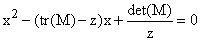

由于特征多项式是三次的，它在大的正和负参数方向上是相反的，所以通过从相同的地方开始并通过分而治之的方法逼近，你可以相对容易地找到任意精度的解决方案。 

那么我们如何在给定特征值 z 的情况下找到一个特征向量呢？通常有一个非常简单的答案。通过取 M - zI 的任何一行的余子式，并将它们排列成一列向量，可以获得一个列特征向量。

**练习：**

**32.5 这种方法何时会失败？**

**32.6 证明如果余子式不全为零，它们会提供一个列特征向量。**

**32.7 随机选择一个 3×3 矩阵并找到一个特征值及其相应的特征向量。**

还有其他方法可以找到通常有效的特征向量和特征值。

一种方法是将矩阵提升到一个高次幂。这比听起来要容易些。

你随后会注意到矩阵的高次幂通常会趋向于具有秩为 1，并且你可以从中读取一行和一列的特征向量。

通过让矩阵作用于你找到的特征向量，你可以很容易地推导出相应的特征值。

如果存在一个特征值的数量级大于其他任何特征值，并且它只有一个特征向量（它不是 M 的特征方程的多重根），那么这种方法通常能够找到它。

你可以应用相同的方法到 M 的逆矩阵，以找到数量级最小的特征值及其特征向量。

在 Excel 电子表格上执行这些操作相对容易，因为它们具有可取两个矩阵的乘积（称为 mmult）、找到矩阵的逆（minverse）和求解矩阵的行列式（mdeterm）的函数。

使用 mmult 很容易将矩阵平方，复制该过程以将其提升到四次方，并复制两个过程将其提升到八次方，然后十六次方；将整个过程复制以提升到 256 次方等等。

对于一个四乘四的矩阵，一旦你有了两个特征值，那么你可以通过求解二次方程得到其余的，并且通常可以通过将 A 和 A^(-1) 提升到高次幂来得到数量级最大和最小的。

当然，一旦你有了数量级最大的特征值，你可以寻找第二大的特征值。这可以通过将 M 的列投影到垂直于第一行特征向量的向量上，并处理得到的矩阵来完成。

当存在两个特征向量具有相同数量级的特征值或几乎相同的特征值时，当然你会遇到问题。

我们如何找到矩阵 A，以便用于对角化 M？

A 的列是 M 的归一化特征向量。

<applet code="LinearTransformations3D" codebase="../applets/" archive="linearTransformations3D.jar,go.jar,goText.jar,mk_lib.jar,parser_math.jar,jcbwt363.jar,jama.jar" width="760" height="450"></applet>

## 32.9 应用于二次型和弹簧系统

矩阵在前面章节中出现的另一个地方是在讨论多个变量的函数在临界点（函数的梯度为**0**向量的点）的行为时。

我们随后注意到函数的行为可以由该点的函数的二阶导数矩阵描述。 这是指函数相对于第 i 和 j 个变量的二阶偏导数。

对称矩阵每个都有一个由上面证明的实特征向量组成的标准正交基，可通过正交变换获得。

如果我们检查使用这个基础的形式的矩阵的结构，我们会发现它是对角线的，因此极值的条件变得简单：

**如果二阶导数矩阵的所有特征值都具有相同的符号，则函数具有局部极大值或极小值，当它们全部为正时，为极小值。**

如果符号混合，则存在一个鞍点，并且当一些特征值为 0 时，有时必须查看更高阶导数。

当谈论二阶导数矩阵时，我们实际上是在谈论描述我们函数关于临界点的 Taylor 级数展开式中的二次项的二次型。

如果我们专注于二次型，我们会意识到我们可以使用更广泛的变换类来改变它们的外观，而在处理变换时我们所能使用的变换类则较少。

因此，我们可以改变各个变量的尺度来使任何正对角二次型变成具有所有（非零）特征值相同的二次型。 (因此，我们可以通过设定 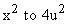 来改变 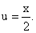)

这使我们能够同时对两个不同的二次型进行对角化。您可以将其中一个矩阵变成单位矩阵，然后对另一个进行对角化。

这与变换发生的情况相反。 两个变换必须可交换以同时与相同的基础对角化（显然是必要的，因为所有对角矩阵都可以彼此交换）。

（此声明的证明如下：

对矩阵 M 进行对角化。 您然后可以观察到，M 和 N 可交换的条件是所有 N 的非对角线元素都是相同的，即对角线元素为 M 的 ij-th 链接索引。

因此，如果矩阵 N 的 ij-th 元素非零，则矩阵 M 的第 i 和 j 个特征值必须相同，如果要使 N 和 M 可交换。

如果它们相同，那么就在对角化 N 方面，问题分解成了 M 的每个特征值的部分；对于每个部分，M 是单位矩阵的倍数，并且在 N 的相应块被对角化时保持对角化状态。）

给定一组弹簧和质量，将有一个二次形式代表系统的动量变量的动能，另一个代表系统的位置变量的势能。

上述说明告诉我们，总是可以选择一种规范化和坐标基，使得这两种形式都是对角的。这意味着整个系统可以被分析为一堆独立的简单一维弹簧（每个弹簧可以表示原始坐标的复杂组合）。相应的特征值确定了系统的“正常模式”。

## 32.10 在电子表格上计算特征值和特征向量

你可以建立一个电子表格，用于找到任何具有三个实特征值的 3x3 矩阵的特征向量，方法如下。你尝试做这个是非常值得的。

首先找到给定矩阵的迹、行列式和第二不变量（A）。

如何做呢？

迹很容易，行列式是 Excel 中的一个单一命令。

在 Excel 中获得第二个不变量也很容易：通过增加一个第四行和列，使其与第一行和列相同，并将第 44 个元素设为与第 11 个元素相同。

然后在第一、二列和行以及第二、三列和行，以及第三、四列和行中找到二乘二对角矩阵。这三者之和就是 A。

然后解特征方程。这可以通过从非常大的值开始，比如 +1000 和 -1000，并使用分而治之的方法逼近解来完成。

然后通过求解前述的二次方程找到另外两个特征值。

它们不会总是存在，因为二次方程的根可能是复数；如果是这样，就把你的矩阵改变为使它们变为实数。

几乎不可能你的矩阵不可对角化，除非两个特征值相同。否则它不会有三个特征向量。

现在找到特征向量。

如何做呢？

下面是一个不错的尝试：写下矩阵 M - zI，其中 z 是你的特征值之一。

通过将第一列复制到第四列，将第二列复制到第五列来扩展矩阵。

然后通过由前两行和列 23、34 和 45 给出的二乘二行列式来找到它们。将这些排列成一列，这应该是你的特征向量。

可能这些二乘二行列式都是 0。如果是这样，你可以尝试用第二和第三行再次尝试，甚至可以将第一行复制到第四行，对第三和第四行做同样的事情。

如果你总是失败，那意味着你有一个双重特征值（至少你的三个特征值中有两个相同）。在这种情况下，特征向量实际上更容易找到。

如果所有的特征值都相同，那么 M 是单位矩阵的倍数，每个向量都是特征向量。

否则，你可以按照描述找到该特征值的列特征向量，并通过交换行和列做同样的事情来找到一个行特征向量。

然后你双重特征值的列特征向量将是与另一个特征值的行特征向量正交的任意向量。

一旦你有了三列特征向量，你可以把它们组成一个矩阵 A，并检查 A^(-1) 和 A^(-1)MA，应该是对角的。（这些在 Excel 中使用 mmult 和 minverse 函数非常容易找到。）

## 32.11 猜测特征向量

这里是一个你可以在电子表格上设置的游戏。在任意地方输入一个任意的矩阵 M。

从 3x3 开始是一个很好的开始。

输入一个 3 分量列向量 **v**，并使用 mmult 命令（或自己计算）来计算 M**v**，对于 **v** 的每个分量，计算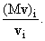的比率。

计算这些比率的方差（即它们的平方和减去它们的平方和的平方）。

玩家可以轮流生成原始矩阵 M 和 **v**；然后他们轮流通过改变 **v** 的**一个**分量来修改 **v**。

如果比率的方差减小，玩家得分一点，否则失去一点。当方差变得可以忽略不计时，游戏结束，比如小于 10^(-10)。

然后，这些比率将会或多或少相同，因此与特征向量相关联的特征值产生。

如果你在这方面太在行，你可以尝试用一个 5x5 的矩阵，尽管一开始输入一个矩阵会很无聊。
