# 第三十三章：二阶微分方程

## 介绍

这样的方程在物理学中自然而然地产生，因为牛顿的运动方程涉及加速度，而加速度是二阶导数。

我们对这类方程进行一些简要评论，展示它们如何可以用电子表格进行数值求解，并讨论两个具体的例子：强迫谐振子（也描述了 RLC 电路的行为）和行星运动。

## 主题

33.1  总体评论

33.2  解二阶微分方程

33.3  强迫和阻尼振荡器

33.4  行星运动

## 33.1 总体评论

我们将考虑包含一个或多个依赖变量和一个单独的自变量的方程，并且我们有依赖变量的二阶导数的表达式。

一些例子是：

强迫阻尼谐振子

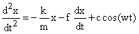

电路方程

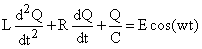

行星运动

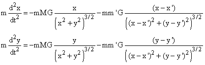

（第二项是另一个行星的影响，其位置将遵循类似的方程。）

钟摆

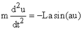

这两个方程都是线性方程，因为每个项对于依赖变量都是线性的，或者与之无关。

物理学家往往会通过找到变量和第一导数的组合，其时间导数为零，来攻击这类方程（如果可能的话）。这些被称为积分或运动常数。能量、角动量和动量是经常被保守的实体。这些数量的恒定性提供了可以帮助确定运动的方程。 

有各种各样的方法用于解决线性微分方程，包括幂级数展开和对函数空间的“转换”。

在这里，我们限制自己指出如何在电子表格上解微分方程。有一整个课程专门研究它们。

## 33.2 解二阶微分方程

我们假设我们有一个以依赖变量 u 和自变量 t 为参数的二阶微分方程。谐振子或钟摆是很好的例子。我们进一步假设，我们已经给出了 u 和 u' 的初始值，以及一个关于 u、u' 和 t 的 u" 的公式。

u" = f(u, u', t)

如果 f 不涉及 u 或 u'，我们可以对方程的两边进行一次积分以找到 u'，再次积分以找到 u，其中线性函数 ct + d 必须从初始值中确定。

因此，我们面临的问题与执行双重积分的问题类似。然而，在电子表格上做到这一点非常容易。

我们将使用梯形法则的精度阶数的近似技术；通过类似大多数数值方法的外推可以获得改进。

我们首先描述基本方法。

我们将使用一列来表示变量 t、u、u'和 u"。这三个变量中的前三个将从这些变量的给定初始值开始；并且可以从它们计算出 u"的初始值。

在每一行中，t 将以一个常数 d 的增量增加。（当变量在一个 d 间隔内变化太大时，你可以选择使 d 比你的初始选择更小。）

我们将设定

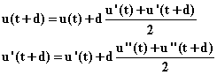

（这些是独立于方程本身的通用声明。）

最后，我们提供了一个 u"(t + d)的表达式。在这样做时，我们不能使用 u(t + d)或 u'(t + d)，否则我们的定义会循环。另一方面，我们希望使用一些东西来平均时间间隔内 t 和 t + d 之间的二阶导数（至少到某个阶数），就像上面对 u 和 u'做的那样。对于 t 处的 u"的值，我们使用 f(t, u(t), u'(t))。对于 t + d 处的 u"的值，我们使用

**u"(t + d) = f(t + d, u(t) + d * u'(t), u'(t) + d * f(t, u(t), u'(t)))**

因此，我们使用定义在 t 处并在 t + d 处评估的 f(t + d, u, u')对 u 和 u'进行线性近似。通过使用二次近似可以稍微改进。

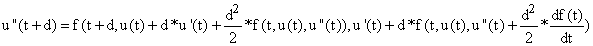

这将是正确的到二阶，但是梯形法则已经在二阶出现错误，所以通常不会有太大好处。

你可以通过绘制前三列（使用电子表格程序的"图表"功能与 xy 散点图）来观察 u 和 u'作为 t 的函数的行为。通过绘制第二和第三列，即 u' vs. u，你可以观察解的"相平面"行为。

如果你做得对，你可以在一个按键中更改 d 或 f 中的参数，并观察当你更改它们时解的变化。

你可以通过相同的方法处理具有多个因变量的方程，比如行星运动的方程；在 xy 平面上的运动可以有一个列对应于 t、x、y、x'、y'、x"和 y"，并且可以观察轨迹并随着参数的变化观察 xy 平面上的行为。

通过改变 d，并观察你得到的解变化的程度，你可以对其准确性有一个很好的想法。

<applet code="SecondOrderODE" codebase="../applets/" archive="secondOrderODE.jar,mk_lib.jar,parser_math.jar,jcbwt363.jar" width="760" height="450"></applet>

## 33.3 强迫和阻尼振荡器

这个系统遵循以下方程

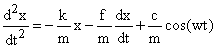

要在电子表格上设置这个，我会在前几行留出一个地方来输入常数和初始条件；这些是 t[0]、x(t[0])、x'(t[0])、m、k、f、c 和 w。

然后，我会为每个 t、x、x'和 x"分配一列，首先输入初始条件，然后使用上面的公式从前一个值得到每个新值。

I like to set the second t value to t[0] + d, and then all subsequent ones to twice the previous value minus the value two before 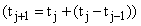which means that the intervals in t all have the same size.

The following chart shows how the setup might look on a spreadsheet

| Column A | Column B | Column C |
| --- | --- | --- |
| M= | 1 |   |
| k= | 1 | x0= |
| f= | 0.3 | u0= |
| d= | 0.01 | u'0= |
| c= | 1 |   |
| w= | 1.5 |   |
|   |   |   |
| x | U | u' |
| =D3 | =D4 | =D5 |
| =A10+B5 | =B10+(A11-A10)*(C10+C11)/2 | =C10+(A11-A10)*(D10+D11)/2 |
| =2*A11-A10 | =B11+(A12-A11)*(C11+C12)/2 | =C11+(A12-A11)*(D11+D12)/2 |
| =2*A12-A11 | =B12+(A13-A12)*(C12+C13)/2 | =C12+(A13-A12)*(D12+D13)/2 |
| =2*A13-A12 | =B13+(A14-A13)*(C13+C14)/2 | =C13+(A14-A13)*(D13+D14)/2 |
| =2*A14-A13 | =B14+(A15-A14)*(C14+C15)/2 | =C14+(A15-A14)*(D14+D15)/2 |
| =2*A15-A14 | =B15+(A16-A15)*(C15+C16)/2 | =C15+(A16-A15)*(D15+D16)/2 |
| =2*A16-A15 | =B16+(A17-A16)*(C16+C17)/2 | =C16+(A17-A16)*(D16+D17)/2 |
| =2*A17-A16 | =B17+(A18-A17)*(C17+C18)/2 | =C17+(A18-A17)*(D17+D18)/2 |
| =2*A18-A17 | =B18+(A19-A18)*(C18+C19)/2 | =C18+(A19-A18)*(D18+D19)/2 |
| =2*A19-A18 | =B19+(A20-A19)*(C19+C20)/2 | =C19+(A20-A19)*(D19+D20)/2 |
| =2*A20-A19 | =B20+(A21-A20)*(C20+C21)/2 | =C20+(A21-A20)*(D20+D21)/2 |
| =2*A21-A20 | =B21+(A22-A21)*(C21+C22)/2 | =C21+(A22-A21)*(D21+D22)/2 |
| =2*A22-A21 | =B22+(A23-A22)*(C22+C23)/2 | =C22+(A23-A22)*(D22+D23)/2 |
| =2*A23-A22 | =B23+(A24-A23)*(C23+C24)/2 | =C23+(A24-A23)*(D23+D24)/2 |
| =2*A24-A23 | =B24+(A25-A24)*(C24+C25)/2 | =C24+(A25-A24)*(D24+D25)/2 |
| =2*A25-A24 | =B25+(A26-A25)*(C25+C26)/2 | =C25+(A26-A25)*(D25+D26)/2 |
| =2*A26-A25 | =B26+(A27-A26)*(C26+C27)/2 | =C26+(A27-A26)*(D26+D27)/2 |

Column D is here

| Column D |
| --- |
| 0 |
| 1 |
| 0 |
|   |
| =MIN(B1000:B2000) |
|   |
| u" |
| =(-$B$3*B10-$B$4*C10+$B$6*SIN($B$7*A10))/$B$2 |
| =(-$B$3*(B10+(A11-A10)*C10)-$B$4*(C10+(A11-A10)*D10)-$B$6*SIN($B$7*A11))/$B$2 |
| =(-$B$3*(B11+(A12-A11)*C11)-$B$4*(C11+(A12-A11)*D11)-$B$6*SIN($B$7*A12))/$B$2 |
| =(-$B$3*(B12+(A13-A12)*C12)-$B$4*(C12+(A13-A12)*D12)-$B$6*SIN($B$7*A13))/$B$2 |
| =(-$B$3*(B13+(A14-A13)*C13)-$B$4*(C13+(A14-A13)*D13)-$B$6*SIN($B$7*A14))/$B$2 |
| =(-$B$3*(B14+(A15-A14)*C14)-$B$4*(C14+(A15-A14)*D14)-$B$6*SIN($B$7*A15))/$B$2 |
| =(-$B$3*(B15+(A16-A15)*C15)-$B$4*(C15+(A16-A15)*D15)-$B$6*SIN($B$7*A16))/$B$2 |
| =(-$B$3*(B16+(A17-A16)*C16)-$B$4*(C16+(A17-A16)*D16)-$B$6*SIN($B$7*A17))/$B$2 |
| =(-$B$3*(B17+(A18-A17)*C17)-$B$4*(C17+(A18-A17)*D17)-$B$6*SIN($B$7*A18))/$B$2 |
| =(-$B$3*(B18+(A19-A18)*C18)-$B$4*(C18+(A19-A18)*D18)-$B$6*SIN($B$7*A19))/$B$2 |
| =(-$B$3*(B19+(A20-A19)*C19)-$B$4*(C19+(A20-A19)*D19)-$B$6*SIN($B$7*A20))/$B$2 |
| =(-$B$3*(B20+(A21-A20)*C20)-$B$4*(C20+(A21-A20)*D20)-$B$6*SIN($B$7*A21))/$B$2 |
| =(-$B$3*(B21+(A22-A21)*C21)-$B$4*(C21+(A22-A21)*D21)-$B$6*SIN($B$7*A22))/$B$2 |
| =(-$B$3*(B22+(A23-A22)*C22)-$B$4*(C22+(A23-A22)*D22)-$B$6*SIN($B$7*A23))/$B$2 |
| =(-$B$3*(B23+(A24-A23)*C23)-$B$4*(C23+(A24-A23)*D23)-$B$6*SIN($B$7*A24))/$B$2 |
| =(-$B$3*(B24+(A25-A24)*C24)-$B$4*(C24+(A25-A24)*D24)-$B$6*SIN($B$7*A25))/$B$2 |
| =(-$B$3*(B25+(A26-A25)*C25)-$B$4*(C25+(A26-A25)*D25)-$B$6*SIN($B$7*A26))/$B$2 |
| =(-$B$3*(B26+(A27-A26)*C26)-$B$4*(C26+(A27-A26)*D26)-$B$6*SIN($B$7*A27))/$B$2 |
| =(-$B$3*(B27+(A28-A27)*C27)-$B$4*(C27+(A28-A27)*D27)-$B$6*SIN($B$7*A28))/$B$2 |
| =(-$B$3*(B28+(A29-A28)*C28)-$B$4*(C28+(A29-A28)*D28)-$B$6*SIN($B$7*A29))/$B$2 |
| =(-$B$3*(B29+(A30-A29)*C29)-$B$4*(C29+(A30-A29)*D29)-$B$6*SIN($B$7*A30))/$B$2 |

结果如下所示

| mu" = -ku-fu' -c sin wx |   |   |
| --- | --- | --- |
| m= | 1 |   |   |
| k= | 1 | x0= | 0 |
| f= | 0.3 | u0= | 1 |
| d= | 0.02 | u'0= | 0 |
| c= | 1 |   |   |
| w= | 1.5 | min u in st state | -0.769651461 |
|   | 1 | � |   |
| x | u | u' | u" |
| 0 | 1 | 0 | -1 |
| 0.02 | 0.9997976 | -0.020239955 | -1.0239955 |
| 0.04 | 0.999185688 | -0.040951318 | -1.047140848 |
| 0.06 | 0.99815498 | -0.062119497 | -1.06967697 |
| 0.08 | 0.996696465 | -0.083731975 | -1.091570886 |
| 0.1 | 0.994801389 | -0.105775593 | -1.11279094 |
| 0.12 | 0.992461268 | -0.128236563 | -1.133306027 |
| 0.14 | 0.989667897 | -0.15110048 | -1.153085631 |
| 0.16 | 0.986413369 | -0.174352335 | -1.172099856 |
| 0.18 | 0.98269008 | -0.197976528 | -1.190319459 |
| 0.2 | 0.978490746 | -0.221956881 | -1.207715881 |
| 0.22 | 0.973808411 | -0.246276653 | -1.224261277 |
| 0.24 | 0.968636459 | -0.270918551 | -1.239928548 |
| 0.26 | 0.962968626 | -0.29586475 | -1.254691366 |

使用 Excel，我们可以通过选择前三列和第二列和第三列的 xy 散点图来展示图形。

意识到如果这样做，您可以在变化参数时实时观察发生的情况。

**练习 33.1 当 k = m = 1 且 c 非零时，找到频率 w，使得 f = 0.1 时周期稳态 u 幅度最大。 （通过分治法逼近它。）

对于 k = 2，m = 1，做同样的事情。**

## 33.4 行星运动

行星和太阳之间的引力相互作用由反比例中心力定律描述。

我们假设行星比太阳轻得多，因此我们可以想象太阳固定在系统中心，而行星围绕其运动。实际上，我们可以通过相对于系统质心的运动来避免这种假设，但我们不会费心这样做。

因此，我们认为太阳位于原点，坐标为（0, 0, 0）。

我们选择我们的坐标，使得**行星在初始时间 t[0] 处于位置 (1, 0, 0)**，并且在那个时间，它的运动在 xy 平面上，也就是我们指的平面遵循**z = 0**。

因为行星经历的加速度始终指向太阳（原点），所以行星永远不会离开该平面，我们可以完全忽略一切的 z 分量。

这是一个经验事实，所有行星的运动都以相同的平面为近似，因此即使考虑到其他行星的引力影响，也可以用二维来描述。

物理学家通过定义守恒量（能量、动量和角动量），并使用这些值和属性来表征运动来解决这个问题。

我们的方法过去被认为是一种不可能的蛮力方法，但现在实现起来相当容易，并且为关于此问题的标准处理提供了一种令人耳目一新的补充，我们建议任何关于力学和重力下运动的标准文本。

行星的实际行为已被天文学家仔细观察了几个世纪，并且在开普勒的三大定律中得到了简洁的总结，如下所示：

1\. **受相同力的行星和其他物体的运动是"圆锥曲线"轨道：椭圆或双曲线，或在非常特殊的情况下为抛物线（都以太阳为焦点），或者直线。**

2\. **每个轨道单位时间内扫过的面积是恒定的。**

3\. 椭圆轨道的周期与其半径的度量之间存在一定的具体关系，我们将不再讨论这种关系。

关于圆锥曲线、角动量守恒和开普勒第二定律

我们在这里限制自己仅展示如何在电子表格上数值地积分运动方程，并且如何绘制结果。通过这样做，你可以将 x 或 y 或 r 作为时间的函数或系统轨道来观察。

我们将看到，处理这不比处理单个一阶微分方程更困难。它与其相同之处在于它是一个二阶方程，并且我们有两个依赖变量，x 和 y，它们将是时间 t 的函数。

我们要解决的微分方程是

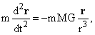

受初始条件**r**(0) = (1, 0, 0)和的约束，其中你选择 p 和 q。

我们使用单位使得 MG 为 1，为方便起见，但你不需要这样做，也不需要从(1, 0, 0)开始。

为了解决它，我们将 A 列用于变量 t，B 列用于 x，C 列用于 y,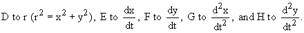

我们所要做的就是在这些方程中一次插入初始条件和变化条件，并复制下来，我们就得到了我们的解。

那么我们在各列中放入什么呢？

我会从第 11 行开始操作，留下前 10 行用于注释、常数（稍后可以更改）、初始条件和基本时间间隔 d。

每个变量的初始条件可以输入到适当列的第 11 行中。

我们首先给出了做所有这些的最简单方法：

A 列：时间列 a11 = t[0], a12 = a11+b2\. a13 = 2*a12-a11, 复制 a13。

B 列：x 列 b11 = x[0]，b12 = b11 + e11*($b$2)，复制此公式到下方的 C 列。

C 列：y 列 c11 = y[0]，其余内容来自 B 列。

D 列：r 列 d11 =sqrt(b11*bb11+c11*c11)，将其向下复制。

E 列：x 点列：e11 = dx/dt(t[0])，e12 = e11 + ($b$2)*g11，向下复制并复制到 F 列。

F 列：y 点列：f11 = dy/dt(t[0])，其余内容来自 E 列。

G 列：x 二次导数列 g11 = - b11*($d11³)，向下复制并复制到 H 列。

就是这样了。

要查看轨道图，请突出显示 B 列和 C 列，然后在它们上面制作 xy 散点图。

**练习 33.2 为不同的初始条件做这个，看看你得到的轨道是什么样子的（尽可能使每列尽可能长。改变 d 以获得不同的准确度）。**

**是否可能获得更高的准确度？**

上述描述的程序类似于左手规则，同样不准确。只需稍微多花点力气，您就可以获得梯形质量的准确度。（当然，如果您真的想要，可以进行外推。）

**怎么做？**

**通过改变 b12 来改变 B 和 C 列中的条目**

b12 = b11 + (e11+e12)*($b$2)/2

并将其向下复制到右边到 C 列。

**通过改变 e13 来类似地改变 E 和 F**

e13 = e12 + ($b$2)*(2*g12-g11)

并将其向下复制到右边到 F 列。

你甚至可以通过进行更复杂的变化来做得更好。

要想了解更多，你应该学习数值方法。

**这种方法可能失败吗？**

**是的，会。**

当行星距离太阳太近时，第二导数将会变得很大，以至于在单个时间间隔内的各种变化将被非常糟糕地近似。这将导致能量的大幅变化，而行星将跳转到非常不同的轨道。

使用更小的时间间隔可以缓解这个问题。

## 复习练习 1 - 4

**1\. 给出以下五个向量：A = (1, 2, 3)；B = (2, -3, 5)；C = (x, y, z)；D = (cos t, sin t, t²)；E = (-2, 1, 0)。**

**分别完成以下任务：**

a) 形成和：**A** + **B** + **C**。

b) 计算**A****B**。

c) 计算**A**(**B**+**C**)。

d) 找到使得**C****A** = 0 和**C****B** = 0 的 x、y 和 z 的值。

e) 找到**A**和**B**之间的夹角的余弦。以及**B**和**D**之间的夹角（答案将是 t 的函数）。

f) 找到**E**在**B**上的投影。

g) 找到列是**A, B**和**E**的行列式；还找到列是**A, B**和**C**的行列式。

h) 假设点 P 的坐标为 x = 1，y = 2，z = 3。其球坐标为 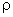, 和 是多少？

i) 具有边缘**A, B**和**E**的平行六面体的体积是多少？

j) 找到**D**在 xy 平面上的投影。其长度是多少？

**2\. 考虑上述点 A 和 B 所在的直线**。

a) 给出该直线上点的参数表示。

b) 找到指向该直线方向的单位长度“切向量”。

c) 找到与该向量正交的两个方向。

d) e) 和 f) 考虑包含点 **A, B** 和 **E** 的平面：

找到平面的（双参数）参数化表示。

找到平面的法向量。

找到平面上所有点的方程。

g) 假设我们有一个新的、不同的向量积**V**@**W**，满足性质**V**@**V** = **0**对于所有**V**，并且@在每个参数上都是线性的，以便可以应用分配律。

通过对(**V** + **W**)@(**V** + **W**)应用相同的方法，推导出关于**V**@**W** + **W**@**V**的一些结论。

**3\. 分别对以下函数进行相对于指定变量的求导：**

a) sin (2^x)。

b) 对于固定的 y，(sin xy)e^(x+y) 关于 x 求解。

c) 对于固定的 x，对于 y 求解 x² + y² - 3xy。

d) 对于其他所有固定项，对 (sin (y + s sin t))e^(-(x+s cos t)) 求解 s。

e) 找到 (sin y)e^(-x) 的梯度。

f) 在单位向量为 (cos t, sin t) 的方向上找到这个函数的方向导数。

g) 在 x = 0 处找到 sin (e^x) 的线性近似。

h) 求解(**r****v**)关于 t 的导数，其中 **v** 是 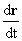；假设 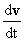 沿着 **r** 的方向。那么答案是什么？

i) 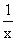 在哪里不可微？tan x 在哪里不可微？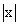 在哪里不可微？

j) 求解 sin (e^x) 的反函数的导数（为了完全定义一个反函数，你必须指定一个范围；在这里忽略）。

**4.**

a) 找到函数的梯度 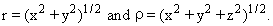

b) 找到 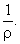 的梯度。

c) 找到 cos  和  的梯度。

d) 找到 (y, z, x) 的旋度。

e) 找到 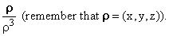 的散度。

f) 找到相同函数的旋度。

**5.** a) 在 x = 1, y = 2（弧度）处找到 sin xy 的二次近似。

b) 这个函数在哪些临界点具有临界点（两个偏导数均为 0）。

c) 找到至少一个鞍点。

d) 通过交换点积和叉积，并按照相同的规则表达三重叉积，评估(**a****b**)(**a****b**)，以获得完全基于点积的另一种表达。

e) 以下哪些函数可以在 x = 0 处定义？ 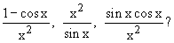
