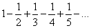
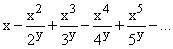
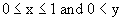
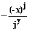

# 第 A 章：级数求和魔法

假设我们有一个形如

或更一般地说

对于

并想找出它的总和。

我们应该怎么做呢？

另一个问题：仅使用系列的前 5 项，或前 25 项，我们可以有多精确地求和？

答案相当惊人。你仅从前五项就可以得到比三位小数更精确的答案，而从前 25 项可以得到十位小数的答案！而且轻而易举。（通过增加更多项也可以获得更高的精度。）

如何？

显然，仅计算系列的前五项或前 25 项的部分和并将系列总和估算为第五项或第 25 项的部分和是不够的。但计算这些部分和并从中估算总和是足够的。

如何？

你可以使用电子表格轻松计算部分和。（将 A3=A2+1，B1= x 的值，C1= y 的值，B3=-(-$B$1)^A3)/(A3)^$C$1，以及 C3=C2+B3，并向下复制 A3、B3 和 C3，你就能在 C 列得到你的部分和。）

一旦你有了它们，你会发现奇数部分和形成一个递减序列，而偶数部分和形成一个递增序列。因此，序列和被任意一对连续部分和的值所夹住。因此，奇数部分和给出了序列和的上限，而偶数部分和给出了下限；尽管对于 x = 1，y = 1 来说这些边界会变得越来越好，但是增长速度相当缓慢。

这意味着如果你取相邻部分和的平均值，你会比它们中较差的更接近答案，因为一个明显在答案上方，一个在下方。

这些特定系列以及其他一些系列所拥有的奇特属性是，在对相邻部分和求平均后，相同的属性仍然成立：奇数项递减，偶数项递增，就像当项是相邻部分和（或相邻部分和的平均值，等等）的平均值时一样。

这意味着如果你对这些进行平均，你会更接近答案，如果你继续平均，你会永远更接近，或者直到你的机器的精度达到答案。

如何进行所有这些平均计算？只需输入 D3=(C3+C4)/2，然后将 D3 复制到以 D3 和 AE30 为角的矩形中即可。

你可以从第 3 行的条目中估算总和。当然，随着你向下进行，估计会变得更好，但每次向下移动一次，你就使用一个更进一步的部分和，因此如果你只想使用信息到第 k 个部分和，你可能就从第 C 行向右移动 k - 1 步了。 （你实际上可以做得更好，但谁在乎呢。）

你可以通过将该结果与同一对角线上的前一个结果平均来稍微提高一点。因此，与其使用 G3 作为估计值，不如使用 (G3+F4)/2\. 这两种方法都利用了 E5 中的信息，因此 D6 和 C7 中的信息来自于序列中的前五项。

对于原始求和，x = 1，y = 1，在仅使用序列中的前 k 项的情况下，我们得到的最佳估计如下

| k 值 | 估计值 | 估计值来源 | 真实答案 | % 误差 |
| --- | --- | --- | --- | --- |
| 1 | 1 | C3 | 0.693147... | 44.27 |
| 2 | 0.625 | D3/2+C4/2 | 0.693147 | 9.8316 |
| 3 | 0.6825 | E3/2+D4/2 | 0.693147 | 0.8147 |
| 4 | 0.692708 | F3/2+E4/2 | 0.693147 | 0.0633 |
| 5 | 0.693229 | G3/2+F4/2 | 0.693147 | 0.0118 |

换句话说，从前 5 项估算这个和的误差约为百分之一百分之一。

当 k 较大时，最好使用稍微不同的估计值（在更高的行中；即，对几项求和，然后开始平均），你可以仅查看序列的前 20 项即可将精度提高到 10¹⁰ 中的一部分。

粗略地说，在指定范围内，对于**任意** x 和 y，可能都可以获得几乎相同或更好的精度。

**练习 A.1 让朋友选择一个 x 和 y 的值，并计算序列的前五项，其中第 j 项为 。

使用上述描述的方法仅使用此信息估算序列的和。然后让朋友使用指定的方法和 k 值为 50 来确定和的高精度，并找出你的估计误差。（如果运气好的话，你的答案将准确到千分之一，你的朋友将愿意打赌你无法仅从五项中获得这样的精度。）**
