# 章节 B：行列式的乐趣

我们在第四章中讨论了行列式，再次在第三十二章中讨论了它。我们讨论了几种计算行列式的方法，原则上并不困难，但是如果你想手动进行，那么实际上是很烦琐的。

在这里，我们提供了一些思路，可以让我们用比写出矩阵还要少的工夫推导出几种特殊类型矩阵的行列式（虽然它们偶尔会有用）。

我们还提供了一个奇特的涉及行列式的公式，这个公式是由爱丽丝梦游仙境的作者刘易斯·卡罗尔发现的，并且基于它提出了一个神奇的计算行列式甚至逆的算法，几乎没有任何努力。

## 1 一些易于计算的行列式。范德蒙德行列式

当一个矩阵的元素是某些变量集合中的单项式甚至多项式时，那么它的行列式一般将是这些变量的多项式，并且这有时对于求值是有用的。

这个的典型例子是所谓的范德蒙德矩阵，其行（或者如果你愿意，列）的形式都是（1，x[j]，x[j]²，x[j]³，...，x[j]^(n-1)）对于某个 x[j]。

这是一个示例

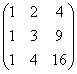

通过行列式的基本性质，如果它的两行相同，则我们可以推断出范德蒙德矩阵的行列式在任意两行相同时为 0。

但是这意味着，作为一个多项式，它必须有(x[i] - x[j])作为一个因子，对于每一个 i 和 j。

这意味着这样的一个行列式必须有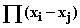作为一个因子，这里的乘积是对所有 i > j 的变量对进行的。

这个因子已经是一个次数为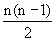的多项式了（我们在处理一个 n 乘 n 的矩阵）。

那么我们的范德蒙德行列式作为一个多项式的次数是多少？

好吧，它是条目的总和，每个条目都有每列的一个因子。因此，作为一个多项式，它的次数是 0 + 1 + ... + n - 1，即。

因此，由于我们已经看到我们的行列式必须有这个次数的一个因子，我们已经将我们的行列式评估为一个多项式，直到一个常数因子。

那么那个常数是什么呢？我们可以通过查看主对角线项来检查它：即

x[1]⁰x[2]¹x[3]²...x[n]^(n-1)

这正是我们从上述乘积的每个因子中取出第一个（正的）项所得到的。

由于这两项在行列式和乘积中具有相同的系数 1，因此乘积就是行列式，这就是我们的答案。

在我们的例子中，我们可以立即推断出行列式是 2*1*1，即 2。

## 2 另一个简单的例子：柯西行列式

假设我们想要一个矩阵的行列式，其（j，k）项是！

这里有一个例子：对于 x 值 1、2、4 和 y 值 1、2、3

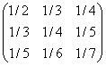

现在我们没有一个多项式，而是有一个关于我们变量的有理函数。

我们该怎么办？我们通过因式分解所有分母将其变成一个多项式！

同样，我们知道，如果任何两个 x 变量相同，或者任何两个 y 变量相同，它将为 0，因为这将使两行或两列相同。

因此，它必须在分子中有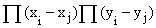的因子。

每对索引较大的变量都有一个乘积。

在分母中，对于每一对变量，我们将有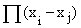。

注意，分子在我们的变量中已经有 n(n - 1)次，而分母有 n²次，比分子的次数多 n。

行列式也是如此，其所有项都是 n 个因子的乘积，每个因子在分母中有一个项，在分子中没有，因此分母中有 n 个多余的项。

实际上，到目前为止我们有的公式

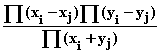

前两个乘积是变量对，第一个变量具有更大索引，而分母中的乘积是所有对，这就是我们要找的行列式。

我们可以通过设置 x[j] = -y[j]来验证这一点，在这种情况下，分子中的乘积项变为矩阵中的非对角线项，并且这些与分母中的类似项相互抵消，我们最终得到分母中的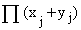，正是我们从行列式的对角线项中得到的。

在我们的例子中，我们可以推断我们的行列式为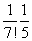（其中包括除了与分子相消的一个因子 12 之外的所有分母）。

**练习 B.1 还有一个更有名的例子，我们给你作为练习：

考虑一个矩阵，其(j, k)元素为 x[j]，如果 j > k，则为 y[j]。

对于一个 3x3 矩阵，这看起来像**

**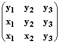**

**找出它的行列式公式。（注意它是一个多项式，是几次多项式？在这些变量中什么时候为 0？你可以从这些问题的答案中得出答案。）**

例如，考虑矩阵

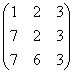

你可以立即推断其行列式为 6*4*3 或 72。

## 3 路易斯·卡罗尔定理

二维矩阵行列式的公式

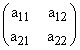

是

a[11]*a[22] - a[12]*a[21]

查尔斯·道奇森（路易斯·卡罗尔，《爱丽丝梦游仙境》的作者）在每个维度中找到了这个公式的类似物。

我们引入以下符号：让**A[i,j]是从 A 中去除其 i-th 行和 j-th 列后获得的矩阵的行列式。如果我们省略两行和相应的列，则让 A[ij,ij]是剩下的部分的行列式，这在二维情况下什么都没有（其行列式我们定义为 1）。**

然后对于一个二维矩阵 A，如上所述，我们有 A[2,2] = a[11]，A[1,2] = a[21]等等。

我们上面的二维公式可以写成

(Det A) A[jk,jk] = A[kk]A[jj] - A[jk]A[kj]

(请记住，在这种情况下，因子 A[ij,ij]被定义为 1。)

就是这个公式是多次公式。他注意到，并证明，如果你选取任意两个不同的指标（比如 j 和 k）用于一个 n x n 矩阵，你会得到相同的结果

(Det A) A[jk,jk] = A[kk]A[jj] - A[jk]A[kj]

这个公式除以 A[jk,jk]，给出了一个 n 乘 n 的行列式，其用更小尺寸的行列式来表示。

因此它可以用行列式的递归定义来使用。（如果你把 0 乘 0 的行列式定义为 1，把一个数字的 1 乘 1 的行列式定义为它本身，你可以使用这个定义来定义所有更高维度的行列式，只要 A[jk,jk]不为 0。）

**练习 B.2 通过解决一个一般性的例子来验证 3x3 矩阵的正确性。**

**不仅可以这样定义行列式，而且还可以使用电子表格高效地和不可思议地计算它。**

我把用于做这个的算法称为**疯帽子算法**。它非常高效，但有一个问题。

**算法是什么？**

我们构建**由连续的行和列组成的所有子矩阵的行列式。**

矩阵本身是一个一个行列式的矩阵。这些有 n²个。

从这些中，我们使用 Dodson 形式中的普通二维行列式公式计算(n - 1)²个 2x2 连续的行和列子行列式。

并使用同样的规则，即

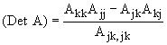

我们计算所有(n-2)²个 3x3 连续的行和列子行列式，从 2x2 和 1x1 的开始；

并继续，直到我们有 4 个 n-1 乘 n-1 连续的行和列子行列式，最后一个完整的行列式。

这听起来像一个巨大的项目，但如果我们从**一个 1 的方形块开始表示 0 乘 0 的行列式**，然后**在它下面输入我们的矩阵**，**我们可以用一个复制到我们的矩阵下方和下方的指令来完成所有工作。**

假设，**例如**，我们在方框 a2 中插入 1，并将其复制到以 a2 和 j10 为角的矩形中，并在以 a11 为左上角的矩阵中输入。

(输入一个 10x10 矩阵非常无聊。我建议尝试 4x4 或 5x5 甚至 3x3。如果你想超过 10x10，你需要在顶部添加更多的 1。)

现在在方框 a21 中输入=(a11*b12-a12*b11)/b2

并将其复制到以 a21 和 i110 为角的矩形内。

**如果你的行列式是 j 乘 j 的，它应该神奇地出现在第 a 列和第 10j+1 行的框中。**

**不仅如此，**

如果你将**j 乘 j 矩阵扩展到其后复制了前 j-1 行，然后将前 j-1 列复制到其右边**，以 b 列和第 9j+2 行为左上角的 j 乘 j 框将是**当 j 为奇数时的余子式矩阵**，**当 j 为偶数时的交替符号反转的余子式矩阵。**

**这真的有效吗？**

如果你的矩阵足够丑陋，它就会奏效。也就是说，如果它没有任何 0 的条目，并且你在形成答案时所除的相关子行列式都不为 0，那么它就会奏效。但是如果你在形成答案时除以 0，它就会失败。

**这会发生吗？**

对于一个三乘三矩阵 M，只有当中间元素 m[22]为 0 时才会发生。

如果你已经将它的前两行复制到右边，它将只在所有三次尝试中失败（你将在 a31、b31 和 c31 中得到潜在答案），只有当中间行完全由零组成时，行列式才为 0。

对于一个四乘四的矩阵，如果中间元素 m[22]、m[23]、m[32]、m[33]中的任何一个为 0，或者它们的行列式为 0，则会失败；等等。

**我们能使它真正起作用吗？**

是的！但这需要做一些事情，这并不那么巧妙。

**做什么？**

我不确定该做什么是最好的。通常有效的一件事是用非常小的东西替换矩阵的零（以及在子行列式中出现的任何后续的 0），然后你可以让那个非常小的东西趋向于 0。

例如，你可以在 b1 中放入一个像 10^(-8)这样的微小数，保持一个行索引 j 和列索引 k，并将$ b$1*(j+k+1)添加到原始矩阵中。有了运气，这将消除所有的零，一切都应该正常工作。

当然，你的答案会略有偏差。然后你可以四舍五入你的答案或者改变 b1 中的内容来找出答案（你可能想到更好的办法）。

上面的建议会消除你原始矩阵中的 0，但其他 0 可能会出现在子行列式中，尽管这种情况应该很少发生。如果你担心这一点，你应该用以下基本指令替换

**=if( a11*b12=a12*b11, $b$1, (a11*b12-a12*b11)/b2))**

你的朋友们都不会相信你能如此整洁地评估行列式，如果你激励他们输入尽可能丑陋的矩阵，他们也不会发现除以 0 的缺陷。然后它就不会有让人讨厌的零来除。

另一方面，你有能力通过创建一个方法将要除以 0 的矩阵来使朴素的算法失败。

**练习 B.3 设置这个并让它起作用，并使用它得到一个 4 乘 4 矩阵的余子式矩阵。**

**如果你只想评估 3 乘 3 的矩阵和叉乘，那么设置就简单得多。**

**就是这样**

步骤 1

在 b1、b2、c1、c2、d1、d2、e1、e2 中输入 1（可以通过在 b1 中输入 1 然后复制到其余部分来完成）。

步骤 2

**在 a3 a4 a5, b3 b4 b5 和 c3 c4 c5 中输入你的矩阵**，或者在 a3 b3 c3 和 a4 b4 c4 中输入你想要进行叉乘的两个向量（第 5 行可以是任意内容）。

步骤 3

**在 d3 中输入 =a3**，然后将其复制到 d3、d4、e3 和 e4。

步骤 4

**在 a6 中输入 = (a3*b4-a4*b3)/b1**，然后将其复制到 a6 到 d6、a7 到 d7、a8 到 d8、a9 到 d9。

**叉乘结果将出现在 b6、c6 和 d6 中。**

并且在 a9、b9 和 c9 中的一个或全部中计算行列式。

如果没有数字出现，则行列式为 0。

顺便说一句，**如果行列式为 0**，那么(b7, c7, d7) 和 (b6, c6, d6)如果不全为零，则是你的矩阵的**列特征向量**，对应的**特征值**为 0。

如果你需要计算叉乘或行列式，用这种方法检查答案是一个很好的主意。
