# 术语表

| i | 负一的平方根。 |
| --- | --- |
| f(x) | 函数 f 在参数 x 处的值。 |
| sin x | 参数 x 处正弦函数的值。 |
| exp x | 参数 x 处指数函数的值。通常写作 e^x。 |
| a^x | 数字 a 的 x 次幂；对于有理数 x，由反函数定义。 |
| ln x | exp x 的反函数。 |
| 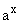 | 同 a^x。 |
| 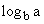 | 为了得到 a，必须将 b 提高到的幂；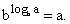 |
| cos x | 参数 x 处余弦函数的值（正弦的补角）。 |
| tan x | 计算结果为 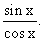 |
| cot x | 切函数的补值或 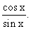 |
| sec x | 正割函数的值，结果为 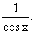 |
| csc x | 补正割的值，称为余割。其值为 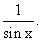 |
| asin x | 在参数 x 处正弦函数的反函数值 y。意味着 x = sin y。 |
| acos x | 在参数 x 处余弦函数的反函数值 y。意味着 x = cos y。 |
| atan x | 在参数 x 处正切函数的反函数值 y。意味着 x = tan y。 |
| acot x | 在参数 x 处余切函数的反函数值 y。意味着 x = cot y。 |
| asec x | 在参数 x 处反正割函数的值 y。意味着 x = sec y。 |
| acsc x | 在参数 x 处余割函数的反函数值 y。意味着 x = csc y。 |
|  | 角度的标准符号。除非另有说明，以弧度表示。特别用于描述三维空间中点的 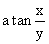，其中 x、y 和 z 是用来描述点的变量。 |
| **i**, **j**, **k** | 分别是 x、y 和 z 方向的单位向量。 |
| (a, b, c) | 具有 x 分量 a，y 分量 b 和 z 分量 c 的向量。 |
| (a, b) | 具有 x 分量 a，y 分量 b 的向量。 |
| (**a**, **b**) | 向量 **a** 和 **b** 的点积。 |
| 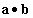 | 向量 **a** 和 **b** 的点积。 |
| 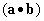 | 向量 **a** 和 **b** 的点积。 |
| &#124;**v**&#124; | 向量 **v** 的大小。 |
| &#124;x&#124; | 数字 x 的绝对值。 |
|  | 用于表示求和，通常索引和结束值会写在下面，并且上面写着上限。例如，j=1 到 n 的求和写作 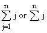，表示 1 + 2 + ... + n。 |
| M | 用于表示数字或其他实体的矩阵或数组。 |
| &#124;v> | 列向量，其分量以列形式书写并视为 k 乘 1 矩阵。 |
| <v&#124; | 以行形式书写的向量，或者 1 乘 k 矩阵。 |
| dx | 变量 x 的“微小”或非常小的变化；同样也有 dy、dz、dr 等。 |
| ds | 距离的微小变化。 |
|  | 在球坐标中到原点的变量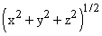或距离。 |
| r | 在三维空间或极坐标中到 z 轴的变量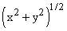或距离。 |
| &#124;M&#124; | 矩阵 M 的行列式（其大小为由其列或行确定的平行区域的面积或体积）。 |
| &#124;&#124;M&#124;&#124; | 矩阵 M 的行列式的大小，即体积、面积或超体积。 |
| det M | 矩阵 M 的行列式。 |
| 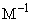 | 矩阵 M 的逆。 |
| 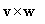 | 两个向量**v**和**w**的向量积或叉积。 |
| 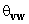 | 向量**v**和**w**所成的角度。 |
| 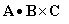 | 标量三重积，由列 A、B、C 形成的矩阵的行列式。 |
| 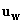 | 指向向量**w**方向的单位向量；与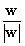意思相同。 |
| df | 函数 f 的微小变化，足够小以至于所有相关函数的线性近似对这些变化成立。 |
| 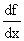 | f 关于 x 的导数，即 f 的线性近似的斜率。 |
| f ' | f 关于相关变量（通常为 x）的导数。 |
| 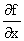 | f 关于 x 的偏导数，保持 y 和 z 不变。一般来说，f 关于变量 q 的偏导数是当其他变量固定时 df 与 dq 的比值。当存在关于哪些变量固定的可能误解时，应明确说明。 |
| 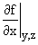 | f 关于 x 的偏导数，保持 y 和 z 不变。 |
| grad f | 向量场，其分量为函数 f 关于 x、y 和 z 的偏导数：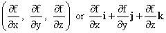；称为 f 的梯度。 |
| 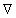 | 向量算子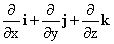，称为**"del"**。 |
| 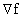 | 函数 f 的梯度；其与 **w** 的点积是函数 f 在 **w** 方向上的方向导数。 |
| 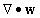 | 向量场 **w** 的散度；它是向量算符  与向量 **w** 的点积，或 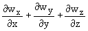。 |
| curl **w** | 向量算符  与向量 **w** 的叉乘。 |
| 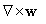 | **w** 的旋度，其分量为 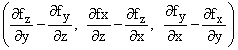。 |
| 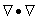 | 拉普拉斯算子，微分算符：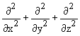。 |
| f "(x) | 关于 x 的 f 的二阶导数；f '(x) 的导数。 |
| 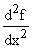 | 关于 x 的 f 的二阶导数。 |
| 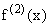 | 关于 x 的 f 的另一种二阶导数形式。 |
| 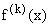 | 关于 x 的 k 阶导数；关于 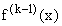 的导数。 |
| **T** | 曲线上的单位切向量；如果曲线由 r(t) 描述，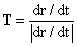。 |
| ds | 曲线上的距离微分。 |
| 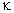 | 曲线的曲率；其单位切向量关于曲线上的距离的导数的大小：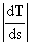。 |
| **N** | 在与 **T** 法向量正交的方向上的单位向量。 |
| **B** | 法向量 **T** 和 **N** 所在平面的单位向量，即曲率平面的法向量。 |
| 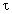 | 曲线的扭率；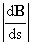。 |
| g | 重力常数。 |
| **F** | 力的力学标准符号。 |
| k | 弹簧的弹性系数。 |
| 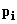 | 第 i 个粒子的动量。 |
| H | 物理系统的哈密顿量，即其能量用动量、位置和 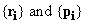 表示。 |
| {Q, H} | Q 和 H 的泊松括号。 |
| 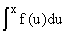 | f(x) 的一个反导数，表示为 x 的函数。 |
| 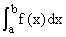 | 从 a 到 b 的 f 的定积分。当 f 为正且 a < b 时，这是 x 轴、直线 y = a、y = b 和代表函数 f 在这些直线之间的曲线之间的面积。 |
| L(d) | 一个具有均匀间隔大小 d 和在每个子间隔的左端评估的 f 的 Reimann 和。 |
| R(d) | 一个具有均匀间隔大小 d 和在每个子间隔的右端评估的 f 的 Reimann 和。 |
| M(d) | 一个具有均匀间隔大小 d 和在每个子间隔中 f 的最大点处评估的 Reimann 和。 |
| m(d) | 一个具有均匀间隔大小 d 和在每个子间隔中 f 在 f 的最小点处评估的 Reimann 和。 |
