# L2：图像处理与变换 🖼️

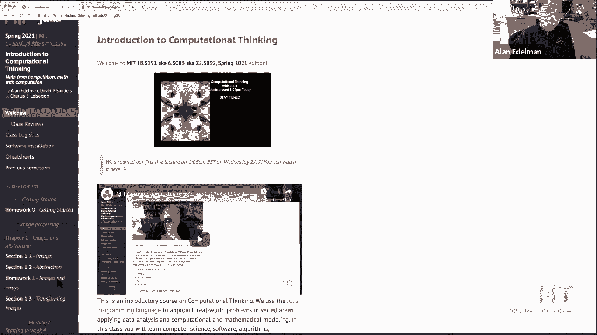

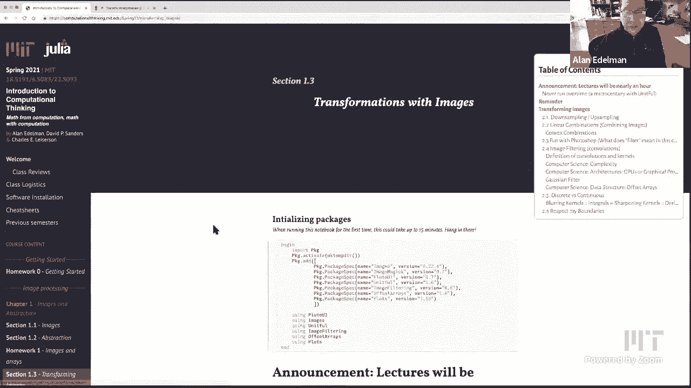

在本节课中，我们将学习如何对图像进行各种变换。我们将从简单的像素操作开始，逐步深入到线性组合和卷积等核心数学概念。通过这些操作，我们不仅能处理图像，还能理解背后广泛应用的数学和计算机科学思想。

## 课程概述

本节课将介绍图像处理的基本操作，包括像素采样、线性组合以及卷积。我们将使用Julia语言进行演示，并解释这些操作背后的数学原理。

## 图像像素化与上采样

首先，我们来看看如何通过下采样使图像像素化，以及如何通过上采样恢复图像。

下采样是通过每隔`r`个像素取一个点来实现的。当`r`值增大时，图像会变得更加像素化，因为获取的像素点变少了。当`r`为1时，我们得到原始图像。

上采样则通过一种称为克罗内克积的数学操作实现。这个操作将每个像素替换为一个`r`乘`r`的像素块，块中所有像素的颜色都与原像素相同。这样就能快速放大图像。

## 线性组合与图像混合

上一节我们介绍了像素操作，本节中我们来看看如何将图像进行线性组合。线性组合是数学、应用数学和工程学中无处不在的概念。

线性组合的核心是两个基本操作：缩放对象和组合多个对象。在图像处理中，这意味着我们可以调整图像的亮度，然后将多张图像叠加在一起。

以下是缩放图像亮度的操作：

```julia
# 将图像亮度乘以常数c
brightened_image = c .* original_image
```

当`c`大于1时，图像变亮；当`c`小于1时，图像变暗。但需要注意的是，颜色值有上限，过度增亮会导致颜色饱和变为白色。

接下来，我们可以组合多张图像。例如，将一张正常图像和一张上下颠倒的图像进行混合。

以下是创建图像线性组合的示例：

```julia
# alpha控制混合比例
combined_image = alpha .* rightsideup_image + (1-alpha) .* upsidedown_image
```

当`alpha`为1时，只显示正常图像；为0时，只显示颠倒图像；为0.5时，两者等比例混合。有趣的是，人脑对正立面孔的识别优于倒立面孔，这是一种被称为“面孔倒置效应”的知觉现象。

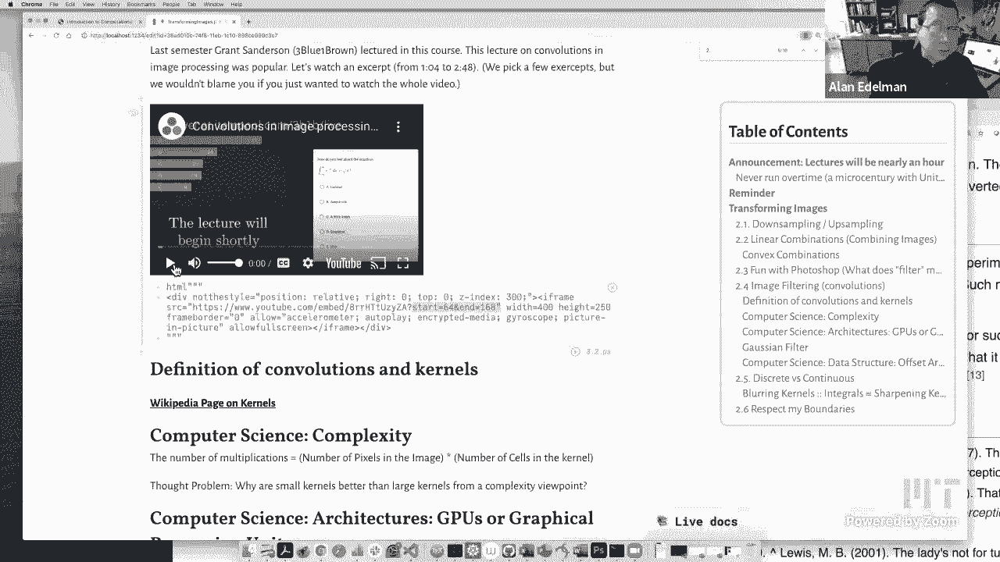

如果线性组合中所有权重均为非负且总和为1，这种组合被称为凸组合。

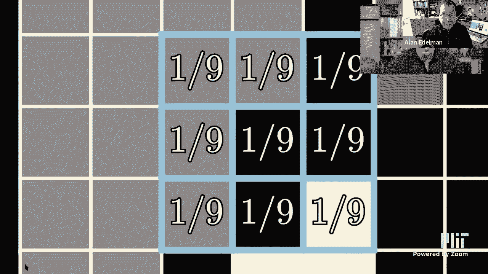

## 卷积：图像处理的核心

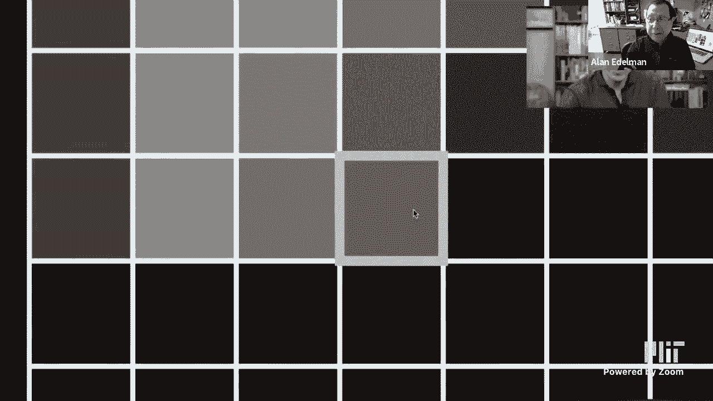

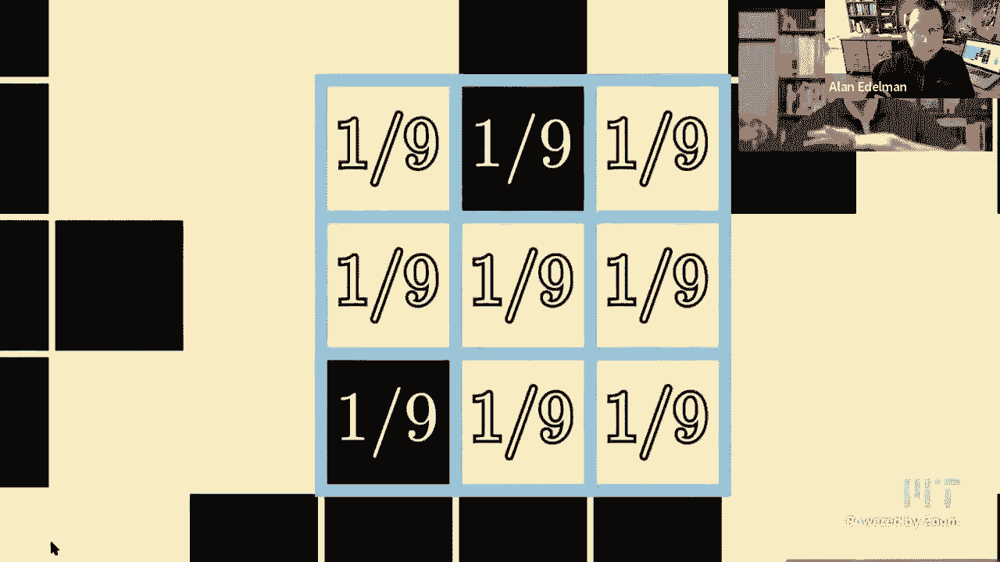

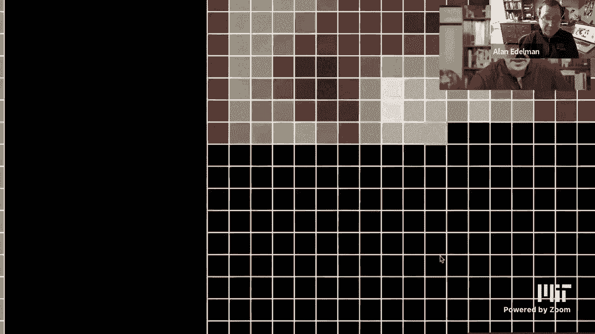

上一节我们探索了线性组合，本节中我们来看看图像处理中更强大的工具：卷积。卷积在机器学习等领域有广泛应用，是计算机识别图像的关键。

卷积操作是将一个图像与一个称为“核”的小矩阵进行运算。核在图像上滑动，每个位置的输出是核覆盖区域内像素值的加权和。

以下是几种常见的卷积核及其效果：

*   **模糊核**：取像素及其周围像素的平均值，使图像变模糊。
*   **边缘检测核**：突出显示图像中颜色或亮度急剧变化的区域，即边缘。
*   **锐化核**：通常是恒等核和边缘检测核的线性组合，在保留原图的同时增强边缘。
*   **梯度核**：用于近似计算图像在x或y方向上的导数（即变化率）。

卷积的计算复杂度大致为图像像素数乘以核的大小。虽然小核计算更快，但现代GPU（图形处理器）因其并行架构，可以极其高效地处理这种规律的卷积运算，这也是它们被广泛用于机器学习和图像处理的原因。

## 高斯模糊

在众多模糊方法中，高斯模糊因其良好的数学特性而备受青睐。与简单的平均模糊不同，高斯模糊核的权重不是均匀的，而是中心高、四周低，符合二维高斯分布。

高斯核的权重由以下公式决定：

```julia
# 二维高斯函数近似
weight = exp(-(x^2 + y^2) / 2)
```

以下是高斯模糊的特点：

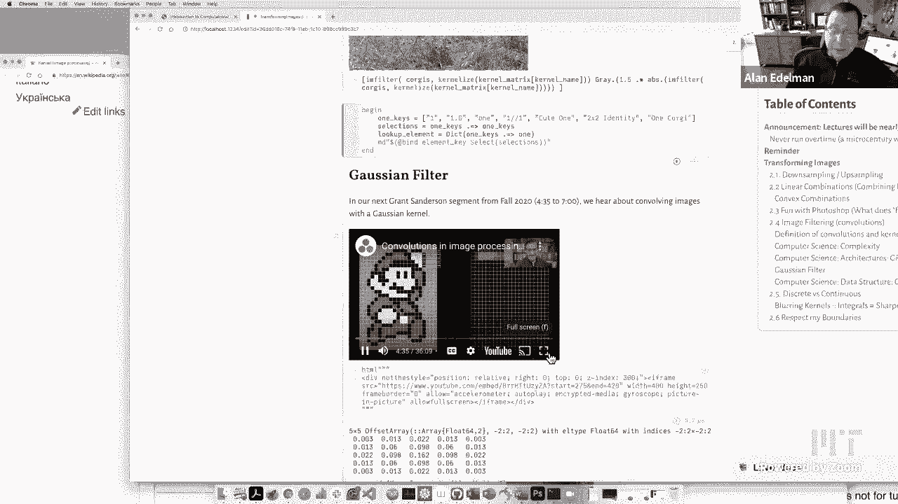

*   它更重视中心像素，对远处像素影响较小，因此能产生更平滑、更自然的模糊效果。
*   核越大，模糊程度越高。
*   在软件中，可以通过定义偏移数组来灵活设定核的中心位置，使其在处理边界时更加方便。

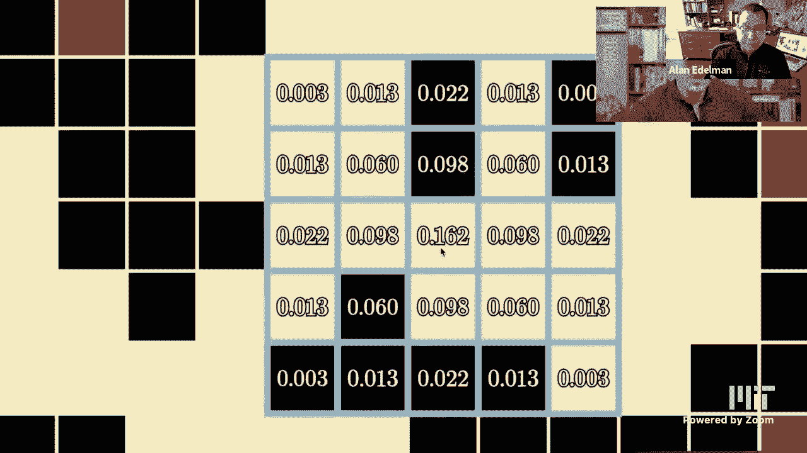

## 离散与连续

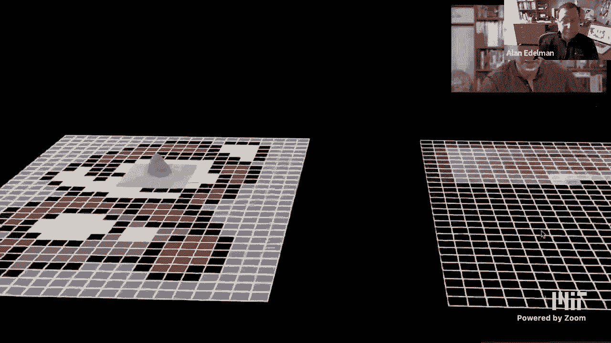

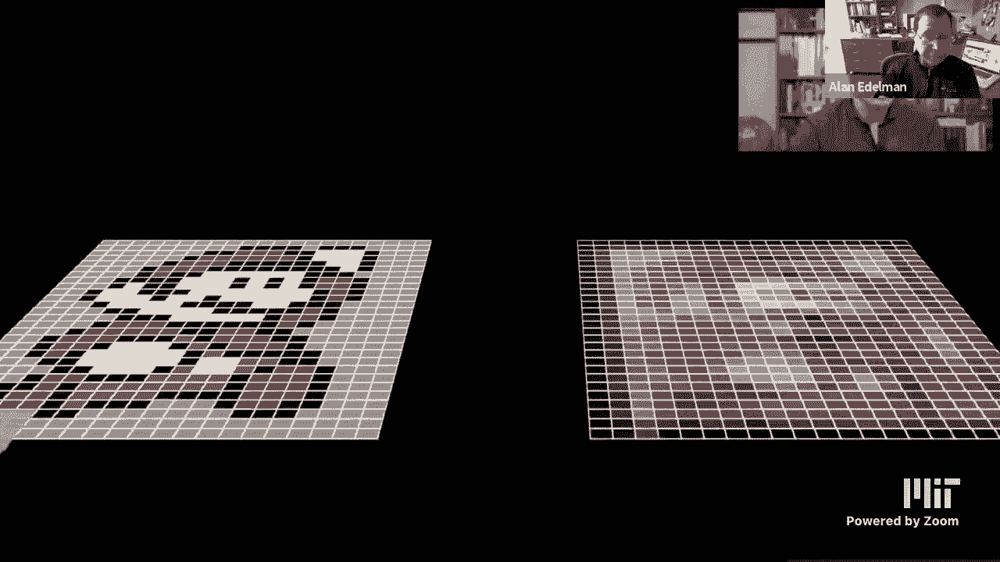

在图像处理中，我们处理的是离散的像素点。然而，许多操作在连续数学中都有对应的概念。

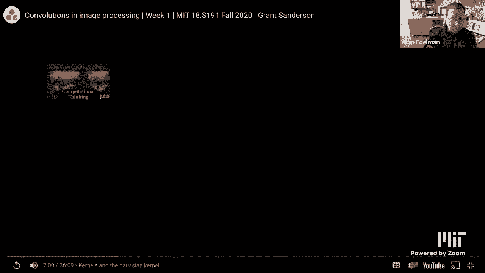

例如，之前提到的x方向梯度核，本质上就是离散版本的导数。这提醒我们，离散数学和连续数学之间的鸿沟并不像有时看起来那么大。许多核心概念是相通的，只是在不同领域有不同的表现形式和名称。在学习中，留意这些联系会加深我们的理解。

## 边界处理

在进行卷积时，当核移动到图像边缘时，会出现“越界”问题。程序员需要决定如何处理这些边界情况。

常见的边界处理策略包括：
*   假设边界外的像素值为0（补零）。
*   复制边缘的像素值。
*   镜像图像边缘的像素。
*   环绕图像（即认为图像是循环的）。

不同的应用场景可能需要不同的边界处理方式，优秀的软件会提供灵活的选择。

## 课程总结

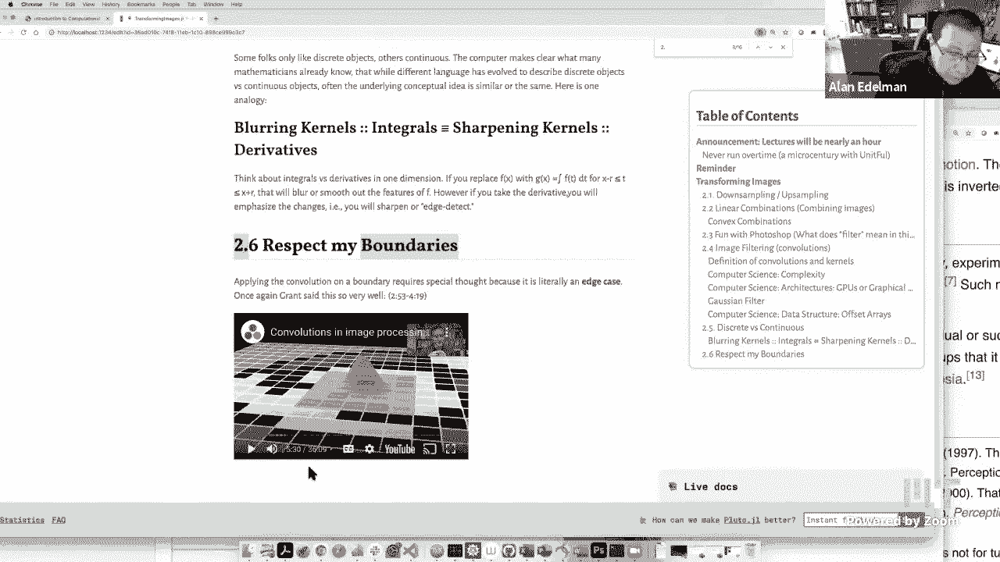

本节课中我们一起学习了图像处理的基本变换。我们从像素采样和上/下采样开始，理解了如何改变图像分辨率。接着，我们探讨了线性组合，用它来混合和调整图像，并接触了凸组合的概念。然后，我们深入学习了卷积这一强大工具，用它实现了模糊、锐化、边缘检测等效果，并了解了高斯模糊的原理。最后，我们讨论了离散与连续数学的联系，以及卷积中边界处理的重要性。通过这些内容，我们不仅学会了处理图像，更看到了背后广泛应用的数学思想。