# L3：变换与自动微分 🧮

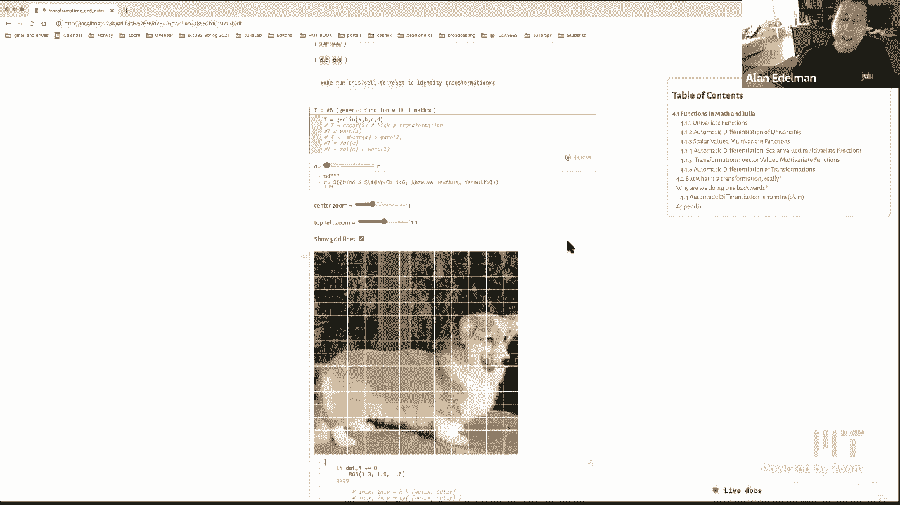

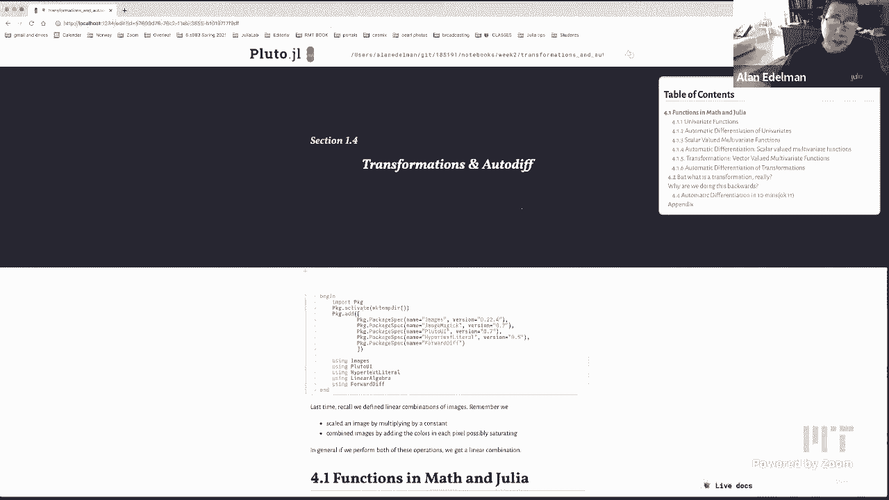

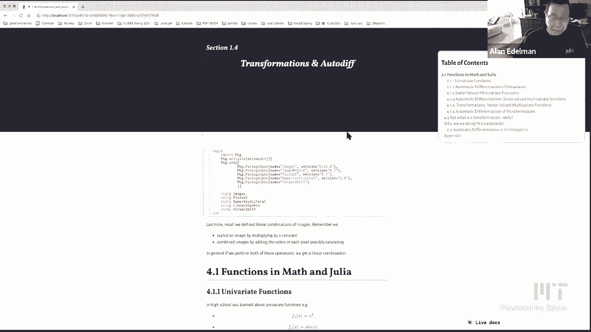

在本节课中，我们将要学习变换（Transformations）与自动微分（Automatic Differentiation）的核心概念。我们将从简单的函数定义开始，逐步深入到向量函数、线性变换，并探索计算机如何高效地计算导数。通过直观的图像变换演示和代码示例，你将建立起对线性代数与多元微积分的新直觉。

## 函数定义：三种方式 📝

上一节我们介绍了课程的整体目标，本节中我们来看看在Julia中定义函数的几种不同方式。每种方式都有其适用场景，理解它们有助于编写更清晰、更高效的代码。

以下是三种主要的函数定义方式：

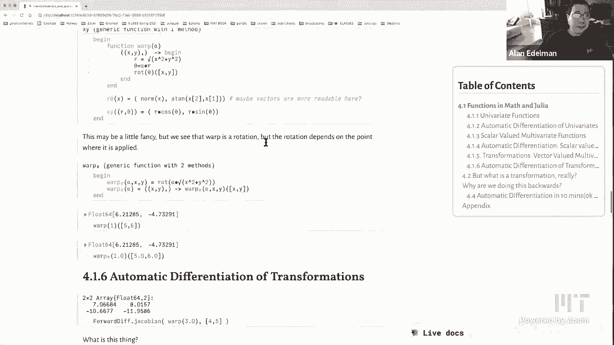

*   **短格式**：适用于简单的单行函数。例如，定义平方函数：
    ```julia
    f₁(x) = x^2
    ```

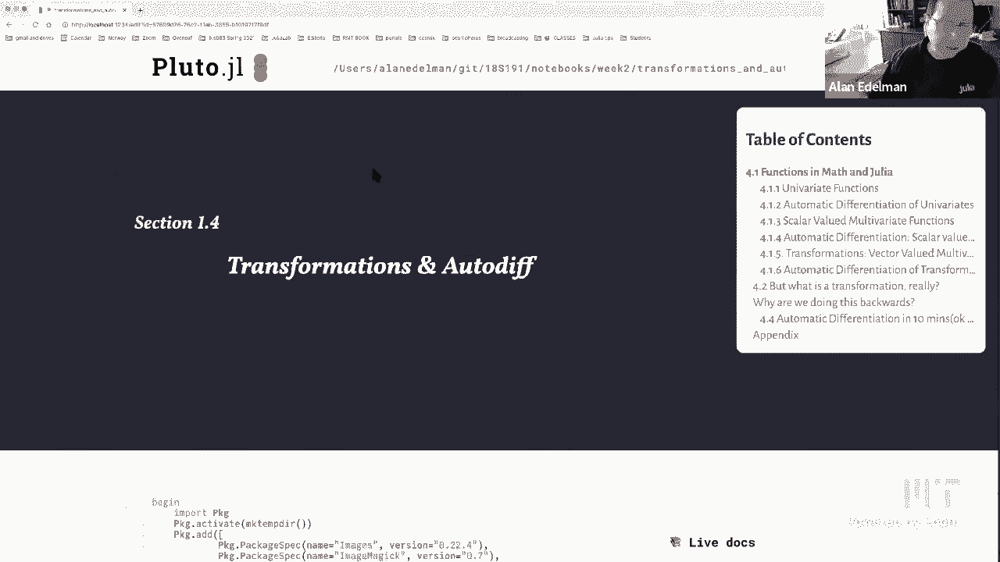

*   **匿名格式**：函数本身没有名称，通常用于作为参数传递。例如，定义正弦函数：
    ```julia
    x -> sin(x)
    ```
    你可以将其赋值给一个变量来使用：
    ```julia
    my_sin = x -> sin(x)
    ```

*   **长格式**：使用 `function` 和 `end` 关键字，适合多行或逻辑复杂的函数。可以设置默认参数。
    ```julia
    function f₃(x; α=3)
        return x^α
    end
    ```

## 自动微分入门 ⚡

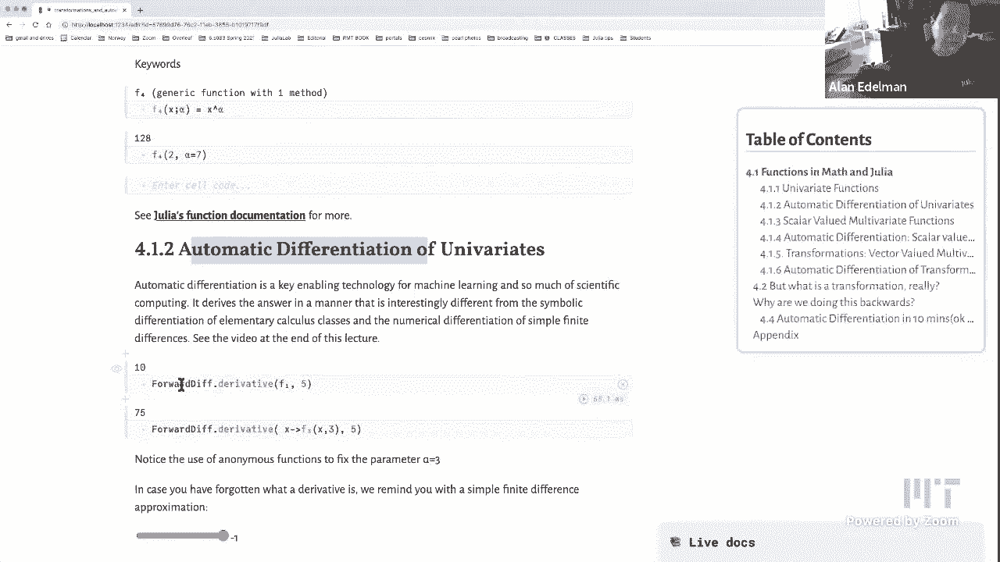

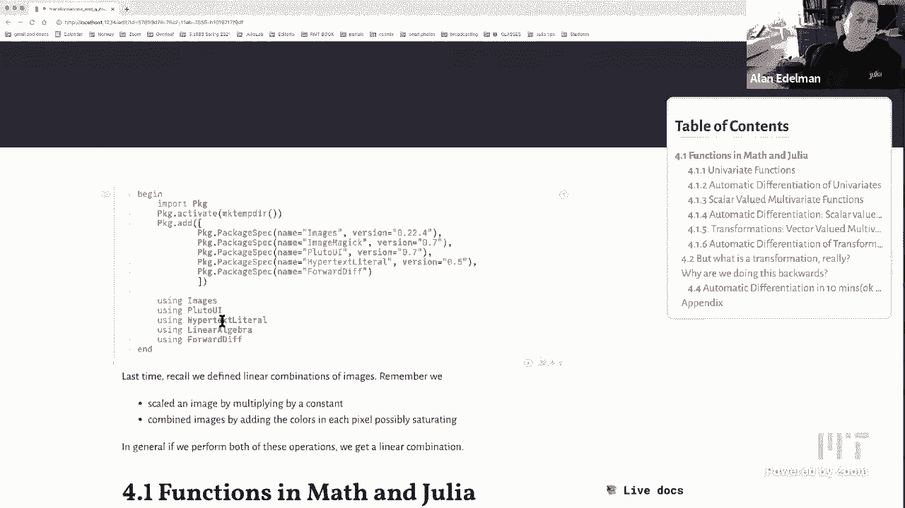

了解了函数的基本定义后，我们进入本节课的核心技术之一：自动微分。这与你在微积分课上学到的符号求导或数值近似求导都不同。

我们使用 `ForwardDiff` 包来进行自动微分。

*   **标量函数求导**：对于单变量函数，求导变得非常简单。
    ```julia
    using ForwardDiff
    f₁(x) = x^2
    derivative = ForwardDiff.derivative(f₁, 5) # 在x=5处的导数
    ```

*   **梯度计算**：对于多变量标量函数，自动微分可以计算其梯度（即所有偏导数组成的向量）。
    ```julia
    f₅(x, y, z) = 5 * sin(x*y) + 2*y / (4*z)
    # 在点(1,2,3)计算梯度
    grad = ForwardDiff.gradient(v -> f₅(v[1], v[2], v[3]), [1, 2, 3])
    ```
    从数学上看，梯度 `∇f` 给出了函数增长最快的方向。

## 向量函数与变换 🌀

上一节我们处理了输入为向量、输出为标量的函数，本节中我们来看看输入和输出都是向量的函数，这通常被称为**变换**。

以下是几个变换的例子，包括线性和非线性的：

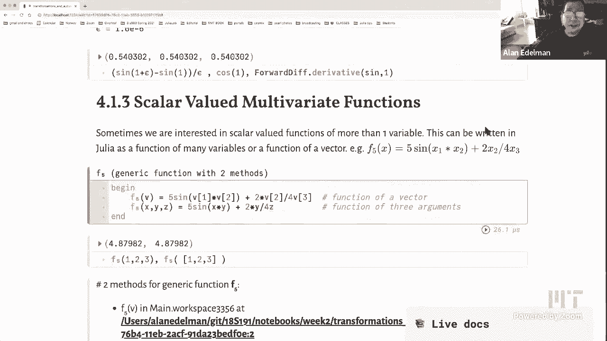

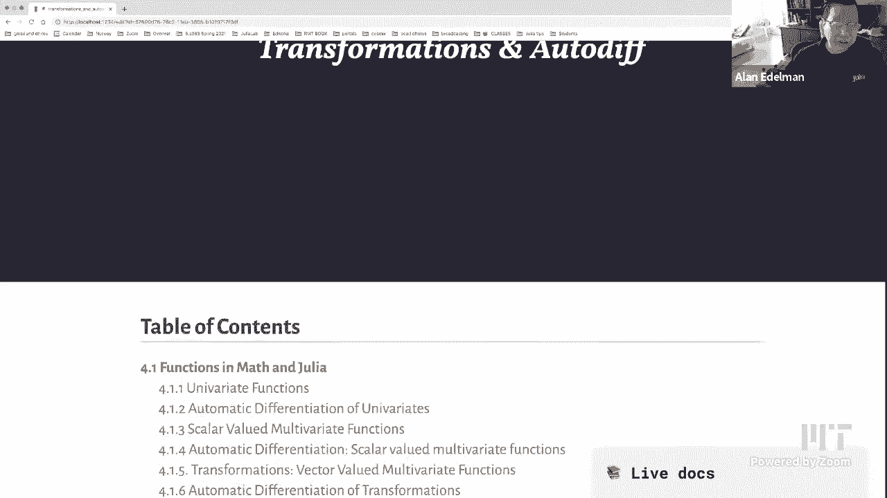

*   **恒等变换**：最简单的线性变换。
    ```julia
    identity_transform((x, y)) = [x, y]
    ```

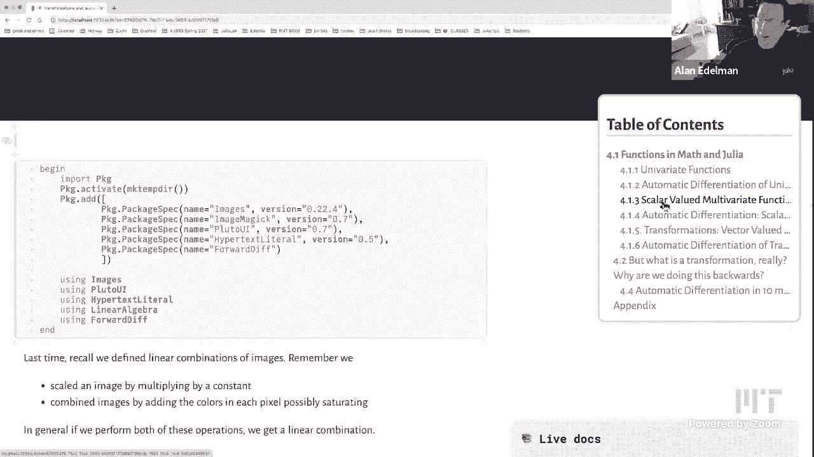

*   **缩放变换**：沿x轴或y轴进行缩放。
    ```julia
    scale_x(α) = ((x, y),) -> [α*x, y]
    scale_y(α) = ((x, y),) -> [x, α*y]
    ```

*   **旋转变换**：将点绕原点旋转角度θ。
    ```julia
    rotate(θ) = ((x, y),) -> [cos(θ)*x - sin(θ)*y, sin(θ)*x + cos(θ)*y]
    ```

*   **剪切变换**：
    ```julia
    shear(α) = ((x, y),) -> [x + α*y, y]
    ```

*   **非线性扭曲变换**：旋转角度取决于点到原点的距离。
    ```julia
    warp(α) = ((x, y),) -> rotate(α * sqrt(x^2 + y^2))((x, y))
    ```

## 雅可比矩阵：变换的导数 📐

对于向量到向量的变换，其“导数”是一个矩阵，称为**雅可比矩阵**。它描述了变换在局部的最佳线性近似。

对于变换 `F([x, y]) = [u(x,y), v(x,y)]`，其雅可比矩阵 `J` 为：
```
J = [ ∂u/∂x  ∂u/∂y ]
    [ ∂v/∂x  ∂v/∂y ]
```

我们可以用自动微分轻松计算雅可比矩阵：
```julia
F(p) = warp(3)(p) # 以α=3的扭曲变换为例
J = ForwardDiff.jacobian(F, [4, 5])
```
雅可比矩阵的行列式绝对值给出了该点附近面积的局部缩放因子。

## 矩阵即线性变换 🖼️

现在，让我们将理论可视化。一个**矩阵**本质上代表了一个**线性变换**。矩阵乘法 `A * v` 就是将线性变换 `A` 应用于向量 `v`。

所有线性变换都能保持网格线的“平行四边形”结构。如果一个变换能将均匀的方格网格映射为另一组均匀的平行四边形网格，那么它就可以用一个矩阵来表示。

*   **行列式的几何意义**：矩阵 `A` 的行列式 `det(A)` 表示该线性变换导致的**面积缩放比例**。如果 `det(A) = 1`，则变换是保面积的（如旋转、剪切）。

对于非线性变换，虽然整体网格会扭曲，但在任意点的无穷小邻域内，它仍然由一个雅可比矩阵（即一个线性变换）来近似描述。

## 总结 🎯

本节课中我们一起学习了：
1.  Julia中定义函数的多种方式。
2.  **自动微分**的原理与应用，它不同于符号或数值求导，是机器学习等领域的关键技术。
3.  向量值函数，即**变换**，包括线性和非线性变换的例子。
4.  **雅可比矩阵**作为多变量变换的导数，描述了局部线性行为。
5.  将**矩阵理解为线性变换**，并通过图像变换直观感受行列式等概念的几何意义。

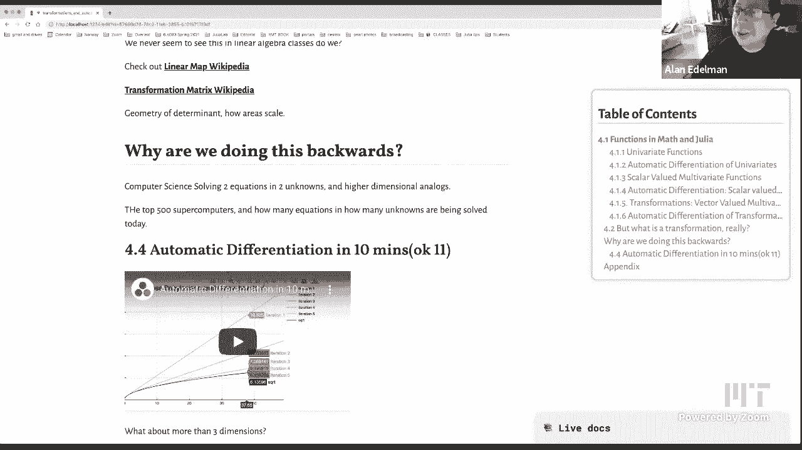

通过结合编程实践与数学直观，我们希望你能对线性代数和多元微积分产生新的、更深刻的理解。