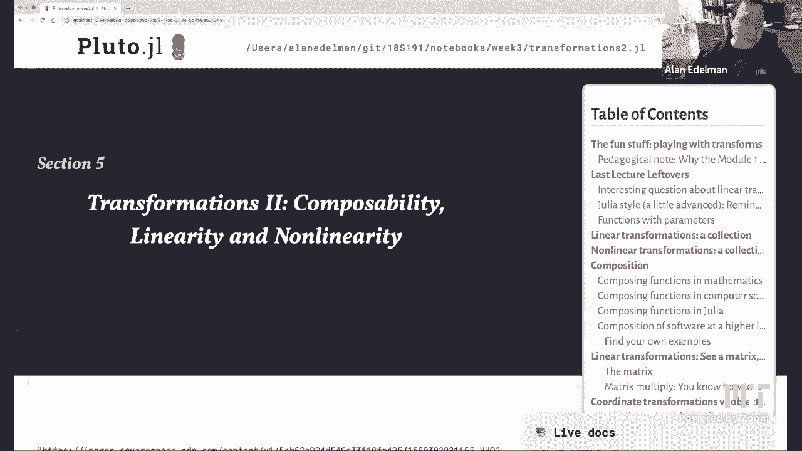
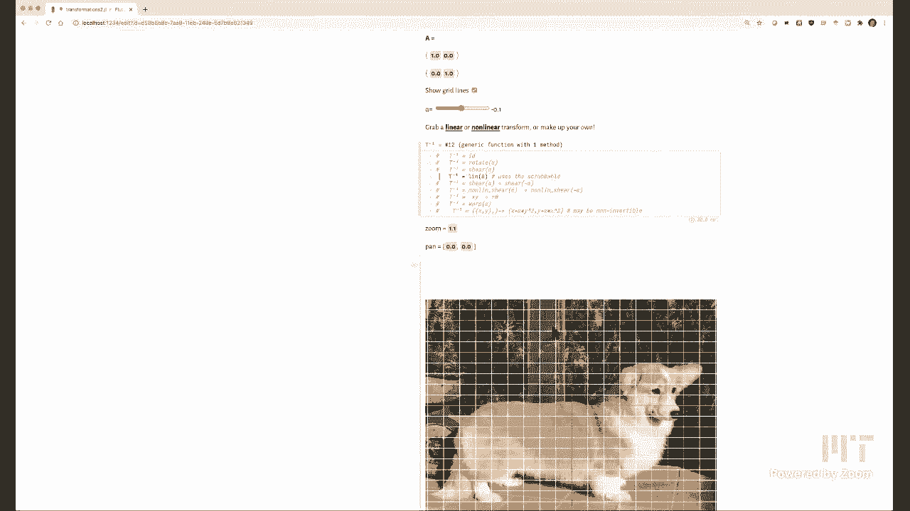
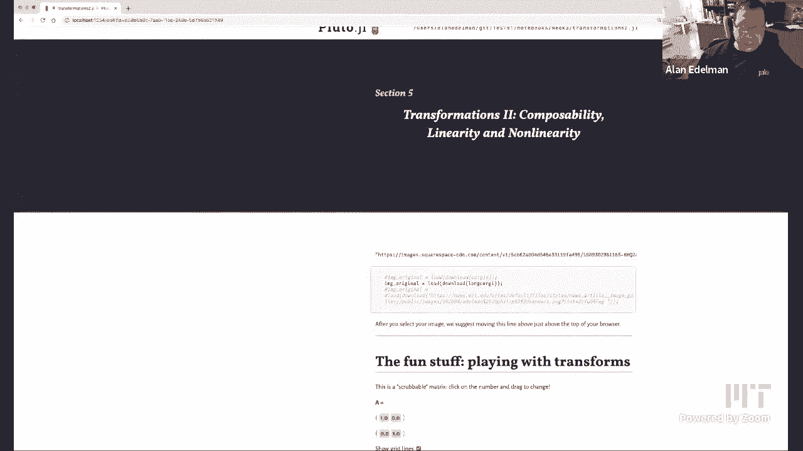
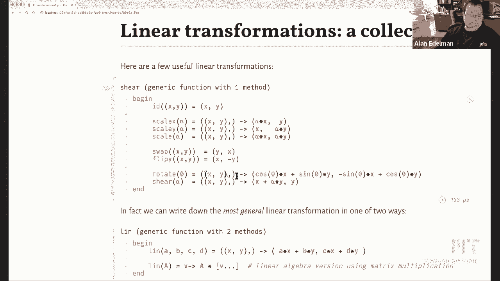
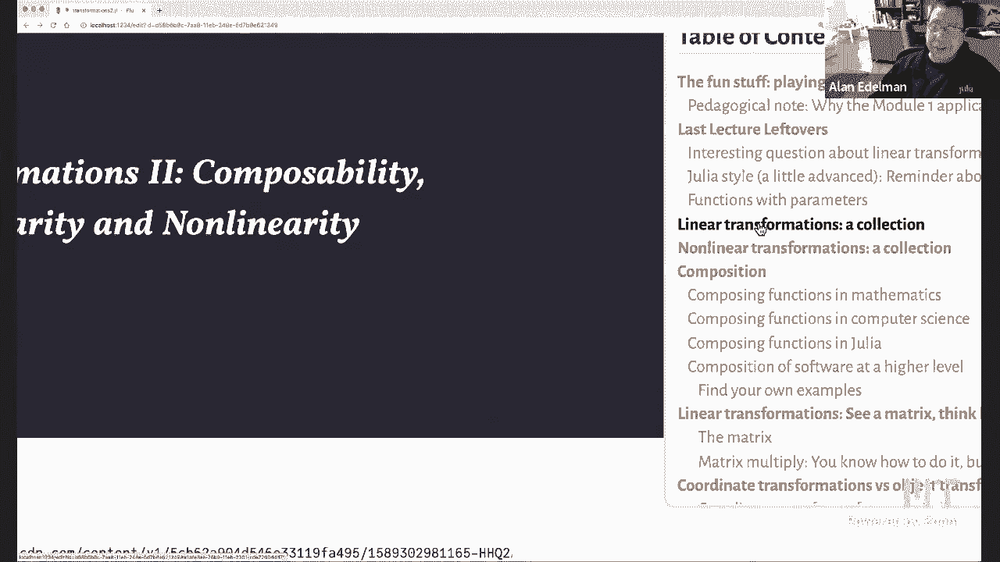
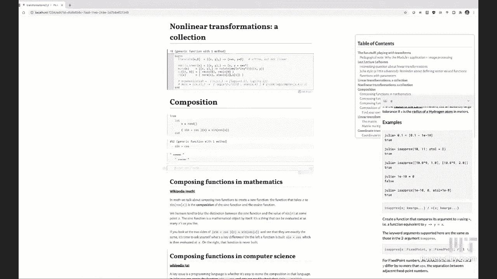
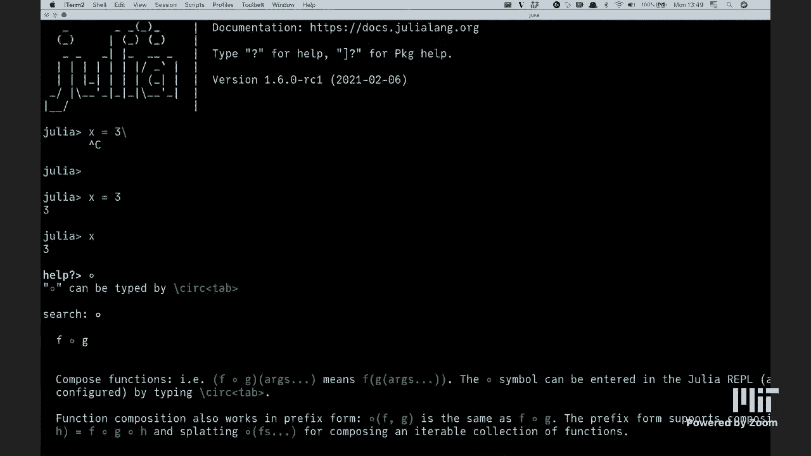
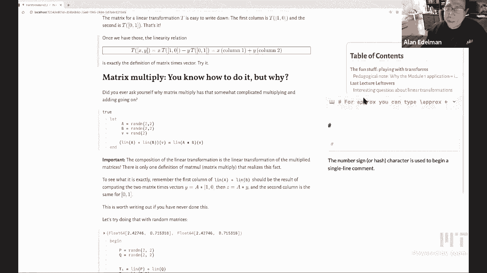

# L4：变换：线性变化与非线性变化，组合变换 🌀



在本节课中，我们将要学习图像变换的核心概念，包括线性变换与非线性变换，以及如何组合这些变换。我们将通过直观的图像操作来理解抽象的数学概念，并探索函数与软件的组合性。

---

## 概述

上一节我们介绍了Julia编程的基本操作和图像处理作为学习背景。本节中，我们将深入探讨变换的数学原理。我们将看到，变换不仅仅是移动像素，它背后对应着深刻的线性代数概念。通过动手操作，我们可以直观地理解矩阵如何作用于图像，以及线性与非线性变换的区别。





---

## 线性变换：从图像到矩阵

线性变换是一类特殊的变换，它满足两个核心性质：**缩放性**和**可加性**。在图像上，一个直观的表现是：一个由等大小矩形组成的网格，在经过线性变换后，会变成一个由**全等平行四边形**组成的网格。

以下是线性变换的数学定义。一个变换 **T** 是线性的，当且仅当对于任意向量 **v₁**, **v₂** 和任意标量 **c₁**, **c₂**，都满足：
```
T(c₁ * v₁ + c₂ * v₂) = c₁ * T(v₁) + c₂ * T(v₂)
```

在代码中，我们可以用矩阵乘法来实现一个通用的线性变换：
```julia
linear_transform(M) = v -> M * v
```
其中 `M` 是一个2x2矩阵，`v` 是坐标向量 `[x, y]`。

以下是几种常见的线性变换示例：
*   **缩放**：改变图像在x或y方向的大小。
*   **旋转**：围绕原点旋转图像。
*   **剪切**：使图像在某一方向上发生倾斜，而另一方向的坐标保持不变。
*   **翻转**：沿x轴或y轴镜像图像。

所有这些变换都可以通过一个2x2矩阵来定义。矩阵的每一列，实际上代表了变换后标准基向量 `[1, 0]` 和 `[0, 1]` 的新位置。

---

## 非线性变换：打破网格的规则

并非所有变换都是线性的。非线性变换不满足上述的线性条件，它们在图像上会产生更复杂、更“弯曲”的效果。一个简单的例子是**平移**（移动整个图像），因为它不满足“零向量映射到零向量”这一线性变换的基本要求。

在非线性变换下，矩形网格可能会变成各种曲线网格。然而，有一个重要的观察：**在非常小的局部区域内，任何光滑的非线性变换都近似于一个线性变换**。这是许多应用数学方法的基础。

以下是一些非线性变换的例子：
*   **平移**：`(x, y) -> (x + a, y + b)`
*   **非线性剪切**：例如 `(x, y) -> (x + α*y^2, y)`
*   **极坐标变换**：将图像从直角坐标系映射到极坐标系。
*   **自定义扭曲函数**：例如 `(x, y) -> (x + α*sin(5x), y)`

你可以尝试输入任何数学函数来创建自己的变换，观察图像如何被扭曲，这是探索函数行为的绝佳方式。

---

## 透视变换：一个有趣的边界案例





一个常见的误解是，所有“将直线映射为直线”的变换都是线性的。**透视变换**（如模拟人眼观看三维场景的投影）就是一个反例。在透视变换中，原本平行的直线在图像中会相交于“消失点”，且等大的矩形会变成大小不一的梯形，这违反了线性变换中“全等平行四边形”的特性。

因此，**“保持直线性”不足以定义线性变换**。透视变换在数学上通常用齐次坐标和3x3矩阵（对于二维）或4x4矩阵（对于三维）来表示，并在最后一步进行除法，这使得它整体上是非线性的。

---

## 变换的组合与逆变换

组合是数学和计算机科学中的一个核心思想。组合变换意味着按顺序应用多个变换。在Julia中，我们可以使用函数复合运算符 `∘`。

例如，先旋转再剪切可以表示为：
```julia
composed_transform = shear(α) ∘ rotate(θ)
```

一个特别重要的概念是**逆变换**。如果变换 **T** 将点A移动到点B，那么它的逆变换 **T⁻¹** 恰好将点B移回点A。当组合一个变换和它的逆变换时，结果将是**恒等变换**（什么都不做）：
```
T⁻¹ ∘ T = Identity
```
在图像处理中，这意味着先应用一个扭曲，再应用其反向扭曲，图像将恢复原状。

---

## 代码风格与函数设计

在编写变换函数时，代码的可读性很重要。比较以下两种定义缩放函数的方式：
```julia
# 方式一：使用向量索引
scale_1(α) = v -> [α*v[1], v[2]]

# 方式二：解构参数，命名更清晰
scale_2(α) = ((x, y),) -> (α*x, y)
```
第二种方式直接使用 `x` 和 `y` 作为参数名，更清晰地表达了函数的意图。





当变换需要参数时（如旋转角度α），我们使用**匿名函数**格式来定义，这允许我们轻松创建一系列参数化的变换函数库。

---

## 软件的组合性

组合性的思想不仅限于数学函数，它也是优秀软件设计的目标。在理想情况下，不同人编写的代码模块应该能够无缝地协同工作，而无需预先进行大量协调。例如：
*   一个用于求解微分方程的模块。
*   一个用于优化参数的模块。
*   一个用于机器学习的神经网络模块。

如果这些模块设计良好（具有清晰的接口和一致的行为），我们就可以像组合数学函数一样将它们组合起来，用优化器包裹求解器，或用神经网络作为微分方程的一部分。**Julia语言社区正致力于实现这种高度的可组合性**，让科研代码像乐高积木一样易于拼接。

---

## 总结

本节课中我们一起学习了变换的核心概念。我们理解了**线性变换**可以通过矩阵乘法实现，并将网格变为平行四边形；而**非线性变换**则能产生更丰富、更复杂的扭曲效果。我们探讨了**透视变换**作为非线性变换的例子，并强调了“直线映射到直线”并非线性的充分条件。最后，我们深入了解了**变换的组合**与**逆变换**的概念，并将这种组合性提升到了软件设计哲学的高度。



通过动手操作图像，我们将抽象的代数定义转化为直观的视觉体验，这正是计算思维的魅力所在：**利用计算机的交互能力，去探索和深化我们对数学世界的理解**。