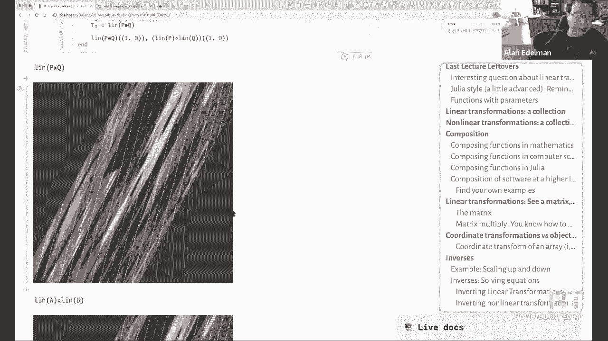
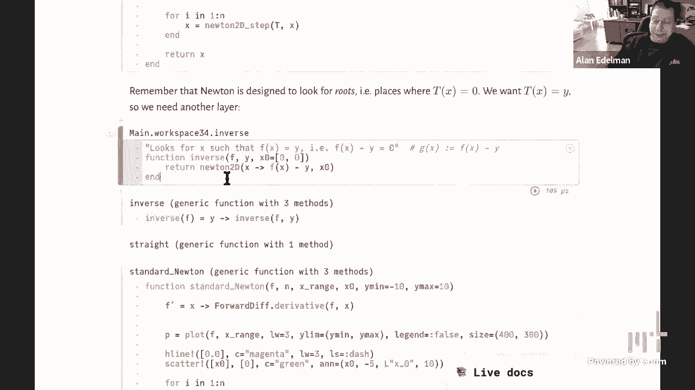

# L5：逆变换、牛顿法 🧮

在本节课中，我们将学习如何对线性及非线性变换进行求逆，并深入探讨牛顿法这一强大的数值求解工具。我们将从线性变换的逆矩阵开始，逐步过渡到使用牛顿法求解非线性方程的根，最终实现复杂非线性变换的求逆。

## 线性变换与逆矩阵 🔄

上一节我们探讨了线性变换及其矩阵表示。本节中我们来看看如何“撤销”一个线性变换，即求其逆变换。

对于一个线性变换，如果存在另一个变换能将其效果完全抵消，使物体回到原始状态，那么这个变换就是可逆的，我们称后者为前者的逆变换。



在矩阵表示中，若矩阵 **A** 表示的变换是可逆的，则存在一个矩阵 **A⁻¹**，满足：
**A⁻¹ * A = I** 且 **A * A⁻¹ = I**
其中 **I** 是单位矩阵。

在Julia中，我们可以直接计算矩阵的逆：
```julia
A = [1 2; 3 4]
invA = inv(A)
# 验证 A * invA 是否近似等于单位矩阵
A * invA ≈ I
```

## 非线性变换的挑战与思路 🌀

然而，现实世界中的许多变换，如图像的透视变形、非线性扭曲等，都不是线性的。它们的函数形式复杂，通常无法简单地用一个矩阵来表示，因此也无法直接使用矩阵求逆的方法。

对于非线性函数 **y = f(x)**，求逆意味着：给定输出 **y**，我们要找到对应的输入 **x**，使得 **f(x) = y**。这等价于求解方程 **f(x) - y = 0** 的根。

## 牛顿法：一维情况 📉

为了求解非线性方程的根，我们引入牛顿法。这是一种迭代算法，通过线性逼近来快速收敛到方程的根。

牛顿法的核心思想是：从一个初始猜测值 **x₀** 开始，利用函数在该点的切线（线性近似）来找到与x轴的交点，以此作为下一个、更接近真实根的估计值 **x₁**。

其迭代公式为：
**xₙ₊₁ = xₙ - f(xₙ) / f'(xₙ)**
其中 **f'(xₙ)** 是函数在 **xₙ** 处的导数。

以下是牛顿法在Julia中的简单实现，用于寻找函数 `f(x) = x² - 2` 的根（即 √2）：
```julia
function newton1d(f, fprime, x0; tol=1e-10, maxiter=100)
    x = x0
    for i in 1:maxiter
        fx = f(x)
        abs(fx) < tol && break # 如果f(x)足够接近0，则停止
        x = x - fx / fprime(x) # 牛顿迭代更新
    end
    return x
end

f(x) = x^2 - 2
fprime(x) = 2x # 导数
root = newton1d(f, fprime, 1.5) # 从1.5开始寻找根
```

## 牛顿法：扩展到多维与求逆 🧭

对于从二维到二维的非线性变换 **y = T(x)**，求逆问题同样可以转化为求根问题：给定 **y**，寻找 **x** 使得 **G(x) = T(x) - y = 0**。

此时，牛顿法的公式需要从标量形式推广到向量形式。迭代步骤变为：
**xₙ₊₁ = xₙ - J⁻¹(xₙ) * G(xₙ)**
其中 **J(xₙ)** 是变换 **T** 在点 **xₙ** 处的雅可比矩阵（即导数在多维的推广）。**J⁻¹(xₙ) * G(xₙ)** 在计算上等价于求解线性方程组 **J(xₙ) * Δ = -G(xₙ)** 得到 **Δ**，然后更新 **xₙ₊₁ = xₙ + Δ**。

在Julia中，我们可以利用自动微分来计算雅可比矩阵，并利用反斜杠运算符 `\` 来高效求解线性方程组：
```julia
using ForwardDiff

function newton_inverse(T, y, x0; tol=1e-10, maxiter=100)
    x = x0
    for i in 1:maxiter
        G(x) = T(x) - y # 定义目标函数
        g_val = G(x)
        norm(g_val) < tol && break # 如果G(x)的范数足够小，则停止
        J = ForwardDiff.jacobian(G, x) # 自动计算雅可比矩阵
        delta = -J \ g_val # 求解 J * delta = -G(x)
        x = x + delta
    end
    return x
end
```

## 图像变换求逆的实践 🖼️

在图像处理中，我们经常需要根据变换后的像素位置，反推它在原图中的位置来获取颜色值（即逆向映射），以避免出现空洞或重叠。这正是非线性变换求逆的一个典型应用。

以下是实现图像非线性变换求逆的关键步骤概述：

1.  **定义变换**：明确将原图坐标 **(x, y)** 映射到新坐标 **(x', y')** 的函数 **T**。
2.  **目标求逆**：对于变换后图像上的每个像素点 **p'**，我们需要找到原图中的点 **p**，使得 **T(p) = p'**。
3.  **应用牛顿法**：以 **p'** 作为目标值 **y**，以一个合理的初始猜测（例如，假设变换不大，可用 **p'** 本身作为初始值）开始，利用上述的 `newton_inverse` 函数求解 **p**。
4.  **采样颜色**：根据求得的原图坐标 **p**（可能是非整数），通过插值方法（如双线性插值）从原图中获取颜色，并填充到变换后图像的 **p'** 位置。

## 总结 📚

本节课中我们一起学习了变换求逆的核心概念与方法。

*   我们回顾了**线性变换的逆**可以通过求逆矩阵得到。
*   我们认识到**非线性变换求逆**的复杂性，并将其转化为**求根问题**。
*   我们深入学习了**牛顿法**，从一维求根公式开始，理解了其通过**线性逼近（切线）** 快速迭代收敛的原理。
*   我们将牛顿法成功**推广到多维情形**，用于求解向量值函数的根，从而实现了对复杂非线性变换的数值求逆。
*   最后，我们看到了这一方法在**图像扭曲与恢复**中的实际应用，理解了逆向映射的重要性。




牛顿法是一个强大而基础的工具，其思想——用可解的线性问题去逼近和解决非线性问题——在科学计算的许多领域都有广泛应用。