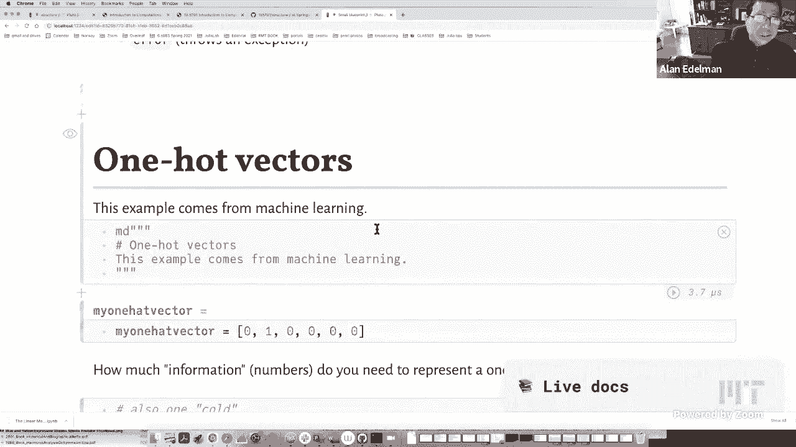
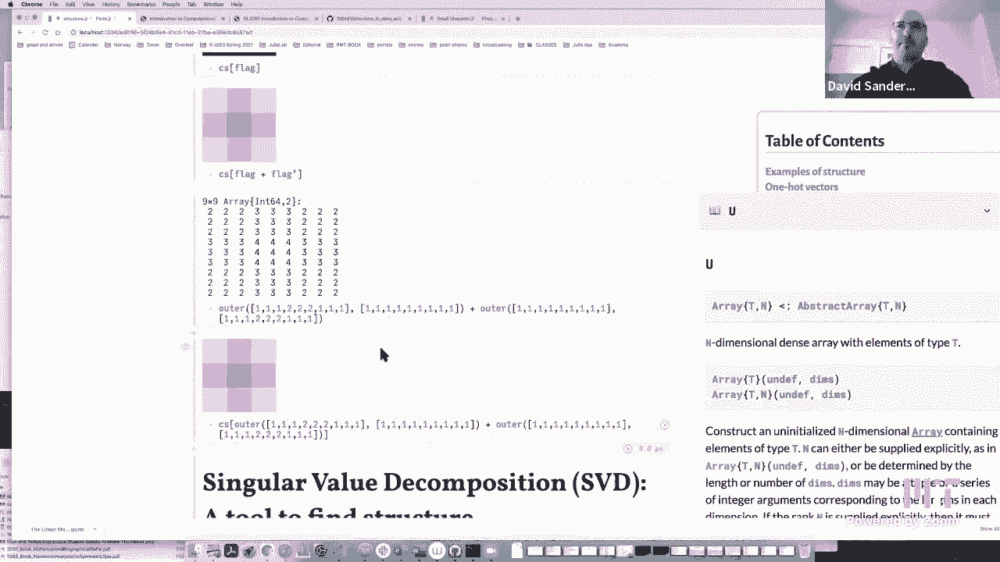
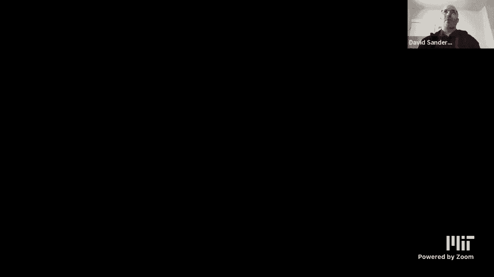
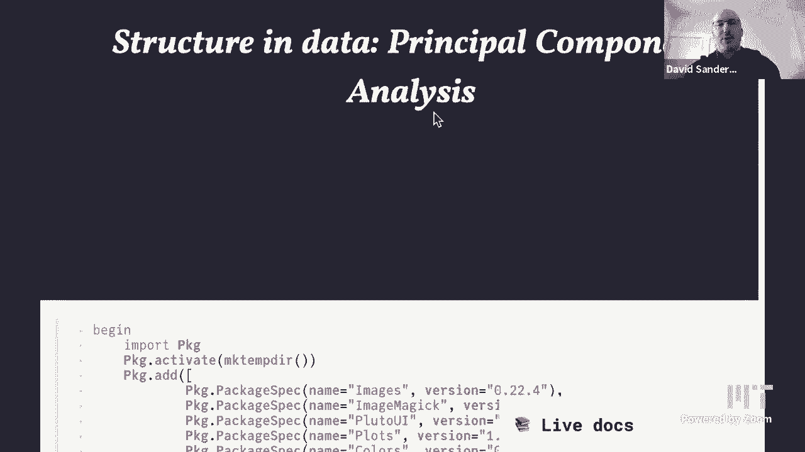
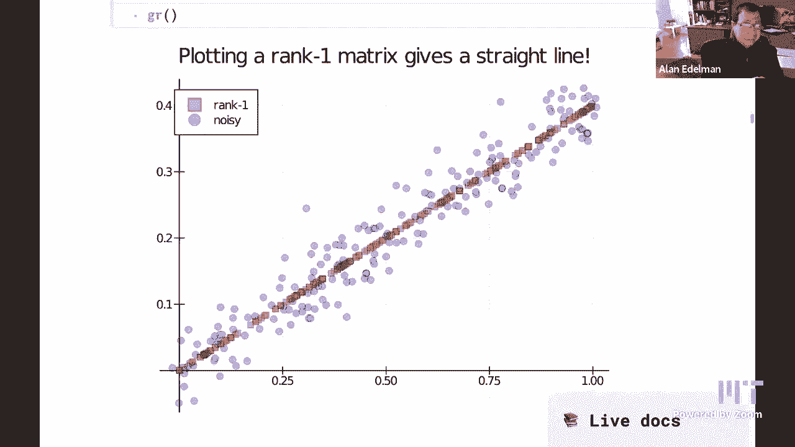

# 计算思维导论：第7讲：结构 🧩




在本节课中，我们将学习如何识别和利用数据中的“结构”。结构意味着数据并非完全随机，而是存在某种模式或规律，我们可以利用这些规律来更高效地存储、处理和理解数据。我们将通过几个具体的例子来探索这个概念，包括稀疏矩阵、随机向量的统计特性以及主成分分析。

---

## 结构示例：从存储效率说起

上一节我们提到了利用结构可以优化算法。本节中，我们来看看如何利用结构来优化数据的存储。

### 独热向量

一个“独热向量”是一个向量，其中只有一个元素是1，其余所有元素都是0。例如：
`[0, 1, 0, 0, 0, 0]`

虽然这个向量有6个元素，但我们真的需要存储6个数字吗？实际上，我们只需要两个信息：向量的长度 `n` 和那个“1”所在的位置 `k`。在Julia中，我们可以创建一个自定义类型来利用这种结构。

**代码示例：定义一个独热向量类型**
```julia
struct OneHot <: AbstractVector{Int}
    n::Int  # 向量长度
    k::Int  # 非零元素位置
end
```

通过定义 `size` 和 `getindex` 方法，我们可以让这个 `OneHot` 类型表现得像一个普通向量，但内部只存储两个整数。

**代码示例：让 OneHot 类型像向量一样工作**
```julia
Base.size(v::OneHot) = (v.n,)
Base.getindex(v::OneHot, i::Int) = Int(i == v.k)
```

这样，当我们索引 `OneHot(6, 2)[4]` 时，会返回0；索引 `OneHot(6, 2)[2]` 时，会返回1。我们成功利用了结构，避免了存储所有零。

### 对角矩阵

对角矩阵是另一种具有明显结构的矩阵，只有对角线上的元素可能非零。对于一个 `n x n` 的对角矩阵，我们只需要存储 `n` 个数字，而不是 `n^2` 个。

Julia内置了 `Diagonal` 类型来处理这种结构。与存储所有元素的“稠密”矩阵相比，`Diagonal` 类型只存储对角线元素，节省了大量空间。

---

## 结构示例：数据中的模式

并非所有结构都是为了节省存储空间。有时，结构体现在数据本身的内在关系上。

### 随机向量的统计结构

一个由1到9的随机整数组成的百万维向量，看似完全随机，没有结构。但实际上，它拥有统计意义上的结构。

例如，我们可以计算它的**均值**和**标准差**。对于在1到9上均匀分布的随机变量，其理论均值是5，理论标准差是 `sqrt((9^2 - 1)/12) ≈ 2.58`。多次生成这样的随机向量，其样本均值和标准差都会稳定在这些理论值附近。

**公式：均值与标准差**
- 均值：`mean(v) = sum(v) / length(v)`
- 标准差：`std(v) = sqrt( sum( (v .- mean(v)).^2 ) / (length(v) - 1) )`

这种稳定性就是一种“结构”。我们有时甚至可以用均值和标准差这两个摘要统计量来代表整个数据集，而忽略具体的百万个数字。

### 乘法表（外积）

一个矩阵如果是由两个向量的外积构成的，即矩阵的每个元素 `A[i, j] = v[i] * w[j]`，那么这个矩阵就具有极强的结构。它被称为**秩1矩阵**。

对于一个 `m x n` 的秩1矩阵，我们只需要存储 `m + n` 个数字（向量 `v` 和 `w`），而不是 `m * n` 个。然而，仅凭观察矩阵的值，我们很难一眼看出它是否具有这种结构。

**代码示例：检查并分解乘法表**
```julia
function factor_multiplication_table(A)
    v = A[:, 1]  # 取第一列
    w = A[1, :]  # 取第一行
    scale = v[1]
    v_normalized = v ./ scale
    w_scaled = w .* scale
    # 检查重构矩阵是否近似等于原矩阵
    if isapprox(outer(v_normalized, w_scaled), A)
        return v_normalized, w_scaled
    else
        error("输入矩阵不是乘法表")
    end
end
```

---

## 揭示隐藏结构：奇异值分解与主成分分析

如果矩阵不是完美的秩1矩阵，而是“近似”的秩1矩阵（例如一个秩1矩阵加上一些随机噪声），或者是由多个秩1矩阵相加而成，我们如何发现其中的结构呢？这就需要用到强大的**奇异值分解**工具。







### 奇异值分解

奇异值分解可以将任意矩阵 `A` 分解为多个秩1矩阵（外积）的和：
`A = U * Σ * V^T`
其中，`Σ` 是一个对角矩阵，其对角线上的值（奇异值）从大到小排列。`U` 和 `V` 的列向量分别代表了数据在行和列方向上的主要模式。

最大的奇异值对应的 `U` 的第一列和 `V` 的第一列相乘，就给出了对原矩阵 `A` 的“最佳”秩1近似。前k个奇异值对应的部分相加，就给出了对 `A` 的最佳秩k近似。

### 主成分分析：数据的视角

主成分分析是SVD在统计学中的叫法，它为我们提供了一种理解高维数据的视角。

假设我们有一个数据矩阵，每一行是一个数据样本，每一列是一个特征。PCA的目标是找到数据中方差最大的方向（即**主成分**）。这等价于对数据中心化后的矩阵进行SVD。

**可视化理解**：
- 将一个秩1矩阵的两行数据分别作为x轴和y轴的值绘制成散点图，所有点会精确地落在一条直线上。
- 如果对这个矩阵添加一些噪声，数据点会散布在这条直线周围。
- PCA可以帮助我们找到这条“隐藏”的直线，即数据的主要变化方向。第一个主成分就指向这个方向。数据点沿主成分方向的散布（方差）很大，而垂直于主成分方向的散布（噪声）很小。

通过只保留前几个主成分，我们可以用更少的维度来近似表示原始数据，实现**降维**和**去噪**。这在图像压缩（如JPEG）、数据可视化以及许多机器学习任务中都有广泛应用。

---

## 总结

本节课中我们一起学习了“结构”在计算思维中的核心地位。
1.  **存储结构**：我们看到了如何利用独热向量、对角矩阵、稀疏矩阵的特定模式，来设计高效的数据存储方式，避免保存不必要的零值或冗余信息。
2.  **数据模式**：我们认识到即使是随机数据，也存在如统计摘要（均值、方差）这样的稳定结构。此外，乘法表（外积）是一种特殊的矩阵结构。
3.  **结构发现**：我们引入了强大的奇异值分解工具及其统计学版本——主成分分析。SVD/PCA能够自动发现数据中隐藏的层级结构（秩1分量），并允许我们根据重要性（奇异值大小）来近似表示数据，广泛应用于压缩、去噪和洞察数据本质。



理解并利用结构，是编写高效算法、构建智能模型和从数据中提取洞见的关键一步。