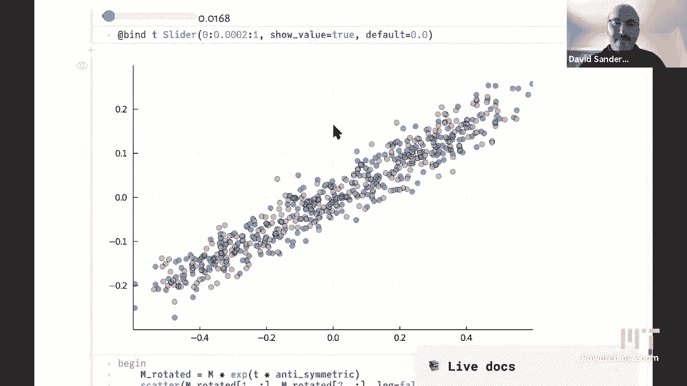

# L8：主成分分析 📊

在本节课中，我们将学习如何将图像视为数据，并引入一种强大的数据分析工具——主成分分析。我们将从矩阵的角度理解数据，并利用线性代数中的变换工具来分析和提取数据中的关键结构。

上一节我们讨论了图像作为数据的表示方法，本节中我们来看看如何从统计和概率的视角分析这些数据。这是一个很好的过渡话题，我们将把矩阵视为数据，并尝试用我们已经见过的变换工具来分析它。

## 从图像到数据点

我们首先回顾一下之前的工作。我们希望通过某种方式理解数据。我们观察一个矩阵，并在作业中也会处理类似的问题。

我们之前讨论了外积。外积本质上是一个乘法表。例如，矩阵的第一列包含数字1到10，第二列则是第一列数字的两倍。这意味着矩阵的每一列都包含相同的信息，只是按不同倍数缩放。同样，每一行也是前一行的倍数。

这种矩阵被称为**秩为一的矩阵**。这意味着矩阵中本质上只包含一个向量的信息。虽然我们需要两个向量来存储它（一个列向量和一个缩放系数向量），但信息量是单一的。

在作业中，你将创建一个新的Julia类型来实现这种矩阵。该类型内部只存储两个向量，但在索引时表现得像一个完整的矩阵。这是抽象数组的一个很好的例子。

当我们可视化秩为一的矩阵时，会看到棋盘格图案，因为每一列看起来都相同，只是颜色强度根据缩放系数变化。当我们叠加另一个秩为一的矩阵（形成秩为二的矩阵）时，棋盘格图案开始消失。

在上一讲的最后，Alan介绍了**奇异值分解**这个来自线性代数和数值代数的工具。SVD可以将任何矩阵分解为多个秩为一的矩阵之和，从而帮助我们提取矩阵中的结构信息。

## 将图像行视为数据坐标

现在，我们开始从图像分析过渡到更通用的数据分析。我们将图像的行视为数据的坐标。

具体做法是：取图像的一个子块，将第一行作为X坐标，第二行作为Y坐标，然后将这些点绘制在普通的二维图表上。图表上的每个点对应原始图像矩阵的一列，该列包含两个数据点（X和Y坐标）。

我们绘制了两组点：
*   红色点：来自单个秩为一的矩阵（一个乘法表）。
*   蓝色点：来自同一个矩阵，但为每个元素添加了噪声（随机数）。

蓝色点云明显分散在一条直线周围。假设我们不知道这些数据来自一条带噪声的直线，我们的目标是重建这条直线。这就是统计学和机器学习中的核心问题：找到以某种标准衡量的“最佳”拟合直线。

一种常见的方法是**最小二乘法**，它最小化每个数据点到直线的**垂直距离**的平方和。然而，我们将采用一种略有不同的方法：最小化数据点到直线的**垂直距离**（即点到直线的最短距离）。这种方法能更好地泛化。

## 分析数据点云：均值与方差

为什么红色点会形成一条直线？因为对于原始图像中的每一列 `(x, y)`，`y/x` 是一个常数。所有点都位于一条通过原点的直线上。

对于蓝色的噪声点云，我们首先需要衡量它的大小。一个直观的想法是测量点云的“宽度”。但简单地取最大值和最小值之差容易受到**异常值**的影响。因此，我们采用统计方法。

首先，找到点云的中心，即计算**均值**。在Julia中，可以使用 `Statistics` 标准库中的 `mean` 函数。

计算出均值 `(mean_x, mean_y)` 后，我们将每个数据点减去均值，使点云中心移动到坐标原点 `(0,0)`。

现在，我们想测量中心化后数据在X方向上的宽度。由于数据有正有负，直接求平均会相互抵消得到0。我们需要一个衡量平均距离的量。

一种方法是计算**平均绝对偏差**，即求所有X坐标绝对值的平均值。这相当于将点云沿Y轴折叠。我们计算得到大约0.25。

然而，更常用的度量是**标准差**。其计算步骤如下：
1.  计算所有X坐标的平方。
2.  求这些平方值的平均值，得到**方差**。
3.  对方差取平方根，得到**标准差** (σ)。

标准差衡量了数据点偏离均值的典型距离。我们通常在图表上绘制 `±2σ` 的线，对于正态分布数据，大约95%的数据点会落在这个范围内。

## 捕捉数据方向：相关性

仅用X和Y方向的标准差（即一个“盒子”）来描述数据是不够的，因为它无法捕捉数据点在这个盒子内的排列方式。数据可能沿着从左下到右上的对角线分布，这意味着两个变量（例如两次考试成绩）是正相关的。

为了捕捉这种方向信息，我们需要旋转视角。我们的目标是找到数据分布最分散的方向（即方差最大的方向）和最集中的方向。

我们可以通过以下两种等价方式实现：
1.  **旋转坐标轴**：让新坐标轴的方向沿着数据点云最长的方向，然后计算数据点在新轴方向上的投影的方差。
2.  **旋转数据**：固定坐标轴，将数据点云进行旋转，然后计算每次旋转后数据在水平方向（X轴）的方差。

当我们系统性地改变旋转角度θ并计算每个方向上的方差时，会得到一个关于θ的函数图。该图呈正弦波形，存在最大值和最小值，分别对应数据分布最长和最短的方向。

通过计算（例如使用Julia的 `argmax` 函数），我们可以找到这些关键方向及其对应的方差值。这些方向被称为**主成分**，最长的方向是**第一主成分**。

## 主成分分析的几何意义

主成分分析的目标就是找到这些关键方向。为什么它很重要？以两次考试成绩为例，第一主成分（长轴方向）可能代表学生的“综合能力”得分，这个单一数字很大程度上能区分不同学生。而垂直于它的方向（短轴）代表两次考试的相对表现差异，可能包含的信息较少。

在更高维度（例如三维），一个秩为一的矩阵的所有点会落在一条通过原点的直线上，添加噪声后形成一个圆柱形的点云。一个秩为二的矩阵的点则分布在一个“厚平板”上。

## 奇异值分解：计算的利器

之前我们通过旋转和搜索来计算主成分，这种方法计算量较大。**奇异值分解** 提供了一种更优雅、更高效的计算方法。

SVD指出，任何矩阵 `M` 都可以分解为三个矩阵的乘积：
`M = U * Σ * V^T`
其中：
*   `U` 和 `V` 是**正交矩阵**（代表旋转或反射）。
*   `Σ` 是**对角矩阵**，其对角线上的元素称为**奇异值**（代表拉伸因子）。

从几何变换的角度看，这意味着任何线性变换都可以分解为：先旋转 (`V^T`)，再沿坐标轴拉伸 (`Σ`)，最后再旋转 (`U`)。对于二维数据，这相当于将一个圆变换成一个椭圆，SVD直接给出了这个椭圆的长短轴长度（奇异值）和方向（`U` 的列向量）。

我们通过一个交互示例演示了这一点：从一个单位圆盘内的随机点开始，应用矩阵 `[2 1; 1 1]` 定义的变换。SVD分解出的奇异值（如2.6和0.38）正好对应了变换后椭圆的长轴和短轴长度，而 `U` 矩阵的列向量则指示了这些轴的方向。

## 高维视角与总结

最后，我们将SVD应用于原始的 `2×300` 图像数据矩阵。这个矩阵可以理解为二维空间中的300个点，也可以理解为300维空间中的2个点。SVD中的 `V` 矩阵代表了一个在300维空间中的旋转。虽然无法直观可视化300维空间，但我们可以通过投影观察这种旋转在二维平面上的效果，就像观察夜空中旋转的星轨。

本节课中我们一起学习了：
1.  如何将图像数据转化为可分析的坐标点。
2.  使用均值、方差和标准差描述数据点云的中心和离散程度。
3.  认识到需要分析数据的方向性，引入了主成分分析的思想。
4.  通过奇异值分解这一强大工具，高效地计算数据的主成分和拉伸因子。
5.  理解了PCA在降维和提取数据关键特征中的核心作用。

从下节课开始，我们将更深入地探讨随机性、概率论以及如何将其应用于数据分析。