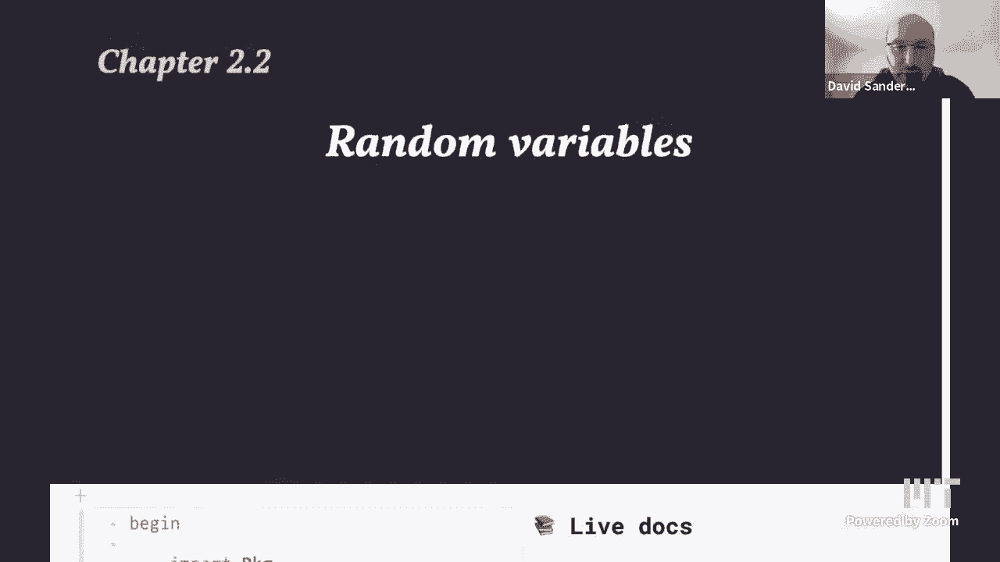
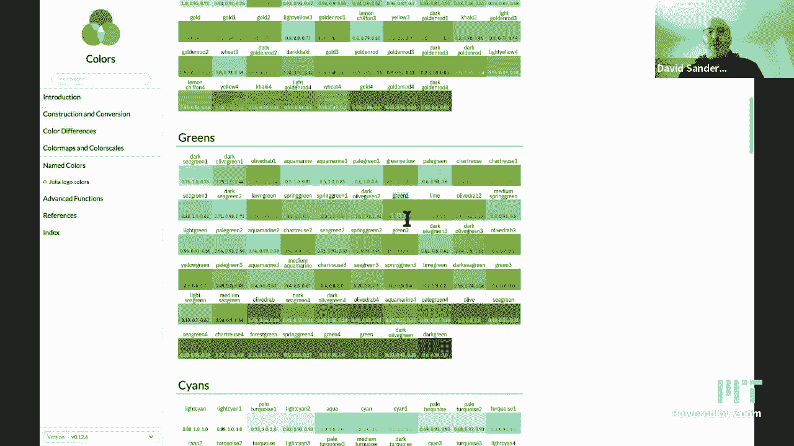
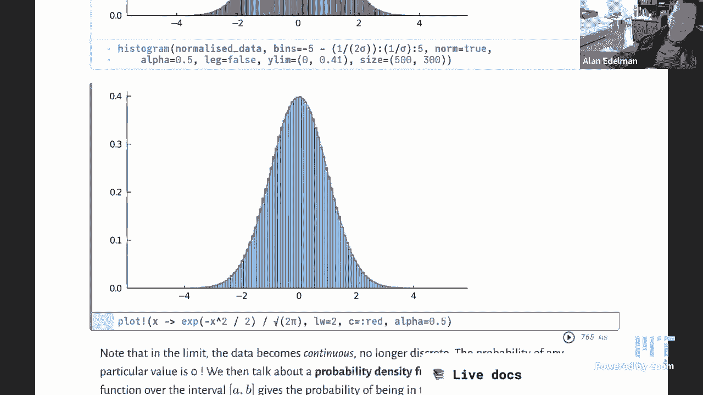

# 计算思维导论：P9：抽样与随机变量 🎲



在本节课中，我们将开始更详细地探讨概率与随机性。我们将学习什么是随机变量，如何在Julia中生成随机数，以及如何通过可视化和统计方法来理解随机过程的行为。

---

## 随机数生成

上一节我们介绍了课程概述，本节中我们来看看如何在Julia中生成随机对象。Julia提供了一个非常通用的函数 `rand` 来生成随机性。

以下是 `rand` 函数的一些基本用法：

*   `rand(1:6)`：从范围 `1:6` 中均匀地随机选取一个整数（模拟掷骰子）。
*   `rand([2, 3, 5, 7, 11])`：从给定的数组中随机选取一个元素。
*   `rand("MIT")`：从字符串中随机选取一个字符。
*   `rand('a':'z')`：从字符范围 `'a'` 到 `'z'` 中随机选取一个字符。
*   `rand()`：生成一个在 `[0, 1)` 区间内均匀分布的随机浮点数。
*   `rand(1:6, 10)`：生成一个包含10个随机整数的数组，每个整数都来自范围 `1:6`。
*   `rand(distinguishable_colors(10), 5, 5)`：生成一个5x5的矩阵，每个元素是从10种可区分颜色中随机选取的一种。

`rand` 函数非常灵活，它有很多不同的“方法”来处理不同类型的输入集合。

---

## 计数与概率

当我们多次重复一个随机实验（如抛硬币）时，我们常常需要统计每个结果出现的次数。我们可以使用 `countmap` 函数（来自 `StatsBase` 包）来轻松实现这一点。

例如，模拟抛10次硬币并统计正反面次数：
```julia
using StatsBase
tosses = rand(["heads", "tails"], 10)
toss_counts = countmap(tosses)
```
`countmap` 返回一个字典（`Dict`），其中键是可能的结果，值是该结果出现的次数。我们可以通过将次数除以总实验次数来估算每个结果的概率。

随着实验次数（如抛硬币次数）的增加，观测到的概率会趋近于其理论值（如0.5），这体现了“大数定律”。

---

## 非均匀抽样与伯努利试验

到目前为止，我们进行的都是均匀抽样，即每个结果被选中的概率相同。但有时我们需要模拟有偏的过程，例如一枚正面朝上概率为0.7的硬币。

以下是实现加权抽样的方法：

*   一种直观的方法是生成一个1到10的随机整数，如果数字≤7则返回“正面”，否则返回“反面”。
*   更通用的方法是利用 `rand()` 生成一个 `[0,1)` 的随机数，如果这个数小于给定的概率 `p`，则返回 `true`（代表成功），否则返回 `false`。这被称为以概率 `p` 进行的**伯努利试验**。

我们可以用简洁的Julia函数定义伯努利试验：
```julia
bernoulli(p) = rand() < p
```
运行这个函数多次，并统计 `true` 出现的比例，该比例会趋近于我们设定的概率 `p`。

---

## 随机变量与分布

一个**随机变量**是一个其值由随机现象结果决定的对象。我们关心的是它取每个可能值的**概率**。所有可能值及其对应概率的对应关系，称为该随机变量的**概率分布**。

为了直观理解分布，我们可以对实验数据进行可视化。

---

## 可视化：条形图与直方图

我们可以使用条形图来可视化**分类数据**（如骰子的点数）。

以下是绘制条形图的步骤：
1.  进行多次实验（如掷骰子）。
2.  使用 `countmap` 统计每个点数出现的次数。
3.  使用 `bar` 函数绘制条形图，其中x轴是类别（点数），y轴是对应的计数。

随着实验次数增加，每个条形的高度会趋近于期望的均匀分布。

当我们处理**数值数据**（如多个骰子的点数之和）时，我们使用**直方图**。直方图的条形宽度代表一个数值区间（“分箱”），条形面积（高度×宽度）与该区间内数据点的数量成正比。

使用 `histogram` 函数可以绘制直方图。通过设置 `norm=true`，可以归一化直方图，使得所有条形的总面积之和为1，这样y轴就表示概率密度。

---

## 中心极限定理

一个令人着迷的现象是：当我们对多个独立的随机变量（如多个骰子的点数）求和时，其总和的分布会呈现出特定的形状。

以下是观察这一现象的步骤：
1.  定义一个函数 `roll_dice(n)`，用于返回 `n` 个骰子点数的和。
2.  多次运行该实验，收集这些和值。
3.  绘制这些和值的直方图。




随着骰子数量 `n` 的增加，原始和值的分布会向右移动并展宽。为了看到收敛的形状，我们需要进行标准化：
*   **中心化**：从每个和值中减去其均值（`data .- mean(data)`）。
*   **缩放**：将中心化后的数据除以其标准差（`sigma`）。

经过 `(data .- mean(data)) ./ std(data)` 标准化处理后，无论 `n` 是多少，标准化后数据的分布都会收敛到同一个形状——著名的**钟形曲线**，即**正态分布**（或高斯分布）。

其概率密度函数公式为：
```
f(x) = (1 / √(2π)) * exp(-x² / 2)
```
这个现象就是**中心极限定理**的核心内容：大量独立随机变量之和的标准化形式，在极限条件下趋近于正态分布。这解释了为何正态分布在自然界和统计学中如此普遍。

---



本节课中我们一起学习了随机性的基本概念。我们探索了如何在Julia中生成随机数，如何进行计数和估算概率，以及如何实现非均匀抽样。我们定义了随机变量及其分布，并利用条形图和直方图进行可视化。最后，我们通过模拟多个骰子求和的实验，直观地验证了中心极限定理，观察到独立随机变量之和的标准化分布如何收敛到正态分布。这些工具和概念是理解更复杂随机过程和进行数据分析的基础。