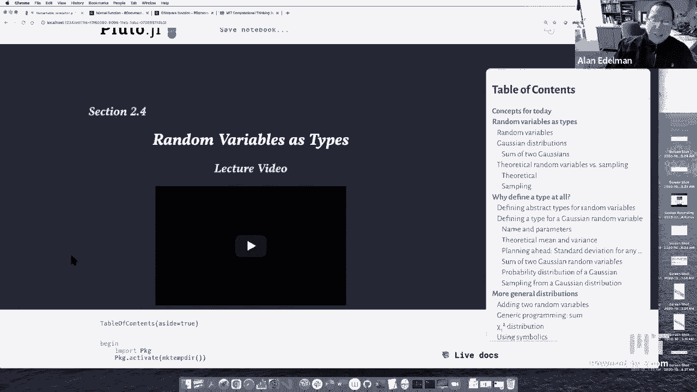
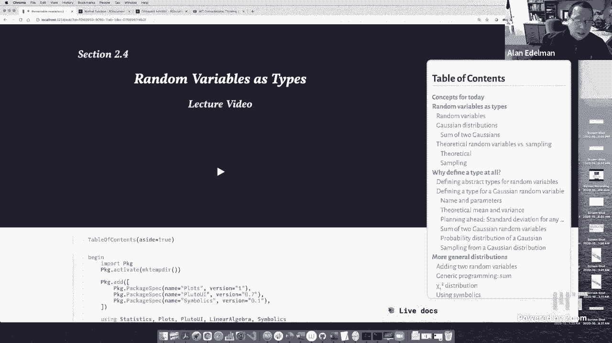
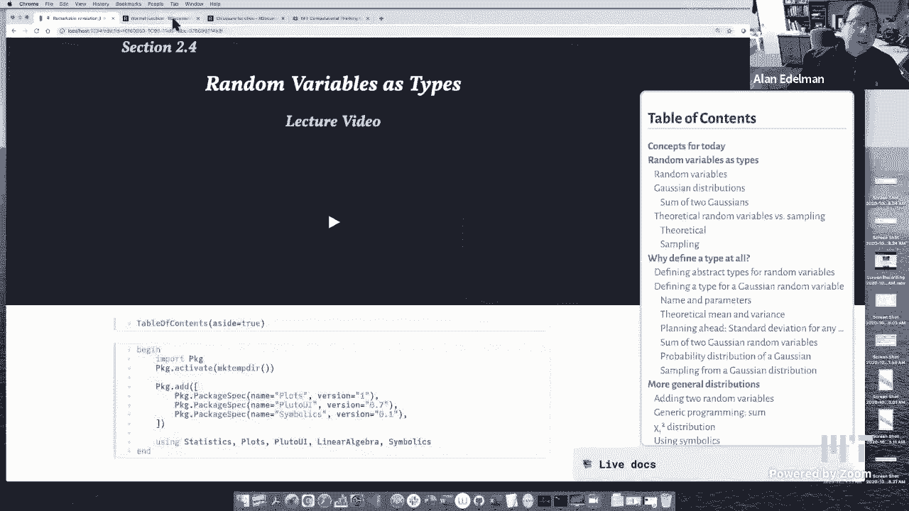
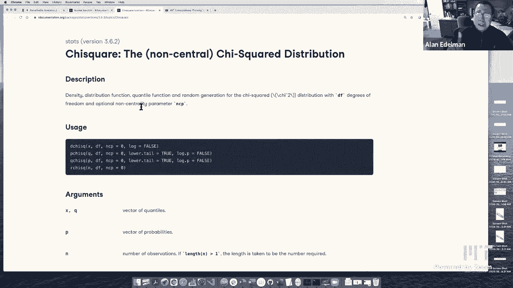
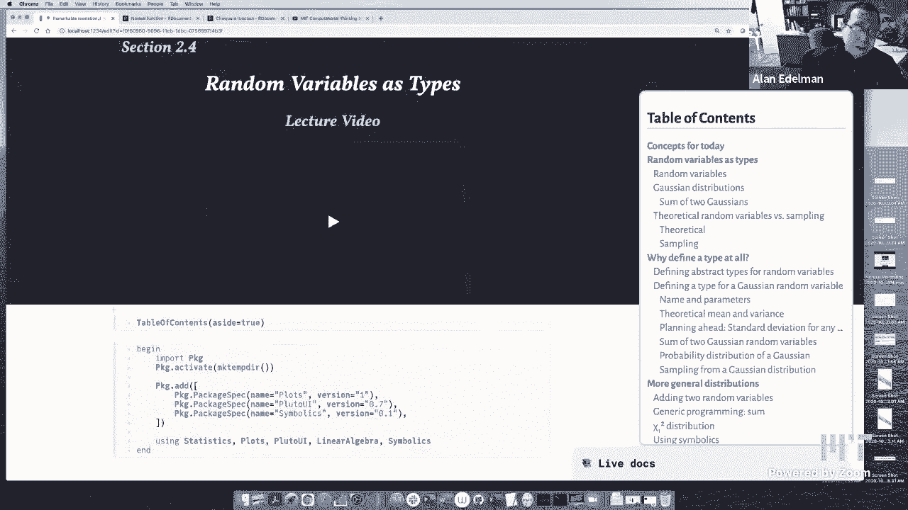
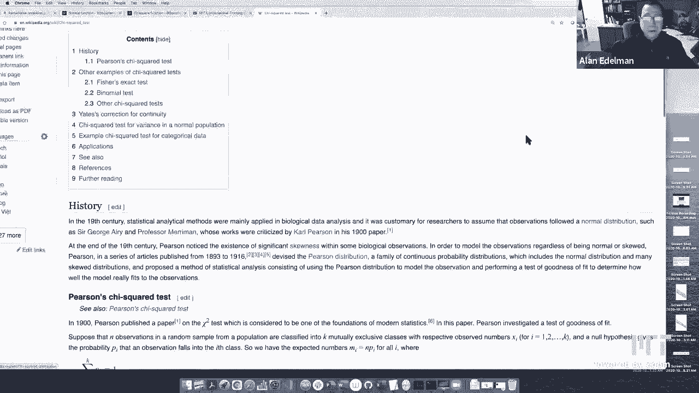
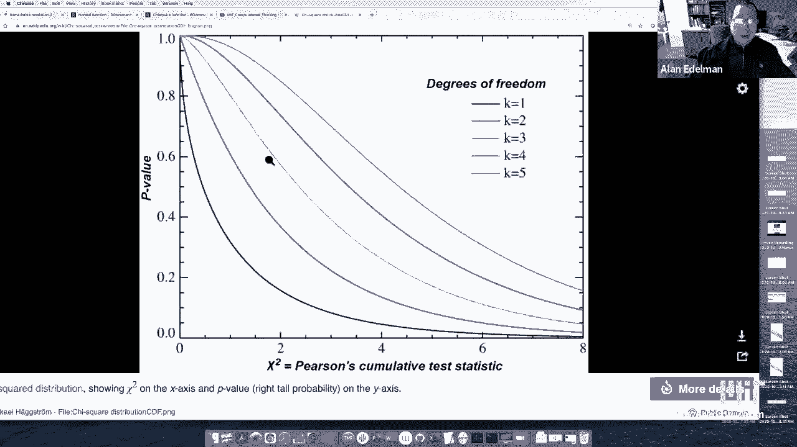
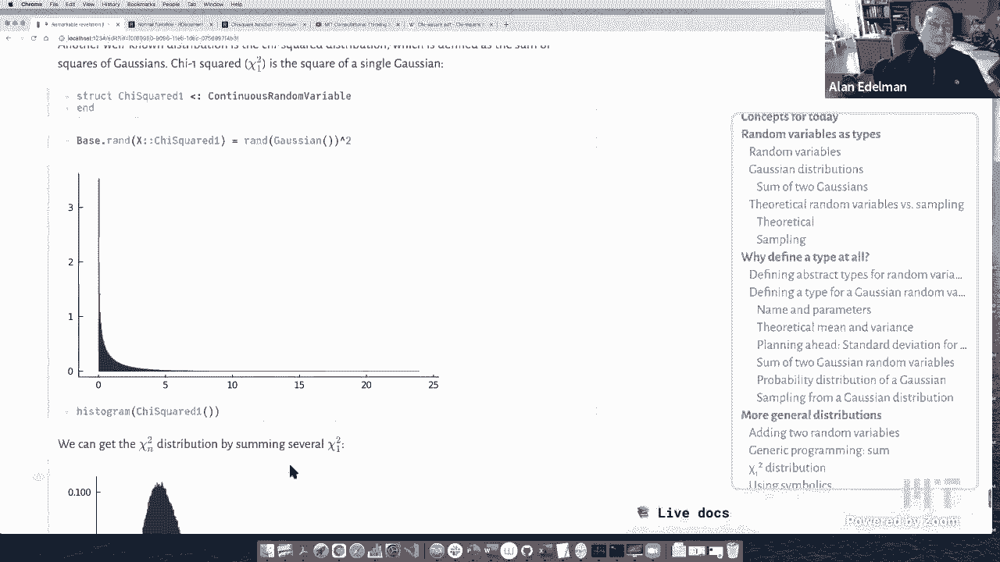
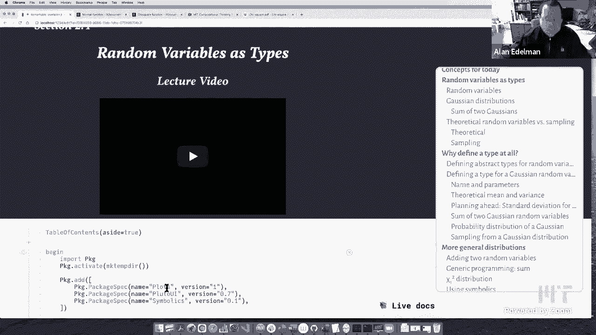
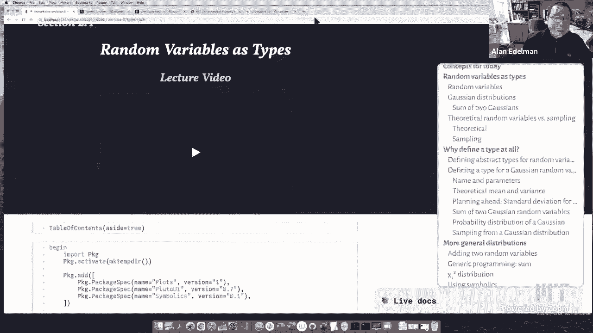

# L11：作为类型的随机变量 🎲







在本节课中，我们将学习如何利用Julia的类型系统来优雅地表示和操作随机变量。虽然内容以概率统计为背景，但其核心是关于如何通过抽象类型和子类型来组织代码，这是一种强大的计算机科学思想。





## 概述

我们将从随机变量的基本概念出发，逐步构建一个类型系统来表示高斯分布、伯努利分布等。你将看到，通过定义抽象类型和具体方法，我们可以轻松实现随机变量的命名、参数化、采样、求均值/方差以及相加等操作。这种设计模式不仅限于随机变量，可以应用于许多需要抽象和层次化组织的软件系统。

## 随机变量与概率分布

随机变量是概率论中的核心概念。对于一个离散随机变量，我们为其每个可能的结果分配一个概率。这组概率的集合被称为概率分布。

以高斯分布（正态分布）为例，它由两个参数决定：均值（μ）和标准差（σ）。均值决定了分布的中心位置，而标准差决定了分布的宽度。当μ=0，σ=1时，我们得到标准正态分布。

在Julia中，我们可以用以下方式生成标准正态分布的样本：
```julia
data = randn(10^5)
```
要生成均值为`mu`、标准差为`sigma`的样本，可以进行变换：
```julia
data = mu .+ sigma .* randn(10^5)
```
高斯分布的概率密度函数（PDF）公式为：
```
pdf(x) = (1 / (σ * √(2π))) * exp(-(x - μ)^2 / (2σ^2))
```

## 高斯分布的可加性

高斯分布有一个美妙的性质：两个独立高斯随机变量之和仍然是高斯随机变量。新分布的均值是原均值之和，方差是原方差之和。

如果 `X ~ N(μ₁, σ₁²)`， `Y ~ N(μ₂, σ₂²)`，且X与Y独立，那么：
```
X + Y ~ N(μ₁ + μ₂, σ₁² + σ₂²)
```
这个性质使得处理高斯分布的和变得非常简单。

## 设计随机变量的类型系统

上一节我们介绍了随机变量的基本操作，本节中我们来看看如何用类型系统来抽象地表示它们。关键在于“抽象”与“具体”的层次设计。

首先，我们定义一个抽象类型`RandomVariable`，作为所有随机变量的根。
```julia
abstract type RandomVariable end
```
然后，我们可以定义其子类型，例如区分连续型和离散型随机变量：
```julia
abstract type DiscreteRandomVariable <: RandomVariable end
abstract type ContinuousRandomVariable <: RandomVariable end
```
符号 `<:` 表示“是……的子类型”。

## 实现具体分布：高斯分布

现在，我们来实现第一个具体分布——高斯分布。它属于连续型随机变量。

定义一个高斯分布类型需要存储其均值和方差：
```julia
struct Gaussian <: ContinuousRandomVariable
    μ
    σ²
end
```
我们可以为它定义一个便捷的构造函数，创建标准正态分布：
```julia
Gaussian() = Gaussian(0, 1)
```
定义了类型，我们就可以为其实现各种方法。例如，计算理论均值和方法：
```julia
mean(d::Gaussian) = d.μ
var(d::Gaussian) = d.σ²
```
对于任何随机变量，标准差都是方差的平方根。我们可以为顶层的`RandomVariable`定义这个通用方法：
```julia
std(d::RandomVariable) = sqrt(var(d))
```
这是一个“泛化”的例子：我们为抽象类型定义通用行为，所有子类型只要实现了`var`方法，就能自动获得`std`方法。

## 随机变量的加法

我们希望能够将随机变量相加。对于高斯分布，我们可以利用其可加性，直接返回一个新的高斯分布：
```julia
import Base: +
+(X::Gaussian, Y::Gaussian) = Gaussian(mean(X) + mean(Y), var(X) + var(Y))
```
但是，并非所有随机变量相加后都能得到同类型的简单分布。例如，两个伯努利分布相加的结果不再是伯努利分布。

为了解决通用性问题，我们创建一个新的类型来表示“两个随机变量的和”：
```julia
struct SumOfTwoRandomVariables <: RandomVariable
    X
    Y
end
```
然后，我们可以为`+`运算符定义一个更通用的方法，当不知道具体规则时，就返回这个“和”类型：
```julia
+(X::RandomVariable, Y::RandomVariable) = SumOfTwoRandomVariables(X, Y)
```
对于“和”类型，我们也可以定义其均值等方法。根据期望的线性性质，无论X和Y是什么，和的均值等于均值之和：
```julia
mean(S::SumOfTwoRandomVariables) = mean(S.X) + mean(S.Y)
```
如果X和Y独立，方差也可加：
```julia
var(S::SumOfTwoRandomVariables) = var(S.X) + var(S.Y)
```
最后，为了能从“和”类型中采样，我们定义其`rand`方法：分别从两个组成部分采样然后相加。
```julia
rand(S::SumOfTwoRandomVariables) = rand(S.X) + rand(S.Y)
```

## 实现更多分布：伯努利分布

现在，我们添加另一个常见分布——伯努利分布。它是一个离散随机变量，只有一个参数p（成功概率）。

以下是伯努利分布的定义：
```julia
struct Bernoulli <: DiscreteRandomVariable
    p
end
```
其理论均值是p，方差是p*(1-p)：
```julia
mean(B::Bernoulli) = B.p
var(B::Bernoulli) = B.p * (1 - B.p)
```
从伯努利分布采样的方法是：生成一个[0,1)区间的均匀随机数，若小于p则返回1，否则返回0。
```julia
rand(B::Bernoulli) = rand() < B.p ? 1 : 0
```

## 类型系统的威力

有了上述基础，类型系统的威力开始显现。我们可以轻松创建复杂的随机变量表达式。

例如，创建一个高斯分布与一个伯努利分布的和：
```julia
mixture = Gaussian(4, 0.3) + Bernoulli(0.7)
```
我们可以计算这个混合分布的理论均值：
```julia
mean(mixture) # 等于 mean(Gaussian(4,0.3)) + mean(Bernoulli(0.7))
```
我们也可以从这个混合分布中采样并绘制直方图，观察其形状。由于我们定义了`SumOfTwoRandomVariables`的`rand`方法，这一切都能自动工作。

更强大的是，由于`+`运算符是通用的，我们可以轻松地添加多个随机变量：
```julia
sum_of_three = Bernoulli(0.25) + Bernoulli(0.25) + Gaussian(0, 1)
```
这实际上构建了一个表达式树（`SumOfTwoRandomVariables`内部嵌套另一个`SumOfTwoRandomVariables`），但所有关于均值、方差和采样的方法都能递归地正确工作。

我们甚至可以使用Julia内置的`sum`函数对一组随机变量求和：
```julia
sum([Bernoulli(0.25) for i in 1:30])
```
这等价于连续使用`+`运算符，得益于我们为`+`定义的通用方法。

## 扩展：卡方分布

为了展示该框架的扩展性，我们再添加一个分布：卡方分布。

卡方分布与高斯分布有关。自由度为1的卡方分布（记作χ²(1)）就是一个标准正态随机变量的平方。
```julia
struct Chisq1 <: ContinuousRandomVariable end

rand(::Chisq1) = randn()^2
```
自由度为k的卡方分布（χ²(k)）是k个独立的χ²(1)分布之和。利用我们已经建立的类型系统，我们可以轻松表示它：
```julia
# χ²(4) 分布
chisq4 = sum([Chisq1() for i in 1:4])
```
我们可以直接对`chisq4`进行采样和绘制直方图，而无需手动实现χ²(4)的复杂公式。这体现了通过组合简单部件来构建复杂系统的力量。

## 符号计算的可能性

我们构建的类型系统甚至能与符号计算结合。假设我们定义一些符号变量作为分布参数：
```julia
using Symbolics
@variables μ1, σ1², μ2, σ2²
```
然后，我们可以创建包含符号参数的高斯分布，并将它们相加：
```julia
G1 = Gaussian(μ1, σ1²)
G2 = Gaussian(μ2, σ2²)
G_sum = G1 + G2
```
此时，`mean(G_sum)`会正确地返回符号表达式`μ1 + μ2`，`var(G_sum)`会返回`σ1² + σ2²`。这表明，我们为数值计算设计的抽象，在符号计算中同样有效，这是泛型编程强大之处的体现。

## 总结





本节课中我们一起学习了如何将随机变量视为类型，并利用Julia的类型系统构建一个灵活而强大的概率建模框架。

我们首先定义了`RandomVariable`抽象类型及其子类型。然后为具体的`Gaussian`和`Bernoulli`分布实现了`mean`、`var`、`rand`等核心方法。通过定义`SumOfTwoRandomVariables`类型和通用的`+`运算符，我们实现了随机变量的加法，并自动处理了理论性质（如均值可加）和采样。

这种设计模式的核心优势在于：
1.  **组织性**：代码结构清晰，贴近数学概念。
2.  **可扩展性**：添加新分布（如`Chisq1`）非常容易，并能立即与现有系统（如加法）集成。
3.  **泛化能力**：在抽象类型上定义的方法（如`std`）自动适用于所有子类型。
4.  **组合性**：通过组合简单的分布可以构建复杂的分布，无需为每种复杂情况重写代码。







这堂课虽然以随机变量为例，但其展示的**通过抽象类型和多重分派来构建可扩展、可组合的领域特定系统**的思想，是Julia语言的核心优势，也能广泛应用于其他领域的软件设计。