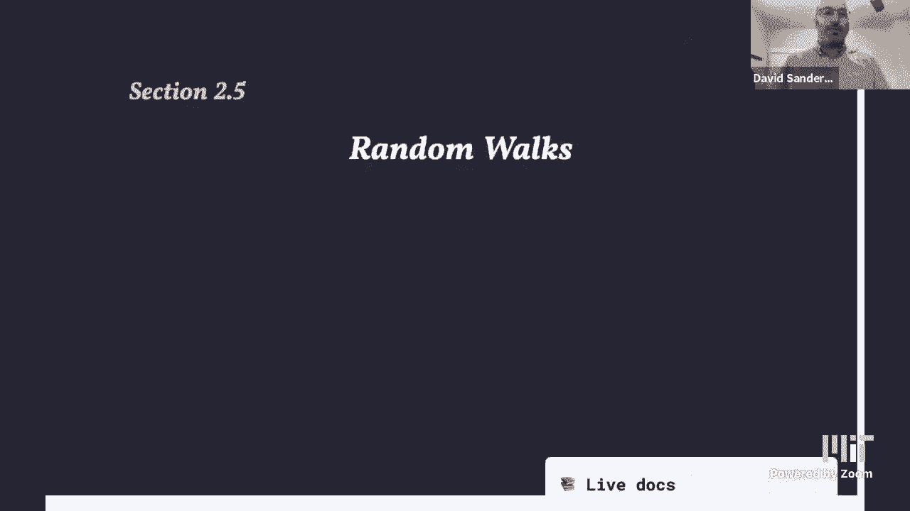
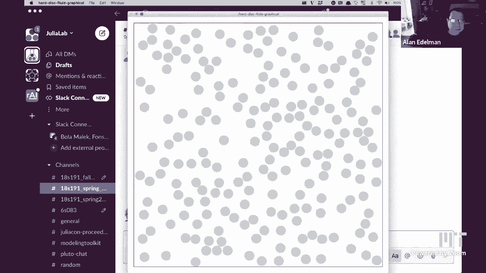
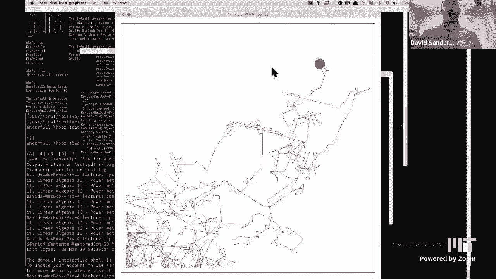
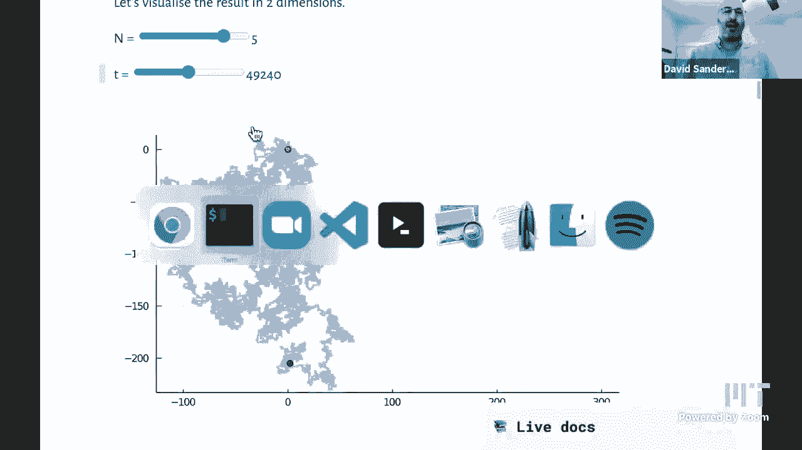
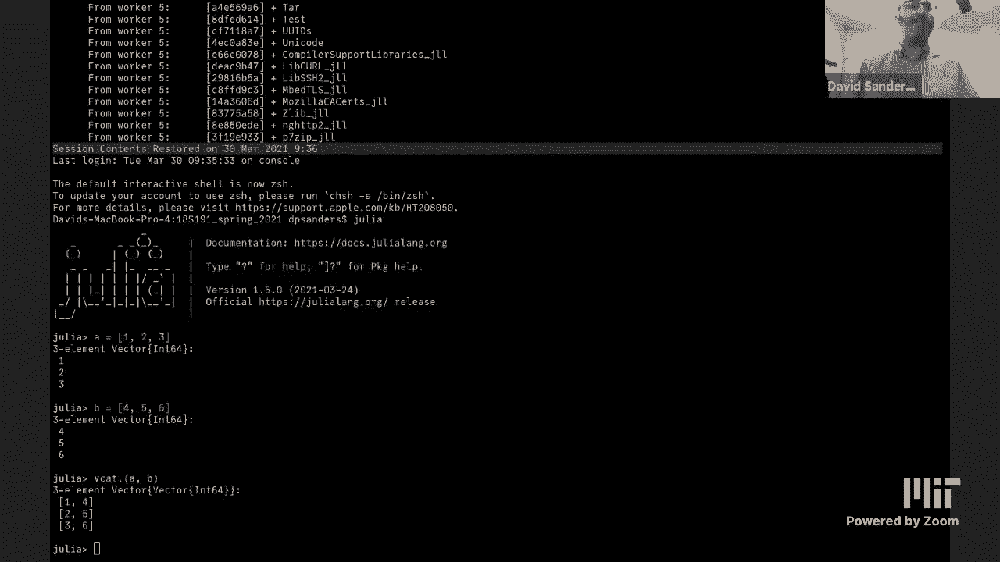
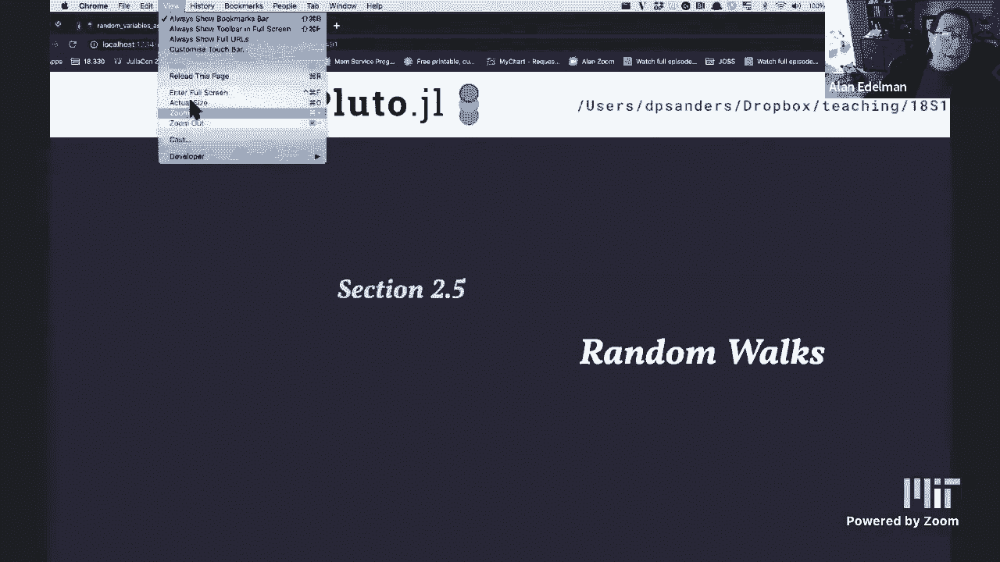
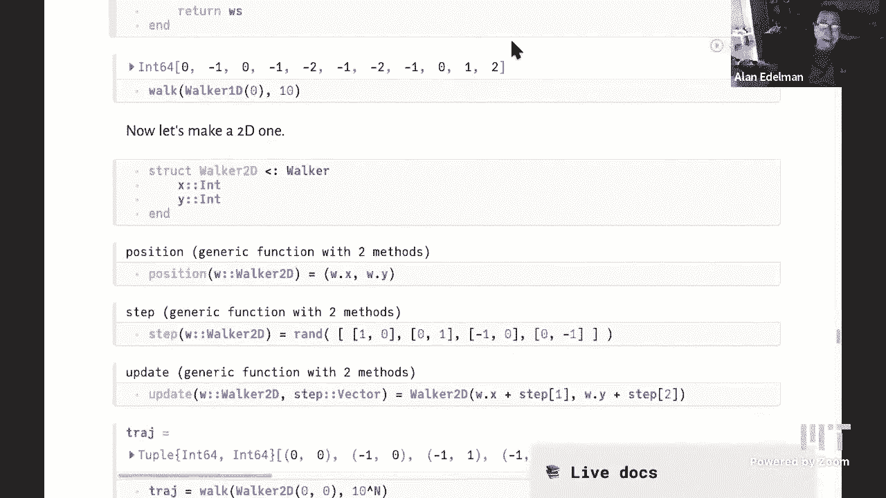

# 计算思维导论：L12：随机游走 1



在本节课中，我们将要学习随机游走的概念、应用及其在Julia中的实现方法。随机游走是模拟随机过程的基础模型，广泛应用于物理、金融和生物等领域。



## 什么是随机游走？



随机游走描述了一个粒子在空间中随机移动的过程。在每一步，粒子都会随机选择一个方向进行移动。这个过程可以用来模拟许多看似随机的现象。




上一节我们介绍了随机游走的基本概念，本节中我们来看看如何用Julia实现它。






## 随机游走的可视化

为了直观理解随机游走，我们可以观察一个在二维网格上移动的粒子。每一步，它都随机选择上、下、左、右四个方向之一移动。

随着步数的增加，粒子的轨迹会变得复杂，并且看起来越来越连续，仿佛在连续空间中运动。这个过程与气体分子的布朗运动非常相似。

## 随机游走的实际应用

随机游走模型在许多领域都有应用。例如，在金融中，股票价格的波动有时可以被建模为一种带有漂移的随机游走。在物理学中，它描述了微观粒子在流体中的扩散过程。在生物学中，它可以模拟中性基因在种群中的传播。

## 在Julia中实现随机游走

现在，我们来看看如何在Julia中实现一个简单的一维随机游走。最简单的模型是：粒子从0开始，每一步以1/2的概率向左（-1）或向右（+1）移动。

以下是生成单步随机移动的几种方法，我们将比较它们的性能。

```julia
# 方法1：使用元组
step1() = rand((-1, 1))

# 方法2：使用布尔运算
step2() = 2 * rand(Bool) - 1

# 方法3：使用比较
step3() = rand() < 0.5 ? -1 : 1

# 方法4：使用符号函数
step4() = sign(randn())

# 方法5：使用数组（不推荐，性能较差）
step5() = rand([-1, 1])
```

使用`BenchmarkTools`包可以方便地比较这些函数的性能。通常，使用元组或布尔运算的方法性能较好，而每次创建新数组的方法性能较差。

## 生成随机游走轨迹

有了单步移动函数，我们就可以生成整个随机游走的轨迹了。以下是一个生成一维随机游走轨迹的函数。

```julia
function walk_1d(n)
    x = 0
    xs = [x]
    for i in 1:n
        x += step1() # 这里可以使用上面定义的任何一种step函数
        push!(xs, x)
    end
    return xs
end
```

运行这个函数，并绘制多条轨迹，我们可以看到随机游走的扩散行为：轨迹会形成一个以原点为中心、随时间逐渐展宽的“云”。

## 迈向通用编程

上面的`walk_1d`函数是专门为一维情况编写的。如果我们想模拟二维或更高维的随机游走，就需要重写函数。为了避免代码重复，我们可以编写一个通用的随机游走函数。

通用函数的核心思想是将**初始化**和**单步移动**作为参数传入。

```julia
function generic_walk(initialize, step, n)
    x = initialize()
    trajectory = [x]
    for i in 1:n
        x += step()
        push!(trajectory, x)
    end
    return trajectory
end
```

这样，我们只需要定义不同维度的`initialize`和`step`函数，就可以用同一个`generic_walk`函数来生成轨迹。

## 使用类型构建随机游走器

为了进一步组织代码，我们可以定义表示随机游走器的类型。这让我们能将数据（位置）和行为（移动）封装在一起。

首先，定义一个抽象的`Walker`类型。

```julia
abstract type Walker end
```

然后，定义一维游走器类型及其相关方法。

```julia
struct Walker1D <: Walker
    pos::Int64
end

# 获取位置
position(w::Walker1D) = w.pos

# 定义移动步长（注意：这里返回的是位移量，不是新状态）
step(::Walker1D) = rand((-1, 1))

# 更新游走器状态（函数式风格，创建新对象）
function update(w::W, s) where {W <: Walker}
    new_pos = position(w) + s
    return W(new_pos)
end
```

使用`where`语法和类型参数`W`，`update`函数可以适用于任何`Walker`的子类型，并返回对应类型的新对象。

## 可变与不可变类型

在上面的例子中，`Walker1D`是不可变结构体。更新时，我们创建了一个新的游走器对象。另一种方法是使用可变结构体。

```julia
mutable struct MutableWalker1D <: Walker
    pos::Int64
end

# 原地更新函数（约定俗成，函数名以`!`结尾表示会修改参数）
function update!(w::MutableWalker1D, s)
    w.pos += s
    return nothing
end
```

使用可变对象在概念上更简单，但函数式风格（创建新对象）的代码通常更易于推理和调试，因为它避免了“副作用”。

## 通用的轨迹生成函数

最后，我们可以编写一个完全通用的轨迹生成函数，它接受任何`Walker`子类型的实例。

```julia
function trajectory(w::W, n) where {W <: Walker}
    pos_vec = [position(w)]
    current_walker = w
    for i in 1:n
        s = step(current_walker)        # 获取位移
        current_walker = update(current_walker, s) # 更新状态，得到新walker
        push!(pos_vec, position(current_walker))
    end
    return pos_vec
end
```

通过为不同的`Walker`子类型定义特定的`position`、`step`和`update`方法，这个通用的`trajectory`函数就能处理各种随机游走器。

## 总结



本节课中我们一起学习了随机游走的基本概念及其广泛的应用。我们探讨了在Julia中实现随机游走的多种方法，从简单的函数到通用的、基于类型的编程模式。我们比较了不同实现方式的性能，并介绍了通过定义类型和方法来实现通用、可扩展代码的技术。在下一节课中，我们将继续探索随机游走更深入的性质和应用。