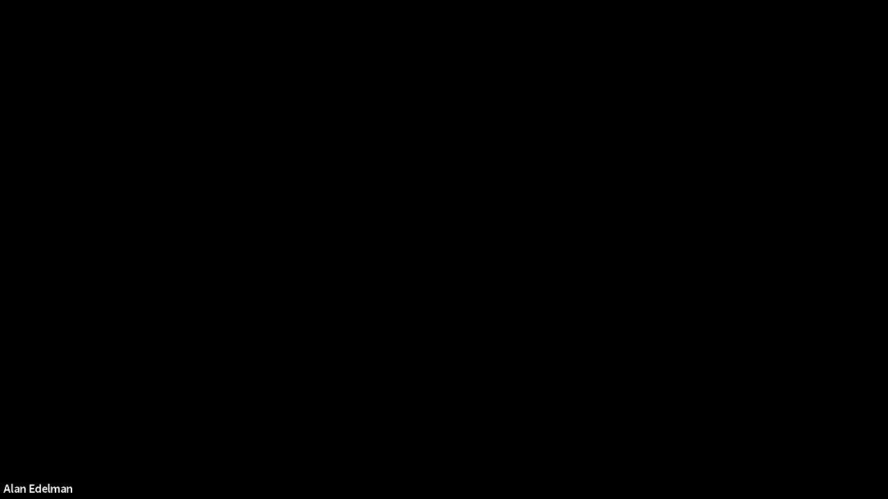
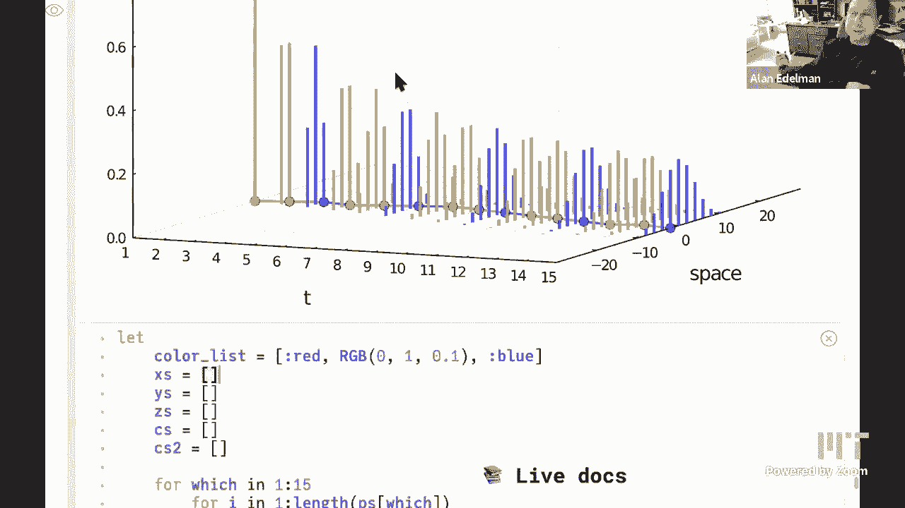

# 计算机思维导论-Julia：L13：随机游动 2



在本节课中，我们将继续学习随机游动。我们将了解如何自定义Julia中对象的显示方式，探索累积求和函数 `cumsum`，学习如何创建和连接向量，并介绍两种三维绘图方法。

## 概述：自定义显示与结构化矩阵

上一节我们介绍了随机游动的基本概念。本节中，我们来看看如何通过自定义对象的显示方式来更好地理解数据结构，特别是结构化矩阵。

Julia允许我们自定义对象的显示方式。例如，我们可以定义一个类型，并指定其打印格式。

```julia
struct MyType
    value::Int
end

import Base.show
function Base.show(io::IO, obj::MyType)
    print(io, "这是MyType类型，值为 $(obj.value)")
end

y = MyType(10)  # 输出：这是MyType类型，值为 10
```

Julia为一些具有特定结构的矩阵（如下三角矩阵）预定义了类型。当显示这些矩阵时，零元素会以点（`.`）表示，使结构更清晰。

```julia
using LinearAlgebra
# 假设P是一个矩阵
L = LowerTriangular(P)  # 以更清晰的方式显示下三角部分
```

## 帕斯卡三角形与随机游动

帕斯卡三角形中的数字是二项式系数，可以通过 `binomial(n, k)` 函数计算。有趣的是，当我们只关注其中的奇数时，会呈现出谢尔宾斯基三角形的图案。

帕斯卡三角形的构建规则与随机游动有密切联系。每一行的新数字由上一行相邻两个数字相加得到，这类似于一个卷积操作。

随机游动中，物体在每一步以相等概率向左或向右移动。其位置随时间的变化是这些独立随机步长的累积和。

## 累积求和：`cumsum` 函数

在随机游动中，我们需要计算一系列随机步长的累积和，以得到运动轨迹。Julia中的 `cumsum` 函数正是用于此目的。

以下是 `cumsum` 函数的一个示例：

```julia
steps = [-1, 1, 1, -1, 1]
trajectory = cumsum(steps)  # 结果为：[-1, 0, 1, 0, 1]
```

为了得到从时间0开始的完整轨迹，我们可以在步长向量前连接一个0：

```julia
full_trajectory = [0; cumsum(steps)]
```

在Julia中，我们可以自己实现一个高效的 `cumsum` 函数，其性能与内置函数相当：

```julia
function my_cumsum(v)
    new_v = similar(v)
    new_v[1] = v[1]
    for i in 2:length(v)
        new_v[i] = new_v[i-1] + v[i]
    end
    return new_v
end
```

## 向量与轨迹的可视化

我们可以生成多条随机游动轨迹并进行可视化。每条轨迹本身就是一个随机对象，即一个随机函数。

当我们固定一个时间点（例如 t=25）并观察大量轨迹在该时刻的位置时，这些位置会形成一个概率分布。根据中心极限定理，这个分布会接近正态（高斯）分布。

## 概率演化的主方程

我们可以用数学公式描述随机游动位置概率分布随时间的演化。设 **pᵗ** 为一个向量，其中元素 pᵗᵢ 表示在时间 t 位于位置 i 的概率。

从时间 t 到 t+1 的演化遵循以下**主方程**：

**pᵗ⁺¹ᵢ = (1/2) * pᵗᵢ₋₁ + (1/2) * pᵗᵢ₊₁**

这个方程说明，在时间 t+1 到达位置 i 的概率，等于在时间 t 位于 i-1 并向右跳的概率，加上在时间 t 位于 i+1 并向左跳的概率（每次跳跃概率均为 1/2）。

这个演化过程本质上也是一个卷积操作。我们可以在Julia中实现这个演化过程，并观察概率分布如何随时间扩散。

```julia
function evolve(p)
    new_p = similar(p)
    n = length(p)
    # 处理边界（例如吸收边界）
    new_p[1] = 0.5 * p[2]
    new_p[end] = 0.5 * p[end-1]
    for i in 2:n-1
        new_p[i] = 0.5 * (p[i-1] + p[i+1])
    end
    return new_p
end
```

通过迭代这个方程，并从初始分布（例如，所有概率集中在原点）开始，我们可以模拟出概率波包的扩散过程，并将其在三维中可视化（时间 vs. 位置 vs. 概率）。

## 总结



本节课中我们一起学习了随机游动的更多内容。我们了解了如何利用Julia的类型系统自定义对象显示，探索了帕斯卡三角形与随机游动之间的深刻联系，并实践了使用 `cumsum` 函数计算轨迹。最重要的是，我们引入了描述随机游动概率分布演化的主方程，并通过模拟和可视化观察了概率的扩散过程。这些概念将随机游动从一个简单的路径模拟，提升到了对其整体统计性质的理解。