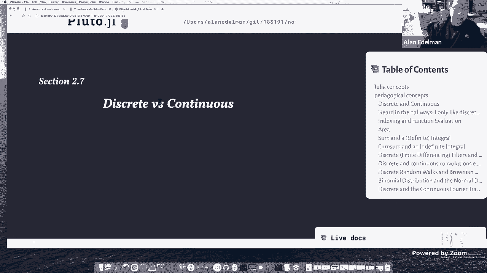
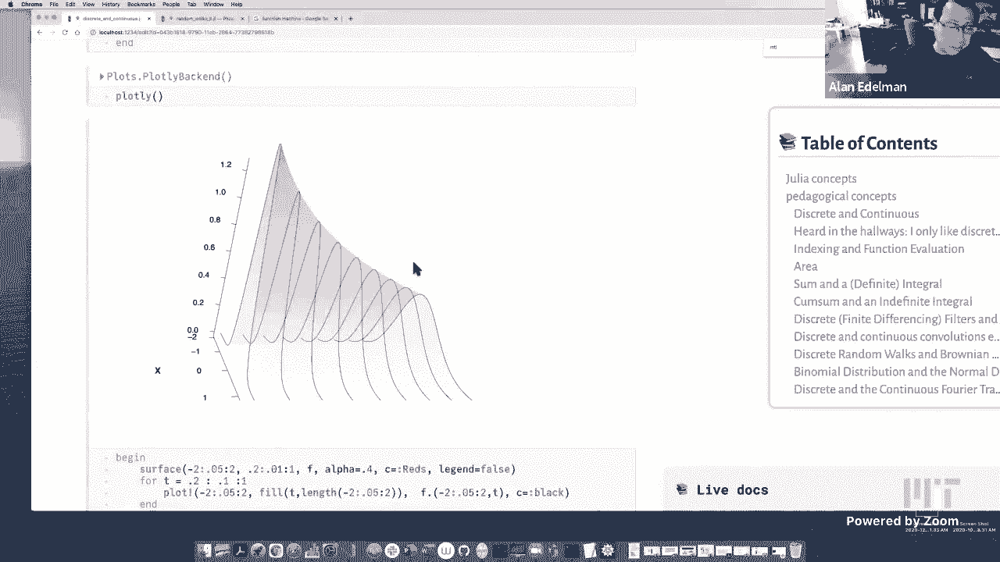

# L14：离散与连续



在本节课中，我们将探讨离散数学与连续数学之间的相互作用。我们将看到，尽管它们常被视为不同的领域，但它们的结合往往能产生更强大的洞察力。我们将通过具体的例子，如计算圆周率面积和模拟随机游走，来理解离散与连续如何相互转化和补充。

## 离散与连续的定义

上一节我们介绍了课程的主题，本节中我们来看看如何定义“离散”与“连续”。在不涉及高深数学的情况下，我们通常通过例子来理解它们。

以下是离散数学对象的例子：
*   有限集合，例如序列 1 到 100。
*   无限离散集合，例如整数集。

相比之下，连续数学涉及极限、整个区间和曲面。例如，实数线包含了像 π 和 √3 这样的数。

## 离散与连续的融合

我们经常听到有人偏爱离散数学或连续数学。然而，在当今时代，这两个领域的界限正变得模糊。例如，机器学习将连续优化和梯度等概念引入了计算机科学。同样，数据科学和统计学也广泛应用连续数学思想。

连续数学有时比离散数学更简单。对于一个非常大的离散对象，将其转化为连续对象通常能保留核心特征并简化不必要的细节。

更重要的是，离散与连续的结合比单独使用任何一种都更有用。能够同时以两种方式思考会带来巨大的优势。在气候变化和流行病建模等现实应用中，连续数学也至关重要。

## 索引与函数求值

现在，让我们通过一个简单的例子来探讨离散与连续如何协同工作：索引和函数求值。

考虑一个向量 **v** 和取出其第 **i** 个元素的操作 **v[i]**。我们通常不将其视为函数，而只是“取出”一个元素。另一方面，对于函数 **f(x)**，如 sin(x)，我们将其视为一个“函数机器”，需要一个求值过程。

然而，从概念上讲，向量就是一个离散函数，其定义域是索引 1 到 n，函数值就是 **v[i]**。输入索引 **i**，输出元素 **v[i]**。

让我们用代码来具体说明。假设我们有一个包含数字 2 到 20 的向量。

```julia
v = [2:2:20;]  # 创建向量 [2, 4, 6, ..., 20]
v[7]  # 索引：取出第7个元素，结果是14
```

这里的 `v[7]` 感觉上是从内存中“取出”第7个元素。

但是，如果我们直接对一个“范围”对象进行索引：

```julia
r = 2:2:20    # 这是一个范围对象，只存储起始值、步长和结束值
r[7]          # 函数求值：计算 2 * 7，结果是14
```

这里的 `r[7]` 实际上是在计算函数 **f(i) = 2i** 在 **i=7** 时的值。这是一个明确的函数求值过程，尽管其定义域仅限于 1 到 10 的整数。相比之下，一个普通的函数 `f(x) = 2x` 可以接受任何实数输入，如 `f(π)`。

无论如何，向量在本质上就是一个函数。

## 圆的面积：离散近似与连续极限

上一节我们看到了索引如何隐含函数关系，本节中我们来看看如何用离散方法逼近连续对象的面积。

我们通过内接正多边形来逼近单位圆的面积（π）。随着多边形边数的增加，其面积越来越接近 π。

以下是不同边数多边形面积的近似值：
*   正方形（4边）：面积 ≈ 2.0
*   正八边形（8边）：面积 ≈ 2.828
*   正十六边形（16边）：面积 ≈ 3.061
*   正一百边形（100边）：面积 ≈ 3.139
*   正一千零二十四边形（1024边）：面积 ≈ 3.141

我们通常认为需要边数趋于“无穷”才能得到精确的 π，而“无穷”感觉非常遥远。然而，通过一种称为“外推”的技巧，我们可以从有限的数据中提取出更多关于极限的信息。

如果我们有一系列边数为 2^k（如 4, 8, 16, ..., 1024）的多边形面积值，我们可以对它们进行特定的线性组合（卷积）。例如，用 **4/3** 乘以当前面积减去 **1/3** 乘以前一个面积。

这样操作后，新的数列会比原始面积值更快地逼近 π，有效数字位数更多。我们可以重复这个过程，使用不同的系数（如 **16/15**, **64/63**），每次都能揭示出更多隐藏的 π 的位数。

这个现象背后的原理是面积公式的泰勒展开。面积 **A(s)** 关于边数 **s** 的展开式包含 **π** 以及 **s^(-2)**, **s^(-4)** 等项。当我们加倍边数时，**s^(-2)** 项变为原来的 **1/4**。精心选择的线性组合可以消去低阶误差项（如 **s^(-2)**），从而加速收敛。

这个例子表明，结合对连续极限（泰勒展开）的理解和离散计算，我们可以更高效地从离散数据中提取连续极限的信息。

## 面积的本质：多种离散途径通向同一连续极限

我们也可以用其他离散方法估算圆的面积，比如在圆上覆盖网格并计算内部的小方格数量。

随着方格越来越小，方格面积之和也会趋近于 π。这里有一个更深层的哲学或数学观点：如果我们暂时忘掉“面积”的直观概念，如何确信用不同离散方法（多边形、方格、甚至其他形状）得到的极限值是相同的？

逻辑上并不显然。数学上，正是由于许多不同的、合理的离散逼近过程都收敛到同一个数值，我们才确信这个共同的极限值是一个良定义的数学对象，并值得被称为“面积”。这种“多种途径通向同一终点”是定义许多连续数学概念（如积分、长度）的基础。

## 随机游走：从离散到连续的布朗运动

现在，让我们将“多路径收敛定义对象”的理念应用到随机过程中。

我们回顾一下帕斯卡三角形，它可以被归一化并绘制成一条曲线，表示在特定时间步，一个简单随机游走（掷硬币决定左右）所处位置的概率分布。

我们也可以模拟一个连续版本的随机游走。不是在每个时间步向左或向右移动固定距离，而是在每个微小的时间间隔内，根据一个均值为 0、方差与时间间隔成正比的正态分布来移动。

以下是模拟步骤：
1.  将总时间（例如 1）分为 **N** 小段。
2.  在每一小段，从正态分布 **N(0, 1/N)** 中抽取一个随机数作为位移。
3.  将这些位移累加，得到一条在时间上连续的路径。

当我们不断增加 **N**（细化时间间隔）时，这些离散生成的路径会趋近于一个连续的随机过程，称为**布朗运动**（或维纳过程）。

关键点在于：布朗运动的统计性质（如任意时刻的分布、任意两时刻的关联）是唯一的。无论底层离散步骤是基于正态分布还是伯努利分布（掷硬币），只要方差设置正确，最终的连续极限都是同一个布朗运动。

因此，布朗运动作为一个连续的数学对象“存在”，因为所有合理的离散逼近都导向它。在极限下，这个连续描述（用微分方程描述）通常比处理庞大的离散概率分布（如帕斯卡三角形）更简洁。

帕斯卡三角形的连续极限正是著名的钟形曲线（正态分布）。描述其随时间演化的离散规则（将相邻值相加并除以2）在连续极限下，就变成了描述扩散现象的偏微分方程（热方程）。

## 总结



本节课中我们一起学习了离散数学与连续数学之间的深刻联系。我们看到：
1.  离散与连续并非对立，而是相辅相成。
2.  连续极限通常能简化对大型离散系统的描述。
3.  通过结合离散计算和对连续极限的理解（如外推法），我们可以更高效地获取信息。
4.  许多连续的数学概念（如面积、布朗运动）之所以被良好定义，正是因为多种离散逼近方法都收敛到同一个结果。离散与连续是同一枚硬币的两面，掌握两者能提供更强大的问题解决视角。