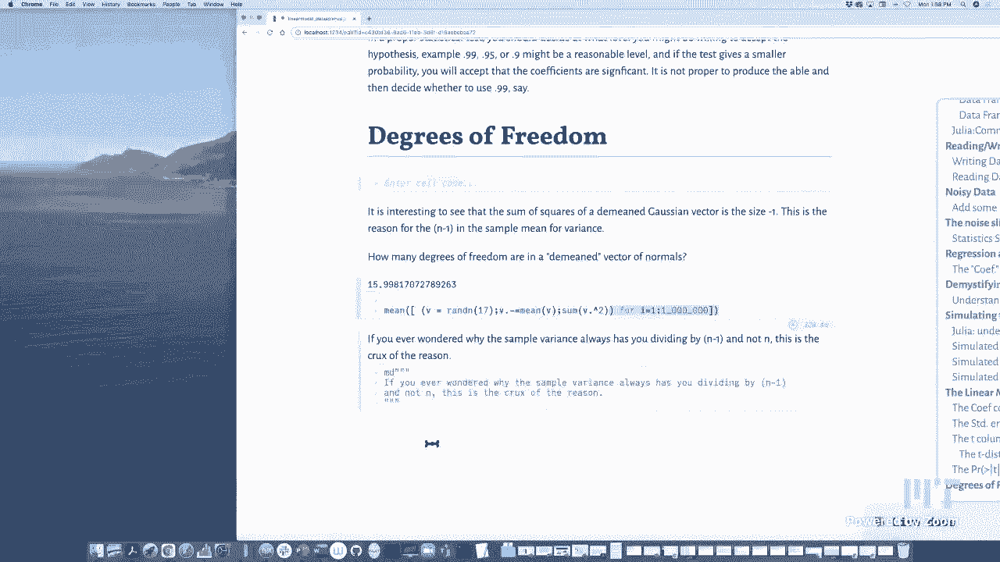
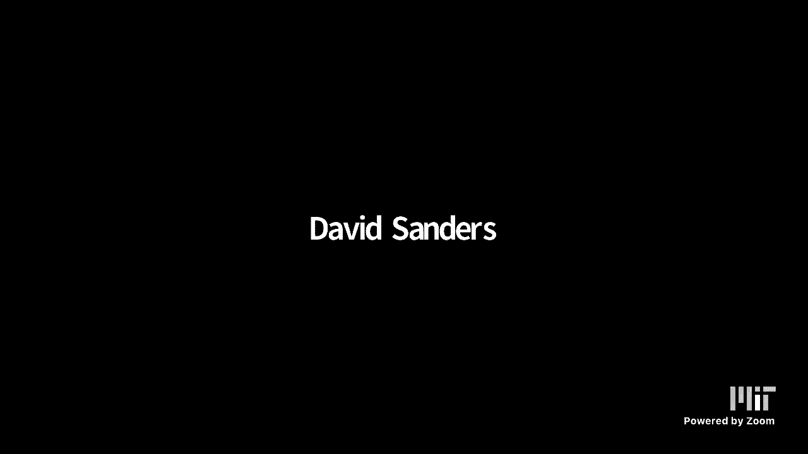

# 计算思维导论：L15：线性模型与模拟 📊

## 概述
在本节课中，我们将学习线性模型和统计模拟。我们将从处理带标签的数据开始，然后深入探讨如何为数据拟合一条直线，并理解统计输出表格中各项数字的含义。通过使用Julia进行快速模拟，我们将直观地理解线性回归背后的核心概念，例如系数估计、标准误差和假设检验。

---

## 数据组织：数据框 📋

上一节我们介绍了课程主题，本节中我们来看看如何组织数据。Julia借鉴了R语言，提供了**数据框**来处理带标签的数据。数据框的每一列可以有不同的数据类型，并且拥有列标签，这比普通的矩阵更便于处理现实世界的数据。

以下是如何创建一个数据框：

```julia
using DataFrames
# 假设 x 是华氏度数据，y 是摄氏度数据
data = DataFrame(degrees_fahrenheit = x, degrees_centigrade = y)
```

你可以轻松地在数据框和矩阵之间转换：

```julia
# 从矩阵创建数据框
df = DataFrame([x y], [:fahrenheit, :celsius])

# 将数据框转换回矩阵
matrix_data = Matrix(df)
```

数据框可以方便地读写到CSV文件：

```julia
using CSV
# 写入文件
CSV.write("test.csv", data)
# 从文件读取
data_from_file = CSV.read("test.csv", DataFrame)
```

---

## 引入噪声与现实实验 🔬

现在我们已经有了整洁的数据，本节中我们来看看如何模拟现实世界的实验。在现实中，测量数据总是包含噪声。我们可以通过在真实数据上添加随机噪声来模拟这种情况。

假设真实的转换公式是：**celsius = (5/9) * fahrenheit - (160/9)**。我们生成一些华氏度数据 `x`，并计算对应的精确摄氏度 `y`。然后，我们创建带噪声的版本 `yy`：

```julia
using Random
# 真实参数
true_slope = 5/9
true_intercept = -160/9 # 约等于 -17.777...

# 生成数据
x = rand(-10:100, 10) # 10个华氏度数据点
y_true = true_slope .* x .+ true_intercept

# 添加噪声
noise_level = 0.5
yy = y_true .+ noise_level .* randn(10) # 添加正态分布噪声
```

每次运行实验（即生成一组新的噪声数据），我们拟合出的直线都会略有不同。统计学要解决的核心问题就是：基于这有限的、带噪声的数据，我们对拟合出的直线有多大信心？

---

## 拟合直线：最小二乘法 📉

上一节我们模拟了带噪声的数据，本节中我们来看看如何从这些数据中找到“最佳”直线。最常用的方法是**最小二乘法**，它寻找一条直线，使得所有数据点到这条直线垂直距离的平方和最小。

这条蓝色最佳拟合线由斜率 `m` 和截距 `b` 定义。我们可以通过线性代数公式计算它们：

```julia
# 构建设计矩阵 X：第一列为1（对应截距），第二列为x
X = [ones(length(x)) x]
# 使用线性代数求解最小二乘解：θ = (X'X)^{-1} X'y
θ = (X' * X) \ (X' * yy)
b_estimate, m_estimate = θ[1], θ[2]
```

也可以用更基础的公式计算，结果相同：

```julia
n = length(x)
x_mean = mean(x)
y_mean = mean(yy)

# 计算斜率 m
m_estimate = sum((x .- x_mean) .* (yy .- y_mean)) / sum((x .- x_mean).^2)
# 计算截距 b
b_estimate = y_mean - m_estimate * x_mean
```

此外，我们还可以估计数据的噪声水平（方差 σ²）：

```julia
# 计算残差（数据点到拟合线的垂直距离）
residuals = yy .- (m_estimate .* x .+ b_estimate)
# 估计噪声方差，除数是 n-2（自由度）
sigma_squared_estimate = sum(residuals.^2) / (n - 2)
```

---

## 理解线性模型与统计假设 🧠

我们一直在进行拟合，本节中我们来看看这背后完整的统计模型。在标准线性回归中，我们假设数据由以下模型生成：

**y = m * x + b + ε**

其中：
*   **x** 是已知的自变量（如华氏度）。
*   **m** (斜率) 和 **b** (截距) 是未知的固定参数。
*   **ε** 是随机噪声，我们假设它服从均值为0、方差为 σ² 的正态分布，即 **ε ~ N(0, σ²)**。

我们通过实验数据估计出 `m_estimate`、`b_estimate` 和 `sigma_estimate`。由于噪声的存在，每次实验得到的估计值都不同。为了理解这些估计值的可靠性，我们需要进行模拟。

---

## 通过模拟理解估计量的分布 🔄

统计理论告诉我们，在模型的假设下，斜率 `m_estimate` 和截距 `b_estimate` 的估计值本身也服从正态分布。我们可以通过Julia快速模拟成千上万次实验来验证这一点。

以下是模拟10万个实验，并观察截距估计值分布的代码：

```julia
function run_one_simulation(x, true_slope, true_intercept, true_sigma)
    # 1. 根据真实模型生成带噪声的y
    y_sim = true_slope .* x .+ true_intercept .+ true_sigma .* randn(length(x))
    # 2. 拟合直线
    X = [ones(length(x)) x]
    θ = (X' * X) \ (X' * y_sim)
    b_sim, m_sim = θ[1], θ[2]
    # 3. 估计噪声
    residuals = y_sim .- (m_sim .* x .+ b_sim)
    sigma_sim = sqrt(sum(residuals.^2) / (length(x) - 2))
    return b_sim, m_sim, sigma_sim
end

# 运行10万次模拟
n_simulations = 100_000
results = [run_one_simulation(x, true_slope, true_intercept, noise_level) for _ in 1:n_simulations]

# 提取所有截距估计值
all_intercepts = [r[1] for r in results]
# 计算其均值和标准差
mean_intercept = mean(all_intercepts)
std_intercept = std(all_intercepts)
```

模拟会发现：
1.  `all_intercepts` 的分布近似正态。
2.  其均值 `mean_intercept` 非常接近真实截距 `true_intercept`。
3.  其标准差 `std_intercept` 与理论公式计算出的**标准误差**相符。

对斜率 `m_estimate` 的模拟会得到类似结论。而对噪声估计 `sigma_estimate` 的模拟则会发现它服从**卡方分布**。

---

## 解读统计输出表格 📊

现在我们已经通过模拟理解了估计量的行为，本节中我们终于可以解读那个“神秘的”统计输出表格了。表格通常包含以下几列：系数、标准误差、t 值和 p 值。

假设我们得到如下表格（以截距为例）：
| 项 | 系数估计 | 标准误差 | t 值 | p 值 |
| :--- | :--- | :--- | :--- | :--- |
| 截距 | -18.32 | 0.49 | -37.4 | <0.001 |
| 斜率 | 0.534 | 0.033 | 16.2 | <0.001 |

**1. 系数估计：** 这就是我们通过最小二乘法计算出的 `b_estimate` 和 `m_estimate`。

**2. 标准误差：** 这是系数估计值的**估计标准差**。它衡量了如果我们重复实验，系数估计值可能的变化范围。计算公式使用了我们估计的噪声方差 `sigma_squared_estimate`。
    *   截距标准误差 ≈ `sigma_estimate * sqrt(1/n + mean(x)^2 / sum((x .- mean(x)).^2))`
    *   斜率标准误差 ≈ `sigma_estimate / sqrt(sum((x .- mean(x)).^2))`

**3. t 值：** 这是最简单的部分，它就是**系数估计值除以它的标准误差**。
    *   `t = 系数估计 / 标准误差`
    *   它衡量了系数估计值相对于其波动性的大小。

**4. p 值：** 它基于 **t 分布** 计算。我们首先有一个**零假设**：真实的系数为0（例如，斜率=0意味着x和y没有线性关系）。p值表示，如果零假设成立（系数真为0），我们观察到当前这么大（或更大）的|t|值的概率。
    *   **p值很小（如<0.05）**：意味着如果系数真为0，观察到当前数据的情况非常不可能。因此，我们**拒绝零假设**，认为该系数是“显著的”（很可能不为0）。
    *   **p值较大**：则没有足够证据拒绝零假设，该系数可能不显著。

**自由度：** 在上面的噪声估计公式 `sigma_squared_estimate = sum(residuals.^2) / (n - 2)` 中，分母 `n-2` 就是自由度。这里 `-2` 是因为我们估计了两个参数（斜率和截距），消耗了2个自由度。`n-2` 也是t分布的自由度参数。

---

## 总结

本节课中我们一起学习了线性模型与统计模拟的核心内容。

1.  我们首先使用**数据框**来组织带标签的数据。
2.  通过添加噪声模拟了现实世界的实验，认识到从有限噪声数据中得出的结论具有不确定性。
3.  我们使用**最小二乘法**拟合直线，得到斜率、截距和噪声的估计值。
4.  我们明确了标准**线性模型**的统计假设：数据由线性关系加上正态噪声生成。
5.  通过进行大量**计算机模拟**，我们直观地验证了系数估计量的抽样分布（正态分布），并理解了其波动性。
6.  最后，我们完整解读了统计输出表格：**系数**是点估计，**标准误差**衡量其精度，**t值**是系数与标准误差的比值，而**p值**则用于检验系数是否显著不为零。





理解这些概念的关键在于，统计学并非提供确凿无疑的答案，而是基于数据和模型假设，对未知世界进行量化的、带有置信度的推断。