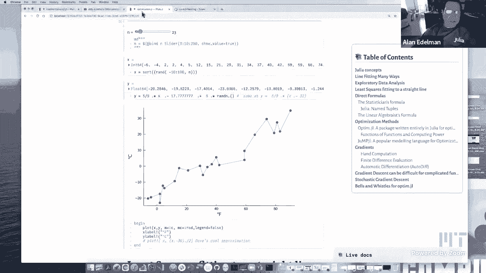
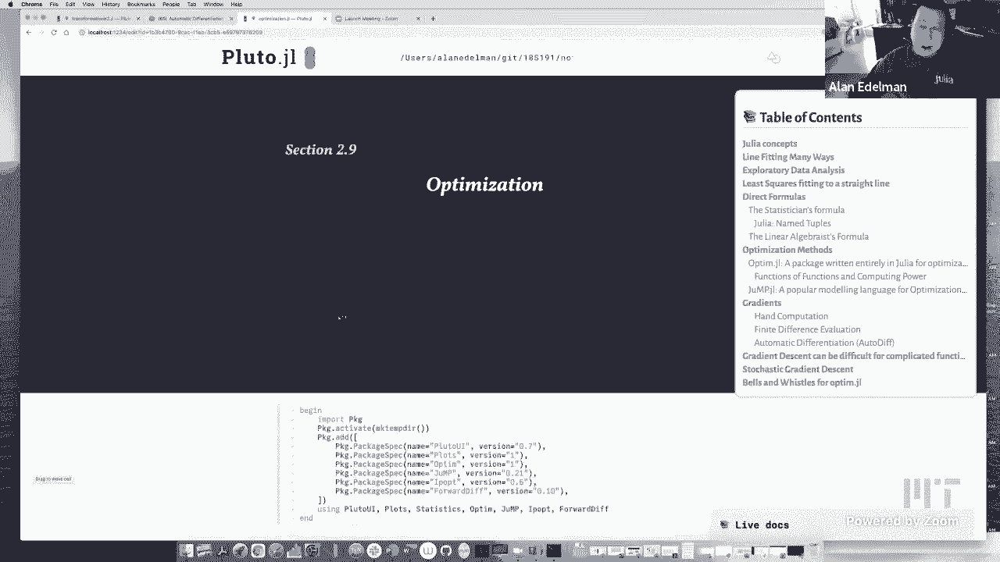
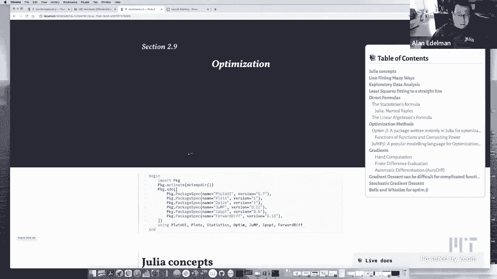
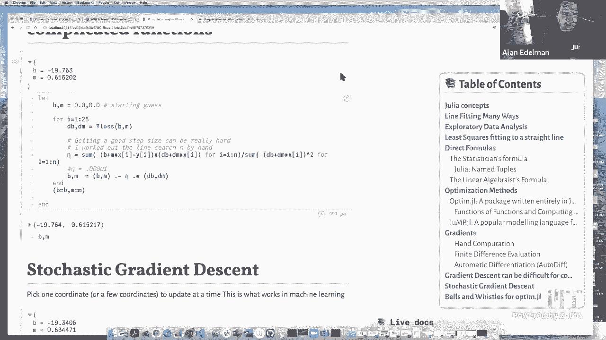

# L16：优化 🎯



在本节课中，我们将学习优化的基本概念，并通过一个简单的线性拟合问题，探索在Julia中实现优化的多种方法。我们将从精确的数学公式开始，逐步深入到使用优化软件包、梯度计算以及随机梯度下降等现代机器学习中常用的技术。



---



## 概述

优化是寻找最佳解决方案的过程，在数据科学和机器学习中至关重要。本节课我们将以最小二乘法拟合直线为例，演示如何用多种方式解决同一个优化问题，并比较它们的优缺点。

---

## 数学定义与精确解

首先，我们明确要解决的问题：给定一组数据点 `(x_i, y_i)`，找到最佳拟合直线 `y = b + m*x`，使得所有点的预测值与实际值之差的平方和最小。这个和被称为**损失函数**。

损失函数的数学公式为：
```
L(b, m) = Σ (b + m*x_i - y_i)^2
```

对于这个简单问题，存在精确的解析解。我们可以通过线性代数公式直接计算出最优的截距 `b` 和斜率 `m`。

线性代数解法的核心是构建一个设计矩阵 `A`，其中第一列全为1，第二列为 `x` 坐标。然后通过求解正规方程 `(A^T A) \ (A^T y)` 得到参数。

在Julia中，我们可以使用命名元组来清晰地存储和展示结果：
```julia
result = (intercept = b, slope = m)
```

---

## 使用优化软件包

上一节我们介绍了问题的数学定义和精确解。本节中我们来看看如何使用通用的优化软件包来解决同一个问题。当问题变得复杂，没有简单解析解时，这种方法显得尤为重要。

我们将介绍两个Julia包：`Optim.jl` 和 `JuMP.jl`。

### 使用 Optim.jl

`Optim.jl` 是一个完全用Julia编写的优化包。我们只需要定义损失函数，并提供一个初始猜测值，它就能自动寻找最小值点。

以下是使用 `Optim.jl` 进行优化的步骤：
1.  定义损失函数 `loss(params)`，其中 `params` 是一个包含 `b` 和 `m` 的向量。
2.  调用 `optimize(loss, initial_guess)`。
3.  从结果中提取优化后的参数。

软件会自动选择算法（如Nelder-Mead）并报告收敛信息，例如函数调用次数和最终精度。

### 使用 JuMP.jl

`JuMP.jl` 是一个数学建模语言，它允许用户以更接近数学表达式的形式描述优化问题。它本身不包含求解器，但可以连接多种后端求解器（如Ipopt）。

以下是使用 `JuMP.jl` 建模的步骤：
1.  创建一个模型 `model = Model(Ipopt.Optimizer)`。
2.  使用 `@variable` 定义优化变量 `b` 和 `m`。
3.  使用 `@objective` 定义最小化目标，即我们的损失函数。
4.  调用 `optimize!(model)` 进行求解。

这种方法对于表达复杂的约束优化问题非常强大。

---

## 梯度的作用与计算

上一节我们使用了现成的优化包。本节中我们来看看优化背后的一个核心数学概念：**梯度**。理解梯度有助于我们理解优化器是如何工作的，并让我们能实现自己的简单优化算法。

梯度是一个向量，其每个分量是损失函数对相应参数的偏导数。对于我们的损失函数，梯度指出了参数空间中使函数值**上升最快**的方向。因此，负梯度方向就是函数值**下降最快**的方向。

梯度公式如下：
```
∇L(b, m) = [ ∂L/∂b, ∂L/∂m ] = [ 2*Σ (b + m*x_i - y_i), 2*Σ (b + m*x_i - y_i)*x_i ]
```

在Julia中，我们有多种计算梯度的方法：

1.  **手动推导与编码**：根据上面的公式直接编写代码。
2.  **有限差分法**：通过给参数一个微小的扰动 `ϵ`，用 `(L(param+ϵ) - L(param)) / ϵ` 来近似导数。这种方法简单但可能有数值误差，且需要谨慎选择 `ϵ`。
3.  **自动微分**：这是现代计算框架的核心技术。它利用链式法则，通过代码本身自动、精确地计算导数，没有符号计算的复杂性和有限差分的误差。在Julia中，可以使用 `ForwardDiff.jl` 等包轻松实现：
    ```julia
    using ForwardDiff
    gradient = ForwardDiff.gradient(loss, [b, m])
    ```

自动微分使得“为任意代码计算梯度”成为可能，极大地推动了机器学习和优化领域的发展。

---

## 实现梯度下降算法

既然我们已经能够计算梯度，本节中我们就可以尝试实现最基本的优化算法——**梯度下降**。其思想非常直观：就像滑雪者沿着最陡的方向下山一样，我们沿着负梯度方向更新参数。

梯度下降的迭代公式为：
```
params_new = params_old - η * ∇L(params_old)
```
其中 `η` 称为**学习率**或**步长**。

以下是实现梯度下降的关键步骤：
1.  初始化参数（例如，设 `b=0, m=0`）。
2.  循环多次：
    a. 计算当前参数下的梯度 `g`。
    b. 更新参数：`params -= η * g`。
3.  循环结束后，`params` 即为近似的最优解。

算法的成败很大程度上取决于学习率 `η` 的选择：
*   `η` 太小：收敛速度极慢，需要非常多步迭代。
*   `η` 太大：更新步伐过大，可能无法收敛，甚至在最优点附近震荡或发散。

对于我们的简单问题，我们甚至可以进行**精确线搜索**，即直接计算出沿梯度方向最优的步长。但在复杂问题中，这通常不可行，因此选择合适的 `η` 更像一门艺术。

---

## 随机梯度下降

上一节我们介绍了标准的梯度下降，它需要在每一步计算所有数据点的梯度。本节中我们来看看当数据量非常庞大时，一种更实用的变体：**随机梯度下降**。

在机器学习中，数据集往往包含数百万甚至数十亿个样本。计算完整梯度（称为“批量梯度下降”）的成本极高。SGD的核心思想是：在每一步迭代中，**随机选取一个（或一小批）数据点**，只用这个子集的数据来计算梯度并更新参数。

更新公式与梯度下降类似，但梯度 `g` 是基于随机样本 `i` 计算的：
```
∇L_i(b, m) = [ 2*(b + m*x_i - y_i), 2*(b + m*x_i - y_i)*x_i ]
params_new = params_old - η * ∇L_i(params_old)
```

以下是SGD的特点：
*   **优点**：每次迭代计算量小，速度快，可以处理海量数据。即使没有收敛到精确解，通常也能快速得到一个足够好的近似解，这在机器学习中往往是可接受的。
*   **缺点**：更新方向基于噪声估计，路径曲折，需要更多迭代步数才能稳定。对学习率 `η` 的调整更为敏感。
*   **实践**：在实际中，我们通常会遍历整个数据集多次（每个循环称为一个“epoch”），并可能随着时间推移逐渐减小 `η`。

我们通过代码演示了SGD，即使需要上千万次迭代，它最终也能逼近最优解，这体现了其在处理大规模问题时的可行性。

---

## 高级优化器与总结

在最后一部分，我们回到 `Optim.jl` 包，看看提供梯度信息如何帮助高级优化器更高效地工作。

当我们能为优化器提供梯度函数时，它可以使用更强大的算法，例如 **BFGS** 算法。BFGS是一种拟牛顿法，它会构建损失函数曲率的近似，从而智能地调整每一步的更新方向和步长。

在 `Optim.jl` 中，我们可以这样使用：
```julia
result = optimize(loss, gradient, initial_guess, BFGS())
```
与不提供梯度的Nelder-Mead方法相比，BFGS通常能以**少得多的函数调用次数**达到相同的精度。这展示了利用问题的一阶信息（梯度）所能带来的巨大效率提升。

---

### 本节课总结

本节课我们一起学习了优化的基本概念，并以线性拟合为例探索了多种解决途径：
1.  **精确解**：对于简单问题，直接使用数学公式最快、最准确。
2.  **通用优化包**：如 `Optim.jl` 和 `JuMP.jl`，它们将复杂的优化算法封装成简单接口，适用于没有解析解的问题。
3.  **梯度与自动微分**：梯度是优化的核心。自动微分技术让我们能轻松为复杂代码计算精确梯度，是当代机器学习框架的基石。
4.  **梯度下降**：最基本的迭代优化算法，其性能高度依赖于学习率的选择。
5.  **随机梯度下降**：为大规模数据集设计的优化算法，每次更新只使用一部分数据，牺牲了部分精度以换取计算效率。
6.  **高级优化器**：如BFGS，在获得梯度信息后，能通过更复杂的数学方法实现快速收敛。



通过这个简单的例子，我们看到了从具体数学解法到通用数值优化，再到适应大数据范式的随机算法的演进过程，这也是现代计算科学解决实际问题的一个缩影。