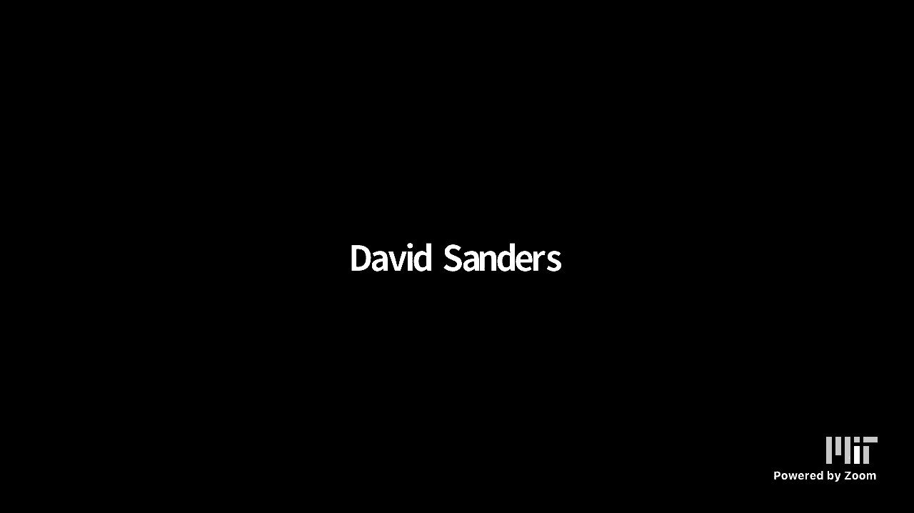
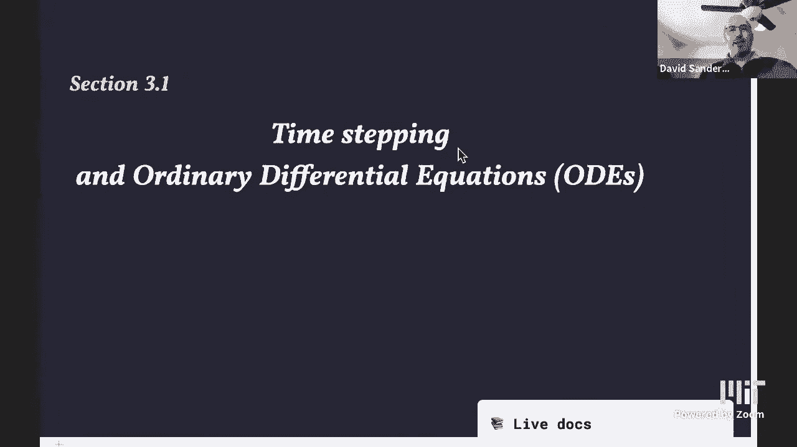
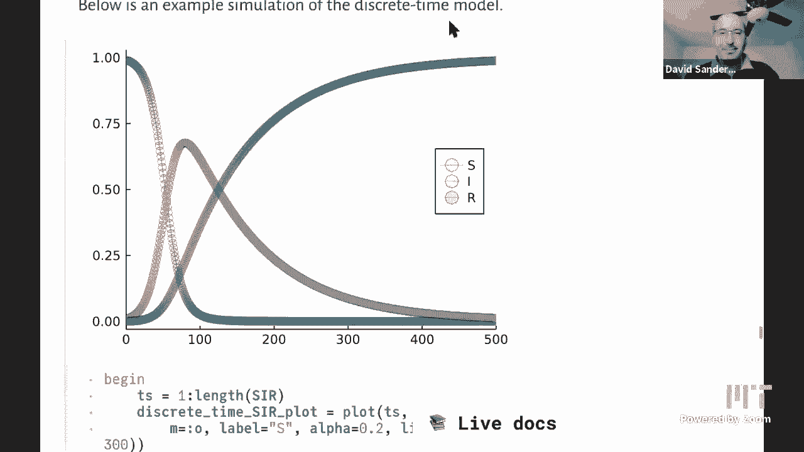

# L17：时间步进与微分方程



在本节课中，我们将学习如何从直观的离散时间模型出发，推导出微分方程，并了解如何使用计算机通过时间步进法来求解微分方程。我们将从简单的灯泡失效模型开始，逐步过渡到更复杂的SIR传染病模型，并探讨数值求解的基本思想。



## 从离散模型到连续模型

上一节我们介绍了课程将进入新的模块，重点是利用计算思维理解气候科学等领域的模型。这些模型通常由微分方程描述。本节中，我们来看看如何从更直观的离散时间模型自然地引出微分方程。

### 灯泡失效模型

我们从一个简单的例子开始：建模灯泡（或其他组件）的失效过程。假设我们每天检查一次，记录仍在工作的灯泡数量 `N_k`，其中 `k` 代表第几天。每个灯泡每天有概率 `p` 失效。

以下是模型的核心递推关系：
```
N_{k+1} = N_k - p * N_k
```
这表示下一天的数量等于当天的数量减去当天失效的数量。我们可以将其重写，突出变化量：
```
N_{k+1} - N_k = -p * N_k
```

这个离散模型可以解析求解，其解为几何衰减：
```
N_k = N_0 * (1 - p)^k
```

### 增加检查频率

现在，我们考虑更频繁地检查，比如每天检查 `n` 次。假设在每一个长度为 `1/n` 天的时间段内，失效概率为 `p/n`。

此时，递推关系变为：
```
N_{k + 1/n} = N_k * (1 - p/n)
```
经过一天（即 `n` 个步骤）后，总变化为：
```
N_{k+1} = N_k * (1 - p/n)^n
```

当我们用代码绘制并逐渐增加 `n`（即减小时间步长）时，会发现离散点构成的曲线逐渐趋近于一条光滑的极限曲线。这暗示着存在一个与离散化细节无关的连续时间模型。

### 走向连续极限

令时间步长 `Δt = 1/n`。在步长 `Δt` 内的递推公式为：
```
N(t + Δt) - N(t) = -p * Δt * N(t)
```
两边同时除以 `Δt`，得到：
```
( N(t + Δt) - N(t) ) / Δt = -p * N(t)
```
当 `Δt` 趋近于0时，左边的表达式就变成了导数 `dN/dt` 的定义。于是，我们得到了一个**微分方程**：
```
dN/dt = -p * N(t)
```
其初始条件为 `N(0) = N_0`。

这个微分方程的解是指数衰减函数，验证了离散模型在连续极限下的行为：
```
N(t) = N_0 * exp(-p * t)
```

## 更复杂的模型：SIR传染病模型

上一节我们通过灯泡模型看到了离散与连续的联系。本节中我们来看看一个更复杂、无法解析求解的模型——SIR模型，它常用于描述流行病或谣言传播。

在SIR模型中，人群被分为三类：
*   **易感者 (S)**：可能被感染的人。
*   **感染者 (I)**：已患病并可传染他人的人。
*   **康复者 (R)**：已康复且具有免疫力的人。

总人口数 `N = S + I + R`。为简化，我们常使用比例 `s = S/N`, `i = I/N`, `r = R/N`。

### 离散时间SIR模型

假设时间步长为一天。模型基于以下假设：
1.  新感染人数与易感者和感染者的接触成正比（质量作用定律）。
2.  感染者每天以固定概率康复。

以下是离散模型的递推公式：
```
ΔI = β * s_t * i_t
ΔR = γ * i_t
s_{t+1} = s_t - ΔI
i_{t+1} = i_t + ΔI - ΔR
r_{t+1} = r_t + ΔR
```
其中 `β` 是感染率参数，`γ` 是康复率参数。

### 连续时间SIR模型

遵循从灯泡模型学到的方法，我们将离散时间步长推广到任意步长 `Δt`，然后取 `Δt → 0` 的极限，得到一组耦合的微分方程：
```
ds/dt = -β * s(t) * i(t)
di/dt =  β * s(t) * i(t) - γ * i(t)
dr/dt =                     γ * i(t)
```
这是一个**非线性**系统，因为方程中包含 `s(t) * i(t)` 这样的乘积项。对于此类模型，通常无法找到解析解（即写出 `s(t)`, `i(t)`, `r(t)` 关于 `t` 的显式公式）。

## 用时间步进法求解微分方程

既然许多有趣的微分方程（如SIR模型）无法解析求解，我们如何利用计算机找到它们的解呢？答案是将微分方程“离散化”，也就是使用**时间步进法**。

### 欧拉方法

最基本的时间步进法是**欧拉方法**。其核心思想是逆向运用我们之前推导微分方程的过程。

对于一个一般形式的微分方程：
```
dx/dt = f(x)
```
欧拉方法用有限差分来近似导数：
```
( x(t + h) - x(t) ) / h ≈ f(x(t))
```
其中 `h` 是一个小的时间步长。将其重排，就得到了一个递推公式（时间步进公式）：
```
x(t + h) = x(t) + h * f(x(t))
```
或者，如果我们用 `x_k` 表示第 `k` 步的值：
```
x_{k+1} = x_k + h * f(x_k)
```

对于SIR模型，我们可以将 `s, i, r` 组成一个向量 `x = [s, i, r]`，然后同样应用欧拉方法进行迭代计算。

### 方法的局限性与改进

欧拉方法虽然直观，但精度往往不高，有时甚至无法给出定性正确的解（例如在模拟守恒系统如钟摆时，可能导致能量错误增加）。因此，在实际科学计算中，人们会使用更精密的方法，如龙格-库塔法等。

Julia生态系统提供了一个强大且先进的微分方程求解库 `DifferentialEquations.jl`（现已整合到 `SciML` 框架中），其中实现了多种高精度、高效率的数值算法，适用于解决各类复杂的微分方程问题。

## 总结

本节课中我们一起学习了微分方程与计算思维的核心联系。
1.  我们从**离散时间模型**（如每天检查灯泡）出发，通过增加检查频率、取连续极限，自然地导出了**微分方程**。
2.  我们探讨了更复杂的**SIR模型**，它由一组非线性的耦合微分方程描述，通常无法解析求解。
3.  为了用计算机求解此类方程，我们引入了**时间步进法**，最基本的是**欧拉方法**，它将微分方程重新转化为离散递推问题进行近似求解。
4.  我们认识到欧拉方法有其局限性，而在实际应用中，会采用更先进的数值方法，并可以利用像Julia的 `DifferentialEquations.jl` 这样的专业工具库。



通过理解从离散到连续、再从连续（微分方程）回到离散（数值求解）的这个循环，我们掌握了用计算思维建模和求解连续动态系统的基本流程。