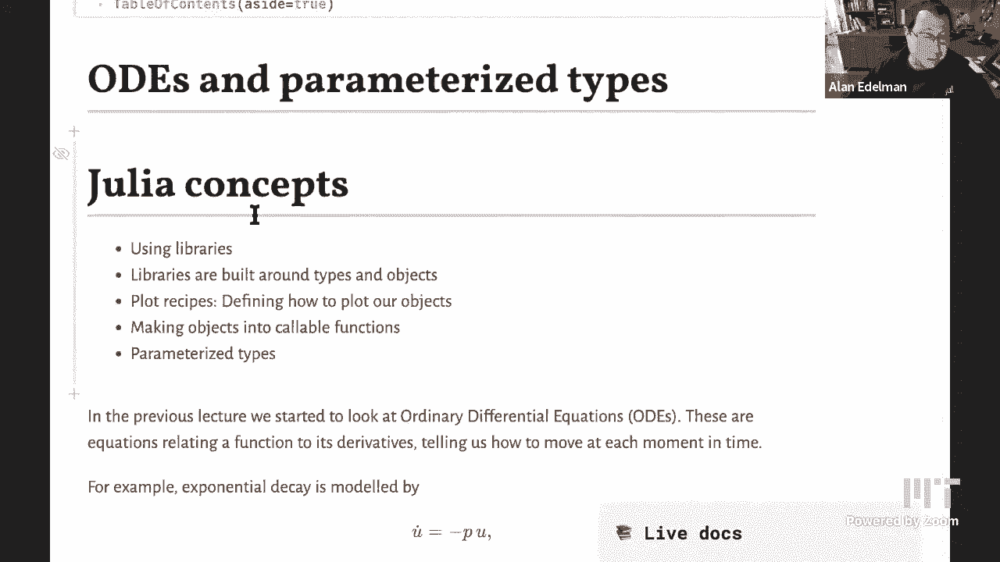
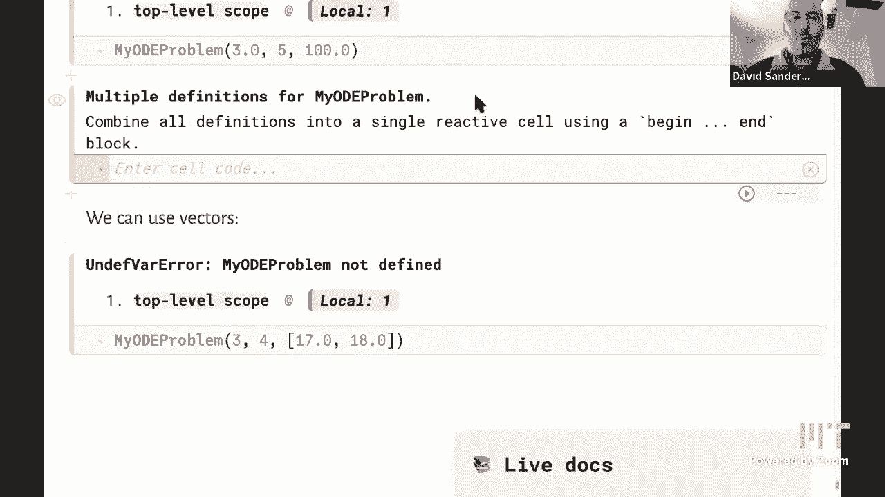

# L18：工具库和参数类型 🧰





在本节课中，我们将学习如何使用Julia中的工具库（包）来求解常微分方程，并深入理解这些库是如何通过类型和参数化类型来构建的，以实现高效和灵活的代码。

---

上一节我们介绍了常微分方程的基本概念。本节中，我们来看看如何使用一个专门的Julia包来求解它们，并探索其背后的软件设计原理。

## 使用微分方程求解包

我们首先需要将微分方程写成一个特定的函数形式。对于一个方程 `u̇ = -p * u`，其右侧需要定义为一个接受三个参数的函数：变量 `u`、参数 `p` 和时间 `t`。

**代码示例：定义微分方程**
```julia
f(u, p, t) = -p * u
```
即使方程本身不显式依赖于时间 `t`，函数定义中仍需包含 `t` 参数，因为软件包要求函数具有固定的参数结构。

接下来，我们需要指定求解所需的数据：时间区间和初始条件。

**代码示例：设置问题参数**
```julia
tspan = (0.0, 10.0)  # 时间区间
u0 = 100.0           # 初始条件
p = 0.2              # 方程参数
```

## 构建与求解ODE问题

Julia的 `DifferentialEquations.jl` 包围绕类型进行构建。我们使用 `ODEProblem` 类型来封装微分方程的所有信息。

**代码示例：定义并求解问题**
```julia
using DifferentialEquations
prob = ODEProblem(f, u0, tspan, p)  # 构建问题对象
sol = solve(prob)                    # 求解问题
```
`solve` 函数接收这个 `ODEProblem` 对象，并返回一个 `ODESolution` 类型的对象，其中包含了求解结果。

## 处理与可视化结果

`solution` 对象不仅存储了离散时间点上的解，还包含了进行插值以获取连续解的信息。我们可以像调用函数一样调用它来获取任意时间点的值。

**代码示例：使用解对象**
```julia
sol(3.5)          # 在 t=3.5 处插值求解
plot(sol)         # 绘制解的连续曲线
sol.t             # 获取求解所用的时间点向量
sol.u             # 获取对应时间点的解值向量
```
`plot(sol)` 能够绘制出平滑曲线，这得益于包中定义的**绘图配方**，它告诉绘图库如何绘制这种特定类型的对象。

## 求解方程组

该方法同样适用于方程组。例如，对于SIR传染病模型，我们将三个变量放入一个向量中，并定义一个返回向量值的函数。

**代码示例：定义SIR模型方程组**
```julia
function sir!(du, u, p, t)
    s, i, r = u
    β, γ = p
    du[1] = -β * s * i
    du[2] = β * s * i - γ * i
    du[3] = γ * i
end

u0 = [0.99, 0.01, 0.0]  # 初始向量 [S, I, R]
p = [0.3, 0.1]          # 参数 [β, γ]
tspan = (0.0, 50.0)
prob = ODEProblem(sir!, u0, tspan, p)
sol = solve(prob)
plot(sol)
```

## 探索类型与参数化类型

包中的复杂功能是通过精心设计的类型系统实现的。例如，`ODEProblem` 类型内部包含多个字段，其具体类型由参数化类型决定，这确保了代码的效率和专一性。

以下是参数化类型的一个简单示例：

**代码示例：自定义参数化类型**
```julia
struct MyODEProblem{T, S}
    t0::T
    tfinal::T
    u0::S
end

# 创建不同类型的实例
prob1 = MyODEProblem(3, 4, 100.0)     # 类型为 MyODEProblem{Int64, Float64}
prob2 = MyODEProblem(3.0, 4.0, 100.0) # 类型为 MyODEProblem{Float64, Float64}
prob3 = MyODEProblem(0.0, 10.0, [1.0, 2.0]) # 类型为 MyODEProblem{Float64, Vector{Float64}}
```
通过参数 `T` 和 `S`，同一个结构体可以灵活地处理不同类型的数据（如标量或向量），同时Julia编译器能为每种类型组合生成高效的特化代码。

## 可调用对象

我们可以让自定义类型的对象像函数一样被调用。这是通过为类型定义函数调用行为实现的。

**代码示例：定义可调用对象**
```julia
struct SimpleEulerOutput{T, S}
    times::Vector{T}
    values::Vector{S}
end

# 定义调用行为：线性插值
function (sol::SimpleEulerOutput)(t)
    # 在此实现线性插值逻辑，使用 sol.times 和 sol.values
    return "在时间 $t 处插值"
end

sol_obj = SimpleEulerOutput([1, 2], [3, 4])
sol_obj(3.5)  # 输出：在时间 3.5 处插值
```

---



本节课中我们一起学习了如何使用 `DifferentialEquations.jl` 包来求解常微分方程，理解了该包如何利用类型系统（如 `ODEProblem` 和 `ODESolution`）来组织代码和数据。我们还探讨了参数化类型如何提供灵活性并保证性能，以及如何创建可调用对象。这种基于类型的设计模式是许多高性能Julia包的核心，它连接了数学问题表述与高效的软件实现。