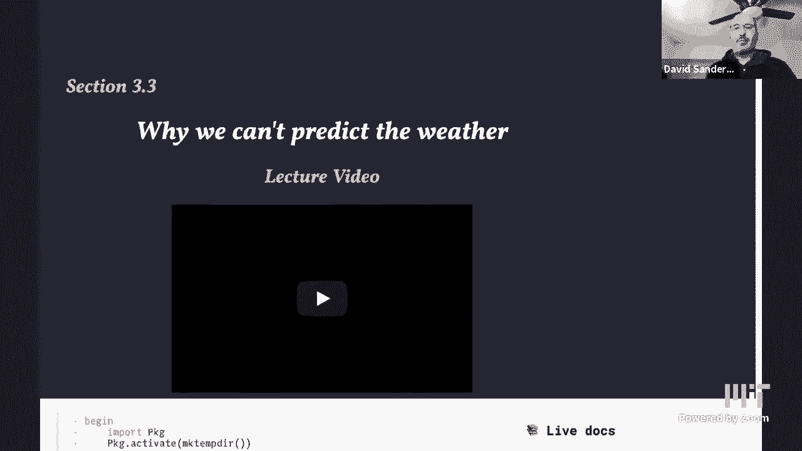
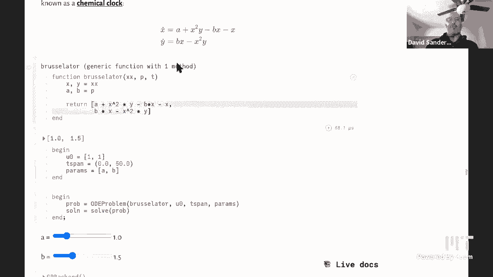
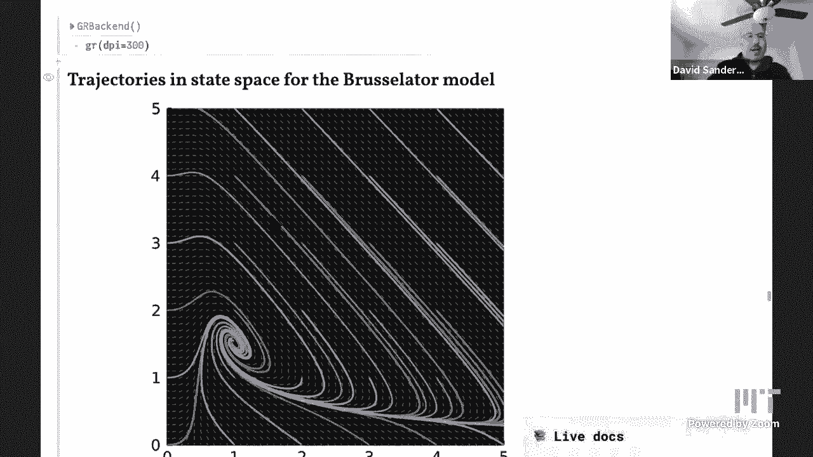
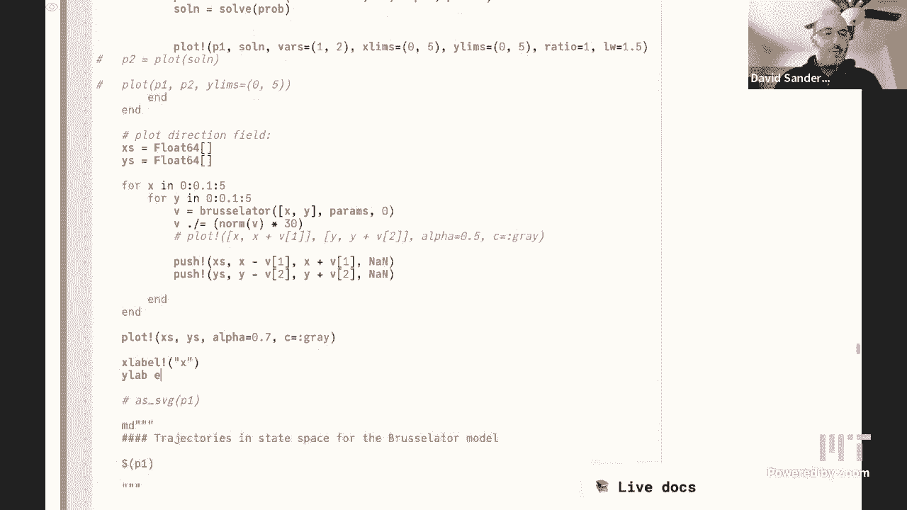
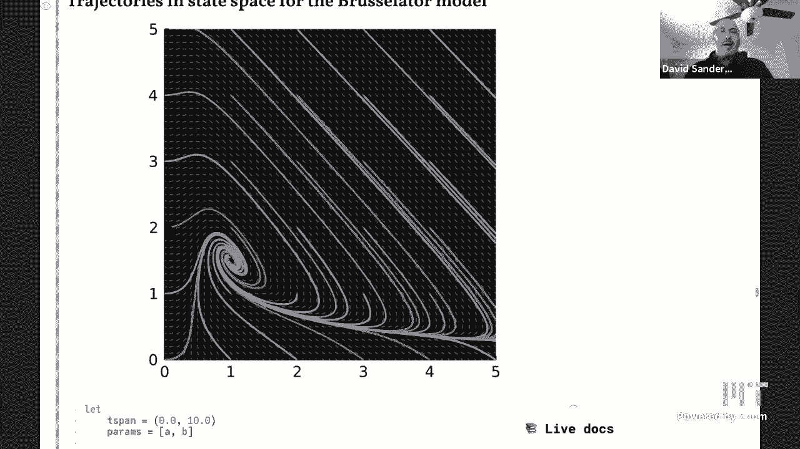
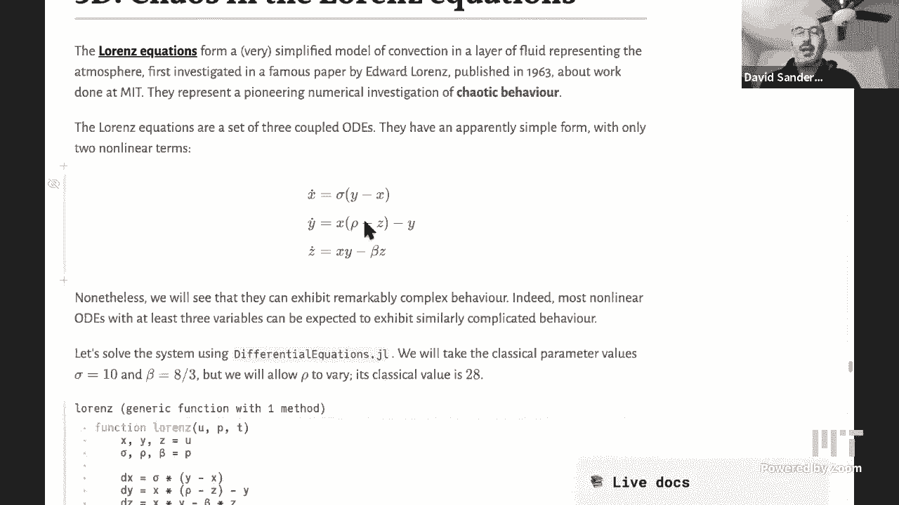

# L19：为什么我们不能预测天气 🌦️

在本节课中，我们将探讨一个核心问题：为什么我们无法精确预测天气，却可以对气候做出预测。我们将通过建立简单的数学模型，理解天气系统的复杂性和混沌本质，并学习动力系统中的关键概念，如稳定性、分岔和混沌。

## 天气与气候的区别

上一节我们介绍了课程主题，本节中我们来看看天气与气候的基本区别。

天气指的是短期内的大气状态，例如温度、降水、风速等。我们可以通过观测当前云层和气压，并利用描述空气和水运动规律的偏微分方程模型，来预测未来几小时甚至几天的天气。这些模型基于我们已充分理解的物理过程。

气候则是指长期的平均天气状况，例如一个地区的年平均温度。虽然每天的天气变化莫测，但当我们对时间（如整个三月份）和空间进行平均后，气候模式就变得相对稳定和可预测。气候变化指的是这种长期平均状态的缓慢改变。

## 从简单模型开始：逻辑斯蒂方程

为了理解复杂系统，我们从一个简单的模型开始。这个模型描述细菌在有限资源下的种群增长。

我们用一个变量 `x` 表示细菌数量（相对于环境承载能力的比例）。其增长规律可以用以下常微分方程描述：
`dx/dt = x * (1 - x)`
其中，`x * (1)` 项代表指数增长趋势，`- x^2` 项代表资源有限导致的竞争和饱和效应。

以下是使用数值方法（如欧拉法）模拟该方程行为的步骤：
1.  定义微分方程的右侧函数 `f(x) = x * (1 - x)`。
2.  选择一个初始值 `x0`、时间步长 `h` 和总模拟时间 `T`。
3.  迭代计算：`x_{n+1} = x_n + h * f(x_n)`。

模拟结果显示：
*   如果初始值 `x0` 在 0 和 1 之间，种群数量会增长并最终稳定在 `x = 1`（即达到环境最大承载量）。
*   如果初始值 `x0 = 1`，种群数量保持不变。
*   如果初始值 `x0 = 0`，种群数量也保持不变。
*   如果初始值 `x0 > 1`，种群数量会下降至 1。
*   如果初始值 `x0 < 0`（虽无物理意义），种群数量会趋向负无穷。

`x = 0` 和 `x = 1` 都是系统的**不动点**（Fixed Points），即状态不再随时间变化的点。`x = 1` 是**稳定不动点**，因为附近的轨迹都会被吸引过来；`x = 0` 是**不稳定不动点**，因为附近的轨迹会远离它。

我们可以不通过模拟，而通过绘制**相图**（Phase Portrait）来定性分析系统行为。相图是在状态空间（这里是 x 轴）上，用箭头表示每个点处 `dx/dt` 的方向（即变化趋势）。箭头指向 `x = 1`，说明它是吸引子；箭头远离 `x = 0`，说明它是排斥子。

## 引入参数：分岔现象

上一节我们看了一个固定方程的行为，本节中我们来看看当方程中包含可调参数时，系统行为如何发生质变。

考虑方程：`dx/dt = μ + x^2`
这里 `μ` 是一个参数。不动点满足 `μ + x^2 = 0`。

当我们改变 `μ` 时：
*   当 `μ < 0` 时，方程有两个不动点：一个稳定，一个不稳定。
*   当 `μ` 增大时，两个不动点逐渐靠近。
*   当 `μ = 0` 时，两个不动点碰撞并消失。
*   当 `μ > 0` 时，方程没有实不动点，所有轨迹都趋向无穷。

这种因参数微小连续变化而导致系统定性行为（如不动点数量或稳定性）发生突然改变的现象，称为**分岔**（Bifurcation）。`μ = 0` 是**分岔点**。

将不同 `μ` 值下的相图堆叠起来，就得到了**分岔图**，它能清晰展示系统行为随参数的变化。

## 更复杂的动态：双稳性与滞后

现在考虑一个三次方程：`dx/dt = μ * x - x^3`
其不动点满足 `x * (μ - x^2) = 0`。

分岔图显示：
*   当 `μ ≤ 0` 时，只有一个稳定不动点 `x = 0`。
*   当 `μ > 0` 时，有三个不动点：`x = 0`（不稳定），`x = ±√μ`（稳定）。

在 `μ > 0` 的区域，系统具有**双稳性**（Bistability），即存在两个稳定的不动点。系统最终到达哪一个，取决于初始条件。

如果缓慢地改变参数 `μ`：
*   从 `μ < 0` 开始增加，系统状态会沿着 `x = 0` 的稳定分支移动。
*   当 `μ` 越过 0 进入正区域后，`x = 0` 变得不稳定，系统状态会突然跳跃到 `x = √μ` 的稳定分支上。
*   如果此后减小 `μ`，系统状态会沿着 `x = √μ` 分支移动，而不会在 `μ` 刚小于 0 时就跳回 `x = 0` 分支，直到 `μ` 进一步减小到另一个临界值才会跳回。

这种系统状态变化路径依赖于历史（参数变化方向）的现象，称为**滞后**（Hysteresis）。某些简单气候模型中就存在这种双稳性和滞后现象。

## 二维系统：振荡与极限环

在一维系统中，轨迹只能趋向或远离不动点。在二维或更高维系统中，会出现更丰富的行为，例如周期性振荡。

以**布鲁塞尔子模型**（Brusselator）为例，这是一个描述化学振荡反应（如BZ反应）的模型：
`dx/dt = a - (b+1)*x + x^2 * y`
`dy/dt = b * x - x^2 * y`
其中 `x`, `y` 是化学物质浓度，`a`, `b` 是参数。

在二维相平面 `(x, y)` 上模拟该系统：
*   对于某些参数，所有轨迹都螺旋式收敛到一个稳定的不动点（阻尼振荡）。
*   当参数 `b` 超过某个临界值（发生**霍普夫分岔**，Hopf Bifurcation）时，不动点失去稳定性，系统产生一个稳定的**极限环**（Limit Cycle）。
*   极限环是一个孤立的闭合轨迹，附近的轨迹都会被吸引到它上面，系统进入稳定的周期性振荡状态。这是二维系统特有的行为。

## 三维系统：混沌与洛伦兹吸引子

最后，我们进入模拟天气的核心——**洛伦兹系统**。它是由气象学家爱德华·洛伦兹从简化的大气对流模型中推导出的三维常微分方程组：
`dx/dt = σ * (y - x)`
`dy/dt = x * (ρ - z) - y`
`dz/dt = x * y - β * z`
其中 `σ`, `ρ`, `β` 是参数，通常取 `σ=10`, `β=8/3`，而 `ρ` 作为关键参数变化。

当 `ρ` 较小时，系统行为简单，轨迹趋向于一个或两个不动点。随着 `ρ` 增大，系统经历一系列分岔。当 `ρ` 达到约 28 时，系统出现令人惊奇的行为：
*   轨迹不再稳定于不动点或周期轨道，而是在一个复杂的、类似蝴蝶翅膀形状的集合上无限游走，这个集合称为**洛伦兹吸引子**。
*   该吸引子具有**分形**结构，且系统表现出**确定性混沌**。

混沌的核心特征是**对初始条件的极端敏感性**：两个无限接近的初始点，其轨迹会随时间呈指数级分离。我们可以计算两条初始距离为 `ε` 的轨迹之间的距离 `d(t)`，会发现 `d(t) ~ ε * e^(λt)`，其中 `λ > 0` 称为李雅普诺夫指数。这意味着即使模型是完全确定的，长期的精确预测也变得不可能，因为初始测量任何微小的误差都会被迅速放大。这从根本上解释了为何天气预报在超过一两周后就会失效。

然而，虽然单个轨迹不可长期预测，但混沌系统在吸引子上的长期**统计平均**性质（如平均值、方差）却是稳定的。对于洛伦兹系统，即使两条轨迹完全不同，它们各自在长时间内的坐标平均值也非常接近。这正对应了“气候”（长期统计平均）的可预测性，尽管“天气”（具体瞬时状态）是混沌的。

## 总结

本节课中我们一起学习了动力系统的基本概念及其在理解天气与气候预测问题中的应用。

我们首先区分了天气（短期、具体、混沌）和气候（长期、平均、可预测）。然后从简单的一维逻辑斯蒂方程入手，学习了不动点、稳定性、相图等概念。通过引入参数，我们观察了分岔现象，以及双稳性和滞后等非线性效应。

进入二维系统，我们看到了极限环和周期性振荡如何从霍普夫分岔中产生。最后，在三维洛伦兹系统中，我们遇到了确定性混沌、对初始条件的敏感性以及奇怪的吸引子。这揭示了天气不可长期预测的数学根源。同时，我们也认识到，混沌系统的长期统计行为可能是稳定的，这为气候预测提供了可能性。

这些非线性动力学概念不仅适用于气象学，也广泛存在于物理、化学、生物乃至社会科学等众多领域。理解这些思想，是培养计算思维、应对复杂系统挑战的重要一步。