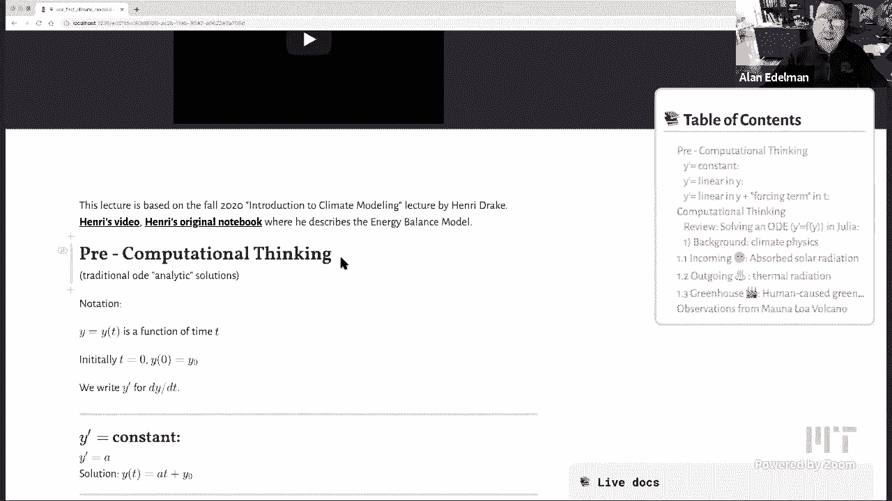
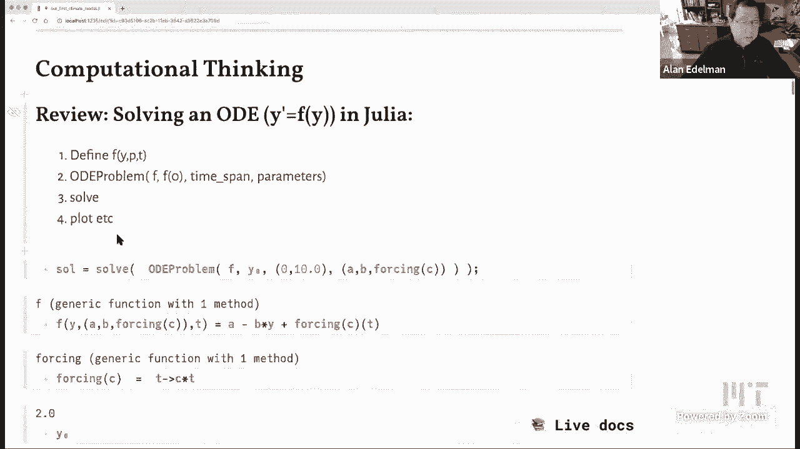
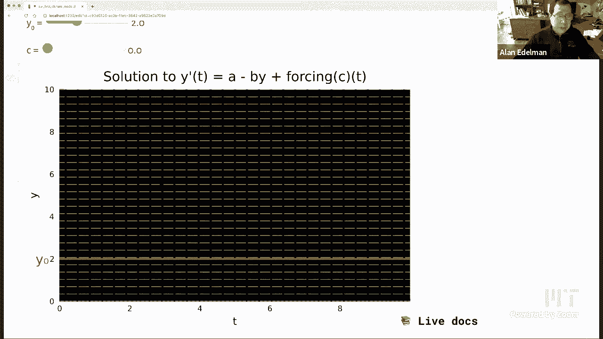
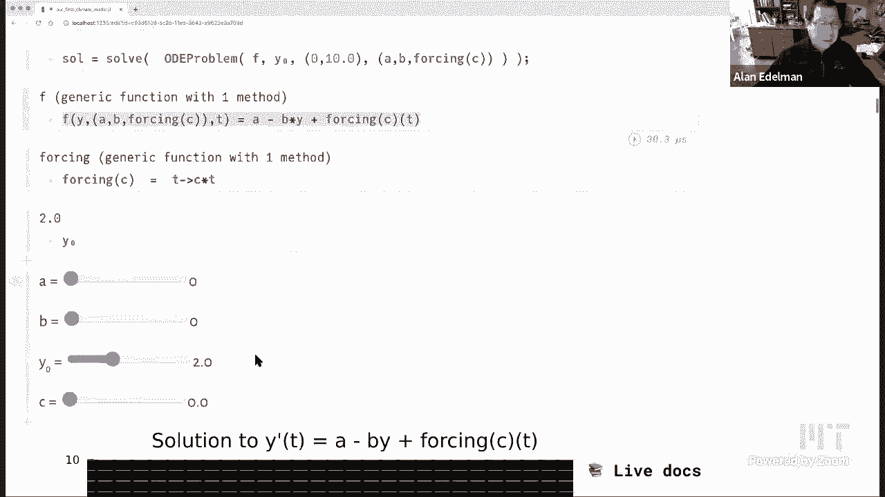
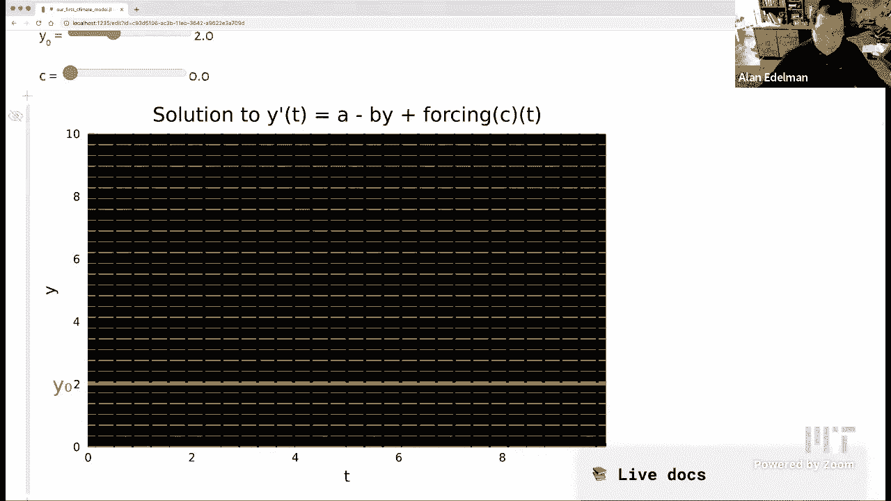
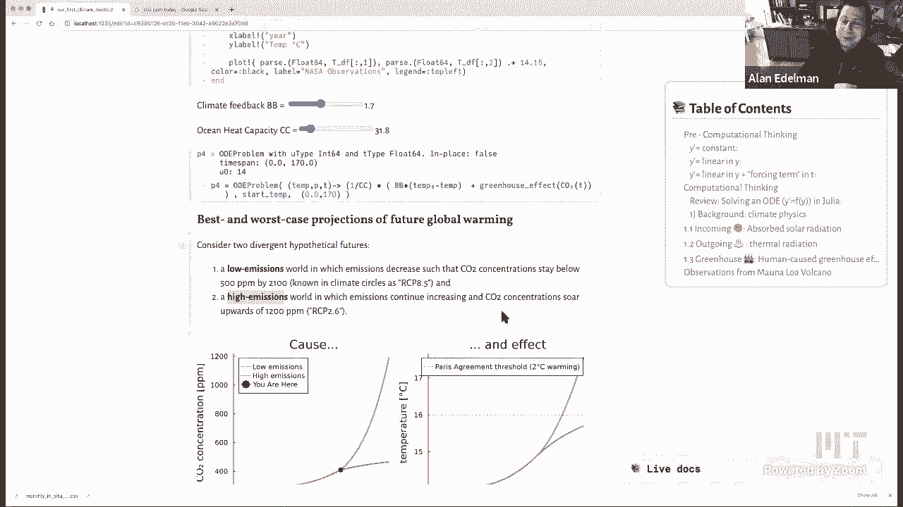

# 计算思维导论：L20：第一个气候模型 🌍





在本节课中，我们将学习如何构建一个简单的气候模型。我们将从基础的微分方程入手，逐步引入太阳辐射、地球热辐射以及温室效应等物理概念，最终整合成一个能够模拟地球温度变化的“零维”能量平衡模型。通过这个过程，你将理解计算思维如何帮助我们直观地探索和理解复杂的数学模型。

---

## 第一部分：从微分方程开始 📈



上一节我们介绍了课程的主题。本节中，我们来看看如何用计算思维来理解微分方程，这是构建气候模型的基础。







我们从一个关于时间 `t` 的函数 `y(t)` 开始。设初始时间 `t = 0`，初始值为 `y0`。我们用 `y‘` 表示 `dy/dt`。

在传统的微分方程课程中，我们可能会从简单的方程开始，例如 `y‘ = a`（`a` 为常数），并求得其符号解 `y(t) = a*t + y0`。

接下来，我们增加一个线性项，考虑方程 `y‘ = a - b*y`。这个方程有精确的符号解。当 `t` 趋于无穷大时，`y(t)` 会趋近于一个平衡点 `a/b`。这个平衡点可以通过令 `y‘ = 0` 求得。

我们还可以加入一个与时间相关的强迫项 `f(t)`，方程变为 `y‘ = a - b*y + f(t)`。其解包含一个积分项。虽然这些符号解包含了所有信息，但它们通常不够直观。

我更喜欢通过数值求解和可视化来理解微分方程。Julia 语言拥有由 Christopher Rackauckas 编写的卓越的 ODE 求解器套件。使用方法如下：
1.  定义函数 `f(y, p, t)`，描述 `y‘`。
2.  使用 `ODEProblem` 设置问题，包括初始条件、时间范围和参数。
3.  使用 `solve` 命令求解。
4.  对结果进行绘图和分析。

通过交互式地调整参数（如 `a`, `b`, `c`），并观察方向场和解曲线的变化，我们可以更直观地理解每个项在方程中的作用：
*   **参数 `a`**：作为常数项，它均匀地影响所有位置，推动解曲线整体上升。
*   **参数 `b`**：与 `y` 线性相关（`-b*y`），它促使解曲线趋向于一个平衡点，防止其无限增长。
*   **强迫项 `f(t)`**：作为时间的函数，它会改变平衡点的位置或使解曲线随时间产生特定变化。

这种通过计算和可视化来探索方程行为的方式，正是计算思维的核心——利用计算机作为理解数学的工具。

---

## 第二部分：构建零维气候模型 ☀️❄️

上一节我们介绍了如何用计算思维理解微分方程。本节中，我们来看看如何将这些方程应用到气候科学中，构建一个简单的“零维”能量平衡模型。该模型将地球视为一个点，只考虑全球平均温度。

气候模型主要考虑三个物理过程：
1.  **吸收的太阳辐射**：来自太阳的能量，使地球变暖。
2.  **向外热辐射**：地球表面向太空辐射的能量，使地球冷却。
3.  **人为温室效应**：大气中温室气体（如二氧化碳）捕获部分本应逃逸到太空的热辐射，导致增温。

以下是这三个过程对应的微分方程核心项：

**1. 仅考虑吸收的太阳辐射**
这对应于最简单的方程：`温度变化率 ∝ 常数`。
吸收的太阳辐射功率 `S` 约为 1368 W/m²。地球反射一部分太阳光，反射率 `α` 约为 0.3。同时，由于地球是球体，接收太阳辐射的有效面积是其横截面积（πR²），而非总面积（4πR²），因此需要除以 4。
此外，海洋的热容量 `C`（约为 51 J/m²/°C）会减缓温度变化。
因此，温度 `T` 的变化方程是：
`C * dT/dt = S * (1 - α) / 4`
代入数值，右端约为 239.4 W/m²。如果地球只吸收太阳热量而不散发，温度将直线上升，在工业革命（1850年）至今的170多年里，会达到无法想象的高温。

**2. 加入向外热辐射**
这对应于方程 `y‘ = a - b*y` 的形式。向外热辐射近似为温度的线性函数：`b * (T0 - T(t))`，其中 `T0` 是平衡温度，负号表示该效应使温度恢复平衡。
我们利用工业革命前的平均温度 `T0 = 14°C` 作为平衡温度来确定参数关系。通过拟合数据，可以确定系数 `b` 约为 1.3 W/m²/°C。
现在方程变为：
`C * dT/dt = S*(1-α)/4 - b*(T - T0)`
在这个模型中，无论初始温度如何，系统最终都会稳定在 14°C 的平衡状态，这模拟了地球自然的温度调节能力。

**3. 加入人为温室效应**
这对应于增加一个强迫项 `f(t)`。温室效应强度与大气中二氧化碳（CO₂）浓度的对数成正比。
公式为：`F * log₂( CO₂(t) / CO₂_pre )`，其中 `F` 是强迫系数（约 5 W/m²），`CO₂_pre` 是工业革命前的 CO₂ 浓度（约 280 ppm）。
因此，完整的零维模型方程为：
`C * dT/dt = S*(1-α)/4 - b*(T - T0) + F * log₂( CO₂(t) / CO₂_pre )`
现在，温度的变化不仅受自然过程影响，也受人类活动导致的 CO₂ 浓度变化 `CO₂(t)` 驱动。

---

## 第三部分：使用真实数据与预测未来 📊🔮

上一节我们建立了气候模型的微分方程。本节中，我们来看看如何利用真实数据校准模型，并用它来预测未来的可能情景。

首先，我们需要知道历史 CO₂ 浓度数据 `CO₂(t)`。我们可以从美国夏威夷莫纳罗亚观测站获取自1958年以来的月度数据。在 Julia 中，我们可以使用 `CSV.read` 和 `DataFrame` 来加载和处理这些数据。数据中可能包含缺失值（如 -99.99），我们可以通过布尔掩码进行过滤，只选取有效数据。

```julia
# 示例：使用掩码过滤有效数据
valid_mask = data[!, :co2] .> 0
valid_dates = data[valid_mask, :date]
valid_co2 = data[valid_mask, :co2]
```

将有效数据绘制出来，可以看到著名的“基林曲线”，它清晰地显示了大气 CO₂ 浓度的持续上升趋势（从约315 ppm升至现今超过410 ppm）。我们可以用一个多项式（例如三次函数）来拟合这条曲线，得到一个平滑的 `CO₂(t)` 函数用于模型。

其次，我们有全球平均温度的历史观测数据（例如来自 NASA）。将我们模型计算出的温度曲线与真实观测数据进行比较，可以评估模型的准确性。通过调整参数 `b`（热辐射反馈强度）和 `C`（海洋热容量），我们可以获得对历史数据更好的拟合。这个过程通常涉及最小二乘法等优化技术。

最后，基于不同的未来 CO₂ 排放情景，我们可以运行模型进行预测。例如：
*   **低排放情景**：假设人类采取有力措施，将 CO₂ 浓度控制在500 ppm以下。
*   **高排放情景**：假设排放不受控制，CO₂ 浓度可能升至1200 ppm。

将这两种情景的 `CO₂(t)` 函数代入我们的微分方程并求解，就可以得到对应的未来温度预测轨迹。《巴黎协定》的目标是将全球升温控制在比前工业化时期高2°C以内。模型预测显示，低排放情景有望接近这一目标，而高排放情景将导致远超2°C的升温，带来严重后果。

---

## 总结

本节课中，我们一起学习了如何从简单的微分方程出发，逐步构建一个“零维”地球能量平衡气候模型。我们首先通过计算思维和可视化工具直观理解了微分方程中各项参数的作用。然后，我们将吸收太阳辐射、向外热辐射和人为温室效应这三个物理过程转化为数学模型中的具体项。最后，我们利用真实的 CO₂ 和温度观测数据来校准模型，并基于不同的排放情景对未来温度变化进行了预测。



这个简单模型虽然忽略了地理差异、云层、海洋环流等复杂细节（这些需要高性能计算机运行复杂模型），但它清晰地揭示了气候变化背后的核心机制：人类活动导致的温室气体增加，正在破坏地球原有的热平衡。理解这个基本框架，是每个人认识气候变化科学起点的重要一步。