# 计算思维导论：L21：如何在软件上进行协作 👥

在本节课中，我们将学习如何在软件项目中进行协作。我们将重点介绍一个名为GitHub的工具，它被全球开发者广泛用于代码协作。我们将了解它与日常工具（如Google Drive）的区别，并亲自动手创建一个GitHub仓库、提交更改，甚至为一个开源项目做出贡献。

## 概述：为何需要专门的协作工具？

在开始之前，我们先思考一个简单的问题：最简单的在线协作方式是什么？答案是互相发送电子邮件附件。这对于小型项目或学校论文来说可能有效，但对于软件项目，我们需要更强大的工具。软件项目有其特殊性：微小的代码改动可能导致整个程序崩溃；多人需要同时在不同分支上工作；开发者热衷于自动化流程。这些需求催生了像GitHub这样的版本控制系统。

## 第一部分：为何不使用Google Drive进行软件协作？ 🤔

上一节我们提到了软件协作的特殊性，本节中我们来看看为什么像Google Drive这样的实时同步工具不适合软件开发。主要有三个原因：

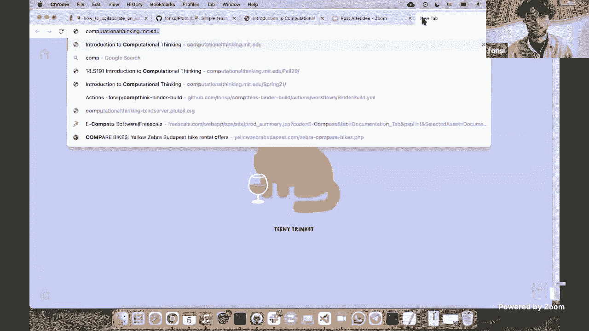

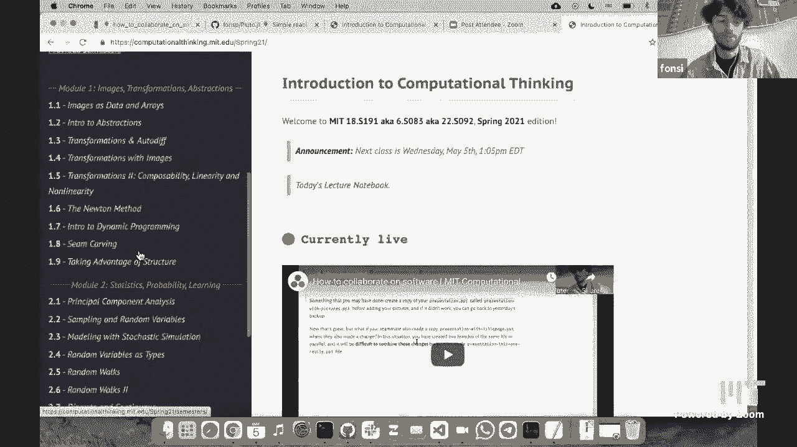

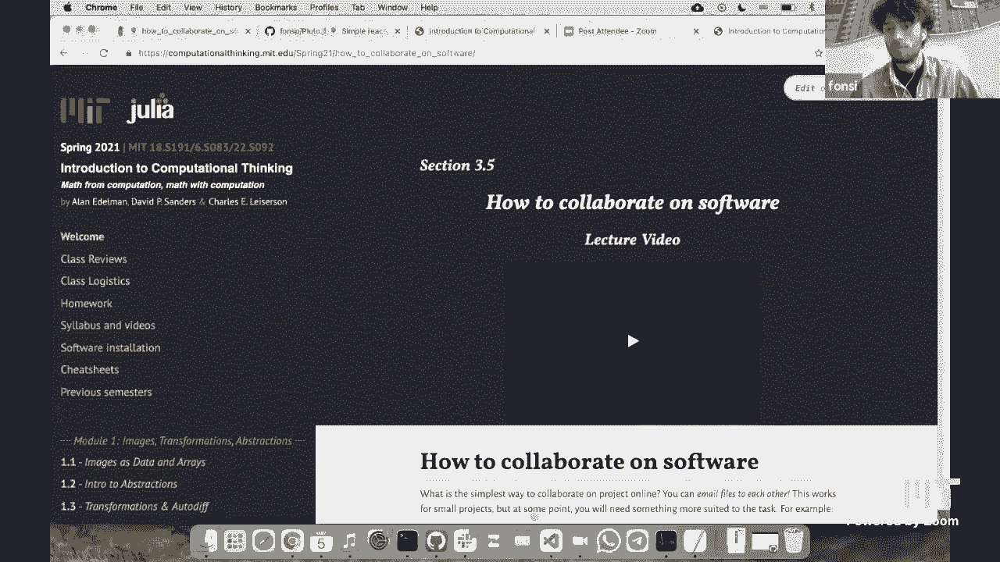

1.  **细粒度同步导致程序频繁崩溃**：在软件中，一个字符的错误就可能导致整个项目无法运行。如果像Google Drive那样同步每一次按键，那么在修改代码的中间状态（例如，将 `sqrt` 改为 `log` 的过程中），项目会多次处于“损坏”状态。我们更希望手动控制何时将一组完整的、可工作的更改发布出去。
2.  **需要分支与合并功能**：在软件开发中，经常需要创建代码的独立副本（称为“分支”）来尝试新功能或修复错误，而不会影响主版本。之后，需要将不同分支上的更改合并到一起。Google Drive的文件副本机制很难优雅地处理这种复杂的合并操作。
3.  **热爱自动化**：开发者喜欢自动化一切。GitHub集成了强大的自动化工作流（如自动测试、自动部署网站），这远超出了普通文档协作工具的范围。这种自动化（常被称为DevOps）是软件开发效率的关键，但也增加了复杂性。

## 第二部分：为开源项目做出贡献 🌍

了解了基本概念后，我们来看看如何实际参与一个开源项目。本节我们将学习如何通过提交“拉取请求”来改进一个气候模型的文档。

以下是向开源项目提交文档更改的基本步骤：

1.  **找到目标**：浏览项目文档或代码，发现可以改进的地方，例如一个拼写错误或表述不清的句子。
2.  **定位代码**：在项目的GitHub仓库中找到定义该文档的源文件。你可以使用仓库的搜索功能来查找特定文本。
3.  **编辑文件**：在GitHub网站上，点击文件右上角的编辑按钮（铅笔图标）。系统可能会提示你需要在一个分支上操作，通常选择默认分支即可。
4.  **提交更改**：修改内容后，在页面底部填写更改描述，并选择“创建新分支并提交拉取请求”。
5.  **发起拉取请求**：提交后，会自动创建一个“拉取请求”。项目维护者会审查你的更改，可能会提出修改意见。你可以根据反馈继续更新这个拉取请求中的代码，直到它被合并到主项目中。

> **核心概念**：**拉取请求** 是你向项目维护者提出的、希望将你的代码更改合并到主代码库的正式请求。

## 第三部分：创建并管理你自己的GitHub仓库 🛠️

现在，让我们创建自己的代码仓库，体验从本地到远程的完整协作流程。

1.  **创建仓库**：登录GitHub，点击右上角“+”号，选择“New repository”。为仓库命名（例如 `hello-mit`），选择公开或私有，建议初始化一个README文件。
2.  **克隆到本地**：为了在本地电脑上工作，你需要“克隆”这个仓库。推荐使用 **GitHub Desktop** 这类图形化工具。在仓库页面点击“Code”按钮，选择“Open with GitHub Desktop”，并指定本地存放路径。
3.  **进行本地更改**：用你喜欢的编辑器（如VS Code）打开本地仓库文件夹，修改或创建文件。例如，修改 `README.md` 文件。
4.  **提交更改**：在GitHub Desktop中，你会看到文件更改的差异。勾选想要提交的文件，编写清晰的提交描述，然后点击“Commit”。
5.  **推送到远程**：提交只是将更改记录在本地。需要点击“Push origin”才能将本地提交同步到GitHub网站上的远程仓库。
6.  **获取更新**：在协作中，他人也可能修改了远程仓库。经常点击“Fetch origin”来获取远程的最新更改，避免冲突。

## 第四部分：处理常见问题与冲突 ⚠️

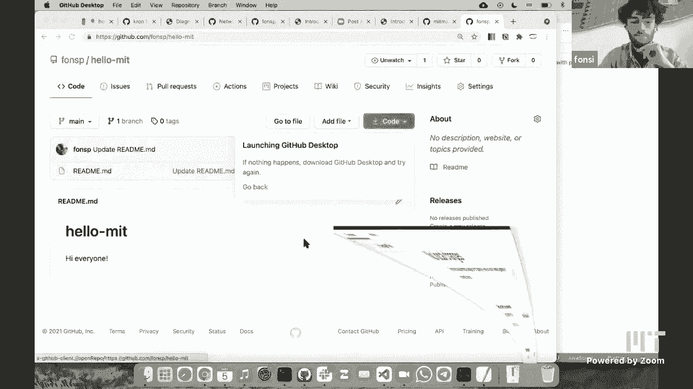

在协作中，当你和他人的修改冲突时，Git会阻止自动合并，要求你手动解决。这对于新手可能有些棘手。

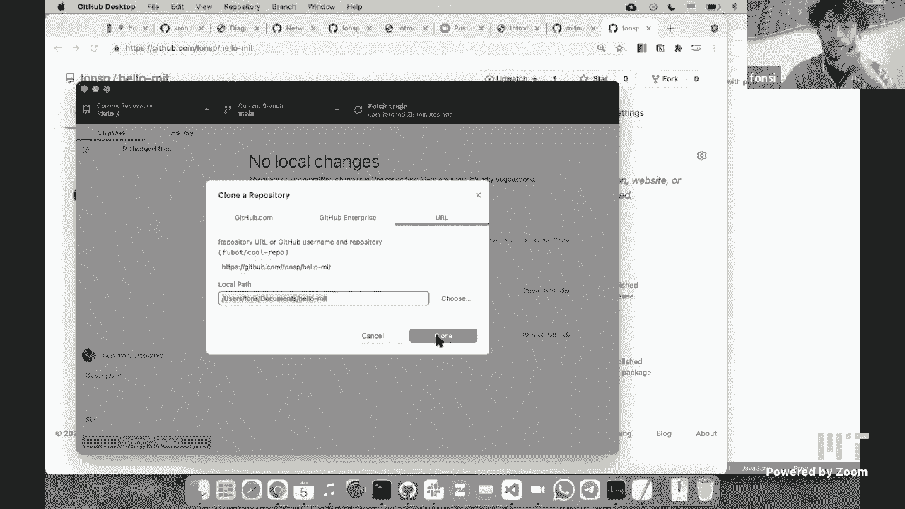

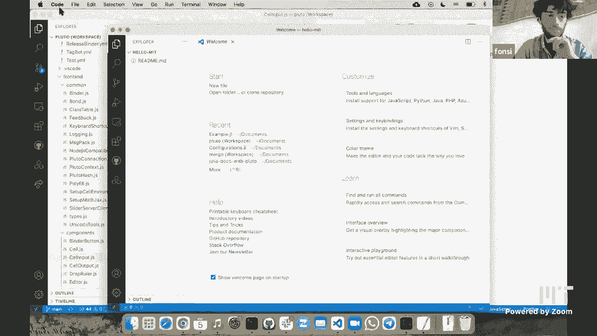

以下是解决冲突的一个简单策略：

1.  **备份你的工作**：将你修改过的、但尚未成功提交/推送的文件复制到仓库外的安全位置。
2.  **重置本地仓库**：在GitHub Desktop中，你可以右键点击更改的文件选择“Discard changes”，或者更彻底地删除整个本地仓库文件夹。
3.  **重新克隆**：从GitHub网站重新克隆一份最新的仓库到本地。
4.  **重新应用更改**：将之前备份的修改，手动合并到新克隆的文件中，小心处理冲突的部分。
5.  **提交并推送**：完成合并后，重新提交并推送你的更改。

> **注意**：这是初学者的权宜之计。随着经验增长，你应该学习使用分支、`git stash`或IDE内置的合并工具来更优雅地解决冲突。

## 第五部分：测试与更多贡献方式 🧪

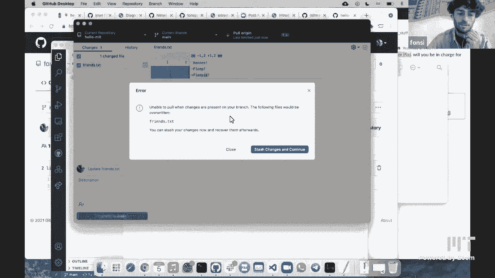

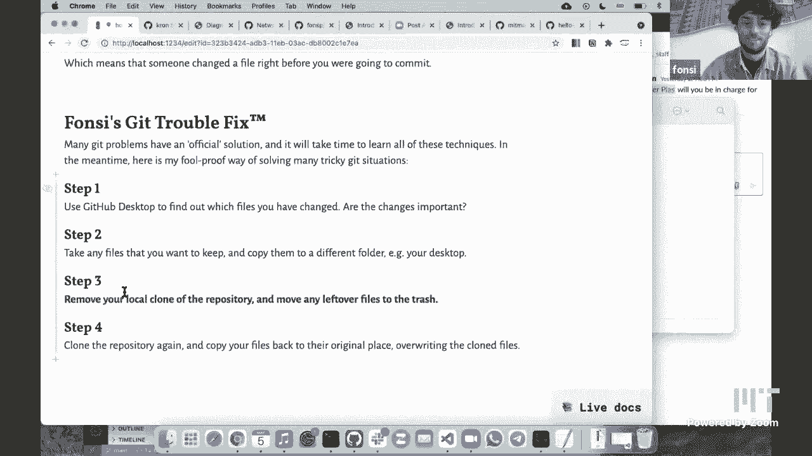

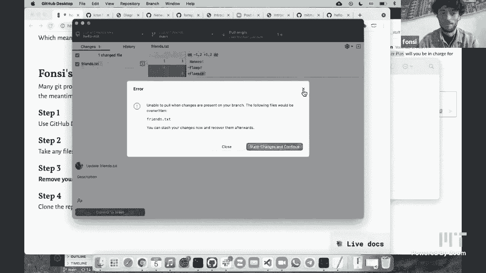

为代码编写测试是保证软件质量的重要实践。测试就像一份保险，确保未来的修改不会意外破坏现有功能。

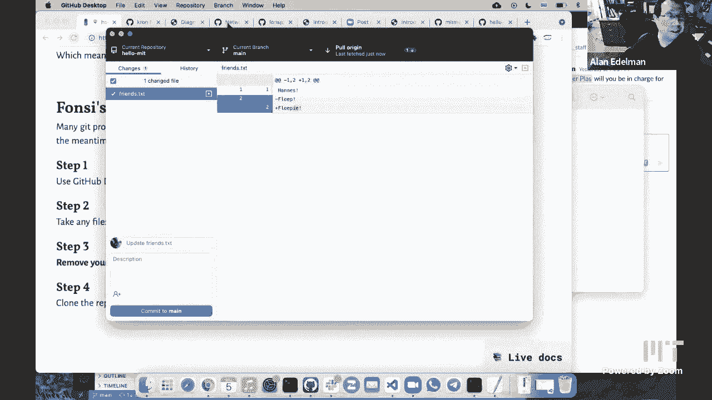

**测试驱动开发** 是一种先写测试，再写实现代码的方法。这能帮助你明确目标，并产生更健壮的代码。

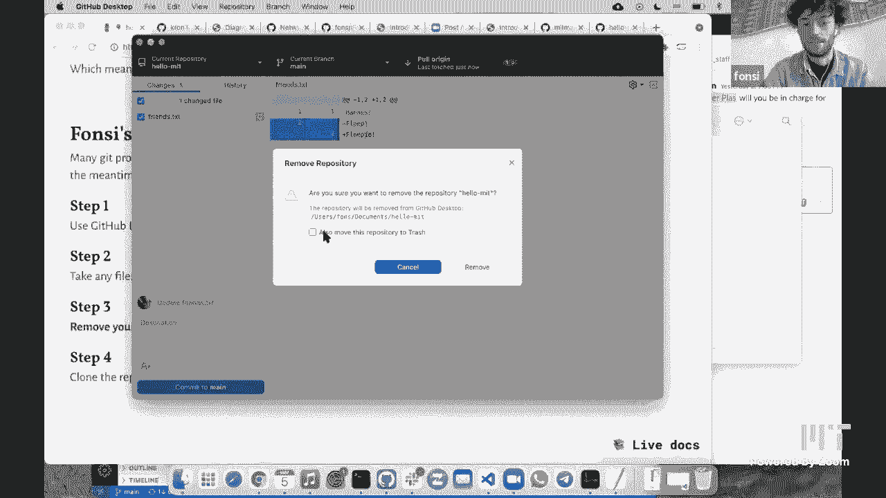

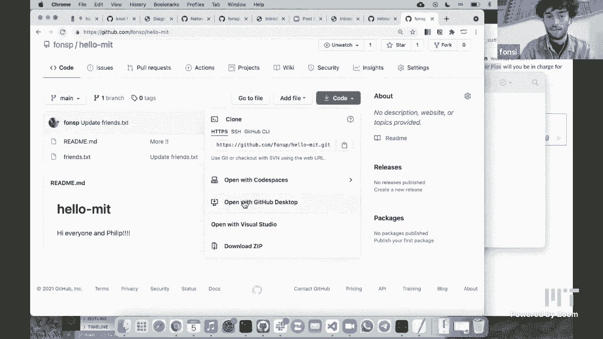

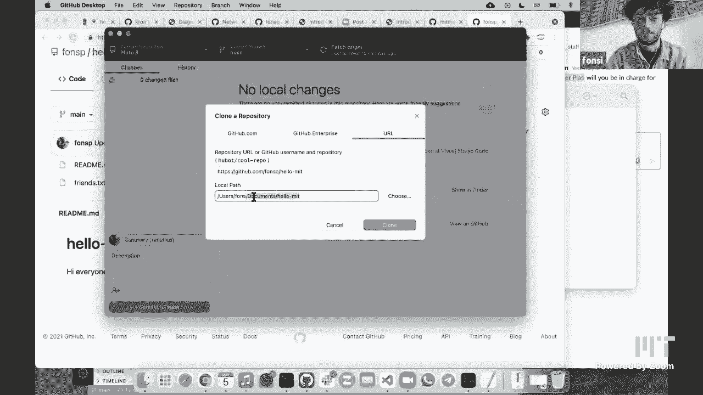

```julia
# 一个简单的测试示例
function double(x)
    return x * 2
end

# 测试用例
@assert double(2) == 4
@assert double(3) == 6
@assert double(0) == 0
```

除了提交代码，为开源项目做贡献的方式还有很多：
*   **报告问题**：详细描述你遇到的Bug。
*   **改进文档**：修正错误或补充示例。
*   **提交最小可复现案例**：当发现Bug时，提供一个能重现问题的最简代码片段，极大帮助维护者定位问题。

## 总结

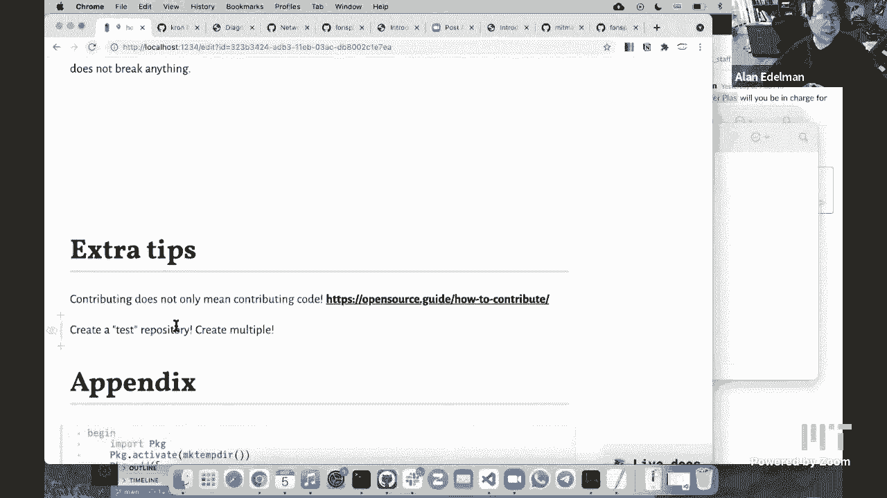

本节课中我们一起学习了软件协作的核心工具GitHub。我们了解了它与普通文档协作工具的区别，动手向开源项目提交了更改，创建并管理了自己的代码仓库，并探讨了处理冲突的基本方法和测试的重要性。记住，开始使用Git时可能会感到复杂，但不要畏惧。从创建一个个人仓库开始，大胆尝试提交、分支等操作，这是掌握这一强大协作工具的最佳途径。