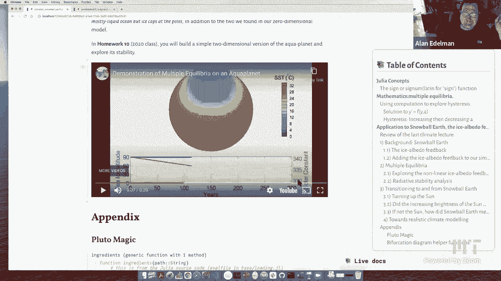
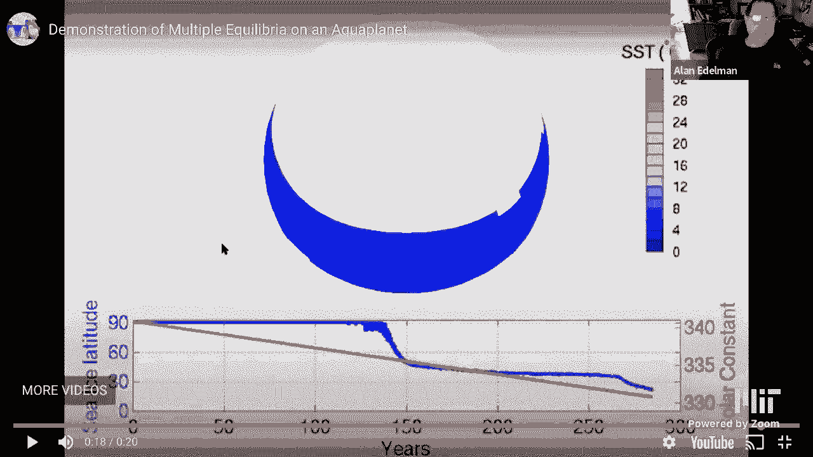
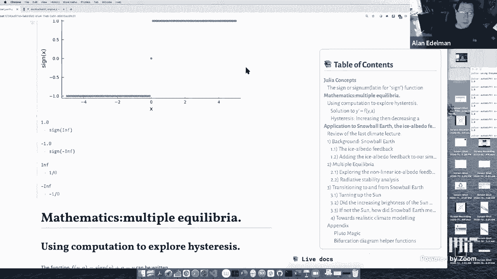

# L22：雪球地球与建模 🌍❄️

在本节课中，我们将学习一个重要的数学现象——**滞后现象**，并探索它与地球气候模型，特别是“雪球地球”假说之间的联系。我们将通过求解微分方程、分析多稳态系统，并最终理解地球气候如何可能在不同状态间切换。

## 概述：从数学现象到气候模型

上一节我们介绍了气候建模的基本概念。本节中，我们将首先深入探讨一个关键的数学概念——**滞后现象**，然后将其应用于理解地球气候历史中一个引人入胜的假说：“雪球地球”。

## 第一部分：数学基础——符号函数与不连续性

为了理解后续的模型，我们首先需要认识一个基础函数：**符号函数**。

在数学中，符号函数 `sign(x)`（有时写作 `sgn(x)`）定义如下：
*   当 `x > 0` 时，`sign(x) = 1`
*   当 `x = 0` 时，`sign(x) = 0`
*   当 `x < 0` 时，`sign(x) = -1`

这是一个在 `x=0` 处不连续的简单函数。在计算机的IEEE标准中，像 `1/0` 这样的运算会得到 `Inf`（正无穷），`-1/0` 会得到 `-Inf`（负无穷），它们是有效的数值表示。

## 第二部分：探索滞后现象

我们将使用计算思维来探索“滞后现象”。在物理学（如磁性研究）中，滞后现象指系统的状态不仅取决于当前条件，还取决于它到达当前状态的**历史路径**。

为了演示这一点，我们研究一个简单的函数族，它由符号函数构成，并带有一个参数 `a`：

`f(y) = sign(y) + a - y`

这个函数图像看起来像两条平行的直线，在 `y=0` 处有一个跳跃间断。

以下是该函数根（即 `f(y)=0` 的解）的情况分析：
*   当 `a < 1` 时，`y = a - 1` 是一个根（对应负值部分）。
*   当 `a > -1` 时，`y = a + 1` 是一个根（对应正值部分）。
*   当 `-1 < a < 1` 时，函数有两个根。

我们可以将这个函数视为三维空间中的一个曲面（`z = f(y, a)`），它由两个平行的半平面组成。该曲面与平面 `z=0` 相交，会产生两条线，这直观地展示了参数 `a` 如何影响根的数量和位置。

## 第三部分：微分方程中的多稳态与滞后

现在，我们将 `f(y)` 作为微分方程 `dy/dt = f(y)` 的右侧。通过数值求解，我们可以观察系统的行为。

*   当 `a` 远小于 -1 时，只有一个稳定的平衡点（负值）。
*   当 `a` 介于 -1 和 1 之间时，存在**两个稳定的平衡点**（一正一负）和一个不稳定的平衡点。
*   当 `a` 远大于 1 时，只有一个稳定的平衡点（正值）。

关键现象出现在 `-1 < a < 1` 的区间。假设系统从 `a` 值很小（如 -3）开始，并处于对应的负平衡点。然后我们缓慢地增加 `a`。

1.  系统会**连续地**沿着负值平衡点的路径移动，即使 `a` 已经变为正数，它仍然会停留在负值状态。
2.  只有当 `a` 增加到超过 1 时，负值平衡点消失，系统才会**突然跳跃**到正值平衡点。
3.  如果我们随后开始缓慢减小 `a`，系统会沿着正值平衡点的路径移动，直到 `a` 减小到低于 -1 时，才会再次突然跳回负值状态。

这个循环揭示了**滞后现象**：对于同一个 `a` 值（例如 `a=0`），系统可能处于两个不同的稳定状态（正或负），具体取决于它是从更热还是更冷的历史状态变化而来的。系统的当前状态“记得”它的过去。

## 第四部分：应用于气候——能量平衡模型

上一讲我们介绍了一个简单的能量平衡模型：地球温度的变化率 = 吸收的太阳辐射 - 向外散发的热辐射。

本节课我们简化模型，忽略人类活动产生的二氧化碳影响，专注于史前气候。关键的变化是：我们不再将地球反照率 `α`（反射率）视为常数。冰面比水面或陆地反射更多的阳光（反照率更高）。

因此，我们引入一个依赖于温度 `T` 的反照率函数 `α(T)`：
*   当温度很高（无冰）时，`α` 较低（例如 0.3），吸收大部分太阳能。
*   当温度很低（全球冰封）时，`α` 较高（例如 0.5），反射大部分太阳能。
*   在中间温度，存在一个平滑的过渡区。

将这个 `α(T)` 代入能量平衡方程后，我们得到了一个与之前数学例子结构相似的方程。绘制“吸收的太阳辐射”和“向外散发的热辐射”随温度变化的曲线，我们会发现它们存在**三个交点**，即三个平衡点：
1.  一个高温稳定平衡点（约 14°C，对应无冰或少量冰的“间冰期”地球）。
2.  一个低温稳定平衡点（约 -40°C，对应完全冰封的“雪球地球”）。
3.  一个中间的不稳定平衡点（约 -7.5°C）。

## 第五部分：雪球地球假说与滞后

地质证据表明，地球历史上可能至少发生过三次全球性的冰封事件，即“雪球地球”。我们的模型为这种现象提供了可能的解释。

根据滞后现象的原理：
*   当地球处于温暖的间冰期状态，即使太阳亮度缓慢降低（相当于模型中的 `a` 减小），气候系统也会倾向于保持在温暖平衡点附近，直到超过某个临界阈值。
*   一旦越过阈值，系统会迅速切换到雪球地球的稳定状态。
*   同样，要逃离雪球地球状态，仅仅依靠太阳亮度缓慢增加是不够的。模型显示，即使将太阳亮度增加到远超今日水平，系统仍可能停留在冰冻状态。这引出了主流理论：是火山持续喷发的大量二氧化碳（温室气体）积累了数百万年，最终足以克服高反照率的冷却效应，将地球推过另一个临界点，使其突然变暖，回到间冰期状态。

更复杂的模型（如考虑纬度分布的“水行星”模型）可以模拟冰盖从极地向赤道扩展的过程，展示了从部分冰封到全球冰封的突变。

## 总结与启示

本节课我们一起学习了：
1.  **滞后现象**的数学本质：多稳态系统中，状态取决于历史路径。
2.  如何通过简单的微分方程和计算机模拟来可视化和理解这一现象。
3.  将滞后现象应用于一个简化的地球能量平衡气候模型。
4.  用该模型解释了“雪球地球”假说中气候状态如何发生**突变式切换**，以及逃离全球冰封可能需要温室气体的长期积累。

核心启示是：地球气候系统并非总是线性、渐变响应外界变化。它可能存在稳定的状态和关键的“引爆点”。当前人类活动在极短时间内大幅增加温室气体浓度，正是在以一种史无前例的速度推动气候系统，这提醒我们不应将当前气候的稳定性视为理所当然。通过计算建模分离和探究这些复杂现象，我们能获得比传统方法更深刻的洞察力。