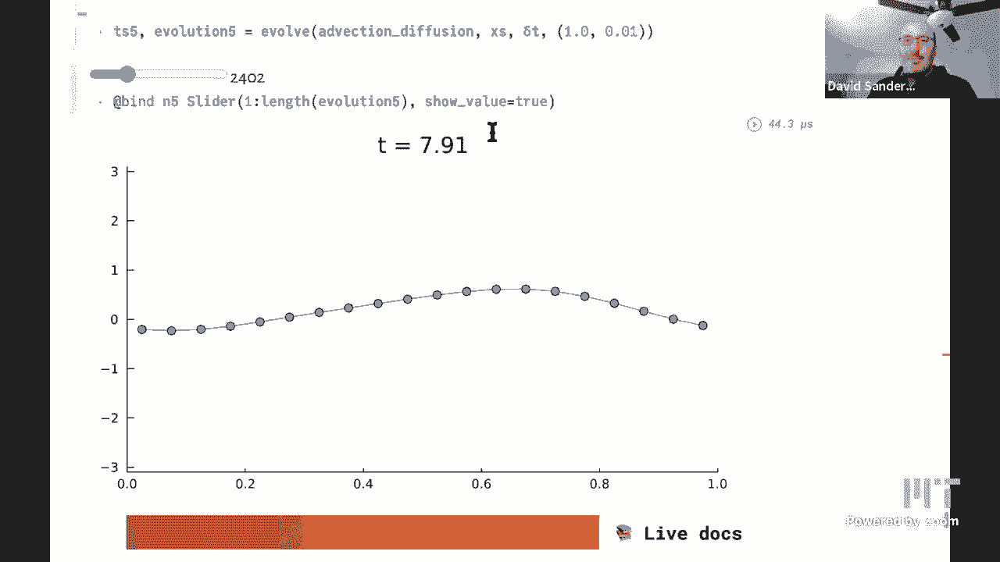

# L23：一维平流扩散偏微分方程 🧮


在本节课中，我们将学习偏微分方程的基础知识，特别是与气候模型相关的**平流**和**扩散**过程。我们将从计算思维的角度出发，理解如何通过离散化和数值方法来求解这些方程，并最终将它们结合起来模拟物理现象。


## 概述 🌍

之前，我们将地球温度建模为一个随时间变化的标量。然而，现实中的温度不仅随时间变化，也随空间位置（如纬度）变化。为了更精确地建模，我们需要引入依赖于空间和时间的温度场 `T(x, t)`。温度的变化源于热量的流动，这涉及到两种主要物理过程：**平流**（热量随流体运动）和**扩散**（热量从高温区域向低温区域自发传播）。本节课的目标是理解并数值求解描述这些过程的偏微分方程。

## 从离散化开始 📊

为了在计算机上处理连续的温度场，我们首先需要将其**离散化**。我们将空间区间（例如，从赤道到极点）划分为 `N` 个等宽的小单元，每个单元的宽度为 `Δx`。在每个单元的中心点（称为网格点），我们记录该点的温度值 `T_i^n`，其中 `i` 是空间索引（表示第 `i` 个单元），`n` 是时间步长索引（表示第 `n` 个时间点）。这样，连续的场 `T(x, t)` 就被近似为一系列离散值 `T_i^n`。

## 平流过程 🌊

平流描述了物理量（如热量或污染物浓度）随流体整体运动而被“携带”的过程。想象一条河流，河水中某处的温度分布会随着水流整体向右移动。

### 物理图像与离散模型

考虑一个流体单元，其温度为 `T_i^n`。在时间步长 `Δt` 内，流体以速度 `u` 向右运动。因此，一部分原本位于左侧相邻单元 `i-1` 中的“热量”会流入当前单元 `i`，同时当前单元中的一部分热量也会流出到右侧单元 `i+1`。

流入当前单元的热量比例约为 `(u Δt) / Δx`。基于此质量守恒原理，我们可以写出当前单元在下一时间步的温度更新公式：

```
T_i^{n+1} = T_i^n + (u Δt / Δx) * (T_{i-1}^n - T_i^n)
```

这个公式就是平流过程的**离散时间步进方案**。它表明，下一时刻 `i` 点的温度等于当前时刻的温度，加上从左边邻居流入的热量，减去从自身流向右边的热量。

### 边界条件与代码实现

在计算时，对于两端的单元（如 `i=1`），其左侧邻居 `i-1=0` 并不存在。我们需要定义**边界条件**。一种简便的方法是采用**周期性边界条件**，即将空间域首尾相连，形成一个环。这样，第一个单元的左侧邻居就是最后一个单元。

以下是平流过程的 Julia 代码实现核心部分：

```julia
function advection_step(T, u, Δt, Δx)
    N = length(T)
    T_next = similar(T) # 创建新数组存储下一步结果
    α = u * Δt / Δx # 计算 Courant 数

    # 内部单元更新
    for i in 2:N-1
        T_next[i] = T[i] + α * (T[i-1] - T[i])
    end

    # 周期性边界条件处理
    T_next[1] = T[1] + α * (T[N] - T[1])   # 第一个单元的左邻居是最后一个单元
    T_next[N] = T[N] + α * (T[N-1] - T[N]) # 最后一个单元的右邻居是第一个单元（在下一轮计算中体现）

    return T_next
end
```

### 从离散到连续：平流方程

如果我们对上述离散方程进行重新排列，并考虑当 `Δt` 和 `Δx` 都趋近于零的极限情况，就可以推导出连续的**平流方程**：

```
∂T/∂t = -u * ∂T/∂x
```

这里，`∂T/∂t` 是温度随时间的变化率，`∂T/∂x` 是温度在空间上的变化率（梯度）。该方程表明，某点温度随时间的变化，与该点温度在空间上的梯度成正比，方向与流速 `u` 相反。

### 数值方法的挑战

直接使用上面推导的简单离散格式（称为**迎风格式**）进行模拟时，可能会引入非物理的**数值扩散**，即温度轮廓在平移的同时会变得平滑、振幅衰减。为了更精确地模拟纯平流，通常需要使用更复杂的离散格式，例如**中心差分格式**：

```
T_i^{n+1} = T_i^n - (u Δt / (2Δx)) * (T_{i+1}^n - T_{i-1}^n)
```

这种格式同时考虑了左右邻居的信息，在满足稳定性条件 (`|u|Δt/Δx ≤ 1`，即 CFL 条件) 时，能更好地保持解的形态。

上一节我们介绍了平流过程，它描述了物理量随流体的整体运动。接下来，我们看看另一种基础物理过程——扩散。

## 扩散过程 🔥

扩散描述了物理量（如热量、浓度）从高值区域向低值区域自发传播，以达到均匀分布的趋势。即使流体静止，扩散也会发生，例如房间内的一处热源会逐渐使整个房间变暖。

### 随机游走与扩散

扩散的微观本质是粒子（如分子）的**随机运动**。大量粒子的集体随机运动在宏观上表现为扩散现象。在之前的随机游走课程中，我们学到粒子向左或向右移动的概率各为 `1/2`。考虑一个位置 `i` 上的粒子浓度（或温度）`T_i^n`，在下一时间步，该点的粒子可能来自左边的 `i-1`、右边的 `i+1` 或留在原地 `i`。

通过概率分析，可以得到扩散的离散更新公式：

```
T_i^{n+1} = T_i^n + (D Δt / (Δx)^2) * (T_{i-1}^n - 2T_i^n + T_{i+1}^n)
```

其中 `D` 是**扩散系数**，控制扩散的快慢。公式中 `(T_{i-1} - 2T_i + T_{i+1})` 这一项是二阶中心差分，它是空间二阶导数的离散近似。

### 从离散到连续：扩散方程（热方程）

取 `Δt` 和 `Δx` 趋近于零的极限，上述离散方程就变成了著名的**扩散方程**，也称为**热方程**：

```
∂T/∂t = D * ∂²T/∂x²
```

这里，`∂²T/∂x²` 是温度在空间上的二阶导数（曲率）。方程表明，某点温度随时间升高的速率，正比于该点温度分布的曲率。在热点（局部极大值，曲率为负），温度会下降；在冷点（局部极小值，曲率为正），温度会上升，从而导致整体趋于平滑。

扩散方程是一种**抛物型**偏微分方程，它描述的是耗散和 smoothing 过程。

## 结合平流与扩散 🌪️

在真实的物理系统（如海洋或大气）中，平流和扩散往往是同时发生的。例如，海洋中的热量既会被洋流携带（平流），也会在静止的水层中缓慢传导（扩散）。

### 组合模型

我们可以简单地通过**算子分裂**方法来组合这两个过程。即，在一个时间步 `Δt` 内，先计算纯平流带来的变化，再在平流结果的基础上计算扩散带来的变化（或者交换顺序）。对应的组合离散更新步骤可以写作：

```
# 平流步（使用改进的格式，如中心差分）
T_inter = advection_step(T^n, u, Δt, Δx)
# 扩散步
T^{n+1} = diffusion_step(T_inter, D, Δt, Δx)
```

对应的连续偏微分方程就是**平流-扩散方程**：

```
∂T/∂t = -u * ∂T/∂x + D * ∂²T/∂x²
```

这个方程是气候模型中描述能量或物质输运的基础之一。通过数值求解这个方程，我们可以模拟温度、盐度或污染物浓度等在空间中的演化。

## 总结与展望 📈

本节课我们一起学习了偏微分方程的两个基本构建模块：**平流**和**扩散**。

*   **平流方程** `∂T/∂t = -u ∂T/∂x` 描述了物理量随流体的整体输运。其数值求解需要注意格式选择（如中心差分）和稳定性条件（CFL条件）。
*   **扩散方程** `∂T/∂t = D ∂²T/∂x²` 描述了物理量由于随机运动导致的从高浓度向低浓度的传播。其离散形式自然引出二阶差分。
*   将两者结合得到的**平流-扩散方程** `∂T/∂t = -u ∂T/∂x + D ∂²T/∂x²`，能够更真实地模拟许多物理过程，是气候科学和流体力学中的核心方程。

我们从离散的物理图像（质量守恒、随机游走）出发，推导出离散更新公式，再通过取极限得到连续的偏微分方程，最后又回到离散的数值求解。这种“离散-连续-离散”的循环是计算思维在科学计算中的典型体现。



在未来的课程中，我们将把这些概念扩展到二维或三维空间，并应用于更复杂、更真实的气候系统模型中。理解这些基础过程，是构建和理解复杂地球系统模型的关键第一步。