# L24：电阻器、模板和气候模型 🧠

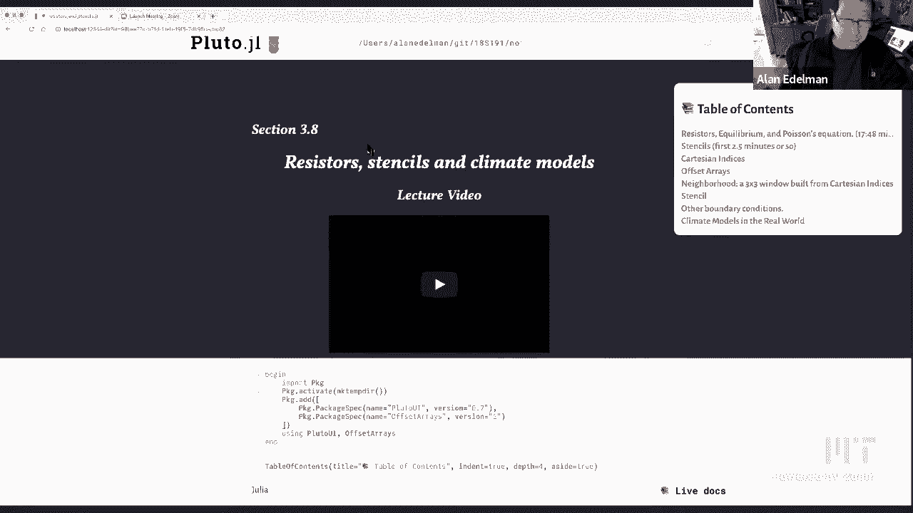

在本节课中，我们将学习如何将离散的物理问题（如电阻网络）与连续的数学概念（如偏微分方程）联系起来。我们将通过电阻网络、数值模板（Stencil）的应用，以及一个简化的二维海洋气候模型来探索这些概念。课程的核心是理解拉普拉斯算子（Laplacian）在离散和连续世界中的表现形式。


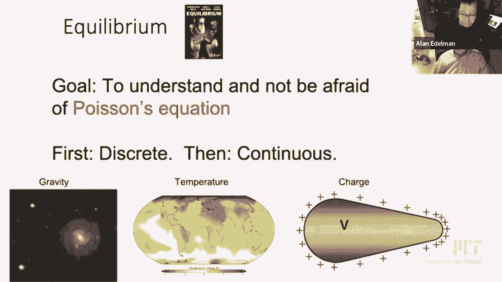

---

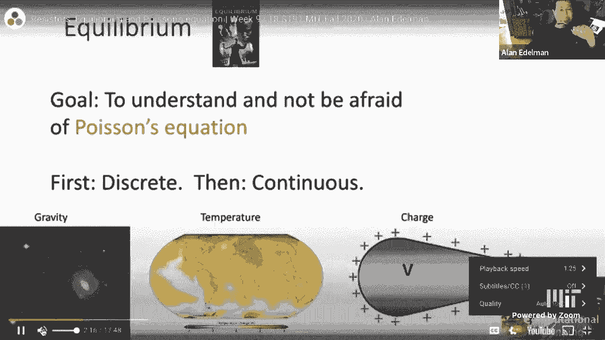

## 概述 📋

本节课我们将从具体的物理实例——电阻网络出发，推导出描述平衡状态的方程。接着，我们会看到同样的数学形式如何应用于图像处理或求解偏微分方程的数值模板。最后，我们会将这些概念扩展到一个二维的海洋热量传输模型中，这是现代气候模型的一个基础组成部分。

---

## 从离散到连续：电阻网络与拉普拉斯方程 ⚡

上一节我们概述了课程目标，本节中我们来看看一个具体的物理例子：由1欧姆电阻组成的网络。

想象你手中有一袋1欧姆的电阻器。根据欧姆定律，电压降 `V` 等于电流 `I` 乘以电阻 `R`：`V = I * R`。对于一个1欧姆的电阻，若有9伏特的电压降，则对应9安培的电流。

我们可以将这些电阻排列成有趣的图案，例如一个“十字形”。在这个图案中，我们关注五个点的电压：中心点电压 `V` 和其北、东、南、西四个邻居点的电压（`V_N`, `V_E`, `V_S`, `V_W`）。根据基尔霍夫电流定律，流入一个节点的净电流为零（除非有外部电流注入）。对于中心节点，流经四个电阻的电流之和必须为零。

每个支路的电流等于该支路的电压差除以电阻（1欧姆）。因此，我们可以得到中心节点的方程：
`(V_N - V) + (V_E - V) + (V_S - V) + (V_W - V) = I_out`
其中 `I_out` 是可能的外部输出电流。整理后得到：
`(V_N + V_E + V_S + V_W) - 4V = I_out`

这个方程是理解后续内容的关键。它表明，中心点的电压与其四个邻居点电压的平均值有关，其差值正比于外部电流。

现在，让我们将这个“十字形”网络扩展成一个更大的网格，例如一个包含60个节点（黑色圆点）的网格。每个内部节点都遵循上述同样的规则。如果我们知道所有边界条件（例如某些点接电池或接地）以及可能的外部注入电流，我们就能为每个内部节点列出一个类似的方程，从而得到一个大型线性方程组。

求解这个方程组（例如使用雅可比迭代法或计算机）可以得到网格中每个节点的电压。有趣的是，这个离散的电阻网络问题，在网格无限细化的极限下，会趋近于一个连续的数学问题——**拉普拉斯方程**或**泊松方程**。

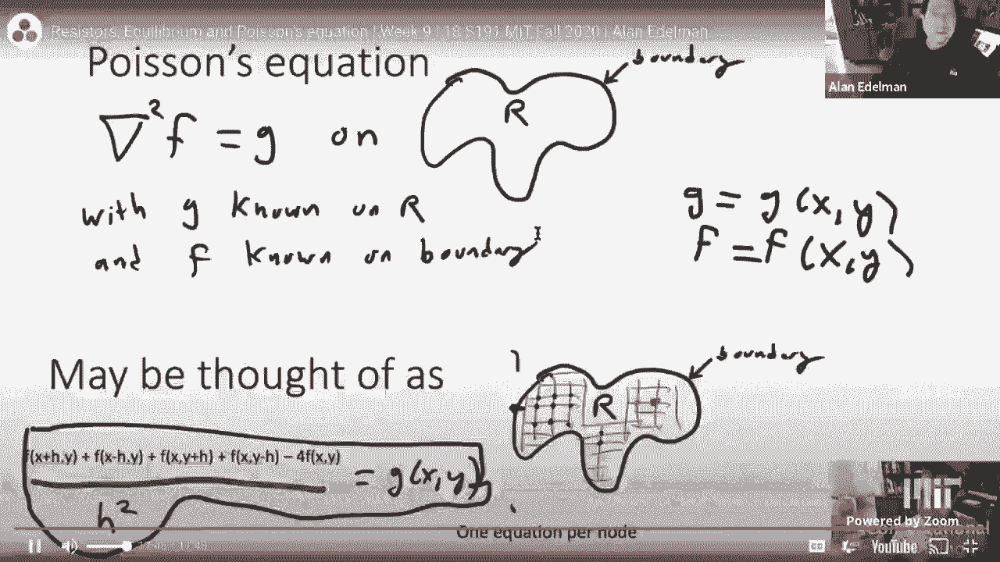

为了建立这种联系，我们考虑一个定义在整数网格点上的函数 `f(x, y)`，例如 `f(x, y) = 2x^3 - y^4`。我们可以计算该函数在中心点 `(0,0)` 与其邻居点的值。


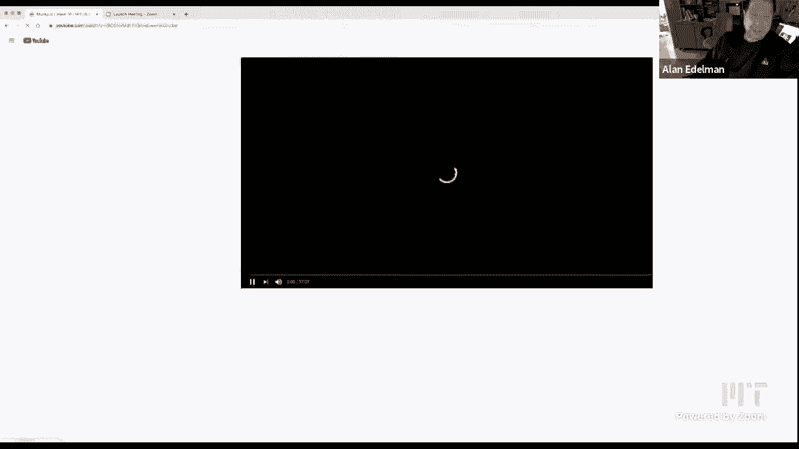

以下是计算二阶中心差分（离散拉普拉斯算子）的步骤：


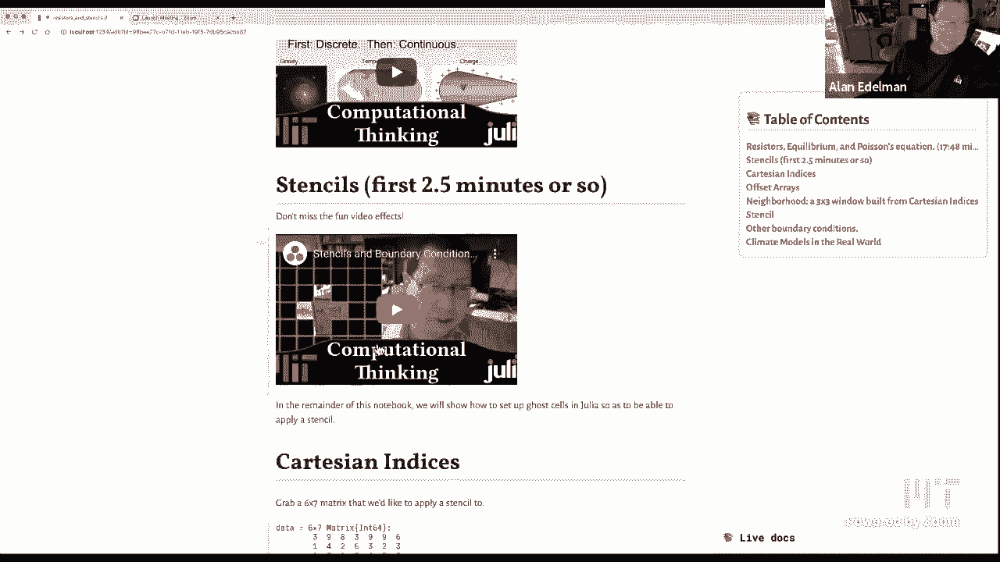


1.  计算一阶差分（相邻点的差值）：
    *   北向：`f_N - f`
    *   南向：`f - f_S`
    *   东向：`f_E - f`
    *   西向：`f - f_W`
2.  计算二阶差分（一阶差分的差分）：
    *   垂直方向二阶差分：`(f_N - f) - (f - f_S) = f_N + f_S - 2f`
    *   水平方向二阶差分：`(f_E - f) - (f - f_W) = f_E + f_W - 2f`
3.  将两个方向的二阶差分相加，得到离散拉普拉斯算子：
    `(f_N + f_E + f_S + f_W) - 4f`


这与我们电阻网络方程的左端形式完全一致！如果我们考虑网格间距为 `h`（而不一定是1），则需要用 `h^2` 进行归一化，使其成为导数的近似：
`[ (f_N + f_E + f_S + f_W) - 4f ] / h^2 ≈ ∂²f/∂x² + ∂²f/∂y²`

右边的连续算子 `∂²f/∂x² + ∂²f/∂y²` 被称为**拉普拉斯算子**，记作 `∇²f` 或 `Δf`。因此，离散的电阻网络方程 `(邻居和) - 4*(自身) = I` 对应的连续形式就是**泊松方程**：`∇²f = g`，其中 `g` 是已知的源项（对应于离散方程中的 `I`）。

总结来说，我们展示了如何从一个具体的、离散的物理问题（电阻网络）出发，通过数学推导，连接到描述连续现象的偏微分方程（泊松方程）。这体现了计算思维中离散与连续之间的深刻联系。

---

## 数值模板：在代码中应用拉普拉斯算子 🎨

上一节我们介绍了拉普拉斯算子在离散和连续形式下的数学表达，本节中我们来看看如何在计算机程序中实现它，这就要用到**模板**。

模板是一个小型的、带权重的窗口，我们在数据数组（如图像矩阵、温度场）上滑动它。在每一步，将窗口覆盖的数据与模板的权重系数相乘并求和，结果写入输出数组的对应位置。这广泛应用于图像处理（如模糊、边缘检测）和求解偏微分方程。

以我们之前得到的离散拉普拉斯模板为例，它是一个3x3的窗口，中心权重为4，上下左右四个邻居权重为-1，其余角点权重为0。
```
[ 0, -1,  0 ]
[-1,  4, -1 ]
[ 0, -1,  0 ]
```

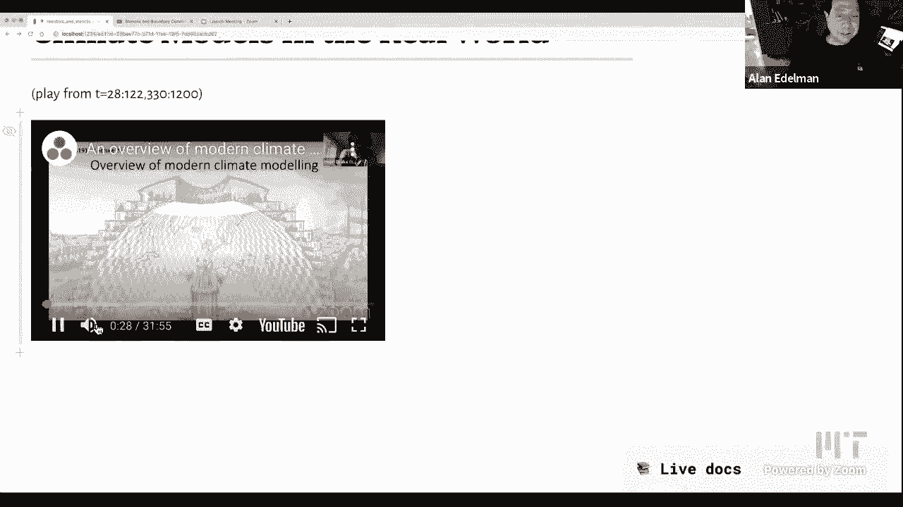

在Julia中实现模板运算时，需要处理边界问题。以下是几种常见的边界处理策略：

*   **忽略边界**：模板窗口可以滑出数据边界，通常只计算内部点。
*   **固定边界**：假设边界外的值为某个常数（如0）。
*   **周期边界**：假设数据在边界处是周期重复的，上边界之外取用下边界的数据，左边界之外取用右边界的数据。
*   **零通量边界**：在物理模拟中常用，意味着边界没有物质或热量通过。这可以通过设置“幽灵细胞”来实现，使边界上的梯度为零。

在代码中，我们可以利用Julia的两个特性来优雅地实现模板运算：
1.  **笛卡尔索引**：`CartesianIndex` 允许我们用一个变量来表示多维索引（如 `CartesianIndex(2,3)`），方便在循环中统一处理。
2.  **偏移数组**：`OffsetArray` 允许数组的索引不从1开始，例如可以从0开始，这便于实现以当前点为中心的模板窗口。

核心代码逻辑是遍历每个内部网格点，收集其邻居窗口的值，与模板权重进行点乘求和：
```julia
# 假设 `data` 是输入数组，`stencil` 是模板权重矩阵，`neighborhood` 是相对索引集合
for I in interior_indices
    window = [data[I + offset] for offset in neighborhood]
    result[I] = sum(window .* stencil)
end
```
通过使用偏移数组预先填充边界外的“幽灵细胞”，我们可以使上述循环代码简洁且无需额外的边界判断，因为所有必要的索引访问都是合法的。

---

## 迈向气候模型：二维平流-扩散方程 🌊

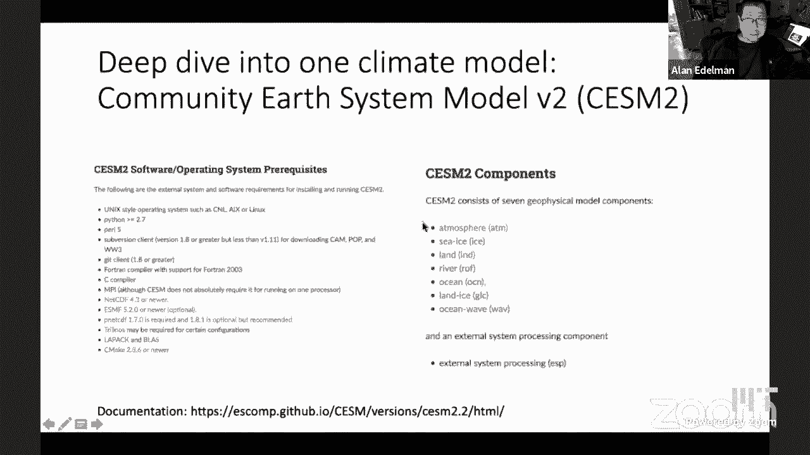

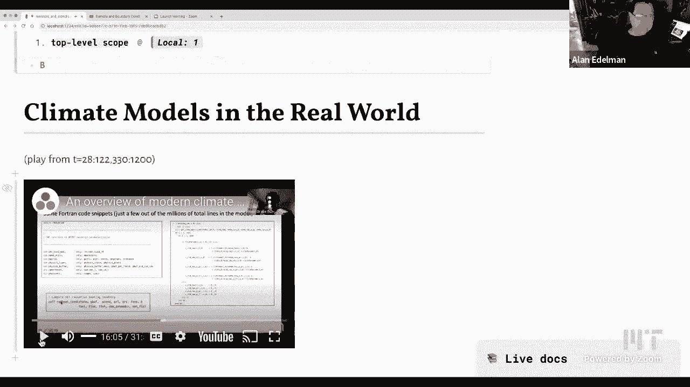

上一节我们学习了在网格上应用模板的通用技术，本节中我们来看看如何将这些技术应用于一个更复杂、更接近现实的问题：模拟海洋中的热量传输，这是气候模型的核心组件之一。

海洋热量传输主要由两个物理过程驱动：
1.  **平流**：海水流动（如洋流）将热量从一个地方携带到另一个地方。
2.  **扩散**：热量从高温区域向低温区域自然扩散。

描述这个过程的连续方程是二维**平流-扩散方程**：
`∂T/∂t = - (u * ∂T/∂x + v * ∂T/∂y) + κ * (∂²T/∂x² + ∂²T/∂y²)`
其中：
*   `T(x, y, t)` 是温度场。
*   `u(x, y)` 和 `v(x, y)` 是流速场的x和y方向分量。
*   `κ` 是热扩散系数。
*   `- (u * ∂T/∂x + v * ∂T/∂y)` 是平流项。
*   `κ * ∇²T` 是扩散项（拉普拉斯算子）。

为了在计算机上求解，我们需要将方程离散化。这涉及到用有限差分来近似所有的偏导数：
*   一阶导数（平流项）可以用中心差分近似：`∂T/∂x ≈ (T[i+1, j] - T[i-1, j]) / (2Δx)`
*   二阶导数（扩散项）就是我们熟悉的离散拉普拉斯模板：`∇²T ≈ (T[i+1,j] + T[i-1,j] + T[i,j+1] + T[i,j-1] - 4T[i,j]) / Δx²` （假设 Δx = Δy）

对于**边界条件**，在海洋模型中，海岸线通常被视为“无通量”边界，即没有热量或海水穿过。这可以通过设置“幽灵细胞”的值，使得边界处的法向梯度为零来实现。例如，在左边界，我们可以设置幽灵细胞的值等于其右侧第一个内部细胞的值。

在编程实现时，良好的软件工程实践是使用**抽象**。我们可以定义不同的类型来封装不同层次的信息：
```julia
struct Grid
    nx::Int
    ny::Int
    Δx::Float64
    Δy::Float64
    x::Vector{Float64}
    y::Vector{Float64}
end

struct OceanModel
    grid::Grid
    u::Matrix{Float64}  # x方向流速场
    v::Matrix{Float64}  # y方向流速场
    κ::Float64
end
```
这样，主模拟循环可以清晰且模块化。我们可以轻松更换不同的流速场（例如单涡旋场或双涡旋场），而无需重写核心计算逻辑。通过时间步进迭代更新温度场 `T`，我们就能模拟出热量在海洋中随洋流平流和扩散的动态过程，如上图所示。

---

## 总结 🎯

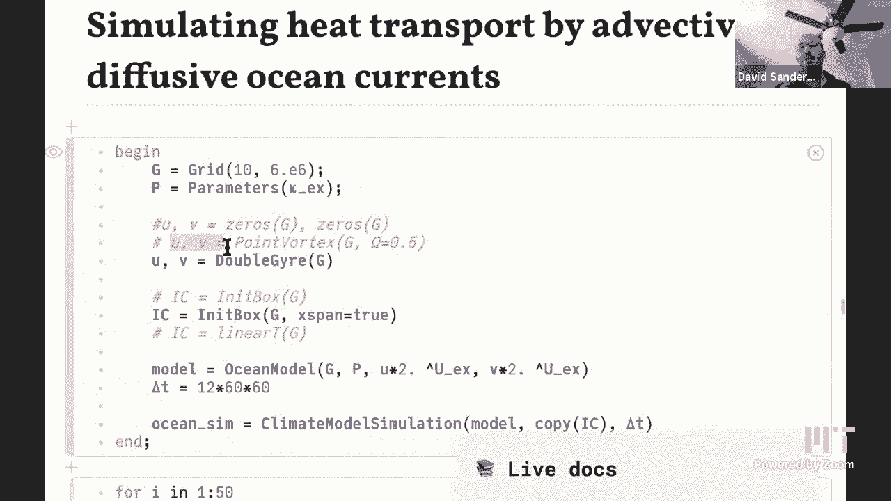

本节课中我们一起学习了：
1.  **离散与连续的联系**：通过分析电阻网络，我们推导出离散拉普拉斯算子，并展示了它在网格细化时如何逼近连续的泊松方程 `∇²f = g`。
2.  **数值模板的实现**：我们探讨了如何在代码中使用模板（Stencil）来应用拉普拉斯等算子，并讨论了处理计算边界的多种策略。
3.  **气候模型基础**：我们将概念扩展到二维平流-扩散方程，学习了如何离散化并模拟海洋热量传输这一气候科学中的关键过程，并强调了通过抽象（定义`Grid`、`OceanModel`等类型）来构建清晰、可维护的科学代码的重要性。

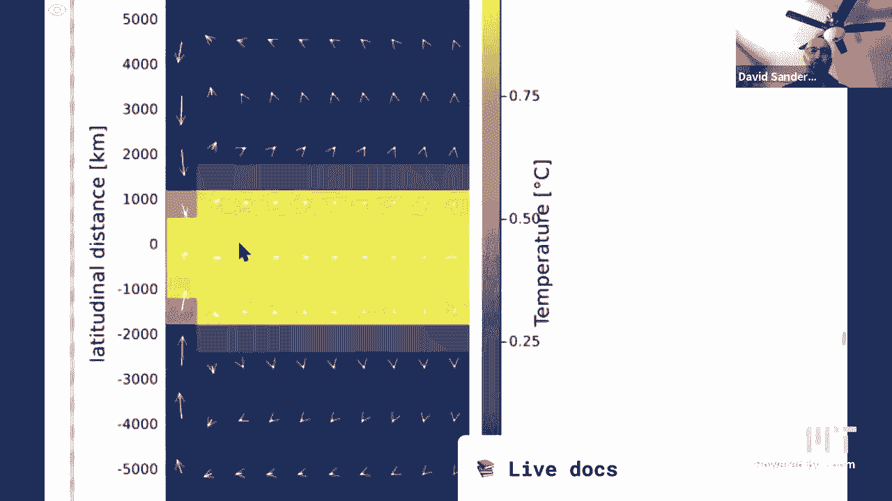

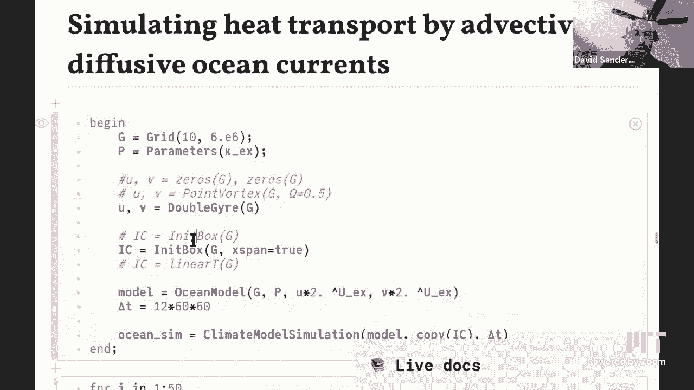

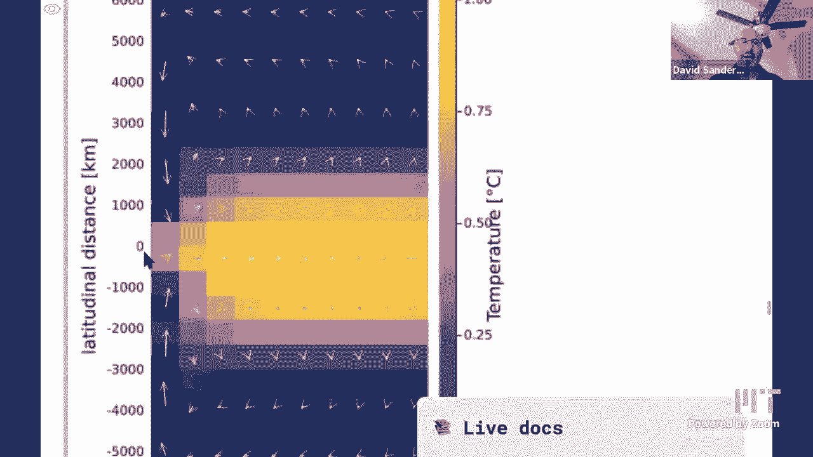

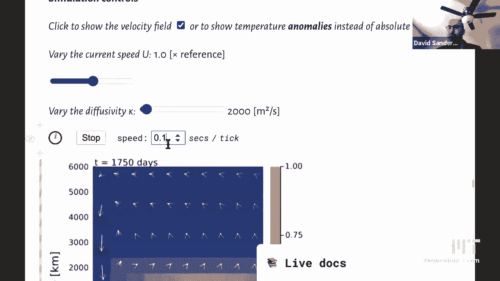

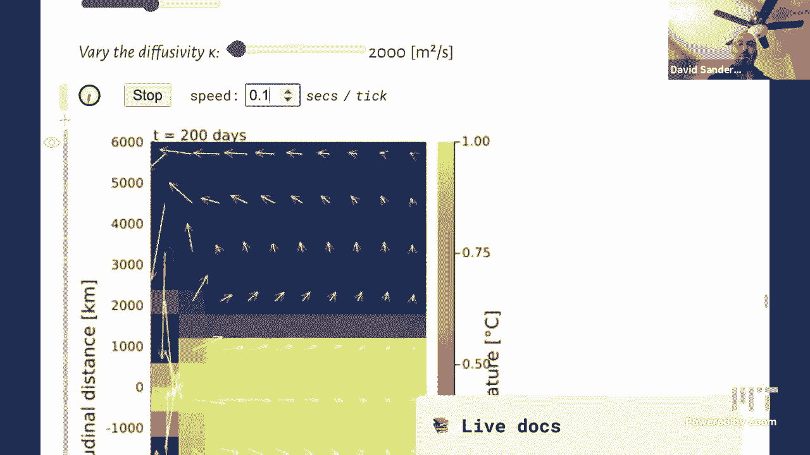

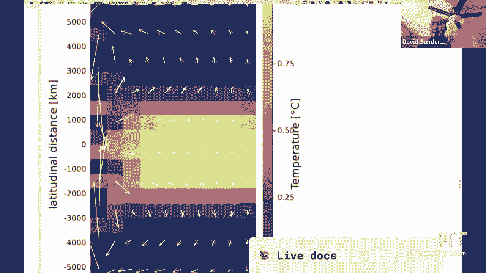

这些内容构成了从具体物理问题到抽象数学方程，再到实际计算机模拟的完整链条，是计算思维在科学计算领域的典型体现。