# 计算思维导论：L25：气候变化建模 🌍

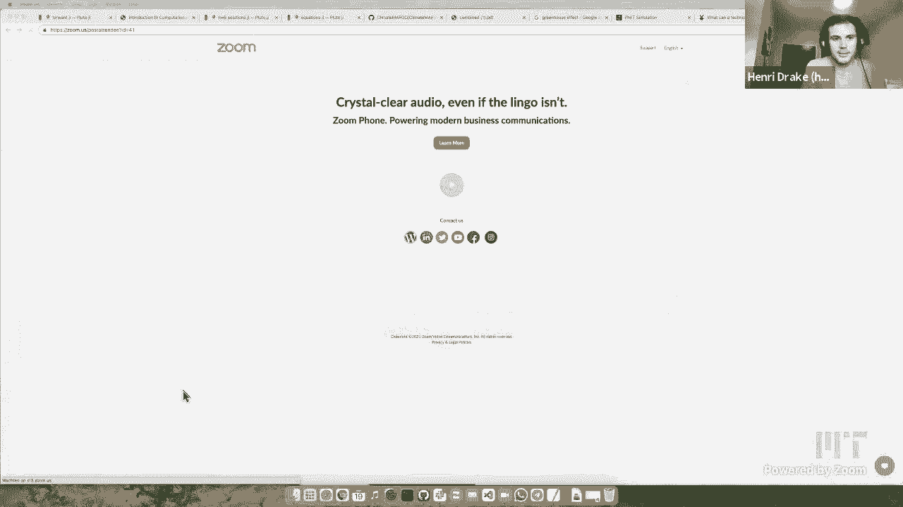

在本节课中，我们将学习如何使用简化的气候模型来理解和应对气候变化问题。我们将重点介绍一个名为MARGOT的模型，它整合了减缓、移除、地球工程和适应四种技术，并通过优化算法来寻找平衡气候目标与经济成本的最佳策略。

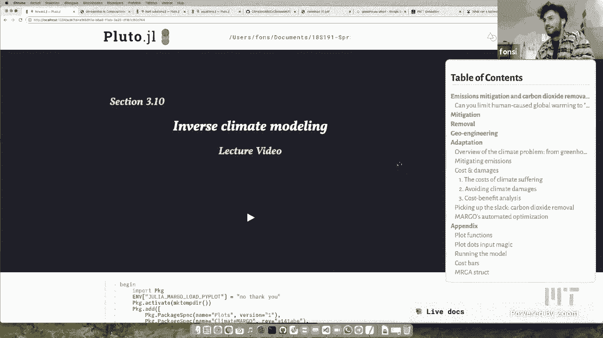

---

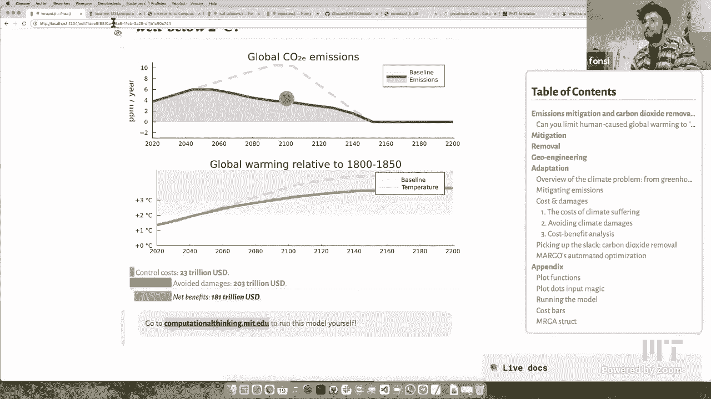

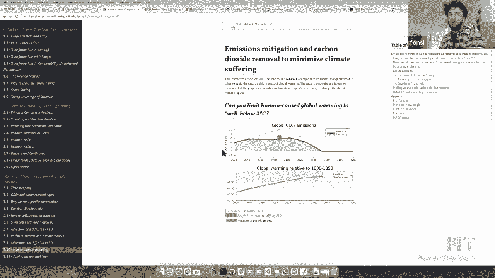

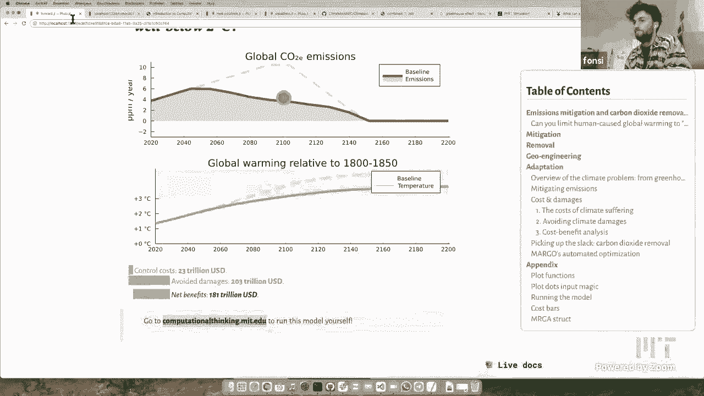

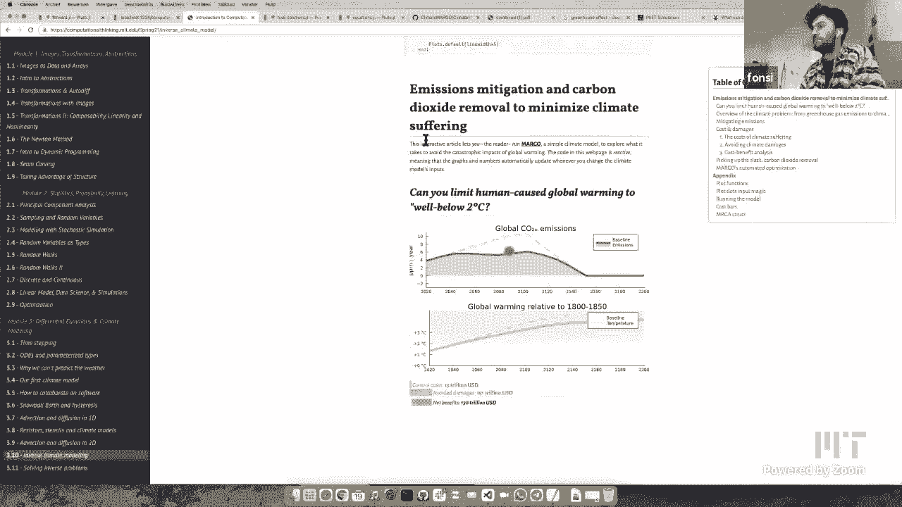

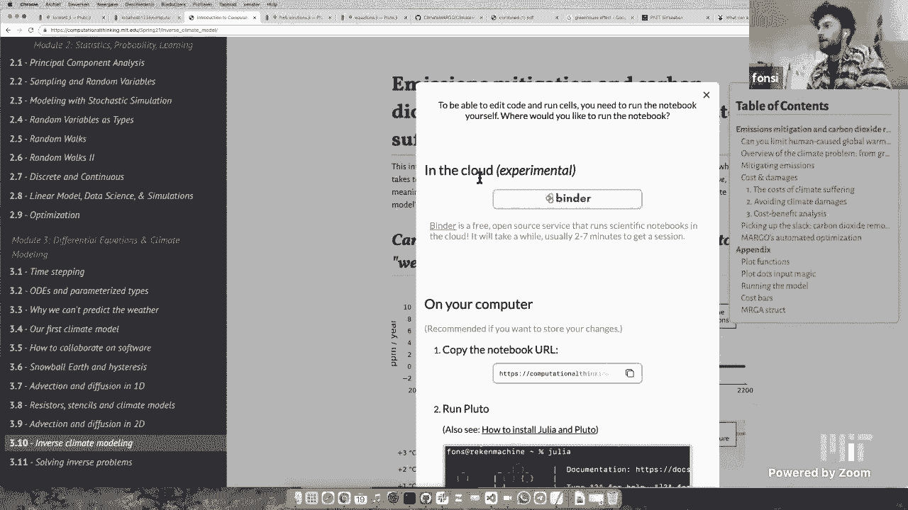

## 模型概述与动机

气候变化是我们这个时代面临的重大挑战。本节课介绍的MARGOT模型旨在将复杂的气候问题简化为一个核心、可解释且开源的模型。该模型不仅包含物理气候过程，还整合了经济学和行为响应因素。

MARGOT代表减缓、适应、移除和地球工程优化。其核心思想是将所有关键要素浓缩到一个小型、可解释的模型中，并用Julia语言编写，以便于交互和探索。

如果你在观看视频，可以访问课程网站 `computationalthinking.mit.edu`，在那里你可以看到我屏幕上的所有可视化内容，并亲自与气候模型进行交互，甚至修改代码。

---

## MARGOT模型的核心组件

上一节我们介绍了MARGOT模型的整体目标，本节中我们来看看构成这个模型的四个核心技术。

MARGOT模型主要包含四种应对气候变化的技术：

1.  **减缓**：减少温室气体排放。在模型中，这通过一个控制变量 **m**（范围从0到1）来实现，从总排放量 **Q** 中减去 **m * Q**。若 **m = 1**，则表示完全停止排放。
    ```julia
    mitigated_emissions = Q - m * Q
    ```

2.  **移除**：从大气中吸收二氧化碳。这可以通过植树等自然方式或直接空气捕获等工程方式实现。该操作会减少大气中的碳存量。

3.  **地球工程**：改变地球的反射率。例如，向平流层注入微小颗粒以反射阳光，从而为地球降温。这是一种不完美的抵消方法。

4.  **适应**：调整社会系统以应对已发生的气候变化影响，例如建造海堤或安装空调。这需要付出成本，但可以减少损失。

所有这些控制措施都会产生成本。模型的目标是在减少气候变化损害和避免过度控制成本之间找到最佳平衡。

---

## 运行模型与初步分析

了解了模型的基本构成后，我们现在可以运行它，并观察不同策略如何影响结果。

在基准情景下，如果不采取任何气候政策，二氧化碳排放将持续增加，导致全球温度上升。例如，将模型中的减缓控制滑块向右移动，意味着我们减少排放，这将直接导致未来温度上升幅度降低。

然而，完全依靠减缓来实现将温升控制在2°C以内的目标（如《巴黎协定》所要求的），可能需要非常激进的措施。这时，我们可以引入第二种技术：碳移除。

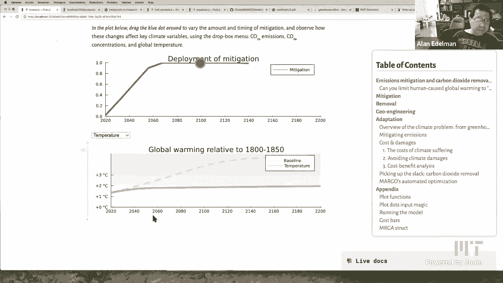

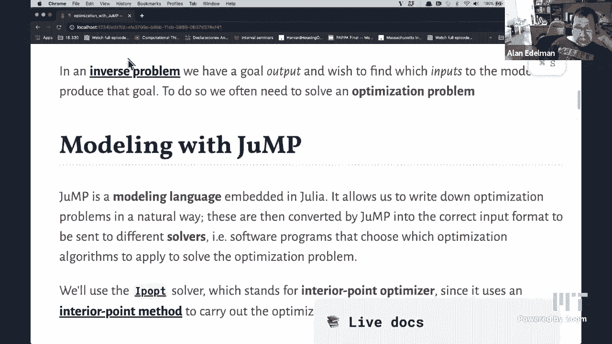

通过同时调整减缓和移除，我们开始面临一个有趣的优化问题：哪种组合能以最低成本实现气候目标？因为减缓和移除都有其各自的成本曲线。

---

## 使用JuMP进行优化

前面我们看到，手动调整策略来寻找最佳组合是困难的。因此，我们需要借助数学优化。在Julia中，我们使用一个名为JuMP的领域特定语言来表述和解决优化问题。

JuMP允许我们以接近数学公式的方式描述问题。例如，假设我们有一个需要最小化的成本函数 `cost(x)`，并带有变量 `x` 的约束。

```julia
using JuMP, Ipopt

model = Model(Ipopt.Optimizer) # 创建模型，使用Ipopt求解器
@variable(model, -10 <= x <= 10) # 定义变量x及其范围
@NLobjective(model, Min, x^2 + 2) # 定义需要最小化的非线性目标函数
optimize!(model) # 运行优化
value(x) # 获取最优解下x的值
```

在这个简单例子中，我们寻找函数 `f(x) = x^2 + 2` 在 `x` 属于 `[-10, 10]` 区间内的最小值。优化器会快速找到 `x = 0` 时取得最小值 `2`。

对于MARGOT模型，优化问题则复杂得多。我们需要优化的变量是随时间变化的减缓和移除策略曲线，维度高达40维（例如，每10年一个值，共200年）。约束条件包括温度不能超过2°C，以及控制变量每年的变化幅度有上限等。JuMP能够高效地处理这类大规模、带约束的非线性优化问题。

---

## 探索最优策略与敏感性分析

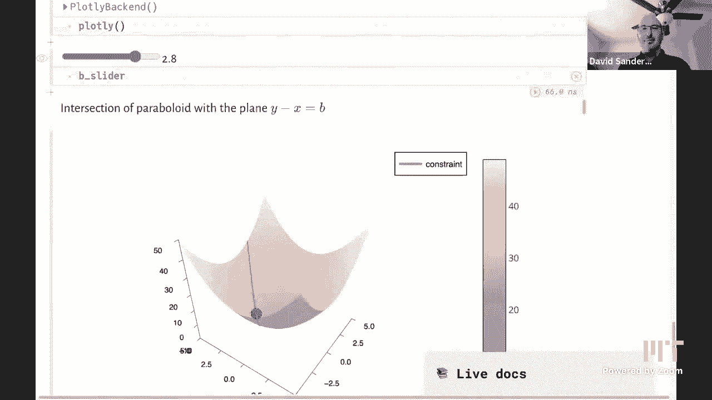

通过JuMP进行优化后，MARGOT模型可以为我们计算出满足特定温升目标（如2°C）的最优政策组合。结果通常显示，最优路径包含前期积极的减缓和后期逐步增加的碳移除。

模型的一个强大之处在于可以进行敏感性分析。我们可以改变模型的关键假设，观察最优策略如何随之变化：

*   **气候敏感性**：改变“气候敏感性”参数（即CO2浓度翻倍导致的温升），会影响所需的政策强度。
*   **经济贴现率**：这个参数反映了我们对未来收益与当前成本的重视程度。贴现率越高，意味着越不关心未来，模型可能更倾向于依赖“创可贴”式的地球工程或未来移除技术，而非当下的深度减排。
*   **技术成本假设**：如果未来减缓技术成本预期会下降，最优策略可能会包含更多的减缓措施。

这种分析有助于我们理解，最优气候政策并非固定不变，它强烈依赖于我们对科学和经济的底层假设与价值判断。

---

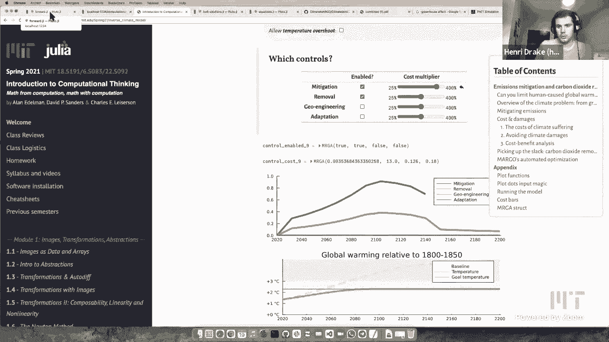

## 总结与行动建议

本节课中，我们一起学习了如何使用简化的集成评估模型MARGOT来理解和规划气候应对策略。我们看到了减缓、移除、地球工程和适应四种技术的作用，并了解了如何利用JuMP优化包在复杂的约束条件下（如2°C温升目标）寻找成本效益最高的政策路径。

最后，对于有兴趣投身气候领域的同学，建议可以从参与开源气候项目（如MARGOT本身）或加入专注于气候解决方案的初创公司开始，在能源系统、可持续农业等多个方向寻找机会。

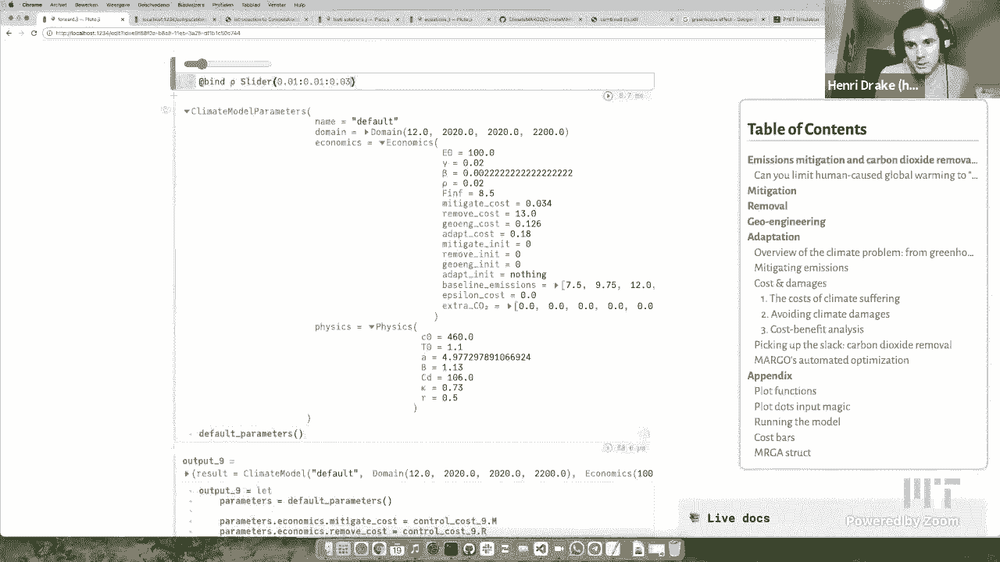

气候变化是每个人的问题，而计算思维和开源工具为我们提供了参与解决这一全球性挑战的途径。