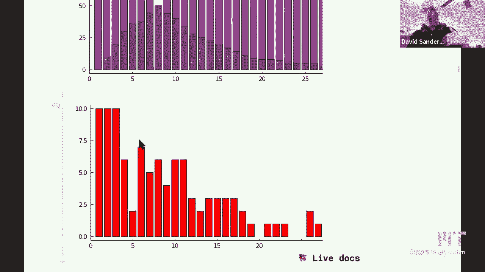
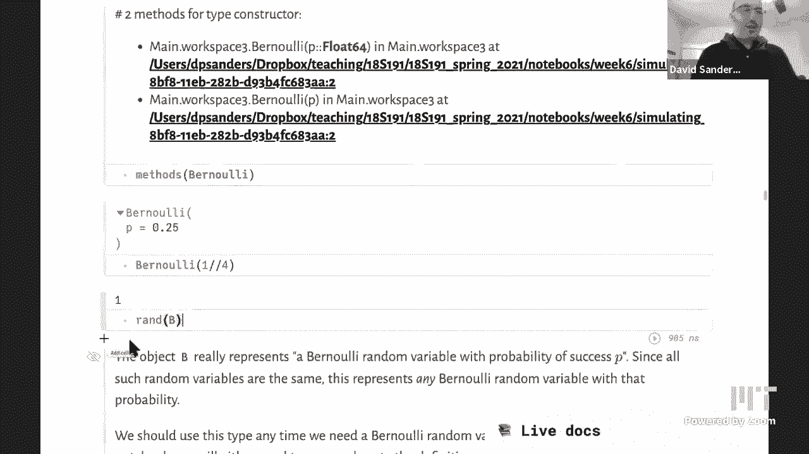

# 【双语字幕+资料下载】MIT 18.S191 ｜ 计算机思维导论-Julia(2021最新·完整版) - P10：L10- 随机模拟建模 - ShowMeAI - BV19g411G7ab

hi everybody uh welcome back to，6soa318 s191 computational thinking with，julia in spring。

2021 so today，we're going to so we're in the，probability module probability，statistics data science。

today we're going to look at how we can，use probability，to make a model of a。

process of something that is changing in，time，and so basically what we want to，simulate。

is a sort of the simplest model where we，have，individual objects that do something and。

they do something as time goes on and so，what we're going to look at is。

a model for failure of mechanical，components，or failure of light bulbs so we have。

light bulbs that are on，and then they're going to switch off at，some time and we want to model。

that process so some，pieces of julia that we're going to see，today are。

how we can take a function that，it is in some package which is not base。

and extend that so how we can define new，methods on that function that operate on。

new types that we define，we've already seen how to do that with，uh functions from。

base julia which is this sort of，basic basic library that julia always，provides。

and now we're going to see how to do，that from another package which actually，looks just the same。

and uh so we're also going to think，again about why we would actually want。

to create a new type at all，what does that actually model in the，system。

uh and sort of two little details we'll，see how we can plot，shapes with julia and um something about。

string interpolation，okay so what are we gonna do let's just，jump straight in。

some，number of light bulbs and green is going，to mean that the，light bulbs are working correctly and。

then，at every time step each light bulb。

is going to fail with some probability，and so right now that probability。

is uh so i can change that probability，with a slider p，right now 0。1 so at each time step each。

light bulb you know sort of has some，internal components，uh you know a filament in the case of。

old-fashioned light bulbs，and that has a probability that on each，day let's say。

that will actually fail and then the，light bulb light bulb light bulb will。

turn off and so what that looks like is，this and when i move to the next time，step um。

you see that these three light bulbs are，about to fail，and so we color them in red and we label。

that labeling them with the time at，which they actually fail。

so we start at time zero and at time one，which is sort of，on day one basically we look which light。

bulbs have failed，and so you know if you you put up sort，of decorations。

lights uh lights in these long chains，that people use for example，at christmas uh then。

you worry about when these light bulbs，will fail，okay so uh at the next time step the，ones that。

failed at the previous time step will，allow color in purple that means they're，actually。

sort of dead they actually don't work，anymore and at that same time step。

some more get colored in red because，those are failing at this，step and so again we we label uh the。

ones that have just failed，so we'll carry on doing that as time，goes on。

we'll just get um sorry i went backwards，and so forth，we'll go forwards in time and more and。

more light bulbs will fail，until you know uh let's jump ahead a bit，we see that in this particular。

simulation um，we have to wait a certain amount of time，and oh these these few。

are still alive when does the last one。

actually die and，it turned out that it died at time 38，this is。

an example of a computational thinking，experiment，we're just sort of running the。

simulation in some way that we'll，we'll discuss how to actually run the，simulation but if if you see。

this this happening or you you know if，you saw this in，an actual array of light bulbs you would。

start to ask yourself questions such as，you know if i fix my attention on one，particular light bulb。

how long might i expect that light bulb，to stay alive，or you could ask at time t how many。

light bulbs do i expect to fail at that，moment，uh and so you can you know you can start，just um。

immediately asking these kind of。

and there are some more questions that，we can can ask as well，uh which is well another sort of more。

difficult question which is well，light bulbs do not actually fail you，know just。

sort of once a day it's not that they，time，on this day you decide whether you fail。

or not so what would be a more realistic，model where，actually a light bulb can actually fail。

at any moment，in time how could we how could we model，that as well。

okay so hopefully if you think about it，you know using some of the techniques。

we've already seen you can，you can see how we can actually run the，simulation so you know。

we just sort of loop through all of，these light bulbs at each time step。

we look through the light bulbs and we，and each one is going to decide，do i fail with probability 0。

1 or do i，succeed with probability，uh do i do i stay alive basically with，probability。

1 minus 0。1 or 0。9，okay so that's um that's what we need to。

model so how can we actually do that，simulation so，so here's the kind of function that。

we're going to write and basically the，important part。

is that we need to have some，store some information so so this this，is just a picture。

you know a nice image of the array that，we're storing data into，and so this is literally a matrix in。

this case，that's just because of the visual，representation it's really just a。

collection of light bulbs，there's no there's you know there's no，information in the way that they're。

actually arranged in space in this，particular case you could imagine a case，where they're what。

where that mattered where you know，whether one light bulb fails depended on，the neighbors。

that's not the case here all of the，light bulbs are totally independent。

you know that what happens in the，neighboring light bulb does not affect。

and so we're storing in this，this matrix v starts off at all zeros。

so zero means that the light bulb is，still alive and then，when the light bulb dies at that moment。

we will store，the current time uh as you saw，in in the labels on that array and so，you know um。

hopefully you can write that function so，basically um，so if you know we have we generate our，p。

just like we did last time um using this，just generate a uniform random number。

between zero and one with this rand，parentheses，with nothing inside that that's what。

that does and we check，if that is less than p there's，probability of interest。

and if that event occurs and currently，it's in the zero state that means that，it's still alive。

then we set that that value to t，the current time and we're just updating。

t each time through this while loop，okay so that is um that is the very，simple。

dynamics of this model right so what i，mean by dynamics i mean something that，is changing in time。

so you know we have literally time，advancing and as time advances。

things happen and the light bulbs to，each of the states of each light bulb。

changes possibly with this probability，so this is actually what we call a，stochastic process。

so basically process just is another，word yet another word for evolution in，time or dynamics。

you know there's something as processing，as moving in time，and stochastic is just another word for。

probability，or probabilistic so it's i literally a，process that is changing in time using。

some probability，probabilistic elements okay and，these kinds of models are super common，know。

engineering economics finance sociology，etc，uh this is one of the most common models。

in a way and biology，this is uh one of the most common models，common types of models。

together with say differential equations，and we'll actually make the link。

between those two types of models you，can often relate those two models。

so you know for example you could think，of a，system of a chemical reaction where you，have so if。

you think of a chemical reaction you can，think of that as at the level of i'm，looking at a beaker。

with chemicals in from a long way away，and what i want to know is what is the。

total concentration of the chemical，you know number chemical called a and a。

chemical could be on the species and，species b，inside their speaker of chemicals and。

how do they change in time，that's what we could call a macroscopic，picture of the。

of the system but we could also，zoom in and look at the individual。

molecules of type a and the individual，molecules of type b，which are moving around in space and。

when they meet they might interact and，they might react with some probability，and change into。

you know type c for example and so we，have the sort of，duality between whether you want to do。

this microscopic，or description where you model each，molecule moving around。

that's what we're calling an individual，based model or an agent-based model。

but you but you might want to model it，at the level of the total system。

and just look at the total number of，molecules in each state，which is a macroscopic model and we。

is sort of，the goal of statistical statistical，mechanics，which is actually what we're going to do。

here in this very simple model right so，this is this sort of simplest possible，stochastic process。

because each individual is totally，independent of all the other ones and it。

just has two possible states on and off。

and it just is changing in time in this，very simple way。

okay hopefully it's clear what the model，is and how we can actually simulate it。

so yeah just a comment so how do we draw。

these nice circles on these squares，in julia so um。

what you need to do is actually you know，if you think about how，plots works the plots。

jl package or may，actually most plotting packages what you，would need to specify。

are the coordinates of the points that，you want to draw the points that。

you want to join and in plots。jl usually，what you do is specify the x coordinates，of the points。

in one collection and one vector and the，y coordinates of the same points in a，separate vector。

there are other ways to do it but that's，a common way to do it，and so what we want to do for example。

for a square，or a rectangle we just need four，coordinates so we would have a list a，vector of four。

x coordinates and a fixture of four y，coordinates，for a circle we would actually have to。

generate all of these，points around the circle generate their，and that's。

not so obvious how to do that but if you，think about it that's exactly what，trigonometry。

uh tells us how to do with cosines and，sine so the x coordinate，around the circle is going to be the。

radius times cosine of theta the angle，and the y coordinate will be r times。

sine of theta so that's what we've，just made two little functions here i。

think there are similar functions，already defined in plots，dot jl but it's easy enough to make your。

own function so let's make a rectangle，with width w height h and located at。

position x comma y so you could either，think of x comma y as being the center，of the rectangle or。

one corner of the rectangle and here，we're actually we chose to do one corner，of the rectangle。

and so you know we have the，these are the x coordinates whichever x，you started with plus。

zero w w or zero as you move around，in order of course it has to be ordered，the four coordinates of。

the rectangle and here are the same for，the y coordinates，just um adding them in a slightly。

different order，as you move around this square and，similarly for a circle。

with radius r now centered at x and y，we're going to take theta as the range，from 0。

to 2 pi so well we're using this，lin range function but these days you。

would just write range of 0 to 2 pi，with length 30 and then，um length equals 30 that's actually。

necessary to write length equals there a，keyword argument，and then uh so we're going to take x dot。

plus r dot，times cosine dot of theta so we're，taking you know each theta in this。

vector of features or this，not a vector it's a well there's an，abstract vector a range。

and then we're taking cosine of that，multiplying it by r and adding the x，and similarly for y okay。

so that's uh so then those generate the，x and y coordinates of these shapes and。

then how do we get the actual filled in，shapes，it's very easy we just put fill equals，true。

and for example i could um as a keyword，here，i'm just plotting this rectangle object，so。

uh this rectangle object gives me back，the two，vectors the x and y vectors and that's。

what you pass into this plot。

command and then similarly for the，circle that gives me back the x and y，vectors for the circle。

at you know wherever um it is，and then to get these labels these。

numbers，uh i actually use this annotate bang，function，in plots and uh so there i specify the x。

coordinate and the y coordinate，and then the text that i want to write，and so here i'm。

interpolating so this is string，interpolation that i was mentioning。

so i don't think we've explicitly，mentioned that before so basically，how do you。

interpolate what does that even mean it，means i want to，put inside that string so this。

annotation needs a string，but i want to put something inside the，string which is the value of this。

variable，the ijth coordinate of this of this，variable this matrix called simulation。

and so i do dollars that is this，in what sort of operator which puts in，the value of this string。

of this variable sorry inside the string，and dollars with parentheses。

uh whatever is inside the parentheses is，just julia code，but it will be executed and the result。

of that code will actually be，put inside this frame and then i can，specify the font size。

i don't even need the word font there i，just put the size seven，and um i give a color and that will。

if i，change this to green it will it will，give me green labels etc。

and finally i can put phil equals true，but i can，and this alpha equals 0。5 is not，actually doing。

anything there so i need fill alpha and，then i get。

a sort of transparent fill here in。

okay，i'm not sure what's going on there i。

oh i did the wrong one sorry ah this is，the circle，still alpha equals true should give me a，sort of。

okay that's not what i was expecting，so maybe it's just alpha then，alpha equals 0。

5 gives me a sort of uh，transparent，thing for。

to draw nice plots okay，so you can see that you know um if，you're thinking of wanting to。

oh yeah somebody is asking uh when，trying to open a jl file this simple，simulation。

jl could not be loaded，please report this error i'm not，actually sure what that is about but。

that's actually the wrong，uh the wrong notebook we're not using。

simple simulation we're using simulating，component failure，hopefully that one will work okay。

so yeah what i was saying was uh，when you want to you know draw a figure，for you know what。

i don't know some a paper or a you know，what we call it an essay that you're，writing for a class。

you might think of going to a tool like，illustrator or，inkscape uh where you sort of man or。

even powerpoint where you manually，draw your lines and disks and things you。

can sort of manually resize them，but this is now giving us a pretty，powerful tool where we can。

programmatically sort of specify exactly，the coordinates，of uh the objects that we want to place。

and how we want to place them on which，color，and we have much more control you can do。

loops much more easily because we have。

an actual programming language right so，of course it's always quicker quicker。

and easier to to drag a few，few circles if there's just a few of。

them but if you want to do something，like this，you know it will look worse in。

powerpoint actually because。

it will be harder to line everything up，properly etc，okay that's a challenge for powerpoint。

what，what do we want to do so the first thing。

we might think of doing is just let's，count up，green。

red and purple at each time step just，excuse me so let's just count them up。

right so we have three different colors，so we want three different plots。

so here are those plots so how can we，get those we just literally count you，know the number that。

so it's slightly difficult because the，uh，the data that we're storing uh we're，just storing this。

final number when they finally turn，purple and so we have to distinguish。

the different colors by sort of what，information is stored in this。

matrix so you can think about how to do，that and then you know the answer is，sort of in the code。

or an answer a way of doing it，or you could store different information。

for example you could store separately，each copy of the matrix，as time goes on you can store all of。

those matrices in an array and that，might actually make it easier to。

calculate or you could actually as you，do the simulation，you could store the information about。

the total numbers of，uh each type you know in some variables，as you go along。

so there are lots of ways of doing it，but they're all kind of right and that，all。

may be easier or harder in different，circumstances anyway so let's plot the。

numbers，of each of these things so first of all，let's plot the number of purples。

as time goes on and i'm just going to。

add you know more time，there and so there we go so this is time，on the horizontal axis so by time 27。

this，is uh let's just make it ten by ten。

uh to make it easier to，remember that there are now going to be。

out 100 of these，um things like bulbs。

there we go and so out of those 100 by，time 27 we can see that。

most of them have already failed and，then here's，the green on top of that same curve。

here's the greens which are the number，which are still，alive right so we start with 100 alive。

and we see that this is exactly，complementary。

to the number that have failed of course，so um。

and then the number which at each time，step，our uh failing let's say。

is this this curve here and so you can，see that，these curves actually look quite nice。

and smooth whereas this curve，looks pretty uh noisy so why is that is，basically because。

this curve is sort of the this data is。

basically some kind of difference，of this data here or this data here is。

basically the integral of us the，cumulative sums，of of this data and that operation。

taking the integral，of a cumulative sum smooths out noise，in the data right so how can i get。

better data well i could either。

take a bigger system or i could actually。

average over different simulations，okay so you can see that this is really。

you know i really have time moving on，and i have some process，going on it's random or stochastic or。

probabilistic and so，this is sort of the picture of what a，stick a。

an example of a stochastic process looks。

okay so i already talked about string，interpolation here's a nice，um cute example so here is。

at this link uh is a an image of daniel，bernoulli so we are using。

bernoulli random variables which i'll，talk about again in a minute，and uh so we're just grabbing his。

picture from wikipedia or wikimedia，and then that's at this url right so，just。

it's just the address you know if i，paste that into chrome it'll just。

show me that image as a jpeg now what i，want to do is actually。

use that image in pluto and be able to，resize it interactively with this slider。

called bernoulli width，and so you can see that when i slide。

this here is the picture of bernoulli，and as i slide it the picture。

is actually changing size that's the，kind of cool effect that you can do with。

pluto so how are we doing that，so what we what we need to do is，actually use an html command。

so this string here is actually html，code and it turns out that you write，this sort of less than。

and then this img for image tag and you，need to close the tag over here。

and so i i it's it's similar to keyword，arguments in julia so you write the name。

of sort of the keyword argument，effectively so here we have，src which means source so whereas the。

source of my image is it's this url，but that url is a julia string and now。

i'm making another julia string so how，am i going to put that value of that url。

into this string i just，interpolated with dollars just like i，was just saying。

i really love this dynamic html it's，pretty fun，yeah right i can only imagine a lot of。

other fun things you might be able to do，with that，the fun。

most fun uh html uh tricks that you can，do in computer，so and then you have another uh argument。

which is width equals，and then we want to substitute in the。

value of this variable called bernoulli，which is a number now right so here i'm。

substituting a string into the string，here i'm substituting a number。

into a string it works just the same and，i get this new string and you can see。

if i just scroll along this new script，string that the current value of the，width here 250 has been。

interpolated correctly into this string。

and indeed the url this whole long thing，has also been interpolated。

and then finally i just convert that all，to an html object with this html。

constructed so there's also，the other thing you can do is something。

here's a strange piece of html that does，what's called a non-breaking no i didn't，mean that。

uh sorry uh what did i mean。

uh yeah so let's do，uh sort of，what was i gonna do yeah okay let's do。

three and then break and then four，so that makes this break makes a new。

line there if i if i don't put that i，just put a space it'll put them next to。

each other if i put the。

break it'll put them on a new line and，so this is a different。

so i could have written this as html of，the julia string three，break four this is taking this julia。

string and converting it into html but，instead of that i'm using what's called，a non-standard。

string literal where i put the eight，this html，of，this double quote and that um has the，same effect。

as this basically so this is the ver，this is quite common thing to do in july。

you can actually define your own，non-standard string literals that。

interpret the string in a different way，so here，it's interpreting this string as html is。

basically doing the same thing as this，dave how easy would it be。

to have a slider going from one to ten，and then you know call that，something um and then and then um。

put that number of breaks into the，screen，oh great great question yeah so uh。

let's bind something i didn't literally，do something that's fine，uh i'll say num breaks slider。

one to ten show value equals true，so what do we need to do we need。

lots of breaks so that's just going to，be，a julia string so，how can we do that so you could think of。

you know doing with a for loop for，example but there's actually something，called repeated。

string breaks let's say five times，there we go that will just copy the。

string five times so you could have，actually done that like this，the string break to the power five。

that actually does the same thing well，that's really cool，yeah so why does that do the same thing。

because in julia the way you do string，concatenation is，times so in other languages you use plus。

and julia use times and the reason that，it's not plus is because。

plus is usually reserved for operations，that are commutative，and that means that you can do them。

either way around right so a plus b，should be the same as b plus a but。

that's not the case with strings，and so we use times instead，because you know if you multiply two。

matrices for example，the order can often matters so times is，often a non-communicative operation。

whereas plus is always，that's the that's the logic you can，argue whether that's。

you know sensible or not okay and so，well if we're using times to concatenate。

two things then how do you concatenate，five things，like，writing a power and so that's where this。

logic comes from，so let's see it work yeah so then what i，want to do i want to take my。

string which is three and then i want to，substitute in，this sort of break to the power of five。

but that's just a piece of julia code，so i just put it inside these，parentheses and then four。

and then we get a nice big space but i，want i want num breaks，you want what oh number one yeah so。

so as i change num num breaks the the，width changes yeah nice example。

i just think that there's so many fun，things one could do now the limits the，imagination。

yeah i mean i usually think of html as，kind of static right and now all of a。

right so html in some sense is static，but once you mix，javascript into the mix you're actually。

able to script html and make it dynamic，and that's what javascript does it means。

javascript and you've got pluto and，julia，right so pluto and julia are using。

javascript to do this right that's the，point，but it's hidden from you it's sort of a。

nice interface to be able to use，javascript in in other ways okay。

so let's get back to the main story so，we have these light bulbs that are。

failing so what is the math behind that，it's these bernoulli random variables。

that we started talking about last time，so let's remember that a bernoulli，random variable。

what does that mean it it models a，weighted coin，so it takes the value one with。

probability p that's one or heads with，probability p，and zero with probability q uh which is。

one minus p，that's often called q and so the total，probability is one。

uh as it has to be for any probability，and we defined this function。

if i remember correctly i think we，defined that before bernoulli of p。

equals rand less than p so this is you，know true，if this random number between zero and，one uniform。

uh is less than p that happens with，probability p，and so that is generating an event true。

it generates the value true with，probability p，so you know if i just run it with 0。25，and i run it。

several times on average i should expect，to get true，once every four times on average but of。

course it might not happen，that you get it every four times it，might take 20 times。

20 20 throws before before you actually，and then down here i've just taken you，know a hundred。

flips of this weighted coin i'm，converting them to int，uh so i get a zero or a one out okay。

so what could we ask about this so what，again what is a random variable it's。

this sort of you know conceptually from，a computational computational thinking，point of view。

it's an object it's a something，which every time you run a simulation。

you so look at the value of this object，that comes out of the simulation and it，and it。

takes different values on those values，occur with some frequencies，and the uh frequencies are the，so。

what does it mean to take value one with，probability p means，in this limit when we take a large huge。

number of trials，uh approximately a fraction p of them a，proportion p，of them will be true and so。

what can we ask so if we have this kind，of sequence of，of results we can ask for example what。

is the mean，value that we get so this is just some，data now we're just thinking of this as。

some data that we sampled，or you know somebody gave me this data，from an experiment that they did。

on a real system you could just say well，i'm just going to do some data analysis，on this what could。

what's the first thing i do i calculate，the mean the average。

so what's the average value of this well，if you think about it。

you know you're just going to sum sum up，all of these values and then divide by，the number。

of them and so that should actually give，me approximately，p again right so the mean should be p。

and so if i literally take the mean of，this data uh here the stage is called。

flips i'm taking the mean of it it gives，which i，is the p i put in and if i keep running。

this every time i'll get a different，value，for the mean as you can see down here。

and so you know if you do this，if you think of this experiment as sort，of flipping 100 coins。

and calculating the mean that's actually，giving you a new，a new random variable actually now the。

random variable takes on，not it doesn't take on integer values，and now it takes on。

floating point values or or real values，and then you could ask for information。

about this object for example what is，its mean，and what is its standard deviation etc。

so that's an interesting question and um，we won't go into that right now but。

think about that or you know just do an，experiment，so generate some data for this new。

random variable and，calculate its mean and it's it's，variance so what do you notice what what。

is its distribution you can plot，probably histogram，et cetera okay。

and then you know exercise calculate the，variance of a bernoulli random variable，um analytically。

okay so so we already saw this，but okay let's think what is a bernoulli。

random variable it's some kind of，mathematical object that's pretty。

difficult to describe actually it's kind，of abstract it's，it's difficult to get your hands on what。

it is is it，a function where does it go from where，does it go to is that true i don't see。

it as difficult，my big problem just to be clear is i，never remember that。

bernoulli means like a coin that's going，to be，25 of the time heads like。

like i always just forget that it's，bernoulli means that，right like i almost feel like i need a。

little post-it next to my computer，bernoulli of p means that a heads will，come up with probability p。

yeah it could just be called coin flip，but it's just yeah weighted coin flip or。

point 25 would mean a lot more than，bernoulli than me i agree，yeah i was just on a you know on a。

the bernoulli family which was a crucial，and founding probability in the 70s。

i don't think jacob would care anymore，he might be right okay it's also，difficult to spell。

um okay so anyway，so what is this object called a，actually，really care what it is mathematically at。

least in this course，what we care is how do we represent it，computationally and so here what i'm。

doing is，just having a function that is returning，a random，value right but what if i wanted to now。

so we can calculate we know what the，mean of this bernoulli random variable，is。

analytically exactly and so we want a，way of sort of，telling the user or the computer that。

information，so we're going to start accumulating，information about。

this random this particular random，variable for example also there's，standard deviation and it's。

i don't know distribution function etc，and we want to associate all of that。

information with this one，with this one thing called a bernoulli，got a，sample mean of 0。

27 is that not the mean，that is a good point i could call out a，sample mean that's a good。

good good point let's pull that sample，mean，ah so sample mean of data，length and then sample mean。

of this data clips the sample mean，changes each time if i could take an，infinite sized um。

uh set of data then i would hope that，this sample mean gave me。

what's called the population mean or the，true mean，of the sort of underlying theoretical。

object which is going to be exactly this，value of p，that i put in yeah great point。

okay so anyway the point is i'm，accumulating all this information about。

a thing called a bernoulli random，variable so how could i actually。

encode that computationally and we've。

actually already seen the answer to that，and the answer is，make it into a type so make it a new。

type for this object，so let's actually make an object called，bernoulli uh so now。

maybe you would prefer to make it called。

weighted coin flip，but since we have to learn the word，bernoulli let's just call it。

so let's just put a remark weighted coin。

uh so we're going to have the weight，heads，which is p which will be offload 64 for，example。

and then what else what other，information do we have about a bernoulli，random variable。

the answer is we do not have any other，information about it that the entire，information。

lives in just that one number p，uh the entire sort of internal，information about it。

and then well that's not quite true but，uh what we will now want to do。

is actually define functions that act on，this object that will give。

us everything else right so we want to，be able to for example，sample from it in other words run the。

experiment run a newly random variable，and generate，what's called a random variate uh the。

outcome of an，of this experiment and the natural so，you might think oh i。

yeah so we already wrote the function to，little b。

so types in julia always start with，and um so what would be a suitable。

function to do that well we've actually，already seen a suitable function which。

is the rand function we saw a couple of，lectures ago，rand samples randomly from。

objects right so here we have an object，and i want to sample randomly from it。

but now random sampling from that object，will mean generating。

you know one with probability p and zero，with probability one minus p。

and so well we actually wanted to find。

our own version of rad，which we i don't think we actually did。

before，uh so how do we do that we're going to，extend，the rand function the rand function。

lives in julia's base，library this sort of library that has。

all the basic，functions inside and so we're literally，going to，write a new method a new function。

definition，a new version of this base got rand，function in other words rand that lives。

in the base library，and it's going to act on an object of，our new type and so we。

we write that with this type annotation，colon colon，and this bernoulli type right that we。

just defined，and what does it do it does the same，thing as we did before it just generates。

a random number uniformly between 0 and，1 and checks is that less than p。

but now the p that i'm interested in is，the p that belongs，to this bernoulli random variable that。

i'm passing in and so，i use x dot p to select that value of p，from inside that object and then i'm。

converting it to a hint，so i'm could you i'm always confused。

between capitalism small letters you did，and，yeah um i mean i've certainly looked at。

student homeworks and i see names，sometimes with capital letters。

what is the julia convention where how，do you do it，in julia the convention is。

functions start with small letters。

lowercase and types，start with uppercase what about variable，names，functions and variable names but。

that's possible well you've got a，uh good point i think i think the，convention，is typically um。

that actually um that that one letter。

names or maybe small names might be，capital right so i put what。

the ones that look like words or small，letters i think，i right i i put a capital because。

mathematically you would often use a，capital letter for a right。

like for a matrix i would use a capital，a or capital m，or true yeah okay so。

maybe with an exception for，one variable or one letter，okay thanks okay so。

let's let's make an object of our type，and so，that's using this constructor function。

that julia makes automatically，so if i do methods of bernoulli we see，that。

julia automatically created two okay，it's a bit annoying to read but。

two versions of a function with the same，name as the type，one of them takes in a p which is of。

type float64 and the other type，types in takes in a type uh so it takes。

in a variable p，which is of any type and tries to，convert it to float64 actually。

and um so i pass in this this thing，so so that conversion for example uh，could happen if i passed in。

the rational number one quarter that，will it will。

sorry i can't call it b let's not call，it anything，bernoulli of one quarter it will convert。

this rational number into a float。

that's what this second constructor does，okay，is，a bernoulli random variable an abstract，thing。

a sort of a mathematically abstract，thing and now i want to。

do something to it which is uh i want to，generate randomness from it so i just，literally call。

rand of b so we've defined a new，version a new method for this rand。

function which acts on this bernoulli，random variable and it should generate。

what is it supposed to do is supposed to，generate ones，with probability 0。25 and zeros with。

probability 0。75 so what i just when i，call this again and again。

i should see a one again approximately。

one quarter or one fourth of the time。

know，implemented ran for a new object in a。

sensible way which is uh in my opinion，pretty cool。

okay and so um what else can we do，we want to define the mean now this。

means the sort of true population mean，uh of a random bernoulli random variable。

and it turns out that the mean function，actually lives in the statistics package。

not in base so the statistics is，actually a standard library，package or standard library that。

comes with any solution installation of，julia but you have to explicitly do，using statistics，that。

are defined inside that package but we，already did using statistics at the very。

top of the notebook so if i do it try，and do it again here it will it will，complain。

right and it says multiple definitions，for statistics that's not allowed so i'm。

just going to delete this version of。

using statistics i'm going to use the，previous one，okay and now yeah okay there we go。

so what is the mean of a bernoulli，random variable it's just the p。

that belongs to that random variable and，so when i do mean of v，it actually does give me 0。25。

so later on we'll define another kind of，random variable and the next。

lecture or in a future lecture we'll，actually extend，what we're doing here in a interesting，way。

okay so now what can what do we want to，do，so we saw this uh random。

version of a sort of what looks like，some kind of decay this is the number of。

light bulbs remember that are switching，off or are failing，sorry at each time step so the time is。

on the x-axis the number is on the，y-axis，and uh so as you go along fewer and。

fewer fail but that's because there are，already fewer and fewer light bulbs that。

could fail because，all the other ones have already failed。

and so we want to model that um，you know and understand what's going on。

so the first thing we can do is just，literally run the simulation。

several times right so here are two runs，of the simulation and what we're seeing。

and sorry that's not，the right y label anymore number of，uh sort of light bulbs which are still。

number of light bulbs that，are alive so，uh we it said number of infectious，because as i think i。

mentioned this ulster's process or also，mentioned，also models what happens if you have n。

individuals which，start off being sick and at each time，step you have a probability to recover。

it also models radioactive decay what，happens if you have n nuclei that are，radioactive。

and at each time step each one has a，probability to，to recover to to decay sorry to decay。

and become unradioactive，neutrons or something okay，also alpha confidence i guess。

so let me just run this simulation over，and over again right so every time i，call this，you know。

um so we're running a simulation of a，physical system，so we're simulating you know this is a。

stochastic simulation，uh what a simulation means it mean it，means，that we are sort of reproducing。

something from the world in a simplified，version inside the computer。

and so you know this is like uh you have，each of these represents。

different factories which have their own，running，this you know you're looking at what。

happens in each of those factories，so as i run the simulation again and。

again we we see sort of the results from，different factories，so now let's put all of those together。

on one graph and here so here we have，so each again each time i run the。

simulation it will give me a different，plot，oh no it won't oh sorry no i have to run。

this again and again，and that's where i'm generating the data，and then here i'm just plotting it so。

when i run this again and again and i，plot all those different，curves for each different factory you。

can see that okay the，the sort of shape is changing as we're，moving around a bit but。

roughly it's doing the same thing and so，if you look at this curve what's the。

immediate first reaction that you would，you would think of what what do you want。

what do you want to do with this data so，once again probably what you would say，is well。

you know each time i run it it's sort of，doing roughly the same thing so the。

first thing i would probably think of is，taking a mean again。

right so if you fix your retention at 25，for example t equals 25，you could just say well what's the。

average value right there，it's something like here then at 50 is，same，happens。

is this so here is the same data again，but now at each time at each time step。

i took the mean of all of the，simulations at that time，so this is interesting because this is。

which is，i have functions i have like random，functions that behave in a certain way。

and i'm taking the mean，not of data points but i'm actually，taking the mean of those random。

functions if you like，so how do you take the mean of some，functions you just add up the functions。

and divide by the number of functions，this is exactly the same formula you can。

even write it in exactly the same way in，julia，okay so now if i if i。

okay so the mean is not everything of，course there's also，how much i vary away from the mean how。

much is the spread，right at for example again time 25 it's，and，i want to know well how far away from。

the mean might i be，and in other words in other words i want，some kind of variance or standard。

deviation of the data at time 25，and again i could do the same thing all，along and i could get the。

standard deviation as a function of time，uh and so you know it's basically what。

we did last time the same ideas but now，you're doing the same thing at each time，step。

in the stochastic process okay but if we，just focus attention on the mean for now。

what do we notice about this this，function this，red curve well it actually looks pretty，smooth now。

right so i've kind of averaged out all，of the randomness，and i get something that actually sort。

really，yeah maybe there's a bit of still a blip，here，but basically it looks pretty smooth and。

non-random，so not something that's non-random or，not random is called deterministic。

so it looks like maybe there is，a way that we could forget about all，this randomness and。

just look at this sort of deterministic，thing，okay so and by the way if we plot it on。

a semi log graph so we take a，logarithmic scale in the y direction。

we see that basically it's a straight，line on that semi-log graph。

and that is evidence that maybe this，thing is decaying so you could ask how，fast is this decaying。

if it's a straight line on a semi-graph，that means it's decaying，exponentially fast so there's some。

exponential function basically the，number still functioning at time t。

is something like e to the minus some，constant times，t with some other constant multiplying，it so c。

times exponential of minus lambda t for，some lambda，okay so can we actually understand that。

so we want，uh to study the time evolution of the，mean actually right so。

at each time at time t we want to take，the mean and i，uh have an issue with my notation i。

thought we fixed that，but apparently not so this i t is just，uh nt the total number of。

light bulbs that are still alive at time，t so in the above graph。

the number uh the total number that are，alive，is in is green so we colored that in，green here。

and the total number that at a given，time，our failing is in red so that's what。

this number is so how many fail at time，t，well at time t there are there are n t。

m sub t which are currently alive，and then each of those fails with，probability p。

so we need to know how many fail in，total at that time，if there are n alive and each of them。

fails with foreign tp，so it's pretty intuitive to think that，the mean。

is actually going to be n times p，so basically you have to add up the。

means of all of these things and there，are n of them so you get n times p。

so once you do that um then the change，in the total number that are alive is，how many are life now。

minus how many failed at that moment，and so basically we get this the new，number that are alive。

is the number that will arrive，previously minus the number that failed。

and so that's nt minus p times nt，and then we get uh and so hence we get n，t plus 1 is。

so this is you know we can factor n t，here and we get 1 minus p，times n t or i t i for a number of。

infected people，in the model of recovery and so，now we have what's called a recurrence。

relation right，we this tells me the number at the next，time step in terms of the number of the。

current time set and this thing which is，a constant，so now we have to solve this to find。

what nt is at time t，uh find the formula for that and so，let's do one step so i。

t plus 1 is something in terms of i t if，i do the same thing again i get i。

t is 1 minus p times i t minus 1 here，and so i t plus 1 is 1 minus p squared，times。

n oh i was getting confused all right i，t minus one and if we carry on doing。

that and unfold all of these things，then we get down to the the the teeth。

that at time t the total number is one，minus p，to the power t times the number that。

there were initially，we've actually solved the whole problem，uh and that's the。

analytical solution so now let's compare，um to uh，let's compare that to the numerics so。

here's the numerics，is in blue that's the mean of the，stochastic simulations that i did above。

and then here's the deterministic model，in red right so the exact。

uh result the theoretical result that i，just derived which is this。

exponential decay with this factor and，we see that basically they are。

one on one of them is on top of the，other so we have really got。

a very satisfactory way of describing，how the dyna how the mean。

changes in time evolves in time just the，mean right，but you could actually do the same thing。

for the standard deviation and get a，similar，formula for the standard deviation of。

variance does this only work for light，bulbs，yeah so that's a very good question so。

um this is you know as i said a very，simple model and we get a very simple。

result for the deterministic，approximation，in general it's sort of you might be。

able to write down the equations that，describe，in time how these quantities are。

changing but it's often very difficult，or impossible，to solve those to get an explicit，formula。

for what happens at time t but in this，particular case we could do it because。

the model is so simple but if you start，complicating the model where you have。

different states and that they can，change between and the way the rate at。

which they change depends on，things uh that depends on the number，that they currently are。

light bulbs it doesn't it doesn't work，for uh for example，computer chips oh i see uh。

that's a good question i don't know or，or i don't think it really works for，light bulbs either。

it's too simple a model it doesn't work，for people getting sick either。

it also does not really work for people，getting sick but does it work。

because effectively you know the sir，models that we've all seen。

modeling the pandemic uh that's exactly，we basically have exactly this uh，assumption。

on the rate at which people recover it's，exactly this model，and so it is too simple but it still。

sort of works，i was expecting you to just answer the，simple question which is。

um yes it doesn't have it could be any，component at all that has a。

probability of failure oh i think it，doesn't have to be light bulbs。

yeah so um so we're almost out of time，let's just finish with。

we're actually out of time we are out，well in that case um we'll carry on next，time。

so thanks everybody see you then all。

