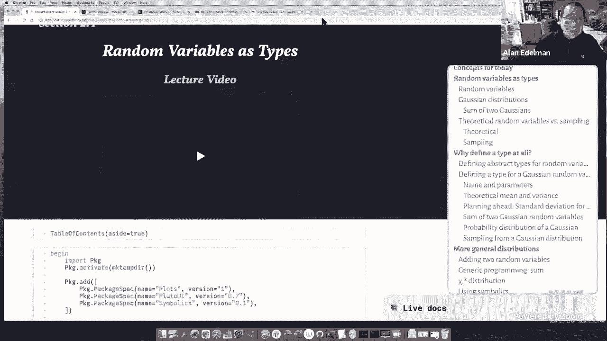

# 【双语字幕+资料下载】MIT 18.S191 ｜ 计算机思维导论-Julia(2021最新·完整版) - P11：L11- 作为类型的随机变量 - ShowMeAI - BV19g411G7ab

okay it's 105 eastern so let me give a，hello and welcome to those of you out，there on the internet。

and also for any of the mit folks that，may be watching，so uh today's lecture。

is kind of an interesting lecture i'm，kind of excited about this lecture。

because it looks like one thing but it's，kind of secretly another thing。

so this lecture is continuing our module，on on what you might call data science。

and statistics you know the，probability random variable sort of，stuff that on the one hand you might。

find in any statistics or probability，class，but what this is really going to be，about is a。

it's really a computer science lecture，but you may not，see it completely well you will because。

i'll point it out，but uh it's a kind of lecture that i'm，not sure how often you would see。

out there but we're going to talk about，how to use types and。

and what they're the real power of using，types，and in a way i'm hoping that as you kind。

of listen to this lecture you'll start，to realize that，that what you're about to hear you're。

going to see in the context of random，variables，but what you're about to hear can apply。

to just so many many situations，so to sum it up this might look like a。

statistics data science probability，lecture，but in point of fact it is absolutely a。

computer science lecture and。

that's why why i'm really really excited，about this lecture。

so uh maybe before i，actually start the lecture formally，i think what i'm going to do is show you。

some。

documentation about the normal，distribution，from the computer language r so。

i don't know how many of you have ever，looked at the computer language are。

but r has kind of been kind of known as，the statistics language right that's the。

language that statisticians are often，using so，here is some documentation from the r，language about。

the normal distribution okay here's，another，i'll click on this other tab here is。

some documentation about another，distribution that you may or may not，have heard of the chi-square。

and what i want you to notice and i will，get back to this but i want you to，notice。

is that there are four functions，that somehow are related to the normal，distribution。

but there's no normal distribution in r，itself，right like what's wrong with this story。

there's no distribution there's no，normal，there's no chi-square all right i want。

you to think about that，as i start to play with some of these，distributions。

so in today's lecture we really don't，have that many，that much new julia syntax maybe none at。

all maybe one or two little things，but what we have instead is one of the。

reasons why julia can be so very very，powerful，okay and again you're going to see this。

in the context of probability，distributions，but i want you to think about how this，could apply to。

so many other situations that you might，encounter when you're designing software，systems。

okay so some of the words that you'll，are，how to organize code for abstract，concepts。

there's julia's concept of an abstract，type there's the concept of subtyping。

and building up expressions under the，hood using types okay these are fancy，ideas。

so give us a little bit of a chance to，kind of expose them one by one。

and i guess one julia thing that i say，we almost don't have that much。

that's new but i'm not sure if we've，so，that's one of the things that will show。

up today okay but this is really about，to，to to really do some amazing things。

it uh on your screen please what's the，matter with the screen you just zoom in。

a bit more okay it's already pretty big，how's that okay yeah all righty。

okay so the very first i don't know，maybe five or ten minutes。

i'm going to do random variables on the，computer like，any language can do you won't see the。

difference with julia at first，i in some sense i'm doing that on，i。

go back and do it sort of the cool fancy，way you'll kind of see the difference。

all right so we're talking about random，variables this is an idea straight out，of probability。

right a random variable is an object，which has different outcomes。

right for a discrete random variable we，assign probabilities the probability。

that the random variable capital x will，equal the value，little x okay and the set of。

probabilities is what we call a，probability distribution，okay and just to kind of get used to it。

again and i think we've already seen it，and，i believe people are have some。

experience with gaussian distributions，and bell curves a couple of weeks ago we。

drew a picture of a bell to remind you，but，you know in case you didn't see that。

lecture or uh it's it's reasonable to，to to kind of do it all over again and，so uh。

a gaussian distribution comes with two，parameters if i want to，to specify a particular gaussian。

distribution，i need to say two things i need a mean，mu and a standard deviation sigma once i。

have a mu and a sigma，i have nailed down which gaussian，distribution i'm talking about。

and if i could just play with the，pictures uh the mu，you know it's always this sort of。

bell-shaped curve as they call it，the mu will shift the curve to the left，and the right。

right so the middle is the mean so you，can see the mean going from zero。

all the way to three and minus three and，by the way if you're not making these。

kinds of pictures and sliders yourself，you're missing out on a lot of fun。

i never i always wonder whether it's as，much fun to watch other people slide as。

it is to just do it yourself，so i really encourage you to sort of。

build these pictures it's just great fun，even if it's ideas that you know i think。

every homework at mit should have，in every class should have you building。

like a gui with sliders but maybe that's，too extreme，the the standard deviation maybe it's。

not too extreme i have to think about，that，the standard deviation when it's small。

it gets to be very narrow，almost goes down to a line as the sigma，goes down to zero。

or as the standard deviation gets bigger，it it，widens all the way out right and so。

that's how the standard deviation，changes，the shape of the curve okay and when mu。

is zero and sigma is one you kind of，have the standard normal that's sort of，like the。

prototype normal distribution where the，all，where all other normal distributions can。

come from okay so that's the normal，distribution，and if you want to generate data from a。

normal distribution，one way to do it is to take the standard，normal i'll remind you from last time。

that the julia command for generating，rand，n so this syntax random 10 to the fifth，i'll remind you。

says give me a hundred thousand samples，from the standard normal，okay and then when i multiply it by。

sigma and add mu，i'm actually now generating my data here，which is 100。

000 long are samples from a distribution，of mean mu，and variance sigma so as i slide this。

you see the numbers above me change，right and so i'm actually getting new，numbers each time。

a new set of 100 000 numbers are being，calculated，from the distribution with mean mu and。

variance sigma，okay and this is a very nuts and bolts，way to generate。

normal distribution elements of course，you could ask，you know what is the formula that that。

draws this red curve，the the bell curve itself right the data，is being histogramed and so that's why。

we get，these bars over here but the formula for，the bell curve。

well one way to do it is to write down，the bell curve for the standard normal。

that's e to the minus x squared over two，with a square to two pi constant on the，bottom。

right and then from there you can build，up an arbitrary bell curve。

by simply evaluating the original bell，curve you know in a certain normalized。

way you you sort of undo this and you，you subtract mu and divide by sigma。

right and then you make the area equals，one that's what that does。

right so uh you'll you'll see other，places where the formula sort of all。

combined together but this is sort of，fun to do as well，the，the bell curve that's the red curve not。

samples from the normal distribution but，the，red curve itself you can get by simply。

you know shifting you know on the x-axis，shifting and scaling the x-axis and the，y-axis。

of the basic bell curve okay and so we，could，know，mean zero and variance uh let's see what。

are we doing we're evaluating it at zero，when the mean is three and the variance，is two okay so now。

the next thing i want to do is look at，not just one gaussian，but i want to add a couple of gaussians。

so there are a couple of reasons why i'm，going to do this，first of all there's a remarkable。

property which you hardly would ever see，for any other distribution。

which is that if we add two gaussians，something magical happens。

maybe you already know the answer but，something magical happens when you add。

two gaussians let's see what happens，when we add two gaussians，so i'm going to take uh a hundred。

thousand，gaussians with the mean four and the，variance point three。

and another hundred thousand gaussians，i'll generate we're doing it by sampling。

with mean six and variance point seven，okay and i'm going to add。

these right so this will be the sum of，the two gaussians maybe i'll make it a，dot plus。

although you know a sum of two vectors，and the element-wise is the same thing。

but uh i'm going to add these two，vectors so basically，e one by one you know starting with the。

first of the hundred thousand the second，and the third，i'm just gonna add these two and then。

i'm going to plot the picture of the，histogram，and look what has happened this still。

looks like a bell curve right magic，right i mean，what are the odds well when it's a。

normal distribution the odds are pretty，high right，when you add two that's the big big。

statement about normal distributions，that unlike most distributions if you。

add two normal distributions，the result is another normal，distribution。

right it'll have a different mean and a，different variance presumably from the，original two。

but it is still the basic shape of a，normal distribution，right so normal distributions add in a。

very easy way，uh by contrast most distributions add in，a terribly complicated way it would be。

very hard to，write down you know you have to learn，about convolutions and and。

all sorts of things to write down about，the but but the normal distribution，that's。

pretty straightforward okay and so，um so so so，uh here's the picture you can see that。

it works out very very nicely，okay and we could check that，the the sample mean the sample mean is。

what you get by just taking all hundred，thousand elements，add them up and divide by a hundred。

thousand the sample mean you'll see，is really pretty close to ten。

so maybe no surprise this had a four and，a six we had，for the mean where they are up as 10 and。

the sample，standard deviation is，is 1 well this is basically one which。

means the sample variance is also one，let's add the sample variance。

because we can so let's add the variance，rather than the standard deviation the。

standard deviation is the square root of，the variance，so let's get the variance there it is。

it's also about one，three，seven you could kind of guess the，theorem if you didn't know it already。

which is that if you wish to add normal，distributions with a mean mu and，variance。

sigma squared you just add the means and，you add the variances，okay so this is what these words say。

that if you want to add up two gaussians，with mean mu 1 and mu 2 and variance of。

sigma 1 squared sigma 2 squared，then this is the new mean and this is，the new variance。

okay good so just to stand back a second，i'm not really that excited about the。

normal distribution i mean the normal，distribution is cool，i'm excited about julius type system。

right so just hold on you'll see，okay that's what i'm really interested，in so let's talk about。

some of the things that one does perhaps，in a statistics class。

right with with data okay if you have a，random variable there are a couple of。

things you might do with it for example，you would name the random variable like，gaussian。

right and you'll remember i objected，because there is no，you know gaussian is a synonym for。

normal in this context，is，no normal or gaussian object right，there's just four。

separate functions that happen to have，norm in between with，with no real connection between these。

four functions other than，what's in our minds but not on the，computer。

okay so what would you want to do you，would want to name it uh，since these since to be to specify a。

particular gaussian，you need the parameters the mean and the，variance in the case of a gaussian。

and once you've named it and you know，about it，then there's going to be a theoretical。

mean right there's a there is an，explicit mean，that when you sample it you hope to to。

get a sample mean that's close right and，there's a theoretical variance which you。

could sample and hope to get the，the variance right and you could sum up，some random variables。

you could take products you could do，other things and we could talk about。

that picture that looks like the，histogram that's what's called the，probability distribution。

right and you know you could if you're，doing it experimentally by sampling we，call it histogram。

if it's theoretical we call it the，probability distribution，sometimes the histogram is called an。

empirical distribution because it's like，an experiment，right so these are all the sorts of。

things that probably would come up in a，data science statistics math course and，probability。

well you know i don't know probably all，three uh and，um and so you know there's a reason why。

these various things have names right，and so，let's suppose you know um we want to do。

this on a computer，well uh here here i brought up the，the the links for for for the r software。

right this is the chi squared and the，norm the normal distribution。

but let's go ahead and think about what，we want to do well，if you were planning ahead right and you。

weren't just playing with gaussians，but you were thinking for the long term。

you were designing a system for the long，term，then you would say to yourself what am i。

really working with am i only going to，be working with gaussians。

with the normal distribution it's like，no we，probably going to work with random。

variables today right and so that's like，the big picture，so if that's something that is in your。

head it's probably，worth creating a type for it okay and so，called an。

abstract type which we'll call random，variable，okay and uh this maybe i don't know if。

we've seen this before or not maybe we，could add it to the top。

but this notation less than colon is how，we're going to represent。

subtypes it kind of looks like a i don't，know i mean i guess a subset is sort of，rounded。

but it looks like a less it is a less，than sign so it reminds me of subset。

and that's what it looks like less than，colon okay and so，uh when it comes to random variables it。

might be worthwhile，to distinguish the discrete random，variables and the continuous random。

variables and，i'll remind you that a a discrete random，variable takes on。

uh discretely many numbers it could be，finite you know like one two three four。

five or square root of two pi and the，third root of seven，or red blue and green i guess as well or。

it could be infinite but discrete like，the integers，right as opposed to a continuous random。

variable which takes on values like，anywhere between 0 and 1，or anywhere on the real line or。

something like that，does，is it says we're going to define a，discrete random variable as a subtype of。

a random variable，and we're going to have a continuous，random variable which is also a subtype。

of a random variable，okay and um the great thing about，the or at least what i find convenient。

about julia is you do not have to define，any methods when you define the type。

you could define the methods the，functions that you're going to use，anytime you want it could be。

later today it could be somebody else，who，has access to your package and adds it。

you know you could do it three months，from now，okay and so you don't have to in advance。

decide everything you're going to do，with these things，but i have a random variable now i even。

have a discrete random variable and a，continuous random variable。

but i don't have a gaussian right just，like the r people，for all my playing in the first what。

what do we have now，we're 17 minutes into the lecture i，guess，and it still looks like this right now。

right i still don't have，what i really wanted which is i really，want to。

to set up a gaussian so let's go ahead，and do it，so here's my gaussian all right it's，going to be。

gaussians take on values anywhere on the，real line right that bell-shaped curve。

is is actually theoretically can have，any value on the real line though it。

gets very very small on the edges，but it's never a zero so uh it's we're。

going to make it a subtype of a，continuous random variable，we don't really need the subtype today。

but it seemed，easy to show you today and kind of worth，doing today。

so but really what does it take to，specify a gaussian well as you've seen。

it's a mean and a variance right so the，symbol for variance is always sigma，squared。

sigma being the standard deviation okay，so for a gaussian，we need to specify the mean and the。

variance and we've already seen，that there is a concept of a default，gaussian a standard gaussian。

where we would just take the mean zero，and the variance，one okay and so this way we could。

actually define a gaussian，that is just mean zero and variance one，it doesn't do much right now。

with this code alone i can't really do，anything i can't，sample i can't add two gaussians i can't。

uh do very much but at least i could，define the，thing right and so here i can go g。

equals gaussian of one of two and now，all of a sudden i've got。

a gaussian i can't do anything with it，but at least i've named it。

i mean what can i really do i mean i，guess i could grab，the mean in this clunkyish way。

right i could grab the mean ah it's one，or i could grab the variance i mean i。

right and this variance is two but i，really can't do a whole lot otherwise，with this thing yet。

but i've named it and that's a good，start okay，so what we'd want to do next of course。

is add a mean a theoretical mean，method so i don't have to type it this，clunky way。

so that's what this does since mean is，already part of the statistics package。

it would be silly to define my own mean，mean，for a gaussian will be extract。

the mean from here right and so if i，have a particular gaussian i can get the，mean。

and i can get the variance right and so，now typing mean of g，and var of g does what i would want it。

to do，and it's kind of nice because it's sort，of the same name。

as the statistics mean right and so we，can kind of，work with it theoretically。

experimentally right there's a lot of，choices here now that we can do，so that's nice now。

i've done the mean and the variance for，the gaussian，what about the standard deviation well，you know。

the standard deviation is always by，definition the square root of the，variance。

so why not let's just think ahead，and define the standard deviation for，any random variable you see。

here i did the mean and the variance for，gaussians but why don't we define the。

standard deviation for any variable，to be the square root of the variance of，that variable。

you see that's thinking ahead because，now if i go ahead and define the，variance for some。

other measure for some other probability，density for some other random variable。

right i'm already ahead of the game i've，kind of like saved myself a little bit，of work。

right this is always going to be correct，so why should i special case gaussians，right so。

we often like to say that the secret to，computing，is knowing exactly when to generalize。

and exactly when to specialize，so for those of you who studied any。

advanced mathematics you know that，that the whole the whole movement。

you know starting with the maybe the，beginning of the 20th century or even，before that。

was to get more and more abstract the，feeling was，that abstractions the more abstract you。

are the more you can cover in one fell，swoop which is true，but the mathematics somewhat lost sight。

of the special cases that are also，pretty cool and very interesting and。

so the the whole attempt to move，mathematics towards abstractions which，was really valuable。

also came with a cost right and so the，other thing you need to learn to do。

is to know when to specialize and when，you know when when you have the special，case。

and so a lot of computing is about，knowing when to generalize and knowing，what to specialize。

okay and so uh we specialized over here，and we generalized over here，might be an example okay so now。

i could take the standard deviation and，i think many of you'll recognize this，number as。

the square root of two right so if the，the variance of our gaussian was two。

then the standard deviation would be the，square root of two，okay well now i'm gonna do something a。

lot more fun this was kind of，straightforward，but i'm going to do something that that。

is going to look a little bit special，but you're going to see，just how powerful it's going to be i'm。

going to define，something kind of crazy which is the sum，of two，oh wait sorry i'm not crazy yet the。

craziness is coming below，oh this is easy still sorry i'm getting，out of myself let me。

take a deep breath so，yeah this is still sort of easy stuff i，would like to be able to add two。

gaussian，random variables and use the fact，that gaussians add in a simple way right，and so。

the sum of two gaussians an x and a y，would be a gaussian，whose mean is the sum of the means and。

the variance is the sum of the variances，okay and so here if i have a 0 and a 5 6。

i'll get a 5 7 okay and，now i can actually check i don't have to。

redefine the mean because the means to，find our normals，i could actually check that the mean of。

g1 plus g2 is the mean of g1 plus the，mean of p2，right so that i kind of like to i love，like。

the mean of the sum is the sum of the，means，right there's when it comes to the。

normal distribution that's true right，the mean of the sum，is the sum of the means right i could。

change these numbers i mean i suppose i，could have had a slider。

but you know i could make these random，numbers，right so that the mean could be actually。

here we could make it random，actually you can make these random。

the variance better be positive so i'll，and you'll see the numbers changing。

but this thing should remain true if，mathematics is good right so。

i'll do this a few times you'll see the，the numbers change，but the true remains right so no matter。

right the mean could go negative or，positive the variance will always be，positive。

but the mean of the sum will always be，the the sum of the means。

uh i'm not going to do the theoretical，product of two gaussians，because it's not a gaussian。

it's actually a complicated object so as，easy as，adding two gaussians is multiplying two。

independent gaussians is，sort of not not that wonderful in many，many ways。

so i'm going to skip over that right now，but we may do that the general case for，homework。

i guess i've already mentioned this so，the，probability distribution of a gaussian。

is explicitly this formula，but maybe it's worth showing that this，formula is saying。

something specific it is saying that the，probability of appearing in an interval。

is exactly the area under the curve，specified by this function right and so。

you kind of already know that，okay but let's go ahead and，define that as well we can have the。

theoretical pdf，you give me，x we'll actually calculate this，explicitly okay and so we're building up。

all sorts of things about，gaussians right so i if i just look at，pdf of g it's a function。

um but if i took the pdf of a gaussian，which，some of you might recognize do you。

recognize that number i know the number，there it is because that's exactly what。

would happen if this was e to the zero，and sigma was one right it's it's just，this number over here。

okay it's also the top of the bell curve，so this is the theoretical curve we saw，before。

okay um i want to get to the fun part，we're still not at the most fun part yet。

so i just want to get there let's see so，um so，so um let's see we've got。

a bunch of functions to find on，gaussians um，in a way maybe it's good to sort of go。

back to this table of contents over here，and see what we've managed to do and。

what we haven't managed to do，so uh we've named the gaussians we've，got the theoretical mean and the。

variance，we planned ahead for the standard，deviation for any random variable。

we added two gaussians uh we defined the，probability distribution。

but the one thing that we haven't done，was to find，a sort of general random number。

generator of course we have the built-in，rand then，but we could have a general random。

number generator by，calling rand and and multiplying it by，the standard deviation and adding the。

mean，and of course that's going to work as，this histogram shows，okay so，uh let's go ahead and now。

this is where it gets a little more，interesting，let's i've spoken enough about the。

normal distribution right you must be，tired of the normal distribution。

let's bring in another distribution we，talked about in the last lecture。

an e an easier distribution arguably the，bernoulli distribution that's the。

that's the one that's that's going to be，heads or one with probability p。

and tails or zero with probability one，minus p right so the，the bernoulli as you remember is like。

the it's just the weighted coin i，i still never remember bernoulli i。

remember it as the weighted coin，and if you ask yourself what is needed。

to specify a particular bernoulli，distribution，what do we need what do we need for you。

know like before we needed the mu，and the sigma squared to specify a，particular normal distribution。

what do we need to specify a particular，bernoulli distribution，well there's only one thing we need。

which is the the parameter p，that's going to be between you know zero。

and one right we just need this，one parameter b p and we've got。

the bernoulli distribution right so here，i'm giving an example where it's，point。

with this much code all i've done is，named it but haven't done anything else。

but we can go ahead and specify the mean，which i think is obviously p。

right because it's with probability p，you're going to get a 1。

right otherwise you get a zero right so，the mean is is p，um，could，you could just see that uh。

uh for for the variance you you，you t you know that it's you can。

subtract the mean so you get one minus p，and minus p，right and then you would multiply the。

one minus p by p and the，one minus p gets multiplied by one minus，p anyway when the smoke clears。

what you get is p times one minus p，which is what we see over here。

okay and again standard deviation will，just work，because it's been made to we could，define the rand。

function now on the bernoulli and now，what i'd like to do，is add two random variables right。

i want to add two random variables where，you see before the normal distribution。

when i added two normal distributions i，got a normal，but when i add a normal and a bernoulli。

or two bernoullis，you know something else is going to，happen how do we see what happens。

right well let's actually，go ahead and define a type，for the sum of two random variables this。

is a little bit overkill，but in a way what should we do if we add。

like i what i want to do yeah let me，kind of show you i want you to think，about it。

i would like to be able to do like a a，gaussian，of it doesn't even matter what four，comma five。

and i want to add that to a bernoulli，of 0。3 right now until i define。

this thing it doesn't exist you know，unless you define this thing the，computer is going to say。

i don't know what this is but，does that bother you because in your。

mind you know exactly what this is right，you take a random sample from here and。

another random from here，and you add them right your mind knows，exactly what this means。

but the computer doesn't know what it，means so，what could should we do we need a way of。

of adding these two things right and，i mean we already know how to sample。

from the sum but we don't have，something to express the sum and so this，is where you need a type。

right and so we're going to say a sum of，two random variables，which is made up of a random variable。

and another random variable，okay and now i can add random variables，right so i've got a bernoulli。

let's say b1 is a bernoulli here's b2 is，another bernoulli say，i mean we could do anything and。

if i want to add two random variables，i now have something to say about it。

it's a sum of two random variables i，mean this almost seems like a tautology。

but it's not it's telling the computer，that if i have one，if i want to add this object and add。

this object，i have some place to refer to the answer，okay so if you want to sum to。

bernoulli's we can go，b1 plus two b2 and you see what the，result is it's a sum of two random。

variables，right so it doesn't do much but，but it does everything it stores the，pieces of the sum。

okay uh however，if we know that if we have two gaussians，when we add it right we actually get a。

new single gaussian，so is this already starting to seem kind，of cool maybe i should like。

take a deep breath and tell you what，just happened，this very same plus is adding random，variables。

when it saw that it was two gaussians it，was aha，i know what to do with two gaussians i'm。

just going to make it a new gaussian by，adding the means and the variances oh。

i'm going to add two bernoulli's，i don't know what to do with two bird。

movies i mean if i added two bernoullis，like zero and one i could get two coming，know what it。

is you know it's got another name maybe，but it's not a bernoulli。

so already we could see that we could，add random variables and when we know，what to do。

we could specialize when we don't know，what to do we could sort of keep the sum，running，right and uh。

but at the very least we could say that，if you have the mean of a sum of two，rand。

random variables you get what's the，so-called linearity of expectation that，is。

the mean we could we could define it so，that it's the sum of the means。

right this is this now says that，um the mean of a sum is equal to the sum。

of the means for any sum of two random，variables，okay so that'll always work so now i，could go mean。

of b1 plus b2 and it'll add up the means，it's practically looking like symbolic。

computation and though there's nothing，symbolic here this is entirely numerical，computation。

but it has the appearance of symbolic，computation，okay and by the way the variance we，could define。

as long as we know that they are，independent and i'm not going to make，too big。

a deal about it i mean maybe we should，have a new type called sum of two。

independent random variables，but if they are independent it's known，that the variance is also。

add and if we want to sample the sum of，two random variables。

then you just take a sample from one and，a sample from one，the other all right so let's start。

playing with this now okay and so，for example i could now with ease。

you see this this is sort of the magic，of computers you do，a bunch of setup and then all of a。

sudden you could spend the rest of the，day playing with it because you could，just see what happens。

you have your own little laboratory set，up so what happens if i added。

a bernoulli here let's let me do a，bernoulli point five and a bernoulli of，0。5 for starters。

okay well when we're going to get，the positive we're going to get 0 1 and。

2 and there's like twice the probability，of getting the one right it's sort of，symmetrical。

if on the other hand i did bernoulli，then um the one is going to come up more，often。

or right yeah the one's going to come up，more often you can see how it changes。

but we could start playing more fun，things we could take let's take a，bernoulli and a gaussian。

all right i don't know i you don't see，this in books as much，but we could take a bernoulli and a。

gaussian and you get，a sort of you know two hump thing right，it's got two。

two peaks if you like right this is，called a this is sometimes called a，mixture。

right and so um you've got all the，technology now to add these sorts of。

things right you can take any bernoulli，and any gaussian，and sum them up and see what they look。

like right you could add a slider if you，want，um you could you know you could just。

play with this thing，and see you know all the different，things that you might have right this is。

sort of symmetrical this kind of looks，nice i guess，um so you could play with this now right。

you've got you've got power right you've，got mechanism now that you can do lots，of different things。

by because you invested in the type，structure okay，but you're going to say you know that's。

all kind of cool i guess you could do，two random variables，but what if i wanted to add three random。

variables，do i have to go back to my type and say，sum of three random variables right and。

then you know，but then you start getting greedy am i，gonna need a four or five i mean it。

seems a little cumbersome，the answer is no we're actually done。

right sum of two random variables is all，you need，right because i can actually add，a bernoulli 0。

25 look i just added them，right and i used this this is this is。

really the way the power of abstraction，if you if you add three things。

that is the same as adding two things，right and then iterating and taking the，sum and doing it again。

so as long as everything's defined which，it is you could see that。

without any extra definition i actually，can add three things just by using。

plus right so i mean here's the，breakdown of it it's a，sum of two random variables where the。

second thing is a gaussian，right and the first thing is itself a。

sum of two random variables made up of，two bernoullis，right and so you can sort of see the。

stack forming um，for those of you this is i guess a two，may be too fancy a word but you can see。

the abstract syntax tree it's almost，inactive，already almost in action right so how，cool is that。

we can add up three of these things and，define，we could call this a mixture right and。

we could generate a random thing from，this mixture，because we have it we could we now have。

the ability to，generate random numbers from this sum，right and we can histogram this mixture。

right because we have it right so i，could go on，and add some more i could add on another。

bernoulli i don't know what it'll do，but we could add on another bernoulli uh。

i don't know let's try point one i have，no idea what it will do，uh maybe or should make it larger i。

don't know，you know anyway whatever you do you can，play with it and it will histogram that。

thing and so，uh you know when i think of static，textbooks you know。

you might see a couple of pictures but，in this sort of laboratory you could。

take any distribution you want，add it to our list and then all of a。

sudden you can play with the histogram，okay that's where the power of the type，system。

comes in okay and um，by the way this this you know，our brains are so used to the fact of。

associating the symbol plus，with the sum right so what is plus plus，is something you do on。

two you know you could extend it on more，objects but you add up。

plus sits between two objects right i，mean that's i，almost always we think of plus as。

sitting between two objects，right the sun command applies to a，collection of objects。

so we've defined plus but we didn't，define sum，okay but julia knows what a sum is。

a sum is a sequence of pluses so you，don't have to，like you know maybe in some other。

programming language i don't know you，would have to，redefine some on bernoulli's but。

no with with with with julia，i can just sum up all of these，bernoullis say bernoulli 0。25 for i。

and one column theory there's nothing，that makes it that i have to have the。

same parameter p i could go，s as the sum of rand uh yeah，around a random probability for i and 1。

to 30。 it wouldn't care，all right but let's go back to 0。25 just，to make my point。

right so i've now just added up 30，random variables，and i've defined a new variable okay and，not。

a vector this is right so this this is a，little different，it's slightly different i don't know if。

you'll see the difference but this is，slightly different from，from sort of an expression like this。

though it kind of gives the same answer，but i just want to show you the，difference just the same。

so here's a sum of a vector of size，three，okay here is the sum of，an iterator of size three and the。

difference is，for this one three wouldn't matter but，if this was three million。

you would have to store the vector first，which would cost you a lot in，performance。

here when you add it up it actually，doesn't store the entire vector。

as you go it may stick it in the syntax，tree but it doesn't actually store the。

entire vector and so you have the，possibility of keeping your memory small。

at least in principle maybe not exactly，in this case but in principle。

so let's get back to my main point，though let's go back to my，sum of 30 bernoullis right so so。

rolling，30 coin tosses but these these coins are，unfair the probability of heads is a，quarter。

i'm doing 30 coin tosses and i kind of，want to know，what might happen how many heads might。

come up and you can see，here's the histogram i just go histogram，of s this is exactly。

what's going to happen right so uh，and this is a theoretical answer in some。

sense right it's not an experimental，it's not a simulation，right uh this uh。

wait is this this one was a simulation，this one was a simulation right this is，an experimental one。

sorry yeah this is this is this was done，but you could calculate a an actual。

uh theoretical version of this curve as，well right we could，and maybe we'll even do that for。

farmwork i think we were thinking of，doing that，that's right um this is so the reason。

why i tripped on that and i'll apologize，it looks so good i can't even tell the，difference yeah。

that's that's that's kind of why i，tripped，right then we could take the mean and，the variance um and。

grab random objects from s right and so，here you could see i could sample from，this。

and i think that this is a big deal，right and i don't know if i can stress，that enough that。

with just a little bit i mean maybe we，should go back and see。

what we really defined because i i did a，few things to try to give you an idea。

and then there are things that were，truly necessary and if you see what was，necessary。

you find out that it wasn't very much i，mean basically，i defined specifically the the random。

variables，normal and uh bernoulli right the，gaussian and the bernoulli got defined。

okay and they were both subtypes of of，one was a discrete one was a continuous，random variable。

and in turn those are type subtypes of a，random variable，okay i define the mean the variance and。

how to generate them，not much more and how to histogram them，and that was enough to be able to draw。

these beautiful pictures，right and any any distribution i want，and so。

uh you know in a way when you talk about，adding，distributions it feels very abstract，because。

you know what is a distribution it's，something that i can take samples of，whenever i want to。

right but you see i can just add them i，can refer to the sum，uh anytime i want let's see what any。

other good ones i could do i mean，i suppose if i added another gaussian it。

would just look like a gaussian so that，wouldn't be that interesting。

i don't know i could try something i，don't know what it would do。

yeah see calcium is kind of overtake，maybe a small，a smaller variance would be more fun。

maybe that's too small，a another distribution down，lower and then yeah that's coming all，right fine。

um i was wondering if i could get more，pretty pictures up here but，that's okay all right so let's。

do in the last you know seven minutes，using，information when you have it right so。

the sum of bernoulli's when the，probabilities are all the same。

is actually something that we know a lot，about，all right it's yet another this thing。

actually has a name and it's easy to，work with，and so let's might as well talk about it。

oh whoops are we not doing that one，we're doing chi squared，uh oh i thought we were going to do the。

binomial all right，scratch that we have let's talk about a，different distribution。

starting all over we were going to do，one but we，here we mentioned the bernoullis but。

we're not doing anything with it here，uh okay let me tell you let's add a。

third distribution what do we have so，far we've got，gaussians and we've got。

bernoullis i would like to add，another distribution one that comes up a，lot in statistics。

the so-called chi-squared distribution，right and so，some of you may have heard about。

chi-squared tests，um if you took a data science class or a，statistical class you would have。

learned how to test for significance，with these chi-squared tests you。

might even learn to make these tables，and and，and you know nobody really understands。

these tables well i guess some people do，but let's talk about the chi-squared，distribution and。

i'm going to play a game similar to the，game i played before，i'm going to come up i'm going to start。

with a kind of generating distribution，and，then i'm going to get other chi-squareds，from one of them。

so i'm going to start with the chi，squared one，right and stats classes that might be。

called chi squared with one degree of，freedom，all right so i'm going to start with the。

chi squared one distribution one just，so the first thing i need to do is name，it and。

there really are no parameters because，the one degree of freedom is already，built into the name。

so let me define the chi-squared，distribution，and i'm going to do it let me the first。

thing i'm going to do is，tell you how to sample from it so chi，squared 1。

is actually nothing other than the，square of a gaussian the square of a，standard normal。

right and so that's all it is right if i，take an，ordinary standard normal and square it i。

get a chi-squared one distribution，right so before i was talking a little。

bit about multiplying two independent，gaussians，right here i'm multiplying the same。

gaussian by itself it's like the，extreme opposite of independence right。

i'm taking this gaussian i'm multiplying，by itself it's，it's the ultimate independence i guess。

one might say so i've got this，chi-squared distribution，and um we could try to plot the。

histogram it's kind of，there this is what it it looks like i，mean i guess i could。

maybe i can um see if wikipedia has a，better picture i could change it myself，on。

but here just to show you yeah the，chi-squared distribution is with the。

with one degree of freedom is this black，curve right here，okay this is this black curve right here。

and on a different scale this is the，very very same curve，okay now what i would like to do is。

get to the chi squared n the the，end degrees of freedom i mean we only，have the black curve。

i'm going to show you that you can get。

the blue curve let's see are there other，pictures here no more pictures all right，let's start with。

you can get the the blue curve the green，curve the red curve and purple cover。

oh this is the test statistic what i，really need is the actual distribution。

oh come on let's see yeah there they go，that's what i'm really looking for this。

is the picture i wanted，so to be i think i said something wrong，before this yellow curve。

is what we're seeing on a different，scale and the question is can we see，these other curves the。

with two degrees of freedom we've got，the green with three degrees of green。

what they have the cyan color where teal，whatever that is blue for four，red。

can we get these other ones well i claim，that we have，everything we need you don't have to。

type in formulas，all you have to do is for example i，could histogram。

the sum of four chi-squareds and i will，get，the the the histogram for four in other。

words i'm actually getting，the blue curve it's a different scale，but i'm getting this blue curve。

just by adding four chi squares right or，chi one squares，so two would look again a slider might。

be fun，but we have all the technology right，here，to sample and histogram all of these。

different ones and you，you can see the character changes with，one it kind of goes to infinity。

um two it still just sort of goes it's，sort of monotonic，starting at three it goes up and then。

down right and it kind of moves to the，right as you go，so uh so the general chi-square，distribution。

is is uh nothing more than a sum of chi，one squares and，see we have the technology to just build。

it right here，all right one other quick thing that i，just want to show you real fast it's。

kind of a little bit of a side story，but the interchange of actual symbolic。

computing with numerical computing，that's，in the works um it's it's it's moving。

very quickly i mean it's not as，it's not completely as extensive as some。

other 30 year old packages might be，um but it can do quite a lot for example。

you could define variables，such as mu 1 sigma 1 squared mu 2 and，sigma 2 squared。

these are now symbolic variables and，what's cool，is you can stick these symbolic，variables in。

into the gaussians that we defined and，we could add them，and it'll just work right and so um。

mu 1 and mu 2 will be mu 1 plus mu 2，sigma 1 squared，right you know here's 17 and 3。 you see。

it just works，and so this is really what generic more，you know another further example of what。

generic programming is about the，abstractions where，you can you can stick in floats you，in。

symbols right and instead of the thing，breaking the thing still works and when，that happens。

it's just such a joy to see that you，know you weren't planning to do symbolic。

computing you were planning to do，numerical computing oh but it works，anyway。

right and so we'll have more to say，about symbolics but i just wanted to，give you a peek about。

symbolics right now and julia and just，show you that it just works。

right i mean when and so you know and。

that's the real，power of a computer not to you know i i，if i if i could sort of sum up what i。

think is is truly important well，you know i see lots of people，programming you know doing solving a。

problem on a computer there's nothing，wrong with that i mean i do that all the，time myself。

you solve a problem on a computer but，computers get really really exciting。

when you can build classes of problems，ultimately build a system。

that could solve lots of problems and if，we could only just make it。

easy to do that which is what we're，trying to do with julia then。

that's where the true power of computing，really comes from，so with that i will end my micro century。

and i guess i will say goodbye to the，internet audience and，stick around maybe for a little while。

