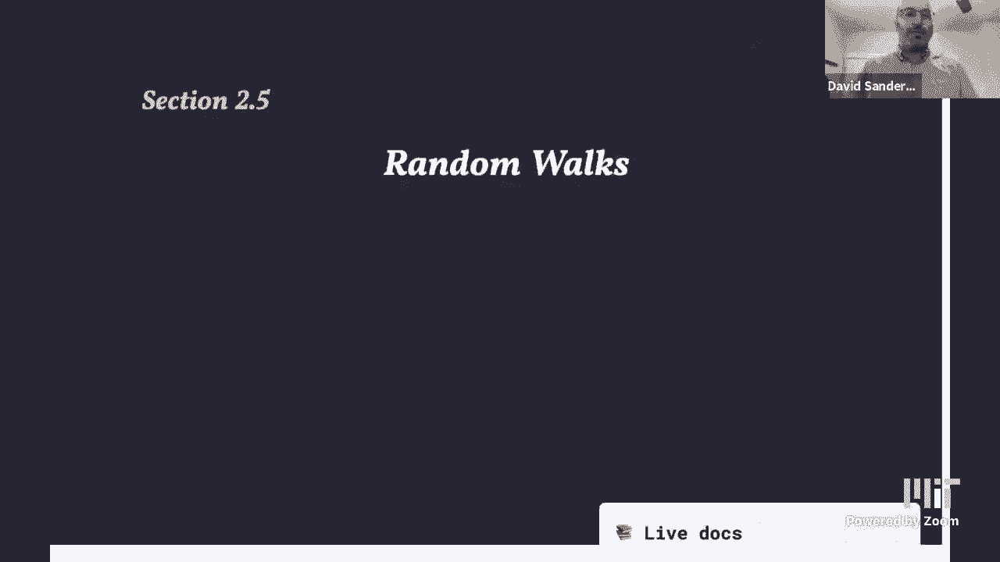
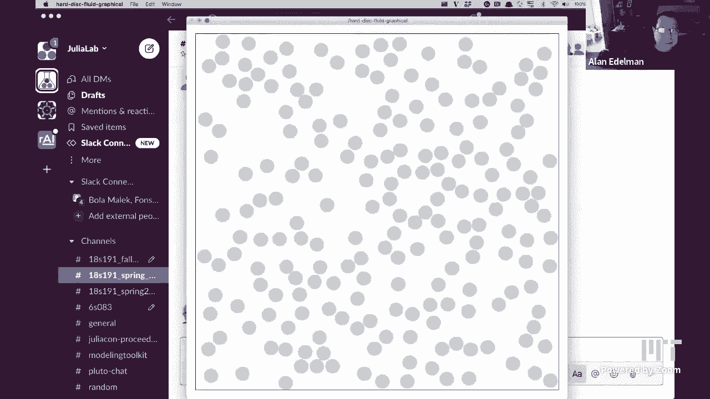
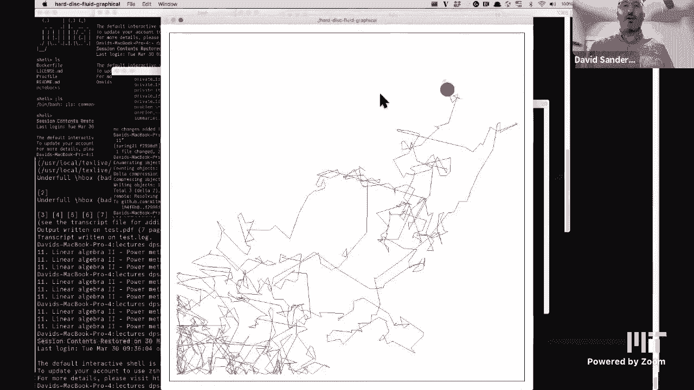
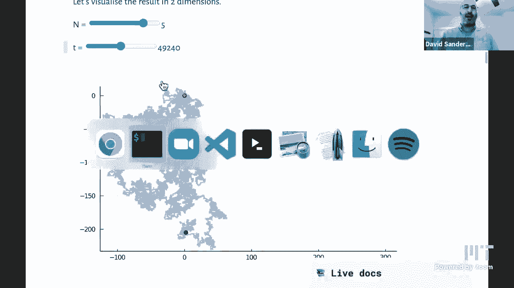
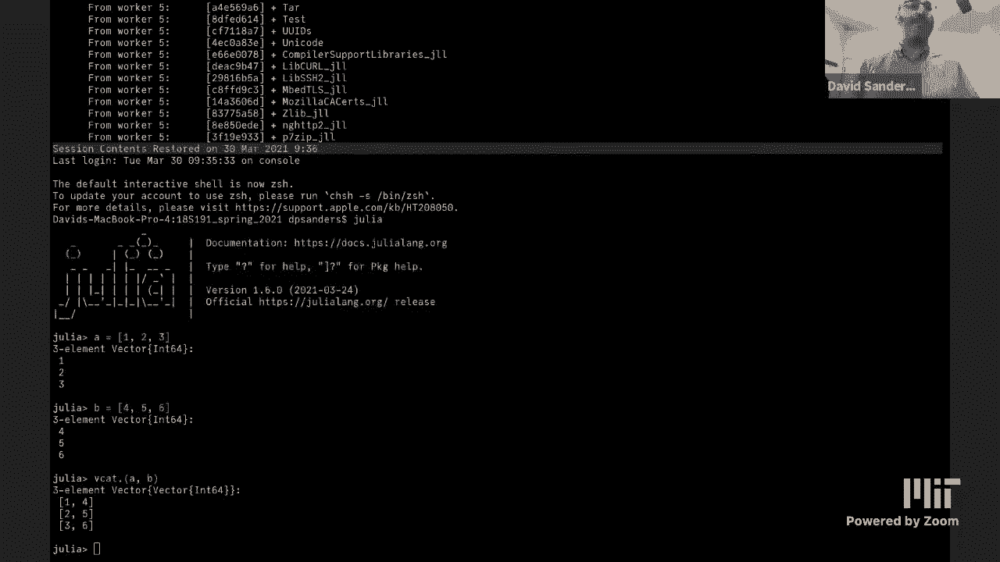
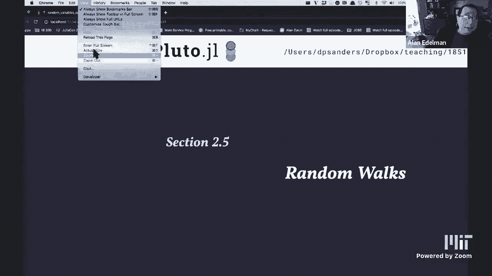
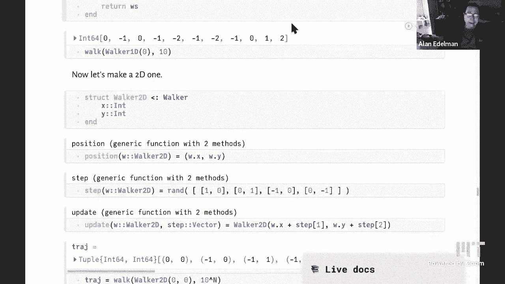

# 【双语字幕+资料下载】MIT 18.S191 ｜ 计算机思维导论-Julia(2021最新·完整版) - P12：L12- 随机游走 1 - ShowMeAI - BV19g411G7ab

so hi everybody welcome back to another，class in spring 2021，18 s191 6s083。

uh computational thinking at mit so，today we're going to talk about。

random walls we've been talking quite a，lot about different kinds of。

ways of thinking about randomness and，modeling that in the computer and this，is a。

particularly interesting um，in my opinion i like this subject a lot，and it's very。

useful to model many situations in，engineering science，finance etc so i'd like to start off。

by um you know let's think about so what，is a random walk。

and then why is it useful，so let's just start off by visualizing a，random walk。

so here i've got a particle and it's，living in two dimensions and it's just。

going to jump at each step，to a neighboring site so it can move up。

left right or down on this grid that you，can see，and so as i move this slider we're going。

to see that dynamics happening so there，it moved up，then it chose to move down then it。

chooses to move down again left etc，so basically at every step it chooses。

one of the four directions with，so，that was just 10 steps what if i take，more steps so now。

i'll just um let's take 100 steps，instead and，it does something like this okay so it，just。

literally is dancing around at random，bit，and now it looks more like this so you。

can see that it's still you can still，see the kind of graininess，of moving on this lattice or grid。

but um you know it's starting to look，uh you're you've almost lost that grain。

of graininess actually and if i，increase the number of steps yeah but。

i'm still plotting it kind of within the，same，window same sized window then actually。

you can basically no longer see that，it's actually moving on a grid。

and it's just moving around at random so，now let's um，let's look at another system that's。

actually completely different，which is a lot of hard disks bouncing，off each other。

this uh this visualization now。

about that，uh i okay let me show you that，so okay so here we have just a large，number of。

hard disks and we're going to um put，them，in to to move so each of these。

disks you can think of as a molecule，moving around，so this is really a visualization of a。

gas of the molecules in the air in，your room or or in a fluid moving around。

and each of them is following newton's，law so it's just basically。

there's moving in a straight line until，it meets another disc and then it。

collides with that disc and bounces off，uh in a way that conserves energy so i'm，going to actually。

label those discs and i'm going to，follow one in particular and i'm just。

going to draw its trajectory as it's，moving around and bouncing off these，disks。

let's speed that up a bit this is all in，real time，and then i'm actually going to so you。

can see that yeah indeed，this dynamics is being generated by this。

particle being buffeted by being moved，around by these other disks now i'm just。

going to turn those other disks off，and we'll just look at that particle，doing its thing。

and if you did not know that that what，the underlying dynamics was you would，say oh。

that particle is just moving at random，so what is the origin of randomness in。

you know physical systems at least，it's actually that we have all of this。

other stuff going on in the system，and we don't know about it and so that's，effectively you know。

giving us something that looks random at，least so，you this is basically you can you would。

you would think that this particle was，jumping around，at random choosing random directions at。

each step and so you know this，trajectory actually looks，a lot like the other trajectory that i。

already drew，i feel like that's the path i'm forced，on when i get off the subway during rush，hour。

yeah exactly so uh so，this kind of process random walks is you，know um。

is so this is a as i said a random walk，is jumping at random and what i'm saying，is that actually we。

can find behavior that looks like that，in many，many systems physical systems the stock。

price so let's just uh go and look at，the apple stock price for example，whichever stock price。

i'm just going to do a google search uh。

apple stock and then we'll look at sort，of one year's worth of，stock date stock prices and you could。

think that this is some kind of，random walk as well so of course it's。

not completely random because you know，the start of this this year it was just。

drifting upwards with some randomness on，top so，it's not doing exactly the same thing as。

we're modeling，and so the question is well can you，actually predict that。

particular piece of emotion and and you，know people make and。

lose billions of dollars a day doing，that。

okay so let's go back to that's so，difficult to，keep track of where all these windows，end up sorry。

oh did you want to um review what julia，concepts we're going to learn today。

yes go ahead uh if i can find，a window that would be helpful，meanwhile we could look at the apple。

sorry i just completely lost where the，my kids keep telling me i have way too。

many tabs open on myself that is always，my problem but i mean i had it all，carefully。

planned and then you know it all starts，going on okay there seems to be，it okay。

is that the right version you had it and，then it disappeared。

no that's sorry that's not the right one，i'll just mention while you're looking，uh that。

when i was an undergraduate um almost，everybody was reading this book called a，it's still。

maybe a very popular book so um。

by malkiel so uh in case you were，wondering whether random walks were。

relevant to stock prices that that book，kind of，said that everything was basically a，random walk。

yeah so basically um we're going to，look at how we can you know implement，random walks and。

that's going to involve various，different uh concepts so the first thing。

we're going to do is look at how we can，so when we want to generate a random。

walk we want to do jumps left and right，so，there are various ways we can implement。

that and we want to actually compare，them maybe，to see which is going to be the most。

performant the most the fastest，solution in julia to do that so we're，benchmark。

tools which is a very nice provides a，very nice interface to just。

quickly benchmark a um a small piece of，code called a micro benchmark。

we also need we're going to plot several，random wall trajectories。

and so in order to do that we want to，have a loop and inside the loop we want，to plot，a。

the same the same plot different，trajectories，so if you've actually tried that in。

julia you'll you realize that that's not，actually，there's there's some trick to it so i'll。

discuss that，we'll talk about a very important，concept which is generic programming so。

i want to write the same a single piece，of code which is，generate a random walk trajectory and，types。

of random walks this is very similar to，what we did last，lecture where we had different random。

variable types，which we could sample from um and we're，going to look at。

so when we create those random walk，objects we want to，either we want to we need to change，by。

by changing what's inside them or by，creating new，new ones so that's the concept of。

mutability versus immutability，and then we want to run a function with。

a type as a parameter and so we'll have，introduce the julia，word where and see how that works and。

we'll need vectors of vectors so，um uh which is we'll have，a vector well that will be evolving in。

time，and so we need to store all of the time，evolution of all those vectors inside，be。

just another vector and we'll talk about，aliasing of memory which is when two。

different names point to the same，place in memory and uh the queue sum，function。

which is for cumulative sums okay，so we've seen the motivation so uh so。

this this this two-dimensional，random walk is so by the way um later on，we're going to talk about。

uh discrete versus continuous so you can，see that as，i increase the number of steps i'm，actually。

you know you're sort of losing the as i，said losing the fact that we're living，on a discrete mesh。

or grid or lattice you're losing that，information or losing，that fact so you can see that in some。

sense we're converging to some，kind of random process which doesn't，just。

taking little steps of different sizes，actually，called brownian motion so the original。

physical uh simul，of，pollen grains moving around under in a，microscope at。

seemingly at random um that，that that that physical process is，called brownian motion and then。

mathematicians have，developed this this theory of，these processes where you take this。

limit uh the limit of the size of these，grid cells to zero and you you get this，sort of。

random process that is has also been，named brownian motion or the v-net，process，okay so so uh。

so we've already talked about a couple，of examples of where random walks are，useful stock prices。

um you can think about pollutants，getting dispersed in the air if the air，is calm。

then you have some molecules living in，the air and and they'll，they have some sort of random motion。

because they're bumping into，uh air molecules effectively and they'll，gradually spread out and this。

diffusion process is important at the，sort of microscopic level。

and you can also think about in a very，different context about neutral genes。

that are neither good nor bad how do，they spread through a population that，some kind of。

diffusion process as well okay so what's，the simplest way we could model。

this kind of random motion in space so，we have，something that's moving in time and and，in space now。

so we haven't really had that before we，just had you know，um we modeled radioactive decay or。

recovery of individuals，they just had a state that was on or off。

now we actually have a state a sort of，internal variable for each object that。

is a position in space that can change，you know um all the time。

and and arbitrary can become arbitrarily，big uh in，an either positive or negative and so uh。

this is a very different situation we，have really two variables space and time。

so we'll we'll let's look at the，simplest possible version which is。

called literally simple random walk，where we just take values plus or minus，one at each step one。

on the on the real line so we're，basically living on the integers。

so you say that we start at zero and，each a particle will jump。

left with probability of half and right，with probability one half。

at each step so let me get this straight，so before you were moving in two。

dimensions that was your space，yeah now your space is just one，dimensional for starters。

simplicity that's right yeah we're，simplifying down to the simplest，possible situation。

and so we're just jumping left or right，so that's almost the same as the，been。

looking at except the bernoulli random，variable takes the value of zero or one。

and now we want values minus one or one，and we want to generate those randomly。

with equal probability so like if i got，a heads they might go right and the，tails means i go left。

exactly got it so there are various ways，we could generate those random values。

so i just did a few of them here and i，put them into different step functions。

so here i'm defining the first step，function i can literally just take。

rand of the tuple minus one and one，and as we've seen you know rand when。

it's given a collection we'll choose one，of these，objects one of these items with equal。

probability uniformly，and so i chose a tuple here with these，round parentheses instead of square。

brackets，because if i had square brackets i would，be creating an array at each step。

and that actually uh is a very it is，actually quite expensive because you，need to allocate memory。

whereas the tuple in some sense does not，allocate memory，can you add a step five and do that and。

we could see it，oh sure good idea step five is rand，of the array with square brackets minus。

one and one，okay so then now what we want to do is，test how fast is each of these。

functions now each of these functions is，going to run in nanoseconds it's。

super fast uh because you know we have，fast computers these days。

and so to actually get a decent measure，of the time what i want to do is。

run these functions zillions of times，let's say a million times each or。

or something that'll take less than a，second to run and so，i would need to write a little piece of。

code that ran these functions and，calculated the time and divided and took，the mean and whatever。

and so that has already all been done，for us in this benchmark tools。jl，package。

so packages remember are just functions，that somebody has written。

it's just a collection of functions and，one of the functions or actually a macro。

is called at b time so b for benchmark，and time，and so it's literally at you know it's。

literally what is the benchmark time，and so i just give it a piece of julia。

code and it will run this，kind of，statistics of it and report that back to。

me we're slowing down for a second，and just like i always have to think。

this through like a a millisecond is one，one thousandth of a second。

right a microsecond is a millionth，the，minus nine seconds right one one。

and ten to the minus ninth in anybody's，interpretation，that sure seems like a very small unit。

of time yeah it's very very fast yeah if，you think about it，you know computers uh like this laptop。

is something like has a two gigahertz，processor what does that mean。

giga is ten to the plus nine and so that，means it's doing two，times ten to the plus nine operations。

per second and so each operation，takes about one ten to the minus nine。

seconds in other words one nanosecond，so here the times that it's reporting。

are actually in the on the order of six，nanoseconds so it's it's doing it's，thinking about six。

i don't know clock cycles or something i，am not an expert on this chat maybe。

charles can can help us out to do e，to do this rand of minus one one so，somehow it's it's doing some。

calculation which we've we haven't gone，into in the course about how do you，generate randomness。

and then it's just picking one of these，using that source of randomness。

i understand it appears to have little，little coin flippers inside there's，somebody with a little。

little a little person with a point，so um so this is in order you know these。

four functions and now i added this，fifth one let's see how how well that，does。

um so in order these are the the results，so this is step one step two separates。

at four and step five，and so you can see that okay firstly，step five is just。

really super much slower it's it's like，uh，so you could also see that when i run it。

again you know these times are not that，stable it's actually very difficult to，do these。

um benchmarks uh in a in an accurate way，because the times are so fast。

and because you know uh when i run this，calculation it's competing with all the。

other processes that are going on at the，same time in my computer like。

broadcasting over zoom and so that's，going to affect the times a lot。

but so this is just going to give us a，general kind of idea and what we can see，is basically。

uh i mean this this array one i claimed，that it was very slow and now we're。

actually seeing that oh yeah it's，ridiculously slow right it's like。

five say roughly five times slower than，the others，or even more uh whereas the others are，but this。

this this sign of round n is kind of a，bit slower than the other ones and。

then the other ones are more or less the，same speed so let's run them again。

excuse me you can see that okay the，times changed a bit but basically。

yeah it's actually difficult to say，between the first three which of them is。

is the best because they they kind of，change order，each time you run so that basically i。

would say they're roughly the same speed，and then um the the fourth one is，definitely。

you know say something like 40 percent，slower，and then the last one is just just just。

orders and magnitude slower and order of，magnitude as well，okay so um so what are we actually doing。

here so you know for example this one，rand less than 0。5 we know that that，generates。

uh true or false with probability 0。5，and then we're using that as if it were。

an integer value we're multiplying it by，2 that gives me，either 0 or two with probability of half。

each and then i'm subtracting one and，that gives me minus one or one。

so you can see that you know um you，might want to，and there's random ball that literally。

generates a random boolean value so true，or false so you can see that that is。

you know roughly the same speed as doing，this so who knows exactly uh you can go。

and check exactly what what，what's going on you know under the hood，by looking at the source code。

but of course you know out of all of，read，it's this one so i would actually，definitely prefer。

that just because uh because we see that，it's roughly the same speed and the code，just looks。

so much easier to understand okay but，but you know，definitely this is a good message to to。

realize that，if we can avoid making a raise with，square brackets we should and one way is。

to just make tuples instead，so now let's that's just one step so now，dimension。

so we want to do lots of these steps one，after another and we're going to call。

that the trajectory of a random walk，so let's make a function that's called。

walk 1d that just literally does that so，it'll take a number of steps n。

and then i will start off somewhere，let's say zero start off at position，zero as an integer。

and we'll store that position in some，vector of all of the positions x which，are called x's。

so this is a vector which starts off，with just this one entry，and then i'll loop through the n steps。

of my walk，and i'll um add the result of a step，i'm calling the function step remember。

to call the function we need these，parentheses if you don't put the，parentheses。

that's just the the object that is the，function step one，and then i'm adding that onto the。

current value of x and i'm adding，you know i'm accumulating i'm like。

putting that at the end of the x's array，and so i'm accumulating the values。

of x as i go along and um that then i'm，returning that vector，and so if i just do sort of uh x's。

equals walk 1d，of 10 that actually gives me，the coordinates of my random walk as it，moves a lot。

and if i run it again of course i'll get，different ones it can go negative et，cetera。

and so as usual you know humans are bad，at looking at these numbers and so let's，plot them。

so here is a plot of uh，10 you know trajectories uh of a hundred。

steps each of those random walks and i'm，just going to run it a few times and we。

can see that oh yeah those start to look，like stock prices right，um you know these are 10 different。

stocks and they all started off at the，same price but because of the market，effects etc they're all。

doing different things and if i just，add increase the number of stock uh of。

stocks or random walks to 10，to 100 sorry you can see that something。

interesting starts to happen which is，that we get a kind of，shape some kind of shape that's。

spreading out at some rate，um as we move along in time so time is，on the x-axis。

that didn't work besides we got the，exclamation mark，there we go so that's as we move along。

in time this is，the position in space right so let's add，a y label which is position in space。

this is sort of，so i've been thinking of it as you know，the x position in space，sorry there we go。

so um you know we're literally each of，these is moving along，um but they're spreading out so some of。

them are uh，you know buy time 100 some of them are，actually around zero again。

but some of them have already got out to，position 20。 but none of them has got。

anywhere near for example position 100，why is that because to get to position，100 that's possible。

but they would have to move left or，right at right at each time step，and at each time so that has a。

probability of one half and so the，problems here that they'll actually，reach position 100 is。

one half to the power 100 which is a，tiny number that we'll never see。

and so there are lots of interesting，theorems about you know how far does，this。

cloud actually spread out right so i can，um，let's run it for a bit longer thousand。

steps that's a thousand walkers，that wasn't what i meant but anyway。

that's a thousand walkers you can see，that okay yeah the shape starts to take。

starts to take shape and so you can，actually again ask well what happens if。

i just took more and more and more，walkers what would the shape，be and you can start to ask theorems。

about that and that's related to the，central limit theorem that we've already，seen。

um you know if you think about yeah okay，but what i wanted to do was。

actually take longer trajectories，but you see yeah of course we could add，sliders to do this and。

you know we get something like that and，you can see that there's some。

concentration around the middle，and then there's fewer around the edges，etc and you can ask。

well as i said well what's this sort of，function that describes，how far we are away in this theorem。

called the law of the iterated logarithm，that does that，okay so that's great but that's only a。

one dimension，but you know we started off in two，dimensions so um，now let's think about how we can。

simulate a random watch in two，dimensions，so what do we need to change so if we，look at this walk 1d。

function it's very it's it's pretty，specific to 1d，so，the initialization is specific to 1d。

as i said it started at the number zero，um，this is not specific to 1b if i have a，if i have an。

x that represents a position this will，make a vector of objects of that type。

whatever that type is this is using，julia's，you know i haven't said anything about。

types explicitly in this function，but then step one is also specific to 1d，because that was。

uh you know that we designed to do a，step in one dimension，everything else is basically not。

specific to 1d and so what we want to do，is turn this code，into something that is generic in other。

words that the same piece of code will，work for，any random walker that does anything。

right so for example it could uh you，know jump，it doesn't even have to live in the。

integers it could jump a distance that，was a，a number distributed uniformly between。

minus one and one a real number，and then it would live you know on the。

real numbers you mean you don't have to，copy and paste code for every new，situation and。

edit it a little bit yeah so yeah okay，that that's a good idea so let's copy，and paste this code。

and um you know make it walk 2d and then，we would have to go and change this oh，0。

0 or something and then oh but now i，want to do 3d so now i'm going to copy。

and paste that code again，and then uh oh no now i decided that i，want to you know do something extra。

inside this walk 1d，function and now i'm going to have to，copy it again in 2d and 3d。

and that just gets um you know i've，spent too much of my life doing things，like that。

when i didn't understand software and，you know software design software，engineering。

and it's it's really lasting so you know，i mean i think that's such an easy，temptation。

i mean i think we've all done it until，we've learned not to，yeah so i mean to some extent i would。

say that you know i always say if you're，um if you if you need to do something。

twice you know just copy and paste but，as soon as you find yourself doing it a。

third time you need to think，oh is there some way that i could，rewrite my code so that。

the computer automates this thing that，i'm trying to manually automate right。

that's what computers are good at，so let's try and think about that so i，want to write a function。

that i'll call trajectory that works for，any random walk，so one way of doing that that is not in。

the current version of the notebook，is the following so let's call this。

function step instead of step one，and instead of x equals zero let's，um uh make。

make this into i don't actually want to，modify this version of the function。

let's make a new version of the function，i'll just call it walk of m，and i'm gonna say x equals。

and x plus equals step right so if i do，that，then i if i try and run this function of。

course it won't work because uh，it doesn't actually know what the，initialize and step functions are。

so let's just write those so initialize，equals zero，and step equals rand of my。

so uh what i've done once i've written，those functions，uh initialized with。

i once i've written those functions now，that code works right so，i have um at least replaced。

the sort of explicit call in this，function with a，with another function and now how can i。

actually make this generic how can i，what does that mean it means i need to，be able to，which。

step function i actually want to use how，can i do that，so uh although i've defined these，functions。

just now well what i could do is，actually，i want to be able to replace these。

functions with different function names，right so i want to actually。

uh let's do a 2d version of this so，initialize，2d equals let's just use vectors for now。

for simplicity，step 2d so it's a vector 0 0。 it's going，to start at the origin in two dimensions。

and now step 2d，is going to choose a random direction in，two dimensions so。

we could do that like this rand of the，vector one zero the vector zero one at。

the different four different carbonyl，directions of the compass in two，dimensions，minus one zero and。

zero minus one to do that and that's，gonna choose a random two dimensional。

thing but okay so it looks like what i，have to do is copy and paste this code。

call it walk 2d change this to，then，that'll all work that's great i can now。

call my walk 2d function with 10，a，rand of the vector of those vectors。

right so that's the first time i think，that we've seen a vector containing，vectors。

right so you can see that there's a，vector and what is inside is the things。

that are separated with commas and the，things that are separated with commas。

are vectors right so if i，uh actually um i could call that，but i need it to be a vector of vectors。

and then uh what is the type of，directions，could be faster have to have a tuple of。

say that again why not a tuple of，directions like you showed up oh why not。

direction that's a great idea yeah you，claim that with fester so yeah i could。

do that yeah but i mean，the fact that i'm i'm actually using。

these arrays is already going to be slow，i see it's already polluted by the。

insides of the other already polluted，because every time what i'm doing is，creating a new array。

of you know one of these uh is that true，yeah i think so so you can see that。

what is this type of this thing it's a，vector of vectors so by the way i'm，said。

has actually now been released a couple，of weeks ago maybe one week ago。

so now you can just download julia 1。6，that，it's vector vector and it's telling me。

that that's just an alias and，another name for array of array with。

one dimension which is you know harder，to read this is much easier to read it's，a vector or vectors。

okay and by the way um in order to have，better performance i can also make this，const。

which means constant uh and that that，just um，makes things faster and juilliard if you。

if you use global variables which you，actually really should use，maybe i should say a word about。

switching to 1。6，i think in previous years although you，want to type version info somewhere。

i think in previous years i would never，have recommended switching。

in the middle of the semester it would，be a recipe for disaster。

but i am you know a little bit fingers，crossed but 99。99 confident。

that it would actually cause you no，trouble whatsoever，hopefully yes so yeah if you there's，capital。

um there's word version in capital，letters there's a feature of julia which。

tells you which julia version you are，using，and that is a this so it gives you this，results of 1。

6 but that is actually a，string，right because it's in quotes and you see。

this little v in front of the string，that's a non-standard string little。

literal just like we saw a couple of，times ago，so this is a special sort of string。

object in julia that represents a，version number for a package。

okay i always type version info oh but，there's a function called version info。

parentheses this is a function and that，will tell you uh all，kinds of uh you needed with terminal。

information about your function except，that you need，with terminal yeah do。

to print it out rather than printing it，on the terminal where you launched pluto。

from it's now going to，record that information and put it here，so you can see which platform i'm on。

which julia version i'm using and all，kinds of extra stuff that you probably。

don't really want to know about，okay so，now i can put rand of the vector。

directions or the tuple if you prefer，um and it will，uh you know so step 2d when i call it。

this is the nice thing about having an，interactive environment i can just check。

does my function actually work，i'm just going to run it a few times and。

it's returning a random direction that，seems to be working fine。

okay so now i should be able to call my，walk 2d function and there it is。

walk 2d does a two-dimensional random，walk right so it starts at zero zero。

moves to minus one zero moves back to，zero zero et cetera and it's sort of，gradually moving。

on average sort of away from zero，but you know now i want to do my walk 3d。

and i'm going to have to rewrite this，function yet again and so that's no。

that's no good so what do we want to do，we want to actually，make a generic walk to walk function。

which uses，an an initialized function that i，special that i specify and a step。

function that i specially specify，and the way i can do that is actually to，pass those。

functions as arguments to my walk，function so i can do this，initialize comma step and。

now when i call initialize inside this，function it will realize oh。

initialize that must be referring to，this argument that i'm passing into walk。

and and it's treating it as a function，that's going to call that function。

i'm now going to have a walk function，where i'm going to pass in initialize。

which is this let's call it initialize，1d，i've totally lost track of where my。

i can pass in the initialize 2d function，and the step 2d function。

and 10 and it will do a walk in two，dimensions，if i passed in initialize and step which。

are the 1d versions it does a walk in，one dimension，okay so that's the 2d version there's。

the 1d version so i've written a，piece of code which is totally generic，it works with。

any initialize function and any step，function，provided this operation is actually。

allowed right so i have to have a step，function，that returns an object which i can add。

to the current value of the of the，object x，and that's why i actually used vectors，in。

you know the um directions vector，because if i had used tuples inside the，add。

two tuples together and that does not，work so one two plus three four。

is not is actually not defined i cannot，add two poles，and basically i could add them with dot，plus。

and so i can actually change this to be，dot plus，equals step and then it would work if i。

okay so you might like that，uh version and i kind of like it but uh。

there's still there's still something，missing right if you think back to last。

lecture what is missing，well i cannot actually talk about oh i，have。

a two-dimensional random walker where in，my code is there，a two-dimensional random walker well。

it's it's encoded in the fact that，the position of the random walker is a，vector and。

the initialize function returns a vector，and the step function returns a vector，of the same type。

uh but it's all sort of delocalized is，spread throughout my program。

so what i want to do is concentrate all，of that information into an，walker。

so that's what we need to do so how can，we do that，we we follow a similar idea to what we。

did with random variables last time in，fact this is very related to random，variables these things。

are sort of random variables sort of，more general kind of random variables，want。

to make a random walker object so，we know how to do that now struct walker，1d。

that's going to be my one dimensional，random walker it has a position which is。

going to be an integer，and a 64-bit integer and what i'm going，to do is just like last time we made。

abstract and abstract type which is，random variable i'm going to make an。

abstract type which is walker，and i'm going to assume that any walker，has。

something inside called position，so i'm going to assume that in general，walkers。

will have a something an attribute or a，field called，pause for position。

and then i'm going to make a function，position which，which acts on any object of this，to。

to tell me what is the current position，of any kind of random walker。

and the answer is well it's going to，extract the field pause from my object。

called little w and then how do i do a，step of a 1d walker again i'm just going。

to generate a random number from those，positions and so you know so i can，generate a walker 1d。

by i can create one by just calling the，constructor，so let's suppose it starts at zero but。

it might not right i mean i could have，it start at 10 instead that's okay i can，do that。

that does take zero arguments and，fills in the position as zero，hopefully。

yes and then i can instead make uh just，water 1d with with，nothing inside and it will put then put。

in the zero for me，and then i can see okay well now how do，i step that walker。

so step of w is going to return just，how the walker needs to jump and so what，is missing。

in this prescription is well how do i，update，the value right how do i change the，value of walker。

how do i change this position and so，let's try the most natural thing which，is w dot pos。

equals one right okay or equals minus，one in this case right because it's，jumping。

left and i'm going to try that and it，gives me an error，and and tells me that an immutable。

structure type walker 1d cannot be，modified so that's so when i。

when i use the word struct it creates an，immutable，actually，change the values that live inside the。

object and so it seems a bit，pointless because you know then i can't。

do dynamics of a walker so why did i，you know so i could have made it mutable。

by writing mutable struct，walker 1b and then i would have been，able to change it so let's just。

let's make a mutable strike called a，mutable walker，now if i make a walker called w2。

and i i make his value zero now i can，reach inside and sort of，manipulate its internal organs and。

change its value to minus one，and it moved okay so that is definitely。

one possible approach you could use，that's often the approach we've used。

previously in previous years，but actually i would like to show the。

opposite version where we actually，do not do that and we make a new object，at each。

moment right so how can i update this i，can't really update it but what i can do，is say okay。

so i have my immutable walker walker 1d，object，i cannot change the value that's inside。

that walker 1d object that's living in，memory somewhere or maybe it isn't even。

stalled in memory that's the，advantage of using the one advantage of，using immutable。

struts is that you might not even need，to store them，in memory they could just sort of live。

in the cpus or sort of registers or，something，so how did i change the value of w i can。

just make a new walker1d object，with a new value and assign it to。

the same variable w although in pluto i，can't actually do that，uh in a different cell so i can do it。

i i have to do it in the same place that，i you know i can make of course a new，barrier。

that variable and so that's a slight，disadvantage，of using this approach with putin okay。

so what i want to do is now，uh so that's that's the approach i'm，going to use and i can actually。

create a new object of the same type，with the new value inside。

so this seems like it must be expensive，computationally but actually。

it is not this whole operation will just，be sort of compiled away and it will。

disappear and you'll just，effectively the actual code will just，literally modify the value。

of this position okay so now we need a，new function which is，update so that's what's going to update。

the uh you know it takes in a walker，of type which i've called w capital w so，little w。

is the walker object capital w is the，walker type，and it takes um a step value and what。

it's going to do is calculate the，current position of w，add the step to it and then look what is。

it doing it's taking this，type w and calling it with this argument，and so it's actually creating。

a new object of the same type w with the，new value，so that's exactly what i just did with。

this walker view one core only of one，but in order to do that it needs access。

to this type w and so that's why i used，this julia syntax which is where。

so what is w here w is kind of another，parameter it's，another variable if you like it's a but。

it's a type parameter，so what i need to say is this i need to，i'm telling it w is a type that's。

because it's a type annotation here，colon colon w that means w must be that，capital w must be a type。

but i want to actually restrict that，type to say oh that，height w has to be a subtype of walker。

but actually it can be any subtype of，walker and that's basically what this，wear means。

so there's a lot of moving parts and and，i don't know i could get a bit confused。

looking at this so could we break this，down a little bit like。

in the context of this lecture what what，what capital w's are you talking about，here。

you had walkers and steps and all sorts，of things，so capitals yeah。

is sort of like walker 1d the walker 1d，object，type the walker 1d type or the walker 2d。

okay so could i see this working，and being updated on both those types。

yeah so that's a good question what does，this thing really do，so i have a walker 1d type and then i。

want to update here so i'm going to pass，in w and i'm going to pass in the。

the way the step that i want it to take，what does it return it returns a new，type of walker 1d。

sorry a new object of type walker 1d，with the new value but this is a new。

let me let me save that back slowly to，see if i've got it you you you've got，this。

w which is a walker 1d at zero，you do update and，now all of a sudden i have a walker 1d，at minus 1。

 if i updated that again what，would happen，so the point is that i'm not currently。

not changing the value，aside so you can think of a variable，name as kind of an arrow。

that points to a particular piece of，particular location in memory。

so what i'm saying is when i'm doing，this i'm not actually，to。

yeah i see that w is still at zero it's，still pointing to the same thing that it。

was before what i have done is created a，new，object somewhere else in memory，conceptually at least。

and some you know that new object has a，new correct value，and so now what i want to do i would。

like to，do w equals the result of updating w，and i want to make w points to that new。

but i can't do that in pluto that's a，pluto problem right，if you're in the reple you could do it。

if i were exactly if i were，but what i can do is i can do that，within a function。

so let's do write the function，trajectory wait i'm not ready for a，function。

so so your examples make me think this，only works on worker 1d。

right so let's do it with walker 2d so，let's call w2d，1。why do you make it 0 0 to be an。

analogous to the other one，zero zero that doesn't work why doesn't，that work，[Music]。

oh i haven't i haven't defined walker 2d，yet oh that's a problem。

so um how can we define walker 2d so i，decided to actually define it in a。

different way so i could have defined it，with a vector，and then i could have just used the same。

idea right i have，step that's going to return a vector and，i just add the current version of step。

to this version of walker 2d but i，wanted to illustrate a point，and so i didn't do it like that all。

right so you could go walker 2d of left，front zero comma，zero right right yeah by just deleting。

the brackets，exactly so that makes a walker 2d and，now i want to update that walker 2d。

and now i'm going to update it with a，vector minus 1 minus 1，and that makes a new walker 2d object。

where it has，modified both of these arguments so so，so the interesting thing that you're。

pointing out，is that if you update a walker 1d，a walker 1d comes back you update a。

walker 2d a walker 2d，comes back that's right sorry that's，magical。

that that i mean or maybe it's obvious，that that's what it ought to do。

but if you go back to your update syntax，we could see exactly where that happens，that。

that that that this w，this capital w in the middle of all this，is is a variable type。

i mean you've illustrated it with walker，so yeah so that the function，of the type w to make。

yeah that's as powerful as it is，difficult to remember how to use。

it it is powerful yeah you know when i，was writing this i was thinking well how，is。

this is the way that i think you have to，do it to make this work，well and that's because we're using。

immutable objects if you use mutable，objects you could just reach in and。

change the value and that's actually，much easier to do，and so um i don't why don't you do that。

yeah okay so，uh so no no why why are you choosing not，to do that。

in your own implementation and i think，it's often yeah because people，yeah that's a good question uh。

that that there's there's a lot of，people who like，who prefer to have functions that do not。

modify the objects that they're acting，on，because that's actually harder to reason，about because。

um you can just have what you can call a，function and it might modify something。

and you don't even realize that it's，modifying that that's actually hard to，debug，or。

maybe it's difficult to et cetera and so，that actually，um you know there's this whole world of。

functional programming where，the idea is you want to minimize the，side effects so that's called。

when you modify an object it's called a，side effect whereas so what we're doing。

here is creating a new object and that's，sort of much more that's much easier to。

analyze from a computer science point of，view，so if we have mutable objects。

we could have just written something，like this，and we're going to use update bang so。

this is a different function it has a，on the，on on top and that is a convention in。

julia that we are modifying that that's，actually sort of，you know a julia program writer。

signaling to other people using their，program，that this function is special because it，is modifying。

the object right so this would be a sort，of w mutable that has to be a mutable，walker now。

um and now we don't need that type，create an，object of the new type but what are we。

going to do we're going to say，let's let's just make this a function to。

make it clearer we're going to say，i'm going to reach inside w mutable i'm，going to。

modify its position as its current，uh how am i going to do that let's just，say。

so the current the current position，equals w mutable。pause，and i'm going to say new position。

current pause equals www。paul's new，position is current position，plus the step that i'm trying to。

to do and then i'm going to say okay now，update，the mutable object's position reaching。

inside it and modifying its internal，organs that's，the way i like to think of it equals the。

new position，and then um that's all it doesn't even，return anything。

uh or it doesn't need to return anything，right so，that's that's easier to understand but。

it's harder to analyze the program so，it's actually，you know it's actually it's often it's。

often recommended that in julia you try，to avoid，these mutable objects you can't always。

avoid them and you you might get you，know easier，code to write if you use mutable。

mutability mutable objects，you can see that yeah we don't have to，go through this this weird thing。

uh with this this type which we're gonna，use to create a new object etc so it's。

definitely conceptually easier but，but it's actually people prefer to write，charles。

wants to say anything about that we're，almost out of time，so so how can we now use that。

all to write this trajectory function so，a trajectory needs a walker again。

so let's let's add this um so i'm，passing in w of type capital w again and。

i'm specifying the capital w，has to be a subtype of walker so this is，only going to work for。

subtypes of walker you might actually，remove that restriction，um uh we can discuss that so then。

n is the number of steps that i want so，is，w right now by calling this position。

function that's often called a getter，function because it gets，you know a value that belongs to the。

object，i don't love that name but um and then，i'm going to do my loop。

and so i'm going to calculate just like，i just did basically the current，position。

i'm going to update um，and then i'm going to see this is where。

we are assigning the variable w to a new，object so this update is actually。

creating a new object of that type，new object，of the type with the current w and the，step。

and then i add that to position and so，function，so i call it walk before now i'm calling。

it trajectory sorry，maybe we can call that walk as well um，there we go so and that is now i'm。

passing in a walker 1d，object and what it's doing is at each，step is creating a new walker 1d。

object and then but i'm only，accumulating，the vector of their positions over time。

so there is the vector of their，positions of these walker 1d objects。

but the point is that this walk function，is now totally generic。

i don't need to pass in the functions，initializing step，this function step here is what i spit i。

specify for each new walker type that i，introduce，so for example here's a 2d walker as i。

said with x and y，separated instead of it in vector so，what is the position。

of the walker i'm actually returning it，decided to return a tuple。

and then what does step do it returns，this vector，just like we did before but now how do i，update。

well update now has to know about，exactly the representation the internal，representation。

of position and the internal，representation of step and i chose these。

two different representations to make a，point which is that，now i have a specialized version of。

update and a specialized version of，position actually，right because before i said that oh the。

position of any walker object，any any object or any type of walker，it's just going to extract。

the pause field the fields called pause，from the object but now i don't have a。

i chose not to have a pause field for，this purpose as i actually make a，specialized。

method that only works for walker 2d，where it returns，something else which is the vector of。

these two variables that are stored，inside，and then um so that's an example where。

i'm sort of telling julia，how to specialize the these functions，that i'm using in my generic code，um。

now i i need an update function too，because the update is special too。

because i have these two different，representations the，the representation has two values and。

the representation is a vector，so here i uh you know how do i change，the x coordinate i。

i add the first component of the step，vector to w，dot x and the same in y and i return my。

new walker 2d，and so when i do that it all works and，so that's。

an example i think it's a good example，of generic programming，where you know this function doesn't。

change all that i change is，uh i specify you know each of these，functions that i need for my walker。

object，and i can basically do the internal，representation representation however i，want。

and this function still just works，know，it would if we really wanted to just。

simulate a two-dimensional random walker，we don't need to go through all of this。

and we could have just copied the walk，2d，function instead but i think this is，very illustrative of。

how you actually go about really，building up more complicated pieces of，software。

okay so unfortunately we're out of time，so um there's a little couple of。

more more topics that are very，interesting that we can do next time。

okay thanks everybody uh so see you on，tuesday monday sorry see you on monday，next monday yeah。

