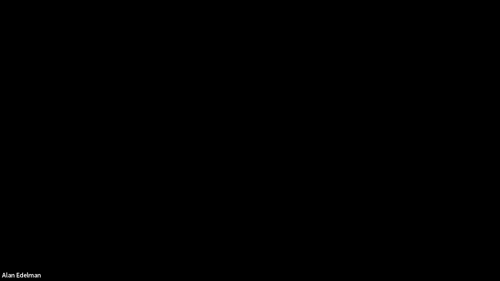
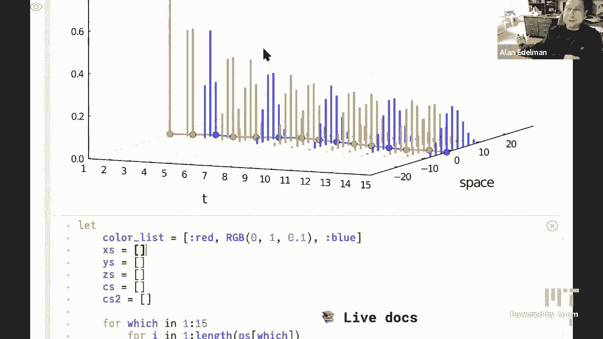

# 【双语字幕+资料下载】MIT 18.S191 ｜ 计算机思维导论-Julia(2021最新·完整版) - P13：L13- 随机游动 2 - ShowMeAI - BV19g411G7ab

so i've uh put the thing in dave the，hey can you see my slides，screen yep we see random walks too。

so i think the plan today is to，do a little bit more with random walks。

and depending on the time can you see my，okay and depending on the time to also。

have um a fun discussion on discrete，versus continuous，is that was that me that had no that was。

me i killed it，and you see my slides screen yeah，we see random there's another one。

great so hi everybody welcome back to，another lecture in，thinking，at mit at 6 soa 318 s191。

so as alan said today we're going to，have the second lecture about。

random walks so we actually had a small，technical problem，with the video uh of the last lecture。

and so we，have only just been able to actually，upload that video，to the youtube channel so if you're。

watching this uh you probably want to，actually look at the previous video，first although。

they're reasonably independent at least，to start with，okay so what are we going to see today。

well we can just more about random walks，and what we're going to see is that。

if we have an object we can actually，define a way that we want to visualize。

view that object when we when we ask，julia，you know to just display the value of。

the object we can actually customize how，it does so and we'll see。

that in action using structured matrices，ago，we had various kinds of matrices with。

structure by which we mean that we know，where there are zeros in the matrix and。

then we um it turns out that in julia if，we actually，uh julia has predefined types that。

that represent such structured matrices，like lower triangular for example。

and when we display them it will display，them in a nice way，then we'll see uh this function called。

qmsum which does cumulative sums，and we'll see how we can do vectors。

which contain vectors inside them so，each element of the，sort of outside vector is itself a，vector。

and then we'll once we've constructed a，vector of vectors we often want to put，them all together。

and that's called concatenating them and，we do that with uh for example the。

cap function cat for concatenate，and also um look at two ways we can draw。

uh plots in three dimensions i think，we've already，mentioned these which are heat map and。

surface from，both from the plots。jl okay so let's，start off with。

uh a nice diversion apparently which，will turn out to actually be related to。

what we've been talking about so that's，pascal's strike so probably you saw。

pascal's triangle at high school or or，sometime previously，and uh just to note that of course as。

usual，i i think it's stigler's law that says，that，uh the the person after whom a concept，is named。

is never the person that actually，discovered it and indeed，pascal was not the first person to study。

studied，centuries before in india persia china，etc，and here's a link to the wikipedia page。

which has links to you know，documents that um show how it was being，studied in other countries。

much before pascal but pascal apparently，did you know contribute a lot to the，understanding of。

this triangle so what is pascal's，triangle，so we can generate it in julia i've，a。

number capital n and it generates this，matrix that we're seeing here。

and the way it does that is by calling，this function called binomial。

which generates what are called binomial，coefficients，so what other binomial coefficients。

they're actually，uh you can think of them as the k entry，on the nth row。

is the coefficient of x to the k when，you expand out one plus x to the power n。

so um so we could actually do this，symbolically in julia but uh maybe。

maybe i don't have everything set up，right now to do that，but if you think about you know what is。

one plus x squared，i'm just going to expand out the，plus，x squared and so if you look at the。

coefficients of each power of x you get，1，2，and then one and that is exactly what we，see on this。

row of the matrix one two one and so um，you know if we do one plus x cubed we'll。

get one plus three x，plus three x squared plus x cubed and so，that's where these numbers come from。

that's one place they come from，and this is called a binomial it has two。

terms that's what binomial means，and so these coefficients that we get，when we expand this。

product of all of these things what are，we actually calculating you can think of，writing this out。

i write that out as one plus x times one，plus x，what am i actually doing i'm just。

choosing one of these two，objects from each parentheses each，set of parentheses and so the。

coefficient，is actually the number of ways that i，can choose um。

you know one one and one x the number of，ways i can choose that is y two。

for one from the first bracket and the x，from the second or，an x from the first bracket and then one。

from the second so there are two ways，of doing that and that's what this，coefficient is。

and so uh there's a this function，binomial to calculate that in julian。

and what is that actually doing it's，there's a formula for that in terms of。

factorials and you can write that out，and as usual you know if we wanted to。

know exactly how julia was calculating，it we could do sort of。

edit binomial of one two or whatever and，it would take us to the source code。

and you can look at exactly how it's，implemented which we won't do right now。

but feel free to do it yourself，okay so note that in this matrix because。

of the way these binomial coefficient，coefficients are defined。

it does not actually make sense to talk，about，n uh binomial of nk also called。

n choose k uh it doesn't make sense to，talk about that，at least and this interpretation has。

coefficients，for k bigger than n and so it just fills，all of those，uh if you look at this matrix。

it's actually kind of difficult to，visually，note notice that all of those elements。

are zero so actually you would kind of，want to，that's kind of there's too much visual。

noise those zeros are too，you know it's difficult to to pick out。

which are zeros and which are not zeros，and so we might want a different。

representation of that matrix，and so if you notice this matrix the。

coefficients that we're interested in，are actually on the lower，the lower try the lower half of the。

matrix，basically they're on the diagonal and，below the diagonal and so this matrix。

is actually what we call a lower，triangular matrix，and julia has a type called lower，triangular。

which we can apply to this matrix that，i'm，that i generated which is coming from。

this pascal function i wrote so i'm，passing in 10 that's the size of the，matrix 10 by 10。

and now i'm passing it into this lower，triangular，constructor so this is a new type called。

lower triangular，which therefore has a constructor and i，can pass in the data i want to put in。

that type an，object of that type and we see that when，i do that it displays it。

in a nicer way so that these zeros have，now been just become dots，so this is an example of a type。

that's defined in julia where we，actually can，tell uh you know decide how to display。

objects at this time，so the way we would do that is actually，we do this。

by extending the show function from base，there's a function called show in base，studio。

and we will extend that by doing，something right so，let's make a new type called my type。

which has an int，inside and then we're going to do，bass dot show i need this i o。

object which is input output and，an object x of my type how am i going to，display that。

i'm going to put something like i'm，going to print to that，output stream uh you know this。

is my type with value，the value i'm going to interpolate into，that string of。

x or something let's not call it x and，we'll call it obj，x，so the value of x inside the hello，object。

close the string and then if i make an，object of that type，uh let's let's call that y。

sorry i'm going to make an object of，that type by calling the constructor。

that julia automatically provides，i type of 10 and it will should display。

y equals you know this is my type with，values，so that's basically what they're doing。

so when you generate this lower，triangular type，it prints out the size of the matrix and。

it tells us that it's lower triangular，and these are the types of the objects，inside so。

in 64 means that uh the elements of this，lower triangular matrix are of type in，64。

and matrix in 64 even though it's，duplicating or repeating this n64，that。

is being fed into this lower triangular，object comes from，a matrix with n64 inside。

okay so these are called type parameters，and we've，so yeah so what so what's happening here。

is that you know because i'm telling it，that，julia that this is a lower triangular。

matrix it actually knows，that the these zeros are what are called，structural。

zeros they are zeros that we know are in，those positions in the matrix because。

we know somebody told us that those，matrix is lower triangular，lower triangular matrixes occur in。

various important algorithms，in computer science and because of the。

way the algorithm works for example，gaussian elimination，you know that the result of this。

algorithm will be a matrix of this type，and so，you know that there are going to be。

zeros there and then we can use that，later on，um to for example solve a linear system。

with this matrix in a simple way，okay so um as a so another，another uh structured matrix。

representation is a sparse matrices，we've already seen those，in a previous lecture and when we。

display those in junior 1。6，the display has actually changed if you，remember before，to。

print out this matrix it would give you，a list of positions i comma j with。

their associated values but that hasn't，actually changed in june 1。6 to make it。

nicer to visualize now you see them，printed out in this way，just like the lower triangular matrix uh。

with these dots representing，zero structural zeros that we know are，zero because of this。

because i love that change because，whenever i just saw that list of i j and，a i j。

it never meant much to me yeah that was，uh exactly that，you know it was pretty difficult to get。

to understand the structure of the，matrix later，but the point about sparse matrices that。

actually you know，they're they're they really become，interesting when the matrix is big and。

so let's for a fun，look at um bigger matrices，from pascal's triangle and what we're。

going to look at is actually where，the elements of pascal's triangle are，odd are odd numbers。

so if you look at this table you'll see，that there are some odd numbers like，these fives。

on these 15s but there are also a lot of，even numbers so the question is。

what is the pattern in the bottom and，that turns out to be，uh actually rather interesting so let's。

do that so here i'm printing out the，sparse matrix that i'm getting from，pascal。

with this this this size right so here's，a，um i think it's one more than the size，yes。

pascal's triangle starts at row zero and，column zero，and so uh here i've actually got um。

yeah i'm numbering starting at zero okay，so as i increase the size well we see。

that indeed the matrix grows，but at some particular point you see at。

16 it decides oh that's getting too big，and since i want to since i have as fast。

matrix that i want to visualize，it actually gives me a much more。

compressed representation so this is，called the，sparsity pattern of the matrix and now。

the dots actually are meaning the，non-zero elements，right so the zero elements are now just。

displayed as blank space，and what you notice is that this pattern，of odd elements is actually rather。

interesting，and when i keep increasing the size of，the matrix，uh you get this amazingly uh intricate。

pattern，which you might know is called，sapinski's triangle，or a sort of squashed version of some。

principles sierpinski's triangle，and so um why is this happening that's a。

much more complicated question that，we're not going to go into but it's just。

uh you know nice to observe that julia，is actually，showing us this in a very nice way。

that's actually giving us much more，numbers，printed out with all those zeros i think。

there's also sort of a，simple but but big point that that i，think。

people sometimes miss which is that uh，when something gets very very large you。

really sometimes want to lose，information to make it understandable i。

mean like you know you go to something，like google maps，right when you go outward you don't have。

the level the street level detail，anymore，right it disappears i mean we've all。

seen that right and then the，county level the state level disappears，as you go out further。

right and then when you zoom in you get，more levels of detail，um so you know one might think that oh。

well when you zoom out you should just，keep everything because who wants to，lose information。

but it's always somehow better that like，when you go outward，thing。

but you know we don't always remember to，sort of portray things that way，yeah thanks okay so。

um by the way there is an alternative，way to look at pascal's triangle。

with uh just sort of change the，variables and then it actually rotates。

it so you now get pascal's triangle，rows on the diagonal of this matrix and，it sort of looks。

more symmetrical in this representation，maybe and，um yeah thanks and uh。

exactly those are the those are the rows，of pascal's triangle，in the way that we are used to seeing。

them and you know it's basically，symmetrical，now with respect to the y equals x sort。

of diagonal line，and actually that makes it this matrix，this new version can be produced from。

the previous version，by doing this particular matrix，multiplication of the original。

pascal triangle in the in the lower，diagonal form，and then you transpose that that's what。

this prime means it means transpose it's，a flip，rows and columns and this is an upper，triangle。

triangular version of the pascal same，pascal triangle and we do matrix，multiplication between those。

and we actually get back this same，version of the matrix that's when you。

thought you know everything about，pascal's triangle，new fun things come along right，so okay so。

so how do we actually get pascal where，does pascal's triangle actually come，from so you know we。

we were using these uh binomial binomial，coefficients but，um you know you probably didn't learn。

pascal's triangle like that when when，you were at school，rather you learn how to build up the。

rows so if we look at，you know this smaller version let's，remember how do we build up this。

one two one row well this where does，this two come from it comes from adding。

this one that's just above it with this，one that's the left，of that one so it's sort of adding the。

north to the northwest，you know component at each time and，that's true，for each of these uh thanks。

for each of these things i did i i was，going to to draw that out but i i didn't。

uh decided not to do it but yeah it's，easier to do，just by sketching by hand and so。

well if we think about it sorry so you，start with this initial row。

with just one one and all zeros and then，you just follow this rule and you。

construct all of these previous，all these next rows one by one you，construct the rows。

and so um so if we think about how we，would actually do that in a program。

what would we do literally start with a，vector and then we would apply this rule。

to get the next vector the rule that i，just said is adding the，the upstairs and left-hand elements。

so what is that rule actually well if，you think about it，what we're doing is multiplying this。

number by one，and adding this number multiplied by one，one，and that is exactly a convolution so。

we've seen convolutions come up，several times and here's another example，of a convolution。

remember let's remember that basically，we're thinking of convolutions as some，kind of，only。

deals with a neighborhood of your，current point but we're，doing the same operation at each on the。

neighborhood of each，point right so we're doing exactly the，same kind of thing。

to each uh each element of this vector，and the output is the output of applying。

that little local operation，which was a two dimensional convolution。

right and it was like that little three，by three window that moved along。

yeah the pixelated mario well now we're，kind of in one dimension。

and so it's not like a it's not a three，it's，it's just a two right it's the the two。

numbers one one which，slide along any one row of this matrix，and produce the next row of this matrix。

yeah yeah so it's kind of like an image，filter except we're applying it in a，different way now。

because uh we're now uh you know taking，the result，of the first operation and making that，the new。

next column and then we're taking the，result of that operation，and applying the operation the。

convolution again so this is actually，you know a new new application of，convolutions where we。

operation，on the output of what we just got，and when we do that we build up。

literally the same matrix that we had，before，okay so what does this have to do with。

random walks well this is，almost exactly what a random walk does，so let's。

uh a particular random rule so let's，look at that，so let's remind ourselves ourselves what。

a random walk is，so um you know well，so what is a random walk it's just you，simple。

simple random walk in one dimension you，start at zero for example。

and at each step each time click of a，clock，you move left to minus one or you you。

add minus one to your current position，you jump by my distance minus one with。

probability one half and you jump right，with probably，right，just like we kept doing something to。

pascal's triangle，just now we keep adding random uh random，steps to wherever we just got to。

and so okay so that those random jumps，we can think of as random variables as。

we discussed a couple of lectures ago，each step is a random variable which has，as i said you know。

the outcome minus one with probability，one half and the outcome。

plus one would probably see one half and，so every time i，generate a new copy of that random，variable。

that is very similar related to a，bernoulli random variable，every time i do that i will get a。

different answer i'll either get plus，one or minus one month，randomly and when i you know do it some。

some probably it's a distribution the，histogram i should see that，approximately half。

of the time i get plus one and a half，from the time i get minus one。

that but now what that you know that's，that's what we've already covered before。

but now random walks what do they do，they take the，that that that random variable and。

now they do it a lot of times and then，to each you know when when they have all，of those。

different random variables we're now，going to add up，the outcomes of all of those random。

variables to make the value of the，random wall the position of the random，walk at time。

n time n will add up n of these，jumps to get the position at time n of，the random walk or。

rather the displacement right so we，could start somewhere that's not exactly。

at zero at the initial position and so，the random walk is，configured as actually the displacement。

at time，the distance from the origin and so if，you think about it，these。

uh steps is actually independent of the，previous bet，so if i take a random step at time 10。

and then the next step at time 11 should，not depend，on which you know choice i made at time，10。

there are other kinds of random walks，that are more complicated where that。

choice will depend on something，but we're not going to talk about those。

and so basically what we have is that，each step，is is has the same distribution the same。

chance of jumping left and right，and it's independent of all the others，so these this is the。

very common case involvement theory，which is called the case of。

independent and identically distributed，random variables，so you know that it says what it is that。

i always thought that was a very，long term for the other，term and that's why it's often。

abbreviated as iid independent and，identically，yeah just do the same thing without any。

link between them，yeah exactly repeat the same thing over，and over again。

and um they're all independent but then，for a random walk we want to take all of。

those iid independent，identically distributed random variables。

and do something with them we're going，to add them all up，and so what do we get we get something。

like this so if x i，ice，step that's a random variable then x one，is other that the random variable。

corresponds to the first step with this，particular jump，probability distribution x two at the。

second step etcetera and x，those，those is the position of the random walk。

at time n it's just the sum of those，random variables which you could write，with a sigma notation。

and so again what we what we mean by the，sum we mean，a new random variable which whose，outcomes。

are the sums of the outcomes of，the random variables that we put in and，the probabilities。

behave in a particular way that we're，going to cover in homework。

okay so what we have but but but there's，that，at time，n we also want the result at time n plus。

one and how do we get that we get，we take the sum of these x's，all the way up to time n plus one and。

that is supposed to be actually，the position at time n plus the，nth and the step at n plus that time。

inverse one，and so if you think about it although，the x's are independent。

you know are mutually independent are，independent of each other of one another。

the s is the distances the positions at，type n are not，the right so if the position if you if。

you happen to have a path a random walk，path trajectory，that goes very far in time 100 and at。

time 101，the position will still be very far away，they're correlated。

and so they're no longer independent so，that makes it actually harder to，generate。

samples from this uh from this object，it's a more complicated object because，actually what we。

what we need is indeed what's called the，whole trajectory of this random wall。

which is the sequence of positions at，each time step，and those are given by partial sums like。

this right so the position at time one，for just if we're thinking of just。

random walks that starts at position，zero，and the position at time one it's just。

given by the outcome of the first，jump but the position in time two is the。

outcome of the first jump the same，outcome，plus the outcome of the second jump and，the。

those first two that we already recorded，that's the point right we're。

basically sort of recording these in，order and，we we are just the recorded value is。

going to be the previous value plus，whatever the random outcome at the end，step was。

and so we're recording those in order，and then we need to sum them all up in。

this way and this process is called a，cumulative sum，so here's an example with numbers here。

are my random steps plus or minus one，in the same way that we've been doing。

all along and now i want to，add those up in this way right so the，first first result。

is going to be minus one then the second，result is going to be minus one plus one，which is zero。

and the third one will be minus one plus，one plus one which is。

one et cetera so that is what this q sum，function does in julian。

so q sum of this vector of steps indeed，goes minus one zero one just like they，gets。

all of the results which are these，partial sums，and that's called the cumulative sum or。

prefix sum or scan，and，you can do this with this hume sum，function so here's another example one。

two three four the queue sum is，one three six ten which you might，recognize as the triangle numbers。

triangular numbers i notice the，trajectory doesn't，it it doesn't have the zero step so to，speak。

right so yeah exactly uh yeah so okay，that's true i should look at that。

yeah so you can do that by um，so instead of just queuing some of steps。

we want to make a new vector where we，start with zero，and then we're going to concatenate that。

zero that's what this semicolon does i'm，making an array with these square。

brackets and then i'm concatenating that，whatever is before the semicolon with，whatever is after。

and then that gives me the whole random，trajectory，so it has one more entry in the vector。

than the number of steps，so this is also like if i had a bank，account and every day i either。

added or withdrew a dollar and i'm，allowed to go negative，you know that you know what somebody has。

let you do，and this is the graph of my balance on，each and every day。

yeah that's a great analogy yeah yeah so，uh yes here's just plotting。

that vector in time and you can see that，indeed is doing a random one。

so just to note that uh if you've come，from some other languages especially in。

things like python r or matlab and you，said simulated random wars there you。

probably would have been told to use，kimsum，and that you should not do it uh for。

example with a for loop，but in julia and that's because kim sam，in those languages is more efficient。

with more performances faster，much faster and so you might think that，that's because q sum。

is an inherently a faster function than，writing a for loop but that is，is。

just as efficient to write the for loop，yourself，just，another way approximately at least of。

writing a for loop yourself，and so what's happening is that in those。

other languages it's not that q sum is，fast it's actually that four loops plus，one。

and so uh basically those languages are，just preventing you from。

doing the natural thing which would be，to write a for loop and then forcing you，to use this sort of。

other other other way of thinking about，this um，uh about this this process uh to use，this。

this function because that function is，actually implemented in。

c code it's not implemented in python or，matlab at all whereas in julia it's。

just all implemented in interviews right，yeah in those languages but in julia。

in those languages in julia this is just，just writing out a for loop。

effectively that you could write，yourself right so i could have written。

uh you know a function my cue sum，of some data that's going to be a vector。

what do i need i need a new vector，uh that's going to be let's say the same，length as v。

and so i could do that by making sort of，mu b equals similar of v。

so that makes a new copy of a a new，vector，with the same length and height as v。

and then i'm going to do a for loop for，i and one to the length of v。

mu v number i is going to be right so，the first one i need to start off，same。

as as v at one and then from two to the，end，two to the length of v i'm going to do，mu v i equals。

new v at i minus 1 plus，v at i return uv and that will，so that that should give me the same the。

so let's just check that this is all，unprepared so，uh so i'm going to do some of steps。

and my key sum of steps，those should give the same result they。

do that's great so my logic seems to be，right，you know i did adjust to the test of my，logic。

uh actually by the way there is a module，in julia，called test with a capital t which。

enables you to do these kind of，unit tests and so you can just write at，test。

you know is my mystery sum of steps，equal，to cube sum of steps and it will run。

that test and it will tell you that oh，yes that has，passed right so you can actually sort of。

add these tests to your code to make，sure，that um you know suppose i i now modify，this。

uh in some way so i you know i start，with a hundred，by mistake well when i rerun the test it。

there was an，error and it will and it should tell me，actually where that test is。

that failed uh in this case it's not，with，pluto but um you know uh。

when i put it back pluto will rerun and，now the test passes and so this is。

a great way to make sure that once you，it，or modify it in some way uh you should，write tests。

that tell you when you re-run the code，with those tests，you know is the code still working in。

the same way，okay and so now what we need to do is，test the performance so。

i'm going to load the benchmark to this，package and then we're going to do，at b time of q sum of。

steps and you need this dollars actually，i didn't mention that last time when we，looked at。

b time and then we need with terminal，do because we're inside pluto to print，out the result。

in in here instead of in the terminal to，display this this timing information。

in pluto instead of in the terminal that，i ran it from so，[ __ ] sum that built in julia 1 takes 66。

nanoseconds and now the moment of truth，what does my cube sun take and。

ah let's see so it's almost the same，speed right so，um you know i'd be more interested if。

you did something a lot larger like ten，thousand，okay so let's say cool steps oh just。

just change steps yeah yeah well let's，the round of minus one one。

with ten thousand that's ten to the，power four elements，and then uh let's do。

julius built in kyungsan with steps two，how long does that take。

and then how long does my my queue some，take，so the point is you know this is so easy。

to write in julian this is exactly the，code you know once you've understood。

what kim's home is doing this is exactly，the code that you would write。

and actually i just like looking at some，i mean i know what it is it's sort of。

like a higher level of abstraction yeah，it's it's a high level of attraction。

that's very important to have definitely，um so yeah so julius kunsan took this。

amount of time so what is these，these two allocations is actually making，the array。

right the similar command makes a new，array and you can see that actually my。

queue sum is much lower than julia built，in one and you would you might think。

oh that's because we were using a for，loop and no it's actually because。

i need to annotate this line right so，julia，don't you need the cindy or something，what right so。

so julia um by default，has uh uh bounce checks on arrays so，when you do something like v square。

brackets i you're checking，you're extracting this element number i，from from v。

and but julia will actually you know if，i do，steps of 11 it will actually tell me。

that i'm out of bounds so it's doing a，check every time i access this element。

are you in bounds or not are you，accessing an element that actually，exists in your array or not。

so i actually want to turn that off if i，write a function like this。

because i don't need it you know if i，write the function correctly i can。

sorry dangerous right let's let's give，people warnings here yeah yeah this is，dangerous yeah。

at inbounds is dangerous because you，know，i'm having to guarantee myself that i'm。

not stepping outside the bounds，julia's not going to do the work for me。

anymore that's why i have to explicitly，turn it off，so this is turning off turns off bounce。

checks right so，at inbounds turns off bounds checks，and this is dangerous。

okay so when i do that and i rerun my um，my benchmark what happens。

is that it's actually now apparently，so i think yeah it's basically the same，it takes the same time。

right so that is showing that a for loop，and julia as long as you include this，balance check。

uh to turning off the bounce check which，is what qmsum is doing。

internally then you will actually get，the same speed so that's a proof。

that you know for loops and this higher，level construct in julia are。

if you go and look at the code for qmsum，you probably will find that it's。

actually a bit complicated because it's，trying to，deal with uh cases where you have a。

higher uh a higher dimension array like，a matrix，i mean i don't think i actually want to。

do that right now，okay so to finish uh today's lecture，let's look at a different way of。

thinking about these random walks so so，far we've been，drawing trajectories of random walks and。

um actually let's i don't think oh you，did draw one trajectory okay i drew one。

trajectory so let's let's draw some more，trajectories so，uh you definitely need to try。

trajectories today，let's just um，i'm not sure why it's taking quite so。

long uh oh because it's re-running，some of these benchmarks every time now，let's just。

comment these out，okay so i'm going to um just rerun this，a few times and we'll see。

some different trajectories so let's，actually uh add some，limits on y going from minus。

i'm not sure it's still taking a long，time why is that，it's still rerunning these things so。

they didn't evaluate the cells apologies，okay so now it should be fast so。

there we go okay so there we have a，sequence of，different random walkthrough jokers。

start all starting at zero and you know，some of them go off the end because i。

didn't put enough space on my um axes，but by the way i i i'm sort of。

about can we make the circles smaller a，little smaller，but but i want to make a point um yeah。

that's much better actually，uh you know the idea that，a trajectory is a random object just。

like a number as a random object might，be worth chowing out a little bit right，that。

now the random object is no longer one，number right it's an entire，trajectory i mean i mean it's。

practically a function right like i，could look at the value of 25 or，something exactly。

yeah exactly we're generating in some，sense random functions，and if i generate you know if i make it。

make the length a bit longer，and you can see that it actually starts，looking much more like a。

a sort of stock price like we were，talking about last time，and um let's let's we can go to ten。

thousand，and let's make these yeah，something like that now we really have，yeah it's sort of。

literally you can think of that as a，function you know from zero to。

ten thousand and um it's it's sort of，really a random continuous function。

and you really can't think of these，these uh these things like that we're，basically sampling from。

a set of random functions with certain，properties a certain probability。

distribution actually right so，what we really want to know is what is。

the probability distribution of these，sort of random paths，random functions or um yeah so。

if you think it's mind-blowing to，realize that a a trajectory is is a。

random object with the probability of，its own or not but right。

it's definitely mind-blowing to me yeah，so for example if we fix our attention。

that you know in this case time 2，this，grid line here and let's generate some，paths。

um okay maybe ten thousand too many it's，too slow let's go back to a hundred。

okay so let's fix our attention at time，twenty five，and just regenerate uh that's not good。

either because，sorry my limits are too，there we go okay fix our attention at，time 25。

and ask well where is the random walk at，time 25 you see that it dances around，right at this，maybe。

add that in so，we'll just do a scatter at 25，and steps 25，and i didn't quite get it right it's。

steps 24。no it's kim sum of steps i'm set sorry，yes two songs that's a trajectory there，we go。

okay so that's the one we're going to to，look at as well，like the title to be the value of kim。

steps of 24 so you can actually see the，equals yeah or colon okay equals。

question okay so now let's regenerate，them again，and so you see that there's pointers。

dancing around and now we want to ask，well what is the，probability distribution of that。

position so that red point，is now a random number right taken from，the random tradition。

it's a random number right that is a，random number，at time 25 so where we can ask what is。

the distribution of that random number，barely an even number just just you。

could try it a few times but or you，could think about why that's true。

yeah a good well yeah if you look at the，value that's coming out it's always even。

right because it's the result of uh 24，numbers，so there's a parity uh argument uh going，on yeah。

so we can ask what is the probable，probability distribution of that。

thing and so what is that thing that，value that height，it's as alan said the sum of 24。

uh plus ones or minus ones so we，actually saw，what happens when you add random。

variables and many random variables，together，a few lectures ago what we expect to。

happen is that we get something that is，close to，a gaussian distribution a normal。

distribution so we should expect，the position at time 25 to be something。

looking something like a normal，distribution，okay now if i repeated that same，experiment。

at time 50 well i would see a different，distribution，because at time 50 i might expect to。

have gone a bit further away，from the origin than at time 25 so here，i'm going to get a different。

distribution that also should look，something like，a gaussian distribution or a normal。

distribution and i can do that actually，at all of these，times in between well let's think about。

that a second just before we do anything，right，the mean of that distribution is sort of。

i guess obvious i think，right and i guess i would expect the，know。

it's wider right it can go further than，25，i guess i expect the variance to go up，in some way。

yeah it's actually a good point yeah so，this is，probably we're gonna you know if you if。

you sort of try now to fix your，attention on 15 when i，maybe it's wiggling around more than the。

25 is wiggling around，so can we characterize you know can we，quantify all of these these qualitative。

arguments，that's what we're going to try and do so，we can literally take。

you know literally generate a lot of，paths and literally calculate these，distributions。

we could do that or we could use a，going to do，so what's the different approach we're。

actually going to think about well，if i have the the probability，distribution at some time。

how can i get from that probability，distribution to the probability，distribution at the next。

time so let's call，p with a subscript i and a superscript t，so i'm gonna。

gonna use t for the time so that it's，easier to understand，so i'm gonna call that the probability。

that s t，which is the position of the random walk，thing，is equal to i so so i is the position。

that we were just drawing，and t is the horizontal time it was just。

25 we were focusing on t equals 25，exactly so and we're wondering and i，said that i。

has to be even or else the probability，is zero，right exactly so。

exactly so s25 we wanted to know well，how likely，is it that s 25 takes on the value 10，for example。

so for example so how likely is it that，it takes on the value 9，it has probability zero because it's。

always even how likely is it to take on，the value 10，it's some number that we want to。

calculate and the sum of all of those，numbers over all the values of i。

over all the possible endpoint positions，at time 25，has to be equal to one it has to be。

somewhere okay，so but we have to figure out like if i'm，tossing 24 coins and getting plus one or。

minus one，what is the chance that i'm going to add，up to 10。 exactly，yeah okay so that's you know。

those，values together all of those，probabilities for different values of。

i that should as i said sum up to one，and those that collection of。

probabilities for all the possible，heights，is a vector actually so let's call it，the vector。

boldface p at time t this is not a power，it's just well a label saying that it's，at time t。

i i i could be negative，right yeah these vectors have a weird。

indexing they can go from sort of minus，10 to plus 10 or something，yeah the i the value of if x。

so what happens at the next time step t，plus one，well at the next time step if we were to。

take the histograms we would get a，different probability distribution which，is called。

you know p vector t plus one，so how are those two vectors actually，related。

well if you think about it how so let's，fix our attention on 25。

on position and another 25 sorry let's，fix our attention on now on。

height 10 at time t plus one right sir，and the question is no that's that's not，that's not right。

yeah well let's say that yeah so how can，i arrive at position 10 at time。

25 for example well i had to have been，at position 9，or position 11 at time the previous time。

20 times 24，and then i had to jump from those，positions in the correct direction。

so basically i have however much the，probability was，at that point times the probability that。

it jumps in the correct direction，so that i can write down in this very。

compact formula so what does this say，it just says in info in a formula what i，just said in words。

the probability that i'm at position i，and the next time step t plus one。

well i had to be at the previous time，step t i had to be at position i，i。

which can do with probability of half or，plus，is or i had to be at position i plus one。

and jump towards position i，so backwards that also happens with，probability of half。

so this is a formula that tells me if i，know what the probabilities are。

the vector of all the probabilities at，position，at time t how i get the new vector of。

probabilities at time t，how，these probability vectors evolve in time。

and this equation is often called so，it's a time evolution equation。

discrete in discrete time and discrete，space and it's often called the master。

equation which is a really terrible name，but uh that's often what it's called i。

think that dates from the 30s or，something，and um yeah as i said it describes this。

time evolution of probabilities，and so if you think about it what is。

this doing well it's actually rather，similar to something we already saw at。

the beginning of the lecture which is，pascal's triangle this is almost exactly。

the same as pascal's triangle except for，this factor of one-half。

but we're adding two things together，from the previous row，basically if you think of these as rows。

or i guess they were columns if you，think of them as columns，and you rotate your hair now they're。

rows but um basically，each column you get from the previous，column by applying the same。

kind of convolution that we applied in，pascal's triangle except now。

we also are missing the one at position，i right so before we we took the。

the one just above the one to the left，of that now we're taking。

one to the left and one to the right and，we're missing out the one in the middle。

actually it's almost the same so there's，another convolution，and so these probabilities are actually。

evolving just like，the rows of pascal's triangle okay so we，can implement that in julia。

so for example let's write a function，called evolve which just does this，calculation so here's。

the calculation so again we're making us，we're taking in we're supposing that we。

have a vector of probabilities，at time at some time and we're going to。

make a new vector of probabilities with，again this similar function。

and then we're going to loop through all，of the whole system and。

and do this rule that i just wrote down，so the time you know the。

probability of position i the new time，is a half，of this sum this convolution we could。

write that as a convolution，have a，an issue a problem which is what to do，with the boundaries。

so what happens at the boundary is if，some probability wants to jump or if，you're random walk。

you know thinking about the random walk，if you are actually going to fix some。

boundaries of the system why do we need，to do that now，because we're we're actually talking，point。

in space and we can only store a finite，number of them，so we actually have to impose some limit。

on the size of the system，and then we have to worry once we've。

imposed that limit you know when we were，simulating trajectories of a random walk。

we didn't have any such limit because it，could just wander off as far as it went。

but now we're actually trying to store，information at each of those points。

we really need to stop and say oh you，can only go up to this。

distance and then we have a problem with，the boundaries，and so we need to decide what the random。

walk will do when it hits the boundaries，so it could do different things it could。

bounce off and come back，it could go round and sort of jump off。

one side of the system and come back on，the other side that's，periodic boundary when it when it。

bounces off it's called a reflecting，boundary，and what we're doing here is called an。

absorbing boundary so we're just setting，the value there to zero the value of the。

probability and that actually，corresponds to probability，leaking out of the system so when you。

any probability or random walk that hits，the edge，just disappears just vanishes into sort。

of an infinite sea，you can think of my my system being in，contact with the the sea。

and my i'm i'm thinking of this random，walk as heat moving around and when it。

hits the sea it just sort of，dissipates into the ocean and the point。

is your sum of probabilities will no，longer be one，right so this has the weird property。

that the sum is no longer one because，some of your probability uh a partial。

probability leaked out of the system，right i mean you could think of it as，like the piece that。

you know the remainder that that would，bring you to one is now like the。

probability of being in the c，yeah that's the probability exactly you，have some probability that。

by this time you have already escaped，and that a probability adds up to all。

the other probabilities to give you one，and so yeah as i said this is just a。

convolution now the kernel looks like，this，uh so um you could write it like that。

okay we've done the probability the，boundary conditions now we have。

another thing which is the initial，condition what is the initial，distribution where do these。

random walks start or what is the，probability that they start at different，places。

so if they all start at site at position，zero at time one，then the probability of being at。

position zero is one，everything is there certain with，certainty and the probability of them。

being anywhere else of any other site i，is zero is impossible and so we just set，up a。

an initial condition that looks like，that so you know we can just call this。

function initial condition with，10 uh let's say 11 um，positions and you see that there's a one。

in the middle and zeros everywhere else，and then uh so now we can just run the，time evolution。

uh and so in order to do that we you，that，so what are we doing we're put passing。

in an initial vector，p0 which is the probability distribution，at time zero。

and then i'm making a vector that，contains that object，so that is actually going to be a vector。

of vectors right so if i have，uh sort of p zero is initial condition，at。

uh of with 11 cells i already have a p0，somewhere else，in this。

the initial condition in this case i put，and it's taking ages to run hey maybe。

i'll just point out that your micro，sentry is sort of coming to an end，yeah so um if i put。

square brackets of p0 i actually get a，vector，and inside that vector it has just one。

element which is itself a vector，so that is what i meant by a vector of。

vectors vector containing vectors，and then um so let's run this time。

evolution and what i'm going to get back，is a vector of vectors。

where the vector at time uh the vector，num element number，four for example is the probability。

distribution of，random walks at time four then i can，visualize that in various ways。

i would jump to the 3d visual at this，point if you don't mind okay yeah so。

here's just this is the the time，evolution，um of the histogram，you know spreading out so this is a。

spreading process，and then we can show this this in three，dimensions so。

here we have time on this axis and so，we're starting with everything at，position。

one and then you see that it's spreading，out over time as we go along。

and um we can also see that with the，random wall trajectory，uh which is this line on the bottom and。

every time i generate a new trajectory，you can see how it，full it moves around and and and so。

these bars are actually，telling me how likely it is for this，blue dot to be in each of these。

positions，okay so that's the uh so so，you want to run a few more random walks。

just so people could stop working，you know if you fix your attention for，example on this blue dot。

you should see that it visits different，sites with these proportional to these，probabilities。

so it's very unlikely to be kind of far，away and it's，very likely to be to end up not very。

likely but it's more likely to end up in，so hopefully that visualization makes it，kind of clear。

in what way what does it mean to have a，probability distribution right。

we're drawing each of these histograms，at that time，is a probability distribution for the。

position of the random walker at that，time，and um averaged over all of these。

paths and then we have a probability，distribution for each，position and i hope people actually。

could see that，there's pascal's triangles basically，there in the sense。

you know that i mean if you want to，think of this as 1 and，one one literally divided by two so it's。

half half and，four，right and this is one three three one，divided by eight。

right and you know if you recognize，those numbers and that continues down um。

and so this is in some sense uh，a kind of picture of pascal's triangle。

you know normalized by two to the n in，each row，okay so um you know random walks are。

as i uh as we said last time very，important and very interesting and。

and and actually contain a lot of，beautiful mathematics so like pascal's，triangle comes back to。

you know suddenly without us kind of，expecting it，and um yeah so there'll be some more uh。

questions about that in the homeworks，yeah i guess we'll do the screen。

continuous next time i have some fun，stuff to say but yeah that'll have to。

