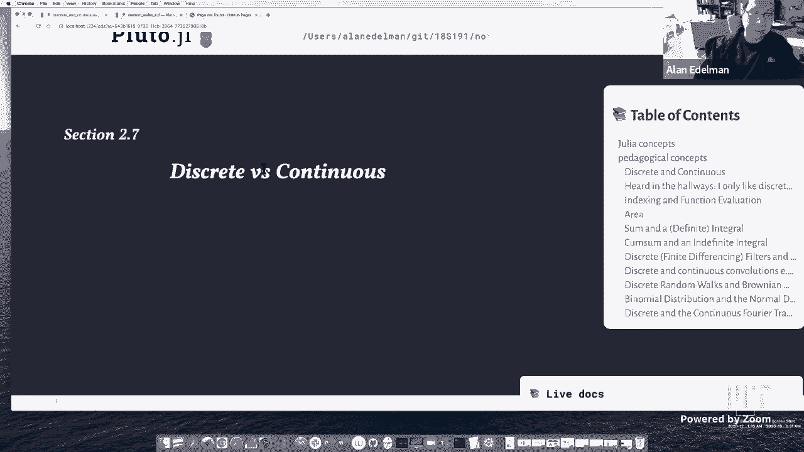
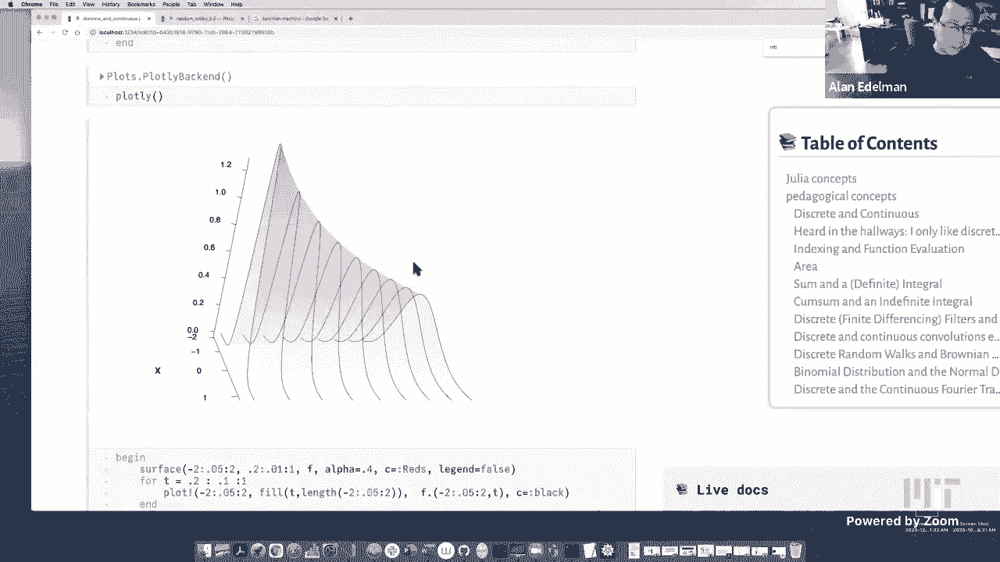

# 【双语字幕+资料下载】MIT 18.S191 ｜ 计算机思维导论-Julia(2021最新·完整版) - P14：L14- 离散与连续 - ShowMeAI - BV19g411G7ab

uh，so so today you can get quite，philosophical about it，it's about the interaction of the，discrete。

with the continuous so，i hear lots of people saying i love，discreet stuff and other people saying i。

like continuous things，and so i thought i would like to put，together a bit of a lecture。

that kind of has my own feelings about。

the discrete versus the continuous so，i'm not sure，i have that many julia concepts。

in this lecture maybe as i go through，i'll find that i really do and i'll add，a few of those。

uh we do have some very fancy html and，css type printing，the truth is when it comes to css。

and html and formatting i really don't，know anything about that but。

what i do is slack over to fonz the，inventor of pluto and he。

knows all the fancy ways of doing things，and if you want to try to figure out how，that works great。

uh otherwise you could just use it like，i do but i do have，um the the i mean i think this talk is。

the，the pedagogical ideas uh one of which is，of course，that uh is that these kinds of of pluto。

lectures let you do curiosity-based，learning and in particular this lecture。

what i'd like to do is talk about，different，communities so if i'm going to talk。

about discrete and continuous，let me try to at least give some sort of。

definition of discrete and continuous in，fact，without very advanced math it's kind of。

hard to describe，discrete and continuous and so more，often than not。

what you do is just sort of define it by，example，so perhaps probably people are familiar。

when one talks about discrete math，objects one thinks of things like。

finite sets like here here's the，sequence going from one through a，hundred。

uh or infinite discrete sets like the，integers，uh i i don't think that the rational，numbers。

counts as discrete math it's it's some，people may know that it's countable，they're。

in a certain sense they're as many，rational numbers as there are integers。

um but they're not separated and so i，think the rational numbers are not，discrete。

maybe one can argue about that，absolutely so here，what i've done is i grabbed the julia，package that。

draws random graphs just because i，wanted a picture of graphs and。

i started to grab a pic one picture off，the internet and i thought oh。

that's not so much fun and so dave told，me about this particular package。

so this is a graph of a random social，network and i'll tell you it's。

even harder to talk about continuous a，picture，to show continuous math this one i did。

take off the internet i kind of liked it，there's a real number line。

and i like the way they very colorfully，took different kinds of numbers like pi。

is like transcendental，with integers right the square root of，three is is a。

algebraic number right x squared minus 3，equals 0 has this as a root。

but it's not a rational number uh the，other three numbers are rational here。

this one's a repeating fraction with the，bar over it uh here is one that's。

expressed as a decimal expressed as a，fraction，so uh it's kind of hard to。

define continuous but hopefully many of，you recognize that，uh when you take limits when you have。

sort of entire intervals，when you have surfaces these these，correspond，to the continuous and。

um i hear this all the time as a，professor，you know some students will tell me i。

only like the street math and others，will say，i only like continuous math right and i。

hear that a lot i，i hear that from students i hear it from，professors believe it or not。

and it's definitely not unusual and here，i'll just sort of move this。

up and dave will probably say to make it，bigger，you know it's really not unusual to。

gravitate towards the discrete or the，continuous，um but what i would like to to say。

is is a number of things first of all uh，the discrete and continuous i think。

we're always blurred but i think more so，now than ever that uh for those in say。

computer science and other discrete，areas，machine learning has become very very。

popular as you all know，and all of a sudden continuous，optimization，uh derivatives gradients the。

i've never heard i i hardly ever heard，the word gradient being used in the。

in the hallways where computer，scientists lived until the last couple，of years。

so so continuous math is finding its way，into computer science through through，machine learning。

uh maybe it's always been there in，signal processing anyway but but maybe，more so now。

data science and statistics also has，become very very popular these days and。

that has a lot of continuous ideas，so maybe it was always true uh but i。

think more than ever that continuous，math is，is finding its way in places where，discrete math was。

was always used oh and i just caught a，typo，and since i can fix it i will um if i。

could find it quickly again here let's，see，m ticks can i find that。

i'll fix it so if this was a blackboard，i would erase or stick it in right here。

if i can can i do this quickly there we，go，all right spelling ever fixed um so but。

let me say two more things，about uh continuous math，and that that that uh you may have never。

thought about maybe you have maybe you，haven't but，if you have if if you have a very very。

large discrete object，uh it's it's usually valuable to turn it，into a continuous object。

it often a very very large discrete，object sometimes often maybe not always。

it wants to be a continuous object and，when you turn it into a continuous。

object it's it's often simpler you，you keep the sort of the good part the。

thing that's really happening，and you kind of remove the unnecessary，details that a。

a large discrete system would have and，so，know，uh models with thousands and thousands，of states。

and it just became clear that the，continuous version is，just so much easier to work with so so。

my one point is，continuous math can be simpler than，discrete math and i'll give you some。

examples of that，and uh and maybe an even more important，example is this message right here。

that the combination of continuous and，discrete is probably way more useful。

than either one alone and，be，much more useful if you can think in，both ways and so。

in this course we would like to，encourage you to do so if you're not，already doing that and。

finally when it comes to applications uh，machine learning i already mentioned but，you know epidemics。

climate change um it just shows how，important continuous math is these days。

uh we're all affected by our physical，world of course um，the epidemics of pandemics maybe or。

should i say pandemics i'll change this，to pandemics，so i'll check it in later so pandemics。

climate change，we're also affected by the the physical，world which is。

very very often continuous okay，so now to move on to some details，the。

the discrete and and the continuous and，how they might work together。

by a very simple example indexing and，function evaluation i'd like to consider。

these two at the same time，right so the idea that i'm thinking，about is。

i've got a vector v and i'm pulling out，the ith element right so。

very often if i have a vector v in math，i would write it as v sub i。

if i wanted the eif element and a，function like a function machine right，like you know。

let's see if we can get some pictures of，function machines so。

oh there's a cool function machine yeah，so you can find these by yourself but。

here here's a functioning machine，that's uh it has inputs and outputs。

right so you all know about function，machines，so you know i i think of these as very，different。

maybe it's sort of psychological but i，don't think of v，sub i as a function of i。

i just think of it as as grab the ice，element i mean maybe it's just the way。

my brain works it's just，oh like i've got them all in a row you，these。

just grab it right well when i think of，f of x i think of more like a function，machine like。

evaluate the sine of x or the square，root of x you know or，or some more complicated function i。

think of a process as opposed to sort of，picking out an element，right so well of course a moment's。

thought tells you that a vector is just，hard，concept but i wonder how often people。

think about the fact that，a vector is really a discrete function。

in that the argument is simply taking，the values one through，n and the evaluation is v sub i right。

and so，uh the input to the function machine is，a number like，five and the output is v，like。

like this continuous function might be，right so，uh let's think about this a little bit，more。

with code so for example suppose i had，the numbers 2，through 20 in a vector right and so here。

maybe this is a little bit of julia，because i'm，i'm using the semicolon as we've seen in。

one of the homeworks to，to expand the range into the actual，vector of length 10 2 through 20。 so。

here we have this vector 2 through 20，and of course if i use square bracket of，7。

this is going to extract an element from，memory kind of like my，view。

of picking out the seventh element right，i'll get that 14 out because it's，picking it out。

of course there's probably some address，calculation deep inside the computer and，so there's。

there's actually a function that's，happening but on the surface level this。

feels like picking out the seventh，element right we're indexing into a，vector。

we're really just picking out the，seventh element okay，however if i actually index。

into a range object itself and you'll，remember that，the difference is this really is the。

vector that you see above，it's the vector of length 10。 this is，just three numbers。

it's a beginning number two a step size，of two and an ending number of twenty。

right so there's only three numbers in，the computer so when i evaluate，is i。

am calculating two i originally had four，i am calculating 2 times 7。

so so this is a function evaluation in，every sense of the word i。

am i've got the function which takes i，to 2i，and that calculation is happening right。

in julia it is a function，now you might think i'm belaboring the，point perhaps i am。

but i really want you to think about the，fact that that that，this is as much of a function as if i。

actually implemented the 2x function，directly，of course this function only applies on。

the range of numbers from 1 through 10，right if i try to apply it to 11 i'll be，sorry。

right because it it i've got that bounds，error，right and i certainly can't apply it to，pi。

right it's like that's an invalid index，right，but if i take any of the numbers from 1。

through 10 that is the domain of my，function and it works so works fine。

okay as opposed to this function where，actually i could calculate of course。

f of i could actually take f of pi，and so forth all right so any which way。

v is a function input function machine，all right let me move on maybe that was，look。

let's talk a little bit about area okay，so the，the let's talk about the area of a。

circle using regular polygons，okay so i i had fun putting this，together i have a。

a i have a unit circle here whose area，is pi right this is pi r squared pi，times one squared，through。

and uh so let's go back to three，so and i'm going to do the usual thing。

that probably many of you have seen this，in high school as well。

um i'm going to represent it i'm going，to try to calculate the area by。

inscribing a polygon i could have also，circumscribed it but i'm just going to。

do the inscribed polygon，so i could take 3 to get a triangle 4，makes a square。

here's the exact area this i think of，this is as a discrete area like a，discrete approximation。

to the area right and somehow the，limiting thing is the continuous circle。

so here is a sixth gone a seven gun，um an octagon like a stop sign。

uh nana god decagon there's a dodecagon，i don't know the the fancy。

prefixes beyond that but you know it's，kind of fun to see，the limiting process you know we can go。

all the way here i've got this little，pinwheel thing going on here's 100。

you know once i've inscribed 100 gone i，mean i guess to the human eye it looks，like it's。

fully over the circle but you see that，it's only the three decimal places at，100 even it's，0。

999 okay pi right that's the，result so uh so if you try to sort of do，this with a hundred gun。

you know a hundred gone and try to get，it you know you don't you certainly。

don't have full precision on on a，computer you get three digits though。

so uh so so when you see things like，this，you tend to think of the continuous，limit as far away。

right like infinity feels like it's a，long distance away right it's gonna。

it's gonna take a long time to get to，infinity right like forever。

right so so when you think of the notion，of limits and and，you know and the number of sides going。

to infinity，i mean just you know i i again this is，sort of how my mind works i don't know。

if you've ever thought about it，but i tend i i think of infinity as as，far away。

right it's not nearby and so you might，be surprised to find out that。

uh sometimes infinity is not nearly as，far away as you might think。

and so i'm going to show you something，that i think is a lot of fun i'm going，to define。

an area function that takes in the，number of sides，and you might have already kind of seen。

the pattern up here right when s was 100，the area was 100 over 2 times sine of 2，pi over 100。

so this is sort of an exact formula i，mean we we we've，we've got computers we can have evaluate。

the area of this hundred gone，and so here's an area function and what，i'd like to do。

is evaluate this for，um starting with a square and working my，way up to。

two to the tenth right that would be a，thousand twenty four gone。

and see how close to pi we get right and，again it's kind of a little。

disappointing many of you will know that，pi is，3。14159 and so even with，inscribing 1024，getting。

that you know enough digits that are，revealed here all right well like i said。

1024 is not infinity you have to go a，little bit further，right well wrong in a way and this is。

i'd like to show you a carefully chosen，convolution，of the numbers we had so convolutions。

are showing up everywhere，so let's let's do some more convolutions，okay so，you。

zero means i mean i could have written，that，this will be the zero step of an。

analysis that i'm about to do，so area zero is just to remind you it's，the area，of polygons with。

sides with number of sides let's you，know with，numbers with number of sides。

equals and we're starting with a square，and we're going all the way to。

2 to the 10th which is a thousand twenty，four，okay by the way i always encourage。

everybody to learn all the powers of two，up to sixteen，so comes in handy you'd be surprised。

should i quick side story when i was a，graduate student this was a long time，ago。

um somebody called up i was a graduate，student in the math department though in，in。

over in in what's called building two at，mit in the basement，and i got i answered the phone and。

somebody said can i talk to somebody i，like to talk to to anybody who knows a。

little bit about probability，so i had you know it was a very strange，phone call i took him and said。

we're lawyers we'd like to hire you to，testify in court what is the probability。

of two or three coin tosses you know，coming up heads，i said oh i could do that that sounds，like fun。

so i went into court and they asked me，what is the probability of 16。

coins all coming up heads right and i，just happened to know the number 65536，for various reasons。

and i just shouted it out and the，lawyers were very impressed as if i。

calculated in my head at that moment，so i would absolutely encourage people，to learn powers of two。

so here i'm taking the powers of two the，nine powers of two starting at two and，ending at ten。

right so the square all the way to the，1024 gun okay，and now what i'm going to do and i'll。

explain why this works later or maybe，you can figure it out for yourselves。

is i'm going to do a convolution what，i'm going to do，is literally uh let's see if i could，draw this。

example，here let's let's do this one um i'm，going to take，four thirds of say this one i mean that。

with all convolutions this will be a，sliding window，and i'm going to subtract one third of。

this one right，i'm not only going to do that here but，i'm going to take advantage of my。

scroll to show you that i'm going to do，it here as well i'm going to do it here。

as well i'm going to do it here，this is a convolution right here i am。

taking advantage of my medium that，this stays over there right so i'm going，to do this for。

every pair of consecutive numbers okay，so i can，kill my convolution and i just did that。

i mean there are a lot of ways i could，have done it i did it，uh here with a comprehension okay。

and when i do that okay，oh look at that i've got a lot more，digits 3。14159。

so that's kind of cool that somehow，there's a，there's more digits of pi hidden。

in these in these numbers but you can't，get there，as quickly by you can't get to infinity。

but the numbers are there you just have，to know，this convolution is somehow exposing，something。

that was there how's that for a fun，surprise okay and so，here's a little function that fonz gave。

me and，uh this is color good bad which actually，what it'll do is it'll take the first。

number which is the test you know the，pi and another number which is an，approximation，black。

and the bad digits in red right so，that's kind of fun，and so here let me。

let's see oh did i not uh i'm going to，show you this in a minute but。

all right here let's hold off on that a，second so anyway here's，here's the game of playing。

what happened just hold on a second you，know what here let me let me。

let me show you the final answer it's，more fun and then i'll show you how i，got there。

okay so this here this first column，is the set of numbers that represent the。

areas of these polygons this was the，area of the square，this is the octagon this is the 16 gon。

the 32 god，and so forth this column here represents，exactly the the in here i'll put it back。

with my little，uh this is exactly the one where we take，four thirds of this。

with a convolution and minus one-third，of this and you'll note。

that look at all the digits of pi that，we get，okay just by doing this little trick how，cool is that。

okay and you can see that if you do this，if you do sort of the ordinary thing you。

can kind of see this linear，path right and here you see a linear，path but it's with a steeper slope。

right oh that's sort of interesting okay，well，if this is a good idea then maybe it's a。

good idea to do it，again and in fact there's a magic，sequence of numbers that let you do it，again。

and i think you'll see the pattern，fairly quickly here i'm going to go，minus 1 15 and minus 16 15。

okay that's uh it's just above here，and i get even more digits of pi。

coming out look at that i almost have a，full set of digits of pi。

how is that possible i always stopped at，1024。 i only had something that was good，to five digits。

and yet somehow i was able to get all of，these digits are pi，pretty cool huh okay then i keep on。

going again maybe you can，see the pattern uh this this time i'm at，64。

 this is the one that's on the screen，one，and i subtract 1 over 63 of the less，good one。

and i get these many digits and if i，could clear the screen you can see that。

in the end i get all the digits of pi，come out，right if i keep pl if i know the right。

convolutions to do，all of my digits are pi are there okay，so，this is where my point is that knowing。

continuous，math and discrete math at the same time，is somehow more useful than one or the。

other on its own，right that how would you know to do that，how would you be able to figure out that。

all the digits of pi are there not by，going to an infinite limit an infinite，limit would take。

you see the difference is the infinite，limit if i had if i could sort of give，you the idea。

you would have to go all the way down，this way at this sort of gradual slope。

right instead the encouragement is to go，this way by using you know some，interesting。

clear thoughts here okay so let's clear，these drawings，and um say some more about。

let's tell you why this works okay so，i'll give you a feel for why this works，so。

many of you would know the taylor series，for，area as a function of the number of，sides s okay。

and it's quite easy wait something's，something is missing area what is it，it's 2 pi。

what was it let's look back up just to，see，what was the formula s over two times，sine two pi。

over s that's so do i have that right，it's just the latex there，s over two yep this is correct okay。

this part i know is correct so this is，the area formula，and if you do the taylor series uh。

so this is the taylor series works for s，large because taylor series。

around zero right this is going to be，small it expands out，and basically these are just you know。

this is three，three times five three times five times，seven right these are just like powers。

of odd numbers or something，in，to play so so uh anyway this is the，explicit formula。

and you could see that as you double the，number of sides in fact i kind of，expanded it。

i got rid of the i rewrote this kind of，without the distracting constants and so。

the area you could see，is pi you know minus something over s，squared plus something over s to the。

fourth now when i double the sides，of course this becomes 4s squared this，becomes 16 s to the fourth。

and so think about it think about what，would happen if i took。

four thirds of these but i could draw it，again here with my little picture right。

imagine i multiplied this by four thirds，if you can and i multiply this by minus，a third。

and i add well first of all the fact，that these two numbers add up to one。

tells me that i'll get pi back as sort，of the leading behavior。

right four thirds of pi minus one third，of pi is still pi，but this particular combination。

will kill the one over s squared term，you see that，if i multiply this by four i i kind of，kill this。

right and then the fact that then，otherwise these are opposite sign。

kills the entire term so all of a sudden，i've killed this，and i'm now left with something that's。

the leading behavior after the pi，part is s to the minus four now。

all right so that's how this all works，right so there you know。

which a good magician does tell us this，tricks i don't know，to，use this combination if i double the。

sides，my error more or less goes down not by，four now but by 16。

okay well you could keep playing this，game and，the part that's important is not the。

constants the only part that's important，is that this is s minus two s to the。

minus four s to the minus six and you，know s two minus even numbers。

right if you have all the all the，numbers not just the evens，you'd make some slightly different。

choices to make this all work out but，because this was，even the even powers of two that is the。

powers of four，are what's relevant okay and so that's，why you probably you'd probably。

notice the pattern here when you could，look at it almost in the code。

uh that you know i was taking 16 15，minus 115，and then i was taking 64 60 thirds minus，163rd。

128 127 for my right so there's a factor，of four going on，right and then one less so that's all。

due to the fact，that i have s to the even numbers okay，and so。

um we could do this with julia using big，i don't know if i need maybe dave could。

tell me if i ever needed the big of two，but i just started uh i wanted to see。

how many digits i could get if，i carried the pi to more decimal places，because。

after all eventually you've only got 16，digits of pi，when you do floating points and so i。

want to see what would happen if i，carried more digits，and you could see so i'm going to do the。

same thing i'm going to i'm going to go，from 2 to the first to 2 to the 16th。

okay and i'm going to do a big area，calculation，and i'm just going to show you the last。

answer okay so this is the，this is now 60 just to be very clear，i've inscribed。

60 65 000 gone into a circle，and i've measured the area and，this is what i get but if i do the four。

thirds minus one third convolution，look at all the digits i get i mean this。

is probably more than floating point，accuracy i think，okay but i can keep on going now look at。

all the digits i get，right and i just did it again because i，was having so much fun。

and i got these many digits okay and，then i went this far，and well you get the idea let's see how。

far did i get so，this was this is i went up to 65536，and you can see that there are these，many uh。

correct digits is that really right，four one nine seven one six three nine，five one oh。

it's five oh yeah i just wanted to see，it here yep，so yeah so i got i got tons and tons of。

correct digits just by knowing，how to sort of basically pull the，information。

out of this limiting sequence okay all，right that's one point about。

areas of circles let me make another，point about the area of a circle。

so i uh i wrote another program that，that approximated the area of a circle，by。

here let's go down to but by basically，uh making uh by by by basically putting。

like graph paper around the circle and，counting how many squares are say，completely inside。

there are other ways to do it you could，do that intersect or that。

that are not completely outside but i，decided to count the ones inside。

okay and this is a 2s by 2s square，just to you know you know just to，mention that。

uh what my s is for whatever reason i，made the square，that i made the sort of but not。

this is sort of like a four by four grid，right so this is a 2s by 2s。

grid is my point we could start to see，what happens，uh here we have a six by six grid。

we get about a little more than half pi，uh here's an eight by eight grid。

the way i did it actually i mean i，probably could've done a little better。

but i just to say drawing lots of，squares，i figured out the biggest square that i。

could inscribe that's the red one，and then in some sort of dumb way kind，of naive way i。

i found all the little blue squares um，and just checked if they were all inside。

and you know you could see that this is，heading，towards pi right uh one of my favorites。

is i think was it 32 this kind of caught，me by surprise，so i'm i'm still at 30。 it's drawing。

lots and lots of little squares，okay but at the level of 32 was it 32，oh maybe it was 30。

 there was one answer，that surprised me maybe it was 30。 i'd，have to remember now。

let me just see if it's 30。 uh yes 30。three，i guess there are some engineers who。

i've heard feel that you know，three is a perfectly good uh value for，pi。

so at 30 it actually turned out to be，exactly three，but here's this speaks a bit to my point，that。

the this discrete object the one where，you count，squares is messy。

i mean i think everybody would agree，that you know you could do better than，what i'm doing now。

but it's got some sort of arbitrary，detail to it like，who's exactly on the inside and who is，it it's。

it's you get these weird numbers right，going to be，pi a very simple thing but as you。

head to that limit you get these very，very messy things and that's。

that's my point that the discrete can be，much messier than the the continuous，limit which is。

one of the reasons why continuous math，has has some value，but now there's something else i want to。

say and i wonder if，this will make sense to everybody but，i'm going to try this one's a little bit。

more philosophical or maybe it's a bit，more，of a sort of how mathematicians do，things。

but i want you to think a little bit，about，the two ways i just got area right so，there's this one。

up above you know where i inscribed，you know i got this pinwheel you know。

the polygon inside and this way and i'm，sure you all could imagine other ways。

i could get area of a circle right i，mean i could，i mean i guess i could do it with my。

with my pen here so，maybe i will right i mean i could，i could do a hexagonal tile right now。

this this one color won't come out，let me get it i need to get a dark color。

um yeah let's see there we go yeah so i，could have，hexagonal smaller than this but you know。

or right or，i could have you know other weird shape，shapes right there's nothing that says。

that it has to be，you know but anyway i could cover this，with with other shapes。

and we all have this intuition that，no matter how you cover it what kind of，shapes whether you。

whether you whether you have a regular，polygon or，squares or hexagons as they get smaller。

as the shapes get smaller and you fill，up the region，they're all going to converge to what we。

all know as，the area right we're i think the concept，of area is very intuitive we。

we probably understand the notion of，area even when we're，fairly young i suppose uh you know you。

know，how much paint you need to paint，something or i don't know how we get the，notion of area but。

one way or another we probably have the，notion of area from when we're。

we're very young but i would like you to，for a moment，to delete that if possible。

imagine you didn't have an intuition，about area，all right can you do that for a moment。

for me i mean maybe it's not so easy，because，it's so rooted in our experience but i。

would like you to forget，that you ever knew anything about area，okay i want you to be like you know。

you're smart，inquisitive people but you never learned，about area right just never even it。

didn't happen you didn't see area in the，real world，okay if you could do that for me then i。

would like you to ask，the question well how do i know these，different things。

will converge to the same number it's，you see without intuition for area。

you know it's not logically required i，mean i know we're so used to area it's，hard to believe。

but if you think about the logic it is，not logically required，apriori that all of these different。

approaches to measuring，the area discretely will somehow，converge to the same answer。

is it i mean i mean you know i'm so used，to that that it will。

i have to really push it out of my mind，no it's not obvious maybe you get a，different answer。

if you used hexagons versus squares or，triangles，right you know little little maybe。

little triangles which could be，a little more than pi i mean i don't，know right。

it's not i mean just think about it it，is not at all，you know mathematics lives in its own。

logical universe right it's not about，painting，it's not how much paint you need it's a。

mathematical question，can this do these all have the same，answer，and of course people you know。

mathematicians have rigorized this and，they have proved，uh using techniques from something。

called analysis，that that they do all have the same，answer right。

and you see here's the big point of all，when you have a whole bunch of limiting，processes。

that give you the same answer no matter，how you get there，right it didn't matter whether you use。

squares or triangles，if all of these different ways of，getting there give you the same answer。

then this thing is an object this thing，is a mathematical object and it deserves，a name。

like it deserves to be called area right，and so this happens a lot in math where，discrete。

things uh you know it doesn't matter how，you discretize but when you go。

to the limit you will get the same，answer and，mathematicians then say this thing has a。

name it exists，it deserves you know area exists okay，so i would like to bring this up now in。

the context of the random walks that，we've been，talking about so if i may move on。

so i i would like to remind you here，let's get rid of，let's get rid of the the writing that。

i've done，let me show you the some，you know a beautiful plot that dave，showed in monday's lecture。

let me remind you that he showed this，picture of，what one might call the binomial。

distribution i mean this is really just，a，this is really just norm a kind of，rendering of。

a normalized pascal's triangle and let，me kind of remind you quickly。

what what he showed you if maybe you，weren't there or，but let me remind you what this is all。

about uh pascal's triangle，here i could sort of write it out over。

here if you don't right so here are some，of the first，couple of rows of pascal's triangle and。

uh the way this is rendered is here's，one，right if you sum across the rows right。

you get powers of two right so i think，everybody knows that，it's like one plus one to the n right so。

what we're gonna do is normalize it to，have area one，so what's plotted here is a half a half。

right and then，what's plotted here is at the height one，quarter one half。

one quarter right and what's plotted，here is like，1 8 and 3 8 right that's the purple。

three-eighths and one-eighth right and，so this is really，a rendering of pascal's triangle it's。

it's not much more than that，now we also interpreted these but as a。

picture this is just pascal's triangle，there's nothing more there's no，probability。

that you don't need to bring a，probability right it's just pascal's，triangle a very discrete object。

i should say right i mean pascal's，triangle is often taught in in high。

schools or even earlier and it's you，know，you could just build it by just adding。

numbers right having adding small，integers and so，everybody could play with pascal's。

triangle it doesn't require special，knowledge，okay uh but we also interpreted this as。

probabilities right that，this this uh i'll remind you here i，actually。

switch this over to plotly but uh，oh i don't know depending on the view。

this is actually almost harder to look，at than，the at what point i i like moving these。

things around but，to get just the good view can be tricky，i've gotten a good view before。

but anyway i think you could see that uh，you might remember that we had this。

random walk and here let me just sort of，try to emphasize it with my。

right can you see the random walk i'll，try to sort of emphasize that these dots，got too big but。

anyway there's a random walk i'll over，emphasize it with my squiggly。

uh that the random walk there's this，walk，right here's one instance of one，instantiation if you will。

one instance of this random walk and，i'll remind you that，if you if to an observer sitting at one。

place let's say，somebody sitting at 10 which is this red，place right here。

right to an observer sitting at 10 and，uh asking what，you know so you know what。

this is time equals 10 by the way the，observer so i guess，maybe i shouldn't say an observer。

sitting there but somebody who's only，taking measurements at time 10 might be，a better way to say it。

and you see where is this random walker，in his random walk right he's going up。

and down and up and down right and at，time equals 10 right somebody's noting，where it is。

and then i'll remind you these are the，probabilities of landing at various，different points in space。

okay so that's what this curve this is，doing，it's it's basically saying that your，probability of。

being you know something like the tenth，row of pascal's triangle is。

those are the probabilities right the，probability of being at i，is is going to be something like you。

know the binomial coefficient，10 choose i or i don't know if it's zero。

based or one base but something like，that，okay so let's talk about the continuous，now。

because this kind of can blow your mind，right so there is the concept of，a continuous object called。

a a continuous random one but let's，let's go slowly just to make sure that。

uh maybe we'll focus on the red at first，here let's let's do，uh yeah let's let's focus on the red。

this red here is a random walk，but instead of taking a instead of，flipping a coin。

and going left or and write，to do，is at every step i'm going to。

take a normal distribution with just a，little bit of variance that it's so that，the。

amount of variance corresponds exactly，to the，to the random walk where i'm doing the。

bernoulli right so，the red shows sort of a kind of discrete，random walk。

and what i could do with my little，slider i think i have to make this，smaller so you can see it。

is of course here let's go ahead whoops，let me see if i can make this point。

clearly i'm trying to make my，here we go actually，supposed to be able to grab the slider。

and move it where'd it go，i moved it where'd it go oh no，where did my slider go it went all the。

way there，there we go i got it my slider went，all right fine let's just leave it here。

sometimes it's hard to just grab it and，put it where you want，so yeah let's let me。

first just focus on the red okay，here's a random walk that just takes two，steps right。

i'm going to my first step is，uh yeah，so so the horizontal axis here is time，maybe i should actually。

let's actually label that so there's no，confusion，x label time，okay and my y label is。

position that's where i'm going to end，up right so let's，label it so there's no doubt about where。

things are，and i want time to simply go from zero，to one that seems to be a convenient，normalization。

and this says that at time a half，you know i've managed to move up a。

little bit it's just going to be a，normal，i'll say exactly what normal。

distribution is what variance but i，generate a normal random variable。

and it goes to here and then it goes to，here now what i could do。

is uh kind of do what i was doing with，the polygons i could sort of double the，number of time steps。

right now i could take four steps and，here you could see，sort of a random walk with four steps。

okay uh，i can go a little further uh here i'm，actually taking。

what am i taking i think i'm taking six，steps right or，and or is it two to the fifth i've。

already forgotten no it's two to the，fifth it's just like the polygons。

there's two steps four steps eight steps，yeah i'm doubling every time，right and so you see i make。

i'm i'm going i'm taking smaller steps，in smaller time，and there's a limit to this thing okay。

and this is what's called brownian，motion，okay and the notice that this。

this this discrete object the f4 the red，this discrete object is，is is a function that takes on。

discrete times right like here let's，just go to the beginning here right so，this is like my v sub i。

that i started with right i can evaluate，this function at zero。

and a half and one now i drew the linear，interpolant because it's fun to do that。

uh i didn't really have to but um but，really this is，zero a half and one it's really a。

discrete function i mean maybe，you would have even preferred if i，actually went ahead，and um didn't。

draw the yeah maybe we'll is that going，to work，no that didn't work why didn't that work。

uh dave tell me um and what happened，i don't oh oh my dots are too small。

that's my favorite i wanted no no it，worked i just didn't see that one。

okay yeah so this is a function i think，it looks better this way。

this is a function that takes on only a，value zero a half and one。

right and then when i do this i've got a，function that's zero，a quarter one half three quarters and。

one and each one of these，you see i know it looks like i'm just，looking at the value。

of this of this continuous function at，those points，but really as a random variable this is。

just a normal distribution，okay it is i can go all the way from，zero to a quarter by just。

generating a normal random variable okay，dots，and i get right i get what ultimately in。

the limit would be，the continuous brownian motion okay of，course i could do this again。

my point is that if you if you follow，the middle dot，you follow that middle dot as i do this。

this is a normal distribution，okay and i didn't have to generate the，big blue curve first。

right i just wanted to match it up uh，but if i was only interested in the，statistics at time a half。

right i would just draw that normal，distribution and in fact if you look at。

the code that i'm doing to actually，uh do this sort of thing it actually，where is it。

oh i don't know where it is oh but it it，basically does，well it basically what it's doing is。

it's making a step size of，one over n okay but the，variance is what has to be proportional。

to the time，so so let me i'm saying too much let me，kind of slow down a little bit and say，this that。

uh yeah let me let's let me let me kind，of emphasize the key points that i'd。

like you all to walk away，okay so let's come on，is that let me just see why that is。

let me just see if i can type one plus，one i'm always happy oh yes。

oh now it's working okay let's let's go，to the level of like，16 dots or something okay so so。

my point number one is i can generate，this by taking，uh normal random variables my next。

question is which normal random，variables，the answer is at every step it's going，to be mean 0。

and variance 1 16。 okay so that when i，get to the end here the variance will be。

one which is kind of a nice，normalization，so basically what's happening as i，as i uh as i。

as i generate new instances as you've，seen before that，the dot over here whips around the least。

right its variance is 1 16。the thing over here is got a much more。

variance right it's going to be one half，right so the one in the middle and of。

course the the end like like the end of，a string or something is whipping around，the most。

it's going to go with variance one okay，and i can now what i can do。

is of course i could go one level of，refinement and，this step to here is a normal。

distribution with mean 0 and variance 1，over 32。right so every step here is mean 0。

variance whatever 32。 okay，uh i'll do it again this is 1 over 64。

right if i went up to to 9 it'd be 1，over 512。okay so uh and so that this thing。

has a limit you see and the funny thing，is it doesn't really matter if i took a。

normal distribution or i took a，bernoulli，thing，that as long as you have a nice，that's。

proportional to your time step you get，the exact same limiting statistics。

okay in other words brownian motion，doesn't care whether you flip the coin。

whether you've rolled the dice or if you，did a normal distribution。

okay and so this is an example where，this limiting thing exists to。

mathematicians exist just like area，existed okay it exists because it。

doesn't matter how you got there，that anything you could observe about。

this funny looking stock marketing curve，can be gotten whether you you flip the。

coins or roll the dice，okay and that is sort of the interesting，thing about continuous math。

okay so i mean what could you do about，you know this is a continuous curve，where i noticed。

i know the statistics at every point um，you could actually check that。

pairs you know what what's what's the，what's the correlation between pairs of。

points or the covariance，between multiple points anything you，could statistically measure，did it。

okay and so that's it's in a way，that is why this brownian motion thing。

which kind of seems sort of complicated，a little bit，really is a simpler object than the。

bernoulli you know the coin throws in in，the limit，right it's i mean the pascal triangle。

gets sort of complicated with all those，n choose k's，right but this thing in the limit sort。

of does really get，simpler in a certain sense if this one's，less familiar than area。

but once you get familiar with this if，you've never seen brownie emotion before。

you start to realize that the exact same，thing is going，on okay well i'm about to run out of，time。

but maybe i'll just quickly mention that，you know the continuous limit of a of a。

row of pascal's triangle，is actually just this bell-shaped curve，right so if you actually were to。

as you look at the you know if you look，at this picture of david's from last，time，of。

pascal's triangle it wants to be a，bell-shaped curve，you see it wants to go down and spread，out。

right and and you know this this could，be done with continuous variables right，and so。

at a time at a very small time you know，almost zero it's a spike。

and then it winds down this by the way，there are a lot of physical processes。

that work like this in time，onion，at a certain time right this is and then，somehow measure the smell。

smell，is near the onion and as time goes by，it diffuses okay and this is。

indicating sort of the strength so at，certain distances as you go on or if you，put a heater。

say if you put a heat source right and，then you let time go by you watch the，heat spread around。

again it diffuses lots of processes in，the physical world diffuse and here。

is the continuous version of so this was，this picture，um probably it's pointing the wrong way。

or whatever but，you know i could probably turn it around，so if i if i go。

plotly which lets me turn it around，then um i could make it sort of line up。

maybe with dave's picture，yeah so you know you can do things like。

uh let's let's how do i do the zoom，where's the zoom zoom zoom，zoom so yeah you know。

again it's fun to play with these things，right so which way this it was this was。

more the orientation where，like it's sort of hard to do this way，but you get the idea。

this is the continuous version of of，uh that pascal triangle picture that。

dave showed last time and so this thing，evolves basically through。

a discrete process right you you know，you sum the previous rows and and。

divide by two to normalize okay，and this evolves by a continuous process，which is。

basically the continuous limit of the，same process this，involves a differential equation okay，and so。

uh if you if you it's a partial，differential equation，uh but it's a differential equation and。

that those are the right words and，maybe the the real thing is i'm not。

trying to to to either scare people who，or just，repeat repeat what you might already。

know if you've taken the differential，equations class，what i want you to do is to recognize。

that these processes are the same，they have a different language which，might be itself sort of scary。

right we talked about taking derivatives，versus，you know taking taking differences we we。

there's a whole different language to，the continuous and the discrete and。

and that's sometimes a bit of a turnoff，for those who are not as familiar with，these things。

and and i'm just here to tell you that，the discrete and the continuous are two。

sides of the same coin，all right i've got it's two o'clock it's，the hour here on the east coast。

