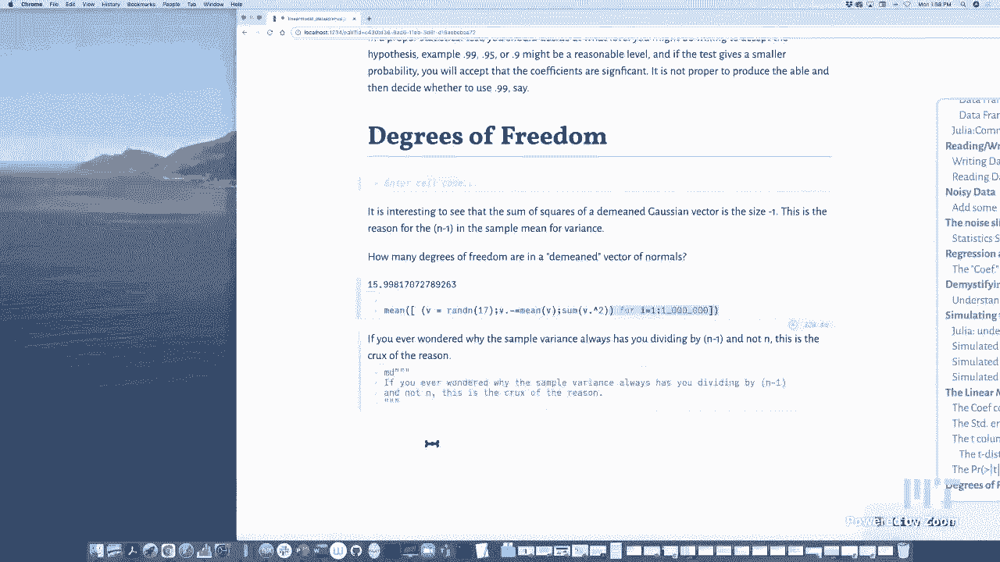
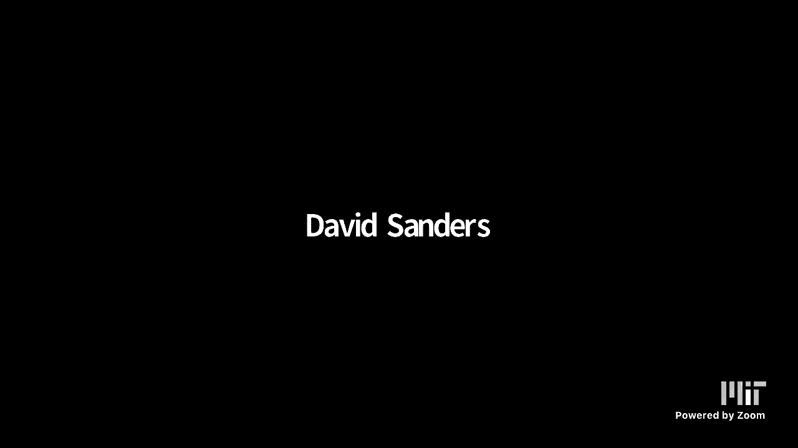

# 【双语字幕+资料下载】MIT 18.S191 ｜ 计算机思维导论-Julia(2021最新·完整版) - P15：L15- 线性模型和模拟 - ShowMeAI - BV19g411G7ab

yes，great okay well uh welcome everybody out，there on the internet，to today's class of computational。

thinking a quick announcement，for the mit folks that uh starting on。

wednesday we're going to switch from，zoom to stream yard，and it'll be instructions on piazza and。

in canvas，on how that will work so we believe，that'll work better in a certain ways。

we'll give it a try，so today will be on zoom and on，wednesday we will be on stream yard。

so today's lecture is going to be，a data science lecture continuing with，our second module。

and we're going to try to understand，these uh statistics some of you may know。

you may have may have run these，uh statistical packages or on a，calculator。

uh on a computer you get these you get，these tables out there and if you've。

ever done that you might have，wondered what it really means it can be。

very confusing when you first start out，and one way to kind of really get a，grasp of what these。

kind of，run an artificial simulation yourself，and，when you're able to to run a simulation。

very very fast，we can get a lot of data and we can，really get to understand it so。

what do i mean by all this well let me，take a very simple，set of data um so what i'd like to do。

is simply grab some fahrenheit and，celsius data，so i could change the number of data。

points here's 10 data points，we can make it 100 data points um，probably。

10 will do for starters so let's just，take 10 data points，and what i'm going to do is in my x。

here i'm just going to take a bunch of，random numbers between minus 10 and 100。

so that'll be my the x-axis will just be，some fahrenheit，and the y-axis will be some celsius。

numbers and so the，the standard formula to convert，fahrenheit to celsius。

is to take 5 9 times the fahrenheit and，subtract um what might look like a funny，number 17。777。

but it's really just 5 9 times 32 which，might look like familiar numbers。

okay so we could do this a bunch of，different times we'll get different data。

i'm actually listing the data here in a，matrix format，just below at the bottom of my screen so。

here we'll just，pick one here it doesn't really matter，which one okay and so this is some data。

that we have，okay and now the first thing i want to，show you，is uh how one can organize data with。

labels，and so julia has the concept of a data，frame which，excuse me i'm sorry which originally。

started out，in the r statistics language okay and，it's incompatible also with like，me。

show you how you build a data frame okay，and so with the data frames package it's，quite easy。

all you have to do is uh，you have this constructor this data，label。

equals vector right so we have the，degrees fahrenheit equals x degree，centigrade equals y。

and you see that a data frame is really，nothing，but the same matrix that we had over。

here it's very you know it looks a lot，like this matrix，except that it has the columns are，labeled。

right we have fahrenheit and center，grade while matrices we think of as。

unlabeled right i mean you have a row，index and a column index，but other than that you don't get to。

sort of label it you know red green blue，or fahrenheit centigrade or。

uh and so sometimes when you're handling，data，labels are very very important so here，data。

is fahrenheit and centigrade and the，other thing you can notice that。

for a data frame columns can have，different types，so here in this array everything is a，float64。

the integers that were on the x-axis got，converted to float64s。

here the fahrenheit remains integers the，center grade is，float64 so you could have different。

types and that could be handy，okay so uh so that's a data frame um。

you could build a data frame straight，out of a matrix you could take the，matrix x。

y like i had over here right this is the，matrix x y，you could take a data frame of x y which。

will convert it to a data frame，you could add the columns later if you。

like i can rename the columns from some，default，to be fahrenheit and centigrade but。

you'll see that if you do that，of course they'll both be float64s which，explains。

why this data is formatted a little，differently it's got the dot，right so probably that's not as。

desirable as just sort of listing，each column separately okay so。

uh of course you can also convert back，to go the other way if i've got this。

data frame and i want to convert it back，into a matrix，all i have to do is is use the type。

constructor you know for matrix，and that will convert us back we will，lose the label information。

but at least you can if you if you want，to if you have some other program。

that only handles matrices and doesn't，handle data frames，then at least this will work okay so。

i've already mentioned this comment，about types，so if you're handling data the simplest。

sort of thing that you might want to be，able to do，is read and write it to a file right and，so。

let's go ahead and write this data to a，file，so uh here this this one。

here will actually write it to a file，called testcsv，right and so i can actually look at it。

here on my mac yes，right and open it up with some mac，spreadsheet like program。

and here you see that i get the very，same data，uh in this spreadsheet right or if i if。

i had a lot more data if you want it，would be no problem，and i uh and i used the。

the csv dot right which is from the，csv。jl，package then we can take a look at。

it here and you can see，i've got i've got a hundred，items there they are from one through。

100 the very same items that were，uh，this is a mac program it's sort of like，and。

google sheets but the point is it's just，a commemorative comma separated value，file。

like any kind all right let's go back to，10 again i don't know why but。

let's just play with 10 points，okay so there's that and um，and once it's written of course we。

there's here's the data，um we can actually read it i'll call it，data again and this。

brings it back from the file into a data，frame，okay so um and i should mention that if。

you want to sort of grab the first，column，of you can you can，either reference it by indexing the。

degree f，column so you can do it by label or you，can do it，by the position so the second column。

right or if this uh this is the first，column i should say let's do the first，column。

right so i can do it by label or by，calling，you，is uh is is that very often you're going，file。

you're going to want to bring it in as a，data frame and so this is。

this is one of many many ways in julia，that you can do it this is。

one common way to just bring the data in，so you can start，playing with it okay well now that we。

have the data，what i want to do is talk about the，statistics simulations。

and so what i'm going to do is take the，fahrenheit and centigrade data。

and make it noisy okay i'm going to，i'm actually going to to noisify it if，you will。

i'm going to add some random noise to，the original data，to simulate a kind of experiment i don't。

know whether fahrenheit and centigrade，is sort of the，the best world analogy but it'll do but。

what i'm going to do，is i'm going to add noise right so here。

i'm going to play with lots of different，noise of different，at different levels okay here let's。

let me keep it relatively small for，yeah whoops let me just grab it set it，down。

i think i moved the slider a few too，many times but here let's add just a，little bit of noise。

and you can see here let's close this up，for a second so we can see what's going，on。

so you can see that，if you look at the if you look at the，table here you can see that i've got。

noise at different levels，okay so just playing with the noise，adding it。

and in the picture below we don't really，need to see this so here let's just look，at it like this。

red line，is the theoretical line that converts，fahrenheit to celsius。

okay so you could see that zero degrees，celsius goes down to 32 fahrenheit and，so forth。

okay so this is the the theoretical line，and，uh here i plot it with these red dots，the noisy data。

and i also made the best fit line the，least squares line，that fits through this data and so if i。

had very little noise it all lines up，and you can see that every time。

i kind of you know click on my fingers，we get a different data set even at the，same level of noise。

so what i really want you to think about，is we've run an experiment。

right we're running an experiment we're，measuring temperature，and we have a thermometer that's maybe。

not so accurate，okay so there's there's noise in the，measurement of of of your data which is。

very very typical in the world，and so you end up with getting a uh。

your line is not the true answer if the，noise is little hopefully it'll be near。

the answer if i start adding more noise，lot，and you're going to get different。

answers so so much of statistics so much，of elementary statistics when you get，into the。

you know your first class in statistics，it's all about，what to do given this sort of situation。

so let me repeat myself because this is，kind of important，you run some sort of experiment in the。

real world and，you don't get exactly what you learn in，sort of a theoretical class right。

because the real world is，filled with noise and so every time you，do an experiment。

you get noisy data you don't get real，data and you can fit it in this case。

with a line in other cases you could fit，it with other kinds of curves。

okay and every time you do this you get，a different line，okay and so here i am i measured ten。

points and i got a line，okay i'll do it again i get two n two。

ten different points in a different line，right and so every time you do this。

you're going to get a different answer，and the real question statistics is。

given that you're in this situation，you've measured 10 points say。

what can we say about the answer how，good is the answer，how much confidence should we have in。

this straight line right and so that's，what you do in a statistics class。

by the way in a linear algebra class，maybe in other and，perhaps in other classes as well you。

learn how to fit the blue line，right you'll get that best fit line。

that's standard practice for example in，mit is linear algebra class。

and it probably happens in other classes，as well but what you won't see in a in a。

linear algebra class，is how to interpret the errors that you。

have right and that that's very much the，world of statistics to figure out you，know what are。

what are these errors you know the fact，that you're off from that line what will，that tell you。

okay so if you have ever，done any of these sort of statistics，things you'll see that you get these。

kind of，mysterious tables okay and so here i'm，going to produce a mysterious table。

and i'm by the end of this lecture，you're going to understand what all，these columns and numbers。

mean but you know these tables，always seem sort of mysterious to me and。

that's that's why i'm calling it a，mysterious table，uh because in part i don't know how。

these numbers are calculated well now i，do and you will know。

as well and in part because it's hard to，keep straight what are the assumptions。

that that like why is this the table，that's，forget about how these numbers are。

calculated for a second why is this the，table that that everybody is。

is using right what what is it about，this you know these are like analysis of，variance。

anova maybe you've heard these terms，what is it that that makes this so。

interesting to a statistician，okay and so that's what i would like to，show you and。

we're going to use uh the fact that we，can，do we could do a simulation we could。

pretend you know we have a thousand or a，hundred thousand or a million，the world。

and we get some data and we see what，happens and so we can actually simulate。

all the assumptions that are behind the，table like this，okay so first of all to kind of。

get things started let me，point out that we're going to use the，noisy data the very same here let's。

put it back over here so you can see it，all right，the noisy data is exactly that。

that data frame that we saw before it's，it's a table of 10 fahrenheits。

and 10 centigrades that come with noise，okay so it's 10 fahrenheit and 10，centigrades that are not。

quite the exact answer it's a noisy，version of the exact answer。

okay and uh what we're going to get back，line，is and how much confidence we're going，to have in it。

so that's what we're going to do we're，going to explain this so let's start by。

talking about regression okay so，regression by the way，is uh is is a terrible word it doesn't。

even mean what it sounds like i，have here a link if you want to。

if you want to see it yourselves as to，why is it called regression anyway。

um it does seem like the word should be，updated but it's probably too late for，that。

so here you could you could read about，galton's use of the word regression。

and where it came from i've heard people，say things like，you know i've heard these phrases like。

oh machine learning is just，fancy regression and i always i find。

such phrases mysterious or at least i，did it first，because to me machine learning is about。

like figuring out something you don't，know and regression，as it's used in statistics it's about。

fitting a line，and at first it sounds like they have，nothing to do with each other but then。

you realize that，what machine learning is all about is，fitting parameters to a model。

and here you're going to see that you，know linear aggression is just。

your model is that you have a slope and，an intercept，and you're trying to find the best ones。

and really that's what machine learning，is all about you've got lots of。

parameters so you're just trying to find，the best ones to fit the data you have。

um so that's why people say that that，that machine learning is just big fancy，regression。

but i'm getting ahead of myself let's，talk a little bit，about fitting these lines so，points。

these these red dots are exactly the，data points you see in this table。

right you could see there's a data，points at -2，another one at 19 right at 25 and so。

forth so this data here，is exactly what you see in the red dots，okay。

and this blue line got computed somehow，you'll see in a second how。

is the best fit line in the following，sense，of all the lines that you can have you。

can drop the perpendiculars the，verticals，and you can sum up the squares of these，distances。

and this blue line here is the one that，gives you the，minimum of that sum of squares right so。

the best fit line，is the one that in some sense kind of，minimizes。

all the possible vertical distances and，if you ask why，squares and not absolute values the。

answer is that，uh to be honest the square to minimize，the sum of the squares is easier to，calculate。

than the sum of the absolute values it，was a sort of thing that people could do。

with pencil and paper back in the old，days，and so the squares kind of became the。

easy one to fit it has nice theoretical，properties，you could minimize the sums of the。

absolute values i mean on a computer it，won't be that big a deal。

but as far as i could tell it doesn't，happen as much as the sums of the，squares。

but there are other metrics you can use，too some of the squares are still。

the classic so you might ask how did i，get this blue line i mean to specify，this blue line。

what i would need is a slope and an，intercept，and i'm just going to sort of throw a，few formulas out。

but not i don't really want to go into，too much detail the first formula。

is uh is is a linear algebra solution，uh so i'm calling this data here x and。

this data here now i'm calling it，yy here i can let me annotate a little，bit here just to。

keep it straight so i just wanted x and，something that looked like a y。

the original data the non-noisy data was，y the noisy data i'm calling yy。

i chose these letters because i kind of，think that，x often looks like an independent，like。

y is a function of x typically in，mathematics so i thought it'd be easier，if i just。

use the notation of x and and something，that looked like a y，so what you do is you，has。

x down the second column and one's down，the first column，right and then you do a least square。

solution with the，y and that actually gives you the the，slope and the intercept and many of you。

will or have learned this in maybe a，linear algebra class you'll。

you'll see a formula like this for uh，for calculating the the slope and the，intercept and so。

this is the linear algebra formula which，gives you，um the answer for the it's actually the。

intercept and then the slope，right i'm using the the high school，notation of b for intercept and。

m for slope and uh if you look at these，numbers like minus 18。3221，you'll see oh minus 18。

321 that's that，very number over there，okay or 0。534 is the slope。

and you'll see that is the very number，that's being computed in this table。

okay so the the first column is just the，intercept and the slope，given the data that you have if you。

haven't seen the linear algebra formula，there's a sort of more basic formula，which gives。

exactly the same answer so，all you have to do is plug in your，your x data and your y dependent data。

and，uh it's really simple n is how much data，you have，x zero is the demean d means right we。

remove the mean，x y 0 is the d means y，okay and then we're going to get an，it。

m estimate m for slope and e for，estimate，and it's simply for those of you know，it's the dot product。

of of the d mean x and the d means y，divided by the sum of the squares。

uh it means it's easy to see um the，intercept，it's easy to understand how to use the，formula。

exactly why this formula works is not，something i'm going to do today it's not。

hard to explain but we're not going to，do that today，b the intercept is is uh maybe。

once you have the slope you could see，the intercept is is，is the point on the line which has the。

mean of x，and the mean of y so this formula i，think is easy to understand right it，says that。

that the intercept plus the mean times，the mean the the slope times the mean of，x is the mean of y。

okay and then um i'm going to throw in a，noise estimate which is the sum of，squares。

divided by n minus 2 for various reasons，okay and so，the b，estimate is the same number computed by。

linear algebra the m estimate is the，same number computed by the linear，algebra formula。

and we in addition here have one more，number，which is a kind of uh is。

is is some sort of estimate for for the，variance actually of the noise。

uh you see this is kind of a cool thing，actually because，you run an experiment and you measure。

and then you fit the line，and you see the real world doesn't tell，you what the。

the noise is but you can actually，estimate the the，the size of the noise and this is how we，do that。

okay so let's kind of bring it all，together with the word，model okay so statisticians say we have。

a model，okay and even the word model i think is，takes a little bit of discussion as to。

what do we mean by a model，like what what what are we modeling what，what are the assumptions。

um what do you have what do you guess at，it gets a little bit tricky。

so in the case of a linear model what，are we going to assume well in this for。

this lecture i mean you could do，whatever you want there are a lot of，other things you could do。

in this lecture we're going to assume a，linear model，with standard normal noise okay and so。

the model is going to be that，our our independent data is，x our dependent data is y and we're。

going to assume that，the way y gets generated in the real，world，is that y will be mx plus b。

right it'll be a linear function of x，plus random noise，that has in our case it's going to have。

mean zero，same，you could change this but for now we're，going to assume that the noise。

is for every variable is the same，okay so what that means is whatever it。

is you're measuring whether it's its，temperatures or，heights or or iqs or anything out there。

that you might be measuring，we're going to assume that somewhere out，there in the real world。

there's an intercept b a slope m and a，sigma，model，says that they exist they're but you。

don't know them that that，the real world is built this way and the，way i like to say it。

is the x data is known and we're going，to make the measurement。

so we're going to get y and every time，we make that measurement。

that measurement is going to be noisy，but we know，that the world's the assumption of the。

world that we're going to have，is that that noise is a standard normal。

and when i do it many many times and at，different places i still will get the，same variance。

now again you don't have to make that，assumption but this is sort of the。

standard linear model that is the，assumption，of the linear model okay so you've got，this model。

and then you go out there and you get，some data，right so we have we have data points on。

a vector x and a y，and from that data we can get we don't，we don't calculate the true b。

as you saw but we will get an estimate，for the intercept the estimate for the，slope。

and in my code i showed you just before，the code was right up here。

you also have an estimate for sigma that，comes out，okay so uh it's an estimate and if you。

ran this many many times you would get，different estimates，okay so so a statistician would。

would say that these are estimates based，on your data points if you ran the。

experiment again you get different，to do this，in julia i'd like to run this many many。

times so we could actually see，how good this is how good are these，estimates。

all right so that's what we're about to，do but let me make clear。

in this model there really are three，kinds of variables，i i feel that it's worth distinguishing。

three kinds of variables，there the model variables bm and sigma。

which are unknown and i guess in the end，they remain unknown you might have，estimates for them。

but in the end these variables are，unknown there's the predictor variable。

x that's considered fixed unknown and，then there's the response variable y。

which is noisy okay so that's the kinds，of，variables that we have okay。

going back to this table here then，this table is built from in in this case。

10 data points okay so we have 10 noisy，data points，and we've got this particular table so。

first of all，you even this looks a little mysterious，so let me explain this。

this little bit of output over here，might look a little bit，uh interesting and what what this means。

this is sort of，a statistical notation it means that the，celsius value we're calling it y。

is going to be dependent on，on on on well it's going，it's good this is sort of funny but it's。

going to be some coefficient，times one plus another coefficient。

times the fahrenheit number right it's，like a linear combination of。

one and the fahrenheit okay and so，um this is saying that we're going to。

we're going to tell you what these，coefficients are so，just it might be helpful to kind of show。

you a generalization of this notation，if a statistician said that y is。

you know related to or twiddles，1 and x1 and x2 and x3 it's really a，shorthand。

for saying that y is some constant，plus another constant x1 and another。

times x2 plus another times x3，okay and so we're assuming these are the。

these are the variables that this，depends on，and now what we're going to do is。

actually do some sort of statistical，test to see，whether we believe this or not whether。

whether this is truly dependent on this，or not，okay but before we do that。

let me do what i promised i would do and，run many many many simulations okay i。

want to simulate the real world，by running many many noisy values okay。

so i've got my little simulator here，and all i'm going to do i'm just playing。

with other distributions，but all i'm going to do is take my，fahrenheit data。

and i'm going to do what i believe the，real world does，i am going to add random noise to my。

true answer，and then i am going to estimate，using the the code that i had right over。

here this code right here，i am going to estimate many many times。

the intercept the slope and the noise，okay i'm actually going to do this a，hundred thousand times。

okay and just mentioning that uh，since this is hard to read and julia，can't do this with a comma。

because it would get confused with，tuples um we use underscore，to which almost as easy to read as a。

comma so，just mentioning that as a digit sim，creator but，here we go let me go s is let me。

do a simulation all right so remind you，let me remind you that。

when i do when i do the simulation i'm，going to get oh，look i spell links right when i do the。

simulation，i'm going to get a hundred thousand，answers and let's see what they all look。

like let's grab the first one，the first one is three numbers okay and，i'm just going to remind。

you that this is the first simulation，and we're going to get the intercept the，slope。

and uh the the estimation of the noise，of the noise sigma right so and every。

one of these are going to do this，right i'm going to do this 100 000 times。

right here's the second one here's the，third one，right so i'm going to do this so。

and i'm going to to plot this so here，let's do this for different sigmas。

just to just see what happens so，you see let me let me say something very，clearly。

getting data is normally a very，expensive proposition，right i mean here i am with each。

simulation i'm getting 10 data points，right，and i'm getting these 10 data points a。

hundred thousand times，in the real world it's usually really，hard。

to run an experiment a hundred thousand，times right，but this is a computer and i can i could。

simulate running an experiment，a hundred thousand times and i've got。

the benefit of knowing the truth，i know exactly the theoretical，fahrenheit。

celsius conversion okay so i can do that，by the way can i get a quick sound check。

again just to be sure everything's okay，dave everybody can hear me yeah。

everything's fine all right cool，all right just like to be sure okay so。

uh we can you saw i added noise i could，add just a little bit of noise。

or i could add a lot more noise and each，time i run 10 data points and i，calculate。

an intercept i get an answer，and you remember the the actual true，answer is at minus 17。

7777 it's at this，white line，right that's the true value of the。

intercept from fahrenheit to centigrade，right that's the true value we're set to，grade a zero right。

fahrenheit is minus 17。777 so uh，uh what did i say that backwards i，always get confused but anyway。

um uh let's see how does it work，when when center grade is zero，fahrenheit is。

32 uh and when fahrenheit is zero it's，integrated no is it right centigrade is，minus 17。777。

yeah so there's minus 17。777 right there，and interestingly enough when。

i go and run this sort of noisy，experiment，it looks like the the these different。

intercepts that i get，themselves form on a normal distribution，and that is。

something that statisticians discovered，probably like more than a century ago。

i'm sure maybe even a couple centuries，ago，that's exactly what happens that this，will be。

a normal distribution and it will be，centered，exactly on the true mean right at minus，17。777。

so instead of just asserting it on like，a blackboard，with julia i was able to to do this。

simulation 100 000 times，pretending and you could see that well，we may not get the true intercept。

exactly we may be too small we may be，too high but，at least that it is centered on what is。

the true intercept，okay so uh here you could see i，actually computed to a few more places，number。

777 um here's the first one，this is uh it's pretty close right four，decimal places or so。

um it worked out you know with a hundred，thousand data points it's not hard。

so uh you could see that this assumption，that，while the interest any one intercept。

based on 10 points may be wrong，on average it will be right uh，interestingly enough we could also。

compute the standard deviation of the，intercept since we have 100，000 numbers and uh。

i can tell you that statisticians know，an exact，formula for the theoretical standard。

deviation of what it'll be，and so i'm just going to type this，formula without proof right now。

this is the theoretical standard，deviation not the empirical one this is。

the one that the math promises，and you could see you know two decimal，places on that one but 0。

49 i guess，and 0。49 is the sample standard，deviation，there，that's that's the intercept what about。

the slopes okay so just to show you，where i am in the，today's lecture um we did the intercepts。

what about the slopes，okay well if you do the slopes，and i think that i don't need the legend。

here so let's just turn that off，so the slopes also seem to have a normal，distribution。

the true slope is five ninths or 0。555，and so that's what i have in the middle。

but if again you may be off because，after all the real world is noisy。

what's really happening here is that，you're seeing that the real world is，noisy。

but in a sort of structured sort of way，okay and again i could，change the sigma we can make it。

smaller or bigger and that'll，right that'll narrow it down right the，the lesser。

the variance you know the closer to sort，of the theoretical number an experiment，will。

have okay so you know this what this，does is put structure，on noise it's not just sloppy noise like。

you know you sometimes might imagine but，this noise has，very very careful structure but by。

assumption，and so that's what's happening and so，the the sample mean we could take a look，at it。

the mean that we got so the truth the，truth slope is five ninths or you know。

point five five five five like that，um and look at as many decimal places。

for the slope right we get a lot of，decimal places，for the sample mean when we round the。

experiment a hundred thousand times，okay and again the standard deviation is，sim。

then and here is the true theoretical，answer since i know the exact sigma。

uh and you could see that even this is，giving you like three places，do。

is see if we can actually estimate，sigma the noise we added remember i，deliberately added sigma。

but the person who does the 10，experiments that gets the 10 data points。

they don't know sigma only i know it so，uh but we're，go，we actually get this yeah let's leave。

and you'll notice that the，distribution of the estimated standard，deviation。

is not normal anymore right it's a，normal distribution is symmetric this，thing's got this。

long tail going on right this is，not this distribution of sigma as well。

i mean for starters standard deviation，is always positive right and so it。

couldn't be normal i guess because i，mean just just because normal。

distribution is allowed to be positive，and negative on the low real line。

but you do get some other thing and this，this is，what you get and uh the mean。

is kind of i mean for a distribution，like this，maybe you think the mean ought to be。

like where the maximum is，but then when you think about it you。

realize that there's kind of a lot going，on to the right with the whole tail。

and so that kind of shifts the mean a，bit to the right，of of the location of the maximum and so。

this white line，here is exactly the true uh，is the true minimum okay and。

the other thing i should mention here is，i actually divided，uh in a way to make the variance exactly。

one and normalized it，um and when you do that you get another，distribution this is where the sort of。

famous chi-squared distribution，in our case with n minus two degrees of，freedom。

okay and so uh but once again，statisticians know exactly，how far off your estimate is for the，noise。

right and so remember every time we get，10 data points we compute an estimate，for the noise。

and uh if you did this 100 000 times you，would get lots and lots of different，answers。

um but we know how that's going to be，distributed and we know the mean and。

here you could see that the mean，here it is is is this is the sample mean。

right and here's the true variance that，i gave to the，to and you could see it's again about。

three decimal places，uh oh and and the same thing for the，standard deviation。

of of so so let me say this very clearly，we have our estimates of the noise and。

we have 100 000 of them and so we could，take also the standard deviation。

and here is uh the true answer and again，you get three decimal places when you，run。

so many cases okay so，um uh yeah so so，to repeat let me remind you what。

let me kind of catch everybody up in，case you missed it，what we've been doing let's go back to。

the beginning just to kind of sum things，up a little bit，is we've been grabbing we think of an。

experiment，as going out there and grabbing，10 exact fahrenheit numbers and 10。

noisy centigrade numbers okay and i get，to control the noise right，i've got a little slider uh which。

here's my noise slider but i've got a，little slider，which lets me control。

if i go too much it looks too weird so，here let's i've got a little slider and。

maybe what would be good now is let's，actually look take a closer look at this，table。

so when my noise is zero the，coefficients are exactly，what we know them to be right the the，the five。

ninths is the slope between centigrade，and fahrenheit，and minus 17。777 is the exact celsius。

when fahrenheit is zero，okay so uh but now no let's，let's look at a few let's watch the。

numbers change as we add，a little bit well first of all when we。

add a little bit of noise here let's not，go too far，at first when we add a little bit of。

noise let's go back，down just a little bit of noise，well first of all we only have 10 data。

points and so these numbers start to，change，okay but our noise is small and you，could see that。

whatever this thing is it gets，let's take a look at this number here。

the standard error it gets somewhat，bigger，when i add more noise as i move to the。

right you see it's getting bigger when i，move to the left it's getting。

smaller so somehow this is measuring the，noise and the coefficients。

okay and let's look at these t numbers，they go the opposite way，right when there's no noise the t is。

practically infinite it's huge，okay and when i go the other way the t。

starts to get smaller and smaller，okay and so uh i could tell you though。

what every one of these numbers，means because we have that information。

so let's go ahead and do that let's take，a look at，the linear model table okay，so uh uh。

let's see so the coefficients you，understand，the coefficient column is just the。

regression formula for the best line，okay so you understand that already。

let's add a little more noise，let's where's that sigma thing i'm going，to add a little bit of noise。

i kind of wish that these uh my little，sliders would float around，just a little more noise maybe 0。

5 will，be good，okay so we all understand that this is，sort of the ordinary。

uh the intercepting coefficients from，these squares，i had my little linear regression，function。

and it computes these numbers，i what i want to do to hear this i'm，going to add some noise here。

actually this is the this is，this is the noise yeah maybe，this is the noise from the experiments。

that we're using okay，uh so this is just the regression，formula you could see。

these numbers here that i calculated，with my own built-in function。

are exactly the numbers here okay so，what is the standard error column you，might be wondering。

well you remember i told you before that，the statisticians had formulas。

for the exact standard deviation of the，slope and the intercept。

right i actually printed them for you，these were the exact formulas。

we don't know sigma so we don't get to，use that but we have an estimate from，sigma right we have。

this is an estimate so let's go ahead，and use that let's replace sigma with，the estimate。

um and so instead of using this formula，where we don't have sigma。

we're going to use the estimate the，square root of the variance estimate，that'll be the。

estimate for the standard deviation and，so this will be，our approximation to the standard，deviation。

of the uh of the intercept and look at，that that is exactly this number over，here。

right there's something very satisfying，when you can produce the same number。

you know yourself uh rather than sort of，a mysterious table，okay well this is this is exactly this。

standard error is the estimated standard，deviation，in the coefficient of the intercept okay。

and then similarly we had this formula，for the slope and you saw how well that。

worked so let's use the estimate here，we're not going to use sigma we're going。

to again use the the estimated number，0。33，and sure enough that is the number here。

okay so these numbers are not so，mysterious these，out there in the real world there's a。

true standard deviation to these，coefficients，okay and there is we don't have that。

but we can estimate them we're actually，it's kind of a funny thing we're，actually using。

the distance from the line to kind of，infer what the total noise was。

originally right because somehow when，you add noise to a problem。

it shows itself in up in part in the，errors from the line，and so that's something you can use this。

is something that statisticians use，okay and of course we're lucky enough to。

be able to do this because we're able to，run julia very very fast。

get these hundred thousand answers very，quickly so what is this t。

number actually this t number is a very，simple number，it's actually nothing other than the，ratio。

of the first column to the second column，so the t，column is simply the coefficient column。

divided by the，std error column if you don't believe me，here i'll open up a cell。

and divide it by this number so you can，see it with your own eyes。

and you can see that that is this number，here minus 1。28，right or similarly i could take this，number。

you see i couldn't have pre-done this，because it just got calculated。

now here so i did this and i got 2。08，okay so we we now understand three。

columns how they were arrived，this is the least you know you do the。

least squares line fit you get a slope，you get it this is the intercept and you，get a slope。

okay because we've ended random noise，there's a standard deviation。

and we don't know the exact one but we，could estimate it and we got this。

okay take the first column divided by，the second column and we get a t。

number right it's just divide it's，nothing other than，divide by okay we get a t number。

and this t number as you started to，notice，uh it you know depending on how much。

noise you have this may be，small or large and we're going to make，use of this if。

when the when this number was large，you'll remember you kind of believe your。

model better when this t，number was small maybe you have less，confidence。

you know you feel that noise has taken，over right so there's this t，number and let me mention that。

this t number is also has a known，distribution，and it's called the t distribution。

some of you may have actually heard of，it's been called the，student t distribution um the word。

student，doesn't mean you're a student it means，it was the pseudonym，first。

played with this distribution but this t，distribution sounds kind of mysterious i，suppose。

but in fact if you want to generate，from this t distribution it's very easy。

you can generate from this distribution，simply by，taking a normalized standard normal。

and divide it by the square root of sums，of squares，of k more normals right so this is all。

the t distribution is it's the，it's the random number generated by this，formula。

and here you could see it for some，different values of k，when k is three the t distribution here。

is this，red and uh by the way the standard，normal isn't that far。

away right here's the standard normal，it's pretty close so there's k is three。

when k is you could to be honest i'm not，sure people really need to know about，because。

most of the time these days we have so，much data，that the distance i mean i guess i could，go beyond。

20 it wouldn't take much here let's，let's let's go beyond then i don't know。

how much more i would need，but um i mean look at it it just fits，i。

i get the feeling that i mean i don't，know i'm not a statistician i suppose。

i just play one on tv i guess but i get，the feeling that the，t distribution was more about in older。

worlds when，uh there was just so much less data than，the modern world that we live in i mean。

maybe it's still relevant i suppose it，probably is，but it doesn't feel it feels like we。

teach this stuff，more from the past but one could use the，the truth is。

as far as what i'm going to say whether，you use the t distribution or。

you just assume that the data is normal，it wouldn't even matter。

i i think for most practical purposes，so that leads us to the probability。

being greater than absolute value of t，so that that that next number in our，table。

is literally the area of under this，curve whether it's the green or red。

curve it doesn't matter much to me it's，it's it's theoretically the part under，interval。

minus t t now what is the meaning of，that one，well basically the the meaning。

is that it's somehow it it's kind of the，probability，that these coefficients could have，actually。

had a good chance of including zero，what's the relevance of a zero，coefficient。

a zero coefficient means that there's no，dependence for example a zero here。

means there's no dependence on，fahrenheit a zero here means there's no。

intercept at all in other words，a zero tells you that your model is kind，of。

wrong or overstated like if there was a，that the，center grade was was proportional to。

fahrenheit only right which of course we，know is not true，a zero here means that the centigrade。

would always be constant，right and of course we know that not to，be true。

so the way a statistician would say that，is we have have a null hypothesis。

that we our null hypothesis，is that these coefficients are zero，and um we're happiest when we get to。

reject the null hypothesis，because that means that these numbers。

are significant and we can go ahead and，use these computed numbers。

with a certain level of confidence and，so people，often like to have you know 95 so i。

talked about it over here，um that people like to have it with you，know sometimes 99。

confidence or 95 or or 90 confidence，so these are the sorts of things that。

you know people would want，so if we go back to our table and，let's see if i go back to the table we。

could see that，uh these these i mean you actually need，a lot of noise i guess not to really。

believe these sorts of things，uh here i mean，here we we we we would accept the the，the hypothesis。

with probability 10 to the minus 99，right in other words，we would we surely will reject it okay。

and then you could see，increasing probabilities that you know，we might accept。

we might accept the null hypothesis uh，as we add more noise，obviously each time i run the experiment。

i'll get a different，example，here we are not quite at 90，but it's it's big enough that you might。

want to re，reject the hypothesis maybe 90 is even，too strong because。

if you look at these coefficients，they're kind of crazy but again with 10。

data points it's you know nobody knows，what to do，so that's how you do these things。

all right um i don't know if i the last，little bit here，i've kind of used up my micro century。

but maybe i'll just say one last thing，about degrees of freedom just because。

uh people often find the concept of a，degree of freedom mysterious。

and it plays a role so what i thought i，would do is kind of，show you the simplest degree of freedom。

which is uh，how many degrees of freedom are there，in a demeaned vector so here maybe i。

should actually phrase it that way i，think i'm just gonna，so uh maybe i'll put it here yeah so。

how many degrees of freedom，vector of normals right and i thought i。

would sort of show you a cool experiment，that kind of enters，it right away here i take 10 normals。

and i d mean it and i sum the squares，and i did this a million times and。

you'll notice for 10 you get 9，right let's let's see what the pattern，is let's do it for five。

you get four for a hundred you know，you get 99 ish and so um，why the sample variance。

always has you dividing，by n minus 1 and，not n this is the crux of the reason。

okay and i'll kind of leave it a little，bit mysterious but i'll just leave it at，that。

that it's this n minus 1 that you get，yeah let's do 17，we should get about 16。 it's this it's。

it's this，it's this is the reason because in the，end one of the degrees of freedom gets。

absorbed into sort of the data，and then this is the amount that sort of，gets left in the variance。

all right i think that will end today's，lecture if you missed the beginning let，me remind you。

that on wednesday we're this is only for，the mit students，out there on the internet you won't see。

anything change we are not going to be，using zoom，uh we are going to be instead using。

stream yard and so，uh you know the for the mit folks，i'll make sure to get the information。

out by piazza，um i'll put it on the canvas uh possibly，i'll send a few emails to remind you。

so hopefully nobody will be confused all，right so let me say，goodbye out there to everybody and。

