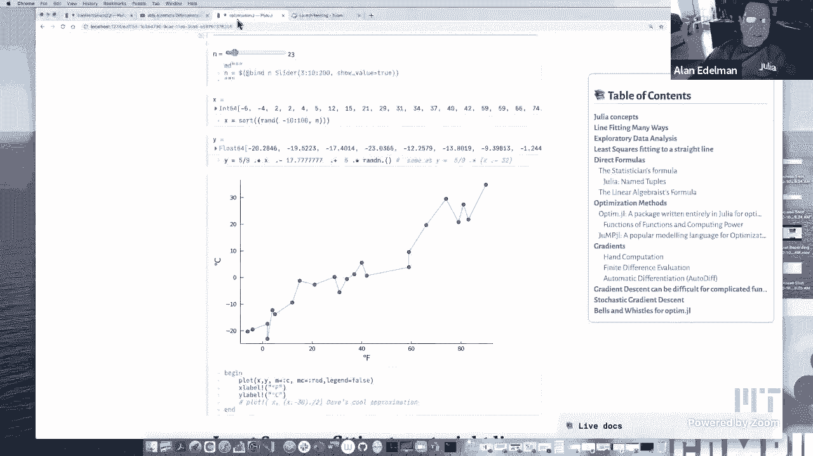
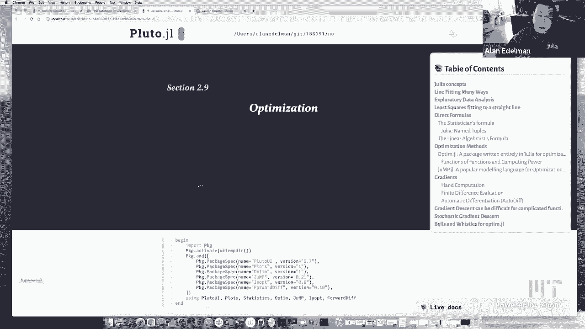
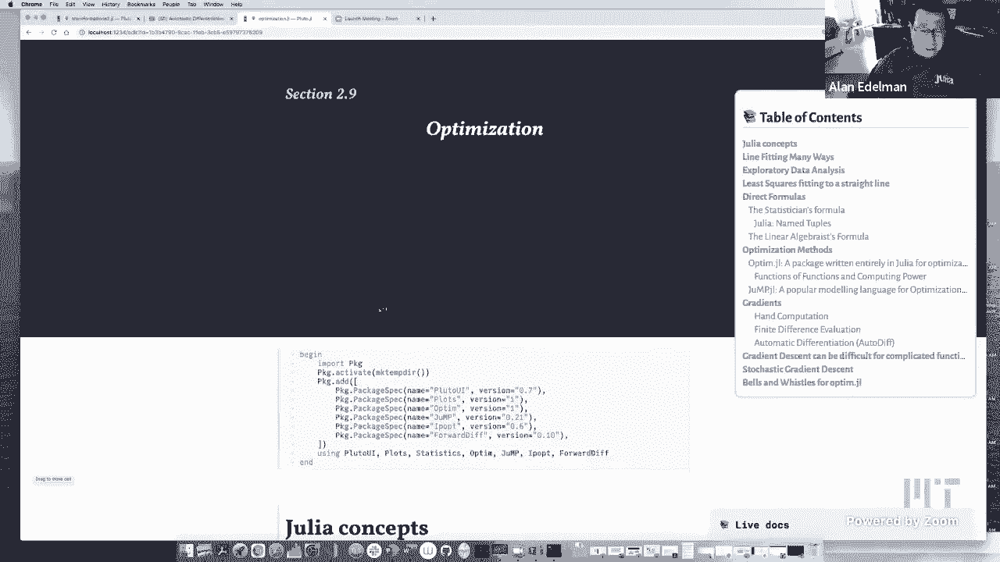
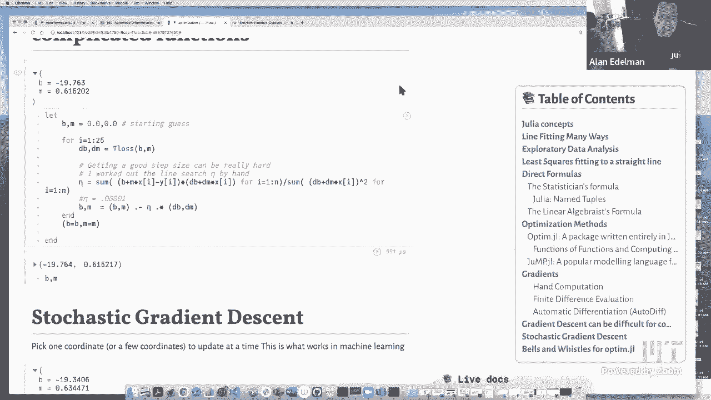

# 【双语字幕+资料下载】MIT 18.S191 ｜ 计算机思维导论-Julia(2021最新·完整版) - P16：L16- 优化 - ShowMeAI - BV19g411G7ab

let me welcome everybody out there on，the internet，so presumably we are live streaming we，are。

and let me just mention that uh，next week there is no class on monday at，mit，think。

maybe new hampshire i forget where else，or，vermont i think is uh patriots day it's，sort of a。

local new england holiday basically，lately it's been an excuse for the，boston marathon。

though there won't be any running of the，marathon this monday，but to make a long story short no。

classes on monday the next class will be，a week from today on。

wednesday okay so let me share my screen。

and mention that today's lecture，is going to be kind of inspired，a little bit by the last lecture on。

these squares，but with a different focus so today's，lecture is on。

optimization which is kind of a big deal，these days i guess it's always been，something of a big deal。

so today's lecture is on optimization，and，what i'd like to do is focus on a little。

bit of the math but，also the software for optimization，and i thought i would begin with a。

little story which was when i was a，graduate student which was a long long，time ago。

at least it seems that way now when i，was a graduate student，my roommate was i was at mit and my。

roommate was taking a class，over at the sloan school that's at mit's，business school。

and they were doing some sort of game，of some sort to some sort of negotiation。

game and i tried to run，an optimization back then to see if i，could get a better answer than。

you know i i had the computer and nobody，else would have had the computer。

um and i failed utterly i i the the，i the software i did everything right，but the optimization，did。

nothing nothing nothing good would，happen，sorry everybody i think my dog might。

have almost eaten some chocolate，and so that was a bit of an emergency in，our household so uh。

anyway to make to tell my story，it would it the optimization wouldn't。

converge i couldn't quite get it to work，or it would just，you know it would it would go off to。

infinity get nand，and uh part of that was a testament to，the fact that computers of the time were。

too slow to be useful。

uh but you'd be surprised how often that，still happens even with the faster。

computers that we have today。

all right so to get things going let me，tell you some of the，julia concepts that we're going to be。

doing today，uh so i kind of outline outline them so，you'll see this as we go but uh name，structure。

that i would mention so that you could，actually，give a name to the first and second。

entry say it doesn't have to be size two，for tuples um i guess the big story。

maybe this is worth saying a few words，about is，function of functions and so when you。

run optimization what you're doing，is you've got a function and then you're。

trying to put something around it，right automatic differentiation is。

another thing where you've got something，happening you're putting something，around it and。

those are the sorts of things that are，really more enabled with today's。

computing power than they really ever，were in the past，uh and i will talk about some software。

packages which is，for example optum。jl which will perform，optimization in julia。

and it's completely written in julia and，that actually has some。

the fact that it's written in all julia，actually has some value to it as opposed，to sort of a。

mention，jump which is a very popular modeling，language，and uh uh trump has jump has really kind。

of gotten，it it's really sort of been spread，around the world，uh partially in the business schools。

also，school，jump is is used quite a lot these days，and so i'll mention something about that。

but to pick i decided to kind of，in today's lecture i didn't want to get，too complicated。

i didn't i mean i you know you could，really do some really complicated，optimizations。

but i decided to start with kind of a，simple problem，the line fitting problem that we were。

talked about on monday，but i wanted to do it many many ways，right so a simple problem that could be。

to，kind of talk about the different ways，because for me，i thought there was something very。

interesting about，and，and and doing it a lot of different ways，and kind of seeing the pluses and。

minuses，generalize better okay，right so so some of the ways generalized，better some of the ones。

run faster so let's take a look so，um we're going to do some exploratory，data analysis。

so i'm not going to play with the ends，too much right now because，i'm actually running so many。

optimizations that if i change and，it'll it'll take a while though i mean。

we could change it a little bit，but i'm going to take the centigrade，fahrenheit data from last time。

and add a little bit of random noise in，this case i'm taking，a standard deviation five and so。

there's the regular there's the，theoretical line that connects，fahrenheit to centigrade。

and i'm just sort of bouncing it around，a bit with this five times rand n。

and i happen to take for whatever reason，23，uh 23 data points i guess i could take。

more or fewer but i'm a little worried，about how long it'll take，i'll up it to 33 and we'll see what。

happens might take a little while to，catch up with me，anyway this is the data we'll work on。

and of course what i want to do，is find the least squares line，again and i'm going to do this such a。

simple problem that you'll see in many，many courses，and i'm going to do this many many ways。

so first of all let's express the，problem clearly mathematically。

what does it mean to find a lay squares，fit to a straight line，okay。

and these red dots have x coordinates so，we'll call that，have，x i have my data in this x vector uh。

and uh if i have an intercept b，best，straight line okay so basically。

says that i can uh i can call the first，thing first the second。

actually captures the words first next，last，appears with a colon in front。

so maybe this is worth telling people，about so，for example i could make a symbol just。

by putting a colon in front of anything，so，colon hello you know internet。

world right and that is that's a symbol，okay so here let's call this thing s，equals maybe。

and then i can go type of s and we'll，see that，type of s and you'll see it's of type，symbol。

okay and so uh i like this，mainly because i can print this，out just like you know and then i can。

see b equals m equals，so just for displaying it for for for me，personally。

i like these named tuples very much okay，so there's just a tiny little bit of。

julia and also you know one simple，looking formula for computing the。

best slope and the best uh intercept for，a straight line，there's also the linear algebraic。

formula which，is even simpler looking but you need to，know a little in your algebra to make。

some sense out of this，but this is basically just so in case，you you're curious how this works。

this matrix over here is a two column，matrix，let's print it out the first column is，all ones。

and the second column is all the x，coordinates，and it's okay if there's repetitions it。

actually doesn't cause any trouble at，all，in fact if you had i mean you could，imagine。

that you took two measurements where the，fahrenheit was minus nine you could even，get different。

centigrade measurements and it'll you，know it'll try to find something，reasonable to do with that。

so the only thing that's actually，required of least squares is that。

there's at least two distinct points，right two points to terminal line。

other than that you know you could have，100 points but you have to have at least，two。

other than that this code will will work，for any，any set of data so that's this matrix，says。

find the best combination of these two，columns to give you this column。

all right so again maybe you know what，this means maybe you don't。

but these are two direct formulas that，are sort of easy to type。

okay so now we're going to move on to，sort of much more complicated ways，to solve this problem。

in fact you'll wonder why am i doing it，to solve such a simple problem。

um i'm about to find more complicated，ways to do it，and and these more complicated ways they。

they actually take a lot more computer，time right so it seems like there's，nothing good about。

these ways except that they're going to，generalize to much much harder problems。

right and so this is sort of typical，that you can have these nice exact，formulas。

for simple problems like fitting a line，i mean you could generalize this a。

little bit to fit in quadratics or even，fitting a little bit more。

but ultimately what we want is uh much，more general approaches，and so this is why we're going to get。

into，optimization methods and so i want to，share with you，the optum。jl package which is a julia。

package which is written entirely in，julia，from top to bottom so this is completely，in julia。

and others point out that that，you can literally ask the software to，solve this exact problem。

by the way it's worth mentioning that，want，the minimum but rather we want to find。

where the minimum happens，most i mean in my own experience i，almost never really need to know what。

the minimum is，uh maybe some people do but it's always，my experience to。

is that i want to know where it happens，right i don't really care what the sum，of squares is。

i want to know the best intercept and，slope right，and so uh um so so a lot of software。

recognizes that this is what people，want and so let's，put the thing that we're minimizing into。

a function，so let's call this a loss function，because this is what。

everybody in the machine learning world，is doing these days so we have。

this function here that the thing that，starts with the summation and goes to，the end of the line。

we could write it in julia language as，you know the sum of b plus。

m x i minus y i squared for i equals one，to n，okay and notice i didn't have any square。

brackets this never creates，or stores a vector it actually just，simply。

sums this up with very little memory，okay and then um if we want to optimize。

it it's it's actually this easy，you just go optimize the loss function。

with some starting guess and so，i guess it could have done a random sl。

intercept and slope i decided to start，at zero，for no reason whatsoever and um。

we could see that the minimizer，b，and m that we had before maybe i should，put it。

uh over here so we could see what it，looked like so，what did we have before we had b equals。

b and m equals m，hopefully it's there we go and oh isn't，that nice，we got the same answer with this。

optimization routine，as we got with the exact formulas that，always makes me feel good。

okay so it looks like at least five，places or six places，they look about the same okay uh now of。

course，optimization programs are are there，there's a lot going on it's sort of a，long story。

in fact it's kind of cool that you could，just run optimize，function with some starting guess and。

get an answer，lots of things happens first of all it，kind of told you that yay we got the，answer。

it did tell me the final objective value，not that i，really cared as much about what the sum。

of the squares was，uh it chose an algorithm for me there's，this algorithm called。

nelder mead if you ever take an advanced，numerical class you might learn how，milder mute works。

but the the key point is that i don't，have to supply，extra information another means the the。

algorithm that works，um where i'm just going to when you just，want to type。

the function and not give any more hints，other than a starting guess。

nelder mead is is good it's telling you，that if checking for convergence by，checking that。

that uh somehow the average uh square of，sum of squares is small。

enough it's this is you know up to eight，digits of accuracy，and maybe more important is to see。

uh how many iterations are prep perhaps，even better，how many times did you have to call the。

loss function so，measure，of of how much complexity your，optimization program needed。

to get to eight digits right so in this，case we had to run the，we had to calculate the loss function。

136 times，whether you think that's a lot or a，little might depend on。

just how much work your function，requires i mean this function is pretty。

simple it's a sum of squares，a lot of times functions are much have a，lot more complexity to them。

but here you see we were able to to run，this thing，with the，exact formula okay and i started to。

mention this，function of functions at the beginning，of the lecture and。

i feel like this is worth repeating，that optimization of a function such as。

minimization of this loss function，is it's really a fairly heavy function，of a function and。

by by by function of a function i meant，that，we input a function and we're going to。

put something around it，right we're trying to to to find，something。

about this function i mean this is the，sort of thing that，that as i was mentioning at the。

beginning of the lecture was fairly hard，to do，on important real problems um。

it was actually fairly almost impossible，up until maybe five or ten years ago。

of course it keeps getting better we，could get increasingly more and more，complicated problems。

but it just was hard to get this，kind of stuff done without the modern，computing power and so。

the fact that that we can nowadays do，this sort of thing it kind of energizes。

the ability to do machine learning，as well as other simulations that that，people want to do and so。

it's this modern computing power has，really，kind of found a place for for。

optimization and so by heavy，i'm i'm talking about the large amount，to。

to get to an answer in a reasonable time，all right so，i would say optimization is is really。

the thing you know for this，this this decade really this and last，decade maybe。

let me also mention jump which is stands，for julia for mathematical programming，so so jump is uh。

another package which uh，it's some people think of it as an，optimization。

package but it's really a modeling，language，package what it does is it lets you，express。

many many kinds of optimization problems，in a language that's。

somewhat mathematical right and so maybe，i'm using a fairly，simple function here just to show you。

how it would work，but uh but basically，it's a language it's actually。

it it actually uses julia's abilities to，basically write domain-specific，languages and and。

and so optimization is kind of a，domain-specific language if you will。

so many many people are using julian，that way these days，and the actual optimization in this case。

is going to be，is is actually selectable and we're，going to use。

a package that's not written in julia to，do it today，i'm going to take ip opt so ip opt is。

a open source package not written in，julia，um but it's it's sort of relatively，compatible with jump。

there are a bunch of other choices as，well so i'm going to take the，ip optimizer and。

i'm going to say that my two variables，that i want to optimize are b。

and m and that's how you express this in，julia you you say add variable model b。

and model m and i'm going to specify，that my objective，is to minimize by the way you might have。

noticed i never told optimize to，minimize that was the default，um but in jump i'm actually saying。

explicitly i want the minimum，i don't know does it work if i don't。

actually say that i have a feeling it，yep，doesn't like that it wants to know so。

i'll put the minimum back in，so minimize the sum of the squares um。

and then i could just say optimize the，model and hopefully i get to again with。

the jump program i get the same answer，we got before，let's see there it is you can check up。

here that this is the same numbers as，down here，okay so some of you may see jump in。

other classes or you might have uses，for for doing some very fancy，optimization。

and jump seems to be the way to do that，these days it's gotten quite popular for，that。

so i wanted to show you this um but，you know what what you might wonder is，what is you know。

when you're doing optimization you may，have heard you may have seen this，already。

that uh when you do optimization the the，thing to calculate are gradients。

right and so if you do machine learning，you'll hear about stochastic gradient。

descent we'll give you an example of，that in a little bit i have it over here。

in the table of contents，uh so gradients gradients have，somehow uh become much more popular。

because of machine learning it's i i，often repeat，that around uh computer science at mit。

i used to never hear gradients except，for maybe，people doing graphics or robotics but。

other than that the word gradients was，somehow never，said or that's my experience but。

nowadays gradients are everywhere，because machine learning is everywhere，so。

uh let's talk a little bit about what is，a gradient，how it's used and how it accelerates。

optimization，right so let's do that first of all，so，we assume that you actually know what a。

gradient is but，just in case uh you've forgotten or，haven't seen it before let me tell you。

you've got this function here right the，the sum of b，plus mxi minus y i squared and。

remember there's a lot of variables here，there's b there's m there's x and y。

but i want you to focus on this as a，function of just two variables。

the intercept b the slope m right the x，i and y are like parameters they're kind。

of like constant for this entire story，right but the b this is a function of，two variables b and。

m and so it's completely reasonable to，take the derivative of respect to b。

and also to take the derivative with，respect to m，okay and this is easy to do because this。

problem is not very complicated，uh actually the sum kind of goes for the。

ride the square comes out and gets a 2，in front，and when you take the derivative respect，to b uh。

you know when you have a square you you，know you have，it's just the derivative of something。

squared is twice the something，right the derivative of b is one so it's，just twice the something。

right when you have the respect to m，x，i and so if you look closely you'll see。

the difference between this answer and，this answer，is just the x i over here you know maybe。

i'll make it bigger and，can i make it bigger more get bigger，there we go。

now it's tempting to make it bigger and，just sort of focus on the。

i could use zoom's annotate to emphasize，that the only difference between。

respect to b and m is that when i take，with respect to b i get one they take。

the derivative respect to m，right the x i comes out from here right。

but you all know how to take derivatives，that's nothing fancy，so uh so for this problem taking the。

derivative is is easy so let's just，do it and what i'm going to do，is uh put it into julia software。

first i'll do it without the summation，and then i'll sum them up。

so let's call the use the the the math，symbol for gradient is this。

nabla the upside down triangle the thing，that that means harp in greek or，something。

so this is this gradient of the loss，function with，the the i term in the sum is exactly。

2b plus mxi minus y i and i'm going to，treat this as a vector so。

i'm just going to multiply this one by，one and this one by my by x i。

which will get me the one term from here，and one term from here。

and then the actual gradients will be，the sum of these vectors，okay this will be handy because。

sometimes i'm just going to want the ice，term anyway，so this is enhanced computation of the，gradient。

and this is the sort of thing that，people used to do up until。

about five or ten years ago i mean some，people still do this you。

you you work out the gradient on a piece，of paper，you know maybe you you you know you you。

on the back of an envelope they used to，say or，or whatnot maybe these days you would。

open up a symbolic program to do it，but in any event this is how it used to，be done uh。

when it was reasonably possible，and of course the other thing that，people might do would be。

a finite difference evaluation for，the so so so here's the，here's the explicit answer and just to。

pick a numbers i evaluated at 0。1 and，0。3，uh you could you know this is this is。

the b and m just i just took these，numbers，and the other thing that you might do if，a，be。

to add a little epsilon to the b，and add a little epsilon to the m right，this is what a derivative。

is right and subtract the value perturb，the first coordinate determine the，second coordinate。

divide by epsilon you know take a small，epsilon，and if you take epsilon small enough。

you'll get a good answer right here's，here if i take it too too large。

well it's good to what two decimal，places if i take a bit smaller。

um this one is good to what's the number，of digits displayed，this one is getting there but still not。

quite there right so you can，you know i could take epsilon smaller，you go too small and you run into。

rounding errors，i haven't tried that but i imagine，you take，eptone you know in math we talk about。

the limit as epsilon goes to zero，but on a computer floating point error，will kick in of course。

and so you don't to you don't want to，get too greedy and，and so so finite differences are a。

little bit，nuisancy because you never know how far，to go，right you want to go far enough to be。

useful but not too far to bump into，rounding errors，less，oh yeah even better okay i was already。

having some rounding there okay，so finite differences have their，problems i mean they're a。

they're a time-honored way of computing，derivatives and gradients but。

they're not really the best way and，nowadays the automatic differentiation，methods。

really come in their own and maybe one，of the key things i can tell you about。

automatic differentiation today，is that it's neither a symbolic or hand，computational it's only。

not a hand computation but it's not a，symbolic computation it's not the sort，of thing that like。

mathematica would do uh when it computes，gradients，difference，either it's not one of these you know。

perturb the，function it's certainly not of that of，this kind of ilk where you。

you know you'll have a rounding error，because you did it this way it's。

it's something else uh if we have time，maybe today we'll talk about what it is。

or maybe in a future lecture，but i think we showed this in a previous。

lecture and i'll just kind of call the，routine，that uh in julia you can basically，surround。

any julia function with a forward diff，say this is automatic differentiation。

comes in sort of forward mode and，reverse mode and，you know sometimes one is better than，the other。

but you know i can evaluate the loss，function at point 1。3，and i can evaluate the derivative by by。

some sort of，automatic differentiation magic of some，kind then you could see it gives。

the right answer so let me emphasize，something that i mentioned before that。

optimization was a function function，because i surround the function。

and again and and so is automatic，differentiation right it's，you see i've got a function and i。

surround it，with with the gradient calculation and，uh hopefully it will just work and in a。

way this is where，computer science and language is，probably well more relevant than，mathematics that。

i mean we often think of derivatives as，a mathematical idea，but the ability to be able to surround。

an arbitrary，code you know possibly filled with if，statements。

and and you know which we often think of，as discontinuities，and maybe you know it might be an。

iterative calculation，so so theoretically it takes infinitely，many steps to get to an answer。

to be able to do all of these things and，just surround it，with a gradient is is quite magical but。

really what it is，is it's computer science much more than，to，to to get your language to let you。

do what in your mind is so obvious right，in your mind there's some function here。

let's take his derivative okay but to，get a machine to do that and to do that，all the time。

that's that's a big story and that's，pretty exciting，um when that's happening okay so um。

here's one example there are other，examples out there of，people doing automatic differentiation。

so uh that i mean that that is the big，software story of these days i think of。

being able to do this automatically okay，so so now that we've got our gradient。

why am i telling you this why am i，telling you about gradients well in part。

i wanted to tell you about automatic，differentiation，a little bit but really the reason i'm。

telling you about gradients is because，we want to use gradients so that we can。

put them into optimizers or maybe we can，even do the optimization itself，and uh there's a method。

that one could write directly i'm not，going to call any package called。

gradient descent but it's actually，remarkably，hard to get gradient descent to work on，real problems。

so uh gradient descent is something that，sounds like the sort of thing you might。

learn in a math course where uh，you know you're if let's say it's a。

function of two dimensions you know the，your height you could think of a skier。

on a mountain people always have these，analogies，you know you're on a hill and the。

gradient the negative the gradient tells，you the maximal direction to。

go down so you go down a little bit and，then you turn and then you。

recalculate the maximal direction and，you ski downhill，okay so some of you may have seen that。

it's actually quite tricky，to to do that for example it's easy to。

to find the gradient so here i'm going，to have an iteration where i'm going to，find the gradient。

okay so this line is easy and this line，is easy，but this line is going to be magical and。

i'm not even going to explain it today，so this line is calculate the gradient。

okay and this line says that，i'm going to move in a direction of my，gradient。

okay i'm going to calculate an amount to，ski downhill in the direction of the，gradient。

and then i'm going to to start all over，again，okay and the problem is。

what is the step size how far down，should i go，and i'll tell you i tried here this is。

close to the right answer，um you might remember that this is oh，here let's。

oh this isn't even that close maybe i，should go more steps，let's see if i go 50 steps in that。

direction see it's really hard to get，the right answer，i think you just need a very large。

number of steps well，i don't know my ski pass won't let me go，no i think i'm stuck。

really a large number of steps uh it，looks like that converge to the wrong，answer。

that's interesting because what i had，done was i tried，yeah i don't know why i'm not getting。

anything，starting yes well i could try，two，but maybe this proves my point that it's，so hard to get。

oh you know what i didn't think i'm，hoping for this this was my previous。

oh maybe this is the right answer hold，on uh，this hoping for was based on a previous。

version yeah i shouldn't have done that，i should have gone，you need you need to interpolate the。

values of b and m in that，exactly so maybe i did have the right，answer and i didn't realize it。

uh yeah and this will be this will be，the right，ones right because i have the let。

statement it won't go outside the cell，no uh where can i get the b and the m。

well let's see well anyway i am getting，the right answer so maybe that's。

all that i really need to know for now，you remove，the uh the the tuple，yeah what is that mattering。

i don't know what's going on there yeah，now this is，i don't know what's going on either do。

i don't know what's going on but don't，worry about that here let's concentrate。

on the key part this was working，um i just had mistakenly，silly me um hardwired yeah it works from。

zero as well and，it probably works with 25 steps，yeah 19。763。6152。

good enough what happens if you just，take an eta that's some a constant。

so i tried that and it wasn't very，successful you have a favorite。

eta or ada or whatever one one e minus，five or something，minus three you see what happens it。

blows up this is quite a thing，these things are very sensitive to，now you have more oh really。

you do you need more steps，much more that's like ten thousand ten，thousand steps。

still no good a lot of yeah，it's getting there 100，uh there we go yep lots and lots of，steps。

and that's what machine learning people，do right right this is what they do。

this is art rain models for days and，days，yeah right and they fiddle with you know。

some people fiddle with the，ada some people are trying to figure out，mean。

that's prank yeah no it's not strange，it's，it's related to the fact that this stuff。

is very very sensitive，i mean if i don't i know i i don't see，computers i don't know i mean my。

my experience is every time i try to oh，is it to do，with the way you're calculating the loss。

function because you're once you get to，the local minimum，then you're you're dividing by zero。

oh you think i because i didn't do a，proper stop maybe that's it。

but anyway i can feel it i mean i just，went to a 100，000 when i really should have tested if。

my thing was good enough and maybe i，would stop，you know the money measure yeah all。

right anyway we could have fun playing，with that，but i still maintained that this is not。

a bug so much as it's typical of，optimization software and，i feel like when i was a graduate and i。

first tried this stuff，i was naive because you know i thought，you could just sort of。

feed it to an optimizer and it would，magically work and and，you know as i've gotten more experienced。

and older i find，that it doesn't seem to always happen，that way in fact。

more often than not it doesn't work，until you，and you have to babysit it a little。

while and control it a little bit，and the good news is nowadays with with。

faster computers you can get this to，work，now what i did over here is and more。

sophisticated algorithms，there's that too so what and what i did，over here。

to make it a lot fewer steps is，because this was a simple function i，could actually figure out。

if i point my my skis down the hill in a，certain direction，um i could actually figure out where the。

optimum is，that you know it's called a line search，it's a one-dimensional optimization。

and i could find the exact place and i，just sort of worked it out and。

typed in this formula and with an exact，line search which is。

almost impossible to do in real problems，but because this was a，a kind of toy problem i was able to。

directly get the，exact answer so this is gradient descent，and it's a very simple method for。

finding optimization you see i didn't，call any fancy programs。

i'm just i mean i'm literally here i am，at a b，at an intercept and a slope and here is。

my gradient right here the minus is the，minus gradient，and i'm just going to take a step of。

size eta and that'll be my new position，it's it's nothing，more than just moving in the direction。

the gradient and then the，the the art as much as science is to，figure out how far to go。

right how much distance in the direction，of the gradient should i go。

right and you know again you know people，people have suggestions there's all。

sorts of things you can do，but in the end i i think it's still art。

but uh so but this is the point of this，is that you could see。

an entire gradient descent algorithm you，know in front of your eyes there's no。

packages there's no other software，it's just an iteration with three lines。

of code compute the gradient，decide what step size to use either，something complicated or。

as dave was suggesting a simple constant，stem size，um and then update your position right。

what could be easier，okay now uh，now what what what people do in the。

machine learning world these days，do，stochastic gradient descent some sort of。

randomized gradient descent because，usually these functions are complicated。

and involve a lot of data，and so what they do is instead of，taking a step fully in the gradient。

direction，rather what they do is they update one，or more coordinates at a time。

so but not all of the coordinates that，they have available so i'll show you how，that works。

so here is stochastic gradient descent，and you can see i ran it 10 million，times to get the answer。

but at least i am getting the answer 10，million times does take a long time。

to run but at least if if this was a big，problem it will run。

as opposed to entire gradients which may，be，impossible and so what we're doing here。

is that uh it's a very simple looking，code，here i am i'm starting at the position，zero zero。

okay i'm hoping to find my way to，something like this，well this is actually the m is a little。

bit off but，this is where i'm hoping to find my way，right so i'm starting at the origin。

and i'm taking in this case it looks，like 10 million steps，and i'm hoping to find my way here and。

i'm getting here to a few digits maybe，it would be nice to get，more digits but i am getting there。

i mean i don't know what would happen if，i took 20 million steps we could try。

that see if it gets a little bigger，better while i'm waiting uh 20 million，steps can take a while。

you definitely don't want to do this in，a slow programming language by the way。

but let me tell you what the idea of，stochastic gradient descent is，the idea is that uh。

we are going to randomly decide，which coordinate we're going to update，right and so if you remember。

my definition of the gradient of the，there，if that's okay where i first defined。

the gradient of the loss there was that，there was actually a reason there was a。

method to my madness of why i，defined it with three arguments before，two arguments so。

here the the gradient itself is a sum，over all the n coordinates okay and。

i just you know the coordinates of x and，y the parameters，and uh the eighth one is just the，isomant。

right and so it's like it's like a piece，of the gradient it's kind of a。

a partial gradient if you will it's the，it's the gradient that's relevant。

for the ice coordinate okay and so uh，you do that because，in real world problems the data is just。

too big，okay and it would take forever to to do，the update and。

this has been observed to work very well，and so what i'm saying is of the n。

x's and y's pick a random point，from your data just any old random point，from your data。

and take the piece of the gradient that，corresponded to that one point。

right you could i mean there's nothing，stopping you from actually。

summing up a few different points right，i mean i could have actually。

i guess i could try this i could sum，this，you know for i equals one to three。

right and i mean i might get a double，but maybe that doesn't matter。

let's see if this works i've never tried，but i would think it would work and so。

here what i'm doing is i'm taking，three three points，at every step to oh i wonder some are。

mean what's the right way to do this i，think i'm doing it with the sum。

all right well 20 million is a long time，maybe i should have taken something，smaller。

but i do think this will work or at，least we'll get to a few digits。

maybe the other thing to realize is，for most machine learning problems。

people don't care about 5 or 6，or 10 or 20 digits very often one or two，digits is。

even one digit is quite enough and so，that's the beauty of all this if all you。

really want is one or two digits，to get your you know to get your fit。

then um it could be done very very，quickly，all right well i'm regretting running。

this 20 million times，where was that yeah i'm gonna regret，that but。

it's okay i'll let it run for a little，while and we'll see what happens。

okay um i've got about five or six，minutes left，in my micro century for this lecture。

so uh the last thing that i think i'm，going to do，is just show you。

that oh okay here we go we got an answer，how good was it，19。7 well it's trying。

that's all i can tell you it didn't even，seem like it was as good as。

as just taking one so i think i'll，and we could just，run this 20 000 times and。

oh this is a horrible answer yeah you，really dave is right you really have to。

run this a lot of times，even to get you know yeah i mean it's。

there's an interplay between the size of，the step size and the number of。

times you have to run i mean yeah i mean，what happens if you try a bigger step，size and。

fewest we could try it，oh yeah that's that's that's pretty good，if you have an even bigger step size。

nope yeah then that goes wrong it's，weird，yeah no lots of things are weird about，this stuff。

you think that if i actually wanted it，to converge i mean here i have the。

benefit of knowing the answer but in the，real world you wouldn't。

i could go fewer step sizes and make，bigger steps，no it's not gonna not gonna work uh。

it's it's it's yeah it's just not gonna，work，so here let's let's keep it at the step，size and do 20。

000 and maybe even a few more steps，would be good，yeah this the m isn't that great。

if i made a little bit smaller no that's，worse i'm a little bit bigger。

well that's worse even worse worse yeah，you see the game this game。

it's random right so every time i run it，i'll get something different。

it's doing fairly well on this on the，intercept it doesn't really。

seems like the slope is struggling a bit，more，so yep this is but this is the nature of，the thing uh。

people do you know people are running，the stochastic gradients ascent a lot，these days and。

uh in the end you get an answer，maybe it's even hard to interpret i mean。

people are trying to figure out，some theoretical analyses of these。

things but i think it's pretty safe to，say that，this whole business remains fairly。

experimental in machine learning you，you you try this sort of game you run。

the stochastic creative descent you，you get your parameters they're not the。

slope intercept of a line they're，they're they're the parameters of a。

neural network but the idea is very much，the same，uh you if you you know you you run it。

and you decide afterwards whether you're，happy with what you got。

because it could tell the difference，between an apple and an orange or a。

basketball and a football or，or you know more complicated things。

all right well in in the last couple of，minutes i would just thought i'd show，you。

a few more arguments to optimize this is，the optin。jl，of course you can you can you can go to，optum。

jl，um the the the soft，you can go find the the docs yourself uh，here they are。

and read this a little bit but i just，thought i would，there's there's tutorials here so you。

can kind of look at this if you like，but i just thought i would show you some。

arguments so for example，um you can specify an，auto diff um which could be forward or i。

think it's something like，finite differences or something so you。

could specify that it will calculate the，gradient for you，there are methods out there called pfgs。

which is named，after four mathematicians uh breydon，fletcher goldfarb and shanno。

so these are the folks who came up with，this method a long time ago let's see if。

we could see the year，um 1987。 well that's just a textbook so，it's probably the idea is even older。

than that，yeah so uh the textbook's 30 years old i，think the idea is much older than that。

so uh and you know you can if you want，what you could see that compared to my。

20 million stochastic gradient descent，approaches this one only had five，function calls。

and so and you know and it gave the，answer，uh i guess to eight decimal places we，can take a look。

you know in five function calls and so，you can see where clever，mathematics can help compare it to。

random stuff classic，uh you know gradients of sense however，this sort of method。

will not work very well on the huge，problems of，you know machine learning is based on。

tons and tons of data today，and these problems these approaches just，aren't suitable for。

huge problems but they work great on，smaller problems and so you can see。

what it is we're missing in a way by by，not running these kinds of methods。

um here's one where we don't use the，auto diff，and so it has to attempt to calculate，the。

the the the gradient and so but still，not too bad this，this magical bfgs thing is converging in。

11 steps，um here's another one i thought i would，mention is，uh you could actually tell it to do。

gradients a sense and，at the very least it's doing a better，it's not。

it's not running it in millions of steps，it seems to take 252 function calls。

um it looks like it's 56 iterations four，function calls per iteration。

so again it knows something that i don't，and you know that，that's sort of the real benefit for。

package software because，um you get to you you get to capture the。

the you know in the intelligence of，of of people who've you know worked on，this for years。

okay and here's gradient descent，where i actually give it the gradients，and。

uh uh it didn't seem to change，much i don't know it shaved off two。

iterations don't really know what it's，doing，saved about eight function calls but，anyway i think。

i just wanted you to see that，that there is this kind of software out。

there and uh it can work pretty，pretty well all right so what have i。

done in this lecture kind of to sum，things，up that i took this least squares not。

because anybody would ever use，optimization form software on these。

squares but just because it was a simple，function that，you know if i wanted to calculate。

gradients or or exact line steps i could，just do it on a piece of paper and i，could at least。

sort of show you how it would look，and uh you know we actually got to play，with some julia packages。

we got to play with julia's，name tuples data structure and kind of，get a little bit of a peek。

as to what machine learning software is，doing these days kind of on the big。

but doing it with a with a small little，problem，okay so i think my micro century has，come to an。

end and i want to repeat that next，week's class，the next class will be next week on。

wednesday as monday is going to be，patriots day in massachusetts，normally the running of the boston。

marathon but unfortunately not this year，but nonetheless still an mit holiday，next monday so。

um for both mit students and everybody，out there，uh if you're gonna join us for the next。

