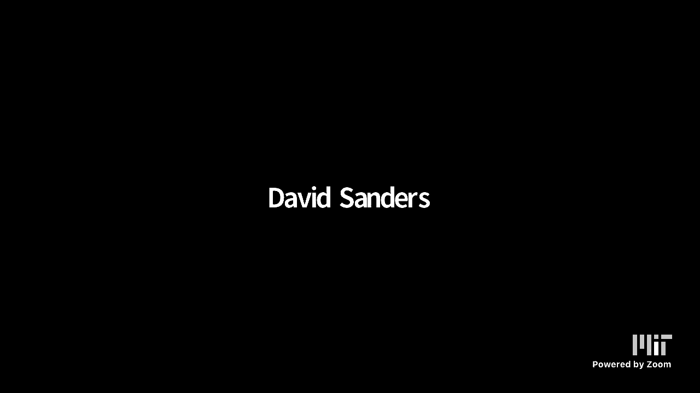
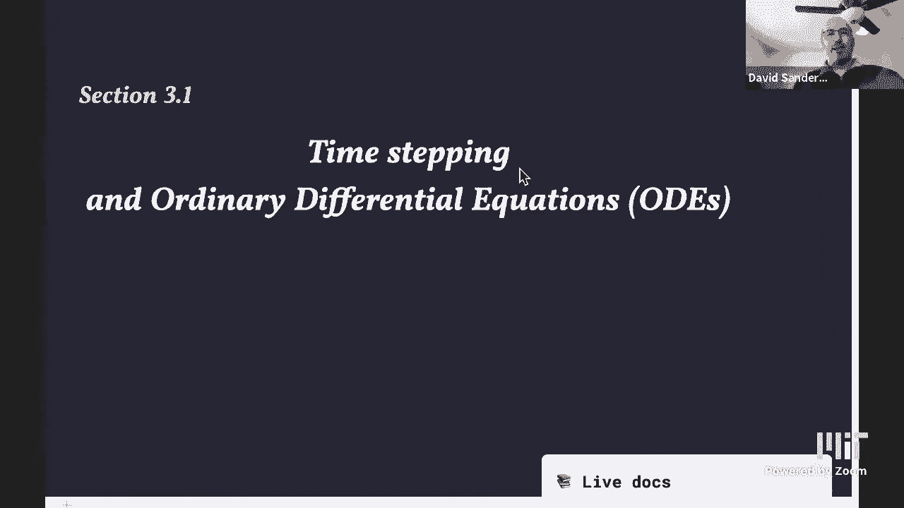
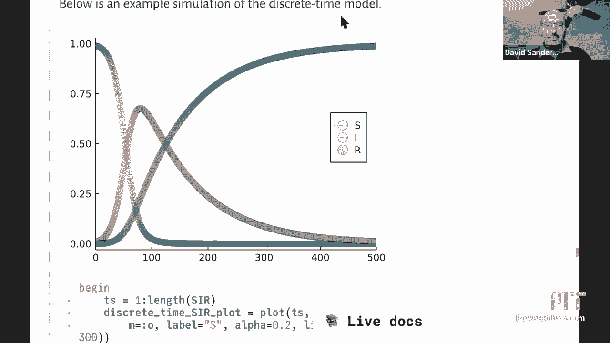

# 【双语字幕+资料下载】MIT 18.S191 ｜ 计算机思维导论-Julia(2021最新·完整版) - P17：L17- 时间步进与微分方程 - ShowMeAI - BV19g411G7ab

do a quick sound check sound check i can，okay so it's five after the hour，there in。

internet land and the mit students and，as dave puts up the notebook for today's，lecture let me just。

say a few words of introduction so we，are now moving，into module 3 of the class if you go to。

the class page you'll see that，we're starting a new section with，section 3。1。

and perhaps in a way this，is almost like starting a new half，course like the second half of a course。

where um you know maybe students could，kind of join in here，we might mention some things from before。

but i think it's almost like a separate，quarter class，or so and this is a bit of an experiment。

and and we'd love to hear what you think，about it but，you know as with the importance of of，climate。

science and and you know we're all，you know as as we think we're getting。

covet under control maybe hope we're，getting covet under control right now。

uh the real big issue the next big，physical issue，or i don't even think it's next the big，issue。

is going to be controlling our climate，and we have this belief，that there are many folks students of。

computer science，students of mathematics who would like a，little bit of an introduction。

in the computations that go into climate，models without all the heavy heavy，details。

this is an introduction really for，starters to，now because people talk about climate。

models and people talk about whether you，should believe them，but it you know it's even hard to know。

what you're talking about without any，familiarity，so with that in mind what we're trying。

to do in this now，i mean it's it's not quite half but，we'll call it the second half of the，course。

is give sort of the necessary insights，for the next week or two。

so that we could bring up basic climate，models so that，anybody with a computer science。

background a math background other，backgrounds，statistics backgrounds um can，participate。

in climate science modeling so with that，going i'm gonna，philip's already excited about getting。

into climate science，that's not today's lecture today's，lecture is going to be just。

the differential equation background the，continuous backgrounds，into，into climate modeling given how。

important that is，so dave take it away okay thanks，alan hi everybody so as alan said we're，going to。

uh be moving towards climate modeling，and，as with many models from the sciences in。

particular physics，based models uh these are often written，in terms of differential equations。

and so today we're going to start with，ordinary differential equations or odes。

but we're actually going to not start，with odes we're going to see how。

ods actually can arise from more，intuitive，discrete time models and then at the end。

we'll go backwards and say well if i，am given a differential equation how can。

i actually solve it on a computer，and we'll find that we get back to where。

we started which is what we call time，stepping，so that's what we're going to look at，today so。

we're actually going to uh start with uh，as always we're the sort of simplest，possible model that we。

can and it's going to be uh modeling，component figures so you may remember。

that a few lectures ago we，did a model of component failure，starting from a probabilistic or。

stochastic model，so uh even if you didn't see that it，doesn't matter we're going to sort of。

restart from a different point of view，uh we're the model，that we derive from that probabilistic。

model but it's also a pretty intuitive，um model in its own right so what。

is this about again it's about light，bulbs uh or other，mechanical components or electrical。

components and the question is how long，does it take，for light bulbs to fail so if we're in a。

factory and we have，you know thousands of light bulbs um，they're just going to start failing。

and uh we want to sort of keep track of，how many，light bulbs do we need to have in stock。

to replace those light bulbs that failed，uh you know how long do they take to。

fail and say so we'll start off with the，simplest possible model。

as usual which is just that every light，bulb again has the same probability。

to fail each day except that light bulbs，don't really fail，you know at midnight each day they they。

fail at some point during the day，but to start win we'll just count at the，end of each day。

we'll count how many fails during the，day isn't it true that light bulbs。

fail or another bad things happen when，you most need them to not happen right，now component to this。

that's that's somebody's lawyers okay，so we're going to have this sort of，checkpoint every day。

once per day so we have a sort of，integer time going on so we'll call the，number of days k。

and at the end of day number k we'll ask，how many light bulbs are still，functioning。

uh which we'll call capital n sub k，right so let me zoom in a bit。

so we have capital n sub k then n for，number and k，is which day we're on and so we'll start。

with an initial number，capital n sub zero and so，uh what we want to to do to model the，situation。

is to find a formula that tells us well，uh if i know，that i have n sub k on day k how many。

will i have on，n k on the k plus one which is n sub k，plus one。

and to get that what i actually need is，to work out how many are going to fail。

on the case name and so，let's call p the probability that each，bulb fails each day as i said。

so as an example let's think of 10 of，the bulbs failing，each day so that's you know pretty。

shoddy bad quality light bulbs，if we have to replace them uh it's 10。

are failing each day but it's just an，example，then then that just means that the。

probability p will be 0。1，for each bulb so for example if there，are 100 bulbs altogether and 10。

fail on the first day then well how many，are failing，10 are failing and so there'll be 90。

left and in general if we generalize，that little calculation then if a，proportion p。

of the n k total fail then，in how many do we expect to fail we，expect p。

times n sub k to fail so you know if you，remember back to the probability module，this is actually an。

average of a binomial distribution，um uh but we won't uh，we don't we don't actually need that。

level of detail we just，would you know we're just sort of doing，uh basically。

a macroscopic model and we're saying the，proportion that fail is p。

and so the number that failed is p times，nk of course this might not be an。

integer and so you might be worried well，how does what does it mean to have a。

non-integer number of light bulbs but，it's just a sort of you know on average。

if we repeat this experiment many times，on average what will the number be it，can be 3。1415，so。

we can now write down a formula that，tells us how this quantity changes in，time。

so time is this number of days k and we，get that the number，on day k plus 1 or at the end of day k。

plus 1 is the number，so this is the number that is still，working that is still functioning but。

have not failed，is the number that had not failed at the，previous day minus the number that。

failed during the you know during the，day，and we just worked out that that's p。

times n k so we get that，n k plus one is the number from the，previous day minus。

p times the number from the period and，as many students will recognize。

this is one of a very simple recurrence，right that the，right recurrence comes to mind when you。

see yeah，current or um yeah，so we can actually rewrite this in a，the。

nk over to the left and that has the，advantage that it now has this quantity，which is the change。

in time and that will be important later，that change，times，the chain times the total number at the。

start of that day，and and again i'll just you know，interject a minor comment that。

i'll say something that's probably not，actually 100 true but，but you know when people do discrete。

models very often，they'll write it the first way that you，know what it what happens at the k。

plus first step in terms of previous，steps um it's only when you start。

thinking about going towards the，continuous that，the the second way the the the，difference starts to。

look a lot more attractive yeah we'll，see that，so but of course we're always trying to。

get people to think discrete，so in this particular case in this，particular model we can actually。

solve the entire thing analytically and，get a formula，that tells us how many uh bulbs are。

still alive at time k，so if we rewrite it yet and the same，n k。

plus one is one minus p all multiplying，n sub k，just by factorizing nk in this formula。

up here then we get，sort of this we can expand each each，step going downwards and。

we finally end up with the number at，time k is the，initial number multiplied by this factor。

1 minus p to the power k was decaying，geometrically or exponentially fast。

why is it decaying because p is a number，between 0 0 and 1 because it's a，probability。

so 1 minus p is between 0 and one and so，when we take powers of that。

it gets smaller and smaller as we take，bigger powers，so that's the simplest possible case。

where we check at the end of the day how，many have failed，now what if we check every half day。

instead，so or in general we're going to check n，times a day space。

equally during the day so how many light，bulbs fail in half a day so let's go。

back to our example if 10，day，well it's natural to think that oh in。

that case five percent are going to fail，in half a day，but that's not actually quite right，because。

of the effect of compounding the that we，know from compound interest。

this is basically the same thing as，compound interest except here it's not，paying it。

alone uh to the back so，with some，some number and then five percent of，that remaining number。

then fail how many are left are we left，with at the end of all of that。

you can actually do that calculation，easily so five percent fail we're left，five。

percent or ninety five percent and then，we have ninety five percent of。

those failing then the result is that，the total number that we have left is，0。9025。

so that's slightly more than 90 so，slightly fewer have actually failed。

than the 10 we were looking for，and that's due to this compounding。

effect that we're taking a percentage of，a percentage，but you know it's actually pretty close，to 90。

so um it seems like a reasonable，guess that we should or a reasonable，thing to do to take。

uh you know five percent it would be，possible to calculate exactly。

this proportion that we need uh in order，for the compounding to give exactly ten。

percent that is possible，but let's for the moment just uh just do，it like this so we're going to say。

okay instead of ten percent failing once，a day will have five percent failing，each half a day。

so let's generalize that again so，suppose that we have，that we're checking now n times a day。

equally spaced during the day，and we're going to say that a proportion，p over n。

fails you know one uh，during the during the one over n period，of a day。

right so before we had probability p，failing each day，now we're going to have probability p。

over n failing n，times a day okay so you might think，again that that adds up to a proportion，at p。

failing during one day but that's not，quite right for the same reason that we，just saw。

so let's actually see what happens if we，do that though，so we can again write down some formulas，so。

so here we're using a bit of a strange，notation we're indexing。

now with not just the integer k but sort，of the the fraction，which is k plus this one over n piece。

so that's sort of the next mini step，during a day，but it is still discrete so we still can。

write it using an index，and so that's just given by one minus p，over n。

times the number at the start of the day，so it's exactly the same calculation，that we did before。

and now we have to do that again and，again during one single day for。

n steps and so the result of the end of，the day，is n k plus 1 equals n。

k times 1 minus p over n to the power n，so we get this compounding effect coming，in here。

so we could also write that instead，although we're still in a discrete，situation。

you know as we had a video a couple of，uh lectures ago about，discrete and continuous and one of the。

examples was well indexing into a，sort of vector is basically the same as。

evaluating a function so you can think，of it either way，and we'll start to use this notation。

more as we move towards a more，continuous point of view，so yeah okay so we have actually have。

this formula though for，now for what happens if we are checking，with so so so the model is actually。

changing a bit because，now we're we're having p over n failing，n times a day。

so let's just you know this is a lot of，formulas we don't really get what's。

going on so of course as usual，in a computational thinking course the。

obvious thing to do is to plot to see，what's going so let's do that。

so this is what we get from that formula，if we decay what if we check what's，happening once per day。

this is an nk as a function of k we see，a nice sort of exponential。

drop off and now i have a slider up here，which i'm going to move and that's going。

to be the number of times，per day that i'm checking and，okay so here's checking now twice per，day。

why is the n off by one uh because i'm，taking two to the power，n number of checks per day。

oh oh oh n is two to the first，yeah let's see yeah okay，yeah you could put it you could put in。

it's a string you could actually put in，okay but you could put in in the slider。

string you could go two hat，right after the equal sign right after，the equal sign。

the first equals yeah just go two hat，no there's no after equal sign after the，equal sign。

right before the dollar right，to the ic now i'm having power back，good yeah good idea all right。

let's not fiddle too much because it'll，all break uh so，so i can yeah there's p uh is is fixed。

that's the probability，you know that the original probability。

of decaying for each light bulb each day，and now i'm just going to i'm going to，use that same p。

but do this p over n decaying n times，today，so okay so here we go so this is twice。

per day so you see，that indeed we get a different result as，we as we thought we would。

due to the effect of compounding but，it's you know，kind of close it's not too far away and。

so let's see what happens as we just，increase the number of times per day so。

again it is sort of the curve moves up，and we get more points because we're。

checking more times per day，and then as we keep increasing the curve。

moves up more and so you might expect，the curve to keep moving up or moving up，and moving up。

but as i increase the number of points，know，asymptotically stops moving and comes to。

a sort of standstill，let's increase this let's allow even，more points。

and hope that it doesn't take too long，to calculate，and plot okay。

there we go so there's 1024 and you，could see that the last few。

the last few times it was recalculating，basically it gave me exactly the same，curve。

and so this is you know if you think，back to the，class about the discrete and continuous，seem to be。

actually converging to something that um，that exists independently of any kind of，discretization。

and that we can give a name to and and，calculate，and so this is the kind of continuous。

limit of what happens as we take，this as we check more and more times per，day and we take。

you know the probability to to fail um，smaller and smaller in the in the in the。

right way which is this p，over n okay so，so how can we actually take that let me。

just move the slider back so that，my notebook's not too slow，yeah yeah okay so how can we actually。

define this continuous time limit so we，have this formula 1 minus p。

over n all to the power n you might，recognize that from calculus。

that actually has something to do with，exponentials，and so again it's compound interest。

and that also gives rise to exponential，so let's look at that in another a，different way，know。

a proportion p over n to decay in a time，one over n so basically what we've been。

doing is taking time steps，small time steps of length one over n so，let's。

call one over n something which is delta，t，and delta meaning sort of a little，change in t。

and we'll think of that literally as the，time step that we're，sampling our or you know going and。

inspecting our light bulbs back，so let's write down a more general。

formula that depends on this delta t，now and the point is that we see that，what we've been doing，by。

delta t right this delta t is this one，over n here，we're actually multiplying p by delta t。

and so in general the formula is going，to be something like this。

that are going to be exactly this that，the number at time，t plus a little bit plus a little time。

step，minus the number at the previous time，step，equals minus the fraction that have to。

the proportion of decay is p，and so uh we actually multiply that p by，delta t。

the length of the time step to get the，sort of the actual，sorry to get the total fraction that。

have decayed，multiply and so the total number that，decay is that fraction，the same。

idea as we've we've had so far but now，just follow up with this。

slightly more general notation with this，but you know this delta t is kind of，annoying because uh。

it is sort of getting in the way we，don't really understand，its effect so let's actually put all the。

delta t's together group them all，together into the left hand side by。

dividing through the whole equation by，delta t，and we get this expression n of t plus。

delta t minus n of t，times，n of t and hopefully you recognize this，left hand side。

this is almost the definition of the，derivative，as we you know saw a few lectures ago。

and it will become exactly the，definition of the derivative if we，actually take。

a limit where delta t goes to zero and，so，then that because that becomes exactly。

the derivative of energy，so if we take that limit and write to，write the new equation out。

we get that the derivative of n with，respect to t，evaluated at time t is equal to minus p。

times the number at time t，and where n at time zero is，the initial number n sub zero so this is。

a differential equation an ordinary，differential equation one is a。

differential equation it's an equation，that relates a function to one or more，of its derivatives。

function，n of t that satisfies this model that we，came up with。

should satisfy this equation where what，it's telling me，what it's telling me is uh you know if。

i'm at a particular，point in if i if my population，of light bulbs is a particular value。

right now it's telling me how that value，will actually change in time。

sort of instantaneously so it's um，you know it's a pretty actually，difficult concept。

uh but so personally i find it much more，intuitive to think of this。

about this discrete model but then you，know if we，actually go back to this uh to this。

curve we see that，indeed just taking the discrete model，and then。

taking you know having this sort of more，or less natural idea that we can take。

uh that we can check that we can look，what's happening at smaller and smaller，time intervals。

which sort of naturally led to this this，limit，and that gives us this differential。

equation formulation，so that's how you can think of，differential equations as。

arising and then the question is well，now now that i have this model how will。

i actually how can i actually solve it，so again because we have sort of such a，simple system now。

such a simple model we can actually，solve this one analytically too so what。

is this saying it's saying that，i want a function such that when i，differentiate that function。

i get something that is proportional to，the same function，and that is another way that we can。

define the exponential function，so the the solution the exact solution，of this differential equation。

which in general we won't be able to do，simple，simple one we can actually find the。

exact solution is that，the number at time t is the initial，number multiplied by this decaying。

exponential curve，exponential of minus p times t can i，say a word or two about the word solve。

so so imaginary the word solve，solved yeah yeah because i think at the。

very first time maybe i was an，undergraduate i heard，you know solve a differential equation。

and i found the word solve a little，confusing like，i i knew how to solve x squared equals。

two like you know square root of two，maybe minus square root of two。

and you've already used the word solve，in terms of solving a recurrence and and。

then you talked about，solving a differential equation and，could you put that like nice curve back。

that you had with the limit you know，just just above your，so so it it so so just to be clear what。

solve means and，and you know forgive me if i'm just，saying the obvious but。

when when when you're solving the，discrete equation，what it means to to solve the discrete，equation。

here，it actually literally means to find，you're starting at 100 as n0 and。

you're basically finding for all，days right you're finding these points，right that's。

solving means finding an expression for，all of these dots，right and then what does it mean to。

solve a differential equation，it means basically finding an expression。

for this entire smooth function，so，which is a real number now any real。

number yeah any fractional number of，days we can find，out so so i mean i don't know whether。

this is sort of obvious but like，you know in in grade school you learn，how to solve。

a linear equation there's one answer you，solve a quadratic equation there's two，answers。

when you solve a recurrence like this，one you get an answer for each and every，day。

and when you solve the differential，equation you get an answer for as dave，just said for each。

and all of time i thought it was just，worth pointing that out and i mean maybe，it's obvious but，the。

in the case of the discrete recurrence，we're actually we only have a finite，number of。

things to calculate in this case 20。 oh，well yeah but there's really infinitely，many。

there are really infinite infinitely，many but you usually can't calculate，more than a finite number。

well you wrote down the solution for all，a in this particular case yes。

but it is usually the case that you，can't，in the integer case there are countably，infinite。

points and in the continuous case，they're uncountably infinite，points that you're solving for that's。

right definitely，do is，yeah exactly as charles said find this，find the value find the height of this。

curve at any input，t and any real number t we want to，you know to be able to say oh at time pi。

the number is exactly you know e to the，minus p times pi or whatever times the，initial number。

and for some differential equations we，can do that and write down an explicit。

formula that's what we mean by solving，analytically，an explicit formula like i did for，you get。

out the exact is it answer，analytic solutions are for pre-computer，days or or for。

maybe for professors to grow students，solutions，right exactly so let's look now。

okay so well first first of all let's，just check that this does give the right。

the right thing so this is the same，graph again but now i've added in。

the exponential this green curve is the，exponential，uh solution of the continuous time，system。

and as we increase the number of times，we're checking per day。

we see that indeed this curve converges，nicely to that，exponential limit and just sort of gets，could。

go away and actually actually i should，have done that you should。

you know homework check calculate how，far away the discrete curve is from the，exponential limit。

and see how that changes as you change，the number of points you're taking so。

that's that's telling us about how fast，how what is the rate of convergence，towards that limiting。

uh that limiting object，okay okay so，let's so here's a little table that，summarizes，see。

you know at a glance sort of what the，what the correspondences are between the。

the first just you know integer step，model then the，steps where we took time steps of this。

rational one over n，and just it still had a discrete system，but but at。

intermediate times and then the，see，just this correspondence uh，in this you know one what is the。

comparison and so，how do you get sort of from one to the，other right so for example，often。

exponential exponential functions in，their continuous world，and differences as alan said at the。

become，derivatives in the continuous world so，so when i first saw like this one。

it kind of bugged me like what can't you，just，exponentiate i mean of course you kind。

of can but you see that，with，if i could write this with my mouse is n，of t is equal to。

n of t right it's one when delta like it，doesn't give you any information，in。

in this you know you you've got to turn，it into this form or。

that's right it's kind of like it's sort，of interesting that you have to，manipulate it。

and i guess the you know if you see this，every time you'll see the manipulation。

is always pretty much the same you're，you're it's always turning a quantity to。

a change in a quantity and，and that's sort of the key yeah i mean。

this is just representative of something，you do all the time。

basically you can you can think of it as，being because you know if you think of，this。

if you look at this last line here you，have the change in，n of t divided by the change in t and as。

you take the change in t，to going to zero the change in n of t。

also is going to go to zero and so then，you're going to get zero divided by zero，here。

and that doesn't make sense so you have，to um，well，so you have to do something yeah。

it makes sense in the limit but it，doesn't mean yeah i mean that's what。

you're saying you get you get，zero equals zero if you put delta t，equal to zero that's that's a true。

statement but，not useful you have to actually take，this limit in a careful in a more。

okay so let's look at a more complicated，example，and this in this more complicated，seen。

a lot recently the s-i-r model of of，how an epidemic changes in time so how，the number of infected。

infectious people you know in people，infected with unfortunately with covert，19。

how you can model that change in time so，this will be just the simplest possible。

example of these models i'm wondering，what is the probability that an。

mit course was infected with the sir，model，i think it's 20 percent that's a。

interesting question yeah uh so you can，also think of this as。

if you if you don't want to think about，epidemics right now you can think about。

the spreading of a rumor in a population，instead，rumor，about about some some celebrity how does。

that spread through their network of，and so um so this is interesting not。

only because it's very topical but also，because it's an example where you can。

write down a relatively simple，set of differential equations that，cannot actually be。

solved explicitly analytically like this，you cut you can't write down。

a formula for the quant how the quantity，at time t，depends explicitly on t okay so how does。

this work so you've actually been，um doing this for homework uh and so you。

you probably know about about this，already and from reading the newspaper，etc。

or the online newspaper so agents can be，agents of just people and they can be。

susceptible which means that they，uh are you know available for the，disease to attack them。

and they can be infectious to start with，so let's just think about。

how do you get from being susceptible to，being infectious，well you you do that by being in contact。

with somebody who's already infectious，and so that's called capital s sub t。

and capital i sub t the number of，susceptible and infectious people at，time t。

and let's call the total number of，people n capital n，so how do you get to be infected by，somebody。

can only be infected if a susceptible，person and an infectious person meet。

and when with some probability the，disease gets transmitted，transmitted yeah the infection gets。

transmitted，so let's suppose that each infectious，person at each time step so we're going。

to have again，time steps discrete time steps which，we're going to think of initially as。

just days again，this is the same kind of process on each，day we'll count，how many people became。

were susceptible and became infected so，we need to，write down some model of how that。

happens so we're going to do something，similar to what we did in homework which，is to say that。

each infectious person person on each，day，will contact let's say，for for ease of um argument we'll。

will be in contact with we'll choose one，person from the population to be in，contact with。

at random and so if that person that，they contact，is if they are infectious and the person。

that they're contacting is susceptible，then it's possible for them to transmit。

the infection to that susceptible person，and that will happen with some。

probability which we'll call little b，that's one way of look of thinking about。

this model a different way would be，they're actually going to contact，several people and。

this b somehow models how many people，they contact，choosing，one person at random from a population。

to contact，and so they can only transmit to the，infection to a new person if that person。

is susceptible，and that will happen with a certain，is，a chance that when i choose a person at。

random from the population that person，will be susceptible which is，the fraction of people that are。

susceptible so capital s t，divided by capital n so again we're，going to look at the change。

in the number of infectious people uh，after each day so that，we'll call delt capital delta i t uh。

which is，of t，and so by this argument that i just did，it's actually equal to b。

times the total number of infectious，people at time t times，so。

again this total this capital i t comes，in there because，each infectious person in my model in my。

assumption in my model，each infectious person is trying to sort。

of touch one person in the population，but they're choosing those at random。

without knowing whether they already，have the disease or not and so we get，this particular form。

that's very common in in all kinds of，models where we have this product the，multiplication of，s。

this is called a mass action type of，model it's an，assumption that corresponds to uh what。

what is often called well a well mixed，population so the population is all，mixed up on there。

sort of at a primary school running，around and they you know somebody has，measles。

and they all have a chance to interact，with each other because they're running，around the playground。

and you're playing tag and so they're，actually touching，the other people you know in pre-covered。

times at least，and and so they actually had this chance，to mix up with everybody and。

and chance to touch everybody in the，population this is an assumption。

uh okay so for example you this could，also be，chemicals uh reacting with each other。

and so if we have，a well-mixed beaker of chemicals，actually mixing up the beaker then。

everybody sort of has a chance to mix up，with each other，if we don't have that then we have a。

completely different model where we have，where we have the effect of space，involved and um。

we'll talk about that later so，okay and so the number of infectious。

people is going to change and when the，number of infectious people changes a。

number of susceptible people，has to also change in exactly the，opposite way。

so anybody that becomes infected，stops being susceptible and so s st is。

also going to decrease by this，same amount and then we'll also add in，recovery which is。

something we've you know started before，model，so we'll have a constant probability c，at each step。

for an infectious person to recover at，that time step，and so you okay so then we can write all。

of those equations down but it turns out，is just，to notice that oh yeah it's probably。

useful to actually normalize，lib，which which is sort of occupying each，class s i and r。

called classes or compartments uh it's，number，so we get a sort of how proportion a。

proportion of the population that is in，each class，and they have to add up to one and so。

with the light bulbs you could have，divided by n zero，and i didn't think about dividing by n。

zero and having a proportion of the，light bulbs that were，yeah that's probably probably a good。

idea but it's it's not really required，it's just，you know whether you like to work with。

percentages or yeah，absolutely numbers you can solve it i，guess either way。

you can but actually in the computer，it's often useful，uh to to do that division because then。

you're working with，quantities that do not have a dimension，and for example。

you actually get will get the same curve，you know if you start with 100 light，bulbs。

you'll get the same curve once you，divide by the initial，number yes that's the whole point of。

percentages even you know，yeah from day one right that's that's，that's yeah that's。

that's what we talk about percentages，right so yeah so in you know physics，uh that's often called a。

dimensionalizing your，your model so you try to reduce the，number of parameters that are in your。

model by making these combinations of，parameters that haven't have don't have，a dimension。

uh and a dimensionless and that will，actually give you the sort of simplest。

possible form of the model on the other，hand it also has disadvantages。

um anyway and julia has this package，unit full that i think we mentioned，before maybe。

for calculating with unit with，quantities which do have units like，meters or。

uh seconds et cetera okay，so we now have these little st little，item a little rt。

are these proportions of the population，in each state，and putting all of what we've just done。

together we end up with this，formula which is the discrete time s-i-r。

model so it tells us how does s t，evolve in time t how does i t the number。

of infectious people evolve and how does，the number of recovered people evolve，and it's this sort of。

relatively simple looking system of，equations but it's non-linear has this。

product term in here right so it's you，cannot write this as a matrix。

it's just this is the sort of simplest，form you can write this in。

but this is a recurrence as written，yeah it's still apparent yeah。

light bulbs and get you know and capable，you can assign our in tandem and get the，next days，know。

as i'm saying how can i solve this what，does that mean it means calculate。

s of t i of t and r of t for each t and，so as charles was saying there's。

an infinite number of times t countable，infinite number，all the integers positive integers that。

i would like to calculate，the result add but actually i can't，because i don't have a formula。

an explicit formula that tells me oh s，at time t is of the exponential of，something。

to do with t there is no such formula as，far as i know，so um because of this non because of。

this nonlinear，non-linearity if they if it were linear，i could write down such a formula but。

because of this nonlinearity i can't and，since almost all models are non-linear。

or all interesting models are nonlinear，we could say，basically you can never write down an。

analytical solution and in fact，non-linearity often also leads to chaos。

chaotic dynamics that we probably won't，have time to talk about unfortunately in，the course。

just adding these kind of，non-linearities into a model like this。

often leads to chaotic behavior not in，this model i think but。

so in any number of courses we we do get，students to solve recurrences that，saying。

that there's a very rich family where，we don't，have to give up there's a very small，that。

is a better way to put it and that，linear，when everything is linear you can solve。

them and whenever things are nonlinear，you can't solve them，that's almost too strong sometimes okay。

sure，but though if they're non-linear how do，you solve them you solve them by finding，to。

something that's linear almost，or something that's recognizable right。

it doesn't have to be linear but okay，okay fair enough yeah so there are。

isolated ones that are not only about，that they cancel but basically。

if you write down a sort of general one，you you don't really have a hope。

solving it analytically but what can you，do you can solve it numerically so here，is。

a numerical solution of that just，exactly，taking this this equation the set of，equations and。

literally advancing it in time so we，and，r so we'll have sort of one infected，individual。

one thousand susceptible individuals and，zero recovered individuals，these。

rates so i haven't actually used that，word yet i forgot to to say that。

this um this p that comes into this，differential equation，is often called a rate which means a。

probability per unit time，you see that in this continuous，formulation we have。

p multiplied by a time and so p，has to have the units of sort of，probability divided by time or per。

unit time and so that that kind of，objects is often called a rate。

so in this equation in this equation we，have this rate p，at which n is decay it's not surprising。

because in the，light bulb example your p was light，bulbs per day right so。

exactly so you we never said it out loud，but implicitly，with that time in the denominator is。

that's right yeah and here you can see，it explicitly，as it's all light bulbs per yeah。

per end times per day right right，okay so so this you can you can you know。

you just literally program this this，recurrence，into julia and um you know it's，something like this。

uh this is exactly i'm just transcribing，those formulae formulae into code and it，looks like that。

where delta i is this probability of，infection times，s times i n delta r as a probability of。

recovery times i and you put them into，the equations，and just iterate that and that gives you。

immediately，a numerical solution for those，particular initial conditions and those，particular。

rates of recovery p infection and p，recovery，and that gives you some formula and when。

i change you know i don't have a slider，here but you could easily add sliders，and change。

maybe we should do that actually yeah，i could i could add sliders for those。

and you just well exercise，as sliders for these parameters and see，how does this change so this this。

peak here in the orange curve is，you know we're worried about the uh，capacity of our。

number of beds in in the icu because，basically we have here nearly，75 of our population infected uh。

at time you know after 80 80 days or，whatever，okay but then what can we do so from。

from what we've seen in the first half，of the talk the the lecture。

um what we would like to do is say well，people don't just become。

infected at midnight each day they can，have it's，actually more natural to write down a。

model in which，you know we um we take，small time steps and see what proportion，get infected at each。

after each small time step so we can go，through exactly the same，process that we did before we would。

write down s at time t，plus delta t equals s at time t minus，b times s time t times i time t。

basically we just，rewrite this instead of t plus 1 we're，going to have，t plus delta t but this b。

again then needs to be become，let's call it beta so beta multiplied by，delta t。

and then what we get is i thought i，wrote all this out but i apparently，uh so we get uh。

s at t let me write it down now so we，get s，at t plus delta t equals。

and then what we're going to do exactly，the same thing that we did last time，which is。

to put this s of t over to the other，side so we get this difference，time step。

and then divide by delta t so we get um，this fraction over here the fraction。

of the difference of s of t plus delta t，minus s of t divided by delta t。

equals minus beta times s times t，and then we recognize this as the，derivative。

when we take the limit as delta t goes，to zero and so we end up with，d s of d s by dt at time t。

equals minus beta s at time t times i at，time t，and similarly so that's you know s is。

decreasing due to this，infection dynamics i is increasing the。

number of infectious people increases in，the same way，and then we have this recovery process。

where each individual independently，decides to recover at each time step，with some other rate。

gamma and the number of recovered people，changes just due to that process。

so we get this system now of，differential equations，so three differential equations first。

order that means，first derivative only uh each of them is，changing but they're all。

coupled together so you know the the，amount the way that r changes depends on。

i the way that i changes depends on s，and the way that s changes depend on i。

so they all intertwine with each other，or coupled together，and so now we would like to solve this。

differential equation，what does that mean again it means find，values of。

s at time t and i at time t and r，time t for all times t so now t。

is a real number going from zero to plus，zero to plus infinity and we want to，find a。

solution what does that mean it means，this whole we want to actually find the，whole function。

s of t as a function of any real number，t，and the whole function r of t and what。

i'm saying is that we cannot actually do，we don't actually have an analytical。

solution that we can write down，so what can we do we we have to solve it。

numerically but there are other things，you can do but，we're you know a natural thing to do is。

to try and solve a numerically，so how would you actually solve this，equation numerically。

so if we're given a differential，equation or you know somebody comes up。

with a differential equation model and，these are very common，in science physics biology chemistry。

because，processes in science happen at any，moment they don't，usually happen in discrete discrete。

intervals，uh in biology you know you might have，mating seasons and you might have you，might might。

it might be natural to talk about the，number of insects each year for example。

but in in physics you know the position，of a pendulum is changing continuously，in time。

and so it's natural you naturally end up，with，models that are actually written as。

differential equations but they again，may be non-linear，and so you cannot solve them in general。

analytically so what can you do，you can there are various things you can。

try and do but one of them is to solve a，numerator，so how can we solve this differential。

equation numerically and so what we're，actually going to end up doing。

is the only thing we can do is go back，and turn this back into a discrete。

model again so how can we do that we're，actually going to sort of undo all the，hard work we just did。

back，trace back through this process that i，just wrote down so starting from this。

differential equation，we go backwards and we get to this，uh discrete version of the differential。

equation，where we have taken a finite number，delta t instead of。

uh instead of the limit where delta t，goes to zero we're going to approximate。

that limit with a finite，uh number delta t finite meaning non，non zero non-infinitesimal。

and then we go back another layer and we，get to this equation。

s of t plus delta t is s of t minus beta，times delta t s t i t so this。

is now something that i can program into，the computer it just says at the next，time step。

we take the value of the previous time，step minus the rate at which is changing。

times you know whichever variables occur，in that，expression in the differential equation。

so this is called the euler method，and so basically how do we solve an。

ordinary differential equation，we're going to do time stepping，so we're going to as i said undo the。

process that we've been doing through，the whole lecture where we started with。

a discrete system and ended up with this，differential equation if we're given a。

differential equation coming from some，scientific problem，or engineering or economics et cetera，then。

we'll undo the differential equation so，we'll，approximate so this is a sort of general。

way that people often write a，differential equation，to，mention means uh d by dt，d。

by dt of x so x is some kind of position，of a pendulum for example。

is some function of the position of the，pendulum so，uh or you know the um。

how fast does the concentration of a，chemical change it changes due to its。

interactions with the other chemicals，and the way it moves around and how fast，how。

likely it is to react with them and so，you know people，will encode all of that into a。

differential equation but now to solve，it numerically，we're going to as i said undo this。

approximation of the，undo this definition of the derivative，into an approximation like this，to use。

h instead for the step size so we're，thinking of a small h，like 0。01 or something。

and we're going to approximate the，derivative by using that fixed。

small value of h so approximately the，derivative is going to be x of t。

plus h minus x of t divided by all，divided by h，and then again we rearrange the equation。

and we get x at the next time step t，plus delta t，sorry that should be h let me actually，plus。

h times f of x so if we call this time，steps again we go right back to where we。

started we call them x at，k plus one is actually at the k plus one。

time step of size h now instead of，instead of size one then x k plus one is，x k plus h。

times f evaluated at xk and this is，what's called the euler method。

and that can also work if uh so for our，sir model where we have three variables。

we'll wrap those three variables up into，a vector，and then we can actually write the。

differential equation in a vector form，and the euler method can also be written。

in a vector form and programmed，like that in in julia or whichever。

and so so this is sort of the first，thing that you could think of doing but，it turns out that。

it doesn't actually work very well why，doesn't it work very well because we've，already seen that。

you know basically uh you know from，these curves，this green curve is the exact solution。

to the differential equation，and basically the blue curve is some。

kind of euler method approximation and，it does not actually approximate the，curve particularly well。

as i take a smaller and smaller step，size i get a better and better，approximation。

but actually um you know the rate at，which this converges as i take the step。

size to zero is actually pretty slow，and so it turns out that in numerical。

analysis courses you you can，for example 18 330 you can find out，we're actually about to start that。

tomorrow uh in 1833 so if you're，interested please，uh let me know uh then oh there'll be，notes on。

you can actually find better methods so，if you're given a differential equation。

you can find different ways to，discretize it，and replace it with a time stepping，routine but。

which are better than the euler method，in the sense that they better，approximate。

the continuous curve that is the true，solution of the differential equation。

so so we have to say that you know it's，not even clear that when you write down。

a differential equation like this you're，saying，you're telling me how fast the system，should move。

when it's at a given position it's not，even clear that that is actually。

even has a solution or sort of uh does，that even even make sense but。

you can prove that under certain，technical conditions it does make sense，and it does。

lead to a curve and what we're trying to，do is actually，find calculate that curve and so the。

generally，can do that，usefully is uh by using a numerical，approximation。

using something like using time stepping，and that's more complicated than the，euler method but。

but uh the euler method is a good sort，of intuitive，introduction to what that means and so。

just to finish off that，i'll comment that there's a big，ecosystem collection of packages。

called differential equations。jl which，has now been sort of renamed to psi。

ml for scientific machine learning，and this is actually a state-of-the-art。

library written in julia that provides，many different methods numerical methods，for solving ods very。

very accurately and also many other，types of differential equations。

and um yeah so if you need to solve，differential equations for your research，or your。

your you know homework assignments and，uh，you're not asked to program it yourself。

then this is a very good option，to actually we don't as easy as is to。

understand the other method as dave said，we don't particularly recommend it in，many cases。

yeah no definitely it's usually not a，good idea to use the，euler method in this particular case for。

this particular set of equations，uh the sir model it will give you a，qualitatively good。

solution that's good enough to sort of，understand what the，dynamics of the system is but for。

example if you have a pendulum，and you try and use the euler method on。

a pendulum you'll find that it gives you，the qua the qualitative behavior of the。

solution is just completely wrong，the so uh because a pendulum conserves，energy。

whereas the euler method will not，actually conserve energy and so it'll。

just sort of you'll have this pendulum，that sort of starts accelerating and。

accelerating which is totally physically，wrong，basically so that's one of the ways in。

which the euler method is a bad，a bad idea and so there are other，methods that。

are more accurate that will correctly，capture that kind of behavior。

