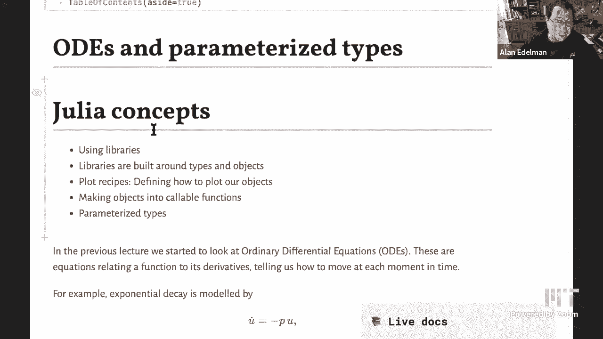
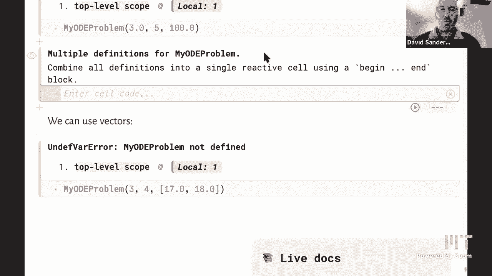

# 【双语字幕+资料下载】MIT 18.S191 ｜ 计算机思维导论-Julia(2021最新·完整版) - P18：L18- 工具库和参数类型 - ShowMeAI - BV19g411G7ab

yeah you got it all good，can you sorry say that say something，again i mean are we starting in two。

minutes，so you're good you're good，okay i always，i could say a few words of introduction。

okay it's 105。 i think we should start，uh，put up your notebook just then i'll just。

say maybe a few seconds of introduction，philip might have a few things to say as。

so uh just to introduce。

a little bit of what um dave's going to，do today with，ods and parameterized types uh i think。

i think the very title is kind of，interesting oh we lost your screen。

but it is interesting because i think in，many other courses，you would learn how to solve an ode or。

you would learn how to call a package，for an ode，but i don't know of many courses where。

you would learn the influence of the，software language，on the calling of the odes or how。

one can use software constructs to build，so，i think this is something that's very。

novel for the course that we're teaching，i mean，maybe you find it somewhere else i'm not。

sure but i think it would be very hard，to find，but that's exactly what dave's going to，ahead and do。

do just that yeah，thanks ann hi everybody so as alan was，saying。

we're going to look at solving odes or，ordinary differential equations that we。

started looking at in the previous，lecture，but we're going to solve them by。

using a package or a library uh written，in june，the things we'll look at today are how。

can we actually，use libraries well you kind of know that，already we've been using。

several different libraries like，plots。jl uh so，you know i'm going to use the word。

library interchangeably with the word，package um，but the point of the lecture will。

actually be apart from to learn，you know the basics of how to learn how。

to use this particular library which is，called differential equations dot jl。

it's also really about how that library，is actually structured how do you。

structure our library in julian，and the answer to that is usually that，it's structured around types。

and objects that have those particular，types，so for example we'll see that if we want，to plot。

um you know we want to solve an ode that，will give us a new object。

uh of a particular type and then we need，to we want we want to actually be able，to plot。

uh objects of those types and so we，define these things called plot recipes，that allow。

us to communicate with plots。jl the，information about consonants。

we'll also see how we can make objects，behave as if they were functions。

basically we turn objects into functions，that we can call，so they're called callable objects。

and um we'll also look at type，parameters which is，a key to making all of this actually。

fast or performant in julian，so let's just recall what what a，differential equation is。

that you know we we derived last time so，it's going to look something like this。

the derivative of u with respect to time，equals minus，p times u so we always use it going to。

use u dot to mean the derivative of u，with respect to time，so this is an equation that relates a。

function u to its derivative and it，basically tells us that we're。

you know at a certain time and we're at，a certain position in space。

it tells us how we can move from that，in，so we're going to move a little bit in。

that direction and then as soon as we，move a little bit，uh this equation tells us that actually。

the direction that we move needs to，change a bit，and so then we're going to use the new。

direction to move the legs a little bit，and as we saw that basically we can。

convert that into an algorithm，using time stepping which is literally，taking these little steps。

in an algorithm and so we looked at that，using the euler method but it turns out。

that the euler method，is you know nice and simple to derive，and intuitive but it's actually。

a pretty bad numerical method it doesn't，behave very nicely，uh in many many different ways and so。

basically you should never ever use the，euler method，in reality and so instead even but it is。

a shame that，i think many students walk away from all，too many。

introductory courses thinking that the，organ is the way，you do these things that's definitely。

true yeah so，basically the message is you should，never ever ever。

use the euler method to integrate an，ordinary differential equation。

there are there's a version of the euler，that，uh that you can use but anyway um so。

what should you do instead you should，use a more complicated method that。

more more closely you know um reproduces，the true solution of a differential，equation。

and we derive methods，more advanced methods in courses like 18，313 numerical analysis。

that i put a link to in this notebook，but in this in this lecture we're not of。

course going to go into those methods，we're just going to use a package that。

already implemented those methods in a，very nice way，so we're going to look at how we can。

actually access all of these basically，state-of-the-art numerical methods。

via the package so we want a way to，you know write down this differential。

equation and then solve it using the，package basically，with this a given initial condition okay，so。

this uh package that i put a link to，differential equations。jl，has been developed over the last few。

years um the the lead developer，christopher caucus is currently a。

uh an instructor at mit in the math，department，and so the the basically。

the goal is to sort of be a you know，what you，you could call a one-stop shop for。

solving differential equations，and basically to try and implement all，the methods that。

are known and there are there are a lot，of different methods known。

and basically try to implement them all，in a sort of coherent way uh so that you。

can just swap in and out different，methods and test，is this method good for this particular。

type of equation because different types，of equations behave in a different way。

have different behavior and so different，uh，numerical methods might actually be。

better or worse for those particular，equations so they've done a lot of work，to benchmark。

which which methods work on which types，of equations and actually to choose，automatically。

uh a correct method uh based on how，you know as they're solving the equation。

there without will actually，change the method in the middle if they。

realize if the package realizes that you，know the solution，is changing the way it behaves for。

example if it's changing very fast，you might want a different kind of。

method than if it's changing slope，okay so how do we actually use this。

package so we need to write our，differential equation in a particular，way。

which looks like this so we have u which，is the dependent variable，or variables is going to be some。

function f of，time t and the position the current，position u，and then there's this p which is our。

parameters，of the function so what does that all，mean so let's just think about our u dot。

equals minus p，u example what is this dot thing again，what is what is a dot。

yeah i already said dot is d by dt is，the derivative with respect to time，of the of the variables u。

okay yeah so um，if uh so so basically we we need to，write the right hand side。

of our differential equation as a，function that's going to take in。

the variables u and the current time t，and in fact it also needs to take in the。

parameters p and so it's going to look，like this you're always going to write，it down as。

f of three things the variables u，the parameters p and the time t even。

though in this particular case our，differential equation u dot equals minus，pu。

does not depend explicitly on time the，right hand side minus pu does not have，time。

right i could actually write that down，note no，explicit time dependence。

on t so there's no t in the right hand，side but i still need to put the t。

in this function uh because the，software assumes that all the functions。

that you pass to it will have three，different arguments okay so，now we need to specify the data that。

we're going to，give to the differential equation solver，a differential equation solver is。

literally just a piece of software，probably a function that you're going to，call。

that will take in the information about，the differential equation and literally。

solve it so give you some kind of，thing back that represents the solution，in other words a function。

over this time interval so the time span，or time interval，i give have to give us a tuple a pair of。

two numbers，the start point the starting you know，time which i've chosen to be 0 and the，end time 10。

and this u0 is the initial value of u，right the value at time，0。 so i could have written that with a。

sub u u，sub subscript 0 but then it just makes，it more difficult to type so i just left，it as use。

u0 is the name of the variable so just，defining those two variables。

and now we need to give all of this，information to the solver to the。

to the package so how do we do that it，turns out that，in this particular package and in many。

julia packages this is a very common，way to design packages in julia what we，do is we actually。

introduce a new type so the packet in，inside the differential equations。jl，package。

there is this type called ode problem，defined，and there are various constructors。

defined for that type so we've seen all，going to see，how they're actually used inside a sort，of prop。

inside a sort of full-fledged，state-of-the-art，numerical package so basically。

there's this type defined and we'll，actually define our own little version，of this later。

to see what's going on inside as just a，type define and this constructor where。

you pass in these four，arguments so you pass into this type the，function that you want to。

integrate that represents a differential，equation the initial condition。

the time span which is this tuple and，the set of parameters that you're，passing in。

you just put those inside this，constructor and you call the result。

something so you give it a name which，i've just called a problem with a。

lowercase p so note that you know um，julia is case sensitive as you know so，right。

right so it's capital o capital e d，capital e，capital p for problem and then。

everything else is lowercase，and so when we define that object you'll。

notice that it prints out or displays，some information about this object so it，tells us。

you know it repeats what the time span，is what the initial condition is。

but in fact currently it does not，display the values of the parameters，that you passed in。

and but it does tell you what the type，of，the u is you is of type float64 and it。

tells you what the type of these times，is they're also float64。

and it tells you that it's in place so，there's in place，uh an outer place outer place means um。

that you act okay so sorry in place is，false，so that's telling us that it is not in。

place in place just means that you also，are going to pass in uh in an array。

which you modify to update the，differential equation that's not what，we're doing here。

we're making a function which returns a，new value that we're not modifying，anything。

the idea of the modifying is that you，can pre-allocate，memory and that will actually make it。

more efficient but we won't go into that，today but that is，an important thing to know if you're。

going to use this package in an actual，uh sort of more more uh intensive way。

okay so now we have set up this problem，object this is an object。

of type ode problem now what we need to，do is solve，this ode right to solve this sort of。

problem that we've set up with all of，this information all this data。

so indeed they they have provided a nice，function called solve。

which literally you pass in this problem，object and it will solve it for you。

so that's what we've done here solution，equals solve of problem，very very nice syntax you know very。

intuitive，um and what happens if we do that we see，that it returns。

another object in fact so we'll we're，going to look at the objects in more，detail later。

by the way we've got a question in the，chat i think i missed it it was。

already a couple of minutes back um but，we've got a question about i think it，was when you said that。

well you know it doesn't look like you，depends on t but it does look like you，depends on t。

i've always said that a little confusing，maybe it is confusing，yeah so right yeah so exactly the。

solution，u of this equation the solution u，uh yeah the solution u of this equation。

is a function and that is a function of，time，that is definitely true but when i write。

down the differential equation，in the right hand side of this，differential equation there is no t。

right i do not see the letter t here，so when would i see a letter t there for，example if。

i had some cosi，so for example i i was sort of there was，some suppose this was the number of。

people are recovering from a disease and，there was some，you know it was i was modeling measles。

or something where there was some effect，of the fact that，i have children going back to school。

which sort of has this periodic，uh behavior where they go back to school。

and then they go on holiday and then，online，i i still think this is confusing like。

well so what i'm going to say is，hand side，of the equation and then there's an，explicit t there now。

wish i'm，i'm i'm i'm doing something but but you，know you does depend on t。

in the end so you guys depend on t，definitely but i do not have a there's，no t。

i don't write t in this right hand side，that's the point that's what。

that's why people talk about an explicit，time dependence that means there's，literally。

a t in the in the right hand side of the，differential equation like that。

yeah i agree it's it's it's it is，also，you could also you know write this as，sort of。

ah actually i did here u dot of t equals，minus p，of t，and you know then u at the time t is a，number。

and that tells me what the derivative is，at that particular，time well another way if you don't。

say it，is if you just look at the right hand，side，above you the the things the right-hand。

side of the u dot equals the，the minus pu that right-hand side is。

is is by itself a function of p u and，potentially t，but not in this in this example um。

that's what we're talking about，the fact that you're adding on the udot，and solving。

so you're going to get a u of t is is is，coming later，but it's not it's not there yet in the。

right hand side that's the way i think，right，so basically you know you can also think，of it as。

if you start at a later time so suppose，i started at time，10 with this initial value instead of。

time 0，then this equation would decay in，exactly the same way，because it doesn't depend there's no。

explicit time dependence it doesn't，depend on the value of t，whereas if i have my cos t term that。

would actually depend，exactly on when when you're not like me。

it doesn't slow down in the morning and，speed up later in the day，exactly got it good exactly good。

good analogy okay so so we are solving，this problem right we set up the problem。

in this object this variable called，problem with a lowercase p。

and then we're calling the sol function，function，the soul function knows that it's going。

to receive an objective type ode problem，and it knows what to do with it and it，will do some magic。

that is basically doing something like，the euler method but using a more。

complicated numerical method，and um it will produce some，output and the output is being shown。

right here，so currently i have this，value of p and then i'm passing in。

p so where where am i defining p p is，actually defined down here。

so all of these plots look weird because，p is currently zero which is pretty，useless。

so let's make p something non-zero it's，going to recalculate all of these plots，and now。

i can see something more interesting，okay so，here we go so it has solved the problem。

with that value of p，0。2 in this case it starts with a value，of 100 because i told it to at time。

0 that was my initial condition and，everything else gets calculated by this，numerical algorithm。

just in so this is basically doing some，kind of time stepping。

but a much more sophisticated kind than，the euler method that we looked at。

in particular you can see that the time，steps between，these different so this column one two。

three four is just labeling which row，we're in，the actual data that it's outputting is。

this so the timestamp which is a float64，which tells me when which time points，it's evaluating。

at it's calculating at and then the，value which is the height of this curve，that i'm trying to solve。

u at that particular time t that's given，by this first column，and you can see that the differences。

between these times is not，are not constant in fact so the solver，is actually choosing。

how to space out these times you can see，that as it goes on it's sort of。

increasing the time spacings because it，realizes that oh this is a nice smooth。

function so i can take nice big steps，i know roughly how the function is。

behaving or pretty accurately how the，function is behaving，so this is the output of this solver it。

has only eight，time time points you know for this，particular differential equation for。

this particular initial condition etc，okay so，so what is inside this solution object。

we'll look at in a minute，let's just first of all see what we can。

do with it now i would like to plot the，solution，right so let's just try plot of solution。

they can literally write，plot of solution and again it knows how，to plot the solution。

and it gives me this plot of this nice，smooth curve as a function of time。

and it even labels the t axis for me and，then i added this label solution。

onto the plot okay so so everybody who's，watching this should be think this is，like amazing like。

yeah we had we had eight time steps，where you might have expected there。

would be like a hundred or a thousand，right and you're getting this you're。

plotting the solution but instead of，getting eight points you're getting。

this beautiful beautiful continuous，curve like yeah something magical must，have happened here。

and and this one whatever is happening，so what is happening so，uh give it away oh well yeah。

i wanted people to just like be in off，for a few more seconds okay sure。

like because i don't think this would，happen in any other numerical library。

that i know of so there's something very，interesting going on。

right all right go ahead give it away so，i can jump down to say，to to to to show this curve which is。

uh what hap these are the actual data，points these are red points。

right so those are the eight data points，but somehow，it doesn't just have those eight data。

points somehow it's able to tell us what，is happening between those time points，as well。

uh with this with some kind of smooth，you know nonlinear curve。

you might think oh it's going to join up，these data points with just straight。

lines between them but that's not what，it's doing is doing something。

much more sophisticated and so now this，is where the computer science。

mixes with the computational side yeah，the sort of thing that i always love to，kind of。

point out that you know one alone，doesn't quite do the trick，yeah so the first surprising thing is。

that we're actually even able to，do this plot of solution so what's going，package，and plots。

jl does not know about，differential equations，so what happens is that differential，equations。

jl is defining what's，something called a plot recipe，and that's just a literally a recipe as。

well set of instructions，for it's telling plots it's sort of，adding some information to plots to say。

how to actually plot objects of this，type，so we won't go into exactly how you do。

that the syntax but it's actually not，that difficult to do，so if you define your own type you can。

define a plot recipe on that type which，just basically tells you。

you know how to extract the information，a plot，what is it exactly that you want to plot。

so that's what they，what they did but how do they get this，nice smooth curve so can i give it away。

go for it okay so what it's doing is，something called interpolation，this。

this data at these particular points，then this，the actual differential equation the。

actual solution method of the，differential equation，that it's using also provides。

a sort of polynomial fit，in between those data points and it just，needs to evaluate that polynomial。

at each given time in order to，tell you what the approximate value of。

the science i actually i don't know，exactly how it works but i would imagine，that。

in the course of solving a differential，equation i mean you're given the。

derivative as well as the value at a，point，so instead of you know if you just。

connect to two points you know a，straight line is determined by two，points the you know。

two pieces of information but you'd have，the derivative that ought to be four。

pieces of information so you could get a，cubic，right i don't know if that's what it's。

doing or if it's doing something faster，than that，is even more funny than that yeah。

but basically the the actual numerical，solution method，the nature of it is to basically give。

function，and that taylor expansion is a，polynomial approximation and it just。

it just needs to evaluate that，polynomial approximation at different，places。

and so we can actually get access to，that ourselves，we can do something like this let's。

define tt as 3。5 that is not one of the，points，where it gave us the data but we want we。

still want the value there，we can just evaluate the solution object，as if it were a function。

so this is you know using the normal，julius function called syntax but，passing in this tt。

and it's calling and interpolate this，interpolation method to evaluate this，polynomial at that point。

and then let's just add that point onto，indeed，it lies on the curve so this curve is，basically just。

evaluating that interpolating function，at many many，points along between 0 and 10 in order。

to draw this smooth curve in，in order to give the sort of full，solution。

so we're able to pretend that on the one，hand we only have 10 points but we're。

able to pretend it's a continuous，function now and we could even call it。

is it discrete is it continuous it's，kind of both right it's a list of points。

it's a continuous curve，right there's no you know the somehow，this data structure。

is magically treating it either which，way depending on what you want to do，with it。

that's definitely true so how do we get，those discrete points out actually。

well it turns out that inside the，solution object there are various fields。

just like we've seen in when we've，defined our own types，do，solution。t i get a vector of those。

timestamps that we saw before and if i，do solution。u，i get a vector of the values of u at。

those particular times which，just those eight points those are that's。

what i'm plotting here with these these，dots，so all of that is contained inside the。

solution object but the solution object，also contains，more stuff which is how to and do this。

interpolation，okay great so by the way of course this，is pluto so we can just grab。

p and you know move it in a slider and，it's actually it's being a bit slower。

than usual oh that's because i'm using，plotly let me switch back to gr。

then um when i do that now it should be，much faster and it sort of。

updates almost in real time so it's，changing p，it's resolving the differential equation。

every time using the package and that's，actually pretty fast，and fast enough so that i can um you。

know plot it in basically real time and，here i'm comparing，the numerical solution to the exact。

analytical solution we know exactly how，to solve this pde it's this exponential。

decay that we saw last time，so i can just compare the two visually，and we see that visually they're。

identical that they're slightly if we，calculate，the difference the distance between them。

it'll be slightly non-zero because，we're not calculating the exact solution。

with this numerical method we're，calculating an approximation to some，very，high accuracy okay。

so we can also use the package to，not only solve one differential equation。

but also a system of differential，equations like these，s-i-r equations that we saw last time。

that model the dynamics of our，population，so here are the equations again again，you know dot。

is still the derivative with respect to，time s was the number of susceptibles or。

the number of people who might catch the，disease i is the number of infected r is。

the number of recovered and we have，these，uh these these equations where these。

rates and beta and gamma，that defines the dynamics of this system。

and it turns out that in order to use，this in a differential equation solver。

we need to think of this，as well one way to think of it is as a，set of uh equations for a single。

equation actually for，vectors so we're going to convert this，these three set of three equations into。

a single equation but for a vector，so we're going to put all of the。

variables s i and r into a vector called，capital，uh called boldface x or also we could。

think of them as x1 x2 and x3 the three，variables s i and r，and then uh it's basically the same。

structure as before but now everything，is a vector so，f also has a has to be a vector because。

we're feeding in a vector x and we need，a vector out，which is going to be the right hand side。

of this this derivative of this vector，and so basically this f is going to。

consist of three functions，which give the right hand sides of each，of these three equations。

so that all looks very you know，mathematical and complicated but。

once once we actually turn it into code，it's not that complicated at all。

so we're going to just put the three uh，variables into a vector here's the，vector of s。

the initial s you know i could actually，let's actually make that more，explicit so s 0 is 0。99。

i zero is 0。01 and r 0 is 0。00，to，vector，x zero right so x zero is the initial，vector。

there it is and now i need to，a time span again so this time i just uh。

wrote down the time span right here 0 to，50，is my time span and now i need the。

function that defines the differential，equation，so i'm it has the same structure i。

called it capital s i，r has the same structure i need to pass，in the variable the dependent variable。

the parameters and the time just like i，did with my function f that i defined，right at the start。

but x is now a vector and so the first，thing i can do is，unpack that vector into my three。

variables s i and r，the three local variables inside this，function。

and p is the parameters that i now have，two parameters beta and gamma。

so i'm going to unpack those as well，beta gamma equals p，because now i can just transcribe the。

equations just like i had them，upstairs right so here are the three，equations。

these are the right hand sides the the，first one is the right hand side of。

of x one dot or s dot and that was just，minus b two times s times i。

the second one is i dot that was beta，times s times i minus gamma times i。

the third one is r dot which is just，gamma times i and i put those wrap those。

in a vector with this square bracket，so this is kind of the simplest way you。

could do it there are more sophisticated，things you could do to make it more，efficient，saying。

um you can if you prefer you can add，parentheses here just to make it clear。

that that is a tuple that you're，you're you're making equal to this，vector。

and that's going to unpack the vector，into this tuple so，it's basically going to define each of。

these variables separately as the，relative the the respective components，of this vector。

okay so that's my sir function and here，is the set of parameters i have beta and。

gamma that are defined by sliders just，downstairs，and now i have my sir problem so again。

i'm just going to use the same，ode problem object and i pass，in all of these new uh these new things。

which are now，you know really they're not all vector，objects but i just pass them into。

ode problem and it recognizes oh yes now，the type，of the outputs or the input you know the。

type of the，uh u0 the initial condition is now a，vector of flow 64。 so this is actually。

telling me that here，and here's the initial value right，okay so now i do the same thing again i。

just solve my sir problem，this ode problem object and i get out，the the output。

and here it is so what does that look，like now it has，timestamps just like you did before now。

there's it has chosen，more times because one of the functions，changes faster。

and also because i'm going up to a，longer time which is time 50。type。

of different lengths and here it's is，it's telling me that oh yeah，i now have three uh values in my。

solution at each time，it's a vector of three values so this is，just a way that it's。

you know that it has chosen to display，this information but，the information is all contained inside。

okay so again we can try to plot these，things so let's just again try plot of，soul。

and we see that it actually gives me let，[Music]，there we go so you can see that，to。

i always forget exactly how to do this i，think it's like this，it's a it's a sort of matrix of。

uh labels and then it labels the curves，correctly so s，starts off at one almost almost all of。

the population was susceptible and the，amount that the the proportion the。

susceptible drops almost to zero，and then uh i is this red curve which co。

or orange which goes up almost to 75，percent so we，sort of，at one particular moment。

and then drops back down and this is the，recovered which goes almost to one。

but then i can change these parameters，and as i change the parameters it's。

resolving the differential equations at，every step，and um i shouldn't let it go negative。

because that's not very physical，and um as i change you know this is the。

camera is the recovery rate you can see，as the recovery rate gets bigger。

um everybody recovers faster of course，so you know it's again even though。

there's now three equations that it's，solving at a recycle one vector equation，with three unknowns。

uh it's still pretty pretty fast this is，a very fast package，so that's how that's the sort of basic。

usage of the differential equations of，jl package it has，a lot more bells and whistles in。

particular one of the things that i can，do for example，is actually okay okay before i get in。

get into that，we can also plot other other things so，we can plot。

different combinations of variables so，here i'm plotting just，variables one and two i'm not plotting。

time anymore on this graph，or rather time is implicit so what it。

wasn't what is happening is that this，arrow is telling me that i'm supposed to，follow this curve。

in this direction so the initial，condition is here right，it's s e equals almost one and i equals。

almost zero，and then as time goes on i'm following，this curve，so this is a representation of what's。

called state space or phase space，which which is basically a picture of。

all the possible states of the system，here i'm only drawing s and i i'm not。

drawing r so it's not really all the，possible states but，um anyway so basically we can see on。

this picture，how s and i change over time by，following along this curve。

in time so again we could do an，animation of that which would be。

that would be nice exercise okay and，then actually，but we only have three variables in this。

problem so actually we could even draw，in 3d if we wanted to，and so here's a version of that plot。

in 3d this is the the full state space，or phase space，in three dimensions i'm going to have to。

re-plot this so i'm specifying that i，want to plot，these three variables this vars means。

variables and here is the plot，of how s i and r all change in time and，so it goes sort of。

up this curve which bends around and，comes back，you know that the eye gets big and then。

gets small again，okay there seems to be some issue with，yeah i think i might have got these。

labels in the wrong order，anyway okay and so by the way there's，another library in this differential。

equations ecosystem now called，psi ml for scientific machine learning。

which is called modeling toolkit，and that enables you i've mentioned the，symbolic。jl package before。

that enables you to basically specify，odes in a very nice way a sort of，symbolic way that's，these。

then defining by hand these sort of，vector functions，but we won't go into that right now so。

okay so what what what sort of lessons，can we learn，from this so so what i was trying to say。

is that many julia packages are，structured in this way，you have types which you pass。

information into and then you call some，function on that type，and it returns another type that。

contains the output that's a very common，pattern，yeah so one of the things i wanted to，say was um。

that if we have this solve，that's called soul 2 solve it is，choosing。

a numerical method to use but i can，actually tell it which numerical method，i want to use。

for example i can use the euler method，like this，and i need to give it a step size no。

okay i don't remember how to do that，one so，sit five is a particular numerical，method developed by。

a greek researcher called citrus that's，why it's called sit，and five is because it's what uh so。

called runge-kutta method of order five，roughly and um so basically what am i。

doing here i'm creating，this new object this is also an object，this is a constructor of。

a an object called setfi that's also，defined by differential equations。jl。

so if i i do you know uh sit five with，parentheses，and i call that i don't know um method。

then i can look inside method and try，and work out what is，this，is actually just this this uh。

this type exists only to specify，to the sole procedure which method it，should actually be using。

there's nothing actually stored inside，this type it's just a kind of label，that enables julia to。

to dispatch so uh julia is based on this，multiple dispatch paradigm so basically，there are different。

you can think of conceptually at least，there are different versions of this，soul function。

which different methods which，depend on which kind of object i pass in。

as the next argument it will actually，conceivably call different versions of。

the soul function for different types of，algorithm actually if we look at。

the methods of solve we can see that，there are，well there are there aren't very many，actually but。

so what is happening is that this uh，sit 5 object is actually being passed。

in you know inside the sole function，it's calling some other functions and，those functions，uh。

algorithm object i pass in，okay so let's um，so one of the things we saw was that the。

solution object can be used as a，callable function so let's see how to，actually do that。

so how can i do solution and because，solution is an，object so how can i make that into。

something i can call as a function，so as an example um you know if。

if i define a matrix a we cannot usually，use it，as a vector as as if it were a function。

a function call would have these square，brackets and these，round brackets parentheses whereas we。

array，but if we want to for example define，matrix，as a function of a vector to mean matrix。

times that vector，well that doesn't actually work so we，could actually define that if we wanted。

and the syntax would look like this so，we we say，i want to treat a matrix a as a function，so i wrap。

that whole thing in parentheses and i，say that thing acting on，times。

x that's how i that's the syntax，to actually make an ob an object of type。

matrix into something that i can call，note that that is different from calling，the [ __ ] the。

the type matrix this is calling a，constructor of the matrix type，this is going to be defining how to。

call an object of type matrix as a，function，so but i should not actually do this。

because this is what's called type，privacy，i do not own any of these objects base。

julia owns the matrix object and owns，you know a vector or whatever i'm，calling it on but。

i'm quite at liberty to do that myself，if i have my own type so here's an，example。

if we want to to create an object like，this solution object，so we're going to have some kind of。

simple euler output type，which is going to have a list of times。

and values where we're calculating these，outputs of the euler method，and then i want to be able to。

interpolate that at any other time i，would define，it like this function of。

again i have the same syntax i wrap，everything in parentheses and i say。

i want to define what it means to call，an object of type simple。

euler output which is called solution as，i i，i specify it like this and then at the，time t。

and then inside i'm going to calculate，using some kind of interpolation for，probably just。

straight lines joining the the points，that i calculate，um i'm going to calculate uh the value。

at time t，and in order to do that what i'm going，to need is to use the information that。

is inside this object of type solution，so solution。times will give me that，vector of times。

that lives inside that object and，solution。values will give me the values。

and i'm going to use those inside this，function to calculate the correct thing。

so that is how we can make objects，coolable，um in a pretty simple way actually and。

then we can just use them as if they，were functions，and so i would call this as again。

solution you know if solution was simple，euler output，of sort of the vector 1 2 and the vector，3 4。

i would call that as so let's just go，let's say um，some return of string interpolating at，time t。

sorry time t i would call it as，solution at time 3。5 and it says，interpolating at time 3。5。

and then i would actually go and，calculate that as i said using this data。

that lives inside this solution object，that's，beyond the limits of my time so let's，actually。

do some kind of linear interpolation，okay and by the way right now uh。

pluto has this uh limitation that this，function，where you define how to call objects of，that type。

actually has to be in the same cell as，uh the definition of the type，hopefully that will restriction。

restriction will be removed at some，point，so okay so let's dig a little bit into，the actual objects。

that are that we've you know we've been，using so let's start by looking again at。

this ode problem type，so what is actually inside that object，what does it actually do does it just。

put in the does it just sort of，sort of uh put the information that i，send in。

does it just put that into an object，literally one after the other。

and the answer is it almost does that，but not quite so，we can actually see what fields are in。

this object，using this uh syntax field names of type，of problem。

right so type of problem is ode problem，[Music]，and but it has all of this complicated。

stuff that we'll get to in a minute，but first of all let's just look at the。

field names and here they are so，inside problem it has an f a u zero a t。

span and a p that's not surprising，because that's what we passed in，ourselves。

it also has these other two things that，i you can use for，object，then。

there's this other problem type object，is，so here you can see so we can actually，ask。

ask for those that data，in the usual way right so problem well i，put it down here so problem dot u0。

is extracting the u0 from this problem，object and，you know that was if you remember 100。00。

that was the initial value，and the t span is this this tuple。

of two values etc so for example problem，you we we can see from here that there's，a problem type。

field so let's look at that so，problem。problem type，it turns out to be this particular type。

that's also defined in this sort of，differential equations，so this is a standard ode problem there。

are all kinds of other，ode problems so this is something that，we did not pass。

in right we never said oh this is a，standard ode problem，what happened was when we called the con。

the constructor of the ode problem type，it realized that because of the type of。

information we were passing in，this was a standard ode problem instead，of you know。

some other kind of stochastic problem or，or more complicated or there are various。

other kinds of od problems where you，split the variables in some way。

et cetera so basically it's not quite，doing just，the the boring thing of putting all of。

this information，into a new object which is just going to，hold that information it's actually。

doing some computations，on the information we passed in and，storing some more information，to see。

everything that's contained into inside，the object instead of just doing this。

sort of one by one like this，you can，do problem dot tab if you press the tab，key it will give you。

interactively it will give you this list，of what's inside，that's a more useful way to do it if。

you're using something interactively，okay so to see everything contained in。

there we we've already seen this i think，we can use the，dump in pluto with a capital d or if。

we're outside pluto we can use dump with，a little d，and it will print out or display。

everything that's contained inside the，object so again it's telling us with a。

width this is of type ode problem，and it contains f which is the function，that we passed in。

but you'll notice that what f is now is，this complicated，other thing what is this it's actually。

another type called ode function，which is wrapping my function f and，again it has。

more information about f than i put in，but it basically kind of computed。

more information about f and so you can，see for example that，um that all of this stuff here is。

actually about，different about derivatives so it's，telling me do i have。

access to the jacobian for example here，this jack as jacobian。

of the function so you can actually pass，in a jacobian if you know the jacobian，or the。

the derivative of your function you can，pass it in and it will actually be able。

to use that extra information to，do a better job of solving a，differential equation。

or you can use automatic differentiation，and it will automatically calculate that，for you。

and it will store that in but it only，wants to do that calculation once and so。

it has to store that information，somewhere so it will actually store it。

in this in this new object so you can，see that it's doing something，pretty sophisticated with the。

information that we pass it，and then everything else is you know the，u0 and the t-span and the p。

are exactly what i passed in and then as，i said it also has this other stuff，that's used for more。

complicated applications and similarly，we can look at the solution object。

uh so type of solution well what do we，expect it to contain we expect it to，contain the values of u。

that were output and the values of t，so those are definitely in there the。

data that we were using before，but also it needs to know how to do this，interpolation。

so everything else here i believe is，information，extra information about something about。

what happened，during the solving process，so you can see that for example it，stores the whole prob。

the ode problem is actually stored，inside the solution type so that you。

actually can reconstruct oh what was it，that i actually calculated。

and then um there's this other object，called alg，and which is actually telling us which。

algorithms were used to solve this，uh system and so um，it it's it's choosing one of these。

default algorithms or maybe it's even，switching between them right so you can，see that it。

might actually be choosing different，algorithms to use at different moments，depending。

on the behavior of the function so i，can't tell i，i i i can't interpret this to。

tell you exactly which method was used，for which part of the integration but。

you can actually reconstruct from this，information exactly what it did。

i believe and then there's this interp，object which is doing the interpolation。

and here's some information that it，needs for that it needs coefficients of。

these polynomials which are stored，stored here somewhere，and from that again it can reconstruct。

the whole thing，so if you you know if you do a very long，integration and you get out all this。

information you probably just want to，store it to disk，you can just sort of dump this whole。

object to disk and then you can，reconstitute it later and you have your。

solution in a very structured way，so that you can actually you know for。

example interpolated a different，position that you hadn't interpolated at，before for example to get。

you know a solution uh at some other，time etc，okay so to finish let's look at。

um the types of these objects so let's，look at type of problem and you see that，it's this。

um it is an ode problem but it also has，all of this other stuff which goes on。

and on and on and on and on and on，with a lot of nothings and so what is，called。

type parameters so this curly braces，means，that this is all actually part of the，type of the object。

and um basically what's happening is uh，okay so let's look at the type。

parameters for this particular object we，can do that like this，uh the type has this it is a julia。

object and it has inside it a field，called parameters and now i'm just。

putting it into into making it into an，array，so that we can actually see it more。

nicely inside pluto here we go so these，are the type parameters。

uh so again uh you can see that okay for，example there's tuple float6464 that's，actually the type。

of the t span the time span that we，passed in，so you can see that oh some information，about the type。

of the objects that are stored in inside，the whole object some information about。

that is actually being，added into the type itself of，the object ode problem and so。

why why what is going on here so，basically the answer is that in julia。

in order to get efficiency or speed or，performance，everything needs to be of a known type。

once you know the type of something you，can actually julia can generate。

efficient code for it efficient machine，code，if it doesn't know the type when it。

generates the code then the code that it，generates will be much less efficient。

and so in order to make it so that，different，you know input types for example we had。

an input that was，a scalar or an input that was a vector，those need to actually be different only。

problem types，and the way to do that is by using these，parameterized types so。

let's look at again a simple example of，how we could do that ourselves。

so if we want this simple euler output，as a，correspondence to the ode solution。

you know if we put in as i was just，saying a scalar we want scalar values，out if we。

at each time if we put in a vector，initial condition we want vectors out at，each time。

and so how can we represent that entire，inside my struct，so before i when i defined the previous。

version of the structure so i'm，going to go back but um when i define。

the previous version of the struct i had，labeled，i had annotated that oh i know that the。

times are going to be a，vector of flow 64。 that's still going to，be the case but now the values。

might be a vector of flow 64's if i have，a float64 scalar value at each time。

but they might be a vector，of vector of flow 64。 if i have a vector，at each time。

there's a vector of vectors we saw that，um a couple of，have，that type annotation or that type。

annotation and which one，i will need to store depends on you know。

some some some information that i'm，passing into my function，so the solution to that is actually i。

only want to write this code once right，of course i could write two different。

two different structs with different，names like simple euler output 2。

underscore float64 and simple euler，output to underscore vector vector flow，64 or whatever。

i could do that but of course i don't，want to do that i want to just write the。

code once but have these two different，options，of param of types being generated and so。

the way to do that is like，this with this syntax with these curly，braces。

again so curly braces are always used，for type parameters，of，they kind of act like variables but。

represent，types approximately so we've seen these，before right，um if you do m equals random 2 2 it。

tells you that，this is a matrix of float64 so this，curly braces means this is a matrix with。

float64 inside，that is a type parameter of matrix and，if i do type of，[Music]。

m it actually tells me that matrix curly，float64 is an alias for array curly。

float64 comma two these are tight again，type parameters，so i have a i have a sort of array type。

but i have to specify for for，performance purposes，what are the objects that live inside。

and what is the dimension，of the array so that's exactly what i'm，doing here i'm just saying that。

my od problem is going to be a struct，it's going to have these fields t。

0 t final and u 0 but i'm going to have，these types，of，objects called myode problem or of type。

by the od，problem so i'm going to have my initial，time and my final time。

instead of writing that as a tuple let's，just write it as，in different um fields but they both are。

going to have to be of the same，type t so here i'm saying these are both，of type t。

and because the t is the same that means，they have to have the same type and then，u 0 is going to be。

those are，type parameters of my object so now，what's happening。

uh of my new type my od problem what is，happening what happens when i try and。

create an object of this type，so let's try and create my ode problem，and i'm going to pass in。

three and four as the initial and final，times which are integers and i'm going，initial。

value well it creates successfully，creates an object of type myode problem。

it successfully puts t 0 is 3 t final is，4 and u 0 is 100。0，but you can see that it also did。

something else which is that it，sort of did pattern matching if you like。

on these types and it said oh，look this fits the correct pattern the，pattern was that t。

0 and t final have to be of the same，type，uh oh yeah they are of the same type and。

so i know oh yes then，t capital t must be n64 the type of this，three and this four。

the same type and then the other type is，float64 that also matches the pattern。

and so now it has constructed an object，of type，myode problem if you like underscore n64。

underscore float64 there's this sort of，specialized version of this type。

whereas and you kind of extract the data，whereas if i pass in floats。

everywhere it constructs a different，type actually this is now a different，type，just。

the types that are inside are now，parameterized by this float64 and，float64。

this is really a different type but of，course it，sort of looks the same and if i。

use two different types as the arguments，a float and an int，it actually doesn't even let me。

construct that because those t's don't，actually match，so i could then go and make a version of。

the constructor a new constructor for my，ode problem that allowed me to do that。

and converted them automatically to the，same type，it's actually pretty easy to do i can，can do it。

except we're running out of time so just，just to finish we can also use vectors。

as the initial condition so here's a，vector initial condition，and you can see that now oh it。

recognized that that's a vector and the，type parameter became vector and so that，is how。

these very complicated types are built，up so of course，you know you looking at those packages。

and the types that come out they look，very scary but basically what happened。

was over time during the development of，these packages，you know initially they just started off。

with some simple types looking like this，with just the basic information。

and as they added more and more features，they realized oh，we actually need to add more information。

into the type and more information and，more information and it just sort of，ballooned out of control。

and you get these gigantic types and so，often what happens，with those types is that it's actually。

maybe quite slow to create new objects，of that type because it's basically。

creating it's basically generating new，code every time you have a new，combination of types。

so that can be actually a bit slow but，then，once you've done that initial。

compilation running the code，is very fast because it was able to，generate a very efficient。

specialized version of the code for，those types，so just to finish let me do that uh，constructor。

so i want to pass in a t 0 a t final and，a u zero，of any types and then i want to uh so。

i'm making a new constructor for this，problem，for this object and i want to pass it in，things。

to the same type so i do that like this，promote t0 and t final。

that will give me a tuple which i need，to unpack using，or splat using this splat operator and。

then u0，and now i have to put that definition，inside the definite。

inside the same uh that constructor，inside the same cell，and when i do that it should actually，work。

and uh i didn't something went wrong，oh yeah uh okay，so let's say that that is of type。

t and that is of type s where，tns oh sorry yeah，is that gonna work，[Music]。

okay well that's not gonna work let's，let's let's leave it then um，um it is definitely possible to。

to do this okay so basically just to，summarize so we looked at，this only this differential equation。

jl，package which has these，nice types that enable us to solve odas，very easily。

as a user but then once you sort of，start digging down into the details of。

what's going on inside the package you，see that it's it's it's，it's it's has a very clear clear。

structure and it just looks a bit，complicated but actually，um it's just you know a very elaborated。

development on this，this theme of our parametrized types。

okay thanks everybody see you on。