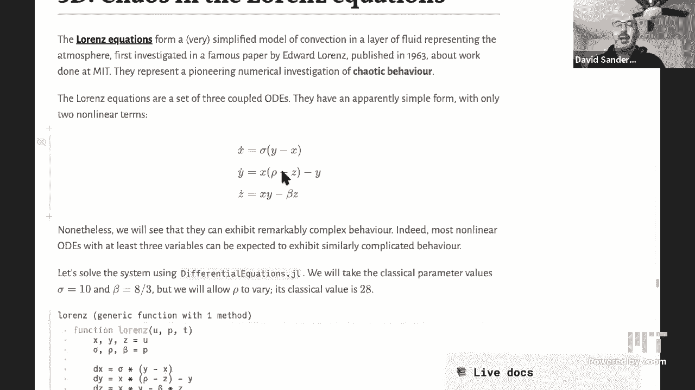

# 【双语字幕+资料下载】MIT 18.S191 ｜ 计算机思维导论-Julia(2021最新·完整版) - P19：L19- 为什么我们不能预测天气 - ShowMeAI - BV19g411G7ab

we'll be starting。

okay shall we get started。

uh yeah see the pluto，okay so，hi everybody so today we're going to。

talk about why we can't predict the，weather。

but we can actually predict the climate，so first of all of course we have to，talk about。

or we have to discuss what is actually，the difference between。

weather and climate so we all know what，weather means，you know i want to know you know when。

the class finishes at 3 p。m，say my time is it going to be raining，can i go for a walk。

and you know i can just go online and，look up the weather，and there will be a prediction of what。

we expect to happen at 3 p。m and i can，actually be pretty，you know pretty sure that that will be。

accurate we can，you know we have data about where the，rain is right now where the clouds are。

and we can actually predict how those，clouds and rain are going，to move because we we understand the。

dynamics，of the masses of air and how water，you know evaporates or forms clouds etc。

so these are all very complicated，physical processes but we we actually，understand。

them reasonably well and we actually can，put them in models which are basically。

partial differential equations，that tell us you know how air actually。

moves around if you know given the，wind speed right now how is this bit of。

air going to move and then，how will that wind change later we can，actually。

um you know predict this quite well，and maybe we can even predict what will，happen at 3 pm tomorrow。

and if we're very lucky we can predict，what will happen at 3 p。m。

in one week's time but you certainly，would not expect to be able to predict。

what you know correctly what will happen，at 3 p。m in one month，and certainly not in one year on the。

other hand we can say，you know the average temperature in，boston is somewhere。

around 55 degrees fahrenheit or that's，something like 12 degrees centigrade，celsius。

and that's going to be you know i can be，pretty pretty sure that next year。

it'll still be around that much and the，that much，on the other hand in 100 years i'm not。

actually sure because，we have climate change which is you know，a gradual。

change in the average temperature so，climate is basically somehow the average，weather。

and then where there is this sort of，short-term um，you know fluctuating uh situation that。

that depends on，very local conditions whereas climate，we're averaging over。

you know uh over all the days in march，and then or april and then it becomes。

suddenly much more predictable，and so you know the goal of today's，notebook is going to be，going to。

model the weather really we're going to，end up with the sort of simplest，possible。

model of the atmosphere which is a a，system called the lorentz equations。

that many people may have seen before，build，up to that to understand if we have some。

model of a sort of physical process or a，scientific process，what kinds of behavior can we actually。

expect it to have，so we're going to start off by looking，at so，we'll only be looking at ordinary，ask。

what kind of behavior can they have sort，of in the long time。

and if i could just interject a probably，a small point，it seems many people believe that，things and。

but，that doesn't mean that one can't get a，feel for them，um fairly early in a university career。

for example you know as an undergraduate，for example，that you can get a good sense as to。

what's going on in climate models and so，given how important they are for all of。

us um we thought we would spend some，time on some of the the aspects of，climate modeling。

yeah yeah so we'll actually start off，with some simple，climate models which basically next time。

maybe which uh basically tell tell you，something like，what is the average temperature over the，time。

and it changes because you know there's，a sun out there that's。

warming up the earth but then you lose，energy as well so you can make sort of，very。

very um kind of global，models in a much more simple way whereas，if you actually then want to。

to really specify how do things change，over the surface of the earth that's。

going to be much more complicated，and the cool thing is that not only do。

you learn about climate models kind of，you know whether you you know probably。

most of us will never go into climate，modeling，but you know you'll learn a little bit。

about it as it affects us all and，in any event the things that you will，learn um apply。

in so many other areas of modeling，anyway that，it serves as an example yes exactly so。

today we're going to，to start with that that process so we'll，look at you know and。

actually what we're sort of really，looking at is this subject that some，people。

call nonlinear dynamics or dynamical，systems where we take an，ordinary differential equation and。

instead of trying to really，uh you know study exactly what the，trajec each trajectory does if you。

started a particular initial condition，well we're trying to get a more global。

qualitative picture and say what kind，of behavior can we find what kinds of。

things can the system end up doing，and so we'll look at in particular，stability and。

uh bifurcation so we'll see what that，means，be，ordinary differential equations so we've。

already had a couple of，lectures on this we saw last time how to，use the differential equations。jl。

package to solve these，and i'll be using that uh to solve the，more complicated equations in this。

notebook and so let's remind ourselves，what that that，that means it tells us if i'm at the，current。

state how i'm going to change as i move，forward in time from that state。

and if i move forward a little bit then，the state changes and so actually the。

direction i need to move，changes as well and so when we kind of，add up all those little changes。

we end up with some trajectory that，moves forward and changes in some way in。

time and that's what we're trying to，calculate，so we saw that this forward euler method，um。

is this very simple uh algorithm，for doing that for us doing timestamping，advancing。

in time step by step with these time，steps of size，little a of size h which is we're。

thinking of as being small，method，although it's sort of very intuitive and。

sort of and easy to derive is actually，not a very good method for actually。

solving differential equations，and so we we can use this package that，has these much better methods。

implemented already，okay so let's start off with a very，simple model。

in one dimension so we only have one，variable that's changing in time so，we'll call the variable。

x and again x dot as usual is the time，derivative the，rate of change of x in time and x is。

going to be，the pro the population of bacteria the，number of bacteria。

uh in some you know dish as time goes on，so how is that going to change it's。

going to go or what affects，how that bacterial population grows。

so if there's a lot of food available，sort of，reproduce at some rate and so we'll，we've been，decay。

but you get exponential growth modeled，by this x dot equals lambda times。

x so lambda is the growth rate basically，how many，sort of uh you know offspring each，bacterium。

will have in a given time but，you know if the bacteria is limited to。

some kind of petri dish there's only a，finite amount of food，and so you can't you cannot expect the。

bacteria to just keep on growing and，growing because they'll sort of。

eventually overwhelm the whole world，instead what will happen is there's a，sort of maximum。

number of bacteria that can exist on，this plate which is called the carrying，capacity。

and that's uh often written as this，capital k，and so we're going to model that。

competition of this exponential growth，and this saturation due to。

you know having only a possible finite，number of bacteria in the dish。

with this term k minus x so basically if，if x the population of bacteria is，bigger than k。

then this will be a negative number and，so the rate，uh and so the the change in x will be，negative。

the the derivative will be negative and，so x will have to decrease because，there's overcrowding。

so there's competition between these two，effects and we can um。

just simulate this equation to see what，that gives rise to，by the way this uh for some reason this。

equation，has the name logistic differential，equation and i've never，quite worked out why it's called。

logistic and that name does not seem to，be at all useful to actually think about。

what it's doing so let's just call it，the sort of，bacterial uh growth equation，out that。

by changing the variables by sort of we，can get rid of all these annoying，constants。

uh the lambda and the k so i say how to，do that here and you get down to this。

simpler version of the equation so x dot，equals x that's the exponential growth，times one minus x。

so basically x is sort of now the，proportion，uh relative to the carrying capacity so。

when x is one that means we're at the，the capacity of the system，and so um you know we can use。

differential equations。jl or i wrote my，own little euler routine which is at the。

bottom of the notebook，as this is kind of the same same idea so，here's the logistic。

right the right hand side of the，logistic differential equation。

x times one minus x and then we're just，integrating it using some，method numerical method uh you're。

starting with some initial value，with a step size and a final time。

okay so what what actually happens so，with，my uh figures being different sizes and，things。

uh sorry about that so let's see，if we just remove this is that going to，nope。

okay uh anyway well i can just zoom out，now again like this，okay so what happens if we start at time。

zero at，height basically population 0。5，well the population initially increases。

it seems to be increasing something like，linearly right now instead of。

exponentially because there's this，competition it's already，it already has a pretty big value so。

it's going to increase in some way and，then it'll saturate so it converges，to 1。

0 and then it just stays there，forever，and if i carry on integrating for a。

longer time it'll just stay，and so that's one of the possible，behaviors that a differential equation。

can have it can reach，that's that，such a such a value is called a fixed，point because it's。

because if i start start there i'm fixed，like i don't move，okay so uh let's see what happens for。

other initial conditions so let's let's，uh，you know here's an interactive。

visualization using you know the usual，tools，what if i start very close to zero well。

i see that actually oh yeah there i，see that there's something that looks。

like exponential growth and i could go，and plot，this on a log a semi-log，semi-logarithmic。

plot to see that actually whether that，is exponential growth initially or not。

but you know dave could ask a quick，question on the previous curve。

how hard would it be not this one but，to start，at time minus 20 and or or，and start close to zero。

i mean this is what that's what i'm，doing here right uh yeah i guess that is。

what you were doing there，what i was hoping is for it to look a。

lot more like the sigmoid curves that we，always see in machine learning。

since i think students are not，interested in that，i can just uh let's pick to make it look，like that。

let's make it go up to time 10 something，like that，yeah it'd be nice if it looks symmetric。

but we don't have to go crazy today，i mean it doesn't you know physically it。

doesn't make much sense to take negative，time right，i'm starting at a given time however。

yeah it doesn't matter right this is，time independent anyway so。

right it's it's whatever they call it，the trans there's a word for that，differential okay。

yeah it's what kindness is the word this，is an autonomous equation。

but the question is to make it look like，and and the key point is。

of course that if you're doing uh i mean，some folks will be familiar with machine。

learning others won't，but if you're doing gradient descent the，fact that。

uh the derivative is is so nice plays an，important role，okay well that looks like a sigmoid it's。

getting there，yeah so i'll take it so if we're，zero，what happens we move away from zero we。

have this kind of exponential looking，growth，but then once we get to you know 0。5 or，something。

this this other effect takes over，there's this competition，and we just converge again to this fixed。

point at one，and so it looks like the dynamics is，pretty boring everything is going to。

converge to one，so let's just keep on going closer and，closer to zero what happens if we start。

exactly at so this is now 0。001 the，initial condition，and you see that it sort of stays close。

to zero for a long time but then it，doesn't，lift off and moves to one in the end but。

what happens if we start exactly at zero，so if we look at the differential，equation。

if we have a zero in here uh then we get，zero times something which。

gives me zero and so the derivative is，going to be zero，so if i start exactly at zero then。

i can't then the derivative is is also，zero and so i'm not going to move。

away from zero and the same thing is，actually going to happen at one。

and so zero is actually another fixed，point let's see that if i start exactly。

at zero i just stay at zero，and also we can see that at one if i，start exactly at one。

i stay at one well okay you can you can，guess the last true what about if i，start above one。

i actually i'm overcrowded and so the，to one，right so it looks like everything's。

converging to one but what happens，if i start with a negative population。

of course that doesn't make any sense，you know from a sort of physical or，biological。

context but it makes sense from the，equation，they can just ask what happens if the。

the initial condition is negative，and you can see that what happens is it，just sort of zooms off。

in the negative direction so it gets it，moves away from zero again，so let's summarize all of these。

trajectories in one single plot，so these are all the different，trajectories starting from。

all different initial conditions so this，is sort of like having an。

ensemble a collection of different，copies of this，petri dish and starting with different。

amounts of bacteria in each one，and negative amounts of bacteria in some，of them whatever that means。

and so what can we see we see that，indeed if i start at one i stay at one。

and if i start close enough to one，i get attracted to one but，if i start at zero i stay at zero so。

zero and one are both fixed points，but if i start close to zero i actually，move away。

from zero and so we make a distinction，between，this fixed point which is stable and，this。

one is stable and zero is an unstable，fixed point，and so you can see that um fixed points。

are sort of，um an interesting and useful kind of，organizing uh feature of this。

set of dynamics if i know that i have a，fixed point then i can look what happens。

close to that fixed point，and that actually sort of actually these。

fixed points in this one-dimensional，system are actually separating。

different kinds of behavior so if you're，anywhere between zero and one you。

converge to one from below，if you're anywhere above one you，converge to one from above and if you're。

anywhere below zero you could you go，away from zero to minus infinity，very fast okay。

so can we so here to get that，information what do we do we actually。

integrated the differential equation，using one of these numerical methods。

could we actually get that information，in a different way without actually，integrating the equation。

and the answer is yes so in order to do，that we're going to think of。

what's called the state space of the，system the space of all possible states，so all possible states。

are just all real numbers between minus，infinity and infinity that's。

that's uh with what the values that this，the system can take，and we're going to plot uh a vector。

field，so arrows that tell me in which，direction am i going to move that's all，i'm going to plot。

and that looks like this so what i'm，what i what does this，plot mean it means if i am at height 0。5。

i calculate x dot the rate of change of，x at 0。5 i get a positive number and so，i'm going to end up。

moving upwards if i start at that point，if i start at，0。75 i'll move upwards if i start at，1。

25 i'll move downwards，if i start exactly at 1 i'll stay at 1。and so this。

picture actually summarizes all of the，dynamics of this system，and you can see that there are indeed。

sort of three regions，of the real line anything as i said，before。

anything above one will converge to one，anything，between zero and one will converge to。

one as well and so you can see that，these arrows pointing towards one mean。

that one is actually a stable fixed，point，and the arrows on the other hand can go。

away from zero and so zero is an，unstable fixed point，and so we actually got all of this。

information which is the qualitative，dynamics，of the system without ever really。

solving the differential equation all we，all we，all we did was sort of look and see oh。

which direction am i going to move in，okay so this picture is called the phase，portrait or the。

it has various names because i'm drawing，state space or phase space。

and i'm i'm saying what what is the，qualitative behavior，of the system in that space。

okay so these fixed points are special，and they satisfy an equation which is。

that you know the derivative if i，that，is if i if my differential equation is x，dot equals f of x。

that means that a fixed point satisfies，f of x equals zero，in other words a fixed point is actually。

a root or，uh yeah a root of the function f that，defines my differential equation so i，can find those。

find find those roots using for example，the newton method that we saw uh。

you know a a few weeks ago and uh to do，that i'm actually using，a package in julia called roots。

jl and，um，that finds roots in one dimension in the，higher dimensional examples that we have，later。

i was actually going to use a package，that i wrote uh called interval root，finding。

but then it turned out that uh to be a，bit too complicated to to fit into，today's class maybe we'll。

do it later okay，so now what can we do we can we have，this system。

but it but that you know this picture is，actually a，complete picture of all of the things。

that that particular system can do，so let's look at a slightly more，complicated system。

so now what we're going to do is have a，look at this，differential equation x dot equals mu。

plus x squared，it's similar to the previous one the，previous one had a。

quadratic behavior uh it had x times 1，minus x，now we're just going to replace that x，we're going to。

add mu and mu is going to be a parameter，that we can change，and we're going to see what happens to。

the dynamics to that picture that i just，drew，as we change mu and so the answer is。

that it looks pretty similar to，the previous case right it's just the。

sort of the other way around actually，uh i have an unstable fixed point up，here at one。

and a stable fixed point down here at，minus one，for this particular value of mu which is。

minus one and now i'm going to change，this value of mu，bit by bit and as i change it we're。

going to watch what happens，to this uh phase space or the and the。

qualitative dynamics but as i change mu，what do we see we see that the fixed。

points are actually moving，closer to each other and as they move，closer to each other but。

they're moving closer to each other but，the qualitative behavior of the system。

is still the same there's still these，three regions，where you either converge you know move。

up or down，and you you hit you converge to these，fixed points but what do you think is。

going to happen，as i increase mu when mu hit zero，what happens is that these fixed points。

actually collide with each other，and then for mu bigger than zero we no，longer have any fixed points。

why is that because mu plus x squared，equals 0，is the equation of the fixed points and。

you can see that when mu，is say 1 i have x squared plus 1 equals，0 in other words，so。

that does not have any real solutions，and so basically，now you can see that the dynamics of。

this system has completely changed，in a qualitative qualitative way now。

wherever i start i'm just going to move，upwards，i'm just going to sort of carry on。

upwards until i get to infinity，right so that i no longer have any fixed，points and the the。

if you if this represented a physical，system instead of stopping somewhere i。

now would just go off to infinity so，this is really a qualitative change so。

at mu equals zero there is this，qualitative change in behavior and i can，see it right here on this。

uh as i as i move mu and this is called，a bifurcation，so bifurcation means something splitting。

in two is that you can think of this as，sort of，splitting you know the space of mu now。

now there's a sort of extra parameter，which is mu that has been divided into，two regions。

one with one kind of behavior and one，with another kind of behavior and that's。

why it's called a bifurcation，and we can actually put all of those，vector fields that i drew。

together into this picture uh，so now i'm drawing you know on the。

vertex in the vertical direction i'm，drawing exactly the same，picture that i just drew with the the。

unstable fixed point upstairs and the，stable fixed point downstairs。

but now i'm putting stacking them all，together for different values of this，parameter mu。

so that we can see them all at once and，what we see，is that that you know this is called。

this is now called the bifurcation，diagram，of this um system and we can see that，indeed。

you know if you fix your attention at a，mu that's less than zero and a mu that's，bigger than zero。

you can just immediately see that the，qualitative dynamics is different。

because uh these fixed points have，disappeared，so there's this critical value of mu。

which in this case is zero，whenever you have you entered i kind of，lost track what did you say。

how did you fit into the story though in，this differential equation。

okay x dot equals mu plus x squared got，it okay，so as we're changing mu we're actually。

changing the differential equation and，of course，that's like you know you see something。

like you have a pendulum and you're，changing the mass or something。

you're changing some parameter some some，yeah sort of some variable if you like。

of the physical system or the biological，system，so we could be changing the rate at。

which by bacteria reproduce and then，suddenly，it turns out that it's no longer，possible for。

you the system to reach a stage where，the bacteria，okay so now let's look at a uh even more。

complicated，slightly more complicated example so we，now have a cubic。

uh in my ordinary differential equation，a cubic expression，still with mu plus that and we're going。

to do exactly the same thing，so we could go through and plot the，vector field and then change mu。

interactively，but let's just jump in and look at the，bifurcation diagram again。

so this again represents you know for，each value of mu if you fix a，value of mu in this differential。

equation uh，then you're supposed to be thinking of，taking a slice a vertical slice through。

this diagram so for example if i take，the slice，when mu equals one what is the，qualitative dynamics。

everything below this fixed point，converges up to the fixed point。

everything above it converges down and，so this there's one，and the same happens if mu is a minus，one。

there's one single stable fixed point，everything converges there。

but what what happens for this region of，mu，in between say minus 0。4 and 0。4 or，something like that。

what happens is something different now，there are three fixed points right that。

corresponds to the fact that we have a，cubic equation that we're solving。

and there might be three up to three，real roots there's either one or three。

real roots and we can see that，uh you know in this picture over here i，only have one real root。

and over here i have in this region i，have three real roots when i take。

a cross-section a vertical cross-section，of this picture，and it turns out that one of them this。

one in the middle is，unstable whereas the other two are，stable so wherever i start。

except if it's exactly at this unstable，middle，point and towards one of these two fixed，points。

so basically the dynamics is now quite，different we have what's called，bi-stability we have two。

fixed points that can exist and that，attracts，a whole neighborhood of uh initial，conditions。

and they coexist so this is a this is，like a system which has，two possible states in which it can be。

and if i perturb，the system away from those states it，will just come back to where it was，that。

this is exactly what happens in one，particular model of the climate，of the earth okay。

so that's that's called bistability and，now what happens，if we actually so here's a picture of。

just the fixed points，and so you can see that we have what are，called branches。

these curves basically these curves，represent，solutions of this equation and。

um you know again sometimes we only have，one solution for a given value of mu。

sometimes we have three solutions，and they connect up in this particular，way。

that's very characteristic of certain，physical systems，in particular what happens if i now vary。

mu slowly if i vary mu slowly，what is going to happen if i look at，this picture again if i'm。

up here then the dynamics is actually，forcing me，down to this towards this fixed point so。

i'm going to sort of，very rapidly actually converge to this，fixed point and now if i。

increase mu gradually what will happen i，ain't going to，increase mu and so now if i you know。

increase mu by a bit，instantaneously i'll now actually be，away from。

the new fixed point which is a sort of，stationary，stable behavior for that particular。

value of mu but i'll very quickly，actually come back to it and so，basically as i move mu。

slowly along my system，you know my um the position of my system，will actually track。

this this stable fixed point as i move，mu，and that will continue to happen until i。

get to this critical value of mu，at which this fixed point actually stops。

existing and c says to exist，and you can see from this vector field。

that now what's going to happen is it，will very rapidly jump up or not jump，but。

very rapidly sort of whoosh upwards and，it will，uh reach the other fixed point and then。

if i carry on increasing mu it'll track，this branch，but if i decrease mu it'll still track。

this branch，so it'll actually move along this this，this value。

well it's this this set of fixed points，until i get again to this critical value。

and then it'll jump back down，here and so you can see that the value。

of mu or the value of the fixed point，which particular fixed point it is at。

actually depends on the history，depends on where i came from and this，process is called hysteresis。

and again we'll see that it comes up in，one of these models of the climate。

and it kind of explains features of，okay so that's the kind of phenomena，that can occur。

for one-dimensional dynamical systems，or ordinary differential equations now，let's um。

jump to two dimensions so basically，we've just seen，sort of all of the possible behaviors，is。

you either converge to a fixed point or，you converge from a different fixed。

point or you might have an unstable，fixed point that where you go away from。

or you can just go off to infinity，that's all you can do in one dimension。

what about if i now have another，variable so we have two，a two system so here we have uh an。

example which is called the brusselata，model，uh because it was developed in brussels。

uh in the group of ilya prigorjin who，won the nobel prize for chemistry in，1977。

and it's a model a of a chemical，reaction so，x and y here are concentrations of。

chemical species in a particular，reaction，uh it's a model of the a reaction called。

the bella solar chaputinski reaction，and that reaction uh became famous in。

the sort of 50s and 60s because it，actually oscillates in time。

it's basically like a chemical clock it，will be in one particular。

when you mix up these chemicals and so，you can look at this other cup this on，youtube。

it's in one state for which is red it，actually looks red，for some amount of time and then，at some。

some other time it changes back to red，and，repeatable way this is a model of that。

so just has these two variables x and y，which are concentrations of two，particular chemicals，this。

this chemical modeled by x is what's，called autocatalytic so basically if you，have。

enough x and it's reacting with itself，it will produce even more。

of the same x and so the amount of x，will increase over time，but it can only increase increase so。

much because again there's a competition，and some other process destroys x and so。

basically you kind of，create a lot of x but then you run out，down。

and then at some point it'll increase，again because，it tries to produce itself and then。

it'll go down again and that's，um how you end up with these，oscillations and so i'm using。

differential equations。jl now to solve，this system so here's the definition of，has。

parameters a and b these a and b are，parameters that will，be able to change and xx is this vector。

of two，uh parameter two variables x and y and。

then i just return，the right hand side of this differential，equation just like last time。

so what does this actually do here's a。

picture of again the state space for the，brusselata model，but now the state space has two。

dimensions so i can actually add，labels right so on the x axis we。

literally have the x variable and on the。

y axis we have the y variable。

and so there we go so what are we seeing，here we're seeing trajectories starting，from different。

initial conditions so here for example，i'm starting from one comma three。

this point i'm going to follow this，yellow or green trajectory。

around this is representing the dynamics，of the system in time，so i no longer see time repre well i。

didn't see time before either this is，the equivalent of that one-dimensional，vector field。

that i had before so these gray little，lines are actually the direction field。

so these are the directions，at each point that i'm going to move in。

so you can see that you're over in this，region everything is sort of pointing。

southwest southeast story and all the，trajectories indeed move。

southeast but then at some point around，here the direction in which they're，supposed to move。

changes and pushes them back towards，this point and actually in here there's。

one fixed point and everything is being，attracted，in a spiral into that fixed point。

everything's spiraling into that fixed，point from the whole，plane everything just collapses into。

that fixed point，but now let me change this parameter，and i'm having the same problem as alan。

that i can't actually change the，parameters so，as i change the parameter the behavior，changes。

and uh you can see that，here everything's spiraling into the，so the fixed point moves and the dyna。

and the and the shape of these，trajectories，the shape of these trajectories changes。

and at some point again there's a，bifurcation and the qualitative behavior，of the system changes。

so here you can see that it's sort of，trying to，create a er i think it doesn't happen。

here everything is sort of still，spiraling in，but now we've reached a point where。

if you look at this green trajectory it，starts here i believe，it starts here and it actually spirals。

out and as it spirals out，it converges to this，this periodic orbit in fact so。

everything else is spiraling in，start from inside is spiraling out and，loop。

so there's a loop in this space where，basically if i start at say i don't know。

2 x equals 2 and y equals 1。5 or，something，i start there and i'll go round i'll，come back。

i'll come back to exactly the same point，and then i'll just keep going around。

again and i'll keep going around again，and that represents an oscillation in，time。

so i could draw um am i going to be able，uh i'm not sure，i'm not sure if i can actually draw the。

solutions in time that easily，i'd have to uh those solutions in time，basically are。

oscillating functions that look，something like sine and cosine but with，a different shape。

and uh so sine and cosine would be，exactly circular on this this plot。

and this is something like sine and，cosine but but um，is there concern that you've got two。

variables now i mean，well so each of the variables has a an，oscillating。

something to guess maybe i'm just dead，one，or whatever you called it in platform。

okay yeah i think the plot solution vars，equals one，actually no just plot solution i think。

we'll do it probably but yeah，you get both curves on one end so there。

we go yeah we get both of the solutions，so you can see that they're sort of。

oscillating something like sine and，cosine but with a very different shape，actually。

that different shape corresponds to this，different non-circular，shape here and so yeah thanks。

so you can see that initially when we're，not period it's not periodic but then it，settles down。

eventually to an exactly periodic shape，or you know，so，uh over time so time is moving on you。

know increasing on the x axis and and，we're plotting，x of as a function of time and y as a。

function of time on the y axis，i think it's a good exercise to like see，oh let's see。

the blue is roughly going from point，five to two and then maybe you can go up，and see。

yeah on your on your cycle there you，could see that，that yeah the minute the left and the。

right boundary or about that and then，the the，bottom and top boundary from here what。

is it like one to，almost to three so if you go back to，your three and then you have a area。

something like one two a little more，than three yeah，so but actually you know one thing you。

could do is instead of plotting all of，these trajectories you could take one，single trajectory。

and run it for a long time and discard，the initial piece of the trajectory and。

then you should see it just，looping around this this uh this this，periodic。

cycle in the plane which is called a，limit cycle so it's a cycle because it's。

periodic and it's a limit cycle because，everything converges to it so that is a，new type of behavior。

that we could not see in one in，one-dimensional systems and it's very。

common to see in two-dimensional systems，and where does it come from it comes。

from this bifurcation that happened，at some particular value of b this fixed，point here。

it was stable and became unstable，that's a you know we that that can also。

happen in one dimension you can have a，fixed point that changes from being。

unstable to stable to unstable um，but in two dimensions when that happens。

in a particular way it create can，actually create，this periodic orbit around it that's。

interacting that's called a hop，bifurcation so that's，um yeah so here this is you know i。

change the parameters and now this is，before the，qualification so everything looks starts。

off sort of，sort of oscillating but the oscillations，are damped and it actually converges to。

this fixed point，but as i change as i you know increase b，past the bifurcation point i don't that。

there's an actually an exact，for，for the relationship between b and a，that gives um。

this gives this bifurcation point i，don't remember what the formula is then。

um you end up with these oscillations，instead for that value of b，after the bifurcation so you can。

actually，you know investigate these systems very，nicely using these computational tools。

uh even if you're you know the the，there as i said there are there are sort，of analytical techniques。

to do this which sometimes work but um，the numerical，tools are pretty powerful okay。

and so finally we get to the wet，modeling the weather，so this is a very famous system of。

equations the lorentz equations，uh which were first studied by edward。

lawrence who was a meteorologist at mit，and he published this in 1963。

i didn't know he was at mit we don't，have him，yeah he's uh he was a professor in what。

is now earth and physical，and，something yeah but um，earth atmospheric and planetary sciences。

thank you yeah uh，so uh yes you know so there are people，there studying the。

atmosphere studying the ocean and et，cetera，um and doing these climate models。

et cetera and he was interested exactly，in numerical weather prediction。

and he ended up with this system of，equations so where does this system of，equations come from。

it actually models a two-dimensional，layer of fluid so you can think of，heating water in a saucepan。

and before it boils so you're heating it，from below and it's being cooled from，above。

and before it boils you might end up，getting a phenomenon called，convection where the hot water from。

below wants to rise and the cold water，wants to fall and so you end up getting。

these nice convection rolls，inside the water of course it's，can。

visualize it better if you use some kind，of oil，and this is this is called rayleigh。

bernard convection and you can make a，two dimensional sorry you can make a，model of that。

as a partial differential equation you，have this fluid moving in space，temperature。

of the fluid is important different，pieces of the fluid have different，temperatures。

so it's actually a pretty complicated，partial differential equation and he，wanted to simulate that。

on a computer the computer that he was，using was actually an analog computer it。

was not a digital computer，so he had sort of physical resistors and，things modeling this。

this set of differential equations but，and so this，set of ordinary differential equations。

actually comes out of that partial set，you，when you do some kind of expansion where。

you where you represent，the um the quantities occurring in the，partial differential equation。

in terms of fourier series and things，like that and then you，um these x y and z are actually the。

amplitudes the size the magnitudes of，each of those fourier coefficients and，this is the sort of。

simplest possible version of that model，where you only keep the，the the bottom three of these。

coefficients there are more complicated，versions of this model，uh where you keep more of the，up。

of course in the usual place by which i，mean wikipedia which is you know。

the embodiment of this 17th century or，18th century ideal of，an encyclopedia of all human knowledge。

is a pretty amazing achievement that，you know we should recognize more in my，opinion anyway，set。

of three ordinary differential equations，which are coupled right，value，at right now of y and x value。

uh the dynamics of y depends on z x and，y，and then the value the dynamics of z。

depends on x and y and z as well，so they're all coupled you have to you。

have to solve them all together，but they look pretty simple right，they're almost。

you know they look almost and then sigma，rho and beta sorry are parameters as。

well we're representing you know various，physical quantities like how。

fast heat transfers through the the，fluid etc，so you can look up all of the details as，well uh。

on wikipedia for example，this looks like a very simple system of，equations and you know。

at the time people thought that，differential equations behaved in a nice，way。

let's say roughly speaking and，you know the the only difficulty about，there are two。

nonlinear terms so x times z and x times，y，but apart from that they look pretty，innocent but。

it turns out that they are very far from，being innocent and this was。

you know a major discovery that led gave，was one of the foundations of what is。

now called chaos theory，which is sort of a thing that mainly，only exists in popular science books in。

some sense i mean it's，a sub part of the dynamical systems on，nonlinear dynamics so let's you know。

write down the lorentz，equation function for to put into，differential equations。jl and solve it。

just like we did，last time here are the parameters we're，going to use these values of。

sigma equals 10 and rho and beta equals，eight thirds，come straight from lawrence's original。

paper and then there's this，other parameter rho that we're going to，change。

so here's what the what what the，dynamics looks like we're starting。

close to the origin close to zero zero，zero if we start exactly at zero zero。

zero we'll stay there because it's a，fixed point，we're going to start close to it and we。

see that we move away so it's an，unstable fixed point，and this is a picture in three。

dimensions of x y and z i bet you lorenz，did it on punch cards and。

maybe couldn't even visualize it i，suppose uh yeah，that's uh not sure exactly yeah。

there's various stories about it that，you can look at but as i said it was。

actually an analog computer so he had he，actually had dials，that changed some kind of resistances or。

something，in he didn't have punch cards he，literally had dials that he could change。

to set these parameters but then，he had some kind of output which which。

printed out the numbers and then he，wanted to no so he did have some way of。

putting the numbers back in that's true，i'm not sure anyway so what what is this。

this particular trajectory for this，particular value of row it leaves the。

origin it moves away from this this，fixed point and it spirals。

into another fixed point right you can，see that it's spiraling into something。

and that something has to be a fixed，point，but then as i change row hopefully this，will work。

um i'm going to increase row at some，point，this fixed point well at some point，something happens。

so what happens so unfortunately it's，i'm not sure why that's happening at，some point。

for some particular value of rho what，happens is that this trajectory that was，spiraling。

actually comes back and hits this fixed，point again，and then for values of row bigger than。

that you can see that the trigger tree，sort of misses the fixed point of zero，zero zero and goes。

and spirals into this other fixed point，over here so it sort of qualitatively，changes，if you。

if you go off the other direction it，will spiral to this，fixed point and so they kind of swapped。

over direction is swapped over where，they're going to that's a that's a kind，of bifurcation。

there's actually a global bifurcation i，believe because it's to do with。

this whole structure hitting something，else it's not a，local change of stability anyway as i。

increase，the value of rho more you can see that，i'm spiraling to in spiraling into this，fixed point。

and um i can spiral in more and more，slowly，and eventually that fixed point actually。

becomes unstable and now，i'm i'm apparently demanding too much of。

it i don't know what's going on i can't，well you're getting back i was just。

starting to read wikipedia and，um it looks like the original，computations were。

done by a couple of women um which was，not unusual，at the time that many of the original。

folks who were，doing computations uh uh，were were they were there were staff。

often of women um i heard about this at，mit，that unfortunately they did not get。

credit on the obligations，but there were um it did say that lorenz，did give credit。

well he gave an acknowledgement an，acknowledgement maybe that's not the，same thing。

so yeah okay there we go so there so，[Music]，it's spiraling in slow mo more and more。

slowly and then at some point，you know which i which you which i'm not，going to be able to。

to find exactly that fixed point，actually becomes，unstable and then this happens suddenly。

you get this you give rise to this，completely new kind of behavior。

and you've probably seen this picture，before uh this is the lorentz attractor，so basically。

many most initial conditions in，in the three-dimensional space are。

actually attracted to this object and，this object lives in three dimensions。

these these two kind of wings are，actually added at an，angle if you if you rotate around in 3d。

maybe i can try and do that with plotly，i'm a bit i'll do it in。

in a minute and um so this is actually，an object that has，it that is a fractal if you zoom in on。

these kind of um，pieces you'll see that they have finer，and finer structure as you zoom。

in and this object has zero volume in，three dimensions，but it has a fractal dimension which is。

bigger than two whatever that means so，it's sort of，saying that you it's more than。

two-dimensional but less than，three-dimensional in some sense，and the the key point is that the。

dynamics，in this system is now chaotic so what do，we mean by chaotic it has a very special。

like very precise technical definition，in this context which is that。

two initial conditions that start close，together，will spread apart will will。

will sort of split apart exponentially，fast in time，so uh so i actually did that calculation。

so i'm taking，an initial condition you know that，calculation was with initial condition，0。01 comma 0。

01 comma 0。01，and now i'm taking a different initial，condition which is the same one。

but perturbed by epsilon in each，direction where epsilon is，10 to the minus 10。 so it's you know。

very very small number，and then i'm going to solve both of，those differential both。

for both of those trajectories just，using differential equations dot jl。

and calculate the distance between them，here，and this is the result this is a log。

semi-logarithmic graph so this is，you know logarithmic on the y-axis and。

what we're seeing is basically after，some time，we have this basically straight line on，the。

on this graph and that means that i have，exponential growth，exponential growth in the distance。

between these trajectories，that is exactly the hallmark of chaos，deterministic chaos。

until something happens which is that oh，you know this，this object has a finite size and so。

you know i can never get a distance，between these these points which is。

bigger than sort of the diameter of this，object，and that's what we're seeing here so it。

saturates again because now，they're just moving around on this，object on this attractor。

and they're some distance apart on，average but you can see that you know。

this is the sort of simplest way to see，that oh this this dynamics is actually，chaotic。

and you get this really fast separation，of two initial conditions that start。

close together so here's another，visualization of that，this is just the x component of the。

position you can see that they start you，know very very close together and they，see。

both the curves they're right on top of，each other for a very long pretty long，time actually。

and then here they just start to but，but the distance between them we know is。

growing exponentially you just can't see，it on this graph，but then here you can see that it that。

you can see visually，what's happened that they're separating，and eventually they just。

start doing completely different things，they're basically going around as a，tractor。

a different number of times in different，ways at different moments。

and finally okay and so that is that is，deterministic chaos，and so that means that the weather is。

unpredictable right if this is a model，of the weather this is a model of the，atmosphere。

being heated and cooled and whatever，then um，after some time so there's some time。

during which i can predict the weather，and then after that it just all goes。

horribly wrong and i can't predict，anything，but what about the climate so what is，actually。

some kind of average weather right so，you can think about you can ask the。

question what is the average say，position uh over time averaged over。

a long a long trip a long trajectory a，long time so i also did that calculation。

so i'm i'm starting from a different，position whatever，but then i'm taking a much longer，trajectory。

a thousand times uh time a thousand，and i'm averaging the absolute value of。

the x y and z components for each of，these two trajectories，so these two trajectories are doing。

completely different things in space，but you can see that the averages over，this of this quantity。

are pretty pretty close together and so，is，just a property of this whole system，it's not a property。

of the individual trajectories and so，that's like saying that，we can predict the climate even though。

we can't predict the weather，okay so hopefully um just to summarize，we've seen that。

you know simple models of physical，systems，can can exhibit different types of。

behavior they can converge to fixed，points they can converge to limit cycles，these periodic orbits。

and they can have chaotic behavior and，in general in general。

sort of as a general rule you can expect，a set of，three or more non-linear differential。

equations to have，chaos in some part of phase space i，don't think that i don't think there's a。

theorem that says that that's all，in general uh you can expect that so so。

maybe just one last takeaway that kind，of just emphasized what they were saying。

some people like you know i don't know，some climate denial people or whatever，if。

the weather is chaotic how can we，possibly predict you know the climate 20，years from now。

and now we see from this model that you，know exactly what they've just showed。

that in fact that we very much can，predict the climate even if we can't。

predict the weather right because it's，the averages that are going to matter，yeah。

exactly so yeah so in the next，few lectures we'll be delving into more，details of。

actual models of the climate and see how，these ideas，so。

