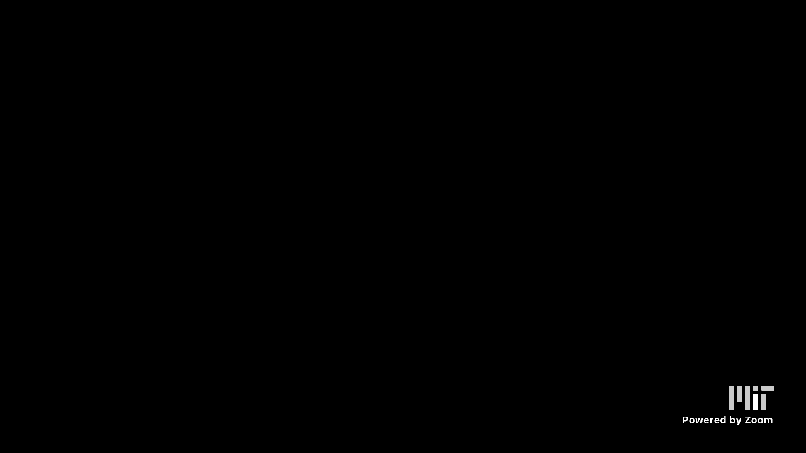
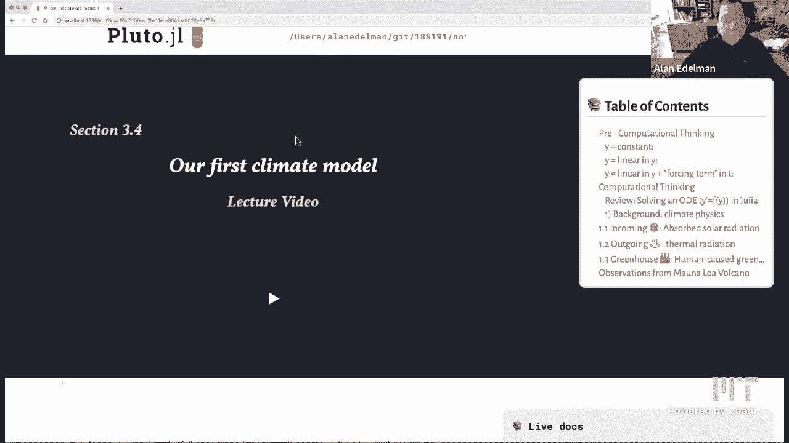
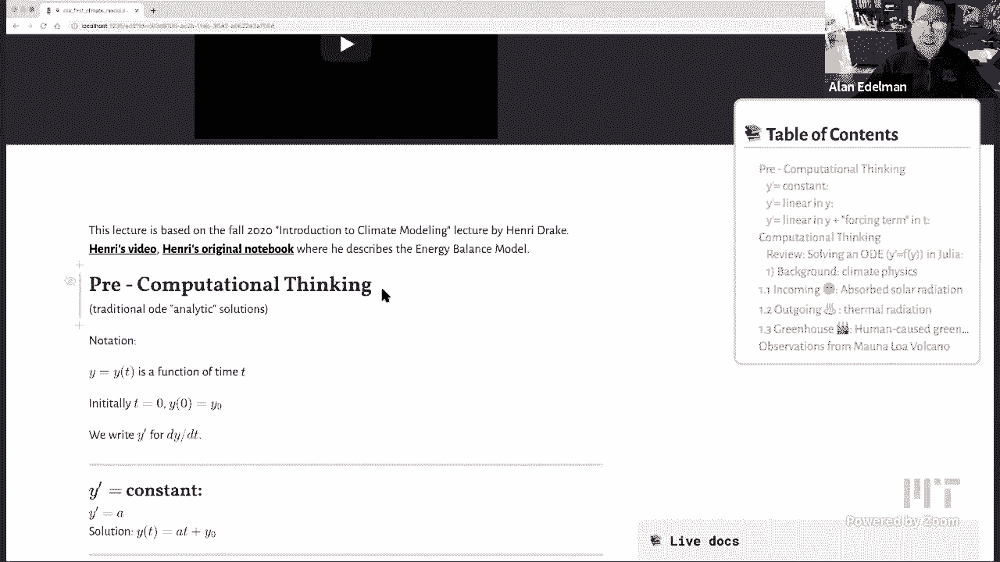
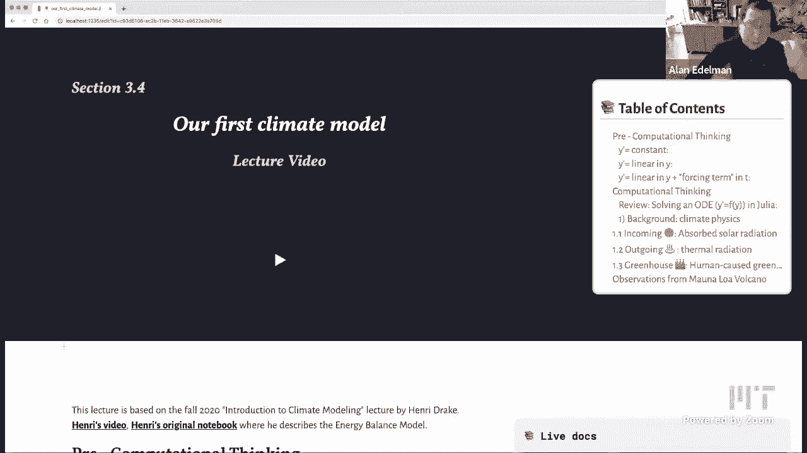
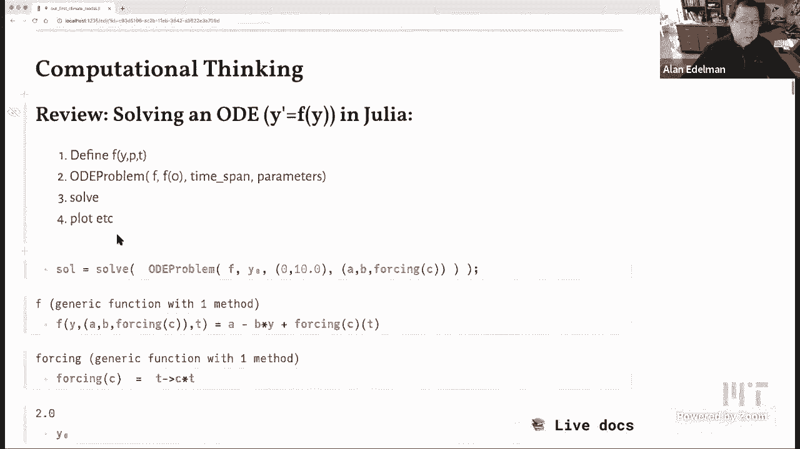
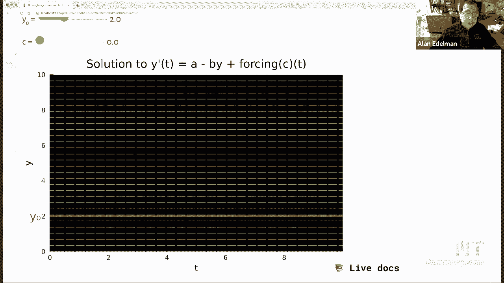
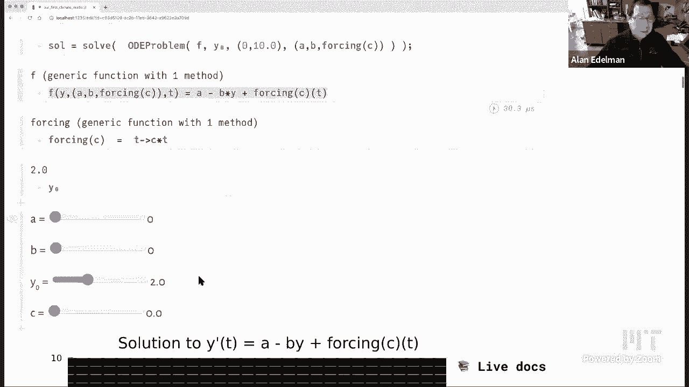
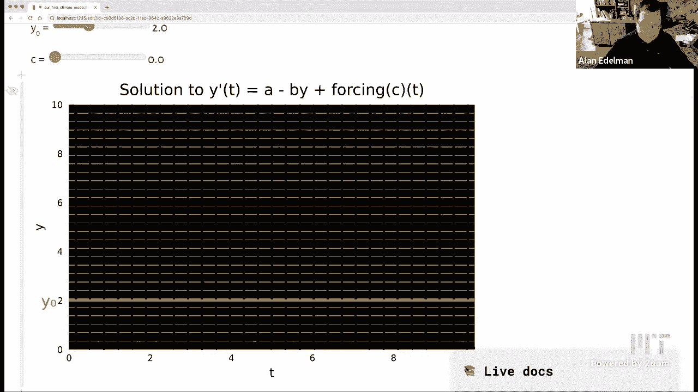
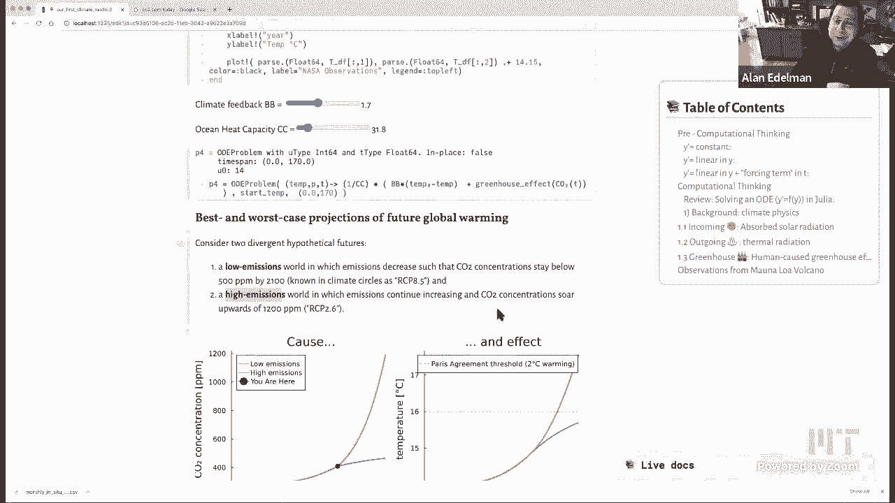

# 【双语字幕+资料下载】MIT 18.S191 ｜ 计算机思维导论-Julia(2021最新·完整版) - P20：L20- 第一个气候模型 - ShowMeAI - BV19g411G7ab

we'll do a quick sound check and wait，okay so i think we can start。

so welcome everybody out there on the，internet and the mit students。

so today's lecture is entitled our first，climate model and uh maybe the first，thing i can say。

is that this lecture was inspired by a，wonderful lecture，by andre drake who's a phd student over。

in eeps uh the earth and atmospheric uh，planetary science，department over at mit and um i think。

it's a pretty fun lecture。

so let's see uh i'm gonna，do the lecture slightly differently from，and。

see andrei's original video or the，original notebooks，i've put links to them but uh what i，decided。

is to start off and kind of i wanted，to to talk about what i see as，computational thinking where。

we use the computer to kind of uh，understand the math，as opposed to the other way around so。

i'm going to start like，a little bit like a differential，equations course except doing it the way。

you would do it with a computer as，opposed to how uh，many traditional differential equations。

courses would go，um and i'll only slightly mention the。

climate at first，and then i'm actually going to go and，delve right into the climate model。

so i really believe and i've mentioned，this in previous lectures，that learning about。

a little bit about how these climate，models go，is is important for everybody on the。

earth these days i think it's，not just for people who are going to，specialize in in。

in in climate models um of course we're，going to do a simplified model this is。

going to be like one of our，the first models that was ever invented。

but it's already quite illuminating and，so i。

i really think that this is this is，something for everybody，all right so let me begin the the first。

part is basically going to be，differential equations，so just to begin i'm going to start by。

talking about a function of time，t so i'm going to begin by calling it y。

later i'm going to be interested in the，temperature of the earth。

but for starters i'm just going to call，this y of t，we'll start at t equals 0 and the value，y。

zero and i'll write y prime for d y d t，as is typical now if this was an，ordinary。

differential equations class we would，start simple，we would say for example consider y。

prime equals a constant like a，and then you would solve it exactly，symbolically。

your professor might put it on the board，or your textbook would have the solution。

or you'd be asked to do this for，homework，and you would find okay the solution is，y of t is eight t。

plus y zero and you can check oh let's，see at t equals zero you've got the，right value。

and if you take the derivative look the，derivative is a，okay good did you zoom in a bit please。

absolutely that's，okay yeah there we go all right，so now um you know and then once you've。

mastered this very simple equation you，can go on to get a little fancy you can。

add another term so again this is how，a old-fashioned differential equations，course might go。

not really what i'm advocating though，there's something to be said for doing，it this way。

uh but i i you know i think the computer，really helps，in other ways so let me add in let's。

make this linear and for reasons you'll，see later i'm going to choose to make，this。

minus b y so now i have two parameters，before i had just the parameter a。

but if i write if i have the equation y，prime equals a minus b。

y you can get this symbolic expression，for the exact answer i mean you can。

quickly check for example that，at t equals zero this is one minus one，and you still get the y zero。

you can differentiate it if you like in，a way，this is sort of how classical。

mathematics you know simple nuts and，bolts mathematics might go you would。

you would you would check you would，start investigating this you would see，that，actually。

let t go to infinity and all the，exponentials disappear and you see there。

it heads towards this constant a over b，um a little bit more clever is just to。

set y prime equals zero that's an，equilibrium，and y prime equals zero is exactly at a，over b。

right when when you put in y equals a，over b this is zero so，you know you investigate this sort of。

thing and you get an equilibrium，but this is like very symbolic math um。

there aren't that many pictures and it，doesn't，you can only take it so far i mean。

simple functions you can do this with，but still it's just you know symbolic。

math i don't know it's it's，i think it doesn't really convey the，story though it kept。

though it it has all the information，content，it doesn't quite do it the way i like to。

see it which is visually but let me keep，going we，we have a we have a minus b y。

now let's add in a function of t so i'm，adding one more term，right sometimes this is called the。

forcing term we'll label it f，and the symbolic solution the analytic，solution i don't even know。

i've heard people call this analytic but，to me when you have an integral i'm not。

even sure if it's analytic anymore but，maybe that's a matter of debate。

whether to call this an analytics，solution but in any event，um this gets even harder to sort of。

follow，really i mean but this is an exact，solution in case you'd care to see。

it but none of this excites me none of，these exact solutions，but as long as i'm going to give you a。

preview，of where i'm heading with this and just，kind of listen to this now and i promise。

in the second half of this lecture，you'll see it this is a model。

of a sun heating the earth and none of，the heat ever escapes，this is a model of the sun is heating。

in earth and the earth sends some of the，heat back into space。

okay and this is a model of of it's this，one you know the sun's heating the earth。

the earth sends heat back into space，and we have a greenhouse effect that's。

forcing higher temperatures，so these i'm going to sort of，systematically。

revisit each of these three equations in，a climate model，but for starters let's just do the math。

let's just look at these equations，and so now i said this is how i prefer，not to see it so much like。

not that it's so bad and it's useful but，um，i like to take a look at these things in。

i like to see the numerical solutions i，like to see the plots，so you know stuff like you know i'm。

gonna i'm gonna systematically show you，the solution。

to the the those three equations the the，ones，with increased complexity on this graph。

and so uh let me just remind you that，dave's already done this a couple of，times。

but uh julia's got an incredible set of，ode solvers，written by christopher caucus it's uh。

probably the best set of od solvers in，the world，and uh all you have to do is if you want。

y prime equals f of y，and julia you you define this function。

f and this function is typically written，as a function of y，call。

julia's ode problem where you give the，initial condition，the time you want it over and the。

parameters if any，and then you use the julia command solve，and then you can do whatever you want。

with it i like to plot it so that's why，i'm putting in，plot okay and so uh。

let's see so here i've sort of put，together，the entire the uh the entire complicated。

function if you will，uh but when b is zero and uh，force let's see let's go slowly ah let's。

let's look at the picture i'll get back，to the。

to the to the let's look at the picture，for starters，so for starters everything is basically。

zero and，let's see if we can make a little，smaller so you can see the picture。

okay i'm gonna here here here's the，function，let's do nothing but increase a。

okay so here let's maybe like that so，constant，of course the solution is going to be，integrate。

a i can move the y zero lets me move the，initial condition up and down。

so that just kind of moves things，if if i oh you know what before i do。

anything at all though let's go back to，the beginning let's look。

at the direction fields let's remember，that a differential equation。

means nothing other than starting at the，left，and following these direction fields。

wherever they might take you，okay that is what we mean by solving a，differential equation basically。

right so you're going to just follow the，direction every time，it's like you're doing a treasure hunt。

and when you get here the note tells you，where to go next，right so the direction field tells you。

where to go next，if that's what we mean by solving a，differential equation。

and of course in the old days it just，meant writing down a symbolic solution。

but that's what it really means，and i'd like to point out that in the，initial state。

all of the direction fields are constant，they're actually，horizontal uh even when i move a oh i've。

got that little bug again，hold on let's see if we can get this to，move now。

dave you ever figure out why this，happens，oh now maybe if you scroll down a bit，solution。

scroll oh i need to scroll down said he，had fixed it，but all right but here let me let me go。

ahead and change a，only and i'll point out that again if，you look at all these yellow lines。

they're all pointing i don't know，northeast i would say right but the，point is。

that the the yellow lines do not depend，on your t or your y right there they're，at every。

position it just says move northeast so，basically it takes a straight line and。

it keeps you in a straight line，when i add b a little bit of b。

let's do that so let's add a little bit，of b，course b，is only multiplying y and so if you。

if you go across a row you might notice，that，again the direction field is constant in，any one row。

right for any constant y obviously if，you go along the column，you。

is that where you're going is going to，be a function，of your y value ultimately this y value。

is going to be temperature，but it doesn't depend on what time，you're doing it。

okay and it doesn't matter you know i，can make the，the initial condition go up and down but，you see。

because because i have no forcing，function of，way，on the other hand let me put in the。

forcing function the forcing function，that i'm going to use，is nothing other than c times t okay so。

just this，linear function with the constant c so，if i，if i make v zero oh phil what do you。

if if i put a c in right，you'll see now that these things will，only depend on t。

if you look in a column this is sort of，the backwards way if you look in a，column。

then the vector fields are constant but，if you look along the row they're，obviously changing okay。

so uh in summary a doesn't change，a a is is the same everywhere，b influences you in the y direction。

c influences you in the time direction，okay so，now let's let's go and look at the。

solutions again we have the symbolic，solution and you can，get everything i'm going to say from。

there but uh，let's i i think that this is really，computational thinking。

playing with these sliders to the point，where you really understand what's going，on。

what what are these equations really，doing so when b is 0 and c。

0 as you see this is just a line if i，start tweaking b，a little bit you'll see though that it，will。

it the thing that was going to infinity，is all of a sudden，um reaching an equilibrium which i'm。

drawing in a white the white line it's，reaching that b，over a equilibrium you see so i mean i。

can move it in different places，but adding a little bit of b is，is is is somehow holding。

it it you can see this this is going to，go over here that，the b is what forces。

is the fact that it's minus by the way，and it's a minus a positive number is is。

helping it's forcing the time evolution，to reach enough，to reach an equilibrium and not go crazy。

not go to infinity，so we're going to see that this has，something to do with how the earth tries。

to heal itself right it tries to reach，an equilibrium，uh and so when we do the climate model。

this is the sort of thing that，that kind of explains what's going on，the b。

y is doing that if b was zero again it，goes off to infinity if b is is，something else it'll reach an。

equilibrium right，a tries to push the equilibrium higher，but it will still reach equilibrium if i。

make it，okay so and you know this is what i，would encourage，when i'm talking about computational。

thinking for understanding differential，equations，i'm thinking that this is the sort of。

thing that everybody should do when they，encounter a differential equation they。

they should think about the direction，field think about the lines following，the direction field。

thinking，actually plot these things and，understand the role that every piece is。

playing and i i've always felt that the，symbolic solutions，kind of hide this a little bit i mean。

it's there，we all know it's there and if you look，at it closely you see that it's there。

but nothing like a picture being worth a，thousand symbols if，you ask me okay and now let's go and。

look at what，what happens with the c part of it all，now you see the c the forcing function，uh。

is actually messing with the equilibrium，so if i add a little bit。

of this forcing term i'm going to add it，again you'll see，it actually pushes it the more。

the more of the forcing function i add，the higher it pushes up the。

y value ultimately it's going to be a，temperature you see，so we could change this function to a。

slower growing function like square root，of t，right and you've got the power to change，this yourself。

and this will just let this sort of work，its way through，and you see it kind of uh it does。

it slows down the impact but in the end，the impact is still there。

okay so you can force this function with，any function you like，um i'll return it back to ct just for。

next time i use this notebook，um but you see that this this is this is，basically。

uh you know this is basically the a，simple differential equation。

um for complicated forcing functions，there's no way it can be solved，analytically。

but yeah you absolutely couldn't，understand this i mean，i haven't even tried some funny。

functions maybe i'll try it now just to，see what would happen。

um i i have no idea what would happen if，you did sign t，but it should make it go up and down。

since it oscillates，and there it goes we can see it doing，its thing。

kind of fun yeah there you go oh look at，but that seems to actually be converging。

to the equilibrium again maybe，oh you think it is it's possible oh no，actually uh。

i wouldn't i guess no no it's gonna，oscillate around the equilibrium。

yeah we almost have to let it go for a，longer time should we do that，here。

here's where i'm going to 10。 you want，me to go 10 times as far and just to see，what happens。

oh look at that oh it is going towards，the equilibrium you were right。

so i guess because on average sine of t，doesn't grow yeah well that's pretty fun。

okay any you want to try one more，function before i move on any，fun functions um。

i do log of one plus two that'll just，slowly，this one would like to be at c equals。

zero of course it still goes to，equilibrium but not after that，yeah because it's not oscillating all。

right so anyway this is the sort of，thing you can do，and pretty quickly you could exceed the。

abilities，imagine，um you know just being able to draw this，okay let's go back also i just want to。

restore things in case i ever use this，notebook again，so i'll go back to time equals 10。 all。

right good，so now i'm going to start talking about，climate science and uh basically。

if you do go back and look at henri's，lecture from last fall，this is basically where the lecture。

started so，i thought i would kind of pull out the，differential equations first。

because i think it's kind of easier to，to to，you know now that you you see that what。

the math is doing，um i thought it would be good to to sort，of separate that out and so we could not。

talk about what the physics is doing，in a way it's kind of funny whenever i，see a physical model。

i kind of wish everybody would do what i，just did because，there's always like the simple math and。

then there's like，a million parameters and variables and，you kind of get。

lost in the confusion of them all but of，course that's sort of the nature。

of physical models and in the old days，people tried，their best to come up with all of the。

parameters and，a factor of life these days is that，there are parameters we know。

and there are parameters we don't know，but we fit we，we we have data and we fit we fit those。

parameters based on the data and，in the old days of course it was linear。

fits in polynomial fits nowadays，people fit with a neural network but。

i'll talk about that a little bit more，later，let me talk about the simple this is，sometimes called。

the zero dimensional model um or the，energy balance model of the earth。

uh zero dimensional model means that we，just think of the earth as one point。

you know like the average temperature，there's no difference，between you know uh boston and。

um you know the middle east or something，right there there，there's just it's all been averaged out。

okay so，uh basically like the three，kind of increasingly complicated。

differential equations that i showed you，they're going to be three effects that。

we will concentrate on，one is simply the absorbed solar，radiation the the energy that comes。

directly from the sun's rays，so that that will actually increase heat。

right we're getting we're getting heat，from the sun，uh to balance that out there's going to。

be outgoing thermal，the，heat that's on the earth sort of，escaping back to space it's not staying。

with us on earth，okay and then there's what's causing all，the trouble these days。

the human cause greenhouse effects the，the trapped outgoing radiation because。

we have carbon dioxide and methane and，lots of other，things that are causing trouble up in。

the atmosphere and so this third term，obviously didn't exist until the，industrial revolution。

when we started polluting our atmosphere，but it's very much a real term right now，so。

um here's a little picture that that，kind of uh，shows roughly what's going on so here's。

this happy sun，um heating the earth so we get our，incoming solar radiation。

and uh here's the outgoing，you know before before there was carbon。

dioxide this thermal radiation would，just go completely，outward that's the blue the you'll see。

this as well color coded very nicely the，yellow going it，the yellow is this orangey yellow this。

blue and then there's the，of course now there's the carbon dioxide，which is the。

greenhouse effect and，the oceans kind of try their best to，kind of equilibrate everything that's。

going on，um the oceans for example absorb a great，deal of the heat。

so and we'll try to model that in in，whatever way we possibly can。

all right so let's start with the first，one is the easiest，it's the easiest thing to model and we。

know everything about it，the incoming absorbed solar radiation，okay。

so this is going to be another example，of temperature prime equals constant，so um so here's。

a few numbers that will that are going，to sort of end up being，but。

we'll say that the industrial revolution，started in 1850 that's kind of，roughly the decade that that。

that we generally use in climate models，the average temperature in 1850 has been。

measured it's it's taken as 14 degrees，celsius，there's the power that comes from the，sun which。

you know i'm just taking these numbers，from henry but，it's listed as 1368 watts per meter，squared。

and um the planetary reflectivity，is，51 joules per meter squared per。

degree celsius so this is kind of where，the physics gets，not so much complicated but you know the。

devil's in the details as you might，expect，but uh ultimately what we're going to do，is。

uh we're going to turn all these numbers，into a simple differential equation。

which is that the time dependence of，temperature，is going to be the rate is going to be。

multiplied by the c，and it's going to be equal to s times 1，minus alpha over 4。 and so it's going to。

be about 239。4，okay so uh let's just before we explain，this let's just see what this would look。

like if if we literally could heat the，earth non-stop，out，or then uh if we started in 1850，be。

at uh a burning 800 degrees celsius on，earth i mean this would just be。

something that no human you know no life，could be able to withstand。

so it's it's good that that we don't，just take energy from the sun and keep，it on the earth。

okay but that would be the the linear，and just to to kind of，talk a little bit about some of these。

constants and how it really works，so i'm going to try to explain why where。

all of these parameters come from so，let's see so let me start with，um the power of the sun and that。

that's 1368。 um，and uh it turns out that，we reflect some of that right away right。

so that just gets reflected，uh from the earth immediately and，the reflectivity constant i'm told is。

that we can use is 0。3，and so literally s times 1 minus alpha，that。

isn't reflected immediately and then，there's this cute little picture that，tells you。

if you think about the entire area of，the earth if you think of it as a sphere，is。

four pi r squared but we only get，sun on through half the earth on a day，gets。

lit and um it's only the normal，component of the energy that we actually，managed to take in。

and so if you think about having sort of，a flat disc，that's area pi r squared and so。

literally we only take in one quarter of，the，of this energy to spread around the。

earth and so this is where the，the divide by four comes in okay so i。

think there's a clever little picture，to talk about sort of averaging the the。

the sun's rays that are coming in every，which way but just to take the normal。

component as it comes in，so uh s is coming from the sun we，reflect back alpha s。

divide by four because of this geometry，and that's going to be the official，absorbed solar radiation。

so i guess i can remove the semicolon，and you can see that this is going to be。

that number that we have，239。4 okay and then，there's this c number which i'll say a。

few more words about，but this has to do with the ability of，the oceans。

to uh basically kind of ameliorate，a certain amount of the heat okay and，then i also have the。

pre-industrial temperature of 14 and i，can solve the，ode problem and we。

let me just see um yeah and we solve the，ode problem and that's why。

i that's how i managed to get this，linear graph，just a few more words about c um，okay so um yeah。

so uh th this is the key part of the，sentence that，the heat is closely coupled with that of。

the ocean upper ocean，um which has a this is the c equals 51。i could put it back in。

the capacity of sequels it's this right，here，let's take it out of here and put it，there we go okay。

um and uh basically this is shielding，the heat from the earth that's the way i，look at it。

okay so anybody have any questions about，the let me take a look at the same thing。

in the chat i guess not，but this this is sort of the first，simple model of。

the of the sun baking the earth with no，heat coming out okay so now let's go。

to the outgoing thermal radiation okay，and this one i'll warn you in advance，uh is is a little bit。

kind of more hand waving so in two，particular ways，so uh of course there are more。

complicated models but we're going to，just give，a basic very simple model okay so。

um the outgoing thermal uh radiation is，uh has to do with with it's it's。

actually a combination of the black body，radiation of，of the earth rating eating its heat out。

into space，um there's also a little bit of，of so you know that would actually cool，the earth。

there's a little bit of warming that，goes to sort of water vapor feedback。

and again i'm following henri's lecture，here，and accepting the fact that these，with。

so why don't we just come up with a，linear model okay so the outgoing，thermal radiation。

is going to be a linear function of，temperature so，this is where that second model comes in。

just to remind you，y prime equals linear in y is，kind of what we're doing you know we're。

we're revisiting the，the linear function in y okay and，so what can we do so if i want to fit a。

linear function，right，two two points determine a line so i，would have to fit two parameters。

but uh what we're really going to do is，we're going to we're going to。

fit one parameter intelligently and then，one's going to come，out of the air so we could make the。

argument，that the pre-industrial temperature was，an equilibrium temperature。

you see we we actually remember from，earlier，in this lecture i pointed out i'll go，back to show you。

i pointed out that there's an，equilibrium at a over b，right and so if i actually know an。

equilibrium temperature，then i actually know the ratio of a to b。

see so there's a reason why i told this，to you i was planning ahead，okay so let's go back here，the。

the the temperature just before the，beginning of the industrial revolution。

i can use that and say that is going to，be my equilibrium temperature。

and so uh the ratio of the constant term，to the temperature should you know when。

i set this equal zero i should get the，equilibrium temperature and so。

i've managed to remove one variable so，now the only thing i have left。

so now i'm going to say that the the，the combined effect is going to be b。

times temperature zero minus temperature，of t for some value of b，okay and the minus sign over here。

indicates it will restore equilibrium，choose，based on fitting data we'll see a little。

bit of that later，is 1。3 okay so again right now，i'm taking this out of the out of the，air。

later we'll see a little bit where how，you can actually get this by fitting。

fitting the model but meanwhile let's，we're，we're at the point of having the sun，coming in。

and the outgoing radiation uh but no，humans to pollute，and you can see that even if you fiddle。

with the start temperature，it's always going to reach the，equilibrium of 14 which was the。

pre-industrial temperature，okay so so this this，is i don't know i think it's really neat。

to be able to see the earth restoring，its balance even if you mess with some。

starting temperature the earth will，restore it based on this model。

okay we'll go right back to 14 degrees，assuming that there are no humans around。

to muck this whole story up，okay so that's exactly what's happening。

and this picture is completely obtained，by just，setting up the ode problem that you know，it's it's。

it's uh it's it's just b，times it's this linear function right，here that's all it is。

it's this linear function and then we，divide by c for the cooling of the ocean。

okay and we'll just start wherever you，want and，uh we'll go 170 years that'll bring us，right to 2020。

okay so that would have been last year i，guess if you won 2021 i could have gone。

171 but you wouldn't see much difference，okay that would bring us to 2021。 okay，so to recap。

we have a pre-industrial earth over here，and the model，just has any perturbations of initial。

temperature，being restored by the earth to go back，to 14 degrees，so now in this uh next piece of the。

model，we'll have the human-caused greenhouse，effects，so we'll assume that。

something bad is happening because we're，putting carbon dioxide into the air。

okay and so this is going to this is，going to，put in the forcing function the that，forcing term。

and there's going to be two parts to，this，one is going to be what actually。

you know what is the the badness of，of uh of of increasing the carbon，dioxide and the answer is。

this badness is going to happen on a log，scale，okay and so uh this function is going to，no。

time in this this is not a we can't yet，there's gonna we're gonna need something，else but but let's。

there's no time in this equation right，it just says that the human class，greenhouse effect，times。

the log of the carbon dioxide now，divided by the carbon dioxide that。

at the pre-industrial time okay and you，know in fact，how this is going to go is going to。

depend on the future of human behavior，right we don't know，what humans are going to do we don't。

know whether people，are going to stop putting carbon dioxide，in the air or they're going to increase。

it at a faster rate，right and so this is something that we，can model with any prediction you want。

but this is a physical effect that is，known the time it，times not modeled in the above it's just。

the human greenhouse effect，will be this and again more more，parameters that come from these。

folks who do this for a living the，forcing coefficient，will be 5 watts per meter squared that's。

the number they're going to use，so that'll be the the multiple that gets，used here and。

um the pre-industrial co2 number，is 280 right and，so now we're up i think we're almost is。

it 400 and something 412 i forget what，the number is now，but it's probably good to to know these。

things so yeah how much what is the，co2 ppm today let's，see if we can get that number somewhere。

yeah it's about 400 and，in 2019 it says 410 i think it's more，now，uh four this is today's date so。

420 417 if i'm reading this right，um i think it's actually good to know。

these numbers to kind of memorize it，so so we've gone from 280 to something，like。

417 or 420 today in terms of parts per，million，okay so this is the the so it's that log。

ratio of that number today over the，pre-industrial，that's going to affect the greenhouse，gas so。

here's the function i'll put it into，julia form it looks just like the。

it looks basically just like this，equation here，and i'm just testing that the function，works so。

um okay so，uh let's see so uh，so this is just a graph of this function，it basically。

kind of shows you that there's no time，in this graph it's just saying that。

here's co2 and a bunch of different，concentrations here you could see we're，just。

doubling we keep doubling i mean the，present day looks like it's around here，it's in the 400s。

right and this was the pre-industrial，and so you can see，um you know to what if if you call this。

zero，you could see to what extent we've uh，increased the forcing function。

i it's actually i've been playing with，different，with different time dependencies of，carbon dioxide。

again you could write your own so here，let's start with the simplest that it's，a constant。

there's no emissions carbon dioxide as a，function of time is exactly。

what it was at the pre-industrial and，uh of course what you're going to get，then is。

what you'd expect it'll go to the this，is temperature now，it'll go to the you know 14 degree。

equilibrium，here's another model this is this is，basically a test model。

it says that we're going to increase our，carbon dioxide one percent a year。

starting from the industrial times，the pre-industrial times and you can see，that that takes us up to。

that this is actually pretty serious，because it adds，something like five degrees it looks。

like uh that's a lot，for the in in terms of the earth you，earth。

you know melts oceans and polar caps and，and，it just does lots of bad things to this，planet okay and。

another curve that i'd like to show you，is the one，that uh people have been using to。

fit historical data and，that's this one and you can see that。

i can start maybe i'll start the where's，the，i've got to find the start the start，time。

where was it here to start let's let's，make this be the pre-industrial number，at 14。

approximately and then，then you can see you know the earth，temperature moving up over here maybe。

what i'll do is，maybe i'll just plot it a little bit，yeah let's plot it a little bit um。

more visibly yeah so you can see this，moving，this this is fitting sort of the current。

this is pretty close to the history of，how the temperature has been going up on，this planet。

yeah so this is actually a repeat of the，same picture uh，what is this oh this is the carbon wait，uh。

let me just make sure i kind of did this，in a funny order okay。

yeah uh i don't really need this picture，let me tell you，about um so so，so how so how good。

where you know how good is this are，these fits well，we've got real data and there's this。

data that comes right from the manila，volcano in hawaii there's a they do the。

readings over there and，if you go to this website you can find，out all about the readings。

um i'm not quite sure why they put it，there though，i mean if i had to take a guess you know。

maybe maybe i shouldn't speak without，knowing but，if i had to take a guess you'd think。

they'd probably want to know what's，going on with the volcano anyway。

in terms of carbon dioxide so maybe they，just have readings even when the。

is not active i'm not sure but anyway，center，over there in mauna loa and uh。

here you can see um i'm grabbing the，data，and i guess this is already dave has。

this already appeared in the homework or，is this new julia commands。

these csv dot reads otherwise i should，have maybe listed them as new julia，commands。

i mean we we've done csv reading before，i think，okay so then it's not new uh but。

it is it's always good to be reminded，how you can grab data，off of a file and so there there's this。

file here let's just grab it and just，open it up so we can actually see it。

so this is this f oh this file，is not going to open on the browser。

but anyway it would look something like，this probably not formatted as nicely。

but it would look something like this so，what we're going to do is is，uh。

read it into a julia data frame，it's going to get the header information。

you know year month date carbon dioxide，actually was in the fourth row of that。

file if you could see that file you，would see it，uh and um，yeah so so that's that's where the the。

headers coming in，and what is the data row equals seven，again oh that's where we start the data。

reading from，yeah there's a bunch of skipping spaces，like the fifth row the sixth row。

and the data starts at the seventh row，okay and so，here's a picture here here you could see。

some of the data the first 11 rows，and uh data's in the fifth column。

one two three four five the co2 column，um，but as you could see oh no there's。

missing data right so these，these minus 99。99 are uh indicative，of we didn't get a measurement that。

month right so these are，this is being done starting in 1958 we，get one data point every month。

uh and uh，we could take a look at you know a lot，more data oh，what did i type first。

what i did i hit an r oh where did that，all come from，yeah so um you could just see more of。

this this sort of data，is it okay no you messed something up i，think。

you know what why don't i just control z，let's see what have i done oh，theta rho equals seven yeah。

yeah i didn't i don't know where the arc，came from okay so，talking。

about you know what do you do when um，you you get missing data。

well uh the way i decided to deal with，it is，to actually only keep the data that's，positive。

and so i'll call this a valid rose mask，and eventually what i'm going to do is，only you know。

plot the data in the valid rows，and so this data，might just be worth saying exactly。

what's going on here so，go for it you want to say something oh，yeah so just this。

mask just you can see that it's just，telling you，for each line for each row in the data。

is that condition satisfied or not，that's giving you a vector，something a special type called a bit。

vector but it's basically just a vector，of trues and forces，and then what somehow what we want to do。

is，then you know just take the rows that，uh satisfy this condition so just take。

the rows that correspond to the trues in，that vector，and that's that's happening with this。

indexing command right here，right so uh it's happening here it's，also happening here right。

that's just wanted to say that that's，what we mean by a mask and then when。

yeah exactly so we're indexing using a，vector and so it'll actually extract。

it realizes that it's a vector of，will，just extract the rows which satisfy the，condition。

which are true so literally what i'm，doing is i'm grabbing as the first，coordinate of my plot。

the the date field where it's valid，and this is the co2 field，where it's valid and you can see i'm。

labeling this as，monologue co2 data and so，this this blue wavy data is a picture of。

what you just saw that's this that's，this uh，killing curve that that that's talking，about。

the actual carbon dioxide levels that，have been measured，okay quite scary if you think about it。

actually，it's very scary but it i mean but again，you knew that this。

was hitting the 400s now right i mean，the，the the you know we know that it's again。

if i'm reading this properly it's，something like，2017 or 420 today right so which is。

pretty much what you're seeing here okay，and，um the red curve is just。

a fit and you know you could take your，own fit this is a cubic fit it's that，cubic fit that。

i used as one of my choices i'll go back，here，it this is this is just a simple cubic。

right and this is the one that i'll use，uh to to to fit that curve and so if you，have wondered。

where did i get this you know 220，whatever this this fits，very nicely this picture right i mean i。

think many people would agree that，this is a good fit of the carbon dioxide。

as a function of time okay so we need，some way of figuring out how much carbon。

dioxide is a function of time，so that we can take the greenhouse of，that，so now what i'm going to do。

is i've got some other data which，is the actual average temperature of the，earth real。

measurements of the average temperature，of the earth，okay and so um this data。

is of these nasa observations which，also came from another file i mean we。

can i have it down at the bottom，somewhere，uh where did i do yeah here they are so。

these are the nasa observations of，temperatures i got that over here but。

let me just go back to the picture um so，these are the，nasa observations and this blue curve。

is just this differential equation，solution it's the，the same solution that uh you saw，earlier。

okay and so you see that uh，i mean what are we checking here just in，case you've lost track。

let me remind you this doesn't have，thyme this is carbon dioxide，well it does this is carbon dioxide。

carbon dioxide it doesn't have，temperature，this is carbon dioxide as a function of，time。

and um we're asserting，that that there's a correlation between，larger carbon dioxide。

and larger temperatures and i think that，these historical curves make it，undeniable。

that that there's a correlation between，the increase in carbon dioxide。

and the increasing temperatures and，further all，you know if you believe that this blue。

line is something of a good fit to the，data，it's in some basic average trendy way。

it's basically showing you by the by，what mechanism，the carbon dioxide is influencing the。

temperature right it's it's，we haven't you know we have a nice exact，well or。

it's not a bad fit of what's been going，on，so now of course um this is。

this is the past but then there's a，question of what will happen into the，future。

and oh wait before i do that i'm sorry，there's one thing i wanted to tell you，uh we could。

change this fit a little bit you can，play with it yourself，so you can change you remember that b。

parameter which，is telling you to what extent uh to what，extent the heat is reflecting back。

uh into the into space and c was the，effect of the oceans，and i pulled these numbers out of a hat。

but，what people really do is they they fit，data some you know，more complicated than this but this is。

the sort of thing that people would do，they would，play with these b's and c parameters not。

by hand but，you know probably with a minimization，you know the least squares minimization，operator。

and they would try to possibly see if，they can get a better fit to the data。

and so this is how these things sort of，happen and，then of course what we want to do is ask。

ourselves you know what does this all，mean for the future，and it you know there are these。

different models and you can read about，them if you want，um where uh the low emissions one is le。

that we at least managed to keep it，below 500 again we're 400 and something，today。

and then the scary model or they're both，scary but the scarier model。

is the high emissions going to 1200 and，so that，this red line shows what's going to。

happen to the carbon dioxide，with the high emissions model the blue。

says what happens if we lower our，emissions and this is at the carbon，dioxide level and then。

if you solve the differential equation，you get it at the，temperature and of course the paris。

agreement say that，uh we're you know which which the，previous administration has pulled out，of and。

uh the current presidential，administration has come back into，says that we're going to try to stay。

uh no more than two degrees above the，pre-industrial temperatures and so。

it looks like we could do it if we can，keep below the 500，but not if we you know if we let loose。

and go，up to the 1200 so all of this stuff you，now have the ability to run these models。

by yourselves uh，everything you need to know in terms of，sort of a basic zeroth order model is。

all right here um there's a couple of，other things that you can。

you might want to look at like there's，this nice little video，about what's really warming the earth。

so uh but basically you see，level，the basic mechanics of what goes into a，climate model。

is really not so bad you know it's all，self-contained in one lecture，on the behavior of very simple。

differential equations，uh which i recommend doing it with，computational thinking approaches as。

opposed to the symbolic approaches but，whatever works for you，and then the rest is just feeding in。

parameters into these very very same，equations now you might ask why do，people need。

high performance parallel computers that，you know that run a billion times faster。

than your laptop to solve climate models，well there's a lot of complications uh。

if you want more details the，the the clouds the the oceans，um the eddies in the oceans all。

influence the climate，um and give a lot more sort of clarity，as to。

what's going on uh and so the the big，the big game that that a lot of uh。

people are doing there's some folks at，mit and，um and many many other teams around the。

world are trying to，capture all of those details and they're，trying to do it，um on on grids on。

they try to turn the earth into a grid，with just a few miles apart if they can。

um and so this these become much more，complicated differential equations and。

we'll see a little bit more of that in，the next couple of lectures。

but i do want to stress that the the，basic big picture，of what's going on is more or less。

contained in this lecture，right and so uh and again i think，everybody。

i think everybody should get to know a，little bit about this i don't think you。

should be a specialist，to see how these things work all right，um that's the end of，again。

