# 【双语字幕+资料下载】MIT 18.S191 ｜ 计算机思维导论-Julia(2021最新·完整版) - P21：L21- 如何在软件上进行协作 - ShowMeAI - BV19g411G7ab

i'm going to introduce a special，guest lecturer uh fonz van der plows who。

um is the author of pluto and so if，you've ever wondered who's the brains，behind pluto。

um it's fonz and uh，fonz was hoping that he could give a，lecture in the class and i thought that。

it would be fantastic for him to give，one of the lectures and he offered to，give a lecture。

on how to collaborate which i think，that one，could learn in any course at mit and so。

this is specifically how to collaborate，on software，and uh so we're going to take a little。

break from the，the climate modeling and differential，equations that we've been doing we'll。

get back to that next week on monday，but i thought that this would just be a，fantastic lecture uh。

on software so it's all yours all right，thanks alan，hi everyone welcome back to。

computational thinking so，my name is fonz and i work on video。jl。

that's the notebook system that you're，looking at and that we use in the course，source。

and it's available on github。com you，might have heard those two things before，open source。

github today in this lecture，at the end of the lecture you should be，able to use getup yourself and。

understand why，other people use it and will actually，make a contribution。

to the package on github today during，the lecture，and yeah it's also about collaboration。

so github means，that i put this code here but lots of，people can collaborate。

on my projects people can find the codes，they can change it，and they can do what's called a pool。

request which means，they suggest some changes to the project，itself and then i can accept those，them。

but yeah okay let's，talk about collaboration on software so，what's the simplest way to collaborate。

on any project online，you email files to each other of course。

and so this works for small projects and，uh，it also works for small software。

projects but at some points，you'll need something better and for，each task like。

specific to the task that might be the，system that's best for that。

if you're planning to write an online，encyclopedia then，you could use a wiki system if you're。

working with a group on a school essay，um you could use google drive but for。

software projects people use github，and today kind of as a different way of，introducing。

github and git than you might have seen，before i'll focus on this difference，school。

essay and a software project and why do，people，not use google drive why don't people。

use google drive for software，it's super easy um you know why，why are we using something more。

so just to get everyone on the same page，if you haven't used google drive before。

it looks a bit like this，it's all about real-time synchronization。

so right now i'm seeing this clearance，of two people，actually it's my stream uh two people。

working together on the same document，and you see that their changes are，synchronized。

one person edits it shows up on the，other person's screen，the other person edits it comes on the。

first person screen，that's super cool why don't we do this，for software um。

it's not because you know software uses，old-school，programs no software uses quite advanced，programs。

it's actually because there are，differences between what you would use。

uh between between a school essay and，between a software project。

so i'm gonna give three reasons that are，differences between school essays and。

like a software project like a climate，model hosted online，uh to explain why we would use something。

more complicated，and then that's kind of my introduction，afterwards。

i have three parts part one is we're，going to make a contribution to a，climate model。

part two is we're going to create our，own，github repository so hosting our own，code online。

and then part three if you have time is，making a code contribution to a project。

okay so first just to ask you are you，going to recommend that we do this in，real time with you。

or should we sit back and watch right so，that's that's a good question i think。

it's better if i just show it kind of，quickly and if you would like to join。

you can use the pause button on youtube，and just，maybe pause a bit and do the steps that。

i explained for example，i might say install this program and，then i'm just going to continue on。

looking at it，but you can use pause and then you could，actually join along。

and i really encourage you today to，create an account on github。

create a repository and try some of the，okay so why don't we use google drive。

because google drive is so nice，so the first reason is in software，projects。

small changes can make really big，differences，and if you change one file then the。

entire program is affected，and as an example pluto is also a，software project and if you just add a。

single letter to the source code，it goes from looking like this to，looking like this。

and i can show you why so i have the，source code for pluto，right here and don't worry。

about what you're seeing but like，anywhere in the source code，i type some garbage and i save。

and if i now refresh pluto it just，doesn't work it's broken，and so what happened is if there's a。

syntax error anywhere the whole project，and this is the first reason why we're。

not using google drive，for software it's because very small，and it's all about collaboration like。

what would happen if two people are，working on the same project at the same，time，has this，given。

pressure and it's going to，uh sorry and this code is not correct，and i want to find。

a different code that works and it turns，out that i need to use the log function。

um and i'm going to find that out now，say that it's just like i'm going to。

make this change so changing，square roots to the logarithmic function，and say that。

it's on google drive and it's，synchronizing everything like every，letter that i type。

just like in the video before then to，change square root to log i would be。

doing backspace backstage backspace to，remove the，square root function and then start，typing l o g。

and if you would synchronize on every，keystroke，then i remove the letters rt and it just，sq。

and then it's broken the whole program，now，also my online version of my program is，broken，broken。

because i'm trying to change one，function and you see that i do many。

changes all of them are broken until，eventually i get to the final one which，is not broken。

so that's the first thing we don't want，to synchronize so much。

is google drive we want to synchronize，this manually so i want to say okay now。

synchronize instead of doing it，automatically all the time because then，i can。

make my change and when i'm happy um i，think too nice，and then you see online so the online。

version of my project，it was working and it was working，afterwards there are no broken states in。

um so that's one thing i don't want to，publish，every little key stroke that i make and。

to kind of do it in between，but actually when you work on software。

you want even larger chunks you don't，want，like to change the name of one function，and to publish。

you often try out one thing see if it，works，save your files it doesn't work you。

tried some other things，really often you make lots of changes，and you don't really want to publish。

those until finally，you tried something that works，so for example i go from the square root。

function let's try the sine function，inside the cosine function finally i。

find the log function and it works，so i want manual control over when i put，these changes online。

does this make sense alan what do you，think，this way sucks it does right。

i think the the issues with git are，further downstream so i'll just wait and。

and see if you cover them but the，contract i think is pretty easy to，understand。

i think so too and i think so today i，wanted to compare it to google drive。

instead of comparing it to you know，sending each other floppy disks with the，mail。

kind of a more modern way of thinking，about git is we we have google drive，which is instantaneous。

but actually we want something else so i，think one of，this may be something you'll cover later。

but i think one of my biggest，differences with google drive，is when i want to go back to an earlier。

version on the google drive and，this might just be a ui issue i just，click and i've got it。

and whenever i want to try to go back to，anything on，git i in principle it's easy but i find。

that the real world practice of it all，i mean，later or not i'm not sure but i just。

thought i'd mention that that identified，okay yeah i will come back to this。

okay second difference between software，projects and like your school essay。

is that and this is a bit more advanced，but when people have a larger software，project。

and maybe multiple people are working on，it at the same time，people found that it's really nice to。

have multiple branches，so we call it branches where you take，the entire code base。

as it is for example on monday and then，you split it into two copies and you。

have two people working on separate，copies for example or one person working。

on two different copies trying out two，different things，and to kind of go back to the analogy of。

google drive uh，something that i used to do is i have my，powerpoint presentation。

and then before i do something like add，a bunch of pictures，i create a copy called presentation with。

pictures，then i add my pictures there see if it，works here，if i like this change and if i don't i。

just delete that file and go back to the，okay that's great but what if i'm，working in a group。

someone else also made a copy of the，file and they，called it presentation with title page。

they added the title page，and on the same day i made a copy and it，added pictures。

now we have two branches in parallel，basically，they added a title page i added pictures，know just。

in files it's really difficult to，combine those changes，and this is something that happens all。

the time in software people work on，things，in one branch people work on other。

things in another branch and then they，want to combine them，like。

related so one person might have been，working on the title page of their。

software project other person might have，been adding pictures somewhere else。

and you want to combine those changes，and，git so github makes this really easy，well in google drive。

this whole branching idea doesn't really，so that's one big difference and if。

you're just starting up with github you，might not use this，the branching that's fine and i think。

you shouldn't maybe use it in your first，day but then you know try to use it，later。

and you will use it if you fork so if，you make a copy of someone's project。

like climate model you make your own，version of that clan model and then you。

want to contribute something back，that's also a kind of forking so，branching。

okay a third reason and i think there's，like，20 more reasons but i just picked three，of them。

one difference is that programmers love，to automate things，they want to automate everything so。

git makes this really easy and as an，example。

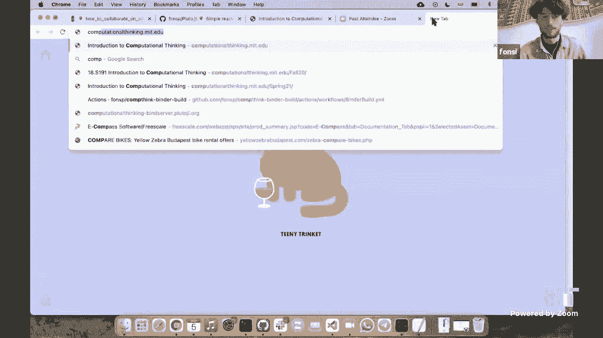

this lecture you can read the lecture。

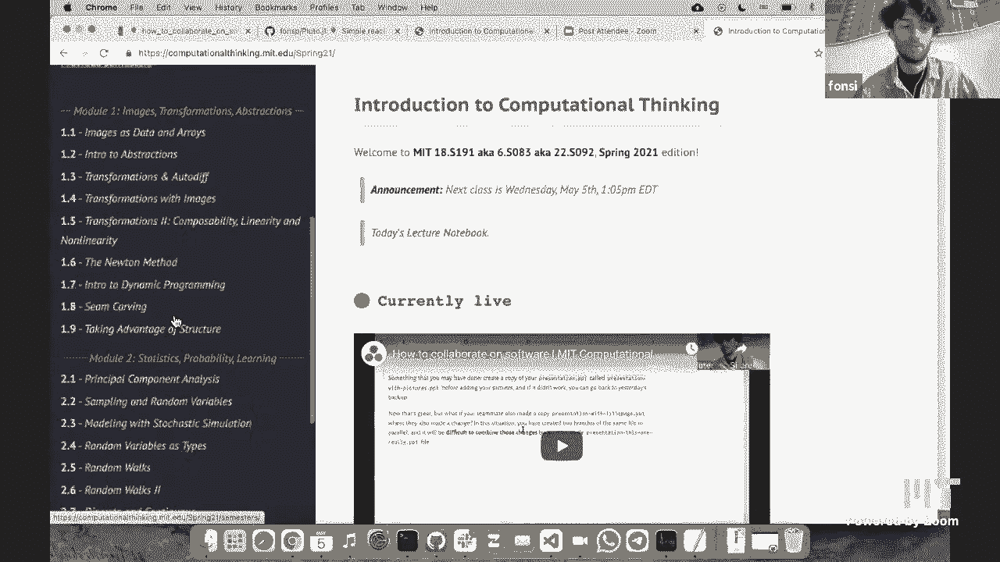

notes on computationalthinking。mit。edu。

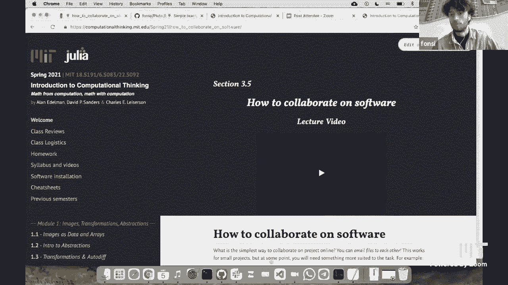

but we also have a like we have a page，on github，which is right here and this is where we。

put our notebooks and the files to，create their websites，and so as we are programmers we。

love to automate things so every time we，put a notebook here there's all sorts of，stuff happening。

let's call it github magic so，a bunch of automatic things and，uh in our case it's turning notebooks。

into websites，putting that website online and，programmers，love this they love automating things。

and that's one reason why they don't use，google drive，but it gets up maybe one should mention。

sort of both the up and down side，probably obvious but still worth saying。

that all of this automation，is fantastic when it works and it really，leads to what it doesn't and。

if you've encountered some of the，difficulties it's because we love，automation。

so and this hasn't you know this，so sometimes notebooks the automation，breaks and and。

things happen that's right so i actually，find this aspect，of software engineering i find it quite。

difficult，so this git magic is called devops and，someone who works in it you call her a。

devops engineer，um that's it's quite difficult and it's，because it's so invisible or something。

you're not doing things on your own，the github，cloud so the main thing。

i want to say about this today is don't，worry about this too much when getting，started。

don't worry about it too much don't try，to automate everything。

um and if you're working together on a，project with someone else just ask them，for help。

if they set up some kind of automation，and it's not working and ask them to fix，it。

don't fix it yourself by the way devops，engineer of course refers to any sort of。

automation it may not have anything to，do with kit in particular。

just just so that nobody gets the wrong，idea someone who does that is a devops。

engineer but devops engineers could be，lots of other things too，all right there there's a link to。

wikipedia if you want to know more，um yeah one thing i don't want to say is。

automatic testing that's one，type of automation that's that you will，encounter。

and many projects actually most julia，package for example，have automatic testing i will talk more。

about testing later and more about，okay so those were the differences，there's。

lots of like more differences and more，reasons why people would use，github i think the main thing is。

you will encounter if you keep working，in in academics or，on software um the goal of this course。

is to teach you like，real real-world problems using computers，and if you look at the real world。

climate model it's hosting github or，like some version of kids so it's good。

like personally i found it quite，difficult and it's always，it always jumps at your face with。

something new that you have never seen，before，try not to be too intimidated i will。

give you a magic trick，to to fix every get problem like later，but do try to learn it and today。

create your first github repository if，all right sorry i thought it would be。

cool if like today during the lecture we，immediately start by making a。

contribution to the climate model，so the one that i'll be taking as an，example is。

climate marco and we will be covering，actually，really matter so much today like oh i。

misspoke i said we weren't doing climate，modeling today and here you go make a，liar out of me。

cool yeah i mean we are going to，contribute，to uh to a climate model。

so this climate model is a julia package，so it was only drake did a lot of work。

on this package and he's actually quite，good in github as you can see like he，created the repository。

i added a nice description and he set up，automation and documentation and it's。

actually easier to set all of this up，than you think because there's lots of。

like templates you can copy someone，else's for example you could copy this。

repository and start your own client，model，so something that happens to me quite，often is。

i'm using a package and i'm reading the，documentation，and i see something that's kind of。

confusing or，maybe i just see a spelling mistake or i，want to add。

some extra explanation so in this case，i'm reading the documentation of margot。

of climate margot online，and it could also be that you're reading，the documentation inside。

julia so inside pluto and these are the，same，um and i'm just you know。

skipped a bit but let's say that we，don't really，like this way of describing。

the tv function and we think that we，should add something，now normally to make a contribution to。

an open source project，it's a whole process that i will try to，explain today。

which means forking and then creating a，pool request，but it's actually quite easy to do with。

just in your browser do anything you，need with a github account。

and a friendly profile picture so that，they know that you are a nice person。

so the first thing we need to do is go，from the documentation，to the source code defining this。

documentation，sometimes you're lucky and there's a，button right there in the documentation。

that you can click that will jump you，straight to the documentation。

this doesn't always work that button，isn't always there，i mean so far just to be clear this is。

specifically for，the software right i mean like like if，you're not。

changing at the moment right it's just，the function，that the the method you're you're。

editing right now say，yeah that's right so this is a what's，called a doc string。

so let me just show the code so here's，the the definition of the function t。

and then right above it is a dot string，because i want to you don't like the。

explanation and you feel like you can，improve that but that's a different。

thing yeah yeah let's actually do that，one because that illustrates my point。

that there isn't always the blue button，so let's say that we don't like this，sentence，the。

sentence oops you take the sentence that，you want to change，like this one and i'm gonna copy it and。

then i go to the source code of the，package，and i search for that sentence and that。

will jump me straight to the file，in the documentation where。

this sentence is defined and now i don't，need to completely understand like what，the stock。

source what this structure is i know the，documentation is right there and if i。

just want to fix something small add，something small，you can often do that without needing to。

understand everything，in fact you could just hit the that you。

could hit the little pencil key right or，whatever that is the。

that's right and that's what we're gonna，do uh but the first thing is。

and this is kind of silly and i wish，github would，be better at this i can't click it right，now。

because it's saying you must be on a，branch to make or propose changes to，this file。

um this didn't make sense to me the，first time i saw it，but it means that on the top left you。

need to choose a branch，you just choose the default branch which。

now you're on a branch and now github is，happy，so i click edit this file。

and so in the background it will create，a fork of this uh repository。

um in my case it did not make a fork，because i i'm actually one of the，authors or。

you know i didn't do much but i，according to github i'm one of the，authors of this package。

so it didn't make a fork but the process，fork，and then you'll end up in this screen，now let's say。

that we want to add um，hi from alan，onesie and phillip，and we can preview our changes。

and we're happy so i write a little，description，at important in for，information and。

i choose this option create a new branch，for this commits，and i will write some。

extra information here but um，just because this is a demo i'm just，gonna create this pool request。

does henry know that you're doing this i，mean he's gonna get a message right。

yeah i i i let him know yesterday that，he shouldn't，shouldn't click merge on my next poll，because。

okay so actually i can edit this later，and add a description，this is a great edition，created。

a pool request and if i go to the，project，and then click on pull request you will。

see micro requests right there，and now it's up to hungry to merge it。

which means that my change will become，right so there's one thing so sometimes。

that's it that's the end of your pull，but there is a process after a pull，request。

because quite often it doesn't get，merged straight away，but for example when we will add some。

feedback，he might say i would like you to also，make this change to another，documentation or。

you know there's always some context，that they understand that you don't or，the other way around。

and they will feeling that that that，people actually will even respond at all。

i mean you know that yeah，what you said this last time we talked i，think in my experience。

uh i do get a response and it's because，um the packages that i happen to do。

contributions to are quite，quite active they're people still，working on them but it can also happen。

that you that you happen upon a package，that doesn't have a lot of。

activity anymore the the people are done，they move to，move down to something else in that case。

you might not get a response，and my tip would be send them an email，or。

talk with people who also work on the，same package，so you're gonna you kind of can't just。

sit back and hope right you gotta，somehow take a more active role if you。

if you determine yeah i think from the，from the perspective of a。

package author so it's quite exciting，when someone creates a pull request and。

you're like yeah let's see，let's see what this is people do like。

people do like i mean you create a pull，request and i think more often than not。

you'll get a response，okay so something that can happen is，they will ask you to make another change。

they're not quite happy with what you，did yet you need to make a change。

and this is possible because the pull，request is not static it's not like。

one pull request you made right now，you're on this change，it's uh a pull request goes from one。

branch to another branch，and you can make changes after the pull，request。

so if someone asks you to change，something，you can do exactly that and you see that。

um so fonts wants to merge one commit，from into master from，this branch which gets upgraded for me。

and if i want to make more，changes then i go to this branch and，i'll show。

more about this later and i can just，keep editing files，so the file that i edited three minutes，ago。

was this one and i can make another，you can make a another edit like for。

example i forgot to say david，and now i just commit that to the branch。

you see that there is now a timeline，going on，and it says first i added this important。

information and then i added the name，david，and i can click on these two。

and you see in this case i changed this，line，to be this line this is always how git，works it。

looks a difference between lines of code，so it says that this line of codes。

change into this line of code so，is there any point in mentioning out。

loud that a branch is a sequence of，commits，and so what's changed is from one commit。

that's right so it commits and there's a，bit of terminology here right but it，commits。

is a set of changes to files and，essentially it gets a repository as。

it starts out from an empty folder so，nothing and you，keep adding changes on top of each other。

and those changes can branch out，so you can start from one point and then，then。

do it in another branch it's actually，funny is in，any github repository you can click on。

this thing called，insights which sounds very cool and then，you click on network。

and here you'll see this maybe your，picture that you've seen before。

like a graph view of your repository，so this is a timeline going from the，past to the future。

and you see that commits so it changes，our dots，for example here it's kind of hard to，see but。

it branched off and i made these two，commits，and now if you would merge this。

i'm not going to do it because the，changes i made are kind of。

silly then you would see it go back into，the into the black line which is master。

which is merging so then those changes，the main branch again and this is kind。

of cool i think you should go to a，repository that you like like。

julia and look at their network and then，you'll see all this，magic that they're doing with branches。

and merging，and all that stuff also nice create your，own github repository。

and play around with this and then look，at look at your insights and the network。

and see what those changes are doing in，i want to show one more pull request。

just something that i found randomly，uh when preparing this lecture on julia。

um again it's not really important，what's going on here，uh i'm also not quite sure but i just。

want to show like what a pool request，looks like in the wild right，files。

so you see that in this case there's，multiple files that they wanted to。

um so that's the first commit，and then someone left a review so um。

a repository like julia has lots of，people reviewing changes they don't just，put anything in there。

and then for the review it's always，quite technical，um and they might leave a review like。

specifically about this one change，so like this change could be simplified，and that sort of stuff。

and eventually you might get an，approvals from someone and you see that。

they added new commits after getting，those，that feedback so they changed their pool，request。

then eventually they're happy and then，all right so i think what would be，really nice is。

if right now we create a github，repository，um and put it on our own computer and。

kind of use it like google drive，and you also see the differences between，google drive and。

um and github，okay so i'm going to go to github。com，and i already created an account。

and then when i'm logged in on the top，right there will be a button，to create a new repository。

you can start with the templates which，can be useful if you're creating a julia，package for example。

and i'm going to call it hello，hello mit you can make it public or，private，and i will add a readme。

okay so now i have a public repository，and this is a link，i can send to anyone and it's a folder。

that anyone can see，and first yes on the website we're going，to make some changes。

so i created this readme file and i can，always add it with a little pencil，and say hi everyone。

and i will commit commit means i'm happy，with these changes，and then i push them so on the website。

okay next i want to get this on my own，computer，there's a couple of steps so first。

create a github account，next to synchronize files with your，computer。

i highly recommend downloading github，desktop，it's like a graphical program to do all。

of this github stuff，it's only for windows and mac the linux，users can use。

skit kraken which is a bit more，difficult but it works on linux。

i really recommend using vs code that's，a free open source，beginner-friendly programming，environment。

and you might be thinking ah i don't，want to install new things，it's more difficult uh learning even。

more stuff，but really um so like i was，teaching children to program at school。

and i was watching them use notepads，or g edits and it's just so much more，difficult。

if you if you use an editor that doesn't，understand the code you're writing。

it may not seem like it's but use an，editor that's kind of smart。

and it will help you find i'm not sure，this is completely，well i mean there's a certain amount of。

work for example to set up，let's say you're writing julia code，right there's extra steps that。

that uh you know that that are not，intuitive like，what does it control p something or。

whatever like nobody ever remembers，these things，um there's a lot of there there are a。

few things a few gotchas to vs，yeah i mean it's not entirely just just。

simpler but i do think it will help you，in ways that you don't know。

that it's worth it i'm not completely，convinced that you can just，let them play okay，that's a good。

point okay so you get these programs i，already installed them，this one hello mit if i have it。

i click the big green button and then i。

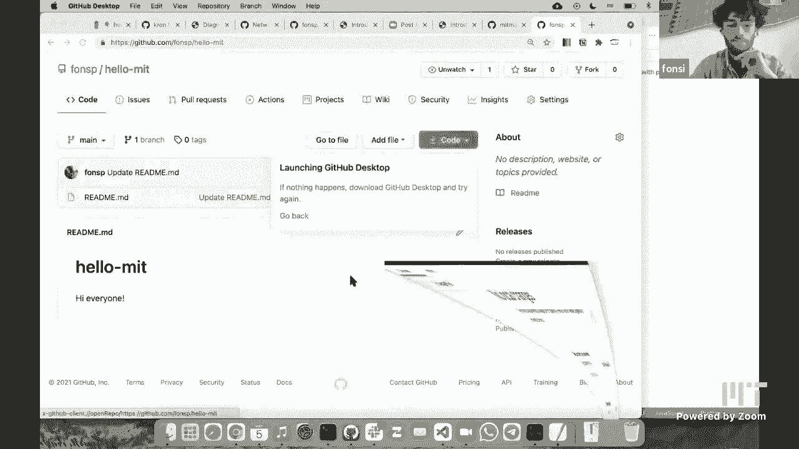

say open this kit on the desktop，and so now it's going to ask me so this，is the url。

so where my repository is online and，it's going to ask me for a path。

so where it's going to be on my computer，and it's going to synchronize this，online repository。

with this folder and you also say that，this is the remote，that's。

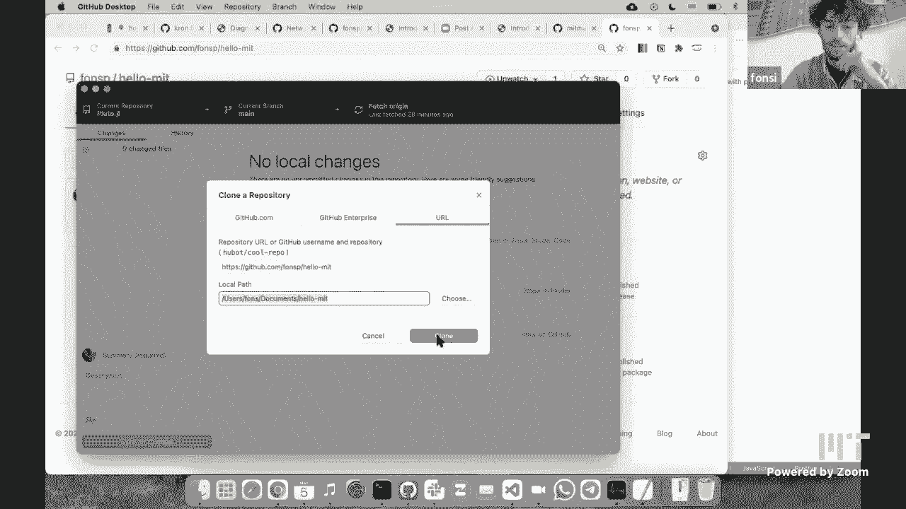

which，is a secret word for saying downloads，and so now it's cloned as they say。

and i can click show in finder or if，you're on windows it will show it。

in explorer which is a cool name，you see that i have a folder on my，computer now。

which is in my documents which has this，readme file，and i can open it with ps code but。

actually i'm going to open the entire，folder with vs code。

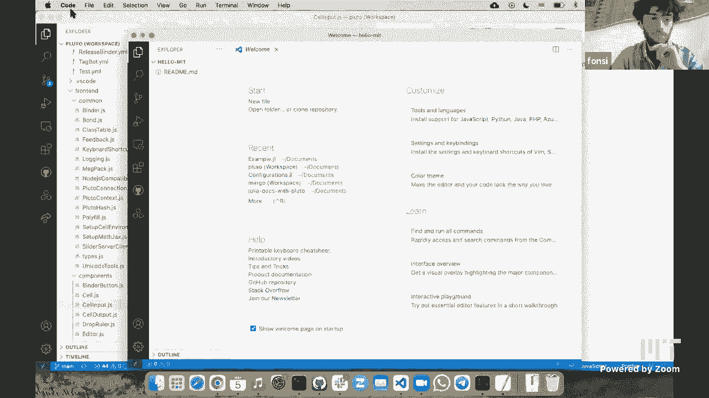

and there's also a button for this，let me just minimize so you don't see。

much but on the left here you see，there's the readme file，saying hi everyone and then。

hi everyone and phillip，and i'm going to save this，and now actually first if i go to the。

website and i refresh，right it's my google drive it didn't，synchronize i added something but it's。

not on the website yet，and that's because these changes the，synchronization is always manual。

so i need to do something before it gets，and you see that if i go to get a。

desktop the view now change because，there's a，there's a changed file and on the left，files。

right now it's only one it's saying，this line line three got replaced by，this line。

and that's always how git works it looks，at differences between lines and tries。

to be smart about this，and i guess the yellow square means the。

color coding is modified as opposed to，uh deleted or added or i guess there's。

some other codes that's right，so if i hover with my mouse it's saying，modified。

and it's always the github color it's，like green is added yellow is modified，where it's deleted。

okay so i select which，changes i want in this case there's only，one and i say。

let's make this a description of my，change it's quite nice if you write a。

good description for your change because，then later it will be easy to look to，your history。

hit commit which is the blue button，let's check the website it's still。

not there because committing is not，enough it's two steps with github。

they separated this for a reason that，you will eventually find out。

took me two years to figure out but，commit and push are，separate so i click commit first。

and then top right i click push and now，push means，that were，on my computer make sure that they're。

also happening online，can you explain the difference between，push and fetch which just showed。

they just gave so i just clicked push，and now this button goes replaced by，fetch fetch means。

sort of remote the local they both have，a collection of changes。

and fetch means make your computer so，your local，aware of what's happening online the。

best practice is to click this button，all the time，and then you're always aware that maybe。

something changed online，that's actually what i'll show right now，so you see my commit showed up。

i can look at all the commits to this，repository，i just add a filler i can click there。

let's go back okay let's add a new file，so create a new file and call it，uh friends。

txt i'm gonna write，the names of my two dogs，and so if i look at。

my folder it's not there because again，it's not synchronizing automatically。

it's gets it's synchronizing manually，and now you need to pick fetch。

and this is why it's important to click，fetch you always want to pull changes。

from what's called origin which is in，other words we're saying the source。

the thing that's on the web i don't know，if that's the exact right meaning but it。

seems to be usually true，to be honest i don't know what it means。

but that's the same association that i，have yeah yeah so i think if if in。

practice if you think of it as，the state of the universe on the web。

that's kind of not a bad way to think，i think you know as people can tell from，me and alan。

we've been using git for a while and we，still don't know all of this stuff。

it's nothing stronger i spent years，thinking that all these people around me。

are really good at games，and like i'm the one who just doesn't，know all of these fancy things。

but then when i ask the fancy people，like how to do simple things they don't，know how either。

and that's when i learned the real truth，that's why i think people should keep。

this in mind it seems super intimidating，and sometimes git will give you these，error messages or。

whatever um people around you also don't，really know，just um try to keep it simple。

and if things break i'll talk i'll give，you a strategy to fix，it i think i i i've often thought that。

the first thing that，i've that you should tell people maybe，we'll before the end of this lecture。

is if you really mess things up，completely on your own machine，and you just want to get origin the。

thing that's on the web，and get rid of everything else on your，machine and just not have it give you。

any annoyance，you know what do you do but maybe maybe，you'll get to that later yeah that's。

right okay but go ahead go go do what，you're gonna do，okay so let's say that i make two more。

changes like i have exclamation points，here，and i everyone and fit up。

also more exclamation points now go back，to github，you see that there's two changes two。

files change at the same time，and this happens often in code that。

you're editing two files and you need to，match，like you change the function name in one。

file and then you're using that new，function name in another file so。

you always need both files to be at the，same versions，so that's why github has these check。

boxes i can say，i'm going to make a commit and i can say，which files。

do i want to put together into a single，commit，so now both are checked and i'm going to，say。

more exclamation points make this a，commit，so you just did two files at once i。

sometimes have trouble with that，interesting yeah then so maybe sometimes。

we'll see what's going on but that's，just purely github desktop it's not，github。

and so you see this so you see that this，one commit，has both files changed at the same time，okay。

let's okay let's talk about，okay so there's some vocabulary here if，you would like to。

look at the website let's talk about get，trouble，get get in trouble sometimes especially。

if you're working together with，multiple people and there's a lot of，get。

into trouble yeah and this will be，sooner not later，this will be soon enough later and。

that's because unlike google drive，synchronization can require a manual。

intervention that gets google drive，always synchronize like no matter what，you do even if two。

people are editing at the same time it，will figure out a way to。

delete someone's changes but git is very，like conservative in this way it will。

never delete someone's changes if，it considers them as holy we'll never，delete changes。

and you'll have to go through a lot of，trouble to convince kit that no these。

changes don't matter so much it's okay，you can delete it as a quick example，[Music]。

i'm going to create what's called a，merge conflict something that happens to，me often。

so online i'm going to pretend that i'm，someone else working together on this，project，and maybe i。

delete these two exclamation points，i'm going to commit this to the main，branch and now it's online。

then on my computer i still have the old，version i didn't synchronize。

and i was working on this code and i，just changed this name to floopy，instead of floop and i save。

and now，[Music]，right so i can make my commits and i，need to pull。

um if i do this if i click pulling is，always nice getting the latest changes。

it's going to say error blah blah blah，it's talking to me about stash now you，can look up stash。

and learn about stash if you like but。

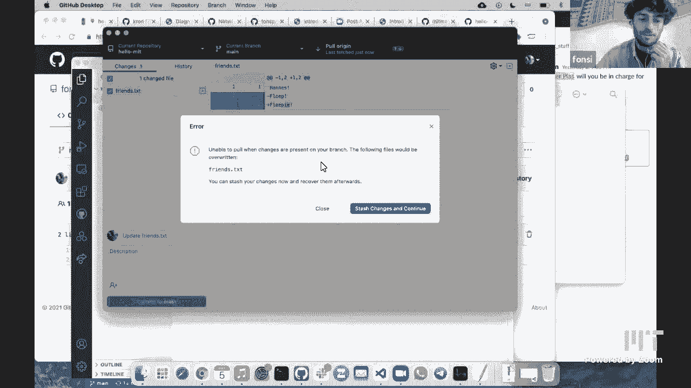

i'll tell you about my strategy for，which is to just remove your clone。

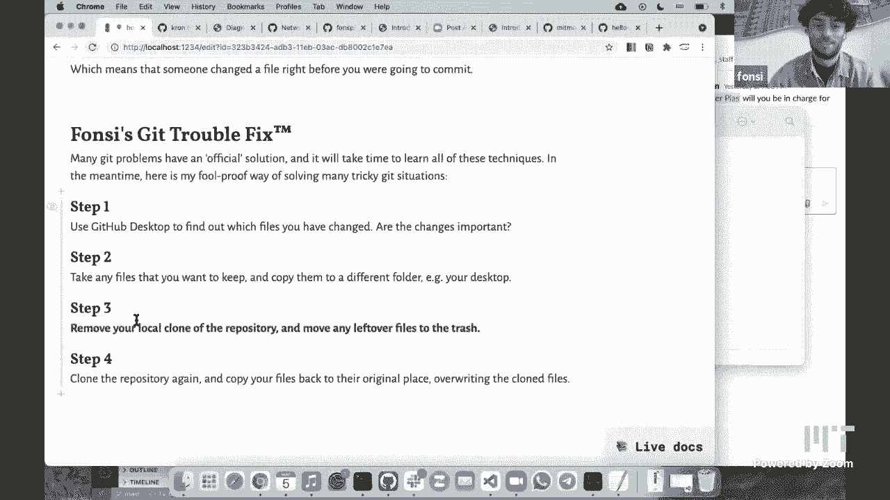

and start over so i mean this is not a，super dramatic problem and it will be，easy to fix but。

let's just pretend that that we're，completely stuck we don't know what to，do。

if we want to give give up get it up all，together。

don't so the first thing so the first，step is，find out which files have changed are，they important。

so in this case i see okay i added this，actually it's not super important so。

what why can't you in get up desktop，and just keep working from there like。

there's that drop down on the current，branch，um it's not there i'm not sure。

actually i think it's because i，am on origin，[Music]，i'm sorry i don't know you're on mean。

according to what we，can read on i want to so there's a，setting that you can change。

i wonder if there's a setting that you，can change somewhere that would let you。

do that and we'll let you see that so，so that would that would mean that you。

wouldn't have to do what you're about to，show us but let's go ahead and see your。

what let's do it the funds way，which by the way i'm about to say that。

it would feel scary to do it because you，feel like you're about to wipe out all，your work。

and maybe everybody else's too and so，git never wants to wipe out your work。

and that's why this pool doesn't work，it it doesn't want to delete your，changes right so。

but go ahead do it your way yeah so one，thing could be i don't care about these。

changes then i could do，right click and discard and then it's，just going to。

send it back to the last version and，then it's clean，and then i can do pool this works in a。

lot of cases，let's say that i don't want to discard，i'm going to do something else。

which is take the file that i like，i'm going to copy it and i will put it。

and now i can discard all changes，and to be more dramatic you can even，remove the clone altogether。

so remove the files and start over can，you have desktop do that can you just。

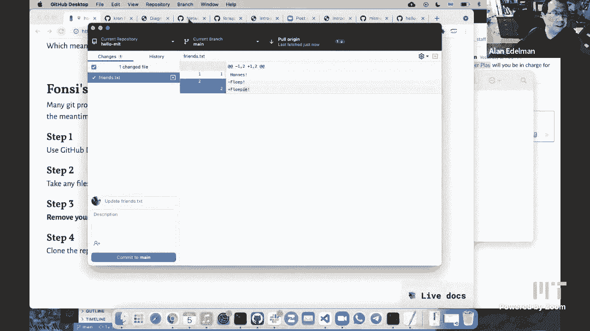

remove it right there，yeah so i can do repository remove oh，look at that。

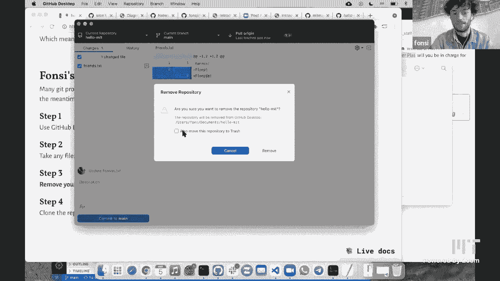

and then i say also move it to trash，it's okay and now，it seems like it might be scary but it's。

really no big deal and that's because i，copied the file before。

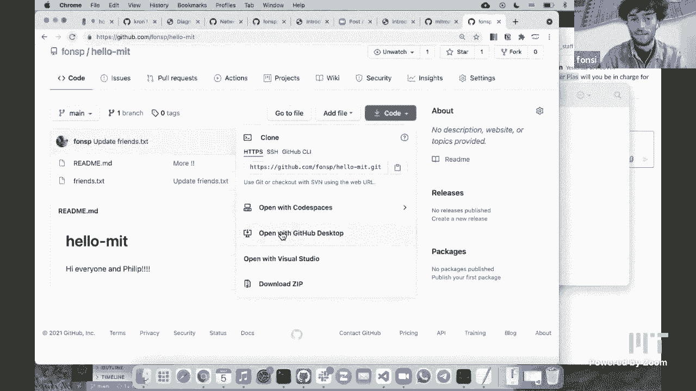

right now i just clone it again so，do the same steps before green button。

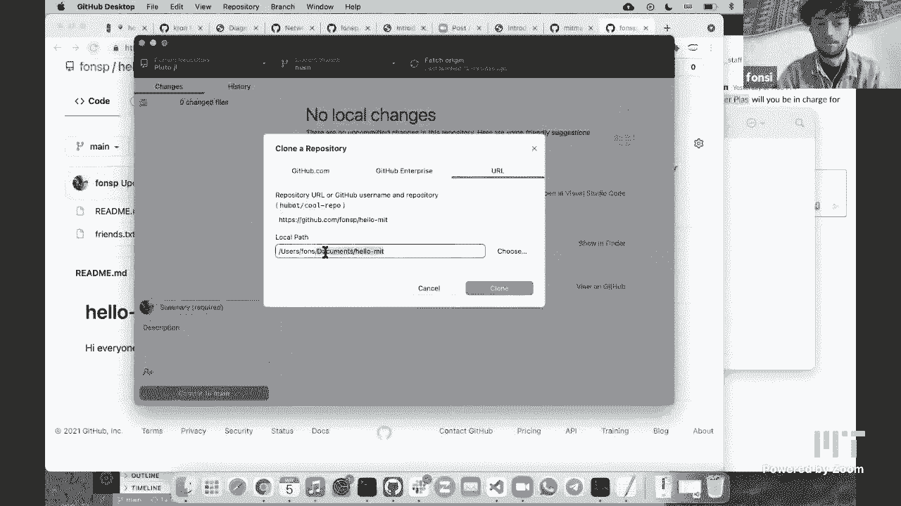

and get the desktop put it in the same，place，now it's there and you see it。

already took that latest commit so where，i removed exclamation points。

and now i can take the file that i liked，copy it go back to，see go back to repository and i just。

replace，the file so i remove it put it back，and now you see that this。

i added i added the scoopy but also the，exclamation points are there and now。

this is the point where you might want，to look at these changes yourself。

maybe make edits to to keep both changes，can i kind of echo what you just said。

maybe with my own words，just because of the way i would have，thought about it until i understood how。

it really worked，it it might have seemed that by，removing the file completely and then。

downloading the，web version the one that was you know in，github on the web。

uh that that when you brought the file，back you made not just the one change，but you might have made。

a change on every line after all the，file wasn't there and then suddenly it，was there again。

but of course that's not how it works，what it just does is a diff of the file。

as you know at the moment of commit with，what it had bef in the previous commit。

right that's all it has，and anything in between that you do，delete it，delete it。

right none of that matters it's just the，diff between the previous commit and the，current commit。

diff meaning the differences right that，the set of different the collection of。

differences between them you have this，friends。txt，on the web you have this friends。txt as，it exists。

at this very moment in time and it's，just going to do a pure comparison and，you've got。

that extra ie exclamation point that's，the only real difference。

and that's all that so that's all you're，going to see at this point so actually。

no it's saying that i'm also adding the，exclamation points because。

before i did this you know fonzie's，trick was doing the hard reset i had the，exclamation points。

the online version didn't so this is，and in this example uh，uh looks dramatic but i can just edit。

and say do it did i run these，exclamation points yes or no i could now，use a code editor to。

mainly fix this now what i just，explained was，not how you will do it a year from now a，year from now。

you will do a merge conflict resolution，where you use vs code or another editor，like this to choose。

which of the changes do you want it's，like did i want this version of the old。

file and i want this part of the new，file，but until then i think it's good to know。

that you're not completely stuck，you can always just do a bit of tricks，like this。

and uh manually look at your changes and，see what's up，okay yeah this file just showed up。

that's something that mac os does，is it creates a little dots ds store，file。

happens sometimes sometimes you just get，file changes that you don't want。

i do right click this card and then it's，okay i think so i want to say that。

that um you don't need to do i mean，the sort of more advanced way would not。

be to move the file out of the way and，all that it would be to create a new，branch。

is that what you see yeah so in this，case you could already use the stash，feature。

like it's a desktop suggested and then，this vs code，could compare the difference between my。

stash and the latest，version and then choose what i want，or you could have created the branch。

like david suggested so before pooling，you just quickly create a new branch put，my changes there。

then，for example i can merge using a pull，okay so there's one part about how to。

fork and contribute code to a project so，what i showed before was，how to contribute just a small。

documentation change，i'm not going to show it today because，of the time but it's just a combination。

of what i，of the of the past two things i showed，so doing a fork。

and um making contribution using a pull，request，but if you're contributing codes then。

you want to get that code in your，computer，edit it on your computer try it out in，your computer。

and when you're happy with the results，you put it online，one thing that i did want to talk about。

i mentioned before is，testing and this is something that you，will see again。

and it's super useful if you learn how，to use as well，people often write tests for their own。

codes people write tests for themselves，and as part of the code base people have。

a folder called test，containing scripts that will import，their own code base and then run some。

basic checks on it，kind of as a simple example i did it all，in this one。

notebook so say that i'm creating a，function that doubles a number。

i can add some tests like i want to，check that if i apply it to three。

and i really get six and say that i，um wrote this test it's going to be test，failure。

and that will show up like if i create a，pool address，it will automatically tell me one of the。

tests just failed，or if i want to test my own computer，so one reason to do this is after you。

fix something，that，the double of two returns 40 and it，should be four。

and after you fix it you would add a，test to kind of pin down this behavior。

you never want this to break again，because you once you've written a test，in your in your program。

um that test will，will stay around so later when you like，months later when you forgot about this。

and you're doing something else you can，still run that old test and make sure，that it works。

and little fun side note is test driven，design，some people like to first write the test。

and then write the implementation，so like i might start out just by，writing。

double of x you see like oh it already，passes this test i just，need to make it past this test so。

b times two and then nine works and，and it can be rewarding and effective to，first write your test。

and then just keep tweaking your code，until all of your tests work。

and if you've been following this course，and you're already familiar with this。

concept because the homeworks were all，test driven design so in the homeworks。

we already wrote the tests for you，and you write the function and，i hope you found that by。

already having the test there it's clear，what you need to do and it's more。

and then there are ways to run the tests，like on your own computer or again using，github magic。

all right that was it two more tips，um contributing to open source does not。

only mean contributing code，i have a little link here there you can，also contribute by。

making more examples by finding issues，and sending what's called a。

minimal working example so if you find，a problem try to write a little script。

demonstrating the problem，and send it to the to the creators of，your package。

and second today go out and create your，first github repository，a lot of people including me have a。

couple of test repositories on github，where we just，do stuff like create branches if i'm。

working on something and i wonder like，did it work if i have one branch doing a。

pull request into another branch，i always tried on my test repository。

um yeah that's it i think github，can be difficult at the start but i know，people who write their。

shopping lists on github，it can be a great tool especially for，publishing your work。

and putting it online forever the reason，to have your shopping list is so you can。

go back and see what you bought six，months ago，yeah you know if you want to contribute。

on a shopping list you can，do pull requests and kind of approve or。

i think if you're shopping for a family，all right i see all right thanks again。

thank you thanks everyone we'll um end，the live broadcast and possibly if you。

could stick around for a little bit，and see if any of the students or。

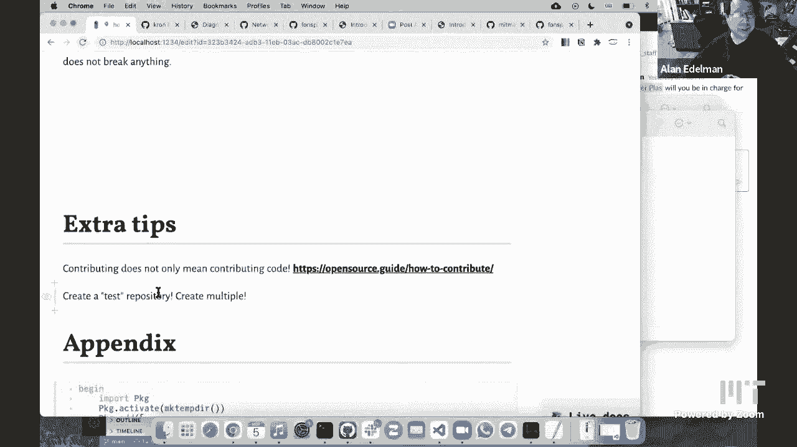