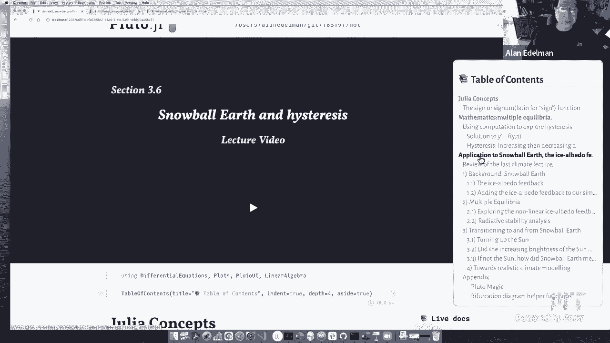

# 【双语字幕+资料下载】MIT 18.S191 ｜ 计算机思维导论-Julia(2021最新·完整版) - P22：L22- 雪球地球与建模 - ShowMeAI - BV19g411G7ab

yeah all right all right well then，today's lecture is i guess the second，main lecture on。

uh climate modeling，and in this lecture i'm going to，structure this lecture somewhat similar。

to the lecture that we had，a week ago where i'm going to show a，mathematical phenomenon in this case。

it's going to be，hysteresis and then show you what this，has to do，with the climate so。

you could see here in the table of，contents there will be some differential。

equation solving as we've been doing，before，um we'll get to hysteresis and then。

we'll move on to the snowball earth。

but just to have a bit of a preview let，me just show you a picture here of。

um of of the snowball earth do we have，the picture of the snowball earth。

actually i have it over here so let me，just grab it over here so。

uh this is a i guess this is an artist，picture because we've humans have never。

experienced a snowball earth but the，snowball earth refers，to ice covering the earth from the poles。

to the equator and back again，so the entire earth is covered in ice，and uh。

when that happens because most of the，earth is more，white than dark it reflects a lot of the。

solar radiation，back into uh back towards the sun，and it doesn't keep the energy of the。

sun on the earth and so it kind of，promotes the the earth being colder in，that way and so。

um we're going to talk a little bit，about how a snowball earth can happen。

and how stable it is and maybe a little，bit about how we've been so lucky。

that uh you know we have a earth right，now that，that's much warmer that supports a lot。

of different kinds of life，and you know uh you know human beings。

animals plants fish all these sorts of，things，just went outside so uh allergies are，setting in。

all right so so first uh，new，julia we're really just applying the the。

differential equations that we've seen，before，um perhaps one function i guess it's。

kind of a trivial function but maybe，worth，saying a few words because it's going to。

play an important role in the math that，we're going to do is，is the good old sine function right so。

that the sign，or the in in math sometimes you see it，being called cygnum which is nothing。

more than the latin for sign is，uh is a function that on the real，numbers it's it's。

it's uh one for a positive number and，minus one for a negative number and then，there's the。

lonely old zero in the middle where the，sine of zero，is zero so that's the sine function。

uh it's pronounced the same way i guess，as the trig function，s i n or sine but uh today we're not。

going to do any trip functions today，we're only interested in the，actual sign function sign。

um so this this is an example of a，discontinuous function，um it's discontinuous at zero it's。

continuous everywhere else，uh as you may or may not know but，in uh almost every computer these days。

follows the，the so-called ieee standard and so uh，infinity，is a perfectly good number so and。

there's a，plus infinity and a negative infinity，and，just a quick reminder about infinity if。

you look if you will，why can't i open up a new cell that's，weird。

i'm having trouble opening up a new cell，well let me just see if i can。

all right one plus one anybody know what，the answer is my computer is not knowing。

the answer right now，that's not good at all okay well，huh that's i don't know why i'm so。

i'm tempted to start things up again，though that could also take a little。

oh let's try this one oh oh oh i know，what's going on，okay no that's my bed all right let's。

yeah yeah sorry that was me being silly，this was i should close this。

i actually kept this one around as a，backup but then it confused me。

my apologies okay so where was i uh，one divided by zero which you may have。

been told back in elementary school that，this is undefined，but let me point out that oops as long。

as it's time zero，that this is perfectly well defined on a，computer and it gives you the ieee。

number if，okay and in fact there's a minus one，over zero，which would actually give you minus if。

so these are two perfectly good numbers，just to，point that out okay so next time。

somebody tells you one over zero is，undefined，you could tell them well but not on most。

computers okay，in sort of uh in elementary school，mathematics it's undefined。

okay uh but not on computers all right，let's get back to the main thing。

i would like to uh i would like to，use computation kind of go along with。

the computational thinking idea that，we've been bringing up in the course，this semester to explore。

a term that sounds scary hysteresis，you may not have ever heard this word，when。

when you do magnetism it basically，refers to，a phenomenon which not only depends on。

the exact state but also how you got，there the history，so let me kind of give you the idea with。

an example and then you'll see what the，idea is，so i'm looking for a function that。

is only a little bit discontinuous right，look it's pretty simple but a little bit，discontinuous。

and so the functions that i'm going to，be interested in are going to be。

uh straight lines with a break right so，here's like a straight line。

and there's another line over here at，zero it sort of makes a jump。

but otherwise it looks just like a，straight line and to construct such a，function in fact。

i'm interested in a family of functions，so you'll see me moving this a a little，bit and。

there'll be a family of functions so the，the functions，yeah you could see it moving now just。

get it going，so the functions that i'll be interested，in um they're pretty simple。

um they'll be the sign of y plus a minus，y，okay those are the functions that i'll。

be interested in for starters，uh i think the only thing that makes。

these a little complicated is the sign，right so this is this function is going。

to be either minus 1 plus a minus y，or 1 plus a minus y right it's just this。

is plus or minus 1 after all，so if y is less than 0 of course it's，minus 1 plus a minus y。

and if y is positive it's 1 plus a minus，y and while i'm at it i'm actually，interested in the roots。

so let's just do it here before i forget，so a root of a function。

is where this function is zero right so，uh you'll see that minus one plus。

a will equal y exactly when，you know at y is equal to minus one plus，a or a minus 1。

but only if this is negative right so if，a is less than 1 we'll make this，negative。

similarly y equals a plus 1 will be a，root of this，but only if y is positive which is the。

same as saying a is greater than minus，1。all right so these are for a fixed a。

this might be a root a minus 1 might be，a root if a is less than 1。

if this a plus 1 is a root if a is，greater than minus 1 and of course you，could have both happen。

in which case these are both roots and，so here let's let's take a。

a look at the picture of this just to，see what's going on，so here a is much less than minus one。

and you see there's one root okay so，here's a plot of f of y when a is minus，3。6。

and a root of course is where we，intersect zero，we've got one root there it is at a。

minus one or minus four point six，okay i could move a over to b bigger，than one。

let's make a equal to three and you see，here again，this this part this little segment never。

crosses zero，but this segment does cross zero it does，it at a plus one or at。

four okay and if instead i take a number，that's between minus one and one let's。

see i landed on minus point eight，then both of these segments cross zero，and we have two roots。

minus one point eight and zero point two，so these are the，three things that'll happen now uh。

this is a plot where i fixed a and i，looked at f of y，as a function of y uh we could of course。

think of this as a plot in three，dimensions，we could think of you know z equals f of，y a。

and this will consist of two parallel，half planes and i might draw this a，little bit。

uh but i'd like to point out that it's，actually kind of hard to，you know we humans we say that we we。

live in three dimensions we're familiar，with three dimensions，but my own experience is that three。

dimensions is quite hard to get used to，for watch plotting and manipulating，three dimensions。

is a lot harder than we usually think，that it is uh but if you like i could。

draw the picture for you i have it ready，um there's another view of it all which，is to。

uh so this is hold this one here i'm，plotting i'm keeping a，fixed and i'm plotting f against y。

for a fixed um in another view，all，lots and lots of a's here they are going。

from like minus five to five or，something，like that and we could actually say。

where are the roots and so let's kind of，look at the right hand picture just to。

see what view that is，so uh let's move this along a little bit。

so uh for a less than minus one we have，a root at minus 3。5 and that's kind of。

what that's saying over here，as i move this you'll see the root kind，of moves。

up and then when i get to this point i，get well two roots and then i've already。

passed that and you get one root again，let me maybe what i will do，maybe。

to see if to see if it makes sense，so uh let me uncomment this out。

and we uh and i can actually draw the，surface，and while i'm at it i think i'm going to。

draw the surface what's cool about the，plotly back end for，graphics is that it'll allow me to。

rotate it，okay the only problem is this will take，a little while because it's going to be。

doing all the plots from beginning to，end but here let's get this there we go。

so here's like the two sheet the two，now，and what's kind of fun about plotley if。

i can get this to work，is i may have to wait for the other，plots to finish。

uh yeah i think i have to wait right，let's see did i get i have to plot the，back end。

yeah i think i just have to wait but you，could you can see that the two parallel，sheets。

and i also drew the intersection with z，equals zero，and you could see that the two lines one，on this。

to me this sheet looks below yeah the，sheet kind of looks below i guess。

you know it's funny but i think i can，make it look above also right that's the，funny thing about 3d。

but anyway the sheet this sheet here is，where the z equals zero intersects and，here。

right and so this picture of these two，red lines is exactly these two blue，lines。

over here it's simply the intersection，of this plane，with z equals zero and of course plotly。

is messing up all the plots，can i why can't i maybe i have to run，this again。

i'm quite sure why i can't get the i，wanted to rotate this a little bit in，three dimensions。

but it's not that important like i said，these things are kind of hard to see。

anyway but we'll give it a chance to see，if it，okay there we go okay yeah so this is。

this is plotly in action，all right let's let's fiddle with this a，here so uh。

we can we could do some rotations of，this thing you could see the two planes。

i don't know what's a good view maybe，something along the way is like this you，can see。

these two parallel planes okay so，this is the function and uh plotly，draws all these these these。

intersections with sort of the，the plane parallel to the floor and and。

the two walls so to speak and so，you can actually see the black lines and，the red lines overlapping。

let's see if we can also get the a again，maybe this is the sort of thing you。

could play with yourself，uh but this is the surface that i'm that，i'm interested in。

right now and this is going to be a good，surface to show hysteresis with。

all right so the the let's see so let's，let's get back to the main point。

playing with three dimensions is，here，i'll leave it up uh let me switch back。

to the gr back end which i think looks，prettier anyway it just doesn't do the。

interactive 3d plotting okay but we'll，keep let's go back here so uh。

do i have to redraw this to make it look，nice let's do that，so we have a gr plot。

wait what's i don't know why it's oh i，see what it's doing，my a is moving up okay so one last time。

this is a fixed a it is one intersection，with the surface where a is a constant。

it's it's like a wall it's like a，section you know perpendicular to the，floor。

and this is parallel to the floor but，it's the same surface，with the same roots all right so。

why am i showing this to you well i'm，i'm actually interested。

in using this as the right-hand side of，a differential equation。

okay so here let's start let's make sure，a is negative，here let's what we'll do is。

we'll we'll do what we did before we'll，start with a being all negative。

and uh something like negative 3 or，negative 4，and whatever it is and we can look at。

the solutions to the differential，equation and，just to get used to this to see what's，going on here。

let me point out that we're going to，have an equilibrium here at negative 4。6。

and so no matter where i start，i'm going to i can start below negative，4。

6 this is the only equilibrium，and so no matter where i start this is，where i'm going to go。

but you could see the result of the，discontinuity here let's kind of。

take a look at that if you've never seen，this in differential equations it's sort，of interesting。

um there's a bend over here a little，kink，right because the f of y has a，discontinuity。

then y prime has a discontinuity in the，derivative which means that。

y itself is continuous but it because，it's it's got this discontinuity in the。

derivative here let's move this up a，little bit maybe it'll be more，pronounced let's do it like here。

yeah now you can even see it more，obviously right it's even sharper now。

that if i start above zero what's going，to happen is i'm going to sharply bend。

when i hit zero right so that's kind of，fun to look at，but if you're below zero that doesn't，happen。

but if i'm above zero you could see the，sharp bends，that happen because of that。

discontinuity if you look very close to，the direction of fields，which again do not depend on the x。

direction they're constant but they，depend on the y direction。

right so every column of these direction，all these yellows look the same。

you'll see that you can kind of see the，discontinuity of zero right it seems to，suddenly。

change character between here and here，it suddenly gets，much lower right here it's practically。

flat well here it's，kind of sharp right so you can see the，discontinuity and you can see the。

results of the discontinuity okay so now，let's make a，go between minus one and one well。

there's there's a place we can use，and now there's two equilibria right and。

now let's see what happens if i start，above，i i go to the to the higher equilibrium。

uh i could be a little bit below and i，still go there but if i start negative。

jump very violently actually to me，that's very fast，i'm switching to the lower equilibrium。

and of course anywhere below i'll get，all set to that equilibrium right so。

just notice how quickly it just goes，back，and forth between those equilibria。

okay so and now we can actually let a go，bigger than one where there's one，equilibrium again。

and you'll see that we've got the，discontinuity，but uh there's only one equilibrium。

right the equilibrium at three is is，the only equilibrium possible okay so i，hope everybody。

sees what's going on as i've pointed out，i really like，computers to be able to help you。

understand the nature of these kinds of，differential equations，you don't need a computer people for。

hundreds of years have been thinking，about these things just with their minds。

but uh even in your mind i think it's，hard to see，even even the greatest of mathematicians。

there's still something about seeing，you know the way it violently flips from。

one to another when there's two，equilibria，it's just there's no there's no there's。

no substitute i think，for the computer so now what i'd like to，do is go back to。

this picture here where i talk about the，roots，and let's start out again negative，fairly negative。

and we don't have to be too negative，here about this okay，and uh you see at negative 2。1 as you've。

seen before wherever you start，you're going to reach the equilibrium of，minus 3。

1 that's it that's where you're，going to land up，right and if i start stepping and if you。

follow the red dot，you'll see that if i start increasing a，slowly。

then the equilibrium will move slowly，it's going to move along this line。

okay now of course when i start to get，past -1 i'll have，two choices but if you have a system，that's。

moving continuously and gradually the，equilibrium will stay on the red line。

the red dot it's not going to just，suddenly bump up to the blue，it'll stay so even though my a's are。

bigger than minus one and pretty soon my，a's will be positive，i'm going to stay my equilibrium is。

going to keep me on this cooler side on，the negative side，okay and i'm going to stay i mean i。

think that's physically intuitive that，you know if i started out here and i'll。

try to stay continuous as long as i can，but of course the moment i hit a equals，one。

suddenly i don't have an equilibrium，over there and it will jump up。

right so so at equals one i will jump up，to the positive side。

right but only at a equals one now what，happens if i start cooling a down。

notice if i'm on the blue curve then，the same argument says i'll stay on the，blue curve now。

so right and i'll probably stay on that，i'll stay on the blue，dot。

all the way until a it's to minus one，right and then of course i will jump。

down since i have no choice and i will，jump down，to the red dot okay so this is your。

first view of hysteresis i'm going to，show this like three times or five times，in this lecture。

so if it didn't make sense the first，time there'll be many other，opportunities。

to to see what's going on but i wanted，you to see as a main point。

that if you make small changes to your，parameter a，and you let things reach equilibrium you。

just let things kind of go to，equilibrium，you're going to stay negative and stay。

along this line you'll stay you're，negative all the way up to a is one。

if you keep increasing a you go up here，but if you start decreasing a if you if，you stay continuous。

you're going to be on the positive side，even all the way down to a is minus one。

right so just knowing a alone gives you，two choices but you have to know the。

history where have you been，and what small steps you're making to。

decide whether you're going to be here，or here because both are possible。

right and uh it's completely possible to，sort of move up this way then jump up，here and then。

uh as it cools to go all the way down，here before you jump back。

okay and so that's your first view of，hysteresis，okay and this is going to show up in，snowball earth。

but here let me show you this in another，way okay，what i'm going to do this time well。

actually let's do it let's do it first，on this picture and then i'll show you，the cumulative effect。

let's go here and take a just a little，less than one，maybe negative 1。2 okay。

imagine i oh sorry that's an a that，a where's my a where's my a my a is up，here。

let's let's comment this out so i could，see this at the same time。

okay all right now i can see my a at the，same time，i don't even need this anymore let's，kill it。

okay and let's hide this all right now i，can see my a at the same time。

all right let's look a to be maybe，negative 1。2，okay so my a parameter is negative 1。2。

and i let my system evolve and you see，i've reached the negative equilibrium，negative 2。2。

so let's go ahead and you know imagine，we're starting again，but we'll start exactly at the。

equilibrium point okay so this is，completely flat we're at equilibrium。

but now i'm going to heat things up a，little bit like imagine the sun just got，could。

heat it up a little bit maybe a negative，1。1 or，you know let's heat it up more negative，0。

9 negative 0。8，right you see what would happen okay all，of a sudden。

we our equilibrium is now negative 1。5，we're still negative，but uh we're we we've we've warmed up a。

little bit，okay if this is temperature we've warmed，up so let's go ahead and match the，equilibrium。

again okay so negative 1。5 and let's，warm it up a little bit more okay let's，go。

we could keep going let's go to 0。8，all right well the equilibrium has。

warmed up to it's still negative but，it's now negative 0。2，so even though a is quite positive where。

our equilibrium is still negative right，we're almost at one，right we could we could actually go to。

let's go to 0。9 even just a little bit，more，okay and now our equilibrium is at，negative point one。

whoops there you go but of course，once i jump past once i，jump past one you'll see that i've。

jumped way into the positive direction，this is sort of a big jump。

right and this is what we saw before，that even if i start out over here。

i'm going to be warmed up to this value，all right but let's go ahead and match，that value。

here and then my point is going to be，that if i start decreasing a we could。

decrease it a little bit here let's move，it i don't know，just a bunch you'll see i'm staying。

positive where i before i was negative，okay and again this is your second view，of hysteresis that。

this a value of negative point one we，saw it earlier in the negative。

but now we saw it in the positive so，because we stepped backwards。

we're over here okay this gives you a，little bit of a clue，how we could have a snowball earth which。

is stable，at a much colder temperature and we，could also have the earth that we have，now。

at the temperatures that support life，right so that's kind of a clue。

how it might be possible there are these，two equilibria and they are going to，correspond。

somehow to to different eras of，of our planet okay so let's see this one，more time。

um increasing then decreasing a what i，did over here，took，ten time steps and i did exactly what i。

showed you before，i uh let a system evolve，we could take a we could take a small。

piece of it like this little blue one，i let it evolve in equilibrium and then，i started the next。

iteration over at the equilibrium but i，raised a a little bit，so the a values that i took were from。

minus four to four，and then i decreased back to minus four，okay these are the a values they started。

to minus four，it went down it it went up to four，and then down to minus four and i just。

sort of watched what，uh the y values would be and you'll see，that uh。

you know when there's only one choice，you get these nice symmetric pictures，like。

this this nice little pointy house if，you will over here，right and here and here you could see。

there's one value，and so it's symmetric right if the value，of negative three is the same value over。

here is negative three，but between minus one and one here it，takes the lower colder values。

and here it takes the warmer values it，it knows where it came from it knows。

that it came from the higher，temperatures，and it stayed that way as long as it。

could before it had to bounce back，here it knows it's starting at the。

colder temperatures and we're going to，see this in a real earth model in a，second。

i'm just using the language of the earth，and you could see that。

this thing knows it was cold and so it，stayed cold as long as it could。

until it had no choice it only had one，equilibrium and so it shut up over here。

right so you see same a value different，y values because，they really are just it's the same story。

as here because for certain a's there，are two possible equilibria。

okay i could take either one right so，this is，basically the phenomenon of um。

hysteresis and i'll give you the，official word that，the official definition is is if。

the dependence of the state of a system，depends on its history right that that。

that the the state of the system cared，about where you came from。

then this is known as hysteresis it's，the greek word for lagging behind。

that somehow the system doesn't just，change just because of its current。

values it knows where it's been，okay so that's hysteresis and like i，said this shows up。

in um magnetism and so，let me now now that we understand，hysteresis and i。

kind of felt that uh it's sort of good，to sort of separate out the math。

from the climate stuff so last semester，andre drake did these wonderful，wonderful lectures。

about uh the you know climate models in，julia，uh the hysteresis was mixed up，completely。

with the climate to the point where，uh i have to be honest i didn't。

understand it at first because there was，too many moving parts，and so that's why i chose to separate。

the math from the climate，but in the end i think the climate is，sort of the most interesting。

because it's it's physical it's real and，and it affects us，so let me remind you about the last。

climate lecture which was a week ago，we basically had a simple energy balance，model。

that said that the change in temperature，was going to be a function of three，effects basically this。

yellow or rng effect the corresponds to，the picture over here，this blue effect and this sort of gray。

or black effect so，the first effect i'll remind you was the，incoming solar radiation。

the sun and i'll also remind you that，there was this reflectivity factor alpha。

which says that we're going to be not，able to absorb，all of the solar radiation some of it's。

going to be reflected off，okay then there was the outgoing thermal，radiation。

and that's what we released back，and that was this blue term which we。

said we're just going to make it linear，in t，and then there's the human caused。

results of carbon dioxide，which goes and bumps up temperatures，even more，to include。

this term we had a lot to do with that，last week but we're going to think of，pre-industrial。

old earth effects and so we're just，going to have the yellow and the blue。

but we're going to make one change from，last week what we're going to do is。

we're going to take we're going to allow，alpha to not be a constant anymore。

so uh you might remember that last week，alpha was 0。3，and we said that's kind of pretty good。

for the earth as it exists now，but that wouldn't be very good for the，snowball earth the。

an earth that's completely white is，going to reflect，off it's going to have a higher。

reflectivity than，the current earth that's kind of blue，and green and has dark。

oceans right so so we're going to，we're going to have um depending on the。

temperature the alpha is going to vary，the amount that we're going to send back，into。

space all right so there's no co2 term，today that's going away，and the only the only two terms that。

we're going to have are these two terms，but like i said the alpha part will no，longer be constant。

okay so uh so，so uh here's a little bit of background，that's kind of interesting to。

to look at and so there are people who，go back and try to，have。

existed millions and billions of years，ago and so，uh this here's a bit of history of the。

earth climate wise，and you can see the scale is millions of，years and so this is 500 million years。

ago this is a billion years ago two，billion years ago，three billion years ago right so this is。

a long time ago，and you could see over here that we plot，in light blue。

some of the ice ages now an ice age is，not yet a snowball earth。

to be defined as a snowball earth you，actually have to have ice completely，covering the planet。

if you simply have ice kind of at the，poles，and extending downward but not quite。

making it to the equator，it could still be an ice age but it's，not a snowball earth。

okay according to this apparently there，have been three snowball earths。

that have been uh discovered by，scientists，uh there's one way back here at two and。

a half billion years ago，this is called the great oxygenation，event。

okay and then there were two more dark，blue strands one here one here which is。

you'll see this this little band has，been magnified，and you could see that there was a。

snowball earth about 700 million years，ago that seems to have lasted i don't。

know 50 or 60 million years，and then there was another one that，lasted a lot shorter this looks like。

it's like five million years，of like this dark blue period right here，but。

scientists believe they know that there，were these，three snowball earth periods and so that。

it has happened，in in earth's history okay and so，um to be able to model what kind of，mechanism。

would allow for this to be possible uh，we have to have this ice albedo feedback。

and so uh the the basic idea，is going to go like this um maybe we，could imagine。

maybe for starters we imagine we have a，a a very a full snowball earth okay。

so warming happens what happens when，when we warm we melt the ice。

that exposes the ocean which has a lower，albedo which means that。

we won't reflect as much of the sun back，and so we'll be able to take in more。

sunlight which of course is a positive，feedback it lets us，melt more ice and so this allows for。

the earth to warm up right and so this，this sort of，melting of the ice kind of leads it sort。

of cycles around，so，um here's kind of a，a model that that henry created for us，semester。

but uh we but uh here，he here's a model for alpha so let me，remind you that。

we used alpha to be point three that is，we would reflect，that we would take in seventy percent of。

the sun，when there's no ice okay but，if we have a lot of ice if we're，completely frozen，and。

let's just say that the value that we'll，use is 0。5 we will only be able to，absorb。

half of the earth's energy the sun's，energy not，not the not the 70 that we're。

enjoying right now okay and of course，any good physical model ought to have a，transition and so。

uh i did in the in the math that i，showed you before，there was a discontinuity that would be。

kind of like the limit where the，transition goes to zero，uh but here he's adding a transition。

which actually，adds just a little bit more something to，the story but not a lot the basic story。

doesn't change much whether you make it，discontinuous like the sine function。

or you connect this up with a partial it，just smooths things out a little bit。

right so but it's kind of nice，physically to have a transition region。

where it's like partially iced and，partially melted，so that's what we'll do here，and um uh。

henry to sort of edit it back to the，model and，before we knew it we ended up with。

multiple equilibria so this，we've already discussed the math so，let's just look what happens。

in the case of this particular model so，what we're going to do，is we're going to to imagine for。

starters，that we live in a world where there's no，ice，okay and what's going to happen is。

we're going to reach the 14 degrees，equilibrium that we did last week right，there。

the as long as in the world of no ice，we're still going to，just get to the 14 degrees you could see。

it 14 degrees exactly it's，right at equilibrium right and it could。

be even a little bit colder than 14 but，uh the equilibrium will still come from，the other side。

and you know we'll reach the equilibrium，but we could even start to have。

a little bit of freezing let's just say，over here for a little while。

up until about seven or so so we'll keep，it above seven for a second。

you'll see that the earth's equilibrium，can still handle it，and even if we got a little bit cold。

we'd still reach the equilibrium of 14，degrees，okay but once we get below around 7。5 so。

we can just watch that happen if you，want，is this fast enough to be interesting。

once we get below about 7。5，then the other equilibrium kicks in here，let's just move it faster。

and you could see it's fairly abrupt，it's not quite as violent。

as the one i have because there's that，uh transition region，but it's still pretty abrupt and we're。

going to go down，to what looks like minus i don't know，what it is minus 40 degrees or something。

what's the number here it's it's uh，i forgot what it was but it's it's cold，okay。

so and of course anywhere anywhere below，that even if you're below the，equilibrium。

it'll go to that second equilibrium okay，so here are some pictures。

of uh and we drew this that starting at，five degree intervals。

and you could see that uh if if there's，no ice you'll reach this equilibrium。

over here 14 degrees let's just see if，if oh yeah it is minus 40。 yeah so we。

reach this equilibrium here of，14 degrees and over here there's an，equilibrium of minus 40 degrees。

and by the way around seven and a half，or so there is this，unstable equilibrium that it's almost。

impossible to，to root to get it to to uh stay there，let's see，unless you perfectly。

unless it's it's perfectly resolved by，even，allowing it to do i don't think you can。

get there to minus 7。5，oh sorry was it plus 0 wait where was it，was plus 7。5。

i don't think i could get there，perfectly seven point，six oh maybe i can let's say seven point。

eight maybe we can do it，there is this one equilibrium there it，is oh well it's probably not exact。

so or maybe it's more than seven point，five but maybe that's the point，seven points oh it's 7。

5 is only the one，decimal place，yeah somewhere between here and here is。

an equilibrium but it's a very unstable，equilibrium，all right so so，let's analyze what's going on。

okay so here's our original equation，again with our two terms，we have the absorbed solar radiation。

which is going to depend，on the reflectivity and we have the，outgoing thermal radiation which is。

exactly the same model that we had last，week without，any change and um if we。

draw so here's the the blue curve is is，this linear，outgoing thermal radiation and this。

yellow is sort of the，it it's got the it's like the sine，function with the transition right it's。

the very function we saw before，uh it's it's this absorbs solar，radiation。

and as you can imagine if the，yellow outpaces the blue you get heating。

and if the blue outpaces the yellow you，get cooling，and exactly where the they intersect。

there's a third intersection by the way，because of the transition region。

otherwise it'd be just the two，intersections like i did with the sine，function。

and at these three they exactly balance，out，right and you stay you're at an，equilibrium okay and so。

here's the difference between the blue，and yellow curves which is。

not a bad way to see it and at the zeros，you get the three equilibria。

and it's kind of good to understand，what's going on to sort of think about，this picture a little bit。

uh to see why this is stable and this is，stable and this is unstable。

let's let's talk it through i think it's，worth doing so suppose you're a little。

bit over here a little bit to the left，of the equilibrium right so you're，you're a little bit。

little bit，warmer than uh than over here，right you're you're uh，no sorry you're a little bit to left。

you're a little colder this is，temperature，you're you're a little bit colder so，what it says。

is that you're going to um you're in，this region，you're warm that you're over here。

there's more sun coming in than leaving，so you're going to warm up which is。

going to push you to the right，okay and you'll keep getting warmer and。

warmer warmer until you're here，right but when you get over here you'll。

see that now you're in the region where，the blue is higher than the yellow，right。

and so what that's going to do is it's，going to cool you down which is going to。

push you back to the left，okay so if you're here you push to the。

right if you're here you push the left，so that lands you here same thing's。

going on here by the way right，because it's going this way this is the，actual opposite thing。

that if you're over here you're going to，get warmer and you're going to keep，going this way。

and if you're over here you're going to，get colder and go this way so that's an，unstable。

equilibrium okay so uh，so so what's actually what actually，allows this parameter to change。

well it's been observed that，the sun has actually brightened by about，40。

over a billion years or so and so there，are these different models。

that say that um you know some time back，the sun was 93，as bright as it is uh today and so the。

the incoming solar radiation was，actually smaller，than it is today okay so scientists have。

decided that，that that the earth has warmed up a，little bit the sun has warmed up。

a little bit and so this is what，allows this parameter to change right。

and so that this is what's letting us，uh move along this curve and get，different equilibrium。

so uh but the question arises was it，was it the uh oh what's going on here。

okay good uh was it was it the，increasing brightness that melted the，snowball。

and here's kind of a model to show you，that the sun increasing in brightness。

alone is will not explain，the the melting of the snowball so here。

what we're going to do is we're going to，brighten the sun okay and what we're。

oh what let's see i think let me，let me actually uncomment this out yeah。

all right that's better okay so，let let's go back to the past when，the uh uh。

what you know back when the，the sun's the solar insulation the，amount of power from the sun。

was here below where we are today，today's value is over here，okay so that uh so again what。

yeah so i guess 12 today's value is 1368，and uh this value from prehistory is 12。

12 48 right so let's gradually，increase you know so the sun's getting a，little brighter。

and you'll see what happens we can go，all the way to today，to today's value and you'll notice that。

we did not end up we're still frozen，right we did not and there's two。

equilibria and because we moved slowly，we didn't get there，right we could keep on increasing this。

be well beyond today's values this is a，much hotter sun than。

than we're experiencing and you see that，it's not it's not free it's not melting。

right the earth is still frozen even at，these increased，these increased solar temperatures that。

increase solar energies，it's just not freezing at all let's keep。

okay yep it's not freezing at all right，it's just not，all right but here let's let's go even，further。

um let's extend the upper limit here the，upper limit is what like。

1600 and something let me press this，little button，which actually extends the upper limit。

and now we're up to 1800 now you see，and i'll keep on going and you'll see。

and it's starting oh look bump，but here there's only one here's there's，only that one equilibrium。

so now you see we can melt right but，only at these much higher values。

and by the way suppose we did melt we，know the earth actually，ultimately did the earth ultimately。

uh did come to a no ice situation，um so what must have happened is it must，have jumped。

at some point in history it must have，jumped you know millions and，and。

then one way or another it must have，come back right and it came back and it，reached this。

point of course it could keep going and，get colder but one way or another。

right so this is another view of the，hysteresis it's the same phenomenon。

where it can go up and then it comes，back to a higher value，so these sorts of abrupt climate。

transitions apparently have happened，in many many times throughout the。

the years here this is this this is，years going backwards this way or going，forwards this way。

on a logarithmic scale and so uh these，these are，thousands of years before the the。

present okay and these are millions of，years before the present but。

notice this is a logarithmic scale and，you could see that there have been。

major uh changes in temperature，uh you know sometimes we're very hot，sometimes we're very cold。

but the other thing to notice is on the，trajectories that we're looking at now。

and this is extending into the future a，little bit，we are making much bigger changes to the。

temperature，in a much because this is a logarithmic，scale we're making much bigger changes。

in a much more compressed time period，than what has happened over the years。

okay um so um as andrey said very nicely，here the simulation teacher says we。

should not take the stability of our，climate for granted，and there are people who do worry about。

catastrophic changes that could happen，that uh that not everything is always，continuous。

or uh you know on the time scales that，we want them to be，so back to the question then if it's not。

the sun that that，caused snowball earth to melt what did，it and，uh the prevailing theory is that。

even though the volcanoes were covered，in ice，there were still these volcanoes that。

were emitting carbon dioxide，causing enough of a greenhouse gas，effect to offset the cooling。

and finally to raise the melting point，of the earth and so，that's the leading theory that that it。

wasn't the sun at all，but it was the volcanoes it was，basically the volcanoes doing over a。

very long time period what we humans，are doing in a much shorter time period，basically。

emitting carbon dioxide into the air，warming up the earth，and thereby melting the ice so that we。

can actually have our nice blue planet，that we have now，and thereby be on the current。

equilibrium part that we are，in right now okay and uh，just a little bit more in the last。

couple of minutes uh，there's if you want to get into a a more，realistic model。

then then we no longer can just do these，sort of zero dimensional models and and。

and so forth um what people do next is，they form an aqua planet。

where it's partially water and partially，ice and uh here you could see this，little。

let me see if i can get this to to um，move a little bit，let's get rid of this so um。

so so here's an aqua planet which，basically，has it's it it's it's i it it。

it's got um temperatures along latitudes，and uh it it actually will。

um here's what what we're going to do is，we're we're going to，let me just sort of move this we're。

going to gradually cool the earth that's，what this red is there's the solar。

constant over here it's a little bit，hard to see maybe i can go full screen。

can everybody see it if i do it this way，maybe that'll work better，and。

we could see where the sea ice is and so，the blue being constant。

means that there there's really no sea，ice at all or it's you know close to the，poles。

but there's going to become a point，where suddenly ice forms，right and you can see ice will be。

forming at the poles it'll be sort of，the ice will be moving downward uh。

okay and so um so this is a model that，we gave，i think we gave this to a homework last。

year maybe we'll do something again with，it this year，but you could actually sort of watch，over time。

how if you if you gradually cool the，earth how the ice will move，uh lower from the poles towards the。

equator okay so that's，and，i think this is where i'm going to stop。

yep so uh just to summarize today's，lecture what we've done today。

i spoke a little bit about having more，than one equilibrium，right and that's characteristic is that。

you have。

more than one zero to your right hand，side of your differential equation。

and then i pointed out though that uh，given that you have two choices to be on。

the state of the system doesn't，determine uniquely which one，on its own but if you know where you。

came from it'll continuity will tell you，to stay，close to where you were before and this。

is what creates the stability of the，earth's climate，the fact that that these things make。

small changes but，if if we get out of hand then there's，going to be these more。

violent changes these you know you know，it'll jump up much，quite quite up up to the other you know。

back and these are this is one of the，things that you know people do worry，about to some extent。

all right so this is sort of a lot to，take in，but i do hope that you got you get you。

know the main message of the course that，uh there are these sort of complicated。

phenomena and if you could somehow，separate out what's going on and sort of。

plot it and play with it with，a simple differential equation solver，you could really get。

i think much more insight into what's，going on，than um you might find in a sort of a。

traditional or you know non-computer，class，where you where you play with these。

models um and so i hope you know，i have to say that that i understood。

this a lot better once i sort of drew，all of these graphs，and i think that that uh just about。

everybody else would too if you，kind of play with these graphs draw them，yourselves you just。

think carefully how these parts interact，with each other，you'll really kind of get real insight。

into these models even how to build them，yourself，so that's today's lecture and um。

i'll say goodbye to the people out on，to。