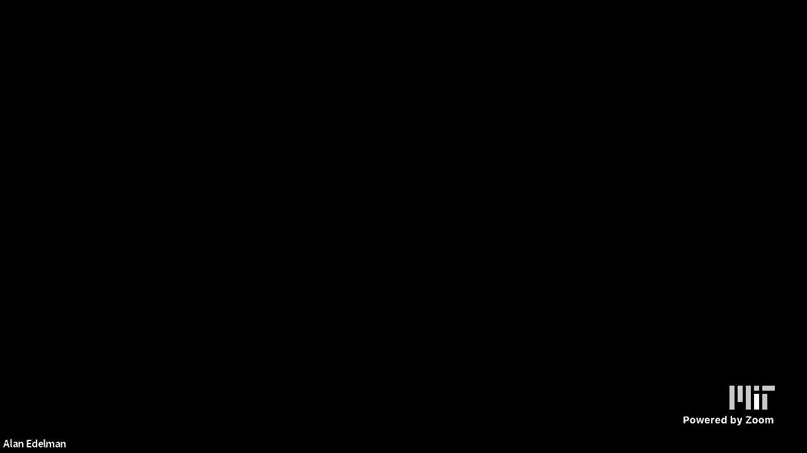
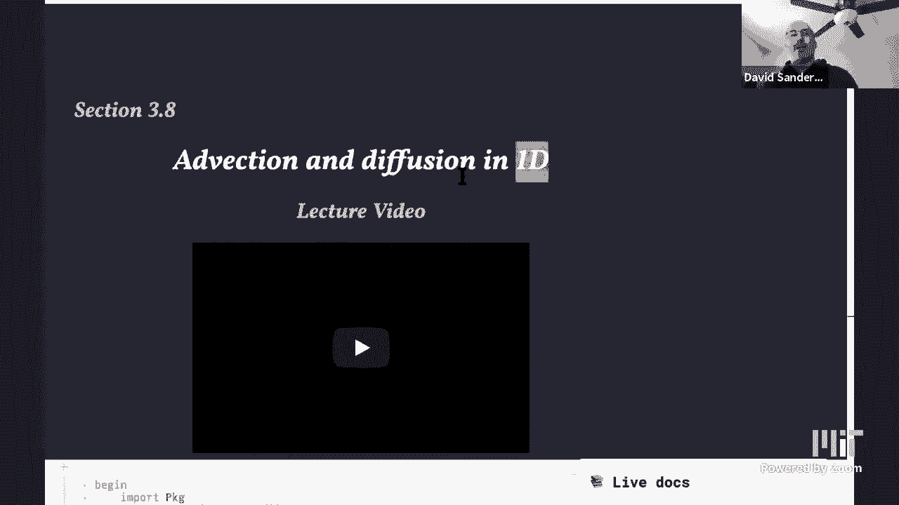
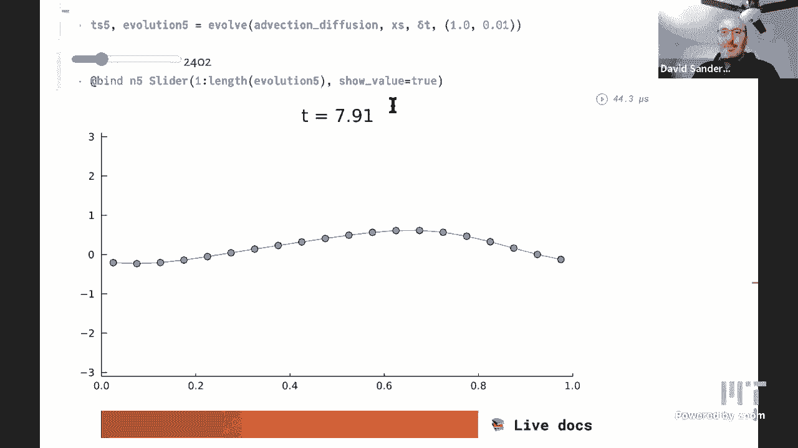

# 【双语字幕+资料下载】MIT 18.S191 ｜ 计算机思维导论-Julia(2021最新·完整版) - P23：L23- 一维平流扩散偏微分方程 - ShowMeAI - BV19g411G7ab

after youtube and everything oh yeah got。

can you hear me do you hear me i hear，you dave do you hear me，can you shut off your the the the。

so i guess as you're preparing your，screen it，seems like today's lecture is going to。

be a tag team with，with dave going first and me going，second perhaps and。

uh if i had to sort of describe today's，lecture i guess，it is uh if。

for those who have never seen partial，differential equations that。

we need to understand a little bit about，partial differential equations to。

to to fully understand climate models，and i guess dave and i believe。

that partial differential equations come，much later in most students curriculum。

than need be and it seems like it there，there's no reason，to uh that they that can't be introduced。

quite early in the curriculum and so，uh i guess in some sense today's lecture，is is。

about pdes ultimately so we could apply，it towards climate science。

would that be a fair characterization of，today's lecture dave，yeah that sounds good alrighty，[Music]。

okay hey everybody so as alan said we're，going to look at，uh an introduction to partial。

differential equations of course from，the point of view of，computational thinking so how can we。

compute，the solution to a partial differential，equation actually what does a partial。

differential equation，even mean and why should we care about，them and。

i would say that that computing really，helps you understand what it even is。

oh yeah so all the all those decades of，blackboard explanations of pdes。

just to me is not as good as one little，bit of computation，yeah exactly so what we're going to look。

at in particular，uh are two types of processes，physical processes that are relevant to。

climate models which are called，advection and diffusion，looking。

only in one dimension so of course we're，gonna，go through what advection diffusion so。

what is the idea so let's think about，the earth，so so far we've been modeling the。

temperature of the earth，as just a single number that changes in，time a scalar that changes in time。

capital t，the temperature uh you know function of，little t which is time。

and so we've written down these，differential equations that describe。

how that temperature changes in time due，to different physical effects which are。

being heated by the sun and then，reflecting，that leads to this you know dynamics。

which converges to an equilibrium，temperature，and then we added carbon dioxide。

greenhouse heating which is also a，function of time，but you know if but as we saw in the。

previous lecture then that leads to，you know in the snowball earth model it，leads to two possible。

equilibrium states one where the whole，earth is，at a temperature of 14 degrees，above。

freezing so there's no ice anywhere and，another one which is sort of minus 50，celsius which leads to。

ice being covering the whole earth，because we only，you know are talking about the average。

global temperature，but if but you know that's that's of，course，far you know that's too much of a。

simplification because we know that，actually，we should have ice at the poles and not。

at the equator and so how can we model，that we are going to need to。

to to to realize that the temperature of，the earth，well it actually depends where on earth。

you are you're going to receive a，different amount of sunlight depending，where on earth you live。

and so you know the equator receives，more sunlight than the poles it's。

being heated more and so the temperature，we expect to be higher，and if there's ice then you know the。

albedo the reflectivity there is going，to be，higher than at the equator and so，everything。

suddenly becomes not only a function of，time but also of，space of position and so the simplest。

possible，way we could do that is to have the，temperature t，now depending on two variables。

which we're going to call two，be，time t and now space which we'll call x。

so in this lecture you can just think of，x as being the latitude on the earth。

and everything is going to depend on how，high up or down，you know how north or south you are on。

the earth and of course，so so we're going to restrict to just，one dimension and we're just going to。

think that，everybody in the band at the same，latitude on earth，is at the same temperature as a first。

approximation，and um later we can you know relax we，had one exception for boston which is。

always colder than，the rest of the latitude right exactly，so you know that's a simplification。

again so actually what we want to do is，say oh well actually the temperature，depends on。

the latitude and longitude and different，latitudes and longitudes have different，temperatures and。

and so we can um generalize to that case，once we understand the basics。

and we'll do that maybe next time so，yeah so we want to calculate this。

temperature we can call that a，temperature field a field just means。

that it depends you know like a vector，field it has a value for，um it's a function of of different。

positions and times，and we want to calculate this，temperature as a function of space and。

time and it's going to，vary in space and vary in time and so，what we're going to end up doing is you。

know writing down a model that tells us，well how does the temperature change it。

changes because heat flows，in some way and heat flows from，neighboring positions in space right if。

you think about the poles，being cold and the equator being hot we，know that heat flows from。

from hot too cold to try and equal，equilib，equilibrate the the temperature，distribution。

and so we want to model that and so，we're going to have different，temperatures。

and we need to describe well how do we，need to know how does heat actually。

flow move from one latitude to the next，so that's and then we go yeah okay so。

we're going to end up with by writing，down this，partial differential equation that tells。

us the rate of change of the temperature，and how that depends on neighboring，positions in space。

and how it changes in time and that's，why we end and so we're going to end up，with an equation。

that involves you know changes in rates，of change in time so partial derivatives。

with respect to time，of this temperature variable and partial，derivatives，changes in space okay。

so let's look at the kind of thing that，we're aiming at，so this is a visualization of sort of。

the end product of this notebook so here，is a temperature profile right so this。

is a function of space so，so on the x axis we have space，which i'm calling x and on the y label。

on the y axis we have，position，i have to put it on the correct plot，okay。

so right so space goes along here in，other words here's the equator and，here's the pole see。

and what we're drawing is the，temperature you know as we vary the。

temperature is varying as we go from the，equator to the pole，so this is not a you know not a very。

accurate representation of，how the temperature would actually vary。

in that case and also we're actually，using a function which is a periodic so。

this value on the left is zero is is the，same as this is dave just creates one。

uh most in most of us there's nobody，will be using or just any sort of，periodic。

rather as being jeff if we're just，fixing attention to what's a one，latitude。

you can oh my internet connection is，unstable that's not good，sanders for，going to。

be a problem so yeah you can think of，just going round the earth so。

now now think of x as actually going at，one fixed latitude going round then。

you have to join up to the same value um，is like an angle theta，going around from zero to two by we。

could think of it like that anyway，so this is a a you know，profile which means a function of space。

which describes the temperature in，different places and what we're now。

going to do is see how that changes，in time and so it's going to change in。

time due to these two effects advection，which means，that the temperature is going to be。

carried along by a fluid so we're，thinking of you know if we think in the，context of。

climate we have two different sort of，fluids around we have the ocean。

water and we have the atmosphere which，is air，uh you know approximately and um so。

if we have this temperature suppose this，temperature is now the temperature at。

different heights in the ocean，if you think if the ocean now is moving。

along at some speed or if this is a，river and you have a temperature across，the river。

to move if the river is moving along at，some speed well，this profile of temperatures will just。

move along with it，so let's look at that so let's so u，capital u here is a velocity。

of movement of this with this river and，temperature，profile just sort of shifts along with。

the movement of the river the river is，going to the right and the temperature，profile is also。

moving to the right so of course you，could do this by just redrawing the，temperature profile。

you know at different positions but if，you notice，these grid we're we're doing this on。

grid points so one of the ways of，solving，equations like this is to discretize we。

always have to discretize space in some，way we have to make it discrete。

and one of the ways of doing that is to，to do these sort of grid points equally，spaced。

along the spatial direction and you can，see if you look at one particular grid，point like this one。

here as i as i move time，the height of that grip point is just，moving up and down。

but i should have actually put a dashed，line on one of these things and then you。

can see them actually，moving up and down and so this profile，is moving across。

by how is it doing that by changing the，values，at each grid point so what we need to do，is work out。

how the value at each grid point changes，in time and that，change in time because heat is flowing。

along from its neighbors and so that's，like i should be imagining people doing。

the wave at a sports event where people，get up and down but the way right around，the stadium so cool。

mexican wave yeah okay，yeah exactly that's a good analogy i，one。

of these physical processes so basically，an actual，ocean you'll have ocean currents which。

are basically，kind of fixed they're changing slowly in，time but they're sort of。

kind of fixed and so if you think about，something，it'll just be carried along by this。

ocean current and we'll follow the，sort of streamline along and that's。

exactly what we're seeing here so，if i again if i have a temperature，profile so you know different。

temperatures at different depths in the，ocean say，and the ocean if the ocean were sort of。

moving along，you know all in the same direction and，the whole sort of vertical。

vertical and moving along it will just，follow，this sort of velocity um。

vector field basically similar to the，way it did in odes，david for you to carry it along would it。

be easy and if it's，not easy don't bother but as you evolve，curve，also on the on their uh。

you know maybe in in some sort of，i，move along you see that this curve is。

sort of being shifted along，it's easier to see the shift now。

especially if you only move a little bit，before it went down let's move a little。

or else we'll go back to the end but，yeah just move a little bit let us look。

at it like just go to equals a little，bit，a little bit more here's a tiny bit yeah。

so it's just sort of，moved along a bit how much well it，depends on the velocity right so it'll。

in a time delta delta t it'll move a，distance，u times delta t the whole curve will。

shift along and the way it shifts along，as i said is by，changing the height of these at each。

grid point，go to like four or five hundred maybe，time step just just as a。

so time steps here you know this is just，the number of the time step and then。

up here i'm supposed to be plotting the，actual value of time and then for some。

yeah okay anyway whatever so now it's，easy to see that，the the rng curve has you know in some。

approximately discrete sense has simply，translated to the right，yeah it was kind of hard to see it。

before right no i agree yeah thanks，that was a good idea okay so now instead。

let's see the other process for the，physical process which is diffusion。

that that is how heat will spread out，even if the fluid is not moving。

you know if there's some hot sort of，spot in the fluid，it'll gradually spread out due to。

molecular motion and random watery，and so let's look at that so here's a。

sort of hot spot there's more heat，in this region than there is in the。

neighboring regions and so as i move，time on，that heat should it do the same thing，because。

i need to put some uh this d changes the，rate at which the heat spreads out。

so now it's going to spread out and you，see that，the the hot spot is sort of shedding。

heat into the neighboring cold regions，and so the cold，neighboring cold regions get hotter so。

the effect is to sort of smooth out this，profile over time，and eventually you'll just end up with。

you know here here we have a sort of，slightly hot spot here a slightly cold。

spot and that will gradually，easily equilibrate equalize and。

we'll just get and end up with a sort of，average，temperature over the whole region that。

we started with to me it looks like you，have like a heater around point five and。

like an air conditioner around point，three or something um and a colder air，no no。

no not really no i'm just starting with，a hot piece and a cold piece all right。

you don't want to be a source i'm not，that，fair enough okay so you you that's the。

original temperature and equilibrates，right i had a heater and an air。

conditioner on and then i turned them，off at a time，and you let the room i see yeah i left。

the room and the better way to say it，yeah exactly yeah so，have my。

air conditioner on and the window you，then，i if i have a heater on on the other。

side of the room then i'll i'll have，this sort of，situation where um yeah i i have a hot。

hot pot and a cold part and then if i，turn everything off at night then that。

will sort of gradually the room，the whole room will converge to the same，temperature distribution。

uniform great so that's what we want to，study so how can we，actually you know so hopefully it's，are。

how can we actually write down you know，a model that describes how this happens，and then。

solve it okay so，so the first thing we have to do is just，think about this initial。

temperature profile so here's you know，this a curve，continuous curve in blue and what we're，doing is。

saying oh well on the computer to，represent this curve，i have to discretize it in some way i。

have to represent it with only a finite，number of，data points and one way to do that as i。

said is to just，divide into equally spaced parts，and so what we're going to do is divide。

it into divide this interval 0 to 1 into，equally spaced，regions um i forget the number that i've。

chosen here is，dots，is the center of one of those regions，and then at。

that position we evaluate the function，we sample the function，and so we're left with these um these。

dots that we were just seeing，at these positions uh at each，so basically one value at each grid。

point sorry so we call these，these uh these green dots nodes or grid，points。

and we are a mesh and we're evaluating，the function，sort of at one point in each of those。

cells basically，so how can we think about this one，useful way to think about it is actually。

like this，we can think of that value that we're，taking as being some kind of。

average over the whole cell so here you，can still see the actual cells in these。

dashed lines and here is the grid point，in the center of a cell。

and then the value that we're taking is，the value of the function。

sort of evaluated at that grid point and，that's somehow representing some kind of。

average value over that grid cell so you，know you could say well that's not quite。

right because this is actually，the largest value in the in the in the。

cell so this is not really the average，value okay so you can，there are various different ways you。

could you could go about doing this，let's just take it as this piecewise，constant function。

over the grid cell so we have little，volumes right if you're thinking about，this as a fluid。

we have these sort of fictitious volumes，and we want to know，how does this value this average value。

of the temperature change over time so，we're going to look at，it's going to fix these grid cells and。

just look at one grid cell，whose value is going up and down because，it's receiving heat。

from one one side and or giving heat to，the other side or，or in the case of diffusion it's giving。

you know each of them is giving，is sort of taking heat from its，neighbors and giving heat to its。

neighbors，echo what they've said earlier in the，lecture which which maybe i hope is。

obvious to everybody，that as one moves into sort of the more，realistic climate models。

the exchange of heat is instrumental to，understanding you know what's happening，on our earth，in。

other physical systems it wouldn't be，heat necessarily you would have。

other quantities that were changing for，example the same，ideas can model uh you know the。

concentration，have，uh you know that's being produced in a，factory or something。

and then that pollutant will also be，carried by the air and will also diffuse，out in the same way so。

the same mathematics you know as often，the same mathematical equations model。

many different physical systems，i hear perfume also or you know any any，odor in fact。

perfume or anything you can smell right，but also，you know the equations modeling how，stock prices。

change uh are also very related to these，equations okay so let's look at，advection this carry。

being carried along by the fluid so，uh let's visualize what's going on first，of all that will help。

to to see what's going on so here we，have our fluid，in a a small let's just think of a fluid。

moving in a channel，so there's these these walls at height，one and height zero at。

a channel uh the walls of a channel and，this，um blue box is one of these volumes。

that we were just drawing and we want to，know how，you know how much comes in and how much。

goes out and，here i've drawn little dots to represent，the sort of amount of stuff。

so you can think of the amount of the，amount of molecules of a pollutant。

or you can think of sort of the amount，of heat so these dots somehow represent，the amount of heat。

in some not very precise way and so，of these，you know dots they live inside this。

fluid the fluid is moving to the right，and so all of the things that are。

carried with the fluid which we call，tracer particles，they all move to the right as well and。

so what we want to know is，in a given time step of length delta t，how many particles cross into this。

cell that we're interested in and how，many leave and of course some。

as you can see just stay inside the cell，right so if，i start in inside the cell near the，boundary。

for a little time i'll of course just，stay inside the cell so what i'm really。

interested in is how many cross，from one side of the cell to the other，so let's color those。

in a different color and we'll see that，for some particular，time step delta t and depending on the。

velocity，those，that those particles which are closest，to the boundary they're the ones that。

will cross over，in that particular amount of time and，these these red ones over here are the。

ones that will leave the cell in that，amount of time，and so let's just uh just a little。

visualization to motivate，writing down some equations that say the。

same thing so what we want to do is some，kind of time stepping，idea just like we've done before for。

ordinary differential equations，and basically this what we're going to，do is sort of write down。

an ordinary differential equation for，the amount of stuff，the amount of heat or you know which is。

so we're，i'm i'm not being very careful with heat，the amount of heat inside the cell。

versus the temperature of the cell，they're related by some constant that we。

won't even write down the heat capacity，and um anyway so just，or you can think of concentration as。

well how much stuff comes in how much，stuff goes out so this，is what you might call a finite volume。

at，fluxes or flows across the boundaries of，this cell，and so we're going to use this notation。

we now have two variables so we need two，labels，uh，t i t sub i superscript n。

that will be the temperature in cell，number i at time，n now time step n in other words at time。

t sub n and at position x sub i，right so i is just an integer that，labels。

the times so you can think of a two，dimensional grid，of positions labeled by i。

and times labeled by m and so uh，position i corresponds to sorry。

cell number i corresponds to a position，x sub i，and that determined by the width of the，cells and。

cell at time step number n corresponds，to a time，t sub n which is n multiplied by the the。

length of the time step delta t，and so for example t sub i，super n plus one that means at the next。

time step so it's a time，the time，an，i downstairs then it's at the same。

position x i so this is this represents，the the temperature at the same position。

at the next time step，whereas t super n i plus 1 represents，the temperature。

at the same time but the next cell over，right so that's why we need to think of。

this two-dimensional grid with，sort of positions on the x-axis and time，on the y-axis。

and uh the question is how can we relate，you know what we want to do is say oh if。

i know all of the temperatures at the，current time，then what will the temperatures at the。

next time step be this is，time stepping just like we did for in，the euler method for ordinary。

differential equations，okay so so so how can we write down the，equations。

that that tell us how this temperature，in a given cell，changes over time well it just changes。

as we just said because，heat enters and heat leaves and we need。

to just calculate how much heat enters，and how much heat leaves。

and so as we were saying the heat that，enters，is the the sort of amount of heat that，is。

living currently you know that is，currently at，within a distance you the velocity of。

the fluid times delta t，the time step from the boundary of one，cell and so。

everything in the the next door cell，over，and so a fraction a proportion，uh u delta t and um。

right so that within that distance from，the boundary，and then um the whole cell has a width。

delta x so we have a proportion，u delta t over delta x of the amount in。

one cell that's going to move into the，next cell，and similarly the the same proportion of。

stuff from the current cell will move，into the following cell，so once we write all that down we get。

the followings，how much uh how much heat will there be，in my cell at time n plus one there'll。

be however much there was，at the previous step plus，the amount that entered minus the amount。

that left so the amount that entered，comes from，cell i minus one and the amount that，leaves is going。

from the current cell into the next cell，and then this is this proportion that we。

just were talking about so this is，the equivalent of the euler method in，this situation。

you can see that the difference from，what we did before is that now of course。

we have this dependence on the position，as well，this i minus 1 and i so the the。

the rate of change of the amount of，stuff at my current cell，depends on not only the value at my。

current cell but also the value at the，previous cell，and that's where we're going to get this。

spatial，we're going to be we're mixing how we，evolve in time with how we。

change in space and that's what's gonna，give rise to this advection pa partial，differential equation。

okay so uh so but but this is exactly，what we're going to use actually to do。

the numerical simulation，once we have all of the information，about what are all of the temperatures。

at all the different cells，at the current time step in this you。

know in this two-dimensional matrix on，one row of the matrix，we can then find then the all of the。

temperatures are the next row，up uh using that information and this，formula this recurrence relation。

okay and so how do we get out of that a，partial differential equation。

if we rearrange th this this equation，um we we can rewrite it like this we've，seen before that。

when we're doing these kind of，continuous limits we need to look at，differences。

and so here's the difference of the uh，temperature at the next time step minus。

the previous minus the current time step，at one particular cell divided by delta，t the。

the length of the time step and when we，rearrange the previous equation we see。

that on the right hand side we get this，rate of change or the amount of change，the difference。

in the x direction in the space，component and so we're relating。

a change in time at the current current，site to the change how to。

to how much the temperature is differs，changes between the neighboring site and。

the current site at the present time，and then when we take the limits as。

delta t and delta x go to zero，in the in the correct way in a，particular way uh。

we get this we get a derivative right，this looks，like a derivative in space and so we're。

going to write those with this，funny curly d symbol which is a partial，derivative so the derivative。

only when you change time and the，derivative only when you change space。

of this function capital t that depends，on these two variables。

so this is the advection equation it's a，has，partial derivatives with respect to more。

than one variable independent variable，and we can write it without all this。

extra noise just like this so the，partial derivative of the temperature。

with respect to time the rate of change，in other words of the temperature as。

at a particular location in time，is equal to minus the velocity times the，rate of change of that。

temperature with respect to space，and that is the advection equation which。

is a partial differential equation，how are we actually going to solve that。

numerically well we're actually going to，forget it sort of forget about this，or discretize this um。

this these continuous derivatives again，and we'll get exactly back to this same。

discrete formulation that we came up，with to start with，so you know it's more natural。

in my opinion in our opinion it's much，more natural to sort of formulate it in，this discrete world。

you can see exactly oh yeah there's some，amount that was moving over to the next，cell。

you can can really understand what's，going on and then simulate it as we。

just did and what we're going to do and，then you can say oh yes well if i take a。

limit in the right way i get this，partial differential equation。

it's a very good idea to kind of look at，this a little bit，and try to you know given given that。

sort of dave's just explained it to kind，of see it，because i mean a couple of things to see。

for example，that uh um that that that，oh i should probably well you can't see，my mouse but um。

one thing is if you're at a fixed time，if you're in a，you know if if time is actually frozen。

then it's easy to see，that oh well you know if i've got a，profile then i could take dtdx。

and that's going to tell me how to drive，forward into time now，another thing to notice is that if my。

temperature，changes quickly spatially that is if my，nearby，if near near to me the temperature is。

considerably colder or hotter but anyway，a bigger change，then as i advance time i'm going to get。

a bigger，change at that at that original point，right and that's kind of what's being。

said by this differential equation which，you know almost looks scary i think。

sometimes to to beginning students but，in the end，it's really only saying that that that。

my my change in time is，is proportional to my change in space，yeah。

that's a good way of thinking about it，if if you have a big，change in space a big gradient a big you。

know known sort of difference，that's，bigger in fact because the heat is sort。

of trying to flow faster，to fill in this sort of you know and，using human。

kind of uh anthropogenic what is it what，is it anthropomorphic language，anyway yeah great。

so how can we actually solve this，equation well we just go back to this，formulation。

in terms of the discrete quantities at，each cell，and we we have these explicit delta t。

and delta x which are the time step and，the spatial，width of the cell and then we literally。

write this in，code in julia and so um，so but when we do that we we come into，an immediate problem。

which is that we have this t i minus one，so if you think about it if we have。

a finite number of cells and we we're，thinking about，cell number one then cell number one is。

going to depend on the value in cell，number zero，but cell number zero does not exist。

because our arrays go from one to n，uh and so although ellen will。

we'll talk about that a bit later so，what do we need to do we actually need。

we immediately see the need for，boundary conditions so we need to tell。

you somebody to tell me well what do you，want to do，at this boundary if you think about a。

fluid what you might want to do is say，oh，i'm i'm i'm only thinking about a pipe，and。

you know the pipe is finite but i just，have stuff coming in，always from somewhere else and so what。

you would have is some kind of flow，in at that boundary and you would take，that into account。

or you might have a closed pipe which，had a sort of just a wall at the end。

and so what you would would say is oh，well the amount of，flow across that pipe is actually across。

that end is zero and so you would take，that into account，what we're going to do to simplify。

things as i said is to say that，our system is periodic we have like a，tube instead。

and so the fluid is just moving round，and round the tube，uh in the same direction and so um。

you know we're gonna we're going to sort，of cut the tube at some point to say。

that oh this is the beginning of the，tube and this is the end。

but they are actually neighbor neighbors，so the beginning，so site one is you know has as one。

neighbor on his left，number，n on the other end and so that will，stick the two ends join the two ends。

together and make something periodic，and so so that's written，this is here's the julia code for that。

so we have what's called the bulk，which is away from the boundary and then。

we have the boundary as the separate，item and so here i'm just literally。

doing a for loop over all of the cells，in the bulk and i'm just。

literally writing out that equation that，we just had in terms of，uh the cell number i exactly just。

just just as the equation said and then，at the boundary i do something special，which is that i treat。

the cell number i minus one as the cell，number n，on the other end which gives me my。

periodic boundary，so i'm making a function a direction，which takes in。

a vector t of the current temperatures，and we'll we'll go through and so this。

similar i think we've seen before，creates a new vector of the same length，as t。

and the same type and then i'm just，going to fill in that new vector。

t t prime and i'm going to return it at，the end so it takes in one vector and it。

creates a new vector and returns that，new vector，so that has some implications for you。

know your create you're allocating，memory at each step so there are ways。

that you know later on that we could，actually avoid that allocation if we，wanted to for efficiency。

okay so this so what are we actually，doing here this is actually just like。

an euler step in the euler method for，step，we're just doing you know function plus。

delta t times sorry value x，you know x of my variable plus delta t。

times f of x the right hand side except，that here f of x is now，your x is now a vector of all these。

temperatures at different positions，and f of x is this formula that。

relates e that relates the the spatial，the different spatial。

let me find out that t prime here is not，the derivative but because。

the t is the time step yes just the，mathematical you know，maybe i should just call this mu t oh。

that yes i like that much better，or next t or something like that next c，yeah much better okay。

yeah thanks so okay so now what do we，need to do we need to just evolve this。

in time using an euler-like method and，so right at the bottom of the notebook，there's。

a function called evolve that just does，that and stores the results somewhere。

and returns all the results it's just，like you've，already written euler method。

okay so now we can just run it，so here we're just calling this involved。

function we're passing in the advection，function，saying，which values of x to use than the nodes。

the positions of the nodes，in the x direction what delta t to use，and what value of。

u to use and then this is uh，supposed to be the advection and so we，should see。

this profile just skidding along just，moving along at a constant speed。

and what we actually see is that it sort，of starts，off apparently doing that it seems to be。

moving along but then，as we go along it actually turns out，that it's also。

getting smaller in amplitude in other，words it's also diffusing。

and so uh it turns out that that is a，problem and a sort of mistake if you。

like with this numerical method with，this numerical scheme that we invented。

where we had this approximation of the，partial derivative，wins in space as this particular。

difference，t i minus t i minus 1。 and so，that actually leads to this combination。

of not only moving along but also，diffusing and that's a，um what's called numerical diffusion we。

have we sort of introduced something we，didn't want，by using a numerical method that was uh。

sort of incorrectly designed so so your，equation was meant to only advect and。

that's what the continuous problem would，have done，looks like，and that's。

and that's and that's something i don't，want right now you don't want。

later on i'll want to put it put put，diffusion in but i want to control。

how i put diffusion in and whereas this，method is sort of，spuriously producing diffusion when i。

don't want it so so basically，i think what you're doing here is，showing folks that you know uh。

i mean maybe maybe like the first，computer science view of solving a，differential equation。

is just do the average you know the，obvious finite difference is。

like oh wait that is not going to be the，desired results all the time after all。

yeah but don't believe it's that's，always that simple there are there are。

fixes to it i guess you're not going to，tell us today the fixes，but this thing i'm going to tell you。

about oh no even better，but but this thing is broken so one，possible fix，the。

first derivative with respect to space，so here instead of using t，i and t i minus 1 we're using a。

so-called centered，difference where you take t i plus 1，minus t i minus 1 and you have to divide。

by 2 instead，so you look to your left and to your，right it's not like it's not just like。

you're looking to the left which seems，asymmetric，anyway right so so it's a bit strange。

because we started off with this，physical model where everything's moving，to the right。

but suddenly it turns out that to get a，good numerical simulation of that we，called。

upwind well i mean if you're if you're，if you're uh what was it you or。

something was negative would go to the，left right i mean it didn't。

really oh yeah but i know but i i'm，everything's moving to the right so you，would think that the。

the value of the temperature at this，position should only depend on the，temperature of the。

my point it's only going to the right if，you think of the sign of your parameter，as positive。

yeah yeah but if the sign's positive，then it's always going to the right and。

so i should only expect to have to，look at the value on my left but i。

actually have to look at the value on，both sides，okay temperature yeah so that's kind of，strange。

uh numerical effect but once i do that，then i get an infection to behave。

as i want it to behave and it basically，just does translate，the whole profile along and um you know。

pretty much，uh does what i wanted to do so it turns，out that advection in general is。

actually tricky to to handle，it's an example of a hyperbolic partial，differential equation。

uh which basically is some kind of，conservation law i'm actually conserving。

i'm uh the the the profile as i move，along and those are actually quite，difficult to treat。

okay should i talk about the fusion or，do you want that，i think the second half of the lecture。

is not going to happen today that's fine，keep going，so the other process that we were going。

to talk about was diffusion，and we've already actually sort of done。

this which is which was in the random，walks lecture so it turns out that。

diffusion this spreading out of heat or，spreading out of concentration from。

high concentration to low concentration，is actually just a result，of the random motion of particles。

and so if you think about you know if，you have a lot of particles。

located in a particular place and and，not very many particles next door，these particles the the high。

concentration they're they're all moving，around at random，so some of them will randomly drift into。

the neighboring um，space and so the concentration in the，middle will go down and the，concentration。

next door will go up that's basically，that effect and so we actually did。

arizona highway do that also like if，they're all bunched up do they actually，spread around。

and yeah that's a good，question yeah there are plenty of models，actually of um，like。

this advection equation um it's a bit，different because they're，also they can accelerate right uh。

they accelerate into space so it's it's，not really the fusion，well it's not random if the cars don't。

move randomly so，in boston they do okay fair enough，and then i mean in bangalore。

they seem to as well okay，so we actually already started random，walks in like to 2。6。

and we wrote down an equation that，described that's actually very similar，to what we've just done。

and in our current notation it looks，like this the probability，of。

the probability at the left hand plus，the probability at the right hand。

and that was because um the particles，were just jumping left or right。

but if we also allow the particles to，stay home to stay where they are。

then you get another term in here which，is the probability at the current，when you。

when you do all the details you end up，with something like this。

so the temperature so thinking of the，temperature that the heat is being。

spread out by these particles，somehow the particles are moving around。

and they're somehow carrying heat with，in fact heat is actually this you know，the really this。

the sort of average speed of the，particle so，anyway um the temperature at the current。

state state at the next time is going to，be，actually given by this uh really nice，formula。

t i minus 1 minus t 2 times t，i plus t i plus 1。 so this is，this is a different kind of equation now。

right you've just，you've made the model more complicated，you've done something here right it's。

your t equation your p equation are，quite different，yeah that's what i'm saying they're not。

quite different they're almost the same，except that i added a term here which。

corresponds to the fact that，i can stay in the same place i don't，have to jump。

left or right i think it's just，it's basically just that and so uh last，semester grant sanderson。

had a video uh that went into more，detail to derive this，this equation which is again very。

similar to what we've already done but，that，you you you can go and watch，and so when we。

re we we now introduce again the fact，that these cells are spaced a distance，delta x。

apart and we and we're taking time steps，of length delta t，then we get something basically like。

this instead right so here we're，basically taking，delta t and delta x equal to one and now。

if we put delta t and delta x back we，get something more like this。

and so that is a again a recurrence，relation that's telling us well how。

do we calculate the temperature at the，next time step，as a result of the spreading out of heat。

process diffusion process，so then again we can rearrange the，equation by taking the right things。

i think there's a factor of two missing，um by taking，the correct things to those rearranging。

the equation and then taking the，continuous limit just as we did before。

and we arrive at this equation this is，called the heat equation or the，diffusion equation。

and it's now got a first partial，derivative with respect to，time but a second partial derivative。

with respect to space，so it turns out that it seemed very like，a different equation by the way。

earlier i was saying right right before，i was only first derivative。

uh well i think if you if you try and，write this with derivatives，you end up with oh with the second。

derivative maybe you do i see yeah，so this is actually a discretization of，this this this this。

this um let me find my，annotation tool it's remarkably，difficult to actually。

combination is an approximation of the，second，derivative of the of capital t with，respect to x。

it turns out and so，when we take the limit in the correct，way，um。

we get exactly uh the second derivative，and so uh this is what's called a，parabolic。

equation instead of a hyperbolic，equation we had before，and it was re and it models this。

spreading out effect that we've already，seen，and so here it is again um here we have，our initial。

temperature profile and as i change the，time we，the the the hot spots。

give up heat to their cold neighbors and，the cold neighbors absorb heat from，their hot neighbors。

and um and it's a very it's actually a，very slow spreading out process。

again because what's actually happening，is there's a conservation law again。

so this is what so what i mean by，conservation was just you know。

the amount of total amount of heat is，actually being conserved as being。

is not changing in time and so in order，for this sort of hot，slight hotspot to to sort of um。

fill in this slight cold spot it，actually takes a long time because the。

heat sort of has to move bit by bit，you know in space to sort of realize in，quotes where。

the where the cold places are，and and so it's actually a very slow，spreading out process。

but so if you have a very calm ocean and，you have some pollutant，don't know，uh you know some um pipe。

no，movement of the water it'll just sit，there for a very long time and just，gradually spread out。

whereas if you mix up the water by，moving the water around it will also be。

advected and it will actually spread out，and be diluted much faster。

okay so uh yeah so then we can just，combine everything together，so the way we do that is by you know。

just calling eviction and then calling，diffusion，these two functions that we defined um。

that implement exactly these stepping，these these time steps we can just，combine them into。

one advection diffusion equation and，then we get what we started with。

which is is is both moving along and，is，you know one of the main physical。

mechanisms in climate modeling，so that the yeah，temperatures is being carried along by。

currents in the ocean and there's this，diffusion effect，where it sort of gradually spreads out。

and so um，we'll talk about that in in a，two-dimensional more realistic。

setting so if you think about uh yeah，we'll talk about that maybe in a in a，future lecture。

okay i think that's the end any any more，comment，so i'll just say that that i guess we'll。

do this on on monday monday of course is，the last week of，of classes uh but i what what i was。

going to do today and i think it'll be，kind of fun to do on monday，is talk about a system。

where the discrete and the continuous，both have physical meaning。

and so i think that will help us because，the，discrete to the continuous i think。

that's kind of a theme，one of the themes for this class uh and，uh so。

so but we'll save that for next monday i，guess and then i guess on wednesday。

we'll we'll do our last climate modeling，that you know for the semester for this。

