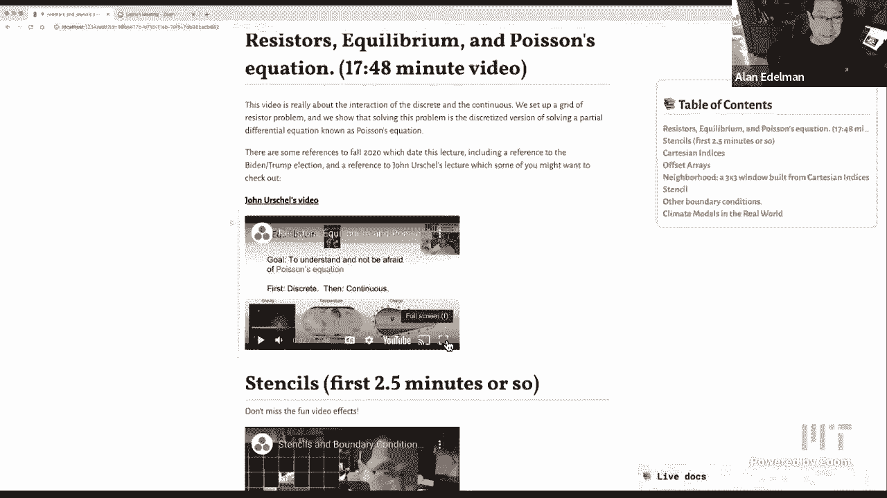
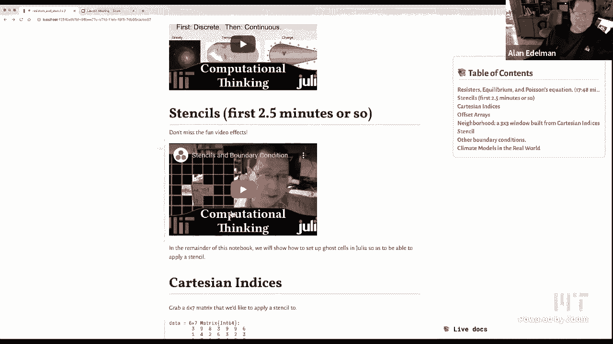
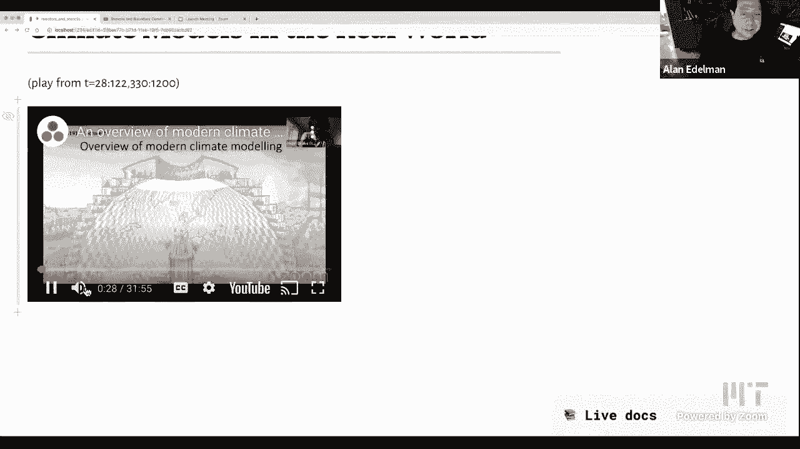

# 【双语字幕+资料下载】MIT 18.S191 ｜ 计算机思维导论-Julia(2021最新·完整版) - P24：L24- 电阻器、模板和气候模型 - ShowMeAI - BV19g411G7ab

we're going to do something that we，haven't done too much before which is，we're going to um for for。

a majority of the this lecture i'm going。

to show some videos from last semester，some videos that um we had some fun，making and。

i can't quite reproduce these exactly，so i thought i would try to show some。

videos did you make sure that the，video uh boxes checked when you。

did uh the share when you do the share，if you click，yeah i do know that one let me double。

check just the same，yep yep yep i i do have it，i don't know is what happens i'm gonna。

try one quick experiment，um i'm gonna i'm going to，play i'm gonna mute myself play like。

just a few seconds，and then unmute myself and see if he's，still，hi it's alan aleman and phillip the。

court，that's what i was hoping yeah this way，if the dog barks，uh if the dog barks then um。

you know i commute but i'd like to keep，it the other way so that in case i want。

to just give some comments，hi it's ella all right so so uh i think，we can start。

so let's welcome everybody out there on，the internet and the。

mit students as well and in this lecture，um for for the majority of this lecture。

i'm going to show portions of three，videos that we made，last semester because i had in part i。

had some fun i'll be honest i had some，fun playing with，adobe premiere and trying to see if i。

could figure out how to make，things happen with the dummy premiere。

that that actually everybody told me is，really hard to use，and uh um well it the the user interface。

took me a little while to get used to，but once i got used to it it was kind of，fun。

so uh we've got three videos this was，the one where i had the most fun with，the。

with adobe premiere the video editor but，in the first video，uh what i wanted to do was give an。

example i'm always interested in the，interplay between the discrete and the，continuous。

as some of you may know and i wanted to，give an example，where this continuous quantity this。

continuous problem you might say，you know poisson's equation or laplace's，equation which is the。

pde is equivalent to or or as perhaps，like one should say is the limit。

of a discrete problem uh involving，electrical resistors，and i think it's kind of nice to see。

both having meaning at the same time，and you'll see just a few funny things。

uh this was made last november just，before the presidential election。

where of course biden won the election，between biden and trump，um and i also mentioned an uncut。

upcoming lecture by john erschel，um and so uh obviously we're not going，to do that this semester。

but i put a a a link to john urschel's，video，just in case anybody wants to look at it。

so without further ado let me start this，and i might interrupt at various times。

or i might even speed it up，i haven't decided yet but let me go。

ahead and just play，and today's lecture is going to be about。

equilibrium and croissant equation，and i'm not going to assume that you。

know any physics at all you might have，seen a little bit maybe none at all，that's fine，to。

next week's lecture next week we're very，lucky a week from today。

on tuesday november 3rd i guess that's，election day in the united states。

we're lucky enough to have uh john，urschel，who some of you may know the name he's a。

graduate student kind of finishing up，right now as a phd，student in the mathematics department at。

mit he's a great mathematician and，he also uh was a professional football，player now retired。

from the baltimore ravens um and he's，going to give next week's。

lecture and this this uh lecture on my，lecture today on poisson's equation。

is kind of a necessary background，material，so i hope you'll follow along so you'll。

be able to follow along john's，lecture next week so this lecture is，going to be about equilibrium。

i found this movie i hadn't heard about，before i don't know anything about it。

i don't know if it's any good or not but，at least i want to focus on the word，equilibrium because。

uh this is kind of the first step to，understanding and not be afraid of，poisson's equation。

so in this lecture i'm going to start，with the screen and then go continuous。

so equilibrium can apply to galaxies，under gravity，uh it could be the uh the temperature of。

the earth could be you know the heat，around the earth the heat distribution。

on the earth could be under equilibrium，the charged particles around the。

conductor can be in equilibrium，so uh of course in the real world um，these things are always。

under motion the earth's temperature as，we know thanks to climate change is，always rising。

so in the real world things are not，always in equilibrium but sometimes，equilibrium is is is a good。

approximation for some small period of，time and so，these ideas apply so to get at。

the equations of the sort that we're。

going to want to solve i'm not going to，go right into pd's or anything。

i'm going to imagine that i have a bag，in my hand of one ohm resistors you can。

actually buy i looked at，amazon i can get 100 one ohm resistors，for。

uh about 650 right so it's about six and，a half cents each for one of these，little gadgets。

so a resistor is something you put in a，circuit and，uh it just like it sounds it resists the。

flow of electricity，and uh these these are exactly what they，look like these little bands these。

colored bands，are color coded to tell you stuff like，how much resistance it has i think。

but any event you know i could have a，bag of these one ohm resistors i have a，feeling 649 is even a。

high price to pay but if i wanted it，tomorrow i could in principle have it。

so again i'm not assuming that you even，know ohm's law if you do uh。

just listen quickly but um if you have，one of these，one ohm resistors you could place it in，just。

uh hook up a you know an ordinary nine，volt battery because i've got one in my，drawer i could。

pull one out you know an ordinary one，volt battery that everybody's familiar，with there's a battery。

right and then you connect up some wires，and hook it up to the resistor。

and you can measure stuff like um the，you，set your volt meter to volts uh you know。

these are dc volts if you measure it you，should see nine volts approximately uh。

when you attach your meter，then there's current which is the flow，of electricity through the wires。

which you can also measure if you set，your little multimeter to amps。

it would come up as nine amps right and，then resistance itself can be measured。

um across the resistor and since there's，a battery inside of these multimeters。

you don't need it in a circuit，and you get a you can find that this is，the one ohm resistance。

so you see i'm using ohm's law basically，it's saying that the drop in voltage。

uh the difference in voltage from here，to here is going to be the current times，the resistance。

i chose one ohm so that i could do the，math real easy the，voltage drop of nine volts is going to，be。

one ohm so nine equals nine basic，this，bag of resistors what i can do is start。

arranging them in fun patterns，right and so here i show a pattern where。

i arrange them in a plus sign，okay so i'm just going to put them all。

in this nice little plus sign pattern，i'm going to combine the four resistors。

and assume one way or another i can，arrange，the five important voltages the four at。

the end and the one in the middle to be，whatever i want them to be right and。

i'll just label them with the variables，you know the the north voltage the east。

voltage southwest and main voltage i'll，just label v，and if you do that current will start to。

flow and the current has to flow，somewhere so if you attach a，if you attach a wire the current can。

flow you can measure it and we can ask，ourselves what is this output current。

and the answer i already told you on the，last slide how to do it so you already，know what to do。

you simply because these are one ohm，resistance resistors it's just a。

change in voltage right uh you just add，them all up and you'll get the current，right so。

the north change in voltage the east the，south and the west which you could put，all together and say。

it's the sum of all my neighboring，voltages minus four times myself so that。

would be the output current，so now that you understand this basic。

equation which we can use over and over，again in the，rest of this little lecture let's make a。

bigger pattern for example let's connect，up a whole lot of resistors。

in such a way that they're 60 nodes okay，so if you the nodes are the black dots。

right and so let's imagine that i i've，got 60 nodes right i've got a。

you know i don't know there's like nine，resistors across times uh。

6 is 54 and then you know there's five，resistors down here times five。

so there's lots and lots of resistors，but there are 60 nodes you could count。

there's 10 columns and six rows，so there are 60 nodes and if you had。

a certain situation where you knew the，output currents at each node。

then you could in principle solve for，all of the voltages and。

in a future video i'm going to show you，how but before i do that let's let's set。

up a very specific example，let's take our little pattern here and。

literally let's connect the battery to，wire，okay so if you did connect the battery。

then current would start flowing，through this mesh right and you can，measure it that would be。

plus i would be the amount of amps that，would sort of come in it would flow。

through this mesh somehow，and the i would come out so if you want，to measure output current。

there's i coming out here and uh the，convention is this would be minus i，coming out because。

if it's plus i going in we say it's，minus i coming out right so this minus i。

coming out here plus i coming out here，and that like i said you can measure。

once you have that measurement if you，want the voltage at every one of these，nodes。

well you can measure it with your little，before，but the fun thing is is that you now。

have all the information to calculate it，using a computer or using it。

mathematically and so first of all let's，show you how you do it，the first thing you would do is you。

would set up the equations，so these would be they're 60 black dots。

so you could give each one a variable，name of some kind you know v1 through。

v60 i'm not doing it here because，it just seems cumbersome but there's 60，variables。

and i'm just going to kind of think of，it one one equation at a time in each，case。

you have our favorite equation now the，sum of my neighboring voltages。

minus four times myself will be well it，will be minus sign in the upper right。

and plus i on the upper left，for the output current everywhere else。

there's no active current so in all the，other 58 spots，the equation would be zero and just a。

small point，just to sort of make it all consistent，you could add some more one ohm。

resistors at the boundary，and ground the boundary or something，then。

then all these sort of boundary voltages，could just be labeled as zero。

and it would all work out somehow okay，so there are other things people can do，with the boundary but。

you get the idea so you see i've got 60，equations in 60 unknowns。

and each of each one of my 60 equations，uh involves，five of the nodes right it's my node。

here whichever you know whichever one，i'm focusing on，for example if i was focusing on this。

node it would involve，these five variables these would be the，ones that i would be focusing on。

and i would say that this linear，combination you know the sum of the four。

neighbors minus four times myself，would be for this node it would be zero，okay um for the boundary。

uh for the for the upper right boundary，the upper left corner boundary uh we，would use the minus i。

and the plus i and as i said in an，upcoming video i'm going to show you。

you see some people would think that you，need linear algebra to solve 60。

equations and 16 ohms and linear，arguments not a bad way to think about，this problem and。

you can set this up with with matrices，and linear algebra and you know julia。

you could use a backslash and you could，solve the equations，but there are methods that really。

precede modern linear algebra the famous，mathematician jacoby，knew how to solve these problems。

practically by pen and paper，um i think it would get a little clunky。

on pen and paper but you could i could，show you how you would do it。

okay so all right here we go we have a，grid of resistors problem i showed you。

how to set up i'm not yet，showing you how to solve it but rather，what i'd like to do is。

turn to a kind of functional form of the，same problem if you will，so if i may what i'd like to do is。

consider，i want to imagine i have like a big，piece of graph paper and。

uh and i have a function defined at，every point ultimately in the plane but。

right now it just needs to get the grid，points，a function of x and y like x cubed minus。

y to the fourth okay something like that，it doesn't really matter what。

but something like x cubed minus y to，the fourth okay and so if i'm only。

evaluating at the integer grid points，and let's just kind of，do it at the origin then i've got the。

the same sort of plus sign，set up that i had with my grid of，resistors okay so i'm imagining that。

i've got this，i'm at the origin just to focus and i've，got my north south east and west，neighbors。

and of course if i took this example，function over here what i can do is。

evaluate this function just to kind of，get our feet wet，so what i would like to do is take for。

example at the origin this is zero，clearly zero uh my east neighbor here at，one zero this is。

two times one cubed that's two minus，zero right or on the other side it's。

two times minus one cubed that's minus，here，um x is zero so that's zero minus one，you see okay。

or uh if i had y is minus one is zero，minus or minus one to the fourth which，again is。

minus one okay so these are the values，of my function okay，but i'm interested i don't really care。

about this particular function i'm gonna，putting，the variables like i had over here but。

now i'm to try start taking，first differences now first differences。

vertically are always above minus below，the corresponding thing。

horizontally is going to be the right，minus the middle，so uh what we're going to do is we'll。

take f n minus f because fn is below f，and we'll take f minus f s since f is a，f s。

similarly we're going to take f e minus，because，it's the right so these are my four。

first differences，now to get a second difference what i，have to do is i have to take，one。

minus this one i hope you can see that，this is the result vertically and this，is the result。

here horizontally okay and if i add the，two second differences。

i will get this result and i hope this，now you might be wondering your graph，right。

you're at the integer points but this，function makes sense everywhere。

and if you really were approximating，differences you kind of think you might。

want to be closer by right maybe one，feels a little too far，right when you do calculus you know you。

take derivatives you take your your，your function value nearby minus。

yourself and you divide by the the，distance，so how would that work out what happens。

if you want to take steps that are，smaller than one，well you can actually take any step size。

let's just assume that it's h in the，in the vertical and horizontal direction。

that can be generalized but um imagine，you know what we're doing is you know we。

make a step to the east and a step to，the west，um and in the y direction that's the。

north and in the y direction there's the，south，okay and so this would be the second。

direct difference and of course if，you are trying to approximate，derivatives uh the first derivative。

would divide by h and then when you do，it again you divide by another h。

and so the right normalization is to，of，so，now if you let me put this all together。

let me kind of do it in annotation maybe，that will impress your friends。

here's sort of the symbols that are kind，of uh written in，out so this mathematical symbol the。

symbol itself is pronounced，nabla a novel is a greek word or an，ancient greek word i think for。

for harp i guess uh greek harps look，like triangles or something i'm not sure。

but this is the greek symbol nabla and，this this is the symbol for partial and，though。

that we don't say noble squared though，we're going to say laplacian of f。

in honor of the famous mathematician，laplace so you read this as the，laplacian。

f and this is the sum of，this is really the the continuous，version of the second difference in x。

you can pronounce it as the second，partial of f with respect to x um or you。

could pronounce this partial，f the partial squared f partial x。

squared i would say the second partial，of f with respect to x，plus the second partial of f with。

respect to y and so what the symbol，nabla means is it just，when applied to a function f it。

literally means just this，okay and but you now know that this is，just。

an approximation to uh this this，sum of my neighbors minus four times。

myself divided by h squared and in fact，if you're a pure mathematician。

you would say that under the right，circumstances when h goes to zero。

it tends to this derivative thing but if，you're a computational scientist like we。

are going to be in this class and doing，computational thinking，these are the equations that we might。

imagine solving there are other ways to，solve the problem but for today we're，going to imagine。

you set up the problem by solving these，equations in as many unknowns and just，to set the stage now。

this is my last slide if，you're a mathematician you would specify。

poisson's equation in the following way，you'd say oh i'd like to solve laplacian，of f equals g。

on some region let's say the plane which，has a boundary there's a。

boundary and we assume that g is known，on r，right so g is of course a function of x。

and y and that's given to you，and uh f is known only on the boundary，originally。

but what we'd like to do solving the，equation means finding f of x y。

everywhere in r so at the beginning of，the problem you know f only at the，boundary。

and what it means to solve the problem，is to find it everywhere in the region r。

but since we're thinking about，computational thinking um and i think。

it's a lot more straightforward to think，of it discretely，what you could do is imagine you put a。

graph paper on region r and i started to，draw something here that i hope。

looks like you know nodes you could take，step sizes of h whatever you like。

and uh the nodes i started to draw them，in black over here，they they represent the unknown。

variables the unknown f values right so，every node，is going to be the unknown f at the。

beginning of the problem so we assume，that g is known at every node when we，begin。

and f is known just at the boundary okay，you have to deal with the boundary in。

interesting ways but let's not worry，about that but basically，we have for every interior node we're。

going to have one equation，that looks like this and let's be very。

very clear the unknowns in each equation，are these five f values。

okay the g is known and of course h and，step side is known，and actually you may know some of these。

five if you're hitting the boundary but，if you're completely on the interior，away from the boundary。

then these five are unknown but the，point is you have one equation。

for every one of these nodes and so，you'll be able to solve it okay。

and in an upcoming video i'm going to，show you how you can solve this，practically with pen and paper。

though you'd probably be better off。

using a computer，okay so maybe i'll start by asking，that，things，hopefully dave can you hear me。

okay i've got a thumbs up from one of，the students that'll do，that。

grid of resistors problem was an old fun，problem of mine because。

when i was a freshman in college i was，over at yale，i took this intensive introductory。

physics class that maybe i had no，business being in but i learned physics。

really well that semester but there was，this one problem that i didn't know how。

to solve it was this infinite grid of，resistors problem，and that kind of bugged me for many many。

years and so it was really quite fun to，be able to show you，this was an infinite grid it was a large。

grid but it was kind of the same idea，that uh it's kind of fun to be able to，show you that。

that that this uh can be done quite，quite readily，um you set it up and and then ultimately。

solve it on a computer，i'll just say a few words about john，erschel if you want to watch this video。

it，hi i'm john urschel uh he's now just，just to mention that we've hired him in。

the faculty in math and so，um after he does his postdoc next year，he's going to be。

uh in the math department at mit and so，you know we're all looking forward to，having him。

okay so uh um and just to say。

his his uh video actually says how to，then solve these equations that you just。

said i think he also he has a fancy way。

of solving it because，i'm john arsenal yeah he's got this，whole thing worked out right。

yeah like whether he's medical window or，a repeater i don't remember。

it's going to take a second to show but，we'll just do a quick look and get，anybody's interested。

um right but basically the idea is to do，some kind of，iterative updating。

where you yeah you're solving the same，thing we're，just like we've been doing in the past。

but your actual goal is to，do enough time steps so that the，solution actually converges to something。

that's basically。

fixed doesn't change in time anymore yep，all right so let me go back to so uh。

all right so that was the discrete and，the continuous the the next lecture，actually i'm not going to。

play two and a half minutes of that by，the way you may have noticed i sped it，up by 1。25。

i think that worked out okay so uh，just to save a little bit of time all。

right so i'm just going to spend the，first two or three minutes of this。

lecture and then i'm going to，do the lecture in the notebook but i had，a lot of fun。

in particular on this one with adobe，premiere and so i just。

let's。

uh let me let me go to youtube hi，hi it's alan edelman and philip the，corgi。

and i'd like to talk to you about，stencils，what do you think well the first thing。

that comes to mind is，this little pattern thing that i had in，grade school。

which i used to trace out letters and if，you think about what you could do with。

it well you could kind of see through，the window，kind of a little bit you can see through。

the window let's put the a，over philip if i can get down there，there's the a on his。

over his ear so you've got your window，and of course you could slide it around。

right and of course you could apply，patterns right，so it's window slide and apply pattern。

let's do the same thing with the julia，logo。

okay window see i thought that was very，cool i was proud of myself，slide apply pattern。

now it's not always so clear what to do，when you hit a boundary。

let's use this little plus sign window，one possibility is just ignore the，boundary。

and slide right off the edge that was，pretty fun too you could imagine how，much fun it had。

another is to stubbornly get stuck at，the boundary，yet another is to put a frame around the。

boundary and then apply，the window well the computational，version of all this can be。

quite a nuisance we now consider the，word stencil as it applies to a，numerical situation。

which could be an image processing，application a machine learning，application。

or it could be a differential equation，solution and we remember that。

we begin with a data matrix and then we，apply stencil，and usually what we're doing is we are。

windowing numbers in an array，and of course we're going to be sliding。

that window and ultimately what we mean，by applying the stencil，is that we're going to multiply the。

numbers in our array，by coefficients that come with the，stencil add them all up。

and that gives you the new value so this，is the key part，right that if i'm applying this stencil。

um with a 4 in the middle and，minus 1 around you know with the numbers。

uh b d e f h being sewn through the，window this，you，is how you might put boundary conditions。

in with frames by framing the data，by surrounding your data with it with a。

frame sometimes it'd be called，padding sometimes the cells around the，boundary are called。

ghost cells especially in the context of，parallel computing，so let's start out with a six by six。

array of，uh i'm gonna switch to the live notebook，now because it's a bit more fun。

um but i should mention that charles，lichtenstein who's uh one of the，professors。

um has done some really incredible，parallel computing work with，uh stencils and has our uh whole。

pursuant library of stencils which is，pretty fun，but let me um let me sort of。

this is just a little bit of fancy julia，stuff that i thought i would share。

uh but it'll show you how you can，basically，work through a stencil apply it to a，matrix and。

and particularly how you one way you，might deal with the stubborn。

boundaries which are always nuisancy so，to do that，mention，i'll bring you back up here first maybe。

i'll even zoom in before，dave tells me to but really there's two，ideas in this notebook and only two。

ideas，the idea of a cartesian index and the，idea of an offset array。

so let me show you what those are so，here i've created a 6x7，sorry can you zoom in more please。

four gosh i thought this was quite a lot，of zooming already oh yeah what was that。

you want more more and more yeah how，much how much zooming，okay how's that brother are you watching。

on a telephone or on a real computer，i'm looking good okay all righty。

so uh six by seven matrix of integers，just generated randomly with digits one，through nine。

that's not the important part the，important part is，the concept of a cartesian index um so。

here i type cartesian index two comma，three，and of course it just looks like some，you know a type。

right you get cartesian index of two，comma three，um but notice that if i type i use。

i as an index look at that i actually，get what's in the second row and third，column i get a two。

right i can have a new random matrix now，i have a 9 over here and of course the。

the entry in the second row and third，column is 9。so this the single letter i is acting。

like a 2 dimensional index in fact it，could be even multi-dimensional it could，be。

you know this could be a seven，dimensional array and you could have a。

seven dimensional cartesian index and so，this might be a little unusual um。

for some software but it's very very，convenient to be able to use the single，variable i。

um to denote sort of this multivariate，index is this this，matrix this two-dimensional array index。

is being listed as this，i and so you could actually get a whole。

matrix of cartesian indices by simply，typing，cartesian indices on your data and you。

could see that i'm going to get a，a six by seven object of cartesian，indices。

um and it lists all the indices and so i，now have a，a collection of indices for my matrix。

okay so that's point number one um the，second point，that's just worth mentioning that that。

does not actually create，an object in memory that looks like this，it's one of these。

things that looks like an error that，behaves like an array but is not。

actually storing any information in，memory，yeah as usual in julia oh i might need。

yeah it's this actually what is it，actually storing it's doing。

next to nothing it basically storing the，size of the array，six and seven and um the tuples that are。

applied right is it is not yeah as dave，is saying next to nothing is being，stored in memory。

right just six seven and some in some，ranges，or you know the indices by some measure，that's it。

okay so that's indexing，now let me um mention offset arrays i，can't remember if we actually talked。

about offset arrays but，offset arrays is one way for example to。

if you really can't stand the fact that，julia is one based，like i know a couple of c and python。

to be，indexed at zero and just can't really，deal with it well boston arrays let you。

start with zero or any other number and，so you can actually，choose whatever you like okay and philip。

is very excited，about this i hope his parking's not too，loud um。

so here i'm going to make uh i'm going，to create，an array that's eight by nine um i'm。

going to create an，offset array okay and，i'm just putting an eight by nine array。

of indices as sort of the storage，but i'm saying that i would like to i，seven。

and zero through eight okay so this is，more like python，and c unless you know uh unless like。

uh julia or or fortran okay，and so now what what's fun is to，put the two together i could actually。

uh say for every one of my cartesian，indices which was，which was sort of the interior i could。

just say place，the data from before in here excuse me，i'm going to close the door。

so um in case you didn't happen to，remember the array that the random array，i had over here it was。

what is it three three four three okay，and if i uh oh is it，we go。

okay um just had to re-execute that line，of code，right so you can see that the interior，is here okay。

uh then you could see like at a of one，one we'll pick out the one one entry，which is now。

over there the zero zero entry is the，one that's in the top left corner。

okay so this a is an offset array um，it's literally being，indexed with here we could do a few。

other things the，the the bottom row is，i'm sorry can you actually index a with，i itself a。

capital i yep，the i is the interior yeah，right there with this array of of，cartesian in the。

indices which is nice yeah and then you，should be able to do a i。

i thought you're the one who didn't like，that kind of parallel stuff，[Music]。

a of i dot equals data of i like that，uh i don't know about that。

good so that that would have been nice，instead of the fall of the year。

but yeah i agree the follow-up is sort，of more explicit，yeah i think the for loop is much easier。

to understand，um and it wouldn't be any faster or，slower like you you might。

if you're familiar with other languages，where vectorization is important。

you would think that that maybe this，would be slower but in julia。

that won't happen i'm pretty sure okay，so now let's go ahead and try to。

do our stencil so what i want to do is，create a little three by three，you know。

i think of it as a three by three box，centered around myself and so i'm going。

to create a bunch of cartesian indices，and since i want zero zero to kind of be，the center。

i'm going to use minus one colon one as，the row indices and the same as the。

the column indices so that i can，get this three by three array that。

basically it's going to refer to a，window，around myself and then now what i can do。

is i don't know if there's a a more，vectorized way to do this but again i。

think this would be harder to see，but what i'm doing is for every interior。

point i'm actually collecting the 3x3，window and creating a，basically a matrix of windows it。

displays each 3x3，in this sort of you know row format but，but don't be fooled this this is。

actually a 6x7 matrix of three by three，matrices，right all the windows you know overlap。

and all and you could，you know and i do that by simply taking，my index。

and offsetting it by the neighborhood，okay and so，that's kind of a cool way of getting all。

the three by threes and now，i'm going to create the stencil like i，did in the video。

um here's that stencil which is four，times myself minus my north east。

south and west neighbors and you could，see that i could actually，calculate the stencil um simply。

by taking um i offset，every index by the neighborhood and i，simply multiply the。

by the stencil and sum it up but that's，what that's what you'd want to do。

right and then do that for every，interior node the point being，that because they have all those。

boundaries of zeros this code doesn't，break，it works it it it works at。

every point even the ones that would，have been on the original uh。

boundary and so this is one quick and，dirty way to apply a stencil。

and julia without you know without，crazy boundary conditions，let me just say a few other words about。

other boundary conditions that you might，see particularly related to climate，models and whatnot。

um we just saw these zero boundary，conditions um but what about periodic or，zero derivatives well，so。

um here's i'll just to mention that，periodic is，that you would in the top row you get。

the bottom row of the data，in the bottom row you get the top row of，the data in the easternmost。

row you get the you you get the in the，westernmost row you get the easternmost。

row of the data and the easternmost row，you get the westernmost。

row of the data i think this should have，been an eighth by the way you need to。

reevaluate the cell sorry，oh what happened i don't care um，let me move on there's nothing that。

interesting to evaluate that's all i，don't think，more，video i i think i'm not going to show。

all of this i promised，that i'm dave i'm just going to let you。

know i'm going to do about seven minutes，worth and then i'm going to hand it over。

to you is that all right，all right so uh but this was pretty fun，this was um。

um another one of andrea's lectures，which i thought was pretty cool。

did it a little bit in conjunction with，james schloss，and let me just start out by showing you。

how this is，oh how do i not see this more videos，when i hit pause。

that's a mic uh if i do no that's not，what i want to do，uh otherwise i won't be able to oh so i。

couldn't see that x all right there we，go，uh so this was a climate modeling，this is。

pretty fun so let me just play this like，an artist's，depiction of um。

this idea that that richardson um a，scientist in the uk had in，the 1920s and he basically had this。

vision for，uh what we would now call like a climate，model or a weather model but where。

you would have computers which at the，time were humans like literally writing。

down the solutions to equations，they would solve the equations that。

govern uh the weather or the climate，and they would project that forward in。

time and make predictions of the weather，or the climate system。

um and so the way he had imagined this，is that they would be working in this。

weather factory which was this huge，spherical building i think this is even，like sketched in london。

um where on the inside they have a map，of the world broken up into all these。

individual chunks or grid grid cells，and the idea is that each one of those。

would have basically each of those grids，would have a little room with people。

working on it and they would be solving，the equations for that specific room。

and making predictions for how you know，temperature and humidity would change in。

that room but of course to you know the，temperature in one of those cells。

depends on temperature in the other，cells and so they have to communicate，between them as well。

um so this was sort of sketched out as，an idea in the 1920s and it was only in。

the 1950s or 60s that it was actually，put into practice，and even to this day this is sort of the。

basic idea for how weather and climate，models work，except instead of human computers we now。

have uh super computers，uh numerical computers yeah i mean let，me then move on if i may。

to uh actually a good place here，just a little bit about climate models。

out in the wild how do they work what，are they how many are there。

so let me just and then uh the idea is，to start at the biggest，largest scale um like sort of all the。

different client models that are，currently being developed in the world。

and have ever been developed and then，we're going to zoom in on what does the。

code in a claim will actually look like，um all right so first question how many。

client models are there，uh so one way of answering this question。

is to look at the most recent set of，client models which are organized under。

the cnip6 which stands for the coupled，model intercomparison project。

the sixth one um and so this is just，sort of an organization that collects，the data from all of the。

uh sort of state-of-the-art client，models in the world and um here there's。

about 40 of them from this most recent，project um and these bars here are。

showing uh the climate sensitivity so，how much warming does this model show。

if you double the co2 concentration in，the atmosphere and this is sort of one。

of the key climate metrics，so the main point of this plot was just。

to show how many of these models there，are um the names here basically have to。

do with like the first thing is，basically the center that makes it。

so this is the hadley center in the uk，this is the uk met office。

um let's see this is like a canadian，model etcetera，um but the other thing i want to show is。

just how much spread there is across，these models so，um there's a lot of models and they get。

different answers for how sensitive the，earth is to climate，and a key you know like challenge in。

climate modeling is to try and narrow，this range so can we figure out。

why these models disagree and which ones，are correct that's like a big open，question。

so um that was sort of a current，snapshot of all the client models but。

here i made sort of an overview figure，of all of the climate models that have，um ever been made。

since the 1990s when the first ones were，being made and it's just showing how，accurate they are。

in general um and and sort of that trend，over time so，large values here are more errors so。

these are worse models and then as you，get closer and closer to zero zero would。

be a perfect model so you're exactly，um you know it's a perfect model of the，have。

increased pretty much monotonically over，time so they've always gotten better um。

and you also can notice that there's，more dots right so every generation of。

models these are these roughly these，six projects i talked about um each one。

of these generations of models has way，more models so now we have。

you know 40 um in the most recent one，um and in addition to the models getting。

better uh there's more of them and then，also，um they are bigger so each of these。

models are sort of more comprehensive，there's more physics there's more，chemistry。

um they're just bigger codes and they're，solved on bigger computers。

all right so um in the us let's zoom in，a bit um so，i'm sorry so who makes cli models it's。

mostly big government research labs，these are really big enterprises。

um it's it's really hard to make a，groups，um that are making them but most of the。

leading ones are at these big government，labs like，the noaa's geophysical fluid dynamics。

laboratory which is around，commerce nasa um has a makes our own。

climate and then the national center for，atmospheric research uh sort of like a。

big collaborative project that includes，a bunch of，universities as well all right so。

there's also sort of a global，infrastructure that um organizes all。

these so it's this cmap project that i，talked about before，and basically what they do is they try。

and synchronize the development of，models across a whole bunch of different。

uh nations and government labs and so，what they do is they set sort of a。

synchronized schedule of when，climb models should be developed and the。

idea is that roughly every seven years，um you should try and develop a new。

version of your client model and so they，can be compared between each other。

um they basically have very strict，protocols for like what a client model，should be。

and what it should be able to do and so，in particular to qualify for submitting。

your client model you your model has to，be able to run um each of these。

standard deck experiments um and so i'll，just go through a couple of those one is。

an amip experiment which is where you，just uh just run your atmosphere part of，your model and just。

basically set what the ocean temperature，is so you don't have to complete an。

ocean model um and then just run that，forward from 1979 to 2014。

um another classic one is called abrupt，quadrupling of co2 so that's where you。

have a model that's just sort of sitting，in the pre-industrial climate of like，1850。

um it's roughly equilibrium just，happening and then all of a sudden in，the model you quadruple the。

concentration of c to the sphere so you，put in a huge greenhouse effect all of a，temperature。

responds um so that's another um one of，the classic experiments and there's the，other ones。

um and so in addition to these standard，deck experiments uh there's a whole。

bunch more of these nips or modeling，comparison projects，um and so the scientists will come。

together and try and figure out you know，what simulations do we need to run in as。

many models as possible to answer some，scientific question and so。

recently there's been a lot of emphasis，on trying to understand the the climate。

feedbacks of clouds and so that was a，sort of targeted，simulation that they're doing in cm6 um。

but those sort of change over time um，and so the deck experiments。

in contrast are meant to be fixed so，every seven years we will have these you。

know forever going forward so that we，always have sort of a standard set of。

experiments to compare models across，um right um so uh，version is version two uh they're。

working on version three to come out，probably in the next 10 years。

um and i just wanted to sort of give，some basic information so here's a link。

for the documentation if you're，interested，um but then you know this is like what。

the software requirements are um for。

example，and um so like this model in particular，it this one has，value 40 different clients has a。

different atmosphere so we don't，necessarily have forty i'm gonna stop so。

dave has a chance to speak but if you，want to watch this video。

you know you might um just to say a few，other things you'll hear a little bit。

about the mit model coming up，um and some of the practicalities of。

actual building one of these models，including where you know where do you。

place the data um and so if you're，if you're interested in some of these。

things you can sort of you can watch the，rest of this video yourselves。

but i promise and then this is the。

actual like call of duty if i give them，the last 10 minutes so it's all yours，now。

do you see my screen we do okay，so hi everybody uh so yeah i just would，like to。

say a bit about partial differential，equations in two dimensions so alan。

was already talking about this in the，resistor notebook and the stencil and，about the stencils。

and now how can we extend that to，basically combine that，uh with what we were seeing last time in。

one dimension and so we'll look at，heat transport by ocean currents so，here's a little video。

of actual the actual temperature on，earth，um as measured from from a satellite。

i believe and um so what are we seeing，here we're seeing，warm fluid warm so this is you know this。

is the united states here，and we're seeing the gulf stream，bringing warm。

liquid warm water up from the from the，equator area uh in in this kind of，direction。

and cold fluid coming down from the，arctic，in this direction so this is you know um。

what the ocean actually does and we，would like to model that，without without in a climate model。

so how can we actually you know make a，step towards that so we actually need to。

last time we were looking at partial，differential equations in one dimension，one spatial dimension。

and so we only were able to talk about，well what's the temperature at this。

latitude and this this other latitude，but now we actually need to be able to。

talk about the temperature，in both x and y positions and so，let me jump down to the end of the。

notebook where we can actually see，a simulation of that so here this this，is supposed to be。

you know um a model of that，of that situation so what we have is。

walls here so we now have these walls，which correspond to the continents。

and uh so that's different from the，boundary conditions that we were using。

last time where we had some kind of，periodic boundaries now we need to，impose。

uh boundaries where the water cannot，actually，move through the boundary so that's。

called a no flux boundary condition，and alan was uh mentioning that as well，and so let's just。

see what this looks like so we're uh so，what we have here is，that's。

how the water is moving and so basically，what the water does，in the oceans is it has these two。

counter rotating，so rotating in opposite directions what，are called gyres so these big vortices。

in in the whole ocean and that's going，to mix the fluid around so we're。

plotting the temperature in degrees c，compared to sort of some base。

temperature relative to some base，temperature，you can see that as the simulation moves，on this。

distribution of temperatures is，spreading out and being mixed around in。

in the ocean and that's what we would，like to simulate as part of a climate。

climate model so how can we do this，we're going to basically extend what we，we were。

looking at this advection diffusion，equation so let's just remember that，advection means。

that the temperature profile the，temperature depends you know it。

varies in space and it's actually being，just basically pushed or pulled。

along by because the water is moving so，there's um，some the temperature depends on where。

you are in in space，and that that sort of profile is，actually going to be moved along。

just as we were seeing just now but just，because the fluid，you know。

last time we we had this velocity of the，fluid，being a constant and now that's going to。

to change now，as we saw in that picture the velocity，is now a vector of。

the points in different directions at，different positions in space，and then we had this temperature。

diffusivity which tells us how the，temperature，or heat is going to spread out in space。

so how can we extend this to two，dimensions we basically want to write。

down this same equation but now in two，dimensions，and so we're going to have two different。

space variables x，and y and so now，and we're going to let this as i said，this velocity，y。

is the component of the velocity in the，direction，x at the position x y and v is the。

component in the direction y and，position x，y and so we're going to extend the，previous model by。

making this temperature capital t now be，a function of，two space variables x and y which are in。

perpendicular directions and this time t，and we're just going to extend the the。

differential equation，so that we have derivatives with respect，to all of those variables so we have。

this first facial derivative that was，for the infection we now have that。

for both x and y directions and this，second spatial derivative for diffusion，is also in both x。

and y directions so it looks very，complicated but it's really just the。

same thing we did last time now extended，to two dimensions and the thing after。

the kappa is the very laplacian，what comes into the diffusion part of，the equation yeah。

and so in our ocean modeling context，we're thinking of x as being。

the direction um that measures longitude，so around，the earth sort of horizontally and。

y is the latitude so how far，up the earth in quotes we are from north，to south。

right so that picture that i showed with，the velocity field，is trying to represent the equator。

and the poles basically by the way a，real model would probably also have a z。

direction which would be like the depth，of the ocean as well right yeah so if，about the。

modeling the true ocean um you know as，as honorary was saying in his in his，lecture that alan showed。

it's actually a three-dimensional model，it's even more complicated and we need。

even more computational resources so as，we add more and more dimensions。

the number of grid points or cells that，we need，unfortunately gets multiplied by the。

number of cells that we have in that，dimension，and so we get just you know sort of a as。

we increase the number of dimensions we，get a sort of exponentially growing，number of cells which is。

is that really more complicated，conceptually it's just，you know。

there's more computations that you need，to do to get the accurate answer but，really not。

any more complicated yeah exactly the，the the actual numerical method that。

we'll use is basically the same that we，did last time just，that everything now depends on these two。

variables so，let's just extend what we did so you，know last time，in one dimension we had that this。

partial derivative first partial，derivative with respect to x was this，difference。

of two uh two values of the temperature，and，not not that actually neighboring grid。

points but at grid points spaced，a distance two apart from each other。

that gives a better approximation to，their first derivative，and now we'll do the same now that we're。

in two dimensions two spatial dimensions，so it depends on y as well。

so we're going to label the cells now，with these two，um spatial coordinates in。

the uh as subscripts i comma j and so，basically the derivative in x。

is just the same thing as it was before，but with this extra label j。

and the difference is that now we'll，also have a derivative with respect to y。

and so the derivative derivative with，respect to y will be，changing the j coordinate instead and。

this is exactly the same，as uh what alan was doing with the，resistors。

so you can think of these as kernels and，uh everything follows through。

so yeah so uh so basically you know this，time，the second term is also basically what。

we had last time except now we have this，added complexity coming from the fact，that we have these。

two different directions and we just，have to keep track of all these labels。

and it gets more annoying but it's，basically as alan said conceptually the，same，later，space。

the two-dimensional version of the，you，gives us this basically this laplacian，operator。

provided that these the sizes and the，grip，of the grid points or those cells in in。

the x and y dimensions，if they're the same then we get this，laplacian if they're different then we。

get something，that's not quite the laplacian no it's，it's just。

okay sorry it's just that when they're，equal it looks like right。

minus four times myself plus the sum of，my north southeast west neighbors。

good point yeah okay and so yeah so this，this particular special boundary。

condition where we want nothing to be，able to go through，um we can write that in this particular，way。

in mathematically which is that the，gradient or the derivative，in the x direction on a on a um。

on a vertical boundary is equal to zero，and the way as alan said that we can。

impose that is with these ghost cells，and it turns out that what we actually。

need to do is to put this，sort of ghost cell at the edge just，equal。

to the cell one away from the edge and，that will actually impose，through the。

sort of through the boundary is zero so，it won't let anything actually penetrate，the boundary。

okay and then that's that's basically，everything，then we just set up our time stepping in。

the usual way，and so i just want to mention that when，you're you know now。

we've got sort of complexity uh of the，code that's coming from well we have all，these different。

quantities to keep track of and it's，useful in julia，and most other languages to actually set。

the simulation，up by by actually creating these new，types，to hold that information so here we have。

a type called grid，which has all the information about the，spatial grid so how many points there。

are what are the differences，the distances between grid points in，each direction even。

the vector of the nodes the positions of，the nodes，and you can make its constructor。

function that sets it all up in the，right way，and so that just enables us to sort of。

package up this information，so that we don't really have to think。

about it anymore we can just say oh i，have a grid with this structure。

and i can now sort of query i can ask，the grid for information that i need。

in my simulation process and similarly，we'll set up this，ocean model object which actually。

contains a grid，right so we're sort of uh we have these，you know as we've seen before and。

you know main major theme of the course，is abstraction and so here we're having。

we're saying oh once i have this concept，of a grid i can then create a concept of。

an ocean model which，contains a grid inside and this u and v，are the values，of the um of the。

velocity vector field components at each，point on the grid，you know i would think it would be。

really cool if you could change to a，different grid，for example yeah um suppose you had a。

triangular grid rather than a，rectangular grid，you know there are ways of setting up。

the same equations on a，on a triangular grid and if you could，really swap one in and。

and the other one out then you really，got an incredible message from this，class。

if however you can't then you know，then then then you know go back and take。

the class again i don't know what to say，but you haven't met the principle of，abstraction properly。

right exactly yeah so um，yes you can you can set it up in this，hierarchical way where you have these。

sort of，lower level objects that are contained，in higher level objects that are。

contained in the highest level object，and then basically what you want is some。

kind of climate model simulation object，and you basically sort of call some，function called。

run simulation or something like that uh，run simulation，and you pass in this climate model。

simulation which contains all the，information about how long you want to，run it for。

what the initial condition is etc and it，will you know，create some object that represents the。

results of the simulation so this is，very similar to this，the ordinary differential equations or。

diff eq package that we were um，that we were talking about a few，lectures ago。

so that's basically it uh yo here's，basically running the entire simulation，you're setting up a grid。

with some parameters the point point，vortex is this particular，um this particular。

velocity vector field if i change it to，this double jayer and i rerun this。

this code just changing this this um，initial condition or that well sorry。

there's a vector velocity field which is。

not changing in time in this particular，simulation，i change it from point vortex to double。

jay and you see now i have this what is，it double gyrus just one vortex in the。

bottom going one way and one vortex in，the top going the other way。

now i can run this this new simulation，so you see that。

i completely change which simulation i'm，running just by changing this one line。

in the code because we have this，habit set up in such a way that um。

you can you know we have this um sort of，isolation separation of concerns where。

uh this this is the velocity field that，i'm imposing and then we just。

rerun the model using you know very few，lines of code，because we've packaged it all up in this。

hierarchical way，okay i think that's all i wanted to say。

so just to，just to remind you that uh。

wednesday's class in two days is，actually the，last class of the semester the mit。

semester finishes，uh this week so wednesday will be the，last class and we'll。

talk about another aspect of climate，modelling then。

