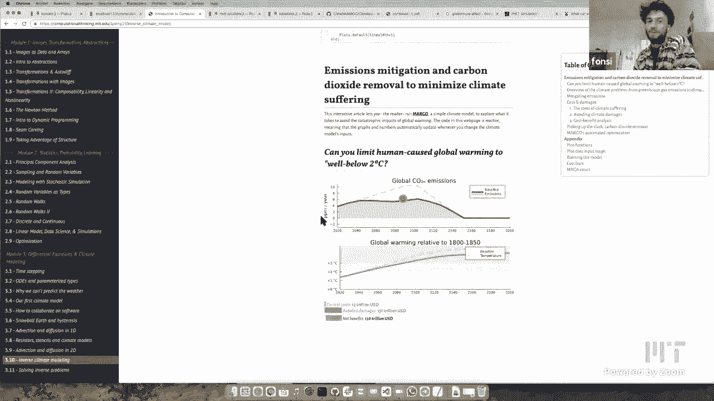
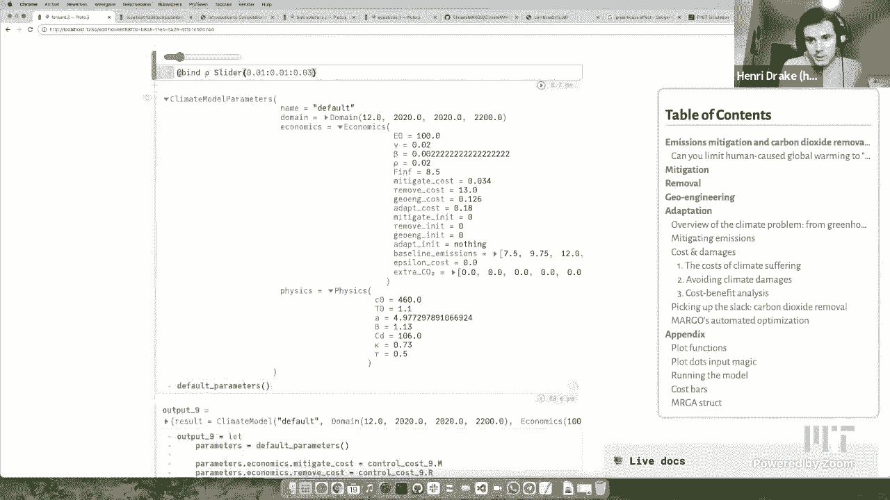

# 【双语字幕+资料下载】MIT 18.S191 ｜ 计算机思维导论-Julia(2021最新·完整版) - P25：L25- 气候变化建模 - ShowMeAI - BV19g411G7ab

Oh I think plugs wanted to introduce on Race LOL，Okay I'll introduce you by saying that。

This is the last，Of this course for this semester，Thanks everybody for participating and。

Let us know your feedback，Okay with you，I was going to say some closing words at the end so。

Go ahead and let funds，Thanks Alan my name is phones。

Welcome back the last section of conflation of thinking，It's actually about。

Climate model gold Margo and Omri is the main office and we have to stop them here with us today。

Answer questions，Only maybe you can save it，We are why you made it by tomorrow，Broccoli。

Notebooks that we used in the last several lectures I want to put them a little bit but。

No it's is 99。9% anri's work，So some of you have watched the previous lectures。

So I'm things are going for the instructions if your PhD student in Earth atmosphere to planetary Sciences NYC。

And most of my work is on with more traditional，Physical climate modelling。

A lot of the basics of that but we're docking I like the more sophisticated large-scale，Sacraments。

High performance Computing models，Side project with with Alan then and chondroitin。

Invest in a few other people including pawns we've been working on this。

Getting a new model that is is disorder，Boiling down the essentials of the climate problem and what I mean by that is not just the physical climate which I usually work on。

Also that the economics and the behavioral aspects of responding to the problem。

I'm into that why we created Margo which stands for mitigation and adaptation。

Removal geoengineering optimization，And so it was a receipt example of it today。

But it it's really the idea was this，Boil down all the essentials into one small。

Interpretable model that was open-sourcing that's never really been done there's some clothes horse things that are almost。

Similar，John Anderson open-source things there，Too complicated to release，Useful information。

Yes I think，That's really important lasting there， set the Dismal is quite simple in fact it's so simple that I feel like。

Explain part of it today during electric which is，Which is greater。

Second part of it is it's all written in Julian，And we've been riding it。

If you're watching this on YouTube，You should go to confession thinking。 Mit。edu。

And are you can see all the visualizations that I have on my screen，Interactive website。

Yes I got my screen，Why you watching this video，TEC-9 going to the website。

I'm playing with the climate model yourself，Can even，Look at the car，I think that's super exciting。

You have to download it，Right so you can go to images show Taxi，If you go to confession thinking。

MIT。Welcome page，Lecture，Can I have all of our lessons，And then，The last chapter，Converse。

Notebook I'm looking at right now。

Pro-Line。

But you can actually change code on the browser。

You have to go ahead and，Get loaded，But you can move the knobs right there in the browser right like the blue。

Like right of the second it isn't working，I guess because we added another notebook，Loading。

If you're watching this on YouTube，Then you should go to that side。

And then if you want to change the code，There's two options one is you download Julia yellow money to do it right there in your browser。

Exploding，I guess you wait about 45 minutes and then you can run，It takes a while。

Because it's doing an optimization process which，Requires quite a bit of color and David。

Call the code behind，Margot the climate model，First，Why am I talking about the climate model。

I thought，Motivation is，I would send you something year-old which means that I could。

Long life ahead of me，The climate is，Changing and we need to do something about this。

Indices quote that I like，Victor，An article what can a technologist do about climate change。

Climate change is everyone's problem，And most of our problems always。

Assuming that someone else will fix it，Today，I'll try to show you，If you can fix it。

So what is Margot what is the model，The main idea is，February，We have a lot of growing from。

Global carbon so CO2 emissions，Global temperature，Family does the super complicated model，Margot。

It's a simplified model，Trying to reproduce the results of these very complicated，3D models。

You can change the CO2 emissions，Can you see that when I change the CO2 emissions over time，Google。

Temperature changes，So one of these lines the first one is，Knoxville business-as-usual or Baseline。

If you don't do any climate policy what's going to happen，All right now，Mobile。

Carbon so CO2 emissions are increasing dysphoric ppmp are you talked about PPM in the previous election。

Set to，Increasing and then eventually we will run out of，Boil，Decreases and around，50。

Expected to run out of oil and then then，CO2 emissions obuseiro but in the meantime all of these emissions are adding up the greenhouse gases and borrowing planet。

You see the peace in Mission，Delta 2160，Increasing the Global temperature。

Right now the global change in temperature，Is between 1 and 2，Don't know the exact number right now。

I guess I can just，So right now to Global temperature is，1。35 degrees C above，Pre industrial Average。

That's what we as humans and Ronald，Temperature in Normal climate，Stable climate。

The climate between 1800 and 1815，At the right now already wore and it said to keep increasing。

Paris climate agreement，Agreement that countries want，The temperature below 2 degrees C。

And to get that we need to decrease，Icu2 missions，What I'm doing with my mouse right now。

Decreasing Global emissions，We should try to do nice cover policy，You should use policy，Renegade。

That's the most important apologies medication，RC Auto Technologies，2 degrees in Michigan。

Economic damage of climate change，Talk a bit about Margot but the end。

Results will be but you see here，Please admission，It's going to。

Stop the temperature from rising too high，Decreasing so controlling the climate。

Does it cost Associated to it，I need to do this，New technologies and new policies，Right now，Update。

The Friendly Ghost Magneto in US dollars，Avoided damages。

Time of Damages that are not getting because the temperature didn't go as high。

Much hired Sunday answer benefits，This is what we're，Optimizing model。

Netbenefits objective constraints，34 Technologies in this model。

All right mitigation removal geoengineering adaptation。

Those are the four letters of the first four letters of Margo in some water。

My Canon EOS optimization and that's going to be the second part of inspection，Alexis。

Dialysis diagram of what these for technology do，Can hear you also see the craziness of the market model and actually see the equations fit in one screen。

To standing something it's a very simplified model，Simplified also means that is very fast。

What is easy driver status in the weekend，Run right here during election。

Home remedy you can trick explained with the mrta Technologies are and what they。

Do and what they mean physically，Yeah sure，So，All starts with the missions which is this after you answer that sort of。

What are the emissions of greenhouse gases you would get，Without any，Seattle，And so the first。

Control you can do it at first way we can stop climate change it's very straightforward as mitigation which is just stop omitting。

If you just，Subtract m x q from Q，You can，I am goes from 0 to 1 you can get rid of all those emissions。

Until ultimately that's how we're going to，That's all kind of changes if we get。

M-21 or 100% that means we're just stopping to admit，Stop causing further climate change，But。

The problem is we have admitted all of our missions yet and so missions are still。

Accumulating and that's causing，Concentrations to increase Alexa second-term the concentrations。

Increase，According to the mitigated emissions，And so。

Did you make up for lost time because we've already accumulated so much greenhouse gas navisphere and will continue doing it for several decades。

The second thing you can do is actually suck up CO2 from the atmosphere。

And you can do that either by，Trees and assorted more natural way of changing，Soil，No treatments。

Or you can suck it out with Certo，Engineering chemical properties，Direct air capture。

Set the second that you can do and that'll decrease the stock of carbon in the atmosphere。

It will reduce the greenhouse backs and that's another way of stopping climate change。

It's a bit more expensive，Best thing for your box，But it is a solution of mitigation signature。

The greenhouse effect with that's really meaning is that rexley changing the radiative balance of the atmosphere。

So you know we're taught me that you talked about putting his blanket over the planet。

Greenhouse gases are literally trapping，Outgoing heat and warming the planet。

Until you have the simple radio sporting function which is the greenhouse effect。

Weather the second thing you can do to alter The Rage of balance planet，Which is you can change。

The reflectivity of the planet，The main way that people talk about doing that，Officially。

Is to inject，Basically be really tiny，Particles into the upper atmosphere the stratosphere。

Or they sort of hang around for years，And will reflect sunlight the kennebeck like tiny little mirrors they're just hanging in the atmosphere。

And so with that doesn't reflect sunlight back to space it cools down the planet，Anakin sort of Acts。

Stendra Band-Aid。Michael Gorman，The problem is that you have to keep sending more and more the sunlight up。

If you're continuing to emit greenhouse gases was not perfect solution。

It's sort of an imperfect offset，Which eventually you would have to stop so every just to kind of keep score you mentioned three things。

If I've got it straight the first one was this one，What's this my number one there。

Where you disappear reduce your emissions，You said something where you could plan trees or otherwise vacuum the carbon。

Out of the air that was the R I guess，Hello we are for removal，There's the M4 mitigation。

And then you're dizzy，Who is talking about the third thing，Where you make。

Some geoengineering right change the reflectivity of the Earth or something，Third one，Rue21。

Comes with a cloth，But maybe they'll come later，There's one that keeps Corey you know on this diagram。

Poor thing is，Depending on what you do for the first 3 controls you're going to get some amount of radio forcing。

She's going to cause some amount of temperature，The temperature change the warming has heard of two components。

Fast warming that happens kind of directly，In response to。

The greenhouse for saying in the solar radiation，Engineering，New Year's Eve facts。

Then there's the second thing which is sort of the long-tail of global warming，What is the fact that。

There's a lot of inertia in the climate system it so it takes awhile for the oceans to warm。

And for the atmosphere warmer，And so，Eventually these the temperature is going to cause all kinds of other Downstream effects。

Sea level rise，It's going to cost more Heatwave just going to amplify hurricanes。

And all these things are in 1/2 impact switch，Some of them are already baked into the system and so there's。

There's nothing we can do to stop them we just have to adapt。

Disturbing you can do instead of just suffering，The impacts of these changes。

You can try to adapt them so you can get，Air conditioners right，You can build seawalls。

You know you can move Inland to try and you know，Nobbys vulnerable to C2 to Surge from，Hurricane。

Imperfect solution，Adapt a little bit so it doesn't。

Solution which is live with it figure out how to live with it that's it。

And that of course also comes with a cost，Do all of these these four controllers come with some cost。

The cost of，Mitigating shutting power plants in an opening cleaner power plants，Solar panels。

There's a cost of directly sucking up CO2，The cost of。

Flying planes into the stratosphere to do solar radiation geoengineering into the cost of。

All these different adaptation measures，And so what we really want to do is try and find the best balance。

We want to reduce，The damages of climate change，We also don't want to do that so aggressively。

That we just have this，Extreme possible controls，The idea that there should be some optimal balance。

Just sort of the best of both worlds，So that's that's what the model does we have。

You know we have some estimate of the cost of these four different Technologies。

We have estimated the cost of the damages，And so now I think central，How that works。

Alright thanks alright，Yeah we talked about，Wear Technologies again so mitigation removal geoengineering out of fishing。

Today，I will only look at mitigation and removal，Just to show off the model and that there is some kind of balance and then you can go online and。

Also try out the geoengineering adaptation，Just using。

Navigation removal we already have an interesting problem to look at，First of all。

What kind of medication should we do so，No part of this model is to be a full control over policy。

Imma just asking the question what's the，Altima sedan，To achieve a goal。

For example you might want to try to stable to 2 BC，Have to，Find a way，Do enough mitigation。

To get there，It looks like we need to do pretty much all mitigation，Stay，Hello to DVC。

So when you look at mitigation again when you go back，Active diagram what medication is doing。

Reducing emissions and then dies，By reducing emissions remove，Concentration。

And downstream that ends up in a lower temperature，So，I just looked at。

The effect on temperature and it does affect temperature and that's because。

You're directly taking away missions bringing 2-0 if a mitigating helichrysum。

Put them it is amazing to see that it looks like it's going to take four decades even a few。

I guess you turning it off also over four decades，Okay，Yeah and that's because right now mitigation。

Nocturnal person，Elysium，Yeah so people tried to estimate you know how much have climate policies today reduce emissions。

It's not by much，Reduce temp by 5 to 10% compared to the worst-case scenario。

What was what was that even like at the beginning of the pandemic it was either was it still just。

Yeah temporarily there is decrease of like 10% Nic。

Maybe even 20% months but it bounced right back up，You really have to reduce it to zero，Otherwise。

7 Sylvan Avenue，And there's also remember you constantly，Finally mitigate everything is。

Take time to develop those Technologies into the plaid。

When you have a motive this far into the future you also，Incorporate。

Inventions that we don't have yet so we're assuming that in the future it might be cheaper to mitigate for example because we have better technology。

Receipts taking away missions penguinz0 which means that the concentration，Instead of going up。

Like the Baseline，Constipation relative to，Temperature，The new aquarium two degrees higher than the。

And a pre-industrial equilibrium，Damages，So，Harry talks about mitigation and Ruby。

Can we find the receipt just do all the medication possible。

On the other side what are we getting out of it，We don't do anything so this is Baseline scenario。

Slime and damages globally，Keep increasing So This Is Love，The damage。

Radiator and chilling the few of dollars，Nuc。How's the temperature increases。

The damage per year opening pieces，The first thing is，What if we，Supply mitigation。

Can you see that the new damages，And upload a baseline sodium out of damaged beer Isabella。

Mitigation，Nuc，If you look at the area under the curve that's like the total amount of damage。

Our society needs to pay to，Climate change，The total area under the curve is what we will pay。

The total area under there，The greater for the Baseline is what we would have paid if you did not do any kind of medication。

And if you make those bar，As barcharts，Can you look at the difference between them。

Stand that's your avoided damages，That means that you don't have to be。

Then finally doing medication also carries a cost，Overlay，Graph of the cost of doing this medication。

What you see is that the gusset，Example significantly lower，The total cost of doing this medication。

Would be subtracted from your voided damages，When you get is your net benefits。

So this is how are you，Into your net benefits of a given policy，Is a policy we basically mean。

So is setting of these，Parameters，Can you give me the clock，So one of the big challenges。

Tackling climate change which actually isn't circuit explicitly in this model。

Is the fact that the costs the net cost in the net benefits，Are not equally distributed in Thai。

Look at that plot，The net，If the pay is the sum of the red in the purple Carter's。

And that's actually higher，And not doing anything until 2080。

Which means actually just saw climate change we might have to pay a little more。

Tell me what have otherwise，The next few decades，What then。

You save so much more money in the long run，Spread over the next，Centuries。

And that's really the big challenge is that，Anymore possibly today。

Which is when the start of decision-makers are running for office and and you know are going to feel that the feedback from the public with their policies。

But the benefits are going to be for future generation，Something else but I noticed。

If I keep medication at the same level say，Puppy care，I'm moving to the right，Cheaper，You。

Toyota prices lower，Yeah，So I think that has to do with。

The fact that we're looking at your are called，Discounted cost，Economist you，This kind of。

Center Productions，I typically discount the future at a certain fixed compound rate specifically something like you per say。

That's just because if you're afraid of looking at，The future。

A dollar today is worth more to decision-makers today than a dollar，Tomorrow or a dollar。

A hundred years from now，Taking that discounting into。

Finally acknowledged has the right now we just adding a second one which is carbon removal。

Cancel mitigation，Knitting，Removal，For example if you mitigate everything，2080。

On top of that we can also remove，It's already in the atmosphere，Negative emissions，Many policies。

Typical up with today，Include removal，Spider-Man strategy。

You say that now it's already starting to become an interesting problem like which combination of these two should we do。

The cost of associated space doing Idaho bees，Might be cheaper to do a lot of medication and a bit of Who-ville。

So now that goes benefit analysis starts again，Interesting，In fact。

Because Margaret so fast or so simple，We can have a computer do this organization process。

We can tell the computer if you want you to maximize this number then that benefit。

Given certain constraints，And an important constrain。

Limiting your temperature at any point in time below Judy BC。

That's kind of a challenge that we started with，Zydeco's can you change the CO2，Stay below 2 degrees。

We can ask a computer to do this，Optimization process，David，Ready，David，We'll talk about about junk。

Ajulia package that you do and I'll PlayStation process，Specific constraints，Play if I could。

Sum up the eclipse，Probably already the obvious，Look what I found most interesting about the Margo model is that it。

Science-space but it's ultimately an economic model and。

I don't know I just said it's kind of fun to see the mixing though。

Might want to be a practical economic model with，Scientific equation，Most climate models are。

The big ones are pure science，There are also many many climate models that I guess。

Maybe Enrique Iglesias amoral，Has fun with that mixture，Okay，So，So so far away。

We've been looking animal squirrel food from them，We have model that tells us what happened to say。

In time，We are giving in books，Moving forward from，If you think about the problem。

Think about it like a function f，X of inputs to the function f and we getting some output at，Okay。

Actually no I want to impose something，I want to say that the temperature can only，Go up。

Maximum of two degrees，Listerine，So we actually do something about me output and then。

Some information about what the embassy to pacifier，About，Some clothes function。

What is a function of，We have information about the，Just big problem，Information about the info。

Coughing，Require，Some kind of optimization problem as we've been saying。

Their various packages in Julia，But a large number of，I want that one，Ecosystem。

Selection of packages，School jump，What is ju-min，An MP，Means mathematical programming。

Programming is used in the old-fashioned sense，Adjust mean，Optimization problem，Programming，Running。

Writing the program of activities before，Difference，Miller tree，Different，Different groups of people。

What is Jumper's actually a modeling language，Language to write down。

Very powerful so it's it's basically，Allowing us to write down。

Pretty reasonably natural and close to the mathematical way of。

What is actually allowing us to do that，Any language of Domain specific language for embedded and Julius。

Is it literally Julia codons，I'm so what time does it takes，Converts it into，The format。

That's going to look very different that might be some kind of big Matrix or something。

The programs that will actually run the optimization，Are going to me，Those programs are cool sold。

Because I literally doing，Optimization problems，Do I do that by using various optimization algorithm。

An impact，Solar oven will have，Several many different algorithms and it will basically try and choose。

Heuristics choose which，Organization method，Regal Theaters，Solvang，Open sauce。

Over there all so many commercials，Obstacle，Interior Point method，Going to find out more about。

You have some kind of gradients information，How to move around，Explorer，We as，Was just hanging out。

Let's see how this works if you are maybe just say a word。

I get the sense that there are some students today that believe the only way to optimize is gradient to Center or sarcastic waiting to send。

Freedom Santa's you know，Approximation，To get to minimum Point weather，Other sophisticated。

Especially if you have，Information，Higher derivatives，Can you can do cross breeding methods and。

Newton，Method for fertilization which is basically applying the Newton method that we already saw。

Directly from from automatically，50，Google Now，We may well be able to use。 Those high on the roof。

Estimating the bfgs method，Approximate the second derivative using a sequence of gradients，Bassfield。

Marriott，Is lots of research going on in that field，Buffets，Industrial ad。

How we can actually use this jump language，This is a piece of junk code and improved we need to wrap it。

Just a，Technical reasons，Using IP op cuz I said so we were using。

Michael provided by the IP office package，We making a model update。

Using the Constructor of the model type，The mobile will be that contains all the information that we need。

Optimization problems，How do we set up a differential equation problem with，FUQ。

If you collect silica，We're going to have some Julia function we want to optimize。

Isn't that you know，Need to tell jump that we want to use this Julia function，Often。

You wouldn't like to do that you might just write out the whole thing，In the jump language。

We won't actually have access to this function，Register into this mobile。Function coderre，90001。

Variable，We're going to use automatic differentiation。

Jump will automatically differentiate this using，And I know that's a variable codex。

Add variable macro will register，Is variable whose name is Axel so look inside this piece of code。

Bounds，Which possible range of values，Expressing expressing，I'm making this variable inside my motor。

Specify which function，Objective function，Play，It's this，Visa costs。

Picnic the dysfunction that cost is，Kalbi，Particular，Time varying，Controls，Can we have this function。

Linear functions of a special note to use other methods，We're not in that situation。

So here we just say，The function of this variable，I want to minimize this objective。

So now I have this Mortal object，I could actually you're going to look，In the usual way，What。Object。

Okay and then we can look at I see what it does，Run the optimization using this IP op，Optimizer。

I will update this Mortal update by adding in，The value of the final values of the optical。

Information about optimization，The value of x，So，Initially。

As usual I'm sending that with a slider and Pluto，You're the function of optimizing，I'm flossing。

Minimum value that jump has actually found for me，You see that it returned。

Calculated for this particular，Optimization problem with a + 2，When x equals to，And I can also。

The objective，The value of the function there，Little mini program and then I can return things from。

Time something wrong，Value，X squared + 2，About you two when I accidentally。

And what we're seeing here is，What this model object is，Various kinds of information in here。

A particular variable thing，And it says that it is，You're as 151 constraint on that bread。

So you can see that as you add more information，Information about information，Audubon。

I'm congratulating to useful for my，IP，If I didn't like the results could try a different，Different。

Jump is doing over wax，That's why it's so nice，Is Automotive language like this，How many language。

Each time you want to，How many languages，Tupac's music，You would not usually，Write this in Julia。

Modify inmortal by alligator，I do understand that，Is you，Lots of places but。

It caught on Fast and then in a large way in the business schools。

Because otherwise it got too hard to learn，How to set up all these complicated，Objectives and now。

Is one big user，Send text to just easily said than it does with Hardware。

Let's see what happens when I moved，Som I'm running the optimization every time and when I did this。

Just a minute ago it was right fast now that I'm sharing my screen，As I change the value a shifting。

Recalculating the minimum each time，Pretty it is actually pretty fast，Original 1180。

How's my functions deforming is finding the new minimum value each time，I can easily now。

No change this，KeyBank，Pitbull，Local minimum of this cubic not a global minimum。

That's very important point about optimization，When you have a convex function like，Smooth。

We can get rid of this other expense，It's finding，It started，LOL that any point around it，Actually。

You can see that over this region，Actually much lower points over here but it's not，That is。

That isn't an Optimizer like this actually find a local Optimum，But it does not。

Is not guaranteed to find a global Optimum，You want to find a global automatically a much hotter problem。

And you'll actually end up using a completely different，You know that you can。

Start equals keyword on x，Started at -2 and see what happens，Equals -2。

Just wondering if you get a little closer to the left，Now it is slid all the way down to -10。

Navigate me to this Valley of the minimum，Let me，Text lenses - 10，Then wyland's I don't want anymore。

11：11，Deandre，Philadelphia，If you would have to，All kinds of different starting points do the optimization from each one and see which one gave you the lowest。

Not might give you a，Global minimum，No，What we need to do is constrained optimization with some constraints。

We already had one box constraints that that the variables babe，1 -，It is the function，Parabola。

Slide down，Now what if I constrain it，Sing that I have to live along the straight line。

Used value of X and Y that I'm outside。 Straight line，Function。

Now I have two variables X and Y between -10 and 10，Minimizing a function k，Is this。

Not a millennia constraint and this case is actually，Come up with this constraint function。

Constraint function applied tax and why has to be equal to be。

I'm busy is a variable that I'm changing，When B is 0，I like change be，Move around。

You see that this stuff is，What it what was found，The minimum of this，Baseline，And as I move along。

Moves around，Redoing optimization each time is like you pretty quick。

And finding that this is the minimum，All dysfunction in two dimensions，Actually。

What's happening is in three dimensions，Okay I need to go back to public again。

Is my picture and three dimensions and I have，My slide might my，And I have，The line。

What is the intersection of a surface with the constraint。

I have to do that by hand because otherwise，I won't be able to just change the constraint，Easily。

I kind of been easily drawer，Intersection of virtue，With a plane in the sky。

Section would be an ornery parabola，Object，Send，Greenpoint literally is the bottom of that problem。

The one with the corner，As I change the volume，Unfortunately it's not updating，Is he the best。

I was really terrible is coming，Parabola，Which is this intersection of the plane vertical plane with。

With this，Rebel Lloyd，Moving and jump is finding the Indy lowest point，Intersection，Office。

Optimization is，Really one of the hardest things，Do that computers do these days，Connecticut。

Used and really difficult，Depositions kind of maybe one of the winners。

Some people always trying to get bed out fine better algorithms，So that's what。

Happening in Mago is pretty complicated constrained optimization problem，Price to。

Find me the correct policy given this temperature。

Okay thanks David，Why not tell you to go to Margo and it's definitely。

Too much to just show you right now，Highlight a couple of things，Lego is a open source project。

Spray cool，And I hope that all，Research，Wake me up in person get up and if you do research later，So。

When beating the source code you'll find optimization script itself which is part of the package。

Can you find lots of stuff here but，But I just want to show is。

You see the same things that David was showing so，Here you see some variables are being Define using the。

Domain specific language，And it's doing all these，Fargo specific things inside the。

Macarons inside to Domaine，Jump，1，Anyone that I wants to show is that's one constrain。

All the controls on medication，There's a maximum slope。

You cannot tell me go from 0% mitigation 200% mitigation and back，2 * 2，Is a maximum slope。

How you pick this，Domain specific language，By defining a couple of dummy variables，Differences。

Many types of mangoes，Sexy hair，By defining dummy variables which is the change in overtime。

And you constrain it to be exactly equal to the change in m，So。

Funny by using it from stranger things defining variable because you're considering it to be exactly the same。

All the time I kind of freaked me out but I got to get used to it，Tons and tons of variables。

Yeah I never seen it，My guess is that something I jump is pretty clever and we'll see you later。

So you can you define these variables baby and then you set the constraints of them being between - election stub and the next。

Which is what I want to show go get up search for Largo and looking disrespect yourself she like。

Tell people that，They should be open source in，Do you think that was for the part of the general scientific Endeavor but。

When does have to say that these days，I think one thing is it's just the book so intimidating to create an open-source package like。

Margot is an open-source package and when you just starting out the signs that the changeling intimidating。

Sexy easier than you might think，Steak，Call step，You'll find it's easier than you thought。

Just put code online，Okay so Margo Reef showing at school the Ford Model so we control，Mitigation。

And like I said you can go to confession thinking about MIT EDU，Tried it out yourself。

Can you control mitigation removal and you see the effects，It has only been with climbing，Finally。

Optimization process，I'm saying，I want to Lexington picture to be，Example evidence to DVC right now。

And I have mitigation removal，Is the best policy。Process has found for me。

Mitigation follow this girl from Little Falls this car。

And if I change the maximum allowed temperature，Best value，Greasy，A seat at the optimal policy。

Last medication of course because，You are allowed to be missed。

Navigation to get a higher temperature，What school is，Margolis。

Play quite fast you can lose in a millisecond，You can do kind of higher level analysis，For example。

Take this optimization this whole thing isn't sanitation process as a function。

For example temperature in，Instead of，We have the Four Witches。

Temperature outside we really inverted tomorrow that we having for。

Policy is a function of temperature，We can also see it as a function for example to customs mitigation。

Vitafol tomorrow comes with some，Scientific advice default，Navigation，Expected to cost this much。

You can chase those assumptions，Assumptions，Like that more accurate in the future。

I'm amazed change those assumptions you see that a different policy might be open or。

Assumption because of medication is higher，Can you see that，Makeup，Makeup the same balance。

The model sign so you should do more than local and less medication，That's pretty cool。

And if I need to see the whole picture you can enable both。

L4 Technologies the geoengineering and adaptation，Adult picture，I thought maybe one thing to to know。

I got Monday's exito doing，And so，Variables，David's example list。

The variable X is being optimized for the variables X and Y are being optimized。

In this case the variables are，Basic Dental this medication removal，Ruby。

40 dimensional and I know that because，Medication is a Time series with penny value，Removal。

Lnt values，90 points and things that are two values to know。

What's mitigation and what's GoNoodle for displaying inside，Funny。

Dimensions of 40 variables and those are being optimized，Perfect Two。

Would you like to say something about like what kind of conclusions you could draw for mother like this。

Sure，So I think one of the most interesting results，This model。

Is that we can use it to look at how these optimal policies，Depend on。

Some of your assumptions so for example，Physical assumption so one of the things that kind of scientist are a lot about is the climate sensitivity。

Just how much worming do you get，Forgiven amount of CO2 or a doubling of CO2。

And so will you can do if you say you know how does my best policy，Change depending on how sensitive。

Planet is to，And so，Enter dismiss parameter，Right now，If you just met，DS slider。

You can change the value of，Climate sensitivity and feedbacks，I know get a different policy and so。

That's one of the things you can do，Another thing you can do is instead。

I changed the economic inputs，Because，You know some of these planets physics，Parameters。

They're certain，Physical science constraints on what they are there's just no energy。

I'm rise for economic parameters there Mikey，Less of a hard constraint on the bizarre and it's a bit more。

Example，Discount perimeter that I talked about witches，How much do you value。

Welfare in the future versus today，That's not sort of a hard number units you ask different。

Economist not have a difference，A different answer for what it is based on their values。

So you can change the discount rate，How it changes the policies，One of the big outcomes is that。

Technologies like，Solar geoengineering or carbon dioxide removal。

Which are sort of Bandaid technologies that don't，Themselves solve the problem they just started Stace。

Mistakes you made in the past，Those are really dependent on。

Discount primitive if you don't care about what happened in the future。

Going to try and rely on these Technologies，I made a bunch of CO2 today and fix it a hundred years from now。

Assertive one of the main，Okay I think we're just about out of time。

Under your fines was there any less things you needed to say or，We wrap up the semester in。

Thank everybody for，Participating，Question that I wants to ask Richard spoke to students who are interested in。

Everything to climate problems，Yeah I think for a computer scientist probably the best ways to get involved in some kind of。

Open source projects or get involved in a company，What is doing something，Related to climate。

And these days there's a lot of startups that are doing some aspect of climate Solutions weather。

Smart energy grids or，Developing more sustainable ways doing big coin farming or those kinds of things。

They're just all kinds of，Different projects，Go and look for，Related to，Inability Energy Systems。

Awesome thanks honey，Alright well with that，Let me，Simply think。

You guys for helping make this course amazing，Let me think the。

MIT students as well as the thousands of folks out on the internet，Watching listen and。

You've been watching it either live or，It's on the web and you can watch it anytime。

Just keep enjoying doing computational thinking，I'll leave it at that，Thanks everybody。

