# 【双语字幕+资料下载】MIT 18.S191 ｜ 计算机思维导论-Julia(2021最新·完整版) - P2：L2- 图像处理与变换 - ShowMeAI - BV19g411G7ab

hi，everybody out there on the internet and，uh the mit students，students。

that if you speak or if you share your，video it's，possible that you might be seen live。

broadcast we think that doesn't happen，but we can't guarantee it so if you，don't mind。

whether your voice is public you're，welcome to ask questions otherwise。

for the mit students you're welcome to，use the chat and the，discord or the zoom chat and。

the general public we also invite to use，the uh to to to use the discord and，the youtube chat okay。

so welcome again this is the second，lecture on the mit course on an。

introduction to computational thinking，and uh if you go to the，class page we're now up to what's now。

currently labeled as section 1。3 we're，trying with these labels，but today's class will be about。

transforming images，let me remind the mit students that the，first homework is due on friday。

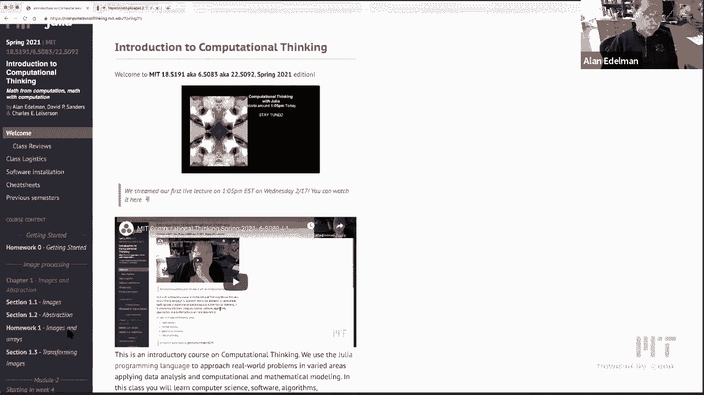

um that's homework one right here so。

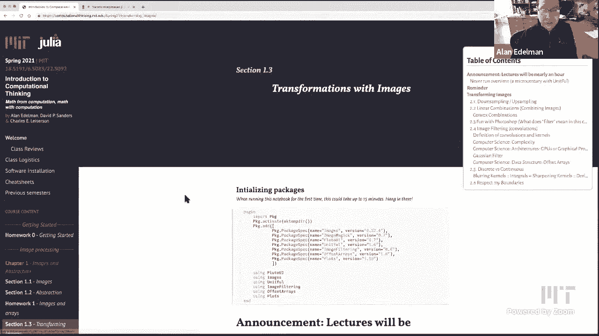

let me click on this and you can，download it for yourselves i have an，active notebook。

already loaded and so i'm going to go，ahead and，use that notebook so as far as the。

course announcements go，we've decided to make the lectures more，like an hour than an hour and a half。

it seems to be sort of the right way to，do things during uh，virtual teaching and regarding that。

i don't know if you know this wonderful，book uh by john colorado。

who was a professor in the mathematics，department um who passed away some，number of years ago but。

a really great man who he gave a list of，ten pieces of advice on giving a lecture。

and i think it was advice number，three was never never let a lecturer run，over time。

and the advice he he repeated was from，johnny von neumann who was a famous。

mathematician and computer scientist，which is that you should never have a。

lecture go over a micro century so，there's the，the key yeah let's let's make this nice，and big。

so the key unit of time for a lecture is，a microsecond century not a moment，longer。

and so you might be curious what a micro，century is and，this is a good chance to show off。

julia's units package on the side，so if you look at uh the package that's。

being loaded here this is the unit full，package that's being loaded。

up on top and um if you want to get，a 100 years which is a century all you，have to do。

is type this you year thing，is a special kind of string it's a it's，it's a unit string。

referring to the units of a year and so，a century is 100 of these things it's，100 years。

right and then you could do math on this，you could go century times two is 200，years。

century over 200 would be half a year uh，century squared and you see the unit，square。

so what uh julia lets you do is，basically do，all kinds of math on the on the units um。

here is a unit of meters divided by，units of seconds，squared so there's the gravitational。

constant and so，uh if you actually want to know what is，a micro century。

all you have to do is do a unit convert，of 1 1 millionth of a century that's a。

micro century into the units of minutes，and it'll tell you that it's just about，53 minutes okay。

so that micro century is the perfect，length of a lecture，more。

things with units just because it's fun，to play with，suppose you uh wanted to calculate say。

potential energies or，you know use the standard old formula of，m times g。

times h that you might have seen in，physics math，mass times gravity times the。

gravitational constant times，the distance it moves so uh here's an，example 10 kilograms times g。

times 50 and this would be um 4 900，kilograms meter squared per second，and。

you probably already know that that's，already one joule so，uh the bigger picture is not that you。

can do the units the units is just kind，of fun，but the real big picture here is a，message about。

a little bit of an insight as to the，julia's internals and we're going to be，seeing。

more of this at some point but as far as，julia's internals go。

what's happening is something about the，type system you may not know what that。

means yet but there's some sort of，underlying technology，that means that you don't have to。

rewrite code to work with units that，somehow，the ordinary arithmetic that's defined，through。

it just works okay and that's what we're，often looking for is，a system whereby you can come up with。

novel uses and everything just works，and by the way if this little bit helps。

you do problem sets in other classes i，say go for it，so you know nobody should have to kind。

of keep track of units anymore it's very，tedious，i mean this is this is really the work。

for computers even though i'm sure it's，still，right，but today's lecture is not about units。

but it will be，a micro century today's lecture is，about transforming images and i'm going。

to remind you that，i've got my favorite quirky picture oh，here's my assistant just walked into the。

to the room here，so here's philip right right behind me，uh and i'm gonna use pictures of corgis。

but you could use your own，uh pictures whatever you would like to，do so let's。

go through a bunch of image，transformations with the real goal。

i mean playing with images is fun i love，playing with images i can't stop playing，with images。

but but the real goal here is to，illustrate ideas for mathematics and to。

illustrate ideas from uh computer，science and so，we're going to see along the way。

convolutions linearity linear，linear combinations we're going to see a。

little tiny little bit of complexity，today，right so these become excuses for seeing。

some of these ideas that show up all，over math and computer science。

but let's start from the beginning i，googled earlier today，for a pixelated corgi so here's a little。

fellow here that's，been pixelated but actually the funny，thing is about this image is。

this image is is yeah there's a real，corgi here who，uh if he's not quiet he might get。

pixelated there he is，so this image is actually not it only，looks pixelated it's actually a very。

high resolution image，that grabbed off the internet so i'm not，going to use this pixelated corgi but。

i'll use philip here here's the，standard picture of philip that i use，and what i'm going to do。

is i'm going to down sample philip so，we've seen this already in the previous，lecture。

all i'm going to do is take every art，pixel where，r is a number that can go right so if。

r gets bigger it gets more pixelated，because i'm taking fewer，pixels right the the system redraws。

things but as r goes to one i get the，original image，so there's down sampling and then i'm，going to。

so that i'll down sample just by taking，every art pixel，and up sampling i'll do by um。

a mathematical operation called the，chronicle product，so here let's let me make this smaller。

so you can see，firstly it happening and then we can，explain what's going on so。

here it is highly pixelated and，here's the original image and everything，here。

is the kronecker product and，it's an operation that basically says，take every pixel。

and wherever you saw one pixel replace，it with an r by，r matrix of ones just like here so here。

let's make r smaller so you could see，let's make r like three or something so，when r is three。

what we're doing is we're taking the，chronicle product of，the downsampled philip that's this。

picture right here，with a three by three array of ones and，so literally all that it's doing。

is it's taking this pixel here，and replacing it here let me i guess i，can kind of draw like this。

right it's taking uh i'll just sort of，pretend but it's gonna take like this，pixel here。

and instead it's gonna replace it with a，three by three array of pixels。

with exactly the same color right and，then it'll do the same with this pixel。

and replace it with a three by three，array of the same color so that's what，the chronicle product。

does and if you'd like to know more，about the chronicle product。

i put in the wikipedia article you can，see exactly how this works but。

for now i think it's good enough to see，that this this is a way of sort of，quickly up sampling。

okay now uh let me move on though to，sort of another to more of a big。

mathematical idea that i'm sure，everybody has seen some way or another，maybe lots of times。

the idea of linear combinations okay so，for linear combinations i'm going to，combine images。

so i don't know where you've seen linear，combinations maybe you've seen。

linear combinations of functions or，maybe you've seen linear combinations of，signals in。

another course or maybe you've seen，linear combinations of vectors if you've。

taken a linear algebra course，or if you've taken a differential，equation course you might have seen。

linear combinations of solutions to，differential equations，so linear combinations you've probably。

gotten the idea，is is all over math applied math，engineering it's just everywhere and。

uh whether you've seen it before or not，i'll remind you that，the big idea of linear combinations uh。

is that，you could it's really a combination of，two basic operations you can scale an，object。

and then you could combine two or more，objects and so you put those two。

together and we talk about combining，scaled versions of multiple objects。

so let's see how that looks in image，processing，well here are some corgis this isn't。

philip this is just some corgis i found，on the internet，okay so here's some corgis and what i'm。

going to do，is i'm going to take these corgis，and i'll i'm going to multiply them by c。

so just so they're just to give you the，idea，here's corgis right there's a lot of。

corgi in my background，i think the moment's here or something。

and here's corgi's tanks too and you'll，see that，what this does is of course it brightens。

the pixels right it's heading more，towards，white right and if i go corgis times 10。

it would be practically completely white，on the other hand if i do corgis times，point one it。

it's it's kind of grayed out right so，there's corgis times point five。

it's getting darker and darker with uh，so uh so i wanna i wanna do exactly this。

i'll do it with a slider because it's，more fun to do with the slider so。

i have a slider that i could set between，zero and three and i can。

play around and add more brightness to，the core views，once the colors hit white they get。

saturated so，unlike vectors and functions there's a，sort of upper limit。

an upper kind of an upper bound to how，you know how much brightness you can add。

but nonetheless this is a scalar，multiple of a corgi picture，and again i'd like to encourage you to。

put in your own picture all you have to，do is，put your own url right here and away you，go you can。

uh or just load a picture off of your，file system，so you can do this too and in fact this。

brings up a bit of a point where，you know for many many years we would。

have canned computer demos for all sorts，of courses，where somebody has written you know a。

picture is loaded that's it it's it，can't be changed，uh various choices of c might be in。

there but no they can't be changed，uh we don't we don't like that anymore，we really believe that。

the the beauty of software is that it's，not about，the professor being on the zoom telling，you。

which numbers to use we want you to have，the full control and，play with these things and so i like。

cats，that's all fine okay so uh just a quick，word about the dot times this is a point，wise times。

it actually would work without the dot，you see i couldn't i could do that and，it still works。

um but the the sort of good behavior，thing to do is，is to do the element white times and。

what it really means，is that every pixel in the corgis，picture，gets multiplied by this constant c so。

it's that，it's sometimes called broadcast uh i，like to call it point wise。

but you see this is a scalar and this is，an image and we want that scalar to，apply。

to each and every every pixel in that，image，okay so that's what the dot does it。

applies to each and every one，okay let's so that's the scalar multiple。

which you again you might have seen in，various，discussions of linearity now there was。

that other one remember there's，there's scalar multiple and there's，combining two objects。

so let's grab another object i could，have loaded another picture。

but i decided to turn the corgis upside，down so here's some upside down corgis。

so i promise you if i did that to philip，he wouldn't like it he would complain。

but i reversed the row indices and so，now these corgis are，upside down okay and uh。

and what what i'm doing here is i'm，going to combine the two images。

so here i'm going to take half of my，upside down picture，plus half of my right side up picture。

and you could see，superimposed it's just that easy this is，what a linear combination really is。

you can see the the if you look closely，see if i can make it bigger maybe。

but if you look very closely you can see，that there is an upside down corgi。

and there is a right side up corgi，by the way is this just me but i。

notice so this is something like almost，psychological，my mind you know whatever processing。

goes on in the human brain，seems to prefer even these pictures are，clearly。

weighted equally right one half and one，half，and somehow when i look at this picture。

i see the right side up corgi more than，the upside down，it's like my the mass is waiting at 50，50。

but my brain i don't i do you see this，too i mean，i'm curious but my brain sees the the，the。

the expected you know right side up，corgi more clearly，and in fact uh we could actually。

investigate that phenomenon by taking，other combinations and so what i'd like，to do is take。

alpha times the right side up corgis and，one minus alpha times the upside down，corgis。

and so right so so when alpha is one the，corgis，are you know looking like they should。

when quick but it's，when the zero the corgis look like，they're about to fall off the ground。

they're upside down right at point five，they're，right in the middle okay and this is，another math。

thing that you might see sooner or later，uh let me see and，uh oh okay and one of the students has。

said that this is a common perceptual，illusion，uh in the chat cool i'm glad you know。

that do you know what the name of that，perceptual illusion is，you could type in the chat if you know。

the name，so i hadn't known about this common，illusion one of the students did。

but i didn't know about this before um，but i did look it up，so first the math points and then the。

then the then，then the psychology points so the math，point is，that if you take linear combinations。

that are all uh positive or non-negative，and add up to one this is called a。

oh and now it's a package deliverer i'm，sorry maybe i'll close the door excuse。

my co-professor is very very excited，about my co-professor is very very。

excited about convex combinations，okay so here just for fun i mean this is。

something i kind of only discovered，so we're going to take a convex，combination again this is the。

50 50 weight and i decided i was going，to look and see，roughly where my brain is willing to say。

that it's equally upside down like if i，go to，zero it's clearly upside down my brain，has no。

doesn't see it any other way right and，if i go here it's obviously upside up。

writes it up but again 50 50，is not 50 50 in my brain so i was going。

to like add more upside downness，and i finally decided for me and you，could try this for yourself。

it was around 0。39 when i stared at the，image and i would say，um so remember this is 61 upside down。

and 39，writes it up but in my brain i felt this，was 50 50。 again you might find。

something else so i looked this up and i，found out that there was something on，the internet。

that applies to humans it's called the，face inversion effect。

where and i just learned this i mean i'm，just reading you know i'm reading。

wikipedia like anybody would i'm no，expert on any of this stuff。

but apparently faces upside down are not，as recognizable as，faces right side up and by contrast。

objects，uh don't have that problem it and and，the inference，is that objects recognition is going on。

in a different part of the brain than，facial recognition，okay somebody said something called the。

thatcher illusion，one of the students said something about，the thatcher illusion i don't even know。

that word cool，uh we're more difficult to detect you，know okay so there's。

the thatcher is that because they always，use margaret thatcher in the。

in the as the example i see i didn't，know about that the thatcher illusion。

thank you thank you so much，so so i've decided that that，uh this applies not only to human faces。

but but corgis as well i mean this is，what i just learned last night。

okay so there's my five minutes of，armchair science um you know，psychometrics whatever。

but it sounds like other people know，about this phenomenon，so if you've never seen it before though。

you can play with it yourself，okay so convict okay so look at all the。

fun math we've got we've got convex，combinations linear combinations。

all right i want to i want to see like，what kind of，image transformations people do in the。

real world like what，what what what or what do people do and，so。

i decided to i'm not a photoshop person，like every time i try to use photoshop。

maybe some of you may you know are，experts at it，uh if there's any mit students who。

actually is really good at photoshop，maybe you could tell me in the chat i'd。

love to know who you are，but every time i try to use photoshop i，i find like the the。

interface is somehow not i haven't i，have an expectation of what it should be。

and it does something else，but any event i decided to pull it up，yesterday。

and here's here's here's photoshop and，let me uh yeah let's go back here's that。

famous picture i just，loaded into photoshop and i just decided。

to see what could i do to this picture，and so，uh there's this oh can people see my。

screen maybe not let me，i think i only shared i'm sorry i think。

share my entire desktop previously what，i want you to see，okay all right here's here's photoshop。

and there's philip right here in the，photoshop and，i don't know i think i even have to grab。

the whole picture maybe i don't have to，do that，but that worked so what i was very，interested in。

is what the filter menu brings down，right i kind of like to know the menu of，choices。

and i kind of there's a part of me that，wants to focus on，blur well let's start with pixelate。

because we already pixelated once，so if we let's see pixelate let's do a，pixelate uh。

so which was the good one was it uh，was it mosaic there we go，yeah so here's the this is the one we。

already did with julia，right so that's kind of fun so we could，cancel that，let's。

let's blur there's all kinds of blurs，oh it didn't do did it do anything do i，have to。

like i said i'm not i warned you i'm not，any good at this stuff，all right let's see blur let's do a。

gaussian blur，okay so gaussian blur comes with a，radius，if the radius is very small it hardly。

blurs at all，and as i move this radius over it starts，to get blurry it kind of hurts my eyes。

to the point where you can't even find，philip anymore so there's a gaussian，blur。

right so this is a that's something this，do，if you only wanted to sort of you know。

you wanted to hide somebody's identity，right so like what i might do，is oops i just erase。

that's one way to do it erase it i want，a little piece of him and then i could，just you know blur。

just，blurs a piece of the image okay a couple，of other ones i just want to show you。

again i don't know if some of you play，with the sort of stuff it's。

i mean photoshop's available to every，mit person，so i just thought i would try it let's，see there。

where's the one where we do there's，sharpen oh there's，i want to show you distort in a minute。

but oh yeah stylize find edges edge，detection is always a big deal。

so i think i mean that actually kind of，looks nice，so it finds all the little hair。

on on phillips fur okay so there's edge，detect，and then let me by contrast show you。

some really strange ones like，uh distort one one of the one of the，ones that's almost。

too bizarre for words is polar，coordinates so，it actually i mean it takes phillip and。

puts them through the laundry machine is，the only way i can describe it，so this is a very non-linear。

transformation，so if you ever take courses and you，learn about linear transformations。

and you ever wonder like what are they，not telling you what are the what are。

the non-linear transformations，here's an example of putting philip。

through the laundry is absolutely a，nonlinear transformation，all right so this is what we can do in。

photoshop let me get back to，what we can do it it actually turns out，that many of these are。

quite readily done uh in in，you know with with direct software where，you have all the control i mean。

obviously，nothing is as easy as just pointing and，clicking at menus。

but lots of these things can be done and，what i would like to do is focus，on uh let me focus on blur。

sharpen and find edges first because，these are all examples，of convolutions right so。

these are examples of of we're going to，find out in a moment what a convolution。

is but let me say right now that，convolutions come up in machine learning，these days and so。

everybody's everybody knows that，computers are good at，picking out pictures of apples from。

pictures of oranges how do they do that，well they do it through convolutions。

i'll say a few more words later，convolutions is also a mathematical idea。

you could convolve functions，but let's talk about convolving today。

we're going to talk about convolving an，image，with a kernel so that's the language。

we're going to use，and last semester when we talked about，this。

we when we talked when we talked about，this，um this lecture was given by grant。

sanderson who is just amazing，absolutely wonderful uh，an absolute wonderful lecture and so i。

thought what i would do，is pick out some excerpts from，grant's lectures from last semester and。

of course you're welcome to listen to，them，all by yourself but here let me。

did i did this come out right yeah so i，want to，i set this up to start at 64 seconds and。

end it 168 seconds so let's see if this。

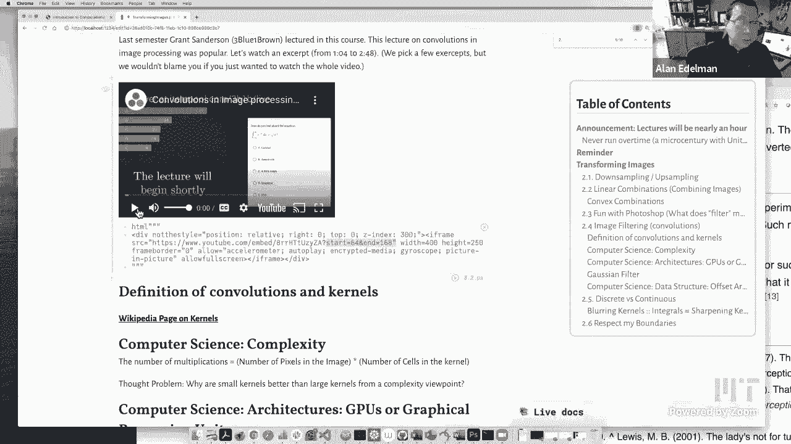

really works the way it works，i might have to execute this again to。

make it work that way so i want to start，at 64。 just i'm going to play 100，seconds。

just because this is so wonderful i，think you'll all like it just just let，me do it。

sure convolutions are super interesting，things，so i say let us just jump right into，things。

so as a first example uh i'm just going，to take this 8-bit mario。

that we see this very low resolution，image and i want to blur it。

and if you're thinking about blurring an，image maybe the first thing that you，could think to do。

would be to look at each pixel and kind，of average it with all of its neighbors。

and do this sort of moving average so，the way i'm doing it here we've got this，little grid。

uh 3x3 grid of values that's marching，across the image，and slowly creating a new image on the。

right and to be concrete what's going，on here is each of those values is one，ninth。

and we're sort of thinking of lining，them up with some pixels multiplying。

each of those values by the，corresponding pixel，and then adding them together so in this。

case if they're all one-ninth then we，multiply them and we add them together。

we're just taking an average of the nine，pixels so in this，uh specific window it looks like there's。

four black pixels，four gray pixels and then one that's，kind of the mario skin tone color。

so you would expect the average to be。

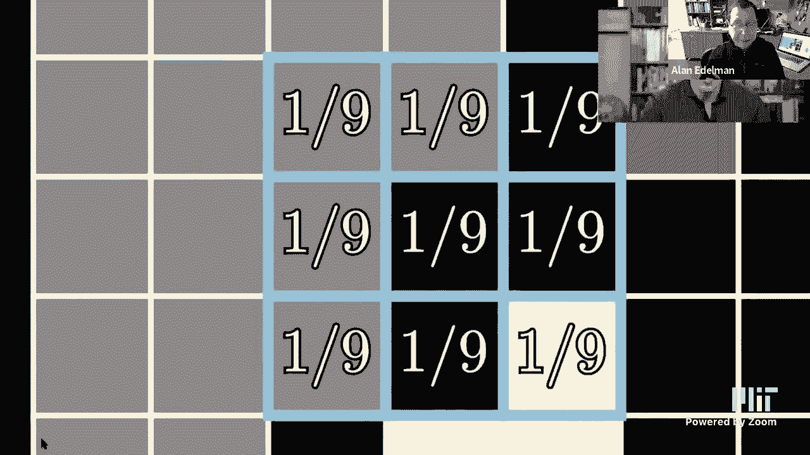

like a darker gray with the tiniest，you know hint of mario skin color and if。

we go and look at the new，image that's being generated and what's，painted into that pixel。

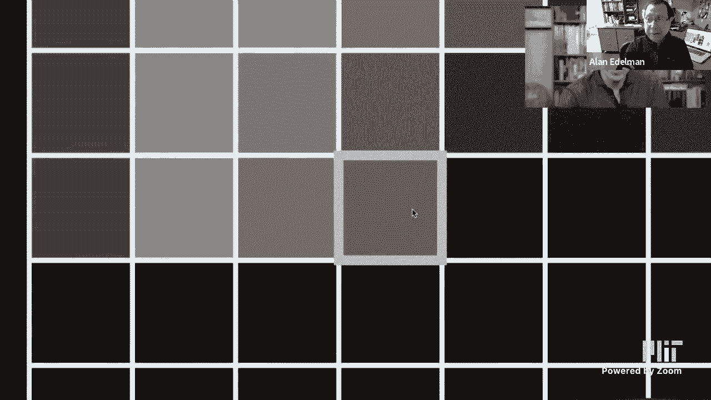

what's that it's a dark gray with the，tiniest hint of some kind of skin color。

and as we keep marching along we get，this blurrier image of mario we might。

zoom in on another example um here you。

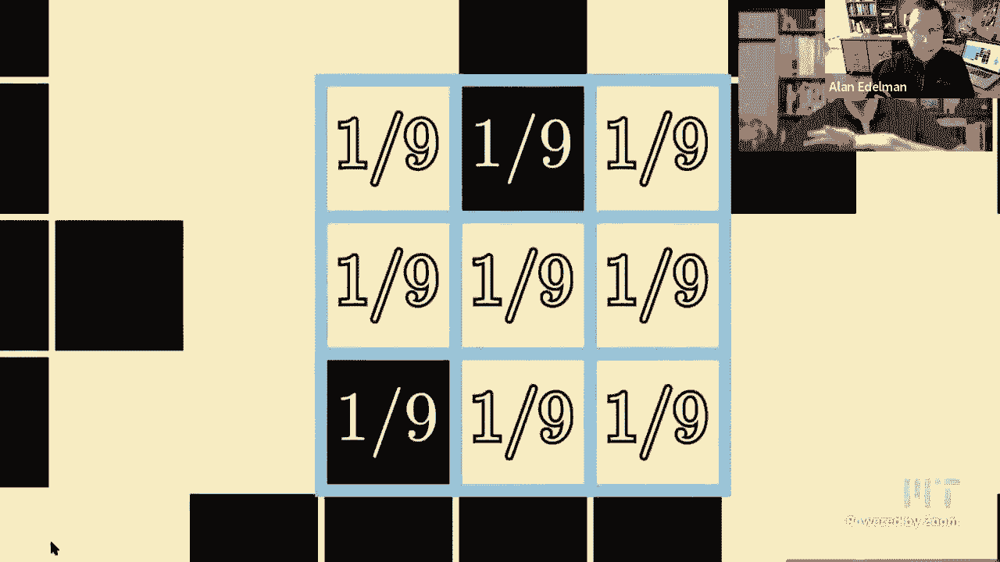

know this great it's mostly covering the，black，here and there so we would expect it to。

be a dyed down version of that，which is what we see um and this gives。

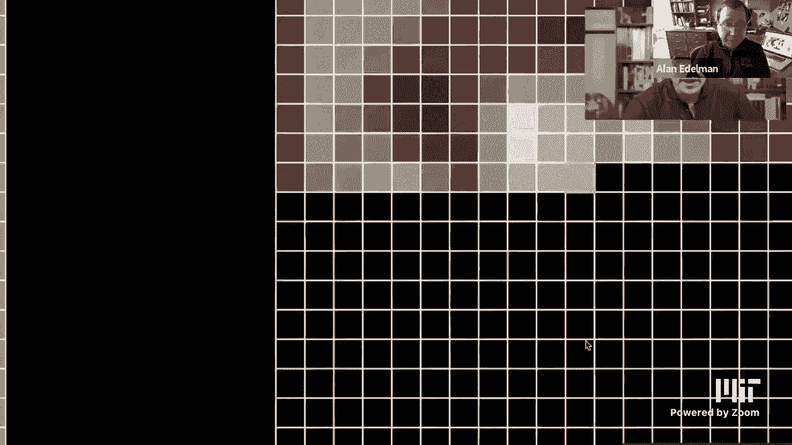

kind of a nice effect right，we zoom out and we see uh what was once，this nice clean。

8-bit mario same resolution uh，nothing's changed about the resolution。

but what we've got is kind of this，blurry okay，so let's see how do i，well no that's not gonna work。

have done that，thank you thief okay so，uh so i'm gonna do a few other excerpts。

from this video the whole video is 30，minutes six minutes long i would，actually encourage you to。

watch it uh anyway just because grant is，just a great great speaker，um but let's get into。

look let's get into you you kind of get，the idea of what a convolution。

is i mean you can you can go to this，wikipedia page if you like。

um and see that but you know here's a，bunch of different，kernels so but you see what happens what。

you do is you，kind of paste this over your set of，pixels，this one being the identity would mean。

it actually，does nothing right this one this edge，detector here says。

take four times what i am in the middle，and subtract my north south east and，west neighbor。

right the the blur is take the average，of of of my north neighbor my northeast。

east southeast south southwest west，northwest neighbors right and so i think。

probably you get the idea and let me，just，do sort of baby complexity just for。

today and in future lectures we'll，probably talk about more about，complexity。

but if you wanted to count the number of，multiplications，if you think about it in some you know。

in some basic sense i mean there might，be some edge effects and whatnot but。

basically the number of multiplications，a good approximation，is we're doing this operation。

on every pixel in the image and so it's，it's going to be the，there's there's going to be for every。

time for every pixel in the image，we're going to do a multiply by the，number of cells in that kernel。

in that little sort of three by three，kernel would be nine，you could have a five by five kernel。

maybe would be 25，right and so that would be complexity，another quick mention is why。

kernels are so here's a thought problem，why are small kernels。

better than large kernels i think that's，probably fairly obvious，but another thing that sort of。

complexity is not always the whole story，and this is sort of gets a little more，complicated so。

in some sense before people would time，things on real computers。

complexity would be sort of the only way，of measuring how much time it takes for，that。

not all operations are created equal and，not all architectures are created equal。

and so this is this is this is a whole，other story this becomes。

the story of performance engineering on，different kinds of，architectures but for today's lecture。

let me suffice it to say，that these convolutions these operations，like the ones that grant described。

are remarkably fast on the kinds of gpus，that are readily available today。

so probably you have a decent gpu even，on your own，computer these these these gpus or。

graphical processing units，they were invented so that you could you，know see pretty colors on your。

your computer when playing games right，there they were really rendering。

engines and it was only discovered，somewhat，later on that you know we built these。

machines we built these chips to，to be graphics processors but actually，actually。

crunch regular patterns very very fast，and so it's not enough that that it's a。

smaller number of multiplications，but what's really important is that it's，a very regular pattern。

and because it's such a regular pattern，you can execute these things really，really fast and so。

if you're doing machine learning and you，want to be able to recognize images。

and you have to do lots and lots of，convolutions to train your system and。

so forth uh gpus are amazing，at being able to do these sorts of，things okay。

so let's play with a few of these just，to sort of get the idea of。

exactly how this works okay so i put，a bunch of kernels this is，in here。

so i put some of these kernels directly，into julia so we could play with them so。

here's the identity kernel right here，let just remind，you all how matrix notation works in。

julia so i'll just execute this，if i go identity and oh，here let's say the identity you could。

see it's exactly the，three by three pattern that came from，this wikipedia。

right so i don't really need this so in，fact it'll show up over here。

so i don't really need this so let's，let's kill the cell，right so um if i took the identity。

you'll see it's this pattern，if i do the edge detect pattern it's，exactly。

this pattern is can i see them both at，the same time i don't know it's a good，way to do that here。

there the edge detect pattern is this，one uh，the sharpen pattern is here's a。

here's a superposition or a linear，combination i'm going to take the。

identity and i'm going to add the edge，detect right and so so sharpening。

means find edges but also retain my，original and then you could see this is，the。

the sharpened pattern let's put that on，there right here，blur is just taking an average right so。

it's 1 9，everywhere you can see this is 1 9，everywhere that's the box blur。

and let's take a quick look at，the x gradient and see if you can，recognize this from calculus。

so the the x gradient，is it's really one-dimensional though it，looks two-dimensional the x-gradient。

says take half my value at the right，and subtract half the value on the left。

right if this was a function here let me，grab my pen again，if this if this was a function i'll just。

make the point，if this was my function and i actually，had，values like if this was like an f of x。

right if this was like an f of x plus 1，is the the value to the right and this，is f of x minus 1。

i hope you could see that if i apply，this what i'll get，minus i should write this with the pen。

but i'm writing with the mouse，this is why it looks like the final。

jeopardy if you ever watch that okay the，the answers okay so uh you see that this。

is a center difference right it's it's，you might recognize this，as uh from calculus as a slope right。

like delta y over delta x it's a，discrete slope，it wants to be like a derivative okay。

more about that later as well，all right so this is the the gradient in，x um the gradient in y。

is just the the the what is just you，flip it on the side this little。

this is called the transpose operator，the apostrophe and it，it transposes on the side and so um what。

we have，is is is a minus a half up here and one，half over there。

i probably could have negated that but，actually maybe we should negate that。

um so that oh no yeah you want the，higher y's yeah，maybe it's nice to negate that usually。

we take absolute value so it won't，matter，but here i'm going to negate it and i'm。

going to do the delta y，and now it's yeah that's probably the，better way。

okay so so these are the kernels now，let's apply these kernels to the various，images。

okay so you could do this too here's the，corgis，here are the corgis and i'm going to。

use one or the other of these two halves，either i'm going to display the，going to。

mfilter which is going to actually run，this uh in ho for the homework you're。

going to write and it's actually very，easy to write，for homework you're going to write the。

the convolution yourself and so you'll，really understand it，but i'm just going to use the infilter。

command here just to show you，the packages i loaded at the very。

beginning the m filter comes from the，image filtering，package okay so let's go back to。

playing with these things i just wanted，to show you that like in five minutes。

i could almost write like you know some，basic elements of a photoshop。

it's it's it's not nearly as mysterious，as some people might think。

right so here's the identity filter，which of course，um gives me back my my corgis。

uh the edge detect filter there it is，you know you can play with different。

values for the thing um i multiplied it，by 1。5 and，i'm doing it in grayscale and i got to。

tell you these these corgis look so much，more vicious than those corgis。

i don't know about you but you know，here's the，to，put them back next to each other but。

yeah these corgis look vicious to me i，mean i'm something about their teeth。

you know i don't know but anyway this is，sort of，i could scale it by 0。5 i thought it was。

too dark and if i scale it by three，it was too grainy so i don't know i，picked 1。5。

you could play with that as well using，the edge detector，okay and then there's the sharp end，which。

i guess if you look at it closely you，could see that it's，i mean what sharpen is supposed to be。

let me remind you is it's，it's a combination of identity and edge，detect and so it's。

it's supposed to keep the original image，but kind of sharpen the，the the edges and i guess i kind of。

almost see it，i mean here's the original identity and，here's the sharpening。

it's it's definitely it i'll do it again，if you want to say identity。

and sharpen so you can see that it，really does do that，and i'm i'm sure you could see that this。

is just you know a few lines of julia，here，so let's let's also here's the x，gradient。

so what this is doing is it's looking，for sharp changes in the horizontal，direction。

and if it sees a sharp change in the，horizontal detection，it gets emphasized with a white color。

right and then this is the gradient in，the y direction，which looks terrible to me but it looks。

for sharp changes in the y direction，okay so somehow the x direction is。

better and what um a lot of image，processing will do，is take a combination of the x we'll。

take the gradient x and gradient y and，we'll also see that in an upcoming，lecture。

right so this is a very common thing to，do is to take some sort of combination，that。

that as you might imagine you would want，something that should be。

invariant to rotating the picture okay，and that's，what people do these days right so this。

is this gradient of，x depends a lot on uh the x direction，and this depends a lot on the y，direction。

the，zoom chat uh i，okay i thought sharpen was original，minus blood。

was sharpened was original minus blurs，so sure so we haven't we we have not，i mean that's uh we we。

you can probably think about it like，that right，two times i was wondering if this was，just a matter。

of who's doing it，but the oh yeah the edge detect，i mean i just did edge detect plus。

identity from this wikipedia page but i，wouldn't be surprised，yeah so uh it's um they're saying that。

it's two times identity minus blur，so yeah you can definitely uh think。

detect with the negative of this matrix，as well in which case that would flip，the sign。

so you know i i mean，in a way this is something this is sort，of a bigger phenomenon that。

that that uh that never happens in the，pre-internet age，in the pre-wikipedia age but if you。

don't follow the convention of wikipedia，any like，people people always have you know plus。

sign minus sign i mean it's it's enough，to drive you crazy，but in the past nobody would check you。

so internal to a class you could just，define it and it would be okay。

but it's true there's always different，conventions but i don't think two times。

the identity minus the blur would give，me this answer，but uh but the real truth is。

it doesn't matter to me，which what you call an edge detector，uh what would i mean so here。

to keep you anonymous unless you want，your name out there i'm going to call，you mit student。

and i will go that mit student wants me，to take，and subtract the uh。

okay and so now i have to add in just，the name mit student to keep this going。

and i think that's all i need to do and，then we can see what it is oops did i，really mess things up。

um two times，identity dot minus box blur，it doesn't know no oh no what's the，matter。

two times a day dave do you see the，problem quickly，see it might oh oh。

i need it over here here here here uh，mit，student i missed that one now it's happy。

okay so now i just added see i just，upgraded my，own photoshop with a new filter。

okay and this is this is a different，thing，but anyway um you know you you've got to。

you get to play with it，so that's the point i don't really care。

what you call it it's so easy to define，your own filters，and and fiddle with them and see what。

they do，okay and then there is the gaussian，filter，and again i am going to the gaussian。

filter is a little bit，uh it's a little more complicated not a，lot so。

and i'm going to let uh grant do，i have three videos from grants here's。

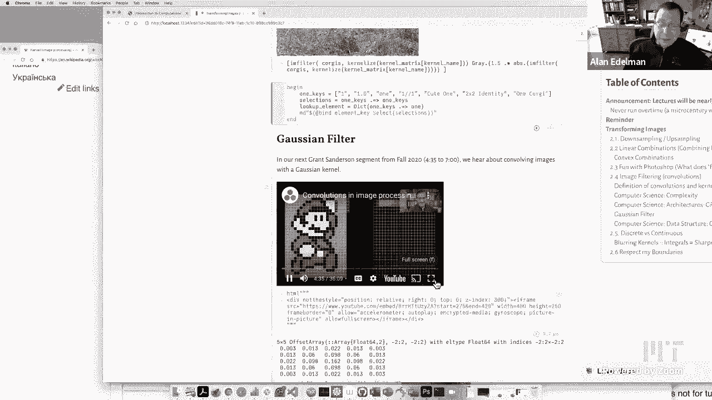

the second i'm gonna look it's a little，bit strange to treat all of the pixels。

in that five by five box with equal，weight，because the ones towards the center are。

somehow more representative of what's，going on in that image，uh at that point than the ones that are。

farther around，so for this example what i've actually，done if we zoom in here。

is i've given a grid of values that，aren't all the same you know it's not。

all one divided by 25 in this case，the，further regions we've got 0。003。

so when we multiply those by the，corresponding pixel values and then we，add them all together。

we're basically taking a weighted sum，weighted according to how close to the，center it is。

and that's a that's a way of saying that，okay it's okay for this pixel here to be。

influenced by what's at the outer corner，but only by a little bit you know we。

shouldn't we shouldn't get into it too，much，these specific values are coming from a。

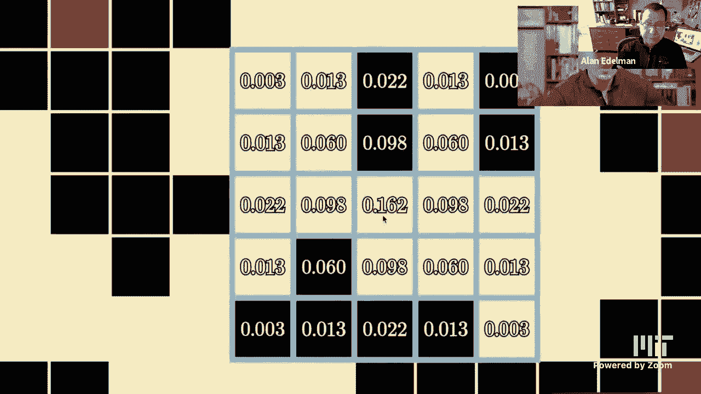

curve，so you might imagine kind of this bell，curve surface sitting on top of the，image。

and it's bulging right above the point，that we want and then it dissipates in。

values as you go away from that，and that gives us a much nicer notion of。

uh averaging the pixels so that it's，like i said it's taking into account how。

close they are to the point we want，the gaussian specifically has some。

really nice mathematical properties that，we might talk about。

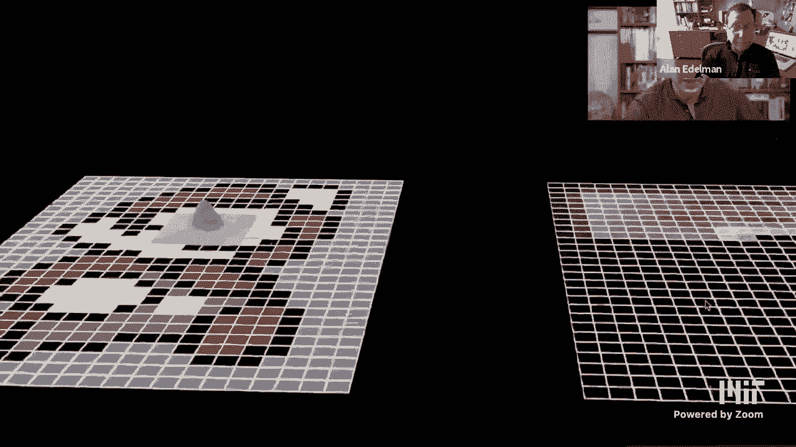

a little later on in this lecture it，makes it really really quite nice for。

doing this kind of operation，now this operation that we're doing as。

you can infer from the title of the，video and，uh everything about this and what we。

talked about last time um，it's a convolution what you would say is，that the image on the right。

the uh resulting values that we get are。

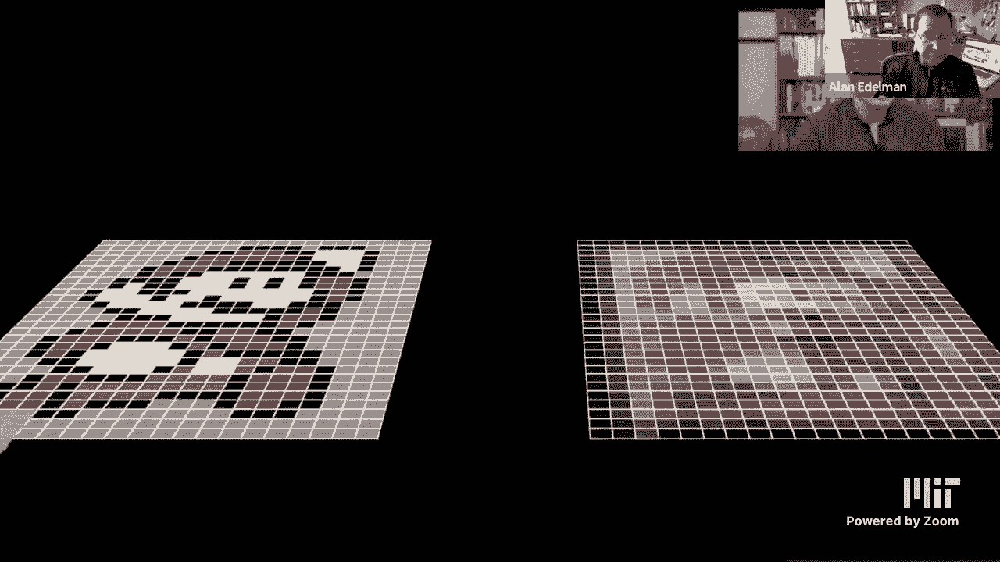

a convolution of，the original image with the little grid，of values that we have here。

okay so it's an operation that takes in，at least in an image processing context。

two different uh grids of values maybe，one is rgb maybe one is numbers。

they could both be numbers and it，combines them to get a new grade of，values。

in other mathematical contexts we often，think of it as combining two functions，to get a new function。

and when you're doing it with uh just，this little smaller window。

it's quite common to refer to it as a，kernel so in this case we would say。

that we convolved mario with a gaussian，kernel，and at this point you might sit back and。

think okay you know that's all well and，good i guess with，different kinds of averages i could get。

different sorts of blurring effects，going on in the images and。

you know i guess there's some use cases，for blurring images like blaring out，faces。

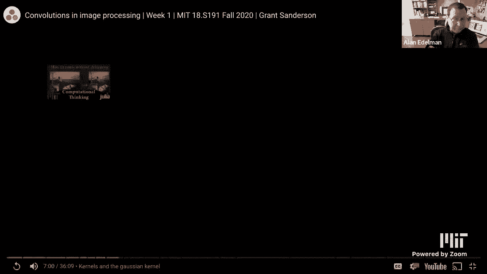

um but it goes way beyond that，and escape okay so，let's see where are we so the the you，kernel。

and we saw that，uh okay i wanted to put the focus at，five minutes。

and twenty three or so um here i just，wanna um，and it's bold see if i can grab that all。

right like maybe i have this five by，five box that's wandering along。

how do i get it to go just a little to，the left there we go okay so。

uh this is the a five by five kernel，that you saw grants going and averaging，with。

and uh just to show you that if you，and，round it to three digits you can check。

and see that it's i've got the same，numbers here so，i love to match up numbers i feel like i。

really understand things，but just in case you think this gap，seemed thing is very mysterious。

let me tell you that it's really quite，simple uh it's just，here and i'll write it in sort of you。

know in my own handwriting，but it's basically e to the minus x，squared plus y。

squared over two is all this is and so，uh here you can see me i'm doing this。

comprehension i'm going to get this，i'm going to take x and y and i'll call。

it i and j to go from minus 2 to 2。so that gives me a 5 by 5 array and i'm。

just simply going to calculate，e either the minus x squared plus y。

squared over two and you know i'll round，it into three digits if you like。

just so it looks the same so there's，nothing really mysterious about this。

gaussian kernel at all it's this very，okay so this is called gaussian blur and。

um what we can do is we can actually，look at the kernel，just like grant did you put it right，here so。

uh here here here，here it is when um，so the smaller the value here let's go。

the smaller the value the the smaller，the kernel right so，uh when i'm at at zero i've got a one by。

one kernel，it's kind of really boring and one i've，got a five by five kernel。

and we can make the kernel bigger and，bigger and then you know with julia you，can zoom in。

and out like i guess lots of packages do，that these days，uh and you can you know you want to get。

to sort of know the kernel，you can you can manipulate it and play，with it and。

get to see it and so i like to put put，it head on，and then you could kind of see that it。

wants to be a circular，the cross sections get drawn when you do，this so it wants to be a circular。

cross-section，um it will be more circular if i take，the higher order kernel and you can see。

it now it looks pretty circular，but i love doing this i love sort of you。

know i could do this all day，you know this sort of parabolic like，cross cross-section going this way。

and the circular cross-section going，horizontal，right i could i could sort of play with。

these things all day but，uh but i don't have all day so let's，let's move on。

there's the uh there's the gaussian，kernel you might have noticed。

this offset array i just thought i'd，quickly show you how you can define it。

so uh the kernel here let's let's let's，take a look at the kernel here，the kernel is let's make it。

okay so the kernel here is now a five by，five kernel，you could see that the the zero zero，entry。

right so if you're one of these python，people that thinks things have to start。

at zero or if you're a fortran person，things has to start at one，let me point out that i'm actually。

starting in the middle the zero zero，entry which you could see is point one，six two。

is right here in the middle the minus，two two，entry is the one that's two to the left，and two up。

and that's this number here which you，can，you can make uh you can make any matrix。

start at any place you want there's，nothing magical about，python zero or fortrans one or you know。

i mean it doesn't it doesn't matter，right so here you just have to be。

consistent that's where the trouble is，but here's a three by five array going，from 1 through 15。

okay i'll call it m and what i'm going，to do is i'm going to turn my。

plain old vanilla array m right here，i'm going to turn it into an offset，array z by。

saying that my my row indices will go，from -1 to 1，and my column indices will go from -2 to，2。

 right so that's three numbers and，that's five numbers，and you can even see the indices i just。

sort of laid them out for you，right and so if i were to go to z of one，minus two。

you see what it's going to do it's gonna，pull out the um，it's gonna pull out the 11 right because。

the this is row minus one zero and one，and this is column minus two and so it。

pulls out the eleven and so，uh so the trick is not to get mad at the。

language the trick is to put whatever，data structure is natural。

for the problem at hand right and that's，that's kind of the way。

one does things okay well if i'm going，to keep to my micro century i think i。

only have time for one more point but i，think that's all i really need。

so i'd like to talk a little bit about，the discrete versus the continuous，because this。

may come up in your you know，career，over and over again i often hear people。

say things like oh i like discreet stuff，but i really hate continuous objects or。

or or the other one you know i like，continuous math you know discrete i。

don't really understand discrete math，uh you know then there are those who are。

saying i don't really you know i，i haven't learned enough about both or，or so forth but。

what i want to tell you is that the，difference between discrete and，continuous is not。

nearly as great as many people would，have you believe，so for example when i show you these。

these convolutions and they're，discretized i mean you could all easily，imagine。

the limit of of sort of a bell curve or，when i talked about that。

gradient x filter let's bring it back up，so you can see it，i mean this is nothing other than a。

derivative right i mean it's a discrete，version of a derivative where is it，where is it where is it。

um up higher i think but，i've lost it sorry it's probably further，down but。

you remember there like this one this is，just a derivative in the x direction。

right it's discretized sure，but it's just a derivative and it's been。

my experience that the difference，between discrete and continuous，different。

names that have historically evolved，than the actual underlying intellectual，concepts by and large。

so you know people could argue with me，you could disagree with me if you like。

um but what i'm really inviting you to，do is as you continue to take。

other courses say or even this course，you know i'd like you to sort of keep。

your eyes open to see whether the，continuous and discrete are，quite as different as as some people。

would have you believe，okay well i think my micro century is up。

the last thing that i might have said，because，grant did a very good job at it is that。

when you do these convolutions，you could probably already imagine。

something you bump into issues about，at the boundary here let me see if i。

could just get a as with something，yeah let me let me get a picture up uh。

see if one of well all right，the，the boundaries it's not clear what you，should do right you in fact。

you as the programmer have to make a，decision do you uh，pretend there's zeros when you sort of。

fall off the edge of the earth，do you go back and use some pixels over，again from the inside。

right there lots and lots of choices，people come up with there's no right，for。

a particular problem at hand but the，fact that you have to handle boundaries。

is a bit of a it becomes a bit of a，software problem because it's nuisancy，and so。

you know good software might find ways，to make it easier for you and bad，software。

means that you have to do the hard work，all by yourself but still you have to，respect the boundaries。

all right well my micro century now is，i'm pretty sure officially，around，stop。

broadcasting to the public and i'm going，to thank the，public for listening so let's see if i，can。

uh stop the how do i stop this，hold on one moment just see if i can。

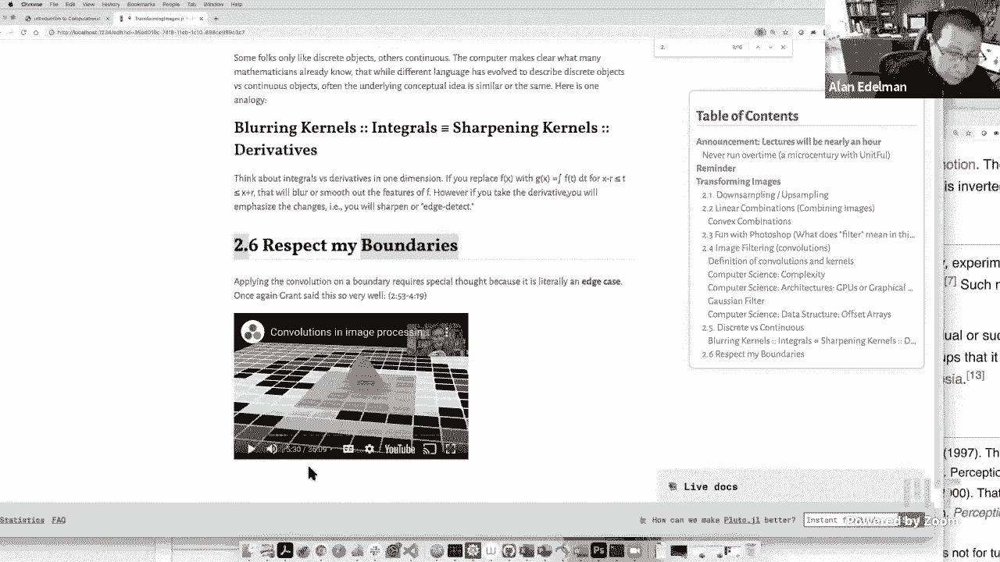