# 【双语字幕+资料下载】MIT 18.S191 ｜ 计算机思维导论-Julia(2021最新·完整版) - P3：L3- 变换：自动微分 - ShowMeAI - BV19g411G7ab

okay，well let me say hello to everybody out，there，out on the internet um it looks like，which。

it always boggles my mind because even，under the best of circumstances one gets。

you know a few hundred students in an，mit classroom，um but so having thousands of viewers on。

the internet is pretty exciting，today's lecture is as always showing off，what。

programming languages can do but also，uh we're going to have a lot of fun。

you'll see here we can we're going to，play with some of these image。

transformations you know we're going to，do，stuff like this and unlike this and。

what my real goal for this lecture，is uh how do i say it there there are，math courses out there like。

like multivariate calculus and linear，algebra，and you know these are basic college，math courses that。

many people take probably maybe you've，already taken such courses or。

maybe you're going to take such classes，in the next few years，uh maybe or maybe you're an expert on。

these subjects or maybe you've never，you know done these subjects before it's，my belief。

that uh whether you haven't seen these，things before，or you are the expert there's nothing。

like doing it on a computer，so let me start showing you a few things。

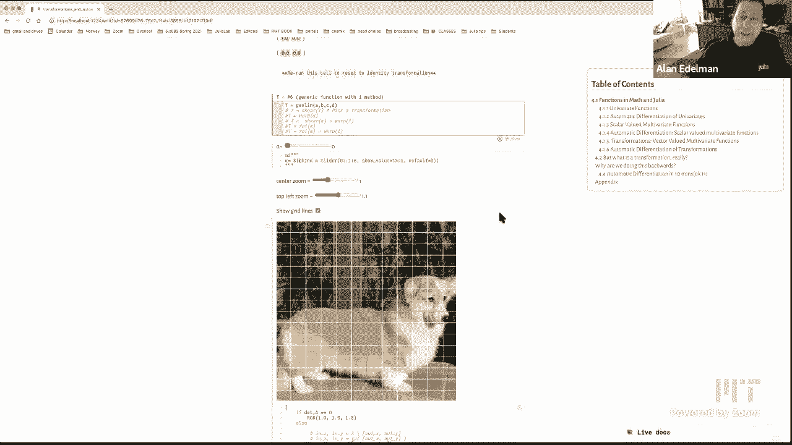

and uh the title of today's lecture you，might as well go to the top here are。

transformations and automatic，differentiation，that's abbreviated as autodiff right so。

autodiv technology is a very very，exciting technology。

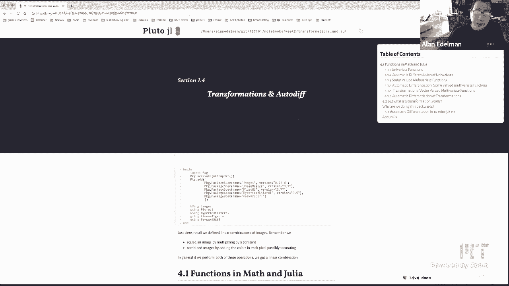

that kind of has really kind of come to，its own in just the last few years and。

it continues to amaze me what we can do。

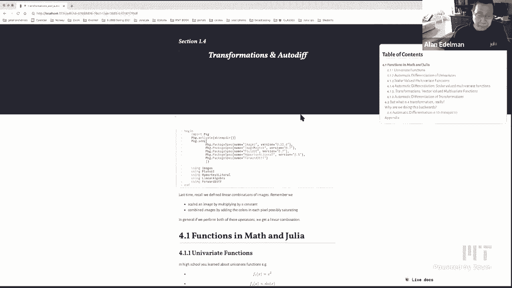

with it but to，set the stage what i'd like to do is，scroll down。

and i'm hoping you can join me and do，this along with me，and let's just play with a few。

transformations just to get the idea，so uh i've got a bunch of，transformations predefined。

like a general linear transformation，you'll see what these words mean in a，minute。

a shear a warp uh here like i'm gonna，put this one down on the bottom to do it，last okay a rotation。

picture，that you like uh here's a long corgi we，could do the。

usual corgis you could pick a picture or，you could load anyone you like from the，internet。

uh we also have this arrows picture，which this is really has been our test，pattern。

but here how about how about let's take，the three corgis okay so。

here's a picture and what we're going to，do，is we are going to run a linear。

transformation this general linear，transformation，by picking the coordinates of this，matrix so。

this is what's called the scrubbable，matrix if you're running it in your own，notebook you can。

click here and then you could see oh，look at those，look at those corgis you know becoming。

sheared right you could，you might notice you know what what，happens to the square。

the squares does somebody want to tell，the the squares the squares become。

parallelograms as you share，right so uh so this this is this is a，shear we could do other linear。

transformations，right and we can also zoom in zoom out，um zoom in from the top left just。

disappear so you've got a whole lot of，controls，it's actually very easy to make these。

search of things so here let's let's put，these back to，maybe around one so we can play with it，later。

okay so this this is this is a general，linear transformation，right and quite frankly。

this is really how you should look at，matrices in my opinion。

so all too many people think of matrices，as，arrays of numbers right it's just like a，table like。

like you know you could be looking at a，spreadsheet it's just a boring table of，numbers and。

and and there are all too many linear，algebra classes which would have you，think。

that linear algebra is about doing like，row operations and column operations on。

those tables of numbers，and you would never walk away with sort，of the intuition as to what a matrix。

really is，okay but as far as i'm concerned，this is what a two by two matrix is and，uh。

this generalizes to three by three and n，by n dimension，matrices so we'll say more in a bit but。

one point to this lecture，is what is a matrix if you thought it。

was a collection of numbers if that's，how you thought of matrices all your，life。

you know here's your chance to really，find out how the big shots think of，matrices right it's this。

kind of linear transformation okay so，we'll say more about that。

but let's play with a few more of these，while we're at it，so here let's pick we've i've already。

played with the sheer so，you know there's the share a pretty fun，one is。

a warp so here let's do a warp a warp，here here's the warp and let's let's。

warp these poor corgis there they go，look at that so this，as you might imagine here it's like you。

see we could put the the corgis through，the washing machine just like photoshop，could。

so this warp is a，non-linear transformation okay and so，these are the sorts of transformations。

that you don't see in a linear algebra，class because，you know in a pre-computer age it was it。

was really hard to，to sort of see these things in real life，i mean you could draw them。

one pixel at a time but it would have，been really really hard alan could you。

zoom in on your browser please do the，zoom in let's do that，all right that's a good idea the trick。

is a bit more，well i knew i want to i need the alpha，in screen so i don't know if i can do，that。

still，and still be able to manipulate she，could try to do one more，but let's see if i can。

make this just okay i can do one more，level，okay there we go right so here the the，warped。

uh corgis just to sort of see this image，we have a few other，images uh for example。

composed images where for example you，can well here let's rotate the corgis，first。

let's rotate the corgis there they are，right so，now alpha controls the rotation i guess。

that's a pretty easy transformation，this one's linear okay and then we can。

compose things for example we can go，we can do a rotation followed by a warp。

right and right so here it is spinning，around，here can you uh you can actually hide，that，you。

mention how you can visually distinguish，whether a transformation is linear or，not well i would like。

the students to think about that for a，moment okay，right and if somebody wants to tell me。

in the zoom chat they can tell me，um okay，yeah definitely zooming in or on discord。

or underscore that's right think about，yeah what what makes，it seem linear versus nonlinear and then。

we could talk about，what that means all right so i just，wanted to set the idea。

of just to kind of get things started i，mean i could have shown this later in，the lecture。

but i kind of wanted you to sort of see，two-dimensional transformations linear，and non-linear ones。

more，maybe i'll bring them out there's the x，y that we have，floating around so this is a very。

strange transformation，okay and one more transformation that i，have floating around。

you could define your own just write，your own function but uh，the r theta transformation。

is yet another one that we have floating，around which is kind of fun to，to look at so uh。

this is the one where it sort of fans，out let's see，gotta zoom a little bit all right so。

point number one，is transformations linear and non-linear，transformations okay so。

uh like i said my goal is to，to is is is to kind of get you to see，linear algebra。

and multivariate calculus in new ways，and i really believe i would love to。

hear your opinions after this lecture，but i really do believe that。

you can not have taken a course see it，here on in julia and you already get the，intuition or。

you could take the class first and get，better intuition from this lecture。

and i still believe that even the，experts even the people who think they。

know everything about multivariable，calculus and linear algebra。

still get something about being able to，manipulate these things in real time。

so just because you understand these，things it doesn't mean，that you that you know you can't further。

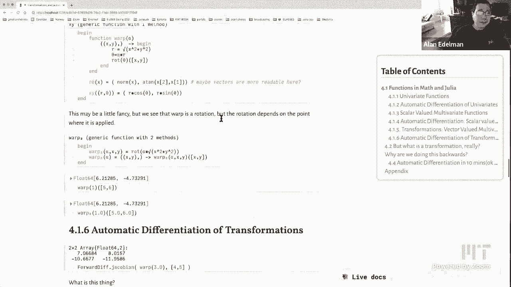

solidify your innovation，all right so that was like a little bit，of the trailer from the movie。

now let's go ahead and start the lecture，for real，okay so we're going to learn a little。

bit about julia going to learn a little，bit about modern computer science。

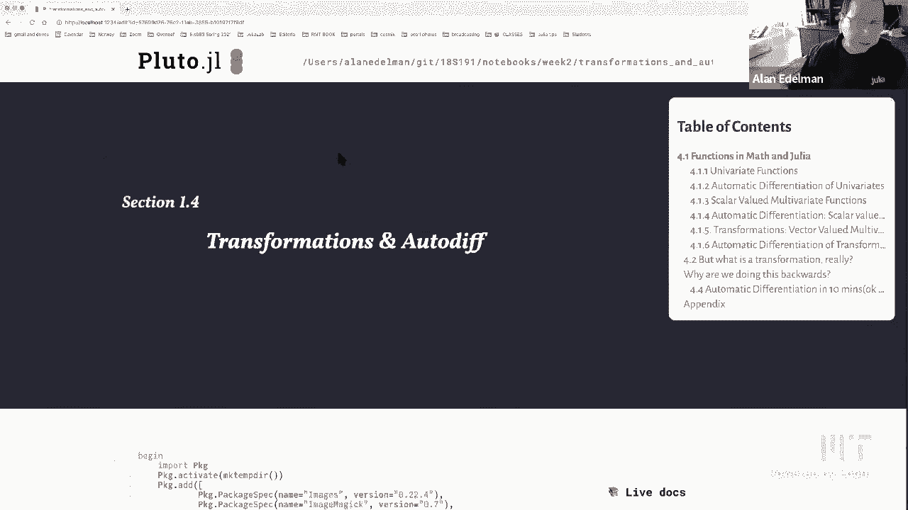

all at once as usual okay so let's start，with，some very simple things okay oh let's，let's remember。

last time we defined linear combinations，of images，um you remember that we scaled an image。

by multiplying by a constant we also，combined images by adding the colors in，each pixel。

and we said that that if you do，combinations of these two operations you。

get linear combinations in general okay，now today we're going to see linear。

combinations from another view，but let's start with really really，simple，in math。

and in julia so i wrote down a couple of，univariate functions here there's the，square function。

the sine function and a generalization，of the square，where you have x to any exponent alpha。

and in julia you can，express these in a number of ways and so，i just thought i'd show them to you。

there's the so-called short form where，you say f of x，is x squared okay and just to follow the。

subscripts of the math，just want to show you that if you go，here let's just do it。

right so you see it if you go f，backslash underscore one and then i'm，going to hit the tab key。

i get the subscript one right or i can，go，seven right and i get the subscript 7。

so this is one way to make your code，look more like mathematics，right i mean i suppose i could have。

written f1 but，you know i see people writing alpha like，this as opposed to writing。

it like this and it seems like a，telltale sign that you're on a computer。

and you're not doing math anymore，so here we blur the distinction between，math and computing。

by actually writing things in a nice way，okay so，back to function calls i can create the。

function x squared，simply by saying f1 of x equals x，squared and then you can see f1 of 5 is，25。

 okay so that's，one way that's the short form way of，writing a function。

and the short form as you might expect，is a，when，it's not a very complicated function。

with when you know you can do it one，expression or two，um that that's usually when you use the。

short form，then there's the so-called anonymous，form，okay and you know any list people out。

there this is sort of these lambda，expressions but，um nowadays they're generally just。

called anonymous forms，name，like f2 the word anonymous means there's，no name。

right it's the function is the thing，that takes，x to sign x okay that's it there's no。

the function doesn't have a name，it's just the thing that maps x to sign，x right and so。

you could take this thing and evaluate，it at pi over 2，and that'll evaluate of course the sine。

of pi over 2 which is 1。now of course i can go ahead and give it。

a name it won't be anonymous anymore，right i could say my sign is this，function，it。

at say pi over 2 and，of course it'll work right so，i got one out okay so，so this is anonymous。

right okay good so we have the short，form for a function anonymous form。

and then there's the long form which，uh where you which you've seen before a。

few times now you take a function，and uh you you have an end and。

you put in the return value you don't，have to type the word return but it，makes it。

very easy to read and i just sort of，threw in another，piece of the puzzle that uh you can have。

a default parameter alpha equals three，so the way this works is。

if i evaluate f3 of five it'll take the，cube，okay so the the exponent alpha is。

understood to be three if i don't tell，you what it is，but if i do include it then that's what。

will be used right so 5 squared is 25。okay so so there's，f3 and，let me also mention rather quickly。

that uh the concept of a keyword because，they come in handy，so instead of a comma we use a semicolon。

and then what that means is that you，have to type，alpha equals if you want to know what。

exponent is being used，right so you this way you know the key。

word or the you know maybe it would have，been good to call this，for example that might be even more。

readable，um oh i okay can i not，let's wait what did i do，wait what can i do that all right you。

know what let's leave it as is okay，and so when you call it you go alpha。

equals whatever you want it to be and it，runs，okay so three different ways to write。

down functions maybe not that exciting，uh but they come in handy the short form。

the anonymous form or the，long form uh each one has its uses each，one has its places。

when you write julia for a while you，start to know which ones to pick。

meanwhile it probably doesn't really，matter you get to pick，pick your choice um you can see julius。

function documentation，for more okay but let me get into the，more interesting thing which is。

automatic differentiation so that，that that's the big hot topic it got。

really really hot because of machine，learning，so in some sense automatic。

differentiation has been around for，decades i mean i know people were doing，it 20 or 30 years ago。

but more and more these days people are，applying it in so many ways。

and the programming languages themselves，are doing or letting you do things with，differentiation。

that in a way in in a way，calculus i don't know i feel like you，almost couldn't have imagined it。

so to get the story straight uh let's，let's actually run it first okay so just。

to check that we know what we're doing。

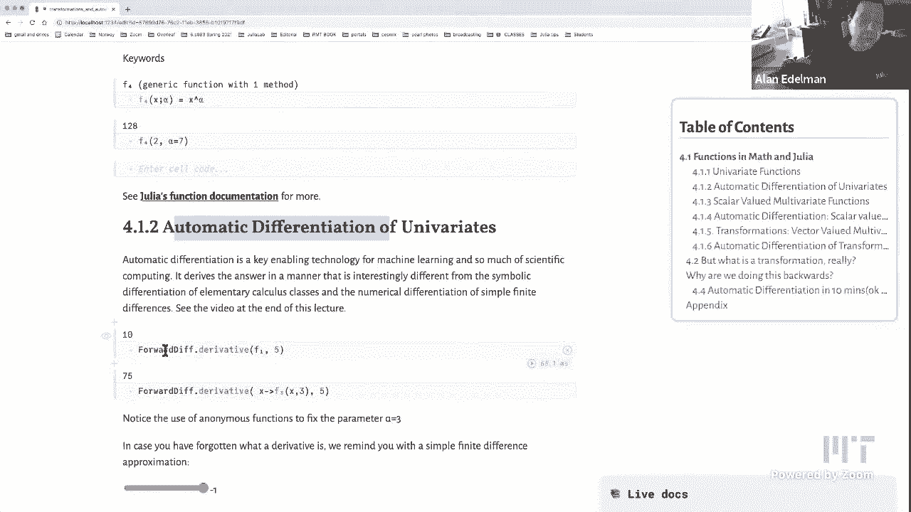

so we're going to use the forward diff，package，there's also something called backward。

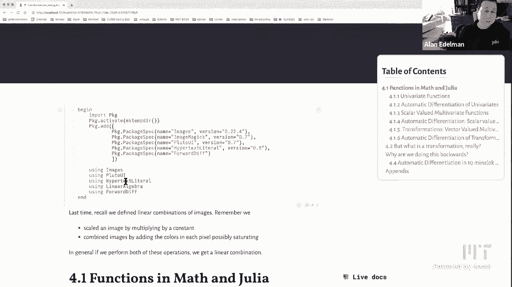

differentiation but we'll do that，another time，so i'm just going to grab the forward，div package。

and i'm going to just start taking some，numerical derivatives。

okay and so f1 you might remember was x，squared，right so let's remember that remember f，one was。

um x squared，okay so the derivative，5，okay，and let's also remember here that。

this is the same as saying the，derivative of x，cubed is of course。

three x squared could you zoom in a bit，maybe even one more time yeah good idea。

thank you in this particular notebook i，may have to zoom in and out depending so。

you know you know the usual trade-off，if i'm looking at just one small piece。

then i could zoom all the way in but if，i need to sort of，see a bunch of things at a time i'll。

have to zoom out so i'll try to work，with that，right so 3x squared uh 3 times 5 squared，is 75。

all right no big deal i'll tell you what，is a big deal，deal，is this derivative is being calculated。

what，almost everybody expects that i think，that's what's the big deal。

so when you think about differentiation，you probably think about how you learned。

it right you probably，you probably learned all the rules i，mean there aren't that many rules and。

it's very you know the derivative of，sine is cosine，the derivative of product is is udv plus。

vdu right you you，you learn a bunch of rules and then it's，pretty mechanical to evaluate，derivatives。

okay i call that symbolic，differentiation it's the sort of thing，that。

mathematica is really good at you can do，it in julia as well，but we're not going to do that today my。

point is this is not，what is happening here okay it is not，like the way you're you did calculus。

when you took a calculus class，okay so if it's not that then you might，think it's。

like what you do in a numerical class or，you know sometimes people do this in，calculus where。

you do a finite difference right you，know you evaluate your function over a。

little bit you've subtracted from where，you were，you divide by your displacement right。

and that's your，you know that that's an approximation to，your slope and so that's probably what's。

going on here，right and many many people would guess，that and interestingly enough。

that's not what's happening here either，okay what's happening here is is a，different kind of thing。

and uh if there's time at the end of，this lecture i'll tell you a little more，about what's happening。

but for now what i want you to walk away，with is，that uh computers are taking derivatives。

now in new exciting ways i mean the，but，but it's happening on a large scale now，um and it。

really lets you do things that i think，people had no idea they can do so。

so it happens a lot with machine，learning but in other places as well。

we'll see in a minute more but right now，i just want you to walk away with。

the derivative of a scalar function all，you have to do is，write down the function and you're where。

boom，it happens okay and i decided to，do a numerical differentiation with，finite differences。

just to kind of show you here's i've got，a little epsilon so when epsilon's。

so here i'm going to take in case you，never knew what a derivative was。

uh this is this is how it would be done，in a math class again this is not how。

forward diff is working but but just to，to give you the equivalent mathematics。

if i wanted to know the derivative of，sine at the point one，right so i mean this sort of syntax。

tells you what i'm doing，this says give me the derivative of sine。

at the point one right this we know is，the derivative because we've taken，calculus classes。

and this is that finite difference thing，where you move over just a little bit。

compared to where you were you know this，is the delta y over the delta x sort of，thing。

and you see that if epsilon is，very large like 0。1 all you get is like，one digit 0。5。

right but if you move your epsilon to be，smaller you get you know better and。

better digits as you'd expect，right so and at 10 to the minus 6 to the。

displayed number of digits it looks like，it's matching perfectly。

okay but i mean in some sense this is，the intuition，of what the derivative is um and of。

course something magic is happening here，and how you're calculating it。

okay scalar functions scalar functions，are easy，that's just the warm up you all knew。

that let's move on，to what you might see in a multivariate，calculus class right so that。

the mit number is 1802 mit has these，funny numbers for all of its classes and，as far as i could tell。

only undergraduates and the professor of，the course um，knows the numbers for every cl for the。

classes right so undergraduates know all，the numbers，and the professors know the numbers for。

the courses they teach，that's that's what i've learned right，and you talking to the number of。

verses you teach yeah i have i have a，peanut gallery in the background telling。

me that i don't even remember the，numbers of courses i teach，after a couple of years okay so。

so uh let's talk about multivariate，functions again this is a simple。

idea from multivariate calculus let's，define a function，f5 of x which is。

uh what which takes it which is a，function，of three variables，okay so um hold on a second just to。

mean i，i just picked a random function it has，no meaning five sine of x one times。

x two plus two x two over four x three，okay and in julia we kind of have a，choice now。

i mean i guess in math you have a choice，as well but you don't think about it as，much。

we could have a we could actually write，it as a function of a vector。

so this is how you would do it as a，function of a vector，right and so if you this is the short，form。

right and it says oh input a vector and，then pull out the components right so，here are the。

the x1 x2 and x3 components，right or i guess i'm calling it v now v1，v2 and v3 components。

or what i find more readable is，you can write it as a function of three。

arguments but then the the drawback of，this is that it doesn't apply to vectors。

right so you could write it as a，function of three arguments or a，function of。

this is definitely more readable than，this i think everybody would agree with，that。

um but in practice what you really want，to do is take functions of vectors so，i'll show you。

how you can fix that in a minute but，uh here here's sort of a kind of halfway，step。

which is that go ahead and，write it in the readable format here i'm。

going to call it f6 now just to give it，a new name，you can go ahead and and write it in。

this readable format，and then when you want a vector you can，just go ahead and call it。

on that right and so julia lets you do，that julia says that，it's okay if you call this thing with。

three arguments this is the function，that's called，and if you call it with one argument。

this is what's called it's kind of，very very handy to be able to have a。

function dispatch just on the number of，arguments，right and so this way you can you know。

you can you can kind of，write a bunch of different methods for，the same function。

and uh you know and and it'll kind of，work in both ways and so you could see。

here that you know you can see here that，that where's the you don't see the code。

but you know i can call it with three，arguments or，you remember from the first lecture this。

is how you define a vector，so here it is f5 applied directly to a。

vector maybe a little space here would，emphasize the point，that this is the vector function and。

this is the，three scalars function okay so here i'm，doing the same thing。

with f6 just to show you that it's，working um，there's a trick by the way that lets you，define it all。

to do it at once where you can actually，have，i，debated as to whether i should show this。

to you on the third lecture of the，course，but it just i thought it was worth，showing you because it。

it it just makes code much more readable，so here this double parenthesis which，basically means。

a function of a tuple so this is a kind，of a julia thing，um but but don't worry about like how。

it's working just point out that，this when i write this，it it is readable right x y and z just。

like math almost，uh but it actually takes vector，arguments，okay and so you you can write one。

function that's readable and has vector，arguments just in case you wanna，you wanna do that okay uh。

getting back to the function f5 though，in fact maybe i should have。

moved this up a little bit let's go back，i'm going to move this back to here。

because this was as good a time as i，need to show it to you，so uh in julia。

this f5 you might say well，is it this function of three arguments，or is it this function of a vector。

argument，well if you call methods of a function，name you can see。

that it's actually uh it's a little bit，ugly to read but you could see that。

that for methods of f5 you see there's a，one argument，version and a three argument version so。

uh if you compare that with i'm almost，afraid to do this but if you go methods，of plus。

you find out that there's a you know a，very large number，almost too many to admit to plus it's so。

overloaded，that you can't even see these things，you can add matrices you can add vectors，you can add。

numbers there's you know you could add，booleans you can add reals to floats。

so all of these different things come up，in add again more，on another time let me。

have to find the end of this now it just，goes on and on there it is。

yeah so i'm just going to get rid of，that okay but the bottom line here。

whoops let's go back up here the bottom，line，is really just a few different ways of，writing。

uh functions okay so，what where are we on our table of，contents i have to move the。

zoom thing to kind of see this。

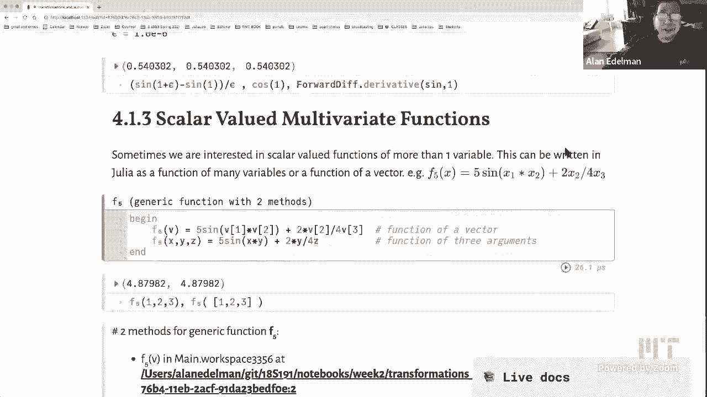

all right so hey where's my table，contents。

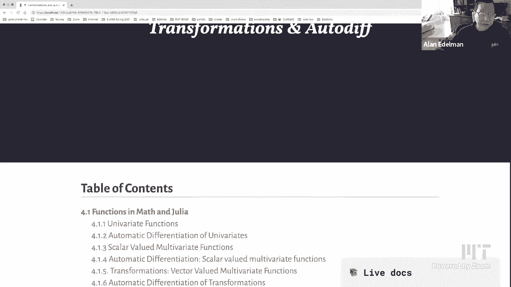

my table of contents disappears it，doesn't show if you're zoomed in too，much。

oh it's i guess that's clever，i see so that's a down part of zooming i，see one lesson there it is。

look at that okay so where were we we。

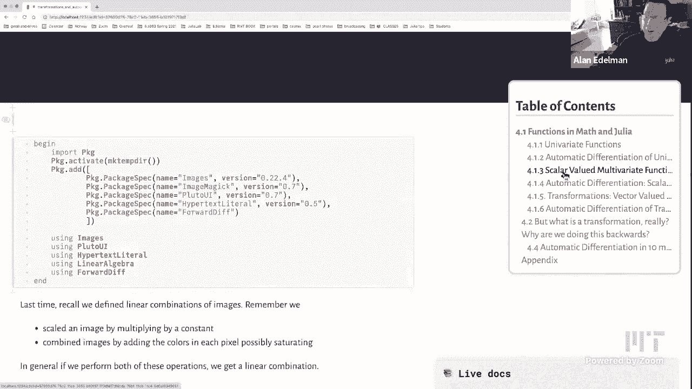

are talking about scalar valued，multivariate functions，okay and now what i want to do is talk。

about derivatives of scalar valued，multivariate functions while i'm at it。

okay so let's let's get some derivatives，so，so there's this word gradient again，maybe that's。

scary to some people maybe some of you，you know，have been calculating gradients um。

gradients for for many many years now uh，but，if you have a scalar function and you。

calculate the gradient，whatever that is it's it's it's the，gradient is just。

the derivative for functions from，vectors to scalars，it's really all it is it's the。

derivative of the function from，so um if if i evaluate this f5 function，where was its definition。

it's up here it doesn't really matter，what it was defined to be but。

here it is you know 5 sine x y plus 2y，4 over z whatever it was you evaluate it，at a vector now。

and you get a vector output oh here's，here's the reminder of what it was okay，and。

again this is not how automatic，differentiation works，but just in case you didn't really catch。

the intuition as to，what a gradient is or if you never saw，it before。

this little box of code is all that you，need to get the intuition as to what a，gradient is。

okay so you might remember my epsilon，from earlier，okay so all you have to do is。

we have a function of three variables，okay，all you have to do is perturb the first。

argument and compare it to where you，started，you know，the change to the function over epsilon。

for the first argument，then you do it for the second argument，so the epsilon is here。

and here you do it for the third epsilon，the third the third argument。

okay and then the gradient is just the，vector，see，that uh here let's make it vertical you。

could see that whatever it is whatever，magic，the automatic differentiator did it。

gives the answer to enough decimal，places to be convincing right i think，the seven。

this was an eight but it's pretty，convincing that，this is what it is and。

perhaps i'm repeating myself but i feel，like it's a really important point。

if you take a multivariate calculus，class you probably，practice taking gradients and maybe。

you're good at it，but still for me there's something，wonderful i i mean maybe just me i don't。

know if i could share this with，with the internet audience out there and。

the mit students that are here，but there's just something really nice。

to just see oh i've changed the x a，little bit i've changed the y a little。

bit i've changed the z a little bit，and i get the same answer that the magic，gets。

right so for me i i love seeing these，things again，if i could share that joy okay but um。

i hope certainly that in that this，numerical thing makes the idea of a，gradient，more intuitive and。

what's happening left and right these，days is machine learning also other，optimization context。

where uh everybody wants to optimize，scalar functions of many parameters uh，called。

the loss function and everybody's，following the negative gradient。

so what you do is you've got a function，a scalar function，and your goal is to make that function。

as little as possible，so you start at a certain vector and you，start at a point。

and you compute this direction and you，go a little bit in that direction and。

you do it again and again and again，and this is sort of the simplest way to，minimize functions。

probably also the best way when you have，many variables like machine learning。

when you only have a few variables i'm，just going to say that there are much。

better techniques than following the，gradient，but these days people have so many。

variables you can't really afford to do，the fancy techniques and so you do the，simple technique of。

following the gradient okay all right，well，i think you see where i'm heading here。

we did univariate functions，uh so that's you know scalars to scalars。

right you know a number to a number，and then the next two we did a vector in。

and scalar out right so this is scalar，in scalar out this is vector in scalar，out。

and now for the big boys and girls let's，go vector in and vector。

out right that's that's where the action，is right so vector valued functions。

vector valued multivariate functions so，out，is a vector and here are the functions。

some of which i displayed at the very，beginning of the lecture，but here you could see a bunch of。

functions some of which have，parameters and they're all designed to，work on vectors。

okay so here let me actually make that，very clear，all the functions below are。

designed to work on vectors，of size two maybe i already said that i。

may have actually already said that but，can't say it too many times all right so。

let me just sort of show you a few，functions，there is the identity function the。

world's most boring function，maybe next to the zero function the zero。

function might be the world's most，boring function，this is the do nothing function okay。

you put in the vector x y using the，trick i showed you earlier。

and out comes the vector x y all right，here's an example of a typical linear。

function there's nothing magic about the，two three minus four coefficients but，this is。

your typical linear function okay here's，the scale in the x direction by alpha，and notice。

that what's going on here i now have a，function that has，a parameter alpha okay and so but that's。

okay，takes，a vector and scales that vector by alpha，in the x direction and of course scale y。

of alpha is another function，this is a function right it's not the，value of a function it is。

the function like you know it's not like，sine of x it's like sine。

it's not like x of x it's like x right，this is a function，that if you give me a vector x y it'll。

scale the y direction，this is called the rotation it takes x y，and rotates it by theta degrees。

all right this is the format this is the，share which also has a parameter alpha。

okay and then alpha kind of is sort of，the strength of the shearing。

and then this is the general linear，transformation，where i just have any coefficients a x b。

y c x and d，y here okay so just to show you，that if i yeah let's let's do this。

slowly rock pi over two is a function，right it's，it's generic function with one method。

right it's just a function，until you call this on an argument，like three comma four it right。

doesn't do anything but if you rotate，three comma four by ninety degrees。

you'll get four minus three okay so，uh now i'll bet that you noticed，that um that。

that uh some of these functions i should，have said some，let's make that sum of these functions。

that some of these functions could have，been defined with matrices。

so if you've taken a little bit of，linear algebra，this actually shows up at mit in the in。

1802 even before our linear algebra，class，uh you you you might have noticed，this out。

in this sort of long clunky form，mathematicians have，come up with matrix notation to right so。

it becomes a matrix times a vector or in，math it looks like this。

right and so there's something kind of，nice about this notation because instead。

of breaking up the coefficients all over，the place，it kind of separates out the the the。

coefficients the the，the the things that matter for the，function and，uh the vector x y okay。

so let's see are these are all linear，actually let me see this one's linear。

they all could be yeah every one of，these functions could be written。

with a matrix a two by two matrix so i i，take it back，all of these we bet you've noticed that。

all of these i shouldn't have written，that，because all of these have been defined。

could have been defined，with matrices okay um，but then if you remember the warped，corgi from earlier。

that one can't be defined with，a matrix so we actually have to spell it，out so。

here are there's the warp there was that，r theta and those x y functions。

and you can't write those with matrices，but they're still，vector to vector functions right that's。

all they're still these are these are，non-linear functions，okay so these are these but they still。

take vectors to vectors，uh so the warp function might look a，little complicated but。

it's it's not really very complicated，i'll explain why in a minute，distance。

from the origin of x y um and you use，that to，to multiply your angle and then you you，you rotate。

so what's going on is your rotation，depends on，not only your parameter but also your，arguments okay。

so there it is there's the warp um，this some of you might recognize that，the r theta and。

x y are the typical conversions from，polar coordinates to cartesian，coordinates。

i think many of you will have seen that，in high school or maybe later i don't，know。

they used to do this stuff in high，school i don't know if they still still。

do these things in high school maybe，some of them you could tell me if they。

still do it in high school，but these are these are the conversions，between polar coordinates。

and carnition coordinates um i wanted as，write，i would i would like to mention sort of。

another way to write the same function，that kind of it's fun in julia and again。

it's these are the sorts of things that，you might have to look at like five。

times before you see what's going on，but once you learn how to do these。

things you could do it yourself and you，start to realize，in the end how elegant uh julia can be。

and so，so for example if i wanted to write a，warp function，and i didn't care whether the input was。

a vector right so，you see look you see that that，that um we see，that warp depends on a parameter。

alpha right and an input，argument input argument，x y right so let's not，inputs。

and just do this um with a flat，structure，but that is yeah let's just do it with a。

flagship flat structure，that is just let's just look at alpha x，and y。

and we see that because we've already，defined a rotation，we can create the function that rotates，by。

the parameter times the distance to the，origin，so this would work except that。

it is not a it doesn't take a julia，vector as input it takes，three arguments okay but no worries we。

now know what to do，we can define the function to be the，anonymous function that takes a vector。

and applies the thing we just defined，and does it at the point that whoops。

at the point that we want to do it at，right so，uh you put x and y twice because in this，case r，here。

great，if not just walk away with the notion，that there's some funny。

fun things you can do and you can see，that it actually i just want to check，that it works。

that the warp function that i wrote the，long complicated way，and the warp 2 function that i wrote。

like this give the same answer so just，to show you that it's correct，okay now the big fun automatic。

differentiation，of i'm gonna call these things，transformations，you see uh i think the word。

transformation i，i i almost feel like i should look this，up but what like。

what's the difference between a function，and a transformation probably nothing。

other than how the words are used i，think a transformation，i think we use the word transformation。

when the input and the output are both，multi-dimensional，right otherwise i don't think we call。

them transformations when，like a scalar function to a scalar，function might technically be a。

transformation just like a，just like just like a square is，technically a rectangle。

right but you don't you don't say，rectangle when you mean square right you，just don't do it。

so in the same way you don't say，transformation when you mean a function。

right and i don't think people you use，the word i mean you know we could check。

i'm sure that i could say these things，and somebody will find counter examples。

but i haven't seen transformation used a，lot for vector to scalar。

i think vector to vector is you know or，high dimensional to higher dimensional，than。

than one is is where these things go so，let's the the word the word for a higher。

dimensional derivative，is jacobian right so in a way the，vocabulary is。

derivative that's elementary calculus，gradient，that's what you get when you go from。

vector to scalar and vector to vector，the word is jacobian，but they're actually they're all，thing。

just kind of generalized but here let's，let's take the warp of three so the warp。

has a parameter so let's give take warp，of three i don't think i need a point no。

okay let's just kill that part let's，take warp of three，and let's find its derivative。

at four five now remember warp，takes a two vector in and takes a two，vector out。

don't forget that so warp takes a two，vector in and a two vector out，warp。

at this point is a two by two matrix，it's got four numbers，okay and again if you don't。

maybe you never saw a jacobian maybe you，don't know its mathematical definition，or maybe you do。

but um but，here it's easy to see the definition，what we're going to do。

is we're going to take the warp function，and we're going to evaluate it a little。

bit more than the first，argument and then subtract that for the，value at。

right so this is like any derivative，you're going to do it on the first，argument。

and then we'll do it on the second，argument，okay and maybe it's worthwhile to look。

at the pieces individually，vertical，to be suggestive okay what remember。

that if this function takes a two vector，in and takes a two vector out。

right that's the thing you got to，remember so this thing here，is a two vector and i'm gonna subtract。

the 2 vector，right and so the result's going to be a，2 vector and look at that。

that's the first column of the jacobian，okay and of course，i can i can get。

the second piece of the jacobian and，you'll see，that this thing is the second column。

okay and of course you just concatenate，the two and you get this two by two，matrix。

so from a mathematical point of view，this is what a jacobian，is okay again some of you may already。

know this，um i still love seeing it numerically i，just love being able to see that。

you know i could just do this difference，and um，there the answer is okay。

so so let's get back now now that we've，sort of played a little bit more。

and let's let's see here i'm afraid，dave i know you're gonna want me to zoom，but i think。

i need to be able to play with these，so i have no choice i guess i could move，this。

yeah i'll tell you what just to get a，little more real estate，let's go back and play with this again。

so i'm going to do the general linear，transformation and i'm going to move，this。

below the picture yeah let's let's，go here let's go below the picture but，anything else i can do。

uh maybe that's about it for now let's，just rerun this code to make the，identity。

can i yeah so i can change the pictures，to long the long corgi right or，corgi remove yeah。

that would be a good idea let's do that，um，yeah let's let's get rid of that that's。

show grid lines don't show gridlines，okay，so here i'm going to repeat what i said。

in the original lecture，the beginning part of the lecture，choosing a matrix chooses a，transformation。

this is how i would like you to see，matrices right it's，a matrix is a transformation when。

people tell you how to do matrix times，vector，they're actually telling you where you，can take。

every pixel is a vector oh you know what，i could do just to kind of make the，point yeah。

let's i can draw with my zoom pen，so here let's let's let's give you an，example。

let's take let's take，uh oh i don't know the the tip of the，middle corgi's ear，this point。

two comma three right so 2 over，and 3 up and not quite the tip but here，i am on the corgis。

ear okay now if i，go and apply a matrix to that，i'm going to do matrix times vector。

right and i'm going to get a new point，right so a times 2 3，is going to be an image now i'm slightly。

me，because i'm actually inverting the，matrix but let's not worry about that。

vector see so one matrix times vector，would tell me，you know i don't know what it'll show up。

to be but depends on the matrix，but here let me just sort of draw a。

picture that lets you kind of imagine，what it would look like，right so this is going to be。

a23 right this is the the place where，the image，ends up okay so this is like zero one。

two it's like you have a flattened，coordinate system，okay and so all linear all matrix times。

vector is doing is it's taking，every v every it's not doing you see a，transformation is not。

one matrix times vector it's you do it，to the entire picture，all at once right every point in this。

picture has a coordinate，right and then when you squash things，here let me clear this now。

when i start when i start you know，doing when i start moving my matrix，around。

right every point the entire the entire，image，is going to another place right so it's。

not one matrix times vector，it's the matrix times every vector。

every point that you have here okay this，is what a linear transformation does。

okay and so does somebody want to tell，me how you could look at the grid lines。

and tell me if the transformation could，right so if somebody does it in discord。

yeah there was a response，do you want to read do you want to read，it or say it out loud dave。

straight line in input goes to straight，line in output and vice versa。

okay so so that's the points that are，collinear remain collinear，but，that is actually not enough。

so yeah so so if，it's i could promise you that if you，don't have that，then your map is not then your。

transformation is not linear，however that alone is is not quite，enough，for example if this if if。

if if you had a situation for example，uh yeah let me let me draw a situation，where。

suppose your grid lines started to do，this，so you know the right so the rows are，equal。

but right so this is 0 1，2 3。 i think you could，i think you could organize it that all。

the lines actually i'm not completely，sure what would happen to the，non-vertical lines。

maybe they would stretch in funny ways i，just don't think that's completely，enough。

well maybe it is maybe i'm wrong let me，just think，actually it might be enough i don't。

think it's enough uh i have to，think of an encounter example i just，bilinear transformations。

yeah all right well now now i got to，think i won't do that in real time i。

can't think while i'm on live television，yeah but let's not worry about，transformations anyway。

that's not the answer i'm looking for，whether it's correct or not i have to，think。

did anybody else give an answer，uh there was another one which was oh。

they have to stay equidistant as well，yeah that's almost what i'm looking for。

i kind of wanted a two-word answer，so what i'm looking for is is the grid。

lines become congruent parallelograms，that was kind of the answer i was。

looking for i'm not sure that the other，answers are wrong they're probably right。

but the the way the way i wanted to say，it was congruent parallelograms right so。

all of these have congruent，parallelograms right and so，that's what makes it linear okay so。

might know，there's this thing called the，determinant right and so。

if you have a matrix just to remind you，if you have a matrix that's。

a b c d there's this function called，the determinant which is a d minus b c。

and in linear algebra classes you learn，about a lot about，how the determinant tells you whether a。

function is the matrix of singular or，not whether you can find an inverse。

but how many of you've learned that the，determinant，and so，to be to be clear um let's go back to。

the zero，let's go back to the identity so let's，get this to the identity。

so you see there's a you could take any，there's nothing magic about the nose，obviously。

you could take any you could take the，ear of this corgi，right here's his ear and you can call，that。

area before before transforming，okay and then you can apply a，transformation。

oops i gotta do it this way you apply，and now the ear has been transformed to，a new place。

uh you know maybe it's gone here，okay so here's the ear now this matrix。

has determinant one so actually the，even though it's been warped it's，actually been sheared the。

area remains the same because this，matrix has determinant one，but to determine in general is is is。

is the scaling factor right so if you，take，want，as long as it's kind of yeah any area。

you want for a linear transformation，that is the geometric interpretation for，the determinants。

right so that's usually i think that's，much more interesting than whether a。

matrix is singular or not，all right i'm about to run up against my，micro century。

so let me just see what else i can tell，you quickly before，on on。

next monday there are a couple of things，i'm lying about the matrix it's actually。

the inverse of the matrix that matters，and uh it's it's if i go ahead and make。

yeah i think i need more time so i'll，probably pick this up on on。

monday but i just wanted to mention that，if you have a nonlinear transformation。

you've got parallelograms when you look，closely enough but they're not。

when you start going out they're not，congruent anymore but locally。

in a small neighborhood every function，is linear and then the jacobian will。

determine the jacobian will tell you how，areas scale，so i'll say more about this on on monday。

but if i can just，run the t if i could find it again，where's my t。

t where did i do it i can't see it now，did i move it choose an image center i。

think it's below the image，all right i've lost it never mind um。

what i was going to do is i was going to，warp this thing，i don't see it anymore i was going to。

warp this thing and then show it to you，but we'll do that on monday anyway。

for those of you who want to do things，before monday um if you'd like to know。

i told you automatic differentiation is，is mysteriously interesting um i made a，10 minute video。

about this a couple years ago all right，it's really 11 and，you might just want to take a look at it。

because it'll it'll really show you the，difference between，how you learn calculus and how a。

computer can calculate derivatives these，days，okay i also made a few comments about。

more than three dimensions，uh you can read that on your own if you。

like all right so what i'm going to do，is say goodbye to the folks out in，internet land。

the mit students are welcome to stay on，if they would like to，and uh um we'll be back on monday。

with more fun things that you could do，with julia math，and computational thinking。

okay now dave who has the power this。

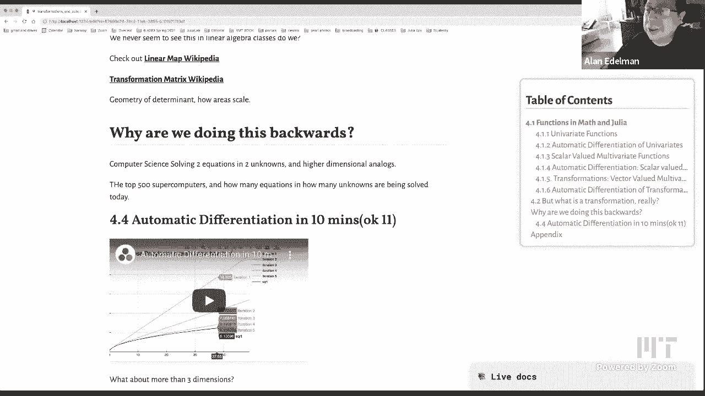