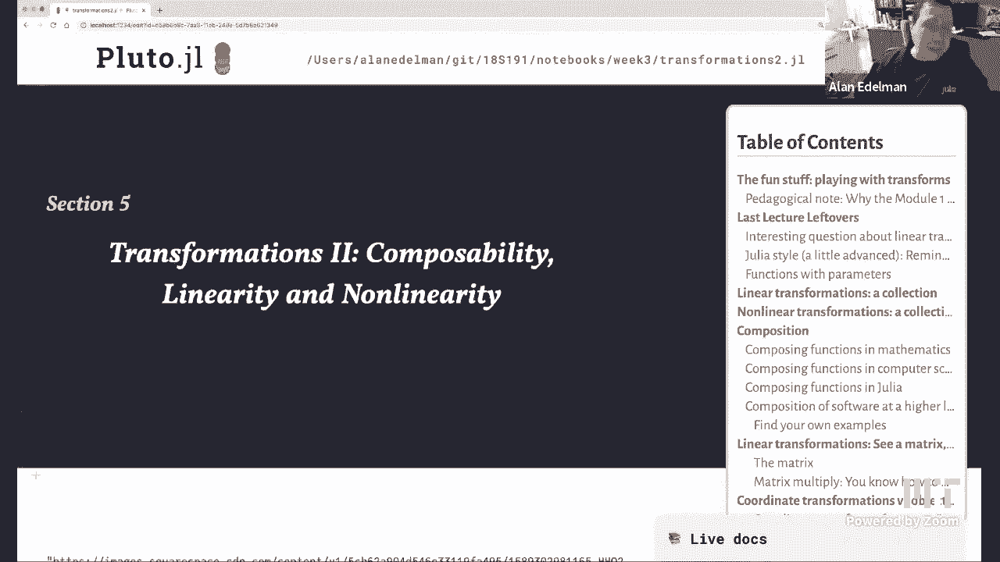
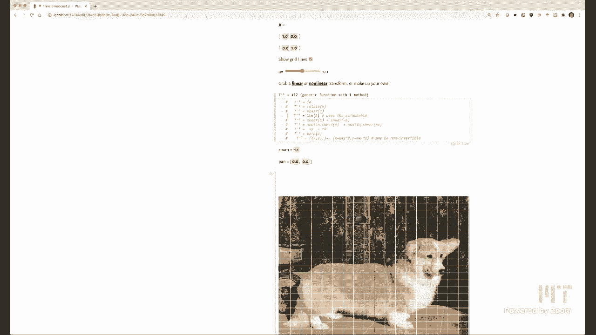
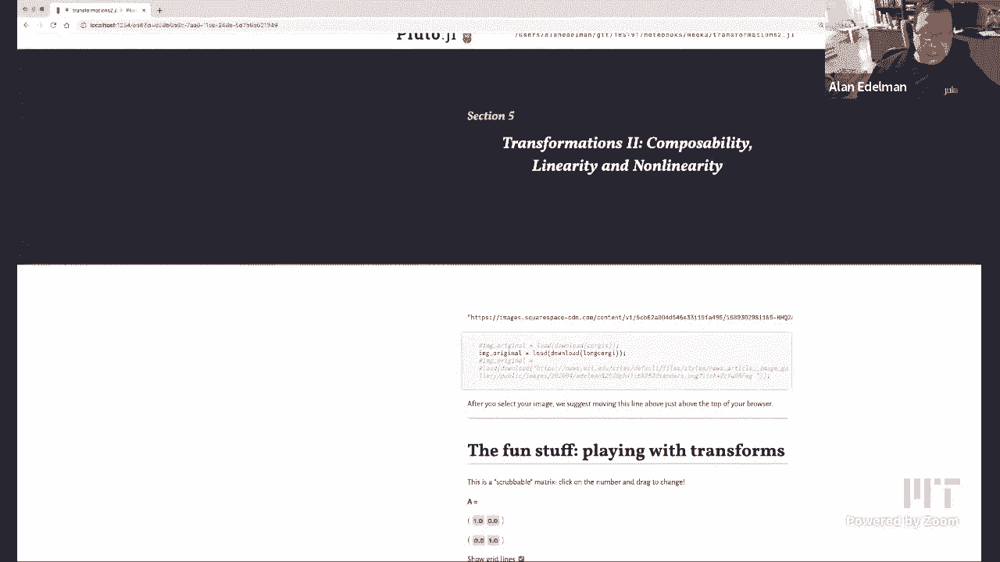
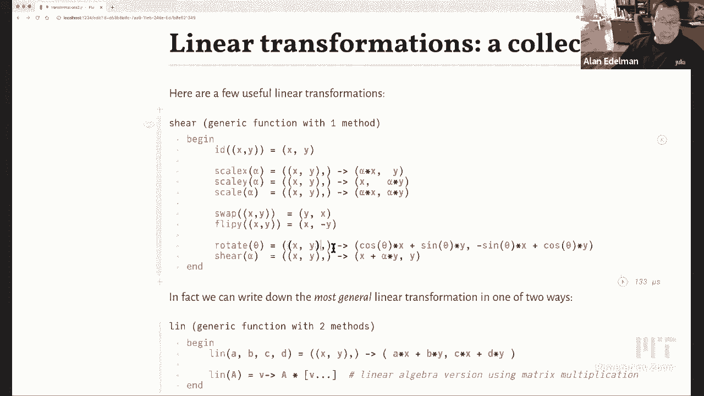
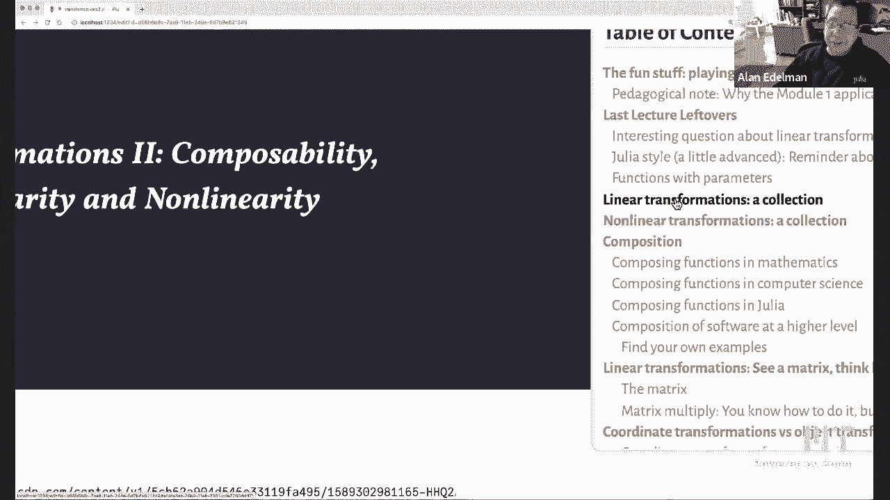
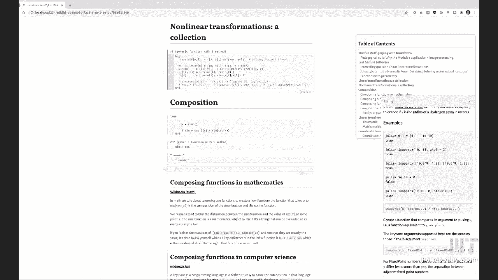
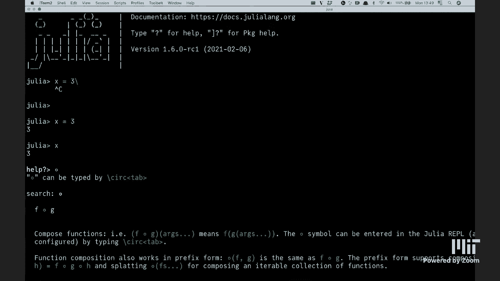
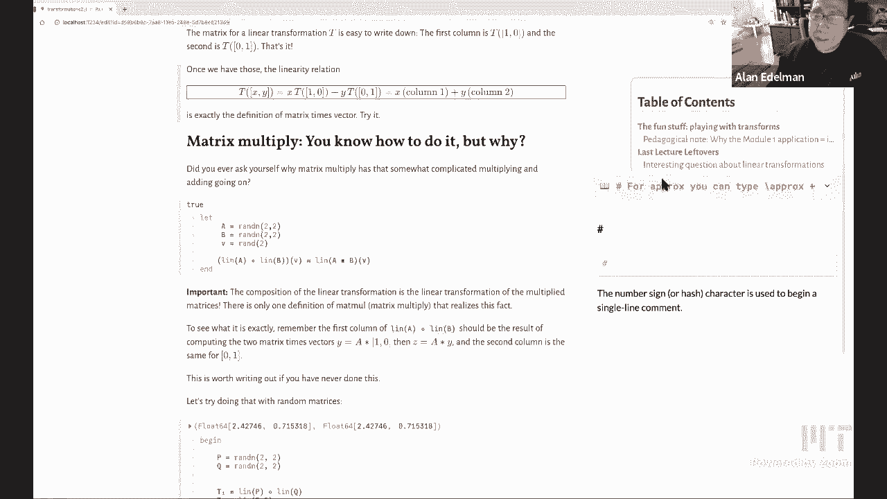

# 【双语字幕+资料下载】MIT 18.S191 ｜ 计算机思维导论-Julia(2021最新·完整版) - P4：L4- 变换：线性变化与非线性变化，组合变换 - ShowMeAI - BV19g411G7ab

hi everybody out there in internet land，and to the mit students as well。

so welcome to this week's julia，computational thinking class，so we had a lot of fun putting together。

this notebook over the weekend，so today's lecture is going to be，nominally about。

transformations um but maybe i'll do a，quick sound check，can i be heard yes。

now linkedin all right great thanks very，much uh，but in addition to talking about，transformations。

and various mathematical subjects uh，we will also talk about uh composability。

composability in mathematics，composability in computer science，composability of software。

is a big topic but，let me start by actually playing with，what's in this notebook so we did a。

little bit of this last wednesday，but i think it's fun just to start，playing and so。

uh you can go right here to the fun，stuff you could click on the table of，contents if you like。

and play with any transformation that，you would like let's just start with，that。

so um i'm labeling the transformation，with a t，and a superscript minus one for t。

inverse i'll explain，a little bit later on why that might，sound backwards。

uh but that's uh but there's a reason，why we're going to call it t，inverse and not t so i，kind of。

can be seen in one window so you might，want to，let's see here let's just make it it。

depends on how you resize it of course，but yeah let me make it smaller so you。

can see the big picture and then i'll，make it larger so we can zoom on in。

but let's see so you've got the grid，lines which，is actually being added to the to the。

original image and the processed，we image kill this thing right here give，zoom，zoom。

in zoom out uh with this，with this right here we've got a nice，pen，can you zoom in on your notebook。

well i was going to do that you can't，do that at the moment but i wasn't。

saying yeah i wanted to also be able to，reveal，here okay so just a quick thing just to。

show you how to use this，panning eventually we might want to just，do this with a mouse but。

this isn't so bad and this this works，with pluto that you can zoom。

in the x direction and the y direction，just by，grabbing and this this scrubbable。

okay and you've got these parameters，these，right now we're just applying the warp，so you can。

uh you can kind of bunch up the poor，corgi or leave them in good shape。

okay and of course you could put any，picture you like all you have to do。

is replace what's in quotes here with，whatever particular with whatever。

picture off the internet you like，or of course if it's on your computer。

all you have to do is just load it the，file name，so you get to play with all this and。

what's wonderful is this entire，notebook is completely self-contained so。

this whatever however this thing works，it's entirely in this one notebook。

and there's something very magical many，of the students from previous semesters，really enjoyed this。

that you you put together something from，beginning to end you feel completely，control。

in other courses maybe some of you might，have taken that you，people will give you sort of like 80 of。

the code and you're supposed to fill in，the missing part and i understand the。

reason why people do that，but you always feel a little bit out of。

control like what is it that's there，that you didn't understand。

so this entire the entire code for this，is completely here and，let's just play with some of these。

functions before we，delve in and so here we i've got a，number of functions you can。

you can actually click on these linear，transformations if you want to see a few，of them。

we have things like scaling and flipping，and rotating and shearing these are the。

linear transformations，we also have a bunch of non-linear，transformations。

translate is technically non-linear，though it feels linear，because the definition of linear。

required zero goes to zero，so in general translate move zero we。

have this non-linear shear that we're，going to play with，the warping is clearly non-linear and。

some other nonlinear functions，here are a couple of others we made up。

and we played with so i would like to，encourage，everybody to kind of make up a function，and just。

in in，in years and years of math courses，people would draw a little diagram maybe。

they'll just see what happens to，a square maybe there'd be a curve i，guess with plots you can。

maybe more clearly see where the，contours would be but i i like images。

i love honest to goodness real images i，think there's nothing like them。

for building up an intuition as to how，transformations really really really，work。

so just to emphasize that we are sort of，taking，each pixel as as representing that，particular point。

on the plane and we're seeing for each，pixel how does that move around。

yeah if if i could i would actually zoom，in on a pixel let's see if i can。

if i can actually oh nah i mean i'd be，kidding myself if i told you i could see，the pixels now。

i don't know see if we can get a little，closer even trying to zoom in some more。

this is about as far as i can go i，i do almost think i see yeah i see the，pixels。

they're like little rectangles i don't，you can see，but you see them as well yeah so。

and actually dealing with pixels adds a，small complication，it's not conceptually harder but adds a。

small complication than just dealing，with，with you know pixels are discrete as。

opposed to sort of the continuous curves，as they would might be presented in a。

mathematics course so you just have to，deal with that but，uh it's worth it i would say because you。

get these nice，pictures so if i may continue to play，with some of these。

just you know just like i was in，photoshop or something，but this is better than photoshop。

because i've got control，defined，because they're just somewhere down in。

the notebook all right so i will zoom in，here，and you know just i want you to i want。

you to do this with me i don't want to，just do it for my own fun i mean。

i could do this all day mind you but you，know rotate rotate the corgi there we go。

um so this is rotating the corgi um it's，just taking this parameter alpha。

and just rotating it around and it's，pretty fast，i would say so there's the rotate。

i could instead play with shear again，you can make up your own function any，time。

so here's the the shear function and，what shearing does is it kind of。

kind of bends the parallelograms if you，will okay until they're almost。

unrecognizable if you will right um we，can go the other way，with shearing so there's shear the。

horizontal lines，stay on the same horizontal line that is，true when they share。

that is that is absolutely true we can，now，do uh we could actually define the。

transformation with any matrix，and for that this is where the the，matrix over here applies。

and maybe i'll just go down a little bit，i feel like there's a lot of wasted real，estate here i know。

dave's going to want me to zoom in but i，down。

next to the move the matrix cell。

that's true if oh except that i always，mess this up let's do that let's move，down here we go。

that's not a bad idea actually okay then，i can zoom in，i keep forgetting that this thing is。

infinitely flexible，right which is actually good to keep in，mind so。

uh here we're applying the matrix and，i like to argue and you'll see more，about this in the notebook。

that in a way this transformation，is the matrix and so i don't like to，think of matrices。

as just arrays of numbers i like to，think of it as linear transformations。

and if you want some intuition as to the，various different kinds of。

transformations that are available you，can just play with the，different elements of the matrix and。

you'll see that，you'll see that what what it does to the，point of when you get these。

parallelograms that are sort of big，and and needle shaped i don't know what，the word is。

you can't even recognize the picture，anymore，right but again you could play with this。

a little bit and see，what it's doing uh but one thing for，sure with matrices。

is that a grid of rectangles will become，a lattice of parallelograms right these。

these the the the grid of equal size，rectangles becomes equal-sized，parallelograms。

and this is in my mind truly the action，of a matrix，right not not a bunch of elements but。

literally this transformation of a corgi，or whatever other image you're playing。

with this is really how i would like，everybody to think of matrices。

and not just as tables of numbers okay，so we'll say a little bit more about。

that but let's let's just play some more，uh this symbol here and it's i mentioned。

it later in the notebook but just to，kind of preview right now the symbol，means compose which。

it means that you're going to shear with，minus alpha look i could do these。

out of the way now so let's put that，back out of the way，okay so this says it goes from right to。

left it says，shear minus alpha and then shear alpha，and you'll notice that it doesn't do。

anything so no matter what i change，this operation and this operation cancel。

each other out we say that，these operations are inverses of each，other。

okay so that's coming in this lecture as，well let's play，why don't we just play with a non-linear。

shear justice，since uh everything we've done right now，has been linear let's see what a，nonlinear。

operation might look like so here's a，non-linear share，and there's something parabolic we could。

actually look at its definition here but，these are actually parabolas now。

but what i'd like you to notice is that，if you just look at sort of a small。

section it's still just a bunch of，rectangles，right it's it's it's they're slightly。

curved and they're warped，but if you get smaller and smaller in a，small patch。

in a small patch everything is kind of，almost linear，and so much of applied mathematics is。

based on the fact，that if you look in just a tiny little，region if you made if i made my original。

rectangles，smaller or if i drew more if i drew more，gridlines，you would see lots of here i guess i。

could pretend to draw，i mean i guess i could really draw it，but why don't i just pretend to draw it。

because it's easy，so i mean i think it'd be easy to just，sort of imagine what it would be like。

if there was a grid line i'm just doing，this freehand so don't take oh。

i guess i can't do this very well but，you can imagine that，these parallelograms right the smaller。

ones，get more and more parallelogram-like，more and more like a linear operation。

okay and like i said this is what so，much of applied mathematics is about but，if you。

if you just look locally if you just，look at a small region，every map looks linear okay and in fact。

before computers，that was kind of like the only game in，town really that pretend everything is。

linear and hope for the best was kind of，the，the most most analytic techniques before。

computers were invented，okay so that was the big game in town，it's still a bit of a game。

okay some other nonlinear，transformations that i had，i showed you this last time but i'll。

kind of you can play with them again，i have the the polar to xy which is kind，of crazy。

i mean the corgis are kind of ripped to，shreds and put in different places。

um the the other one that i had was the，so that goes the other way and you can。

see the the sort of fanning out，and i'm hoping you're playing you know，you're playing along with me。

uh but if you put the two together，actually let's do it the other way first。

if you put the polar coordinates to x y，and then go back round trip again。

you'll see we come back with the，original picture and so uh going to，is。

is is they're inverses of each other，okay and，here here's one that i just made up。

just for fun again you could type any，function you want，it depends on this parameter alpha so we。

can play with it a little bit，oops whoops what did i do i scrolled。

okay so let's see i'm going to go down，one level hope that's okay david。

okay but here let's let's play with the，alpha parameter，so when alpha is zero nothing happens。

but as alpha starts to get big the poor，little，corgi gets scrunched and pulled and i，him。

in fact it gets doubled up right so，that's kind of，so not all maps are one to one。

so if you see when i do this look this，corgi has two heads it looks almost，scary。

okay and uh and what what happens to the，parallelograms and，you'll start to notice i can zoom in now。

you'll start to notice that these，parallelograms are starting to get。

really messed up like over here what，the the parallelograms get squashed down，to。

zero and then here you could see they，they look really strange right。

and so uh this can happen to functions，these are called singularities。

okay and uh they they correspond to，to the linear approximation being uh。

being really weird okay so here are some，of the things to play with i don't know，before i move on。

anybody have any of the functions that，you'd like to see i could make i could。

do any function you want the functions，are going from minus 1 1 to -1 1 in the，x and y coordinates。

so if anybody has a function or let's，see if there's anything to chat。

okay nothing at the moment but if，anybody wants to just try a function i，don't know what'll happen。

dave you've got a favorite function，you'd like what about something with。

something periodic like a sign oh i have，no idea let's try it。

so i thought it would be something like，sine of 5x，sine of alpha x we could kind of oh yeah。

good idea we'll play with the parameters，sine of alpha x，comma y alpha times x comma y to start。

to start with and then we can see see，what happens i've never tried that，before。

okay so let's see so let's start with，the alpha，maybe i'll move the alpha down now that。

you taught me that i can just do that，let's do that，again i hope you guys will be doing the。

same thing but here let's，if i guess i make it really periodic do。

i want a large alpha or a small alpha to，make it without it，yeah there we go nice oh gosh that's so。

strange，somebody said somebody suggested the，helmet curve i think that might be a bit，tricky exactly。

you got to give me the function yeah，you've got to you've got to write down。

the function you got to write it you，write it down i'll type it in i'll copy，and paste it。

oh this is freaky it's too freaky for me，okay so，let's make it freakier uh put a cosine，in y，this is。

that just doesn't work oh but you need，yeah you've put you can put that。

alphabet into one i guess probably，i'm not even sure if alpha one is yeah i，don't know。

oh wait i'm getting some something here，okay you can do arbitrarily weird things。

so so white space doesn't mean it's，broken it just means，that uh it's outside the。

it's outside the window that we're，plotting in，is actually it's because our original。

image is embedded in a white，a white square correct so that's。

quite cool actually yeah you could make，a kind of，piling pattern or a mosaic this way，there we go。

could，you know you want somehow 10 alpha times，x times y or something。

oh i'm going to regret that it's going，to be terrible i think so。

okay last last chance for somebody to，to to mention a function you'd like to，play with but this is。

maybe i'll just make another pedagogical，point where，i've seen over the years and maybe some。

of the students have seen this also that，you know professors make these demos in。

the past they were these java uplifts，and you know you're you're you're。

limited to seeing whatever it is the，professor wanted you to see so。

they might have picked a few functions，but we you know we think that you should。

be able to have any function that you，could dream of just put it in，and and have the full power and。

sometimes these applets have uh the，ability to write your own function but。

you but basically you're writing a，string and then that string somehow has，to get。

passed get converted into an actual，piece of code but here we're just。

writing the code because we have this，interactive，research basically right so it's，completely live。

yeah all right so you get the idea we，have these，let's go back to the identity just to。

kind of return everything back to normal，so we've got these images and。

maybe now one more pedagogical note if i，may and say，so you've been in this class now we're。

up to the third week，and you've been sticking with us and，maybe you're wondering。

why are we doing image processing is，this an image processing class。

i mean is that there are classes on，image processing，and as you probably picked up。

on from me already the we when this is，not an image processing class。

the image processing is merely the，motivator we think that playing with，images is just so much fun。

what we really want to do is teach you，this combination，of of computer science and math and。

julia programming，that i think could only be done in the，way where we're doing it and so。

uh you know and you'll see that the，other modules that come up will have，to make。

in terms of you know as we put this，class together is i think about the time。

i learned a foreign language so i was a，graduate student at mit。

and i took a french class at mit and i，remember the textbook。

the textbook you know the whole goal was，to learn french but you didn't just，learn french。

chapter by chapter there was a french，construction but there was also。

uh how to offer how to order a coffee in，in a in a cafe in paris。

or how to go to the post office or how，to do your laundry i mean all these。

very useful things you know if you're in，france and you also learn things like。

like the culture of france right，and and you know how people think about。

things uh what you know things that are，different，so in a way that analogy was what kind。

of stuck with me，with you know we want to teach julia but，we want to teach it with an application。

like like，doing a laundry right or or ordering a，coffee，so uh the image processing becomes sort。

of the sort of cultural background if，you will，so that we can present learning julia in。

a real life context，okay otherwise one ends up with these，sort of what seems very dull to me where。

you know here's a for loop here's an if，statement，i mean i couldn't imagine to me anything。

more boring than what's a for loop and，what's an if statement，okay so uh there were a few leftovers。

from the last lecture，and there one one of the folks i think，was on the discord i asked so what is a。

linear transformation，and there was an interesting wrong，answer i love interesting wrong answers。

interesting wrong answers are so much，better than right answers。

i wish everybody would always give me，interesting wrong answers so。

uh so somebody proposed something like，this that，if a transformation takes lines into。

lines and perhaps preserves the origin，then maybe that is a linear，transformation。

and i vaguely remember that when，somebody said that，i don't know。

maybe i'll go back to the recording and，see what i really did but i remember，being。

not so sure about that that that this，would be enough for it to be。

linear in the in the traditional sense，and for now let's think of linear。

as taking those rectangles into those，nice lattice of parallelograms。

and we found this perspective map i，would love to implement it in julia。

but uh we took this one from the khan，academy，and it shows that you know if you have。

like a nice set of rectangles on the，floor and you look at it in perspective。

some of you might know there's this this，concept that comes originally from art，the vanishing point。

right the parallel lines uh when you，when you draw them，all meet at a point called the vanishing。

point and，uh there's this nice demo and i have it，right here，from the kind academy so i'll bring it。

up and again i'd love to get this，implemented in julia，it probably wouldn't be that hard but i。

thought i would just kind of，show you let's let's i'm going to get，rid of the hallway。

and maybe even the second vanishing，point and，here you could see that uh i just love。

being able to move this，so these these in the real world and in，you know in the in the。

in the in the real world plane these，these green lines would all be parallel。

right and from different angles you'd，have a different perspective，of of how this would look。

okay and um right there，the second vanishing point here let's do，like this can。

uh you can go like this you can play，with all sorts of things，so here let's bring in the second。

vanishing point now so the second，vanishing point，has all the diagonal lines right so。

those are if this was originally a，square or a rectangle the blue lines，would be the diagonal。

of the rectangles and from this，perspective the red lines，stay parallel they're horizontal but my。

key point is，that all lines not just the ones you see，but all lines here would actually be。

linear and so this perspective you know，you can always make things the origin。

goes to the origin so that's not a，problem，and so that just goes to show you that。

lines going to lines is not sufficient，for it to be linear you won't get the。

nice parallelograms right obviously，these are sort of trapezoidal or，something。

right these these are not quite quite，parallelograms，they're certainly not congruent by the。

way for a quick argument maybe it's，worth doing this，for a quick argument as to why lines go。

into lines，if you have the if you if if，if you have sort of here's your eyeball，know。

here's your eyeball and you have a a，a plane that you're projecting onto。

another plane it doesn't have to be，parallel，right that if you have a line over here。

and you project it from the point，right you you create a intersecting，plane。

and there'll be a line over here right，this is the image so no matter what line。

you have in the real world，the the plane between your the line and，your eye。

will create an intersection in the image，plane and that will，you know the intersection of two planes。

is always a line so there's your quick，mathematical proof，okay but thank you for for whoever out。

there gave this nice wrong answer so，that we can actually go and explore that。

okay so what else is left over from a，previous lecture let's see what they're。

oh uh okay we defined these functions，last time，about，style so this is one of those things，where。

if you only concerned about correct code，or getting the answer right。

then you won't care about this but if，you want to be，fancier and get the code to be more。

readable then this is，uh then this is for you so，maybe zoom in again please gosh it's so。

big to my eye，it's practically now just like a，powerpoint like thing which is probably。

yeah let's see could almost do this big，all right here we go good。

so so so philip's got some comments，about here，come on phil feel fulfilled i might have。

to close my door，he's still pretty loud okay so，i'd like to ask each of you to look at。

say this line versus this line，and tell me which one is easier to read。

i i don't think there'll be much of a，controversy，[Music]，oh uh charles asked a good question。

about perspective maps i'll i'll，i'll go back to that in a minute i like，your question charles。

yeah okay so i i believe you'll all，agree that seeing，seeing um x and y this this x and y，thing，just。

agreed that this is so much easier to，read again it doesn't matter from a。

mathematical viewpoint you could index v，of one v of two，you can you know you can write the。

indices it'll work mathematically it'll，work computationally。

but if you wanna actually be a human and，read these codes，there's no question that the second set。

is easier to read than the first and so，i made the choice to actually write them，the the codes。

the the functions more like this than，like this，um there are a couple of other choices。

but one might ask，why would i actually this might be looks，a little bit easier to read than this。

though this one's not so hard to read，this i'll remind you，from last lecture this is an anonymous。

function which by the way we've named，i always feel a little awkward saying。

this is an anonymous function but i've，now named it，it doesn't feel like it's anonymous。

anymore but but this is an anonymous，function which has now been named。

f and the reason to do that is，uh these anonymous functions allow you。

to put in those parameters and so，it makes it really fun to be able to。

rotate by alpha or shear by alpha or，warp by alpha，so if you go and look at the definitions。

of the functions and i'll you know i'll，bring them back here with this table of，contents。

so here's the here's my collection of，linear transformations。

you'll see that when i had a parameter i，used the anonymous function format，of alpha。

will scale the x coordinates when i，didn't have a parameter i just did it in。

the short function format，so these are in the short function，so。

this lets you put in the parameter okay，so that's why，that's that's why we would use the。

anonymous form it makes that possible，so let me go back if you will to。

charles's interesting question，so uh so this perspective，so the question is is so charles said。

i thought perspective is a linear，transformation，and there might be a reason if you've if。

you've seen these things somewhere，you can actually do this with matrices，but the funny thing is。

if you want to do two by two，transformations if you've seen this，somewhere。

if you want to do two by two，transformations for perspective maps you，know from。

r2 to r2 like we're doing in this，notebook you，need three by three matrices okay and in。

fact if you want to do，three dimensional transformations you，need four by four matrices。

and what you do is you end up dividing，by something so if you look you'll see。

that they are they they have，they've got linearity inside but they're。

okay so to be linear you have to have，this parallelogram i'll give the。

technical definition of linear in just a，little bit，but intuitively all of these have to be。

congruent parallelograms which they，obviously are not right this is a big，parallelogram。

this is a tiny little parallel i mean，actually it's not even a parallelogram。

these two lines are not parallel it's，is，not a parallelogram but these two lines。

are parallel these are not，right and that's big and trapezium right。

is that the word it's half a trapezoid，it's a trapezium that's，that's the uh that's just the british。

uh word for trap what we call trapezoid，oh you got a funny word for trapezoid。

just like you pronounce the letter z，there's nothing funny about it i thought。

it does a trapezoid have to，be i guess i'm thinking of isosceles i，guess this is a trapezoid。

wait a minute i thought i thought you，know the way you do it is you add one，more。

you know you add a constant term right，to the vector，right it's always x y one，gets mapped with a。

uh right those are homogeneous，coordinates that's right that's how it，becomes three-dimensional。

right and but but how is it uh but isn't，that a linear，it's linear in x y one right。

okay and then you have to somehow do，something to put it back into the plane。

right so usually you divide what is it，by the sum of the three numbers i think。

there's a division in there，and so the combination is technically。

it's got pieces that are linear on the，inside but the，collection is not technically linear。

anymore i don't think i knew that，see i knew every day，uh i had fun working with dave trying to。

find a good example of，something that sends lines to lines and，and i came up with all kinds of weird。

examples that would，we had other examples that oh here let，me show you another example that，so。

here just for fun while we're at it and，again this，this is maybe another thing about。

computational thinking where，uh you can do things with your brain but。

you could also do things with a computer，and you know i think wisdom is knowing。

you know i know people in the math，department would say you should always。

use your brain and i guess you know，other people should say you should，always use your computer。

i think wisdom is knowing is knowing，when to use what you need，i see it i see it what is the common。

notation after the，vector mean yeah i wanted to hide that，but maybe it's it。

it's to explain it it's because i'm，going to it's a，it's a little bit of a obscure julia。

thing that makes things work so，it's going to deconstruct the a vector，so that i could give it a。

i want to be able to give it a vector，and a tuple input，so uh so so a vector i didn't really。

want to get into that but，a vector looks like this and a tuple，looks like this。

and i want this to work on both so it's，a little bit smaller，it will define a function that accepts。

two arguments，but we wanted to define a function that，accepts one vector，a vector。

so we're going to as alan said，deconstruct that one argument。

into those two i'll use x and y got sure，yeah so that this is advanced and not so，important。

but here let me did i get this right uh，so oh yeah okay this will work maybe i。

should let's pour things upside down but，whatever，yeah i know um let's see if we can。

i don't know it is a little bit trial，and error the main thing i want you to，see though。

is that this map e to the e to the k，x e to the you know k y preserves。

horizontal lines and vertical lines，and so you might think okay this maybe，this is an example。

but if you it doesn't preserve other，lines and one quick way we can check，that。

is i could compose it with a with a，rotate right so let's，rotate it by i don't know whatever one。

wrong what can i do you need to um you，need to put the whole，nonlinear transformation in parenthesis。

parenthesis is what i was considering，oh no no no not there no，the the the part that you wrote first。

yeah this part the whole the whole thing，is a function you want to compose two，functions。

no not there but for the routine oh oh，yes i see now，thank you okay so oh it looks still，looks great。

that's because it's the wrong way around，you need to rotate in the other you need，to rotate。

that's the other thing i guess about，about doing things on the computer。

you still have to make sure you do it，right，there we go thank you yeah so in fact i。

could let's put the alpha over here，and maybe i'll i don't even need the。

alpha over here let's let's just maybe，get rid of it over here and you could，oh let's go minus 10。

okay so you can see that these are these，lines，are anything but horizontal and vertical。

after rotating，right and so it's easy to come up with，maps where the horizontal and vertical。

stay horizontal and vertical but other，lines clearly get completely messed up。

okay i like the way that the lines get，you like that yeah is zoom。

because it's it's it's blowing up right，i mean there's some singularity here，that。

it's heading towards i don't know if i，can pan it over a little bit。

or no i want or can i see more of it，i don't know so if i zoom in will i be，able to see more of it。

right it gets asymptom yeah it seems to，be doing that，so this is one great way to discover all。

sorts of phenomena that you never knew，functions can do，okay and what else did we have the style。

okay and then yes the functions with，parameters here's just，an example with functions with。

parameters，we made，up a bunch of linear transformations and，uh every one of these could have been。

just written with a matrix but in some，sense，it's not clear that you should write。

every one of these with a matrix，in the sense that that sometimes a，matrix is overkill。

and those people who know me well know，that i love linear algebra so if they've，ever heard me say。

sometimes a matrix is overkill people，would be surprised to hear that out of，my mouth。

but sometimes a matrix is overkill like，if you're swapping x and y，um or if you're flipping y it。

probably you don't need a whole matrix，for for for that one，in fact none of these seem to really。

require，a matrix however，if you do want the general matrix and，you saw that happening。

here's how you would write the the，general matrix you could put in either，the four elements a b。

c and d and you get the the this is the，matrix times vector，right so you take this matrix times the。

vector x and y，and you get uh uh，you you get a f plus b y and c x plus d。

y or you can actually do the matrix，times vector，directly and so this is another bit of。

fancy julia i don't know whether i，should explain it or not，but if you'll notice what i did here was。

i defined a linear transformation of a，matrix，okay i i defined it as，a matrix times。

the uh so it'll take a vector into the，deconstructed vector，okay anyway that's that's fancy julia um。

let me just say that this this is just，this this just lets me，uh you could just write that as v。

one v comma v two yeah but i kind of，just made a whole point about not doing，that。

right but i could have right now，right i mean the point is that we've，been using yeah we've been。

using the deconstructed form and so，we're going to keep it that format okay。

so uh okay here's here's my non-linear，transformations，um like the nonlinear shear that that。

you know here's the whoops，actually，nothing other than a rotate that depends，on your position。

so it's actually kind of nice to be able，to write it in just that way，you are。

the more you're rotating and so that's，why you get the，you know you the the big twistings as。

you sort of move away from the，the origin okay here's the xy or theta。

here a couple of other functions i，played with，but here let's talk about composition。

composition is a big important，simple but big important thing okay and，so。

uh so so uh to talk about composition，let's just talk about composition of。

elementary functions for starters，functions of one variable，so here is a sine of cosine of x。

okay here is the function that composes，sine with cosine，and evaluates it with x at the value x。

and uh let just x be some random number，and in julia we could do this，approximately equals。

just in case there's a little bit of，numerical right i mean we could do，equals equals。

which would actually it might be false，so maybe not，oh actually in this case there's no。

numerical round off so i didn't need the，i didn't need the，approx but whenever there's floating。

way i don't，worry too much that's because sine，compose，causes just to find it's defined as this。

right so it's doing the exact same，thing period that's clear，so so i'd like to emphasize because。

this is the sort of thing that gets kind，of a little bit confused even in math，courses。

the the difference between sine，and sine of x the problem is in math it，gets very very confused。

so i'd like to sort of talk about，this object in julia for example or in，math。

and uh perhaps this object，right so sine of x is a number，right it i put some number x in。

and out comes the sine of x now of，course this gets a little bit confused。

if i say f of x equals sine of x，and then you know in in math and you。

might be talking about the sine，function in math rather than the，evaluation of sine。

at one number we humans are so good at，worry about，it unless we're doing something on a，computer but。

on the computer there is a function，itself can be an object like。

sin sign right and that object exists，whether you evaluate it or not。

so if if everybody sees what i mean and，so this is sort of，a little bit of the computer science。

it's also math this thing is a function，sign okay it's it's a it's not been。

evaluated it's just a thing，right it could be it could be composed，with a cosine。

and this thing now is a function okay if，i want to i can go ahead and evaluate it。

which i did over here，here on the other hand this is，you see the difference here i took the。

number x and i get a number out，cosine x then i go and get another。

number out the sine of cosine of x，right it never happened over here that，there was the。

this function never existed sine，composed with cosine，never existed on the right it only。

exists on the left，okay so i don't know if that like bends，brains or not。

but kind of stupid question oh please，see you，entering them is there a way if i see。

the special symbol，of knowing can you just mouse over it，or something and have it tell me the。

well you could copy and paste it no so，it yeah that was a great question。

because because i really don't want to，have to go off to other pages if i can。

avoid it when i'm trying to，program by example in most in most cases，it could it。

it's the latex thing so you probably you，may already know it if you know latex，know。

it seems to me like you should when you，mouse over it in plato or something it，should just tell you。

that would be nice，does it actually mouse over let's uh so，it might be it does。

me can you click there and and open the，live dogs that's，exactly what i was going to do is approx。

oh but that's not quite，answering charles's question uh so，if you go to the rebel you can do it。

can you try opening the ripple and doing，question，on that symbol well then i have to。

dave dave dave dave that'll change my，screen sharing i'm only sharing this one。

browser that'll script me when you mask，over it it would just tell you what the。

uh yeah that's not a crazy idea，we should tell fonz that he'll probably。

implement it so what what we did get，when we moused over is the name of the，function so。

if if uh so uh，so uh do you want me to share my screen，sure sure that。

why not that'll be fun let's do it just。

can you see my attempt my terminal，we do see your journal okay so i i just。

launched julia however you launched，julia from and，you get from in my case from the command。

line or you know i could do it by，um searching for julia my julia，executable。

and so now i'm running julia on the，command line instead of in pluto and i'm，going to type。

question mark and then this um this，symbol，that i don't know how to write so when i。

type question mark it actually，so this is the normal juilliard prompt。

and i know i can write julia code here，x equals three and one is x and um。

but if i type quit just prep type，question mark it immediately。

changes the prompt into this help prompt，so we're now in help mode。

and if i type the name type this this，unicode symbol it actually tells me。

the first thing it tells me is how i can，type it in julia，but wait can i then do it let me grab。

the screen back if i may，is that does that answer your question。

for，but can i go can i go i don't know how，i don't know how to do the same thing。

actually straight in pluto，is that this is a pluto problem right。

now i'm sure that is a way but i can't，think of what it is right now。

yeah okay we'll find out and get it and，maybe even add the mouse over，i mean the there is something。

i guess the other thing you can do is，you if you go，yeah it would be nice if when you moused。

over because whenever i read something i，want to be able to write it，right and that's if it's on the。

translation's only going one way and，it's effort to go the other way，as i just showed you know that。

information is available in julia you，just have to know how to get to it。

rather than from the from the command，there's another thing you could do which。

doesn't answer charles's question but，it's not，a related question which is i can go，slash colon。

tab and see a list of all sorts of，unicode things，and you can pick one that you like for，example。

you know you could take a cow and then，hit tab，right and you hit the emoji yeah and。

then you can go cow equals two，and you can take the square root of your，[Music]，so yeah so。

so there's a list of fun symbols and，this actually comes in handy，for example uh i saw um。

the instructor in the math department，christopher caucus he shows off，differential equations and。

there are lots of examples of，differential equations where there are。

uh wolves and rabbits or something like，that you know wolves and rabbits。

so and everybody always goes w and，r right but you know chris has a picture，of a wolf。

and a rabbit it's so much better they，have that，it actually works for the code so much。

better than the letters，okay apparently it does work in pluto，already if you click。

live docs and mouse over the symbol，you're kidding me，can you mouse over the sex symbol okay。

does say，there the symbol can be ended in the，julia rebel，backslash sick oh well maybe you've got。

what you want uh let's see，yes i don't think it's i don't think it，works with all。

symbols yeah it's it's mine depends on，how the help documents is written。

really yeah so when i mouse over that's，not happening，i don't get that thing popping up on the。

right how did you got it you see the，live stocks over here you got a question。

below there i see oh okay，but yeah we should definitely get um for，symbols。

okay so somebody else said you can run，question mark and then the symbol。

yeah but i was a little bit worried，about pluto um，but yeah so that doesn't not actually。

tell you the information for all the，symbols so，that needs to be fixed yep that would be。

okay so um great，all right composing functions in math，composing functions in computer science。

i kind of already almost said that that，you know whether you could actually name。

the composition in that language，right and so just as i showed before you，we can name，something that。

is a first class object that you can uh，play with，oh but here charles。

for the approx i don't see where it，tells me how to，type it doesn't that's that's what they。

was saying it doesn't，so i mean i will just do this by saying，for a prox。

you can type flash approx right，yeah so actually but，uh right but but。

yeah it's it's it's it's not in the it's，something we need to fix，that would be good so so。

so here's a bigger point that is，something that a lot of people talk。

about these days a bigger computer，science point，which is the composition of software at。

higher levels，and there's a lot i could say about that，you can read what i wrote。

but in a world where everybody's in a，hurry and everybody，writes code to do the job that their。

boss tells them，you know their their supervisor their，boss uh you know their thesis advisor。

that says，get this thing working get it to do this，that and the other。

if somebody else goes and writes another，function it's fairly rare i think it's，fair to say that。

the two functions even if they，conceptually work together they may not，work together for example。

you could have a simple function that，puts strings together，okay but maybe doesn't put numbers。

together or you know it，right so um with having software，composed。

is is a really big deal the the the，applications in computational science。

these days that everybody wants is，that you have a big big code。

maybe written over many many years and，now what you'd like to do is surround it。

with an optimizer you want to just，fiddle with one parameter，it might be solving a complicated。

differential equation on the inside，it could be doing all sorts of things，but all you want to do。

is change alpha you don't really want to，care what's on the inside，break。

we we're in the happy position of saying，that it's composable that the optimizer，is composable。

with the code that's on the inside um，sometimes people want to do a machine，learning neural network。

um and have a differential equation on，the outside you see and so all of these，sorts of things。

are you know what people want to do，these days and，uh really what we're looking for and。

this is what the julia community is，striving for，is for i mean in some perfect world。

everything is composable with everything，i mean that's sort of the dream and。

and julia sort of is getting there to，some extent where the person writing。

this code over in mongolia and this，other person writing this code in south，carolina。

you know it just works together even，though these people didn't plan for it。

they didn't shake hands they didn't，write this，they didn't write a spec for it to work。

together it just does，and when that happens that's sort of，that a very happy position for。

composing so so the idea of composing，whether you're talking about composing a，single function。

of one variable or a multi-variable or，software in general，it's the idea that you could do the one。

thing and then the other thing，right and it just goes all the way，through，okay so let's um。

oh i can let me skip over this and let's，talk about，you know this is what i said i would。

talk about in a minute i'm going to run，out of time but let me at least get in，the definition。

of linear transformations and so，you've already heard me say that when。

you see a matrix i would like you not to，think of a table of numbers anymore if。

if you can help it here are a few kind，of definitions，of what a linear transformation can mean。

officially so yeah you always have to，have zero going to zero but。

other than that the the rectangle grid，lines，becomes a lattice of congruent。

parallelograms that would be sort of a，a perfectly good operational definition，um。

another sort of algebraic operational，definition is，it's sort of backwards from the way i。

wish people would think but，the definition is linear if it could be。

defined with a matrix times vector，okay uh here's a sort of，scaling and adding definition which will。

be combined in a minute to become the，true mathematician's definition。

so uh if the scaling and adding，definition says that if you take a，vector and。

scale it and then transform it that，would be the same，thing as if you first transformed and。

then scaled，right and similarly if you transform the，sum this would be the sum of the，transforms。

actually，combine them into one thing and and this，is sort of the usual mathematical，definition。

we say that if we call this a linear，combination as we saw in an earlier，lecture we say that a。

transform of a linear combination is the，same linear combination of the，transforms。

if this is true for all numbers c1 and，c2 and all vectors v1 and v2。

we say that this is linear and so，getting back to sort of charles's，question。

this property would not exactly hold for，the uh，perspective transformation so so this，would actually。

fail okay so uh，so mathematicians left to start with，this definition and。

then grab a matrix afterwards okay，and i'll just say no not that matrix but，that was a good movie。

but if you have the transformation first，and you don't have the matrix。

you can always get the matrix by，looking at a t on the one zero vector。

that's that horizontal vector in the x，direction，and then t on the the vertical direct。

vector on the y direction because，this will be the first column of your。

matrix and this will be the second，column of your matrix，and once you know those two columns you。

can get t anywhere，by just doing linear combinations all，right i'm going to stop here because i。

don't want to go，beyond two o'clock i probably already，used up my。

my uh micro century uh so i'll just，start next time，with the the question that let me at，least。

ask you this question you've all learned，how to multiply matrices if you've taken。

1802 you've seen it there maybe you saw，it somewhere else，did you ever stop and wonder why matrix。

multiplication has that weird definition，like，you know you're adding matrix addition。

you just add all the corresponding，elements，what can't matrix multiply be multiply。

the corresponding elements like，what who said that matrix multiply was。

so complicated did you ever ask，or maybe you're all such good students。

and when your teacher told you this is，how you multiply matrices。

you just listened okay well um if you've，never thought about it。

uh or even if you have i'll start the，next lecture by，really。

is what it is okay how did it how did it，come out to be this important thing。

okay all right so i'm going to shut up，i'm going to say goodbye to the。

um to the people out on internet land，and you know the mit students can stick。

around if they like and we can chat with，them for，a little while or can i do that or let's。

