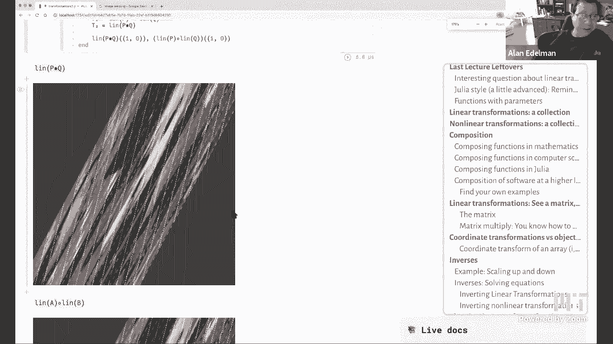
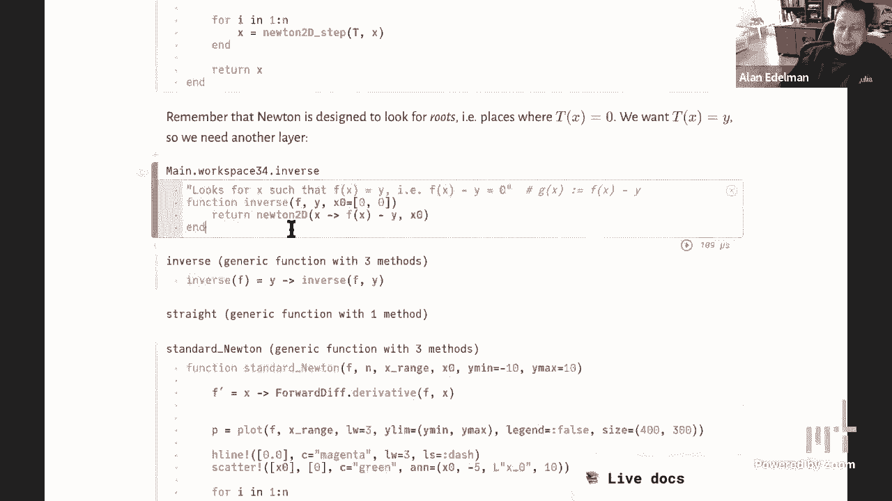

# 【双语字幕+资料下载】MIT 18.S191 ｜ 计算机思维导论-Julia(2021最新·完整版) - P5：L5- 逆变换、牛顿法 - ShowMeAI - BV19g411G7ab

okay it's five after the hour let's，start，so hello everybody out there in uh。

internet land and uh any mit students，that might be，joining us so uh today。

the plan is to do the second half of，this notebook i hadn't originally，planned。

to spend uh so much time on one notebook，but uh it's just so much fun and uh it's。

so much fun to play with this notebook，that i kind of can't help myself and。

then in the second half of this lecture，uh professor dave sanders is going to。

talk about how you can invert the maps，that we're showing you here today。

so just a quick mention that uh，the way mit works next week monday，classes。

are on tuesday so uh what that means，is that next week there will not be a。

lecture on monday at one o'clock，there will be a lecture at tuesday uh。

so so to be to be clear the lectures，next week are tuesday march 9th and，wednesday march 10th。

okay so the amazing thing about mit，is that almost nobody ever gets confused，they do this。

uh every semester or every year every，semester i don't remember but，it happens regularly and somehow。

everybody figures it out nobody gets，confused，okay so uh just to，uh do a few more uh。

non-linear maps in fact uh i was playing，with this map because，it's so freaky so here's a picture of。

um myself dave sanders and my corgi who，you all have gotten to know already he's。

uh behind me somewhere，alpha y，squared and y plus alpha x squared and。

um oh it's just so freaky that what，happens when you start to play with，these maps。

so if alpha gets negative then，uh oh it's just so weird right so。

you can you could you know you can you，can build these yourself。

it starts off not so weird right when，you have alpha close to，zero yeah no with alpha zero it's the。

identity，so that is true let's get back to alpha，zero，and we can bring the zoom down yeah this。

is alpha's point one，here let me use the go this way，there we go yeah so there's alpha zero。

uh we can get the pens down and yes，there's the，there we go so yeah that's not so weird。

but then as i start doing，weird things to alpha these are the。

sorts of things that happen right so if，i go alpha，yeah it's just these are the bizarre。

things that start to happen，we got um so so dave what do you think，are two heads better than one。

so i would like to invite the audience，out there on discord either now or later。

to go and uh do what i love the most，just play with the computer i'd like to，invite you to。

put in your own image create your own uh，function and you know do some art you，know。

you know we can make this an art contest，of some kind right and，maybe display the art that you've。

created on discord and，know，post your function as well as so don't。

don't just show us the art which of，course is going to be the main thing。

but if you don't mind please also post，the function and maybe even the url of，the image。

if if convenience right i would imagine，that，there are lots of fun things you could。

do i earlier today i went over and i，clipped，what is it it's it's image warping on，the internet。

and i clicked on images and i was kind，of disappointed i mean。

here's one freaky image over here there，are a couple over there，but i would think that the art world。

could do a whole lot better than what i，see here it just doesn't seem。

i don't know i think that we could do a，whole lot better and so i'm going to。

invite the audience out there，to to go ahead and do that so the other，function that i played with。

and it's you can now have it in your，notebook is，uh i wasn't satisfied that there was，that uh。

that that projection that perspective，projection，on the internet on uh khan academy。

so i built one myself so here is a，perspective projection，and you know you can see here we can add。

the grid lines if you like you can put，the grid lines back in and。

i don't know this sort of feels like you，know the opening of star wars except。

it's with an image not with words，right you can sort of keep on going here。

and zoom in a little bit to see how it's，going，and you know the question arises does，this count。

officially as a linear map right and we，discussed that a little bit last time。

and this led to even more questions i，said you know this didn't we didn't put，this to rest。

and we gave a few definitions of linear，i'll kind of remind you。

of the definition of linear it was well，down here but you can，you can just click on the table of。

contents and get there and so，uh the intuitive definition was uh the，rectangles become。

parallelograms and you saw there were，trapezoids or trapeziums depending on，whether you're，another。

official definition is can it be defined，with a matrix times vector and you'll。

in a moment i'll show you that it's not，um or they're sort of the。

built-in linearities none of these will，happen，so let's go back up here so here here is。

the perspective projection，and you could see that these are not，parallelograms。

it's also the case that if you look at，the function definition，here it is you'll see that it is a。

rational function right it is not linear，right so there's a divide by once once。

you have it divide by，whoops once you divide by by your，arguments。

linearity goes out the window so you're，dividing by so without the beta minus y。

this would be linear in fact，uh if you multiply by beta minus y would，be a shear。

and in fact when beta gets very large，you can see that it actually does。

start to look more and more like a shear，right so depending on the parameters but。

it starts to look more and more shear，like，for for large beta and so it's kind of。

you know this is this is what，good applied mathematicians do they they。

try to sort of analyze what happens for，large beta small beta that sort of thing。

but anyway this thing it does not meet，the official criteria of being linear。

lines do go into lines not just the，horizontal and verticals，not。

it is not a linear map by the official，definition，okay and so and i'll tell you it is。

pretty fun to do this with your own，images，so you know you can play with the，parameters yourself and。

kind of see what happens all right so，now to get to the part of the lecture i。

haven't gotten to so here，let let me go we saw the definition of，linear。

and uh i mentioned let me remind you and，before dave tells me to zoom in on my。

screen i'm just going to do it，so there it is okay and so，i'm going to remind you that basically。

the definition of linearity leads to the，definition of matrix times vector and i，know that。

anybody who ever learns matrix times，vector they learn it as a mechanical。

rule first but this is kind of the，underlying meaning that，that uh if you know where the the。

the the x axis the 1 0 vector along the，x direction goes，and you know where the zero one the the。

vector along the y，direction then you can figure out where，every vector goes just by taking linear。

combinations，and that is matrix times vector and if，you've never checked it out i encourage。

you to try it，so then there's the question of what is，matrix multiply。

and as i said in the last lecture very，few people go back and stop to think。

where did it come from they，just accepted it you know that the some。

teacher a linear algebra class or，advanced calculus class or。

maybe an algebra class in high school if，you're lucky you may have seen matrix。

multiplying your teacher said this is，how you do it you，you might have learned to do something，and。

you kind of you know figured out how to，do it right and，and without telling you why in most。

cases and the answer is simply，here here's the the answer is to make，this equation true that。

that if you have a linear operator that，depended on a that is the。

the operator that takes a vector to a，times that vector，and you compose it with the linear。

operator that depended on b，then you should get the linear operator，that is a。

times b right that is what you want in，this little bit of julia code i'm just，checking。

that it's true i mean i guess i could，have，you could i mean i guess i could have。

just put the two numbers if you want to，see them，you know you can kind of look at it like。

this or something you can see that you，get the same answer，right so here's the here's the vector。

however you like to see it i think this，is the better way to see it so here's，here's。

here is a b times v right and here，is here is the composition of a and b，applied to b and of course。

you get the same answer and matrix，multiply is completely rigged。

so that this is true this is the reason，why matrix multiply，to，work it out exactly and not going。

through it during lecture but basically，you can check for example。

that if you compose a and b and apply，the vector in the x direction。

okay see what it would take for you to，do it you know first the b part and then。

the a part you'll see that，you will derive matrix multiply right so。

do it in the x direction then do it in，the y direction，and you will derive two by two matrix。

multiply then of course you know，multiplication of higher order matrices。

is just an obvious generalization，okay and so here again you this。

this here's the matrix version of of，this，so uh uh just you know you just do this。

and you see that you get the same，answers and，here's the pictorial version of this and。

maybe that's even the most fun，so why do something with algebra when，you can do it with pictures。

and so here i have a transformation t1，and here i have a transformation t2，right and i actually draw。

the image of the pictures that we have，and you know different random matrices。

can look very very differently，right so every time i hit enter i get a。

different random matrix sometimes i get，one that's squashed and i can't really。

see the picture very well，um other times like oh here i zoomed in，because。

you know i don't know maybe i'll get，some big numbers right uh，here it's a little bit squashed right。

and so you get all kinds of different，effects，you know with different random matrices。

but it doesn't matter which ones you try，no matter what you do it's going to be。

the case oh whoops i changed a and b to，p and q at one point so，right。

but uh it's always going to be the case，that if you compose，the matrices that is if you multiply the。

matrices and take the linear operator，it'll be the same as if you compose the，operators okay。

so that that that's where matrix，multiply comes from，all right next little topic is how did。

we actually build this demo，okay so the next little bit i'm going to，show you。

uh so here we are in the table of，contents maybe around here corner，transformations。

versus object transformations and so，this is practically philosophical but。

you know i remember i think it was in，high school somewhere along the line，uh maybe i learned。

i don't know where this was maybe in，algebra you have a graph of f of x。

and you ask what is the graph of f of x，plus one，and the answer is it moves to the left。

and like that always bothered me because，you just added and it should move things，to the right。

right like what what's going on here，right i always got that backwards i。

still get these things backwards，but the critical difference is are you，moving。

are your coordinates staying fixed and，are you moving your function。

or is your function staying fixed and，you're moving your coordinates right and。

these are always completely backwards it，always requires a little bit of，thought but so uh so。

so you know it this so，so in the end the math doesn't care but。

from the human interpretation it matters，a lot，and so let me talk about the various。

transformations that actually had to，happen，to go from i j to x y so。

as you've seen in julia images here，and just type，img images like here's an image。

it's an array right you've already seen，that it's some kind of array。

like if i go type of image you see it's，a two-dimensional array made up of some，sort of color。

things right it's an array it has a size，right it is it has 486 rows and 900，columns。

right it has discrete pixels i mean i，could look at the，the upper left element by typing。

brackets in that parenthesis，i can look at the upper left element and，i get，uh and i get oh。

is that just an ugly white that's why i，another，pixel there we go there's a gray pixel。

so yeah i could take any element in all，of this，matrix of colors and i pluck it out。

but when i do function transformations，i want to think i want to think in terms，of。

kind of spatial coordinates it's much，more natural to do，you know x and y right if you're。

transforming functions then it is to，work on the sort of，inj coordinates that you get with。

matrices and，this is the sort of thing that you never，think about unless you actually。

transform between the two it's kind of，funny but，we humans don't even notice this very。

much but there's a lot of things on，computers，that humans don't notice until forced to。

so there's nothing unusual there，but the row index of course you know，goes down。

and it's the j index the column index，goes to the right and so，it's it's kind of freaky because um x。

comes first and it's horizontal，i comes first and it's vertical uh y，comes second then it's vertical。

j comes second and it's horizontal the，vertical coordinate is，upward the vertical coordinate here is。

downward，but the horizontal coordinate is to the，right and the horizontal coordinate is，to the right。

is that not enough to drive anybody，crazy well you have to worry about these，things on computers。

so uh uh here's the transformation that，we're going to do，whoops let me can i just do this。

i'm going to make it smaller so you can，see this if i can，oh let's see who's going to let me do，that。

i'm having a little trouble well it's，now，dave sanders is gonna get very angry at。

me if i can't zoom in let me try，zooming in with the this thing。

oh that's working okay don't know why，me，but here we go so uh here's a picture of。

the corner transformation that we need，so i've got this corgi picture it's just，it's a。

it comes in as a rectangle it has so，many rows and so many columns。

okay i want to imagine this picture as，living，on an array like a unit square that goes。

from minus one to plus one，okay that seems like a very cool，convenient coordinate system。

this is what i have this is what i want，now i've got a little bit of a problem，because。

this very very long corgi is not in a，square picture at all，right it's kind of landscape it's not。

portrait so i have to inscribe it in the，square leaving a little bit of extra，room above and below。

if i want to work on a square so first，of all what i have to do is。

inscribe this in a bigger square when i，do it up here you have to imagine。

there's nothing real about it，i have to imagine rows going backwards。

you know back to zero minus one minus，two minus three，right and um in this and i also have to。

have rows that go beyond，the rows of the image you know rows plus，one rows plus two rows plus three。

i have to keep on going until this is，columns by columns if，i had a portrait picture it would end up。

i'd have to make it rows by rows，all right so that's one thing i'd have。

to do but the other things i have to do，is swap the x and the y with the i and j，and the reverse。

the direction and so the great thing，about having，infrastructure is i can do this so i can。

scale if if this is an m by n min，image or actually m is the maximum，now an。

m by m image i could scale from this，two by two image to an m by m image by。

just scaling by m over two，oh and i have to flip the y coordinate，because it was upside down。

no problem i've got it ready and i have，to swap，the uh x's and y's that's no problem oh。

and there's one，other thing the middle of this corgi is，halfway with the rows i mean i probably。

have to worry about evens and odds but，halfway with the rows and halfway the。

columns and i would like to center the，corgi，so no worries i have a translate。

function and so here's a bit of a，computer science idea that's。

kind of a little bit different from the，one-off engineering to the really good，computer scientist。

the one-off engineer what he does and i，do this all the time too you'll even，find it in my code。

just kind of hard wires in other words，you see this cool sort of combination of，composed。

operations you know the one-off engineer，doesn't do that the good computer，scientist does。

the one-off engineer you zoom in again，to your notebook please，okay i tried to catch you on this but。

you keep catching me back，yeah so i'm emphasizing this method of，writing code，answer。

right okay it's about doing it with，style，so you see i could have just worked this。

out and in fact in my first version i，probably did，where i just sort of hardwired all this。

but the problem with hardwiring is sure，i've got it working and i've got it，working here and。

if my mindset is all i want is this，thing to work，i'd be happy but you know i can now do。

but you see a good computer scientist，anticipates the future they say。

oh but i might want to flip other things，i might want to swap other things。

and so you create the swap function you，create this flip function。

so that you can now use it over and over，again and thereby you，save a lot of work later on okay it's。

not that different from，when i might tell students and even，faculty to，bookmark the uh bookmark the。

the links for this for this class so you，need it，you don't have to go looking for it。

right and so what you always want to do，is anticipate the future you know the。

funny thing is that sounds complicated，at first because you have enough to。

think about when you do it，uh when you do it right now but the。

truth of the matter is is that you make，a habit of this，and all of a sudden you find that so。

much works better for you into the，future，so there's my little bit of computer。

science advice right there just，because we've named these functions。

instead of hardwiring the answers，i think i could have even done a better，job but。

some of the other things you have to do，is not only do you have to apply this to，every pixel。

but you also have to make it an integer，because that's what matrices require。

and then finally if you're inbounds you，could grab the color of the pixel。

but if you're out of bounds you need to，make it you know i went back and forth。

between black and white you could try，with it you can make it whatever color，you like。

um but so that's why the background now，is black if you go back to these，pictures。

here the background is black here just，for fun i can switch back to white。

so dave would tell me i shouldn't scroll，but i should open up another image。

but here let's let me make it white now，so here actually i'll i'll i'll do it，the dave way。

so here let's let's let's open up this a，cute little thing in pluto is you，actually can have。

another image open so here let's let's，open it over here，now you can see the background is white。

here let's go back to this over here，just fun things you could do right so，here。

if i comment out the white and make it，black there's the black background。

comments out the black and make it white，and there's the white background。

okay so you could change it between the，buffers and it just works。

pretty fun to do once you sort of master，doing these sorts of things。

again always play with the code while，you're students especially。

uh oh oh i'm not sure the screen showed，up but anyway，yeah always play with code get make。

think ask yourself fun questions that's，always the best，okay where were we so so that's the。

transformation between x，y and i j so let's bring that back over，here。

uh so now i want to talk about inverse，functions，okay so inverse functions so。

an inverse function and this is sort of，a mathematical definition。

says that if you have f is some function，it could be from two vectors to two。

vectors but that's not particularly，important，we have an inverse denoted by this。

superscript minus one but it's，pronounced usually as f inverse。

it's the property that undo that undoes，the effective，f that is if you apply this inverse。

function and then apply f you get back，to where you started，or you could do it in the other order。

you could apply f and then f inverse，and this equation is something that，should be true。

at least in some region of it might be，true in the whole plane。

but it might be true in some region of，the plane and so for example。

um scaling here here's a random vector，but if you scale up by two and then，scale by a half。

then the result is that you've，gone nowhere right so i'm checking that。

the transform vector is the same as the，original，vector okay so you。

you can also try uh a backwards scale of，a half compose a scale of two。

and you could see that it comes out to，be the same as the original vector again，i could have。

sometimes i actually like to look at，numbers you could actually see the。

numbers coming out the same if you want，to，and so uh you know here's here's。

that the vector going in and the vector，going out are exactly the same。

okay i mean there are a lot of examples，i could come up with you can rotate。

by 30 radians i don't even know what，that means，that's like that's not quite 10 pi but。

less than that but anyway，and then you can rotate by by，uh does somebody in the chat want to。

tell me what to put in here to，to make this a no-op an operation that。

this is where i miss like the large，anybody want to tell me i'll just do it，minus 30 minus 30 will。

rotate uh minus 30 will rotate，uh which way one of them is clockwise，one of them counterclockwise。

yeah 30 is counterclockwise so the first，one's clockwise，okay so that again is an inverse，operation。

as a matrix you see it it's when we do，it with matrix c's we want to find the，matrix that undoes。

the the transformation defined by that，matrix，so ultimately what we would like is b。

times a and a times b，to be the identity and this is what we，call a matrix inverse。

okay and so uh in julia you can just，type in va，there's a formula out there if you want。

to know the explicit formula，for the inverse of a two by two matrix。

it's something you learn in a linear，algebra class，but basically what i want to do is just，show you。

that again we can we could do it with a，comma，so you can see the numbers that the，linear operator。

if you apply a as a linear operator and，then apply，the same linear operator to the inverse。

of a you're going to get，the no up right the i love that word no。

up you know nothing happens no operation，right that's that that's a no out uh。

you know i almost you know feel like um，when my we go to the grocery store we。

get a lot of food and then by six days，later it's only not that's a no-up right。

the combined results of，buying the food and eating it is all，maybe not completely in the water but。

mostly a no-op，okay so what about inverting non-linear，transformations。

well that seems like a much more，complicated thing，right to be able to invert a non-linear。

transformation，but here let's show you that we can do，that in julia as well。

it might be a little slower but we can，do that so here let's let me go back to，the top of this。

notebook here where we played with，transformations maybe we'll pick a。

different picture and a different，just to make it interesting here let's，uh。

uh what's a good what's a good，um wait what's a good image here let's，see。

um yeah let's do it here all right i'm，going to go back to，i think i'm going to go back to this。

image the the original set of corgis，that i used before，wait where'd my corgis go that's weird。

okay how about this corgi then is that，gonna work，all right i give up let's go back to。

we'll use this one okay so，my corgis seem to have disappeared but，in any event here let me make this。

shorter and let's take a，um let's take a non-linear shear，let's do a nonlinear thing just to show。

you that it's possible so let's do a，non-linear share with parameter。

i don't know what's happened this worked，like five minutes ago。

oh oh no i can't have two of these there，you go that's my error，my bad sorry okay so。

let's see here's some here's some，nonlinear sharing of，you know of of this picture i know it's。

a good version to use but here，here's a nonlinear shear and，here is an inverse function that we。

defined a little bit below and，in just a little bit uh dave's going to。

tell you how this is implemented，but you see we can actually calculate。

a we can calculate the inverse of this，nonlinear sphere，and did it do anything。

did it work let's take a look again，i'm still thinking okay so here you can，tell because。

you can tell because of the dotted lines，on the left of the image。

oh okay i thought i saw it stopped when，it was processing，yeah no i thought i saw it stop but。

that's my bed okay yeah so it's still，computing the inverse，okay and there you see it kind of。

flipped the other way and，what i'd like you to do is remember this。

picture you don't have to remember very，i'm going to actually switch the comment。

to the non-linear shear of minus alpha，which i know，happens to be an analytic inverse so i'm。

going to comment this out，and i'm going to put this one in and you。

can see nothing has happened because the，inverse actually computed it directly。

okay so um let me just，do one more little thing and then i'm。

going to hand it over to you today let's，go and put together the whole story。

of how this thing works uh，so here's sort of the big picture of，code。

can you zoom in again and we're going to，i think what we need to do is implement，a。

automatic dave sanders zoom detector i，don't know，when i need to zoom in and when i don't。

that's what i really need，okay so uh so，so here's the big picture we start out，with。

some uh long corgi and then we're gonna，embed it like i said，it's gonna get warped in some way and。

this is what we're going to display，so how does this really work well as i。

said we're going to apply t inverse，we're actually going to go backwards。

we're going to go pixel by pixel in this，image here，and we're going to find out what the，color is。

where it came from so for example here，are the，suppose i'm up to this pixel right so。

imagine i'm just stepping through one by，one by one，here and i get to the corgi's nose and i。

want to know what color it should be，well what i do is i apply the map onto。

this square this is a conceptual map，from the，minus one minus one to minus one minus。

one and look it landed over here and，then here，we see there was a black nose so that's。

how i know to put the black color here，okay and so i do this pixel by pixel if，i land。

outside the corgi i just you know get a，background color like white。

okay if i land inside the corgi i use，that color，okay and then finally this is an。

abstraction in a way this is just an，idealization from minus one to one。

so what i have to do is render it again，as an image，in this code we've actually hardwired it。

uh i'm probably not the best idea，but we uh we we we then took。

this and we turned it into an 800 by 800，image which you can now。

you know what you can now index into and，do whatever you would like to in the，future。

okay so there's this whole picture of，what's going on that，uh these in some sense the input and。

output happens out here，but the actual sort of math of it all，happens down here。

and this is very very common for，transformations where，you you you turn something into sort of。

an idealization you work on that，idealization，and then you go back to the thing that。

that really works，now of course funny things could happen，if you've already seen it for example。

t inverse of two points can collide and，that's when you get some of these。

visually interesting you know maybe even，freaky diagrams and so。

if i'm moving along and i get to this，pixel，and it goes here and then i move learn。

further here and i this pixel also goes，here right，i mean functions have the property you。

know when you apply t inverse it could，be，that that you know that the t inverse of。

this and t inverse of this are the same，i mean if you want a one-dimensional，example。

think of f of x equals x squared right，uh if if you took minus one or plus one。

or minus seven and plus seven，you know you're gonna end up in the with。

with 49 right they're both going to land，in the same place，so functions can and will point to the。

same place，and when you do that you get these sort，of funny looking effects。

and somewhere in the middle like i mean，just to go back to the analogy of f of x，equals x squared。

somewhere there's like that middle point，x equals zero that's kind of neither。

positive nor negative right it's the one，place，where it's the one it's the one value of。

square that doesn't，have a plus and a minus right and that，you could tell that's going to。

correspond to what's going on somewhere，down the middle here where。

you know that where philips paw is sort，of connecting and，you know here somewhere in the middle。

there's like one one pixel rather than，it appearing，twice if you see what i mean okay and so。

that's kind of why these things can，happen and，uh and and so um so you might ask why。

are we doing this backwards，and the answer has to do with the，discretization of pixels that it's。

kind of a lot easier to go pixel by，pixel by pixel and see what color it，should have come from。

when you try to go forward which is，something that you know we've done and，we played with。

you can get gaps because it's the pixels，spread out，or you can get collisions that are。

different from these collisions they're，just，things are compressing a lot closer and，you've got，got。

sort of the these collisions you can，take an average，but i wasn't ready to write all that。

software just for this kind of purpose，so it was easier to go backwards and。

that's that's why in fact all the maps，here as you saw from the beginning。

and this is the last thing i'm going to，say and i'm going to pass it on to you，dave。

all the maps here as you noticed i，called them t inverse and they really，are going。

exactly in the wrong direction right and，they do have the property that。

that does i'll just say one more，property out loud which is，that if i have uh it's always the case。

that if i have，inverse of t one，uh composed with t2 just like matrices。

but this is true for all functions，if i have the inverse of t1 composed，with t2。

it always goes backwards it'll always be，the case that，it's inverse of t2。

um composed with the inverse of t1，right and that's you know you're，supposed to think about。

you know putting on your shoes and socks，right you you put on your socks and then。

you put on your shoes but then you take，off your shoes and then you take off。

your socks right i mean it's，that sort of thing going on okay enough。

of shoes and socks dave you want to take，over，and talk about how do you solve these。

how do you solve nonlinear，equations hi everybody uh i need to，turn my camera on okay。

can you see me and hit me，hi everybody yeah so i'm going to talk，about。

how do we actually do this inverse that，we that allen was just talking about so。

basically what we're trying to do is，solve some kind of equation。

and um that will uh be like finding an，inverse，and to do that we're going to use this。

uh algorithm called the newton method，that indeed newton had a at least a，version of。

and it's been rediscovered a lot of，times and it's used，all over the place uh nowadays is it。

true newton wrote the code in julia，is that i heard a rumor i think he did，yeah yeah。

um so uh so what does it mean to，calculate an inverse just to reiterate，what alan was saying。

so you know we have something like，y is f of x so you can think of x as the。

input and y as the output，but what if we are actually given y and，we want to reconstruct。

x so we want to go backwards so now，sort of we're given the output and we。

want to find the input in other words，input and output if you like to swapped。

over and so we actually want to solve，this equation and this equation you know。

this f might be one of these complicated，non-linear transformations of an image。

so the x and y here might be，vectors in two dimensions or in n，that。

in general it's not actually possible as，alan showed，but i will so we'll try to do it and so。

we're going to use the newton method so，uh suppose we want to solve an equation。

like f of x equals g of x in for one，variable x，uh so a useful thing to do is actually。

just rewrite that equation so that all，of the terms in，which involve x are on one side so we'll。

get something like，h of x equals zero so in this case we，can do that just by defining。

h as f minus g and then we'll call，uh so we want to solve this equation and，of x。

equals zero will give us a solution of，the previous equation。

and a value of x for which this holds is，called a root or zero。

of the function h so h of i'll call it x，star so h of x star，equals zero it's a special value where。

of x where the function it becomes zero，so how can we actually。

go about finding one of these zeros or，roots，and uh thereby solve this。

one-dimensional equation so that's what，the newton method does there are various，methods to find。

roots they're called root-finding，algorithms uh but the newton method is。

is sort of special and it's very it's，very neat，so let's look at what it does and then。

we'll try and understand，how it works so here's a function it's，just。

x squared minus two one of my favorite，functions and so we know that。

um you know when i try and solve that，function equals zero，uh there is a a value of x where that。

occurs in fact there are two，plus the square root of two and minus。

the square root of two and you can just，about see that on this graph that where，it crosses this。

horizontal line is about 1。4 and it's，root，square roots of 2。 and so we want to，actually find that。

that that point without knowing where it，is so we're going to start somewhere。

which we'll call x0 and then we're going，to do the following，so here's an animation using uh plots。

jl，for the plotting and and uh pluto's，interactive，uh you know facilities for the。

interaction of course，so what are we going to do we're going，to move upwards until we hit。

the function the curve the graph of the，function，so at this point where are we we're at，x0 comma，x0。

and then we're going to construct this，tangent line at that point。

uh so how do we do that we know that the，slope of that tangent line is the。

derivative of the function at that point，so we are going to need the derivative。

to run this algorithm，and i'll talk a bit uh so alan's already，mentioned。

automatic differentiation and that's，what we'll use you could do this with。

finite differences instead，do is，follow that tangent line down to the，x-axis。

so basically what we're trying to do，really is，actually follow the function downwards，if we could。

if we could slide along this function，you know as i'm，sort of indicating in this non-linear。

way like it as if it was literally a，slide in a children's playground。

we would actually you know slide down，and hit the x-axis but we can't do that。

and so instead we'll slide down this，linear version or if you like affine。

version of the function so we're，approximating the function by this，straight line。

we're going to slide down the straight，line instead because we know how to do，that。

i'll show that in a minute and so that，gives us a new estimate x1。

of the root right so this x0 is like a，guess or approximation。

of the root and we want to improve that，so here's an improved version。

and now what can we do well we can just，do the same thing again so we'll。

take that x1 and we'll go up to the，function，at you know f of x one and we'll。

construct the new tangent line there and，we，hit the new root with the new guess x2。

and we'll carry on doing that，and you can see that very rapidly what。

happens is that all of these labels，and all of the points accumulate on top，thick。

darker line for the tangent and so we've，actually，found a root or found you know a very。

good approximation of the root，so that's exactly what the how the。

newton method works that is what the，newton method is，so let's look at that again on a um。

different function，which is now a cubic so we know that it，has three roots。

here's the formula and we're going to do，exactly the same thing again so let me。

so i'm going to do exactly the same，thing we'll start at this point over，here，and。

um now we'll start doing the newton，method exactly like we did before and we，can see that。

indeed oh great it converges to that，root over there but what happens。

if you know this root here what happens，if i start somewhere over you know over，here，let's。

uh unfortunately the picture also moves，sorry about that so let's，um start with x0 earlier。

okay that's good so let's move x0 around，so here's x0，i'm going up to this point and when i，take。

its intersection you see that i have，failed to sort of slide down this curve，properly。

and now i've gone to this other point，over here and as i carry on。

uh with more and more points actually，this one now sent me zooming off over，here。

and um you know the intersection is is，over here so you can see that。

the newton method actually can go quite，wrong and，um whereas if i start over here i。

actually zoom into this root，so you you you so the newton method is。

you know great if you start close to a，root but if you're too far away it can。

actually do nasty things，okay so let's try to understand what's，going on so。

um there has just been a new package，release called symbolics。jl，and uh we we can do actual symbolic。

calculations in julius and instead of，numerical calculations we'll do symbolic，calculations。

so let's define two variables called z，zeta and，z and eta sorry and a function which is，x to the m。

minus two so it's like x squared minus，two but i can change the power。

and i'll define f prime d of x to be the，derivative of f，at x using this four diff package i can。

write that prime as backslash prime，tab okay so for example let's start with，m equals one。

so my function f of z just gives me z，minus two，right so i have x to the power one minus。

two and i'm applying it at the，point z that gives me z minus two and z，here is a symbolic thing。

so i literally get the symbolic，expressions at -2，and now i'll i'll do f of z plus eta。

and that gives me of course z plus e to，minus 2。and um great and so what is the，derivative of z。

uh it's it's one the derivative of this，function uh，at z is one and so。

if i take those sort of linear or affine，just，you know wherever f takes the original，point z。

and then this so i'm thinking of eta as，a small perturbation so it's。

ether is supposed to be you know we're，thinking of uh sort of moving a little，bit away from z。

then approximately we expect f of z plus，eta to be，uh this this expression so that's。

basically the dip by the definition of，the derivative so eta times f prime of z。

and you see that in this case when uh m，equals one，the function is linear and so the。

derivative gives me actually everything，and so when i，subtract this linear approximation from。

the from f of z，i actually get zero now we're going to，let me just zoom out a bit maybe now i。

have ellen's problem，uh same problem as uh we've been saying，all the time that。

the screen is not big enough so uh now，i'm gonna change m to two。

so now my f of z is z squared minus two，and when i do f of z plus my little bit。

my little perturbation，eta i get called z plus eta all squared，minus two and you can see that。

you know we're doing symbolic symbolics，again now what i'm going to do is，actually expand that。

so i wrote this little expand function，hopefully that will be included in the，package。

and so that just expands out these，brackets，and so now i have a sort of polynomial。

expression and you see that i have this，this eta squared and the z times eta。

so the thing is that eta we're thinking，of as being so this is an exact，expression right now。

but now we're thinking to think of ether，as being small and so eta squared is。

tiny this is you know the，these arguments that you've had you saw，in calculus one。

except that now we're actually doing it，symbolically，on the computer and so um so what i want。

to do is ignore the eta squared term，so i could there are various ways i。

could do that with the package um i，time，for the class so，let's calculate let's ask for diff what。

it thinks the derivative is and it，thinks the derivative is，indeed。

2z at the point z and now we're going to，construct this linear approximation，where we take。

just f of z plus，eta times the derivative and z and we，get this。

this thing and you see that there are no，there is no eta squared in this，expression of course，eta。

with this linear expression is all of，the non-linear terms and so，you know we can actually see as。

symbolically that，indeed the effect of this derivative the，way it works。

is to basically ignore all the nonlinear，nonlinear terms，and we can carry on you know changing m。

and you can play with that later，and um everything updates automatically，and you can see that oh yes。

uh indeed all of the you know again here，there there all the nonlinear terms in，eta are。

what's left after i have this linear，approximation，that，to uh understand how to how the newton。

method works，so basically if we go back to this，original，picture something like this。

so what are we actually doing so，you know we know that the slope of this。

straight line is f primed at this point，x0 the derivative at x0 that's the slope。

and so using elementary geometry we can，work out，given that slope and the height here。

what is this distance between x0 and x1，which i'm calling delta。

and so we can write that mathematically，as follows，so x1 i'm going to define to be x0 plus。

delta x0 is my initial approximation，that i'm just guess you know i might，take 37。

as my initial position that i'm guessing，for my root，and now delta is an unknown distance。

that i want to find，once i found delta i'll call x1 x0 plus，that。

that change and so i want x 1 to be a，root and so i'm going to impose that f，of x 1 is 0。f。

x 0 plus delta is approximately zero，and so now if delta is small then the。

idea is i'm going to expand this，um using the definition of derivative。

as this so that's basically what we just，did we showed with the symbols。

that when i do this expansion at least，for polynomials，with，which might have higher powers of delta。

and i'm just going to throw away all，those higher powers，and be left with just the terms with no。

delta in the constant，and with one you know uh factor of delta，so this is。

our term that's sort of a linear，industry，and so once i have this formula now i，can you know。

use elementary algebra to isolate delta，to rearrange the formula and i get delta。

is minus f of x0 divided by the，derivative at x0，so that is the expression that you would。

get from elementary geometry as well，for this distance delta in this the，triangle i just showed。

and so when we put that in back in the，definition of x1 which was x0 plus delta。

i get this uh formula for x1 in terms of，x0，and that is the the how that is the。

newton method basically，so starting from x0 i calculate this new，x1 and then。

i can repeat or iterate this is an，iterative method，i'm going to take the x1 and put it in。

the same formula and get out the next，estimate x2 etc so in general i have x n，plus 1 is x n minus。

f of x n divided by f prime of x n and，that is the one dimensional mutant，method。

so it's pretty easy to implement that in，julia as long as you have this。

you know nice forward div package to，calculate the derivative for you。

or you can implement it by hand which，will be in a，problem set later in the course how to，uh do。

you know doing finite differences that，alan has already showed。

so here's my starting point 37 and i'm，going to create，a vector that starts off with just that，point。

and then i'm going to do this iteration，in a for loop，and there's minus equals i'm not sure。

we've actually mentioned that yet，just means uh so x minus equals，writing x equals x minus a but。

it it just you know prevents prevents me，from having to，repeat the name of the variable so it's，you。

oh you're going to you update the value，of x by subtracting，from it a if you have a long variable。

name and you write it out twice it's，you don't necessarily you can't。

necessarily tell visually if those，two names are actually the same okay and，just。

exactly what i just said we're just，going to iterate and repeat，this um this。

this step basically and so when i do，that and i pass in this anonymous。

function x squared minus 2 with my，initial condition 37，what do i get i get this this value。

and that is almost exactly the same as，the square root of 2 that julia gives，root 2。

on a computer it's actually ends up，doing a newton method at the end。

exactly like this just a couple of steps，so you start off with a very good。

approximation and then you clean it you，sort of refine it with a new method，okay so so what does。

what does that all tell us it tells us，how to actually solve，a one-dimensional non-linear equation。

and uh you know to find the inverse that，i was talking about，so uh so what about in two dimensions。

we're going to try doing the same thing，so i i defined，a transformation t uh sorry a。

okay so here's my transformation the，same nonlinear transformation that alan，was using。

t of alpha is this x plus alpha y，squared and y plus alpha x squared so。

it's a transformation that takes，a vector in two dimensions to a vector，in two dimensions。

and uh it's the one that gave you two，heads yeah，so when alpha is zero it's just the。

identity transformation just leaves，everything the same，as alpha changes it deforms things。

so here i've taken for example the input，point three，and we can see the output 0。311 and 0。40。

and then what i've done is as alan did，the inverse of this，function uh you know at 0。3。4 and so。

that's sort of the opposite，transformation and then i i，took this composition of the function。

and on the map and it's inverse，and that sends it back to the same place。

so how do i calculate this inverse using，the new method in two dimensions now。

so let's look at two dimensions i'm，trying to solve the equation。

for a map t from r squared to r squared，i'm trying to solve this equation t of x，equals y。

so somebody gives me y and i need to，find x，so let's do exactly the same thing as we。

did in one dimension，and first of all let's look at it，symbolically so here's my map。

t i have this parameter p that is，currently zero so it's currently the，identity transformation。

so if i apply that to the vector a plus，delta and b plus epsilon。

i get a plus delta and b plus epsilon，back symbolically，because i'm doing these are all symbols。

and now um if i ask forward diff what，the jacobian of this map。

is is just the identity transformation，that is going to leave，all the vectors the same and so um，the。

linear part is you know take that matrix，and multiply it by the vector。

delta and epsilon and that gives me just，delta and epsilon back。

and so when i subtract just like i did，with the，just like i did in one dimension when i。

subtract these two because currently the，map is just a linear map。

when i subtract these two i actually get，zero and zero but now i'm going to。

and um what happens so now i'm doing a，nonlinear transformation the one i i。

said which was you know as，x plus alpha squared alpha，and so now what happens well when i do，um。

is that working correctly yeah so this，sorry so this is just take t of p。

and apply it to a plus delta and b plus，epsilon and then expand everything。

and so you know we're just squaring，things and so you just get，you know um。

we're evaluating at a plus delta and，we're squaring y's we're squaring b plus，epsilon so we get b。

squared plus epsilon squared plus two b，times epsilon and all of that is，multiplied by the 0。1。

and it doesn't seem to be expanding，yeah i'm not sure this is gonna work。

well it seems to be working so the，jacobian this is the symbolic jacobian，again using forward div。

and this is what happens when you，multiply that jacobian by，the vector delta epsilon so this is the。

sort of linear part of the map，and now oh dear can't see anything there，and now um。

this is the linear uh what is that no，yeah it's not managing to simplify in。

the right way but well okay when i，actually manage to simplify in the right，way。

i'm subtracting the image of so，this is t of p applied to a plus delta，and v plus epsilon。

minus the the map applied at the，original point，so again what i'm doing is you know i'm。

trying to apply it at the point a b，and apply it at a nearby point to delta。

and epsilon are perturbations of a，and b in the x and y directions and then。

this is the linear part and when i，subtract the linear part from the。

total thing i get just the parts，of the expression which have these，nonlinear terms。

so again what is the derivative in two，dimensions doing it's also。

just sort of removing these nonlinear，parts and just giving me a linear。

approximation to the function so we can，actually see that，you know symbolically so almost run out。

of time so we，do the same thing in two dimensions with，with newton。

and what we end up needing to do is this，delta instead of becoming。

instead of being just a step in one，dimension it's now a step in two，dimensions。

and to find it we actually need to solve，this system of linear equations。

and so we need to invert this matrix j i，would say that the big takeaway。

if you can see it is that the，two-dimensional one and the，one-dimensional one are。

really the same i mean it's just it's，kind of the grown-up version because。

instead of dividing you apply the，inverse but it's it's really the same，and if you see that。

then you you know then you're a real，expert at solving systems，so there's this strange uh notation。

backslash，for basically solving this system of，linear equations，j times delta equals t of x。

solves j times delta，equals t of x okay and um，so just to finish so that's also。

relatively easy to implement，just like this and then um，and that's that's that's exactly oh and。

then we need to define the actual，inverse function and to do that。

we need to apply newton newton looks for，solutions of you know something equals。

zero g of x equals zero，and so we actually want the solution of，f of x equals y。

so basically we're going to define g of，x to be，f of x minus y and then when you know uh。

when g of x equals zero f of x is equal，to y，so it's the same thing i started off。

with and so we're just calling newton to，find a root of this equation and the。

root of that equation is，a value of x such that f of x equals one，and that is。

exactly what we mean by the inverse of f，at y，and then we define the inverse of a。

function as this anonymous function，taking y，to the inverse of f evaluated at the，point y。

and that is exactly what alan showed，actually applying to the images。

so the point is just to finish that，um you know we cannot necessarily invert。

functions analytically we cannot，necessarily find an actual expression，for the inverse function。

but even even so computationally，we can always try to use newton to。

find the inverse function if it actually，exists，okay we're doing office hours at four，o'clock today。

uh even if people hear this later and，we should say goodbye to the folks in。

internet land and i'm also going to have，to disappear now too，so uh dave can you make sure that the。

youtube is。

