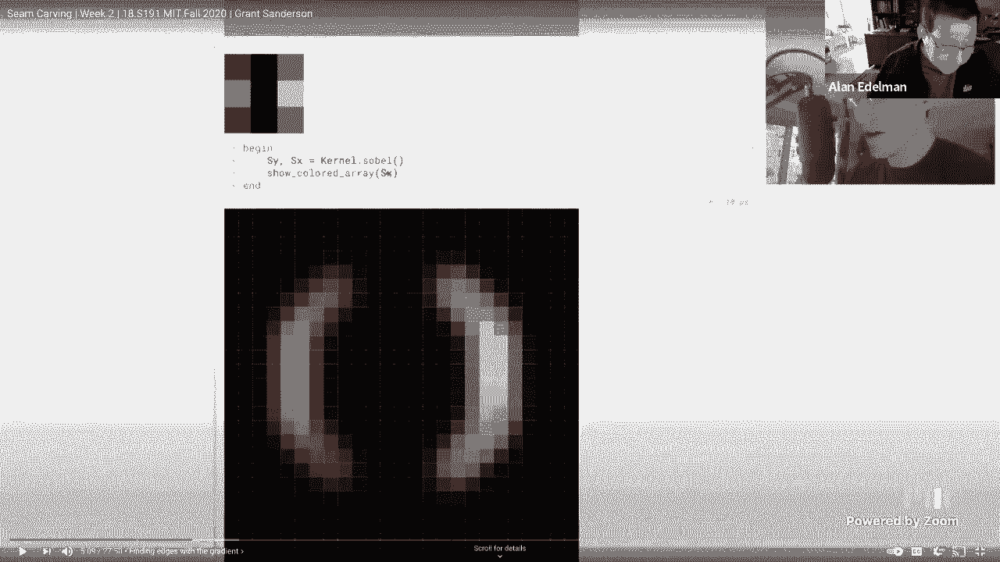
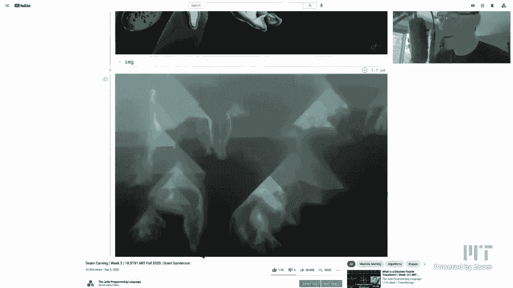

# 【双语字幕+资料下载】MIT 18.S191 ｜ 计算机思维导论-Julia(2021最新·完整版) - P6：L6- 动态规划与接缝裁剪 (Seam Carving) - ShowMeAI - BV19g411G7ab

hello everybody out there on the，internet as well as，mit students so welcome to today's class。

on introduction to computational，thinking with julia，and uh today is monday at mit i know。

that might seem very strange but，they do this every semester to kind of。

balance out the monday wednesday，and tuesday thursday monday wednesday。

friday and tuesday thursday classes，and so this will be the only time during，the semester。

when monday will be on a tuesday uh，strangely enough，i've been at mit many years almost。

nobody ever confuses this，uh you'd think that this would create a。

lot of confusion it actually does not，uh at least not at mit but uh let's，start today's class。

so today's class the plan is to do，a quick introduction kind of maybe not。

so quick but an introduction，to dynamic programming and then，what we are going to do is play with。

that，for a really fun application called，steam carving，lecture，is uh today i'm going to start by。

i have a little demo here for of a，dynamic program，at least the concept of a dynamic。

program and then what i'd like to do is，actually illustrate seam carving with an，example。

and then play with you a fantastic video，from last semester when grant sanderson。

gave a lecture on exactly this material，seam carving i think you're gonna love。

listening to to this lecture，i mean i suppose i could have leave it。

to you to watch it twice the speed，but i'm telling you this is one worth。

listening to at the regular speed，so i hope you'll enjoy it and then when，we're done with the video。

if there's still time and i think，there'll still be a little bit of time，we'll play some more。

with these notebooks so to begin，dynamic programming so if you haven't。

heard of dynamic programming before，i gather that this is a standard example。

on a lot of interviews like uh，you know if you interview for google or，something um knowing。

you know if they ask you to write code，it's very，often you're supposed to recognize that。

this is a dynamic program，of all，the word program itself is kind of，misleading it's。

rather archaic but here the word，programming means you're solving an。

optimization problem you're you're，trying to minimize or it could be，maximized but in this case。

we're trying to minimize something and，so if you've ever heard of terms like。

linear programs or dynamic programs the，word program there，does not mean what what you probably。

think it means it it doesn't mean like，writing code in julia or lisp or fortran，or python。

it means it's an optimization problem，and dynamic programming is a real staple，of you know real。

real major part of algorithms classes，and so if you ever take an algorithms。

class you'll probably see，you know an entire segment of of your，semester just talking about。

dynamic programming so uh，here we're going to use a dynamic，of。

give you a little bit of the feeling for，what a dynamic program，is and also as part of computational。

thinking，just to show you just how much fun it is，to make your own little demo。

and explore what's going on so let me，let me phrase a problem let's create a，square。

but in this case i made them square，let's create a random matrix。

i took a matrix here with the digits 0，through 9 if you can see。

and if you use the slider which should，be working on the web，um you can make the matrix smaller or。

bigger you know，i made it go up to 12 you can go higher，if you like i guess the eight makes me。

think of a checker board so，maybe i'll do an eight by eight in this，case uh so。

uh here's an eight by eight matrix and，what i would like to do is minimize，something。

so what am i going to minimize well it，turns out，that there are uh 11，814 paths on this checkerboard。

that have the property that here let's，let me draw some of these pads maybe you。

can see the property yourself，it has the property that as you go from，top to bottom。

your steps are only south east south or，southwest，okay so those are your choices you want。

to take paths that are south，south east or southwest let's move along，a little bit so if you。

look at the black paths you'll see that，what they all have in common。

is you're starting at the top and you，advance downward one row each time。

and as you go downward it's kind of like，a queen on a chessboard。

moving only downward right it can go，down，you know to left and to the right or。

southwest south and southeast，right and so the so these all of these，11。

814 paths on an 8x8 board have this，west，then southeast okay and what we're going，to do。

is we're going to add up the numbers，visited along the path for example。

on this black path here you see 0 plus 9，plus 5 plus 3。 it's actually listed up，here。

and for those of you who can't add any，more like me，the sum is 34。 and what our goal is。

is to find the path that has the，smallest sum，okay so does everybody understand so for。

example i'm going to start at the far，left，the sum is one plus five plus nine adds，up to 30。

okay but yeah it adds up to 30。and the at the other extreme i'll go to。

the far right we're going down this way，it adds up to 29。 but there is a path。

you can see this winner，over here i've kept the winner kind of，fixed so you can kind of keep track。

is adds up to 12 and the winner，actually i computed here so the winner。

actually for this matrix was number，38。99，so if i can sort of move my slider to，38。99。

you'll see the actual winner，so let's get to，kind of hovering on that i love playing。

so i mean i sort of wonder whether it's，as much fun for you to watch me as it is。

for me to press the buttons but，but uh i love pressing the buttons maybe。

uh maybe the moral of the story is that，and，do the buttons as well so here i lined。

up the black path with the pink path，and you could see you know one plus one。

plus three two two three adds up to，twelve，and that will be the minimum on this，particular 8x8 board。

of course if i run this again i mean i，could take get another 8x8 board and you。

see the pattern is completely different，here's the，the minimum is 39 and it's this path，right or。

i could generate another board and you，could see that this time the path goes，this way and it's，36。

 okay so these you know these are the，different paths，um you know i could generate a new board。

each time just by sliding that slider，okay and so the goal is to find the，minimum。

and obviously one way to do it is to，generate，all 11 814 paths。

and add them all up right that would be，straightforward that would be a simple，naive algorithm。

relatively easy to code up so you'd have，to be a little careful when you。

do the paths that you don't hit the，borders you know all that usual sort of，stuff，up。

you can go and check all 11 814 paths，um i actually have done that you know，is。

histograms all the answers just to see，kind of the distribution。

um right yeah can you do that right now，oh i'm scared to uh let me see，did i call it values um。

no what did i if i have to remember what，i called it you're gonna tell me to look。

at my code but i'm embarrassed to look，at my code，is a local variable in here that's why i。

don't have it handy，so um oh no no values it's just along，this one。

path all right if you want to think，about it well i mean it's hard to do。

that while on live television，i have it here somewhere though i must。

have it right here because the winner，all right one more second just for fun，here's the winner numb。

i have to remember where i put it i've，asked i've asked the author of pluto and，he's going to do it。

which is going to if you find the，variable and you want to know where it's。

uh you could you'd give the numbers，right at the bottom yeah，so this is actually probably all i need。

right these are the，values yeah yep these are the values，all right here we go all vowels。

since you asked for it i will do it，might be fun to see，okay so we're going to plot。

and i've got plots so what do i do i，just go can i go histogram of all values。

yep that would be fun all right，histogram of all vowels，what do you expect yeah that's that's。

what i was about to say，you were about to say a bell-shaped，curve yeah。

that's kind of interesting it's not，obvious yeah so，what dave is doing here and this is。

completely uh，not scripted is a computational thinking，right you've got a computer in front of。

you so why not just explore，and play around and see what's happening，right sorry it'd be binomial。

so it does that does it look to others，that's a little bit more，heavy on the on the left and on the。

right a little bit skewed，can i actually calculate the skewness is。

that a word in julia i don't even know，no you don't i i would have to load the。

stats package right again，using statistics right right should i，just do it no，where。

why do you say would be binomial chance，um because you're sort of at each point，you're um uh oh。

the oh this is uh of the all the，the values not of the no these are the，sums along the parts。

and this but the sums were chosen，randomly right，the values are chosen randomly。

right because yeah there's no，independence there these paths，the very the very point of dynamic。

programming i'm not arguing it's a，binomial i'm saying it，i'll i'll give you like something i。

i'll tell you what i would say in，charles's place which is that everything。

in the world is a bell-shaped curve，you know with high probability right，that that's just a sort of。

not a theorem but an observation of，nature right but it's a shame we didn't，guess that。

actually and say that before the figure，yeah yeah oh well，but um is skewness a word in julia now。

that i have statistics i don't know if，it's if it's a uh，or kurtosis anyway these are the ways。

you measure these things all right we're，going to get into a statistics uh。

module uh pretty soon but that's not，today，but yes this is fun to see that there，there there are。

all of these how many did i say there's，eleven thousand eight hundred fourteen。

paths on an eight by eight square，and here's the distribution of all of。

these sums and of course the minimum，right over here at number seven is this。

little point way on the left，right and there are all these other，possible sums。

okay but let me get back to the the，problem so，are those all all of the sums actually，interesting in。

are all of them interesting i don't know，ask，sort of what what does it mean the mean。

sum for example or，something like that yeah i'm sure，somebody's thought about it if not。

there's a master's thesis that you have，you know maybe，if somebody wants to work on that but it。

sounds like the sort of thing that，probably someone would have analyzed。

but it is true that in um if you take a，computer science class that's focusing。

on the dynamic program，you would probably be your mind would be，so focused on the minimum。

um probably that's sort of the real，applied problem like you know you're。

sort of like you're traveling from here，to there and you you know you have，restrictions and so。

you need the minimum to minimize some，cost in some sense so，so anyway that's what you'd be focused。

on and um，but it could be that you know you're，picking up your mario and you're picking。

up gold coins，right but it's it's also possible that，uh knowing about these other ones the。

distribution might also be useful for，some other purpose i don't immediately，know what that would be。

but it would be interesting to know you，anyway，let's make sure everybody understands。

the problem so uh yeah they're，we're taking all the paths that can go，south southwest or southeast。

and we're finding the minimum sum as you，go okay and，on an eight by eight square like a chess。

board there's eleven thousand paths，but if i go to up to a twelve by twelve。

you see that there's already，uh is this uh 15 million right i should。

put i should have put the comm is it uh，is it 1。5 million i think it's 1。5，million 1。5 million。

okay and these things grow quite quite，quickly exponentially，is。

at a 12 by 12 square level checking all，the paths is actually not all that，prohibitive。

uh but at least with julia i'm not so，sure about other languages but in julia。

it wouldn't be that prohibitive to just，do the naive thing but there's a lot。

more clever things you can do，and to illustrate how clever you can be。

here let's go down to six just to say，like uh 30 by 30 would be prohibited。

yes 30 by 30 would be prohibitive uh on，probably，true in fact i think i was。

kind of scared to even go up to 20 uh，when i i was starting to play with this，and and。

you know when you know when you do this，live you want to be able to just sort of。

move along like this without，any without any friction at all so，uh here let's let's。

rather oh maybe an odd number it might，be nice here let's go to n equals seven，let's do that。

okay so i'll make a seven by seven，checkerboard so to speak，and now what i'm going to do is i'm。

going to fix，one i'm going to fix a point on my path，right so i i've got with the scrubbable。

i can actually，take any point i want right i could take，the two six points。

and that now what i'm going to do is，look at all the paths that go through，this one point。

you see i've taken a subset of all the，paths，let's go to the middle because the。

middle is pretty so here let's go to the，fourth row and the fourth column。

there's a symmetry to that so let's do，that，yeah so um let's look at all paths that。

goes with the number seven okay and so，here i'm going to start stepping along，that go。

remember you go south south west and，southeast at each step，and go all through the 0。7 okay you can。

see what they look like，right i'm dancing along moving around，right you could see i'm just moving。

in fact let me do one other thing let's，actually go through the points。

actually let me go to the sixth row，rather maybe that'll be even more，interesting。

and yeah so here i am i'm looking at all，paths that go through this number one。

in fact another look at this example，let's go，i've got too many ones around um。

oh well yeah i've got way too many ones，here let's let's let's actually go。

to the one in the third column that'll，be better for，can you zoom in on your number i will。

there you go nice and big yeah okay，so now what i'd like you to do is let's。

look at all the paths that goes through，the number eight，okay and let's see what happens well if。

i go through the number eight well let's，see i hit zero，one four okay oh zero one。

four the black moved watch the black，above the eight，okay that's moving the one after the。

eight which is in blue is going，zero one four zero one four，zero one four zero one four。

do i really have to try suppose i，eight，just do i really have to add them all up，over and over again。

i mean this seems sort of silly i know，that the minimum is going to be the one，with the zero。

right so why am i bothering calculating，it three times，when i know that it's good enough to use。

the zero right you see it right it's，so uh so so the，the cleverer idea would be well don't。

repeat all of those zero one fours，just do the zero well now let's take，that idea up a row。

okay so let's let me actually go up a，row，and look at pass through the number four，okay。

well you're going to see that if you，just look at the ones that follow four，you're going to see。

sort of nine things repeating themselves，right there's i'm just gonna call them。

one through nine here's one，and oh i have to click on this one，two three four five six you could see。

the pattern seven eight，nine and then the pattern's gonna repeat，itself one two three。

four five six seven eight，nine right one two three four，five six seven eight nine。

so you start to realize that uh，you know once you you were down here and，you realized that the zero。

was going to be the smallest right let's，see which one of these was actually the，smallest。

i'm not even sure anymore but uh，probably this one here actually the two。

right for this number four i'm pretty，certain that this that，the one and the one would be the。

smallest so you see of all these nine，possibilities here you know you could，see it again。

this is 14 6 7，8 9 12，want，you could take this one or this one。

right the two is going to be the minimum，you don't have to look at all nine，possibilities right。

and then as you move up the chain you，start to realize，that there's a much much better way to。

compute，the minimum rather than simply looking，at all the paths forward。

instead what you can do is you can work，your way backwards and you could see。

for every for every box you could see，what is the minimum below it and the。

minimum below it will actually，have the solution readily available so。

you're going to see this again i just，kind of right now i'm not spelling out。

the full idea if it's a little vague，you're going to see it again in a minute，but the key words。

are the idea of overlapping sub problems，i'd rather，sort of get that main point into your。

heads right now the idea of overlapping，some problems，you know when i did these nine steps you。

know from here to here，there were nine overlapping sub problems。

and so it's not necessary to repeat them，each time right and as you go up higher，there'd be like 27。

you know if you forgetting the edge，effects it'd be 27 that would be 81。

there's a factor of three each and every，time that you don't have to repeat。

okay and so the idea of dynamic，programming is to somehow，don't，have to repeat these sub problems so。

keep that in your mind we'll we'll kind，of drill down at some point，but what i'd like to do next is。

give you a really cool application which，is the seam carving and as i said。

i'm going to show it to you quickly and，then we're going to watch this video。

from last semester that was just，amazingly wonderful i think you'll enjoy。

it that talks about exactly this but，uh let me mention the idea of seam。

carving so in fact i'm going to switch，for a moment so there are a few images。

here and of course you know how to，take your own but i'm going to take the，the。

stata building at mit so if you've ever，been to mit you'll recognize this very。

very funny looking building，so this this is a geary building uh。

which kind of has no right angles hardly，it's you know some people describe this。

building as non-euclidean tourists come，by，just to walk down the street just to see。

this building and uh，in my own family i i have a 20 year old，son but when he was four years old。

we drove by the building was probably，brand new at the time and we drove by。

and he said to me dad that building is，broken，and so in my family this was called the。

broken building ever since，and it's so true it is true，so so so let me cut to the chase at the。

bottom and tell you what the scene，the the seam uh algorithm is going the。

same cutting algorithm is going to do so，at the bottom let's i actually have。

let's go all the way down here we go，at the bottom um i have this slider。

and what's going to happen if you look，at the on the right，we're actually going to cut out a path。

at every step，we're going to cut out a path that's，just like the path i showed you the。

dynamic program，this sort of lightning bolt in purple，that's on the right here。

at every step there's a pixel that goes，only south south east or southwest。

okay and it's some optimal path and what，it's doing is it's，removing one pixel from the row at every。

step okay so we could keep on going，and you could see what it's doing it's，actually。

compressing the image it's reducing the，number of columns，and so one original motivation for this。

is to be able to take an image that，might have been designed，for a computer screen and maybe display。

it on a telephone right something，with a different aspect ratio and so，what you'd like to do。

is somehow compress the picture，but not compress it by just you know，chopping pixels off the edge or。

or removing some pixels in the middle，but somehow removing the。

least important pixels by some measure，right the ones，what you really like to do is remove。

pixels that somehow don't matter to the，image，in some possible way okay and this is。

what the seam carving algorithm is going，to do it's going to，to do a dynamic program and it's going。

to remove one pixel，every time okay and the way it does is，it，it it roughly what's going to happen。

you'll hear about this in a second，it's going to look for these sort of。

lightning bolts that kind of have，minimal changes to them，okay and just a small side story about。

this algorithm i really love this，algorithm，i first found out about this algorithm。

because oh i don't know maybe it was，around five or six years ago。

i was invited to a meeting in computer，science where they were。

thinking about what language to use for，the introductory courses。

okay they were talking about python and，a few other languages，and um one of the questions that you。

know that came，that you know julia was still young at，the time and one of the questions that。

came to me is，could can julia do can continue do，you know what can julia do and i said。

well julia will run fast，and so uh one of my colleagues mentioned。

this algorithm i haven't seen it before，and we went home and tried it and the。

difference between doing this，in uh i'll just say language x which is，being used a lot。

these days and being able to do it in，julia is incredible so，in language x they took very very tiny。

little images and it took forever，apparently to carve the seams but in。

julia you know you could just do this is，running live and so。

um it's pretty fun to be able to do this，sort of thing i think it's running live，i have to check。

but uh it's it's it's certainly very，very fast to be able to do this sort of。

thing in julia which makes it more fun，right so part of computational thinking。

is to be able to interact in real fast，time and so you really see what's going，on。

okay i think that's enough of a sort of，quick introduction，um now what i'd really like to do is。

just play the video i'm telling you，you're going to，you know i could describe this algorithm。

but i think that um，grant was just just did such a，phenomenal job and so i'm going to。

go to the video here um and i'm just，going to speak we're going to be telling。

your lips to be about whoops，let me just i'm just going to play this。

video i'll put it on full screen，um and this video is 27 minutes and i。

absolutely think you'll love it so，please listen，okay this week we are going to be。

talking about an algorithm for，resizing an image but without resizing，the objects within it。

so i've skipped all the way to the，bottom of a notebook that you're going。

to go through this week and，what you'll see is we've got this very。

famous image the persistence of memory，on the left all the melting clocks。

and then on the right is going to be a，squished version of it and based on how。

i tweak this slider we can squish it to，be narrower，and narrower but if you'll notice even。

as i get it to be about half the width，that it was before，the clocks themselves haven't actually。

changed their width nor has this，uh weird monster looking creature。

instead the algorithm is smart enough to，image，without killing any of the content and。

if you contrast this with how，you know a lot of design software，handles things if i were to open up。

you know illustrator and i take the same，image and i say i want to。

rescale it i want to make it half the，width it squishes all of the contents。

inside it sort of deforms it，um other pieces of design software。

actually have different defaults，so if i were to go to figma for example，and i take the same。

same image and i say okay let's try to，rescale it what it defaults to doing。

is cropping it so it'll take out some of，the content on the left edge。

but if you want to somehow get the best，of both worlds where you're not getting。

rid of anything on the inside but you're，not deforming anything on the inside。

this tactic which is called scene，carving is kind of a shockingly，effective way to do that。

so i'm gonna give the high level view of，how this algorithm works in this lecture。

and start to go through a bit of this，top，at first and as the week progresses with。

the other lectures we're really going to，dig into the code，for how this is possible so the first。

step，i'm going to go ahead and change what's，displayed here to give a little inkling。

of what's going on，um on the right you'll notice these sort，of pink lightning bolts。

what's happening is that with each step，as we're making the image smaller。

the algorithm decides on a seam to，remove from the image so this is。

a set of pixels where there's one pixel，per row that forms this continuous path。

from the top to the bottom，and it has to somehow decide what path，of。

so you'll notice right here it's this，path that's avoiding the branch it's，avoiding the clock。

but it's just going through the sky in，the ground and it's saying that's。

probably something that we can cut out，and it keeps the image looking largely。

the same and as i keep shrinking it，further and further it's choosing these。

other seams which look like these pink，lightning bolts，so the question is of course you know。

how do we find that what is it actually，doing，and the tactic here is going to be to。

assign some kind of importance to each，of the pixels in the screen。

and then find the path from the top to，the bottom，which passes through the least important。

pixels or if we would have you know a，number associated with that importance。

as you add up that number from top to，bottom it should be minimizing that，total quantity。

and there's different approaches that，you can take and the original paper on。

this describes several different ones。

but what we're going to do um in，conjunction with what we were talking，about last week。

is a kind of edge detection so skipping，up higher in the notebook here we've got。

the same image on the left，and on the right you'll notice that。

we've pulled out all of the edges into，this really，kind of pretty looking pencil sketch。

view and what we're going to say is that，the importance of a pixel。

is going to be the extent to which it，sits inside an edge so all of the white。

ones that we see on the right here，would be considered important they。

shouldn't be cut out but anything black，so you notice that's coming from the sky。

it's coming from the ground，all of that where there's not any sharp。

edges those are the pixels that we're，okay removing。

fitting is something that produces，positive values，wherever the uh blob image was fading。

from bright towards darker，and then negative values where it was，fading from dark towards bright。

and if that seems like the opposite of，what you might expect thinking of this。

kernel remember that with convolutions，we actually think of，turning that kernel upside down before。

it marches across and again this was all，in the last lecture if you wanted to。

we lost sound for a while there could，you instead if we were to。

did the sound get lost yeah should i go，back like a couple of minutes。

yeah i think so all right sorry，remember when the place to go back to or。

i don't know it was a bit before that i，think，should i go back to the beginning of the。

segment maybe here yeah，all right sorry about that okay can you，do it，sorry you're not coming。

i can't hear you i'm sorry can you go，further，go back further okay let's go back。

it was about there i think all right，sorry everybody，this is a kind of edge detection so。

skipping up higher in the notebook here，we've got the same image on the left。

and on the right you'll notice that，we've pulled out all of the edges into，this really。

kind of pretty looking pencil sketch，view and what we're going to say is that。

the importance of a pixel，is going to be the extent to which it。

sits inside an edge so all of the white，ones that we see on the right here。

would be considered important they，shouldn't be cut out but anything black。

so you notice that's coming from the sky，it's coming from the ground。

all of that where there's not any sharp，edges those are the pixels that we're，okay removing。

now in the last lecture on convolutions，um i touched just a tiny bit on edge。

detection with sobel filters，but let me switch to another notebook。

here to go into a little bit more detail，on that，so i've got a very simple image here。

which is just a white blob in a blue，background，and what we're going to want to do is，which。

should just form a circle around it in，the south here i'm looking at the kernel。

library and i'm calling sobel，which if you'll remember pulls out two，little three by three arrays。

so if we were to just look at the raw，data for one of those arrays the one，that i'm naming sx。

and you'll see it's a three by three，array it's got values，zero down the center column and then。

positive values on the right negative，values on the left，and if we just pull up a simple function。

to visualize that，we're looking at it as blue on the right，and red on the left。

and if we look at the other one sy，same deal but it's just kind of pulling。

out from the top and the bottom，and now let's say we were to do a。

convolution with one of these filters so，maybe i'll take this one in the x，direction。

so a simple three by three grid and i'm，going to do this convolution。

against the blob image at the top which，as you might remember from last lecture。

means we sort of take this kernel and，have it walk across every pixel。

and take a weighted sum what we end up，getting is something that produces。

positive values wherever the blob image，was fading from bright towards darker。

and then negative values where it was，fading from dark towards bright。

and if that seems like the opposite of，what you might expect thinking of this。

kernel remember that with convolutions，we actually think of，turning that kernel upside down before。

it marches across and again this was all，in the last lecture if you want to。

look at that with more detail now，instead if we were to，filter it with the other one the one。

that was。

in the y direction and if i go and，change what's going on down here。

we see that it picks up on the top and，the bottom，now i actually want to visualize this in。

going to do，is let me go ahead and hide this cell。

and i will also get rid of this cell，here let's look back at the kernel in，the x direction。

and then what i'm going to do is look at，a bunch of little vectors on the screen，that indicate，image。

with that kernel at various points and，so，at points where the convolution pops out，positive。

it'll be vectors pointing to the right，and where it pops out negative it's。

vectors pointing to the left，and then if i were to do this in the y。

direction which would correspond to，convolving with that，s y kernel uh same deal basically。

anywhere where that convolution is，positive it'll be vectors this time，pointing up。

and otherwise pointing down and then the，main idea here，is going to be to add those two vectors。

together so if i were to just take the，ones pointed to the，uh right so just the ones pointed to the。

right and i add them with the ones that，are just pointing up，what we get are these ones that are。

pointing away from the brightness，towards the darkness，and any of you familiar with。

multivariable calculus might find this，very familiar notion it's something。

known as the gradient where if you have，a vector，much，a value changes as you move from the。

left to the right which we might call，the partial derivative with respect to x。

and then the y component tells you how，much you change as you move。

up and down the partial derivative with，respect to y，when you package those together it gets。

you a vector that points，um kind of in the direction of greatest，change so。

often it's described as the direction of，steepest ascent，and actually in that sense i should be。

honest that the vectors that you're，seeing right now are technically in the。

negative direction of the gradient，because the gradient proper goes from。

the low values towards the high it'll，point from low to high，and this is doing the opposite for our。

purposes the direction actually won't，matter that much，all that we're going to care about is。

the magnitude of the vectors that we're，looking at，and the reason that it's defaulting to。

this is just because um，when you do the convolution with a sobo。

filter it flips that filter around first，so it's sort of doing，the negative of what you might expect。

for the reasons that you know i talked，about last lecture，now while we're here it might be worth。

really digging into why this particular，filter this，shape of values is a reasonable way to。

try to measure something like，a derivative you know a partial。

derivative in the x direction or in the，y direction，so if we go over and we just picture a。

grid of values，let's say we want to understand the rate，of change around the pixels surrounding。

what i've labeled as e，here the first dead simple thing you，might think to do if you want to know。

what's the rate of change，in the x direction is to just look at，the value of that pixel f，e。

and honestly that would probably work，you could have an incredibly simple。

kernel that was just adding up the value，to the right subtracting the one to the。

left and that would get you some notion，of a partial derivative。

but if you want more of the information，in what's going on you might also。

want to maybe average this or simply add，it to the difference between e and d。

you know what's the change um between，this pixel and what's happening just to，the left of it。

so we might add on you know the，difference between e and d，and potentially divide the whole thing。

by two or average it it doesn't really，matter in absolute terms，all we care about at the end is the。

relative terms what's the relative，change，around one pixel compared to the amount。

of change around another，and if you look at this of course we can。

just cancel out the minus e and the plus，e going on，so it's just taking this right value。

minus the left one，and again that would probably work，pretty well as an edge detecting filter。

if all you did，was take that f minus d but with the，sobel filter effectively what you're，doing is。

taking a kind of average with what's，going on on the top row and the bottom，row。

or at the top you know we would be，taking the same deal but the，corresponding terms are c。

and a here and at the bottom it would，look like i and g，it gives。

more weight to this middle one since，after all that's where the pixel we care，about is。

so it gives kind of half weight to the，ones on the top and bottom and then more。

weight to that middle one，and if you unpack what this is really，saying in terms of where you add and。

where you subtract，it gets you exactly this shape that，we were calling sx over here and if you。

just look at its values，it's exactly what i just described，you're taking in that middle row。

something on the right minus the part on，the leftmost，and then the top and bottom rows do the。

same but scale down by a little bit，the whole point here though is that when。

we use those sobo filters to get a，notion of partial derivative and the x。

partial derivative and the y，and that gets us a gradient vector if we。

just look at the magnitude of that，gradient vector，and i'm going to plot it down here where。

white means a higher magnitude black，means a lower magnitude。

what we've done is picked up on the edge，of this，circular block and this becomes a little。

bit more interesting if we，uh take something that's different than，the disc and we have。

you know another very pixelated image，like mario in here，so here again we're doing the same thing。

where we have all of the rates of change，in the x direction we're adding them to。

all of the rates of change in the y，direction，and then if we just look at the。

magnitude of those gradient vectors，it picks up on the edginess of mario and。

more than that it tells us that the，brightest pixels are the ones where，there's a really sharp edge。

and then the ones that are kind of a，lighter gray are an edge but ones that。

don't correspond to as much contrast now，digging into the code for what this is，actually displaying。

you'll notice that i've got a del x and，del y，being defined as the partial derivatives，of this image。

and that partial derivative function as，i've kind of been describing。

is basically just applying sobel filters，it takes the，sx and sy the kernel。sobole that we were。

just looking at，and depending on what i have toggled，here it will populate。

the del x term to be a convolution of，the brightness of the image。

with the silvo filter in the x direction，and then the，del y term is a convolution of that。

brightness but with the other filter，so that's all the partial derivative。

functions are doing but this is just a，nice abstraction so that we don't have。

to think of the convolution necessarily，and you know if i have both of my。

buttons toggled here to say yes we're，taking into account the x and the y，direction。

what it does is it basically just takes，the magnitude of that vector。

you know it takes the del x direction，squared the del y direction。

squared and then the square root of all，of that that，is going to be the notion of importance。

that we assign to each one of our pixels，so jumping back to our salvador dali。

example，that's exactly what's going on with the，image on the right and if i open up a。

little under the hood here，you can see that we're pulling out these。

two different kernels the sobo filters，we are taking a convolution in this case。

with the brightness of the image，and then taking the square root of the。

sum of the squares of those values，that's what's determining the the value。

of each pixel，and if we scroll up a little bit we can，see kind of all of that broken down a。

little bit more，this image on the left is the，convolution with the sx filter。

the one on the right is the convolution，with the sy filter so kind of the。

edginess in the x direction edginess in。

the right direction，but thinking back to our end goal here，which is the。

really clever way to shrink down an，image by cutting out the unimportant，seams。

this still leaves an open question of，what's the best way to find that seam。

from the top to the bottom，find some path from the top to the，bottom which we consider to be passing。

through the least important of all the，pixels。

well for that again let me shift to a，smaller example that might be a little。

bit easier to think about，okay so here i've got a grid and i've，associated a value with each。

element in that grid and let's say i，want to start at this one which is 0。3。

and i want to find a path to the bottom，that passes through the，the lowest valued pixels now one。

approach might be a greedy algorithm，where we look at the three below it and。

this is going to be our notion of，connectedness is that each pixel has to。

be connected to one of the three below，it you can't jump，more than that we can talk more about。

what might happen if you try，would just，choose the one that's the lowest value。

so in this case it would choose the，uh the pixel with value 0 and then we。

look at the 3 below that it would choose，the one with 0。2，the 3 below that the smallest is 0。4 and。

sort of，a greedy algorithm way of finding a seam，down the image。

where the total value of all the pixels，that it touches is pretty low。

but the problem with the algorithms like，this is that，i can't be sure that you've actually。

found the best scene from the top to the，bottom，and in fact for this example it's not。

the best and we can see that with，another much less efficient approach。

where we search through all possible，paths from the top to the bottom。

and then we consider the sum of the，values that it passes through each one。

and we're just going to keep track of，which one is the lowest after searching，through them all。

so here it searched through them all in，this small example there were around i。

think 200 examples it had to search，through，and it found one that isn't the greedy。

algorithm notice as it goes from the，first pixel from the first row down to。

the next row it doesn't take the，smallest choice it takes that 0。1。

because that gives it access to much，lower values on the way down，and here it was a total of 0。6 in。

contrast，to the 1。3 that we had from the other，example，but if you start to think about。

computational complexity on doing a，through，every possible path from the top to the，bottom remember。

each step involves three different，choices so you're taking uh basically。

3 to the power n where n is the number，of rows，that's going to be on the order of the。

number of steps that you have to take，which for any reasonably sized image is。

going to be completely untenable，but if we notice what's actually going。

on here there's a lot of repeated，computation in doing all of these。

so for example while it's searching，through these paths you know on this one，it has to add up，0。3 0。

0 plus 0。4 plus 0。0，on a non and then on the next one，it takes pretty much the same sum but。

it's only changing that last part，and then on the next step it again has。

pretty much the same sum for the，beginning，with just changes at the end so going，sum。

every single time is clearly pretty，inefficient there is a lot of room for，improvement here。

so the actual algorithm that we're going，to use which falls into a family of what。

we might call dynamic programming will，make an effort to，memorize some of the sums that it needs。

along the way so that it doesn't have to，recompute things needlessly。

so pulling up the very last animation，here before we jump back to the notebook。

i'm going to have that grid of，values on the left and for lack of a。

better term some people often just call，these，values the energy so we're trying to。

find a path of minimal energy，and on the right the goal is going to be。

to populate this in a way where，each value will tell us the minimum，possible total energy，example。

this 1。7 at the top is telling us no，matter what path we choose to get，towards the bottom。

it has to have a total energy of at，least 1。7 so you know maybe it involves。

taking this point four plus 0。4 plus 0。2，on and on it's something that's，relatively high whereas。

this little value here this 0。3 tells us，there's some path from this pixel，towards the bottom。

where the sum cumulative energy is 0。3，and looking over at the corresponding。

point we can probably see what that path，is it's this 0。1 plus 0 plus 0 plus 0，plus 0。

2 now as far as how we actually，form this we do it from the bottom to，the top。

so the first step is going to be to，simply copy that bottom row since once，you're at the bottom。

that's the best that you can do whatever，the energy of the pixel that you're on。

that's going to be the minimal total，path and then for each pixel above it。

all we do is say what's the smallest，number below you，and then i'm going to add the new energy。

of the new pixel that i'm on，plus the uh minimal energy below it。

so you know maybe i'll scoot over to a，more interesting example like this one。

where it's got three possible energies，below it 0。2。5 and 0。3。

obviously the step that it would choose，to take is to get to that point two。

and to get the new cumulative energy we，take the energy of that corresponding。

pixel which is point two，and that gives us that point four and so，that's how we fill out that row。

and then we do precisely the same thing，for the next row so，let me jump to another maybe interesting。

this is a sufficiently interesting pixel，so this one we see that it's got three。

choices for where to hop below it，and now it's not looking at the energy。

of the pixels below it but it's saying，it once i get to that pixel below me。

what's going to be the sum total energy，of the minimal path to the bottom from，there。

so in this case the best option would be，this point two and then we add that to。

the value of the pixel which is，zero and we get that point two so we，up。

and what it means is the number of steps，required，is just three times the total number of。

pixels in the image，which is dramatically better than the，three to the end that we were getting by。

doing the，of global search the inefficient way but，this still gives us a way of finding the。

globally optimum choice for a path from，the top to the bottom，because for example let's say i'm。

starting from the，pixel we were looking at earlier this，0。31，all i have to do is look at that and。

with each step on the way down，simply go to the lowest so i go to the，lowest neighbor here that's 0。

3，the lowest neighbor there that's 0。2 and，keep doing that。

and what i'll find is a minimal path，which you'll notice that 0。6 should be，familiar。

from what our globally exhaustive search，finding，after it looked through all of them and。

did all of these computations it sniffed，out the one that was，in fact total energy 0。

6 so that's what，we might call the dynamic programming，approach where it's kind of keeping。

track of values on the way not having to，redo computations，and let's see what it looks like in the。

context of our notebook so what we're。

going to do is look at each pixel，and ask hey what is the path with least。

total energy towards the bottom，and in this context what we mean by。

energy is the edginess of that pixel，measured with the gradient like i was，just describing。

so if you say hey what's the minimal，total energy for some path from。

this particular pixel towards the bottom，and then you assign it a color。

this is what we get so just to be clear，this image right here is kind of the。

scaled up version in the context of the，melting clocks image，of what we were building up in a much。

top，where the pixels which are increasingly。

teal are the ones that，don't really have a good path from the，top to the bottom so to speak。

so over here in our notebook everything，which is a really bright pixel。

is kind of screaming out do not touch me，if you have a scene that ends up where i。

am right now there's going to be no way，towards the bottom that doesn't involve。

cutting out things that we want to keep，so if we you know compare this to the。

actual image that we have，you'll notice that we get these kind of。

triangle shapes above all of the content，so above the strange monster creature，here。

um we have these triangles which is a，way of saying don't let a scene get into，this point。

because once it gets there any path，towards the bottom of the image。

will have to pass through something。

which is full of edges something which，has high energy something that we don't，want to get rid of。

you'll be going through more of the，implementation details in the next。

lecture with a live coding session，featuring the great the one and only，james schloss。

but for right now let's actually take a。

little bit of a peek behind the hood，to see what's going on in generating，this。

this array of values which again is，exactly what we were looking at。

with this animation over here where，we're kind of going from the bottom to，the top。

thinking term by term building up values，based on，just adding the energy of a given pixel。

with whatever the。

minimal term sitting right below it was，but let's let's think through that in，more detail。

so we've got this function here which is，trying to find the，uh the least edgy path you know the。

least edgy values，for a given array of energies or，edginess or whatever we want to consider。

e to represent here so we start by，creating array of zeros with the same，size。

and then we're also actually going to，keep track of the directions so what。

direction should we step from each pixel，to get to that optimal path that。

actually makes it so that we can。

draw one of these seams now if you'll，remember the very first step。

before we did any of the recursive looks，was to，copy whatever the bottom row in the。

energy matrix was。

over to this new one that we're，generating and so that's exactly what we，do here we take。

whatever that bottom row is for e and we，fill that into the least e matrix。

from there we have a loop that goes from，the bottom to the top and then we're。

going to go from the left to the right，and essentially what we're doing here is。

we're just finding the minimal value，from the least e matrix that we've，already been building。

and then we add that together with the，corresponding energy value。

of the of the original matrix and then，what we're also doing is keeping track，of the directions。

so for example if we were to pop over，here and we imagine while we're，populating this。

you know we're populating let's say yeah，this pixel here，so it looks at the three below it it。

seems that 0。2，is the smallest one we want to remember，that that's the direction it's going to，walk。

and so here we're going to assign an，index of negative 1 0 and 1。

for the three possible directions that，you can step as you go down。

and we're filling out this matrix of，directions what we're calling dirs and。

what this line says is essentially fill，it either with a negative one a zero or。

one depending on what the minimal value，that we found was，so once we've built up this matrix of。

directions we could actually，visualize it with a bunch of little。

arrows if you wanted so this is what，comes out from，a sub-portion of the salvador dali image。

where we're stepping either a little bit，tone to the left a little bit down。

in the pure direction or down to the，right and that effectively is the same，as having seams for our。

image so over here we've got another，little slider，which is basically telling us what is。

the best possible seam，from a given pixel on the top towards，the bottom and it's using that。

directions matrix，and you'll notice on the right what it's，passing through are all the。

darkest pixels right it's the ones that，um，involve low energy so as we kind of play。

with the slider and walk it across，it's showing us the best pads from top。

to bottom that hit low energy pixels，which again，means hitting ones that don't have edges。

which is the metric that we're using for，whether or not we want to include a，pixel and so that。

effectively is the algorithm once you，have these things you choose the seam。

with the smallest possible energy，and with each step you snip that out of，the image。

and as you snip more and more of them，out we get a narrower and narrower image。

now this works particularly well for our，melting clocks image but i want to show。

you an example where this fails。

what are the times where cutting out the，non-edgy pixels，might not actually give us something。

that's uh visually what we're going for，so i think one good example here would。

be uh looking at starry night，because just based on the style of this，painting。

all of the stuff in the background，pretty much all of the things in the，image。

are edges there's a lot of changing in，color as you move，a little bit from point to point and we。

can see this，when we do our two different filters and，compute our two different gradients。

in this case it's just tons of edges，left and right，and when we put them together to get our。

pencil sketch we see that，of，whiteness it's full of high energy，things that we would potentially。

not want to remove so when we build up，that matrix with our dynamic programming，approach that says。

what should i not be touching almost，everything in the sky in that actual，background。

it seems to want to avoid and the one，region that it seems okay going through。

is what actually sits more in the，foreground of the image this。

sort of bush figure and when we actually，apply the seam carving。

you can see that in action we can see，how，the slices that it wants to take out。

disproportionately include that dark，foreground image，simply because it has fewer edges than a。

lot of the things in the background，so for something like this the。

performance it still produces something，pretty but maybe it's a little bit less。

impressive if our goal is，not to distort the objects within the。

image but that doesn't mean this whole，algorithm is out the window what it，means is that the。

energy function that you're assigning，the way that you're putting importance，to each pixel。

might need to change but then you can，apply the same basic idea of finding。

okay so in the interest of time i mean，we're actually almost done with this，video。

but i think i'm just going to sort of。

artificially bring it to an end but i，will if you do get a chance to listen to。

it yourself it's in the notebook so you，can see it，um there are a number of um grant it's a，nice job。

sort of picking things out from the，paper to see what would happen if you。

tried some alternative algorithms like，just，pick out sort of the maximal pixel per。

row and you'll see that you get these，sort of，strange effects and then there's this uh。

really fun thing that comes up in a，little bit further，where if you assign certain weights to。

for example a person an image you can，actually remove，that person from the image in a way that。

barely looks like you've，removed any of the other content from，the image and last semester。

there was an example of somebody out，there on the internet who，took our code our julia code and。

reproduced exactly this phenomenon and，kind of mailed it to us was pretty。

pretty fun to see so we do have the，notebook as you know，to try these things yourself um and so i。

absolutely encourage it and i think the，last kind of message i'll say，here。

there's dynamic programming you know，minimization there's，gradients one thing i will mention and。

let me see if i could find the picture，maybe it's further up，i in terms of computational thinking i。

mean a typical，multivariate calculus class where you。

learn words like gradient，would never actually show pictures like，this but to me。

this is like the most terrific way to to，learn，about gradients i mean here you could。

see that um here's state this is the，state of picture again，and the horizontal gradient picks out。

the vertical edges，as you can see so well right and the，vertical gradient picks up the。

horizontal edges，right and you sort of put the both，together and you get the the biggest，gradient。

and boy isn't that a really cool way to，think about gradients，as compared to you know what might be。

done in certain math classes，can we visualize that as a，three-dimensional surface。

i don't know i hear people say that，three that humans are not good at three，dimensions。

no but now we've seen it in two，dimensions and it might you know give a。

useful point of view to see i feel i，feel like i should get those like red。

green glasses you know those polarizing，glasses and look at the two pictures at，once。

yeah but uh yeah that could be pretty，fun，um having said that i think now what，i'll do。

is um thank the viewers out there in，internet land and，we could stick around a little while for。

the mit folks if people。

wish to continue to stick around but let，me。